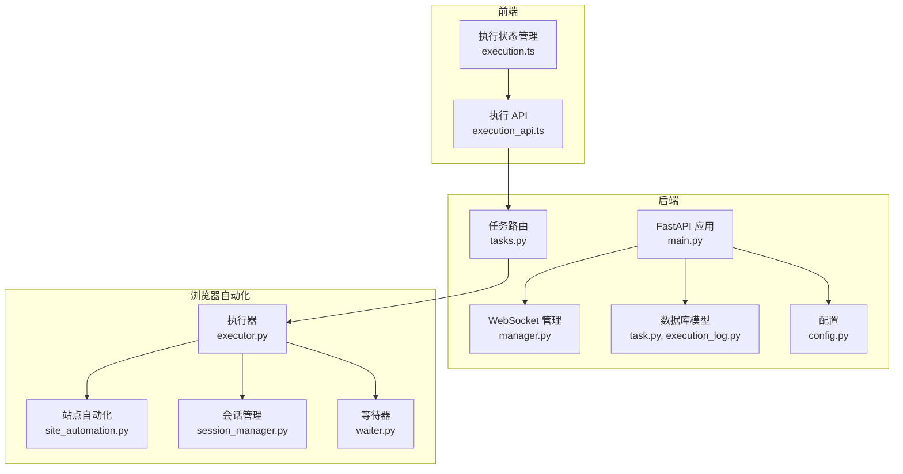
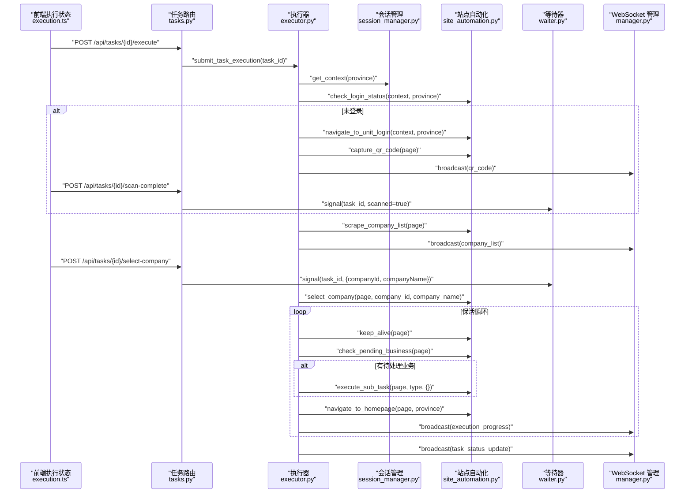
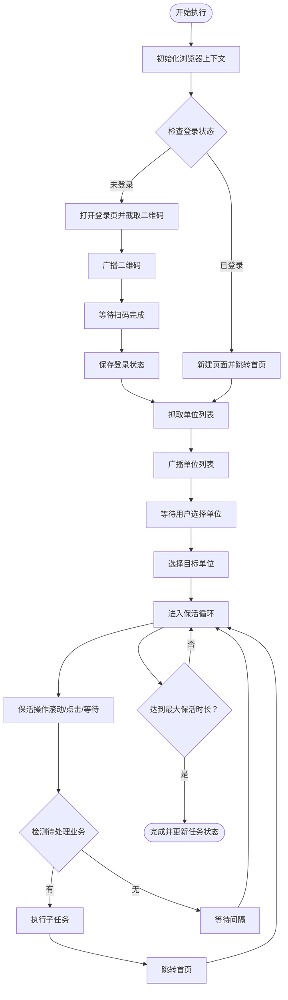
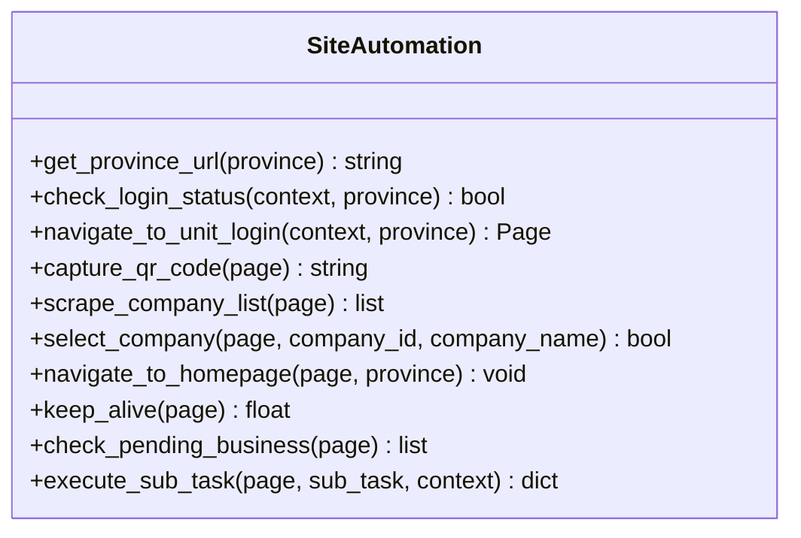
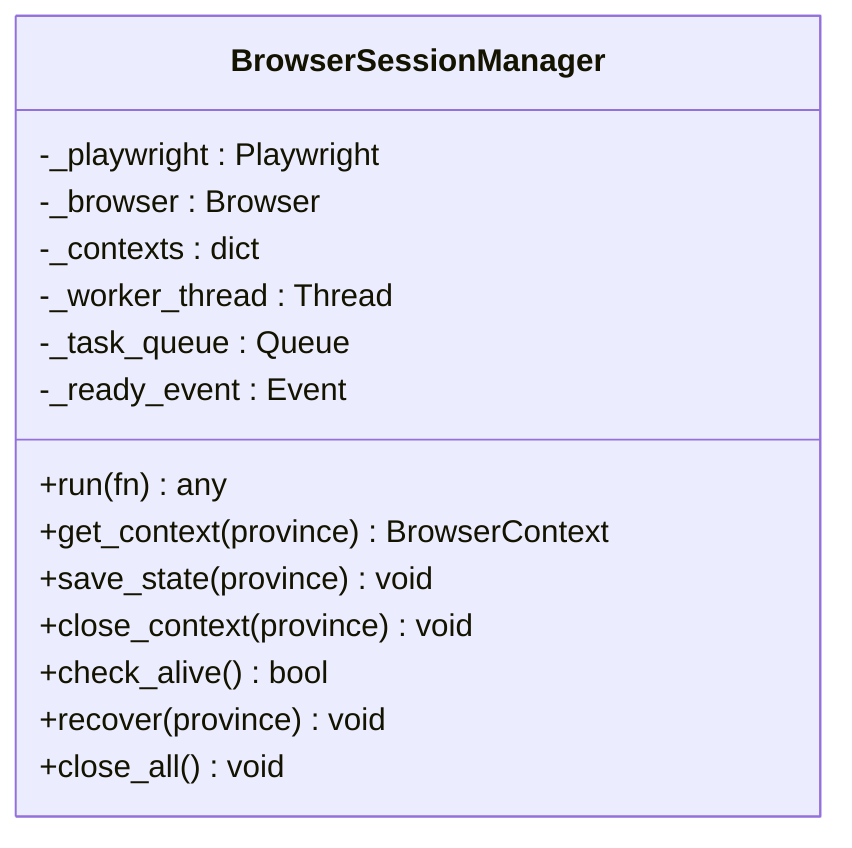
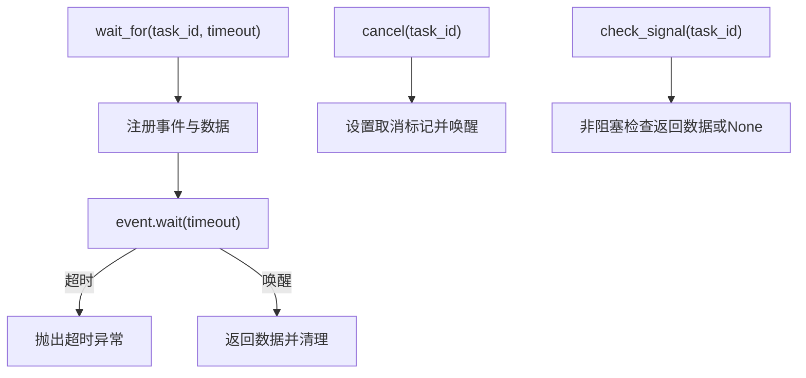
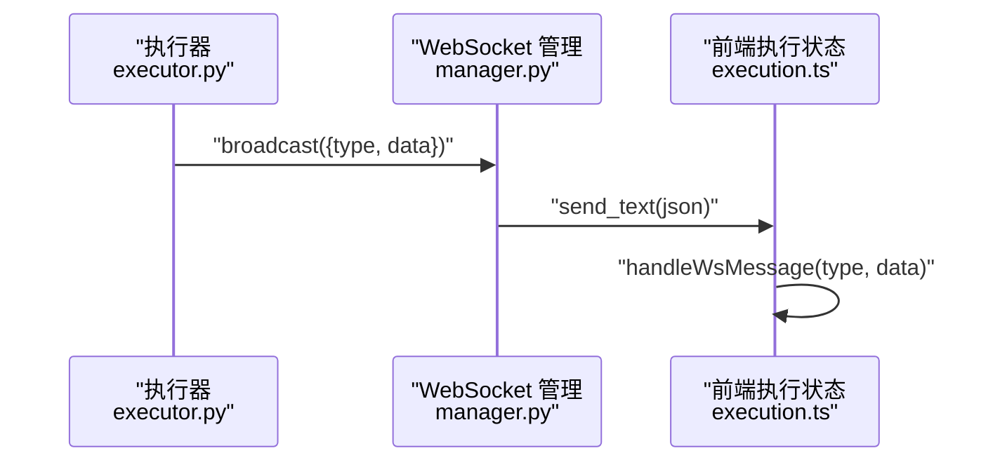
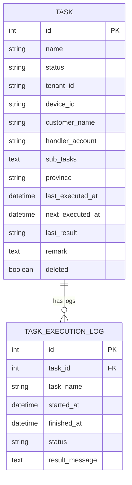
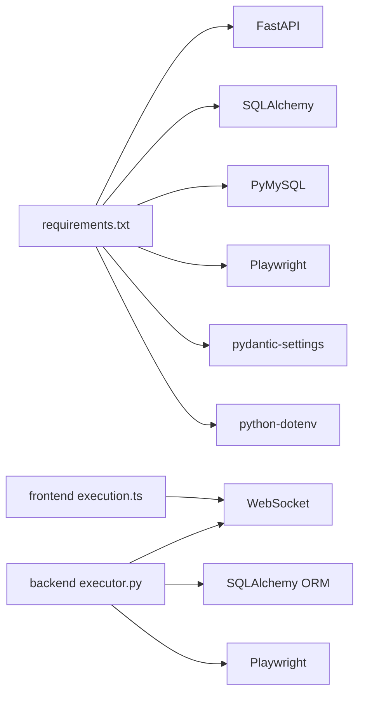

# AI 智能驱动

<cite>
**本文档引用的文件**
- [main.py](file://CCC_RPA_API/app/main.py)
- [executor.py](file://CCC_RPA_API/app/services/executor.py)
- [site_automation.py](file://CCC_RPA_API/app/browser/site_automation.py)
- [session_manager.py](file://CCC_RPA_API/app/browser/session_manager.py)
- [waiter.py](file://CCC_RPA_API/app/browser/waiter.py)
- [task.py](file://CCC_RPA_API/app/models/task.py)
- [execution_log.py](file://CCC_RPA_API/app/models/execution_log.py)
- [tasks.py](file://CCC_RPA_API/app/api/tasks.py)
- [manager.py](file://CCC_RPA_API/app/ws/manager.py)
- [execution.ts](file://CCC-BrowserV4/frontend/src/stores/execution.ts)
- [execution_api.ts](file://CCC-BrowserV4/frontend/src/api/execution.ts)
- [requirements.txt](file://CCC_RPA_API/requirements.txt)
- [config.py](file://CCC_RPA_API/app/config.py)
- [project.md](file://project.md)
</cite>

## 目录
1. [简介](#简介)
2. [项目结构](#项目结构)
3. [核心组件](#核心组件)
4. [架构总览](#架构总览)
5. [详细组件分析](#详细组件分析)
6. [依赖关系分析](#依赖关系分析)
7. [性能考虑](#性能考虑)
8. [故障排查指南](#故障排查指南)
9. [结论](#结论)
10. [附录](#附录)

## 简介
本项目是“AI 智能驱动系统”的核心实现之一，聚焦于基于 Ollama 的本地大语言模型推理服务与浏览器自动化执行器的集成。系统通过自然语言指令解析、页面操作生成与智能决策机制，实现对目标站点（以 122.gov.cn 省份平台为例）的自动化业务处理。执行器采用多步骤操作序列生成、弹窗与验证码识别处理、自适应流程调整以及失败重试机制，确保在复杂页面结构下的稳健执行。

同时，系统具备完善的视觉识别能力（YOLOv8 页面元素检测、PaddleOCR 文字识别与图像预处理）、结构化数据抽取模块（DOM 解析、抽取规则匹配、JSON 生成），以及租户独立向量记忆库（SQLite 单机存储与 Milvus 集群向量库）的设计思路。后端采用 FastAPI + Playwright，前端提供 Vue3 + Tauri 桌面应用，WebSocket 实现实时状态广播与用户交互。

## 项目结构
整体采用前后端分离与微服务化的分层架构：
- 后端（Python FastAPI）：API 路由、任务执行器、浏览器会话管理、WebSocket 管理、数据库模型与配置
- 前端（Vue3 + Tauri）：执行状态管理、WebSocket 消息处理、用户交互（扫码、单位选择、取消）
- 浏览器自动化：Playwright + Chromium，按省份维护独立会话，持久化登录状态

**图表来源**
- [main.py:1-127](file://CCC_RPA_API/app/main.py#L1-L127)
- [tasks.py:1-76](file://CCC_RPA_API/app/api/tasks.py#L1-L76)
- [executor.py:1-308](file://CCC_RPA_API/app/services/executor.py#L1-L308)
- [site_automation.py:1-562](file://CCC_RPA_API/app/browser/site_automation.py#L1-L562)
- [session_manager.py:1-183](file://CCC_RPA_API/app/browser/session_manager.py#L1-L183)
- [waiter.py:1-84](file://CCC_RPA_API/app/browser/waiter.py#L1-L84)
- [manager.py:1-29](file://CCC_RPA_API/app/ws/manager.py#L1-L29)
- [task.py:1-25](file://CCC_RPA_API/app/models/task.py#L1-L25)
- [execution_log.py:1-17](file://CCC_RPA_API/app/models/execution_log.py#L1-L17)
- [config.py:1-22](file://CCC_RPA_API/app/config.py#L1-L22)

**章节来源**
- [main.py:1-127](file://CCC_RPA_API/app/main.py#L1-L127)
- [project.md:383-412](file://project.md#L383-L412)

## 核心组件
- 执行器（executor）：负责任务生命周期管理、浏览器会话初始化、扫码登录、单位选择、保活循环、业务触发与结果回传
- 站点自动化（site_automation）：封装页面登录、二维码截取、单位列表抓取、单位选择、保活、待处理业务检测与子任务执行
- 会话管理（session_manager）：按省份管理 Playwright 浏览器上下文，持久化 storage_state，专用工作线程执行 Playwright 操作
- 等待器（waiter）：基于 threading.Event 的用户交互阻塞/唤醒机制，支持取消信号与非阻塞检查
- WebSocket 管理（manager）：集中管理连接与广播消息，供前端实时展示执行进度
- 数据模型（task、execution_log）：任务与执行日志的 ORM 映射，支持状态与结果持久化
- API 路由（tasks）：提供任务 CRUD、执行、日志查询与用户交互信号接口

**章节来源**
- [executor.py:68-308](file://CCC_RPA_API/app/services/executor.py#L68-L308)
- [site_automation.py:16-562](file://CCC_RPA_API/app/browser/site_automation.py#L16-L562)
- [session_manager.py:7-183](file://CCC_RPA_API/app/browser/session_manager.py#L7-L183)
- [waiter.py:7-84](file://CCC_RPA_API/app/browser/waiter.py#L7-L84)
- [manager.py:1-29](file://CCC_RPA_API/app/ws/manager.py#L1-L29)
- [task.py:8-25](file://CCC_RPA_API/app/models/task.py#L8-L25)
- [execution_log.py:7-17](file://CCC_RPA_API/app/models/execution_log.py#L7-L17)
- [tasks.py:1-76](file://CCC_RPA_API/app/api/tasks.py#L1-L76)

## 架构总览
系统围绕“自然语言 → LLM 解析 → 视觉识别 → 结构化抽取 → 自动化执行”的闭环展开。前端通过 WebSocket 接收后端广播的状态消息，用户在前端完成扫码与单位选择等交互，后端通过执行器协调浏览器自动化与等待器，实现端到端的智能驱动。

**图表来源**
- [executor.py:68-308](file://CCC_RPA_API/app/services/executor.py#L68-L308)
- [site_automation.py:38-562](file://CCC_RPA_API/app/browser/site_automation.py#L38-L562)
- [session_manager.py:96-123](file://CCC_RPA_API/app/browser/session_manager.py#L96-L123)
- [waiter.py:14-84](file://CCC_RPA_API/app/browser/waiter.py#L14-L84)
- [manager.py:17-26](file://CCC_RPA_API/app/ws/manager.py#L17-L26)
- [tasks.py:47-76](file://CCC_RPA_API/app/api/tasks.py#L47-L76)

## 详细组件分析

### 执行器（executor）
- 线程池设计：使用 ThreadPoolExecutor 管理任务执行与阻塞等待，避免阻塞 Playwright 工作线程
- 会话恢复：在关键步骤前检查浏览器存活，异常时自动恢复并重新打开目标页面
- 用户交互：通过 ExecutionWaiter 在独立线程中等待扫码完成与单位选择，支持超时与取消
- 保活循环：随机滚动、点击刷新、随机等待，维持页面活跃，检测待处理业务并执行子任务
- 状态广播：通过 WebSocket 广播执行进度、错误、任务状态更新，前端实时展示

**图表来源**
- [executor.py:68-308](file://CCC_RPA_API/app/services/executor.py#L68-L308)
- [site_automation.py:38-562](file://CCC_RPA_API/app/browser/site_automation.py#L38-L562)
- [waiter.py:14-84](file://CCC_RPA_API/app/browser/waiter.py#L14-L84)

**章节来源**
- [executor.py:1-308](file://CCC_RPA_API/app/services/executor.py#L1-L308)

### 站点自动化（site_automation）
- 登录状态检查：访问省份主页，通过可见元素判断是否已登录
- 登录页导航：优先直连统一登录页，失败则通过首页 JS 强制点击进入登录页
- 二维码截取：优先元素截图，失败则整页降级截图，返回 base64 数据供前端显示
- 单位列表抓取：多级选择器降级策略，从多种列表结构中提取单位名称与信用代码
- 单位选择：多策略匹配（data-id、文本、名称、索引），点击目标元素并等待加载
- 保活与待处理业务：随机保活动作与徽章/文本关键词检测，识别待处理业务类型
- 子任务执行：占位实现，后续替换为实际自动化逻辑

**图表来源**
- [site_automation.py:16-562](file://CCC_RPA_API/app/browser/site_automation.py#L16-L562)

**章节来源**
- [site_automation.py:1-562](file://CCC_RPA_API/app/browser/site_automation.py#L1-L562)

### 会话管理（session_manager）
- 专用工作线程：启动 Playwright 与 Chromium，所有 Playwright 操作在专用线程中执行，避免线程冲突
- 按省份上下文：为每个省份维护独立 BrowserContext，自动加载 storage_state 持久化登录
- 会话恢复：检测浏览器断开后自动重建，清理旧上下文并重新初始化
- 关闭策略：支持关闭指定上下文与全部浏览器资源，用于优雅停机

**图表来源**
- [session_manager.py:7-183](file://CCC_RPA_API/app/browser/session_manager.py#L7-L183)

**章节来源**
- [session_manager.py:1-183](file://CCC_RPA_API/app/browser/session_manager.py#L1-L183)

### 等待器（waiter）
- 阻塞等待：为任务注册事件，等待用户扫码完成或选择单位
- 唤醒与取消：支持信号唤醒与取消标记，非阻塞检查用于保活循环
- 资源清理：任务结束后清理事件与数据，避免内存泄漏

**图表来源**
- [waiter.py:14-84](file://CCC_RPA_API/app/browser/waiter.py#L14-L84)

**章节来源**
- [waiter.py:1-84](file://CCC_RPA_API/app/browser/waiter.py#L1-L84)

### WebSocket 管理（manager）
- 连接管理：接受 WebSocket 连接并维护连接集合
- 广播机制：遍历连接发送消息，清理异常连接
- 与执行器协作：执行器通过广播消息向前端推送执行进度、二维码、错误与任务状态

**图表来源**
- [manager.py:17-26](file://CCC_RPA_API/app/ws/manager.py#L17-L26)
- [executor.py:22-32](file://CCC_RPA_API/app/services/executor.py#L22-L32)
- [execution.ts:22-67](file://CCC-BrowserV4/frontend/src/stores/execution.ts#L22-L67)

**章节来源**
- [manager.py:1-29](file://CCC_RPA_API/app/ws/manager.py#L1-L29)

### 数据模型与 API
- 任务模型：包含任务基本信息、租户与设备标识、子任务、省/地区、执行计划与结果
- 执行日志模型：记录任务执行开始/结束时间、状态与结果消息
- 任务 API：提供任务 CRUD、执行、日志查询与用户交互信号接口（扫码完成、选择单位、取消执行）

**图表来源**
- [task.py:8-25](file://CCC_RPA_API/app/models/task.py#L8-L25)
- [execution_log.py:7-17](file://CCC_RPA_API/app/models/execution_log.py#L7-L17)

**章节来源**
- [task.py:1-25](file://CCC_RPA_API/app/models/task.py#L1-L25)
- [execution_log.py:1-17](file://CCC_RPA_API/app/models/execution_log.py#L1-L17)
- [tasks.py:1-76](file://CCC_RPA_API/app/api/tasks.py#L1-L76)

## 依赖关系分析
- 后端依赖：FastAPI、SQLAlchemy、PyMySQL、Playwright、pydantic-settings、python-dotenv
- 前端依赖：Vue3、Pinia、WebSocket、Tauri（桌面端）
- 浏览器自动化：Playwright + Chromium，按省份隔离上下文，持久化登录状态
- WebSocket：后端统一管理连接与广播，前端订阅执行状态

**图表来源**
- [requirements.txt:1-11](file://CCC_RPA_API/requirements.txt#L1-L11)
- [execution.ts:1-229](file://CCC-BrowserV4/frontend/src/stores/execution.ts#L1-L229)
- [executor.py:1-308](file://CCC_RPA_API/app/services/executor.py#L1-L308)

**章节来源**
- [requirements.txt:1-11](file://CCC_RPA_API/requirements.txt#L1-L11)
- [config.py:6-22](file://CCC_RPA_API/app/config.py#L6-L22)

## 性能考虑
- 线程隔离：Playwright 操作在专用线程执行，避免与 asyncio 事件循环冲突
- 会话复用：按省份持久化 storage_state，减少重复登录开销
- 保活策略：随机保活动作与等待间隔，降低风控检测概率，同时保证执行效率
- 超时与重试：等待器支持超时与取消，执行器在关键步骤前检查浏览器存活并自动恢复
- WebSocket 广播：集中管理连接，避免广播风暴，清理异常连接

[本节为通用性能讨论，不直接分析具体文件]

## 故障排查指南
- 浏览器断开：执行器在关键步骤前检查浏览器存活，异常时自动恢复并重新打开页面
- 登录失败：确认二维码截取与前端扫码流程，检查登录页导航策略与等待条件
- 单位列表为空：检查页面结构变化与选择器降级策略，必要时更新选择器
- 用户交互超时：检查前端 WebSocket 连接与后端等待器注册，确认信号发送与清理
- 数据库连接：检查配置文件中的数据库连接参数与环境变量

**章节来源**
- [executor.py:42-59](file://CCC_RPA_API/app/services/executor.py#L42-L59)
- [site_automation.py:38-562](file://CCC_RPA_API/app/browser/site_automation.py#L38-L562)
- [waiter.py:14-84](file://CCC_RPA_API/app/browser/waiter.py#L14-L84)
- [config.py:6-22](file://CCC_RPA_API/app/config.py#L6-L22)

## 结论
本系统通过“自然语言 → LLM 解析 → 视觉识别 → 结构化抽取 → 自动化执行”的闭环，实现了对复杂网页业务的智能驱动。执行器在多线程环境下协调浏览器自动化与用户交互，具备完善的保活、恢复与重试机制。前端通过 WebSocket 实时反馈执行状态，形成良好的人机协作体验。系统遵循多租户隔离与本地 AI 推理原则，满足商用级安全与性能要求。

[本节为总结性内容，不直接分析具体文件]

## 附录
- AI 服务部署配置要点
  - 使用 Ollama 作为本地推理底座，支持 GPU/CPU 双模式
  - 视觉识别模块（YOLOv8 + PaddleOCR）离线部署，确保数据不出内网
  - 结构化数据抽取模块基于 DOM 解析与规则匹配，输出标准化 JSON
  - 租户独立向量记忆库：单机 SQLite 与集群 Milvus 可选
- 性能优化建议
  - 合理设置 Playwright 工作线程数量与保活间隔
  - 使用 storage_state 持久化登录，减少重复认证
  - 选择器降级策略与异常重试机制提升鲁棒性
- 监控告警策略
  - Prometheus 指标采集（CPU、内存、会话崩溃、AI 推理耗时）
  - Grafana 可视化与 ELK 审计日志，异常告警推送

**章节来源**
- [project.md:383-412](file://project.md#L383-L412)
- [project.md:504-551](file://project.md#L504-L551)
- [project.md:425-434](file://project.md#L425-L434)