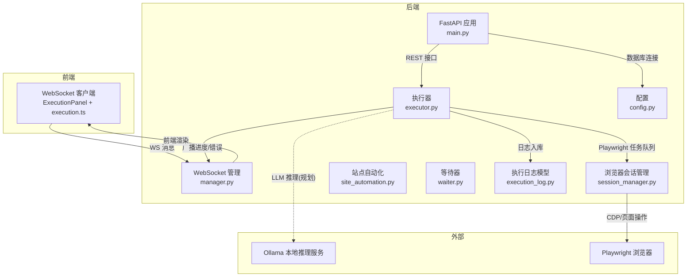
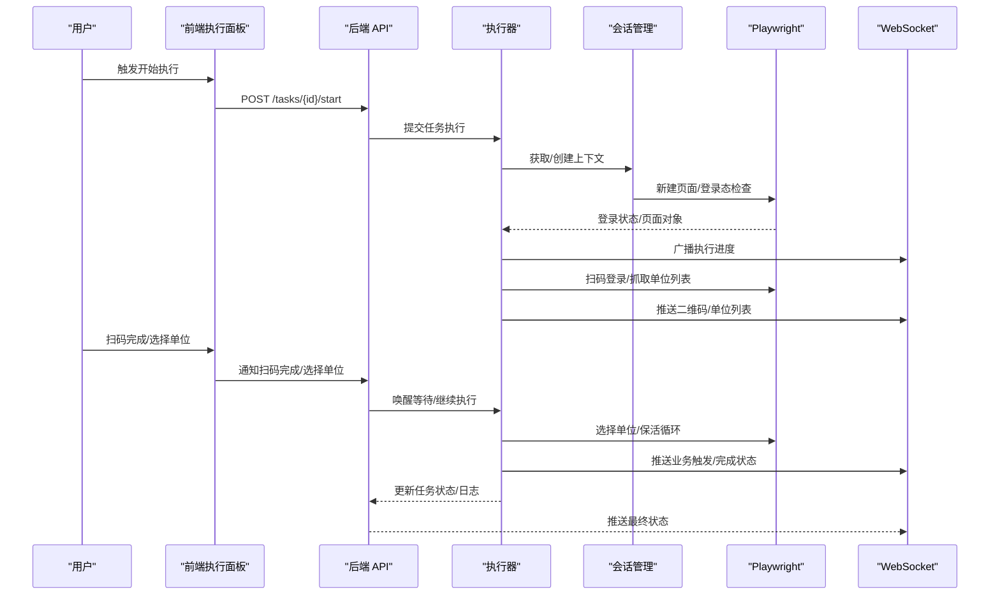
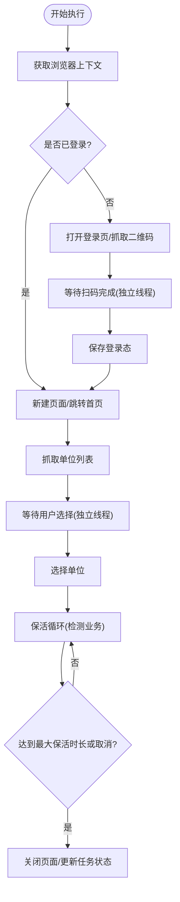
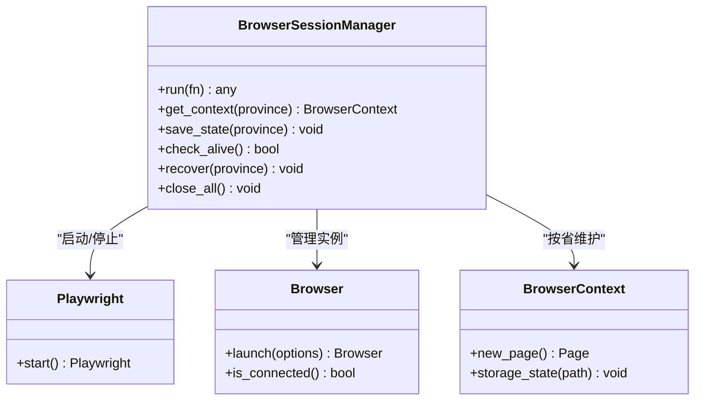
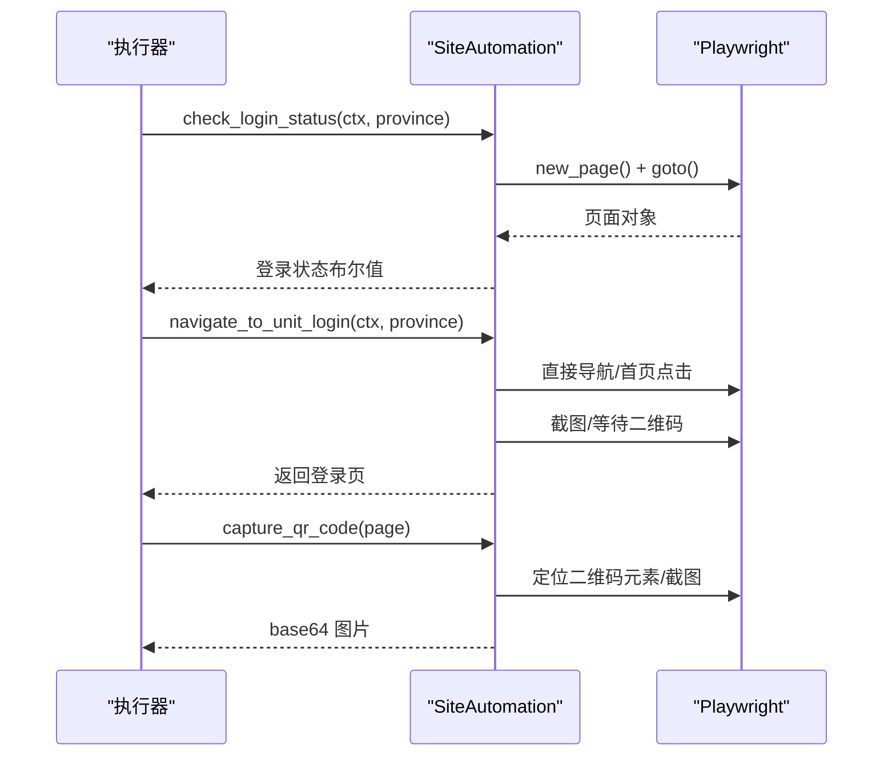
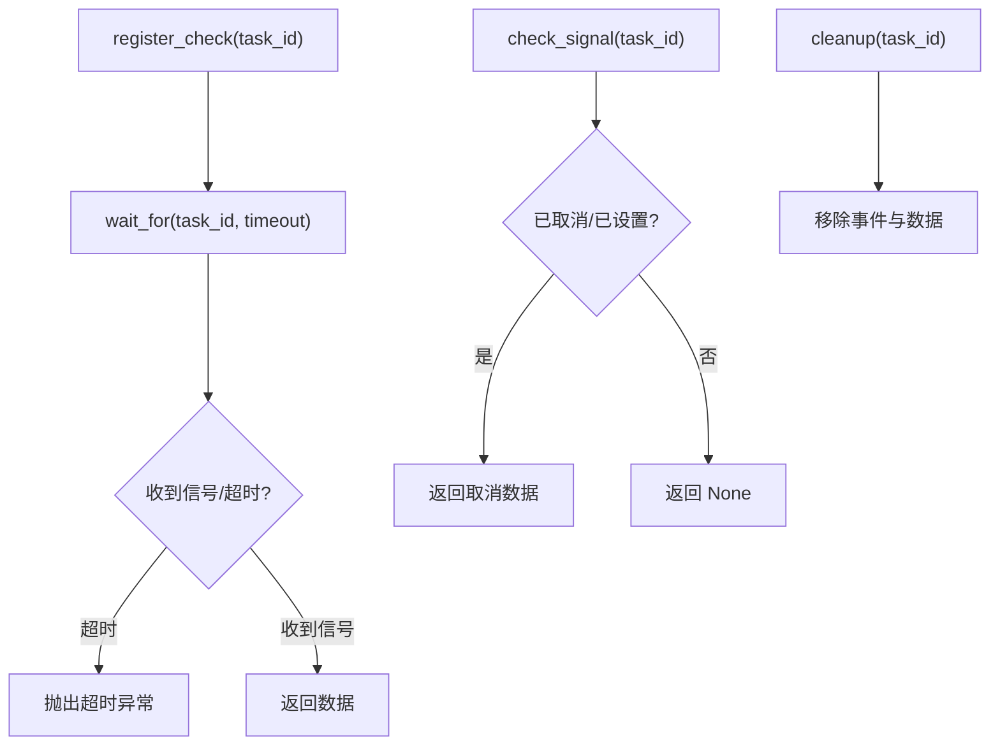
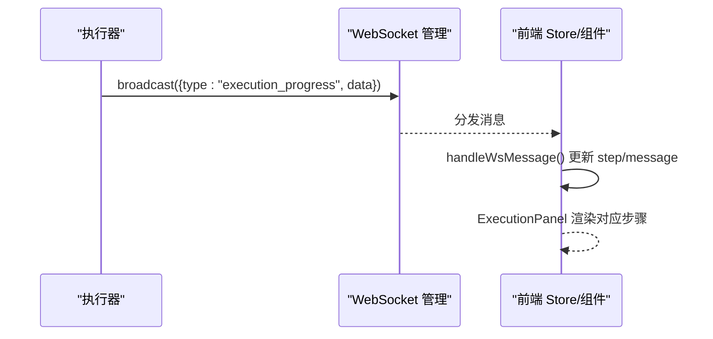
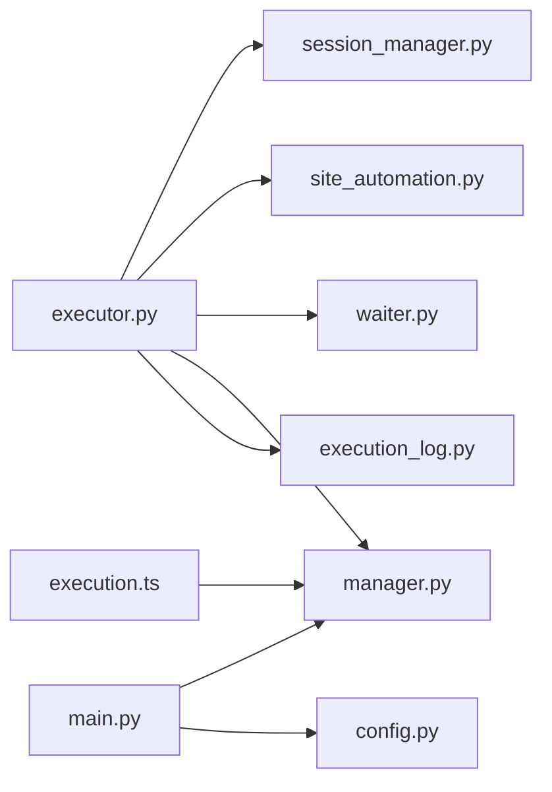

# LLM 推理引擎

<cite>
**本文引用的文件**
- [main.py](file://CCC_RPA_API/app/main.py)
- [config.py](file://CCC_RPA_API/app/config.py)
- [executor.py](file://CCC_RPA_API/app/services/executor.py)
- [site_automation.py](file://CCC_RPA_API/app/browser/site_automation.py)
- [session_manager.py](file://CCC_RPA_API/app/browser/session_manager.py)
- [waiter.py](file://CCC_RPA_API/app/browser/waiter.py)
- [execution_log.py](file://CCC_RPA_API/app/models/execution_log.py)
- [manager.py](file://CCC_RPA_API/app/ws/manager.py)
- [execution.ts](file://CCC-BrowserV4/frontend/src/stores/execution.ts)
- [execution.ts](file://CCC-RPA_API/app/schemas/execution_log.py)
- [execution-panel.vue](file://CCC-BrowserV4/frontend/src/components/ExecutionPanel.vue)
- [execution-api.ts](file://CCC-BrowserV4/frontend/src/api/execution.ts)
- [project.md](file://project.md)
</cite>

## 目录
1. [简介](#简介)
2. [项目结构](#项目结构)
3. [核心组件](#核心组件)
4. [架构总览](#架构总览)
5. [组件详解](#组件详解)
6. [依赖关系分析](#依赖关系分析)
7. [性能与成本优化](#性能与成本优化)
8. [故障排查指南](#故障排查指南)
9. [结论](#结论)
10. [附录](#附录)

## 简介
本文件面向“基于 Ollama 的本地大语言模型集成”的 RPA 推理引擎，系统化梳理从自然语言指令到页面操作的端到端流程，涵盖模型加载、提示词工程、响应解析、意图识别、操作序列生成、错误恢复、上下文与状态管理、以及性能与成本控制策略。文档以仓库现有实现为基础，结合项目文档中的接口契约与能力描述，给出可落地的技术说明与实践建议。

## 项目结构
后端采用 FastAPI 提供 REST/WS 接口，前端使用 Vue3 + Pinia 构建执行面板，浏览器自动化由 Playwright 管理，WebSocket 实时推送执行状态。项目文档明确了 AI 推理服务、视觉识别与结构化抽取的 GRPC 接口契约，以及 Ollama 的封装边界。

图表来源
- [main.py:12-127](file://CCC_RPA_API/app/main.py#L12-L127)
- [manager.py:1-29](file://CCC_RPA_API/app/ws/manager.py#L1-L29)
- [executor.py:68-308](file://CCC_RPA_API/app/services/executor.py#L68-L308)
- [session_manager.py:1-183](file://CCC_RPA_API/app/browser/session_manager.py#L1-L183)
- [site_automation.py:1-562](file://CCC_RPA_API/app/browser/site_automation.py#L1-L562)
- [waiter.py:1-84](file://CCC_RPA_API/app/browser/waiter.py#L1-L84)
- [execution_log.py:1-17](file://CCC_RPA_API/app/models/execution_log.py#L1-L17)
- [config.py:1-22](file://CCC_RPA_API/app/config.py#L1-L22)

章节来源
- [main.py:12-127](file://CCC_RPA_API/app/main.py#L12-L127)
- [project.md:445-494](file://project.md#L445-L494)

## 核心组件
- 执行器：负责任务生命周期管理、浏览器上下文获取、扫码登录、单位选择、保活循环、业务触发与收尾。
- 浏览器会话管理：按省份维护 Playwright 上下文，持久化 storage_state，提供线程安全的异步执行队列。
- 站点自动化：封装登录、二维码抓取、单位列表抓取、单位选择、保活、待处理业务检测与子任务执行。
- 等待器：基于 Event 的阻塞/非阻塞等待，支持取消与超时。
- WebSocket 管理：集中管理连接，广播执行进度、错误、二维码等消息。
- 执行日志模型：记录任务执行起止、状态与结果摘要。
- 前端执行面板：根据 WS 消息驱动 UI 状态流转，支持扫码完成、单位选择与取消。

章节来源
- [executor.py:68-308](file://CCC_RPA_API/app/services/executor.py#L68-L308)
- [session_manager.py:1-183](file://CCC_RPA_API/app/browser/session_manager.py#L1-L183)
- [site_automation.py:1-562](file://CCC_RPA_API/app/browser/site_automation.py#L1-L562)
- [waiter.py:1-84](file://CCC_RPA_API/app/browser/waiter.py#L1-L84)
- [manager.py:1-29](file://CCC_RPA_API/app/ws/manager.py#L1-L29)
- [execution_log.py:1-17](file://CCC_RPA_API/app/models/execution_log.py#L1-L17)
- [execution.ts:1-229](file://CCC-BrowserV4/frontend/src/stores/execution.ts#L1-L229)

## 架构总览
推理引擎以“自然语言指令”为入口，经由后端执行器协调浏览器自动化与 WebSocket 通知，形成闭环。项目文档明确了 AI 推理服务的 GRPC 方法（ParsePageTask、ExtractStructData、OCRImage），以及对外 REST/WS 接口契约，确保与 Ollama 的集成边界清晰。

图表来源
- [executor.py:68-308](file://CCC_RPA_API/app/services/executor.py#L68-L308)
- [session_manager.py:77-123](file://CCC_RPA_API/app/browser/session_manager.py#L77-L123)
- [site_automation.py:38-192](file://CCC_RPA_API/app/browser/site_automation.py#L38-L192)
- [manager.py:17-26](file://CCC_RPA_API/app/ws/manager.py#L17-L26)
- [execution.ts:69-120](file://CCC-BrowserV4/frontend/src/stores/execution.ts#L69-L120)

章节来源
- [project.md:445-494](file://project.md#L445-L494)

## 组件详解

### 执行器：任务生命周期与错误恢复
- 生命周期：初始化浏览器上下文 → 登录态检查/扫码登录 → 抓取单位列表 → 等待用户选择 → 选择单位 → 保活循环（检测待处理业务）→ 完成/失败收尾。
- 错误恢复：检测浏览器存活，异常时恢复会话并重新打开目标页面；等待用户输入采用独立线程避免阻塞；广播进度/错误，保证前端可观测。
- 状态持久化：任务状态、上次执行时间、下次执行时间、结果摘要写入数据库；执行日志模型记录起止与状态。

图表来源
- [executor.py:68-308](file://CCC_RPA_API/app/services/executor.py#L68-L308)
- [site_automation.py:38-192](file://CCC_RPA_API/app/browser/site_automation.py#L38-L192)

章节来源
- [executor.py:68-308](file://CCC_RPA_API/app/services/executor.py#L68-L308)
- [execution_log.py:1-17](file://CCC_RPA_API/app/models/execution_log.py#L1-L17)

### 浏览器会话管理：上下文与状态持久化
- 专用工作线程：启动 Playwright/Chromium，所有 Playwright 操作通过队列投递，避免线程冲突。
- 上下文管理：按省份维护 BrowserContext，首次创建时加载 storage_state，支持断线重连后恢复。
- 恢复策略：检测到浏览器断开时，清空上下文并重建，确保后续操作可用。

图表来源
- [session_manager.py:1-183](file://CCC_RPA_API/app/browser/session_manager.py#L1-L183)

章节来源
- [session_manager.py:1-183](file://CCC_RPA_API/app/browser/session_manager.py#L1-L183)

### 站点自动化：页面操作与策略降级
- 登录态检查：新建页面访问目标站点，通过可见元素判断是否已登录。
- 登录流程：优先直连登录页，失败则回退到首页点击；二维码抓取支持元素截图与整页降级。
- 单位选择：多选择器降级策略（data-id/文本/索引），点击前进行鼠标移动与随机延时，模拟真人行为。
- 保活与业务检测：随机滚动/点击/等待，周期性检测徽标与关键词，发现待处理业务后执行对应子任务。

图表来源
- [site_automation.py:38-192](file://CCC_RPA_API/app/browser/site_automation.py#L38-L192)

章节来源
- [site_automation.py:1-562](file://CCC_RPA_API/app/browser/site_automation.py#L1-L562)

### 等待器：阻塞与非阻塞等待
- 阻塞等待：等待用户扫码完成或选择单位，支持超时与取消。
- 非阻塞检查：保活循环中轮询取消信号，避免长时间阻塞。
- 资源清理：任务结束时清理事件与数据，防止内存泄漏。

图表来源
- [waiter.py:14-84](file://CCC_RPA_API/app/browser/waiter.py#L14-L84)

章节来源
- [waiter.py:1-84](file://CCC_RPA_API/app/browser/waiter.py#L1-L84)

### WebSocket 管理与前端执行面板
- 后端广播：执行器通过广播发送“二维码”“单位列表”“执行进度”“错误”“任务状态更新”等消息。
- 前端状态：Pinia Store 根据消息类型更新 UI 步骤与提示；支持扫码完成、单位选择、取消执行与演示模式。
- 组件渲染：根据当前步骤渲染不同 UI 片段，提供交互按钮与动画反馈。

图表来源
- [executor.py:22-32](file://CCC_RPA_API/app/services/executor.py#L22-L32)
- [manager.py:17-26](file://CCC_RPA_API/app/ws/manager.py#L17-L26)
- [execution.ts:22-67](file://CCC-BrowserV4/frontend/src/stores/execution.ts#L22-L67)
- [execution-panel.vue:1-322](file://CCC-BrowserV4/frontend/src/components/ExecutionPanel.vue#L1-L322)

章节来源
- [manager.py:1-29](file://CCC_RPA_API/app/ws/manager.py#L1-L29)
- [execution.ts:1-229](file://CCC-BrowserV4/frontend/src/stores/execution.ts#L1-L229)
- [execution-panel.vue:1-322](file://CCC-BrowserV4/frontend/src/components/ExecutionPanel.vue#L1-L322)

## 依赖关系分析
- 执行器依赖会话管理器进行浏览器操作，依赖等待器进行用户交互阻塞与取消检查，依赖站点自动化封装页面操作。
- WebSocket 管理器被执行器调用以广播状态，前端 Store 与组件订阅 WS 消息。
- 数据库配置与模型为任务与日志提供持久化支撑。

图表来源
- [executor.py:1-308](file://CCC_RPA_API/app/services/executor.py#L1-L308)
- [session_manager.py:1-183](file://CCC_RPA_API/app/browser/session_manager.py#L1-L183)
- [site_automation.py:1-562](file://CCC_RPA_API/app/browser/site_automation.py#L1-L562)
- [waiter.py:1-84](file://CCC_RPA_API/app/browser/waiter.py#L1-L84)
- [manager.py:1-29](file://CCC_RPA_API/app/ws/manager.py#L1-L29)
- [execution_log.py:1-17](file://CCC_RPA_API/app/models/execution_log.py#L1-L17)
- [main.py:1-127](file://CCC_RPA_API/app/main.py#L1-L127)
- [config.py:1-22](file://CCC_RPA_API/app/config.py#L1-L22)
- [execution.ts:1-229](file://CCC-BrowserV4/frontend/src/stores/execution.ts#L1-L229)

章节来源
- [main.py:1-127](file://CCC_RPA_API/app/main.py#L1-L127)
- [config.py:1-22](file://CCC_RPA_API/app/config.py#L1-L22)

## 性能与成本优化
- 模型与推理
  - 使用 Ollama 的本地推理接口，支持 GPU/CPU 双模式，满足离线与低延迟要求。
  - 单条自然语言指令推理响应时间目标：7B 本地模型 ≤1.5s。
- 浏览器与会话
  - Playwright 在专用线程执行，避免与 asyncio 事件循环冲突；按省维护上下文，减少重复登录成本。
  - storage_state 持久化，缩短会话恢复时间。
- 网络与并发
  - WebSocket 长连接支持 ≥1000 路在线；API 网关单接口 QPS≥100。
  - 保活间隔随机化（30~120s），降低风控风险。
- 成本控制
  - 本地模型与浏览器沙箱单机部署，减少云端推理与代理费用。
  - 会话超时控制（最大保活时长 8h），避免资源长期占用。
- 可靠性
  - 会话崩溃隔离与自动销毁；AI 推理超时返回标准化错误；数据库主从与读写分离。

章节来源
- [project.md:506-516](file://project.md#L506-L516)
- [session_manager.py:39-74](file://CCC_RPA_API/app/browser/session_manager.py#L39-L74)
- [site_automation.py:436-499](file://CCC_RPA_API/app/browser/site_automation.py#L436-L499)

## 故障排查指南
- 浏览器断开
  - 现象：页面元素定位失败、操作报错。
  - 处理：执行器内置恢复逻辑，检测存活后重建上下文与页面；前端提示“浏览器异常，正在恢复…”。
- 登录失败/二维码异常
  - 现象：二维码未出现或无法识别。
  - 处理：降级策略抓取整页截图；确认登录页 URL 与元素选择器；检查网络与代理。
- 用户取消/超时
  - 现象：扫码等待/单位选择超时；用户主动取消。
  - 处理：等待器抛出超时异常；前端显示“已取消执行”或“执行失败”。
- 日志与审计
  - 使用执行日志模型记录起止与结果摘要；后端广播错误消息；前端 Store 记录当前任务与步骤。

章节来源
- [executor.py:42-59](file://CCC_RPA_API/app/services/executor.py#L42-L59)
- [site_automation.py:148-173](file://CCC_RPA_API/app/browser/site_automation.py#L148-L173)
- [waiter.py:14-32](file://CCC_RPA_API/app/browser/waiter.py#L14-L32)
- [execution.ts:50-66](file://CCC-BrowserV4/frontend/src/stores/execution.ts#L50-L66)

## 结论
该推理引擎以“任务驱动 + 浏览器自动化 + WebSocket 实时反馈”为核心，结合 Playwright 的稳定执行与 Ollama 的本地推理能力，实现了从自然语言到页面操作的闭环。通过上下文持久化、错误恢复、保活与等待机制，系统在复杂业务场景下具备良好的鲁棒性与可观测性。建议在后续迭代中进一步完善 LLM 提示词工程与视觉识别模块的对接，以提升多步骤任务的准确性与稳定性。

## 附录
- 接口契约（节选）
  - 会话创建/销毁、脚本执行、AI 指令下发、截图获取、WS 实时通道等 REST/WS 接口统一。
  - AI 推理 GRPC 方法：ParsePageTask、ExtractStructData、OCRImage。
- 安全与合规
  - 会话隔离、传输加密、存储加密、审计日志与防检测策略。

章节来源
- [project.md:445-494](file://project.md#L445-L494)
- [project.md:518-530](file://project.md#L518-L530)