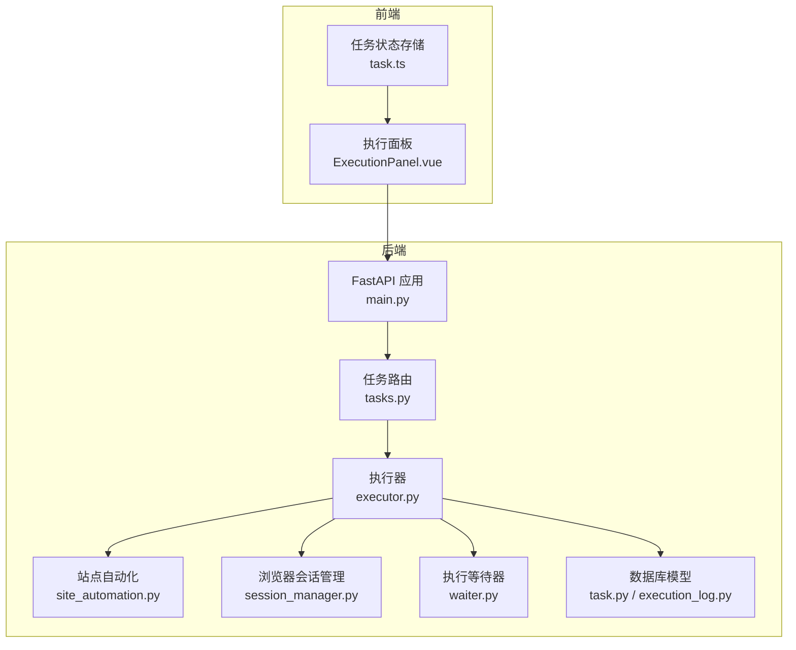
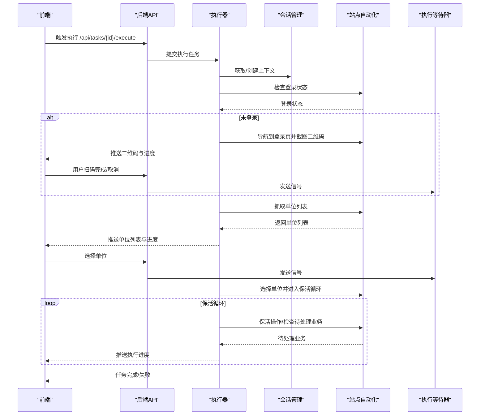
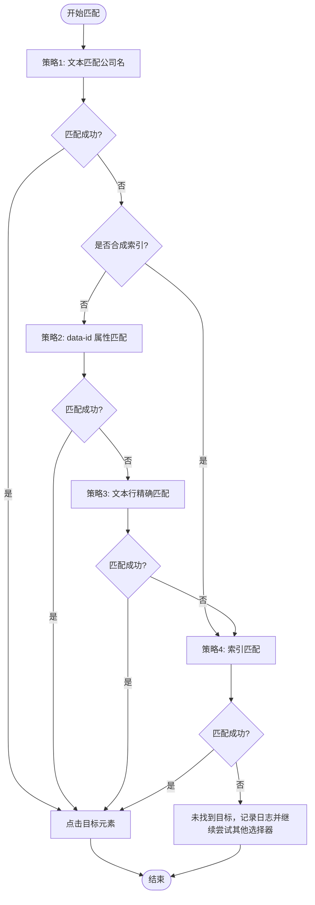
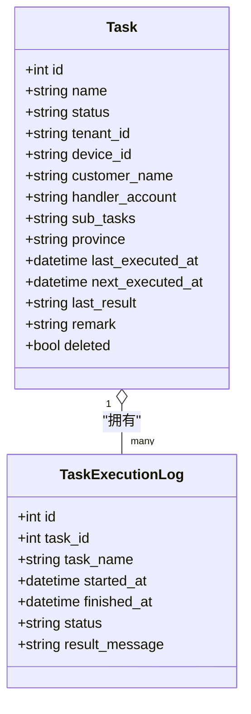
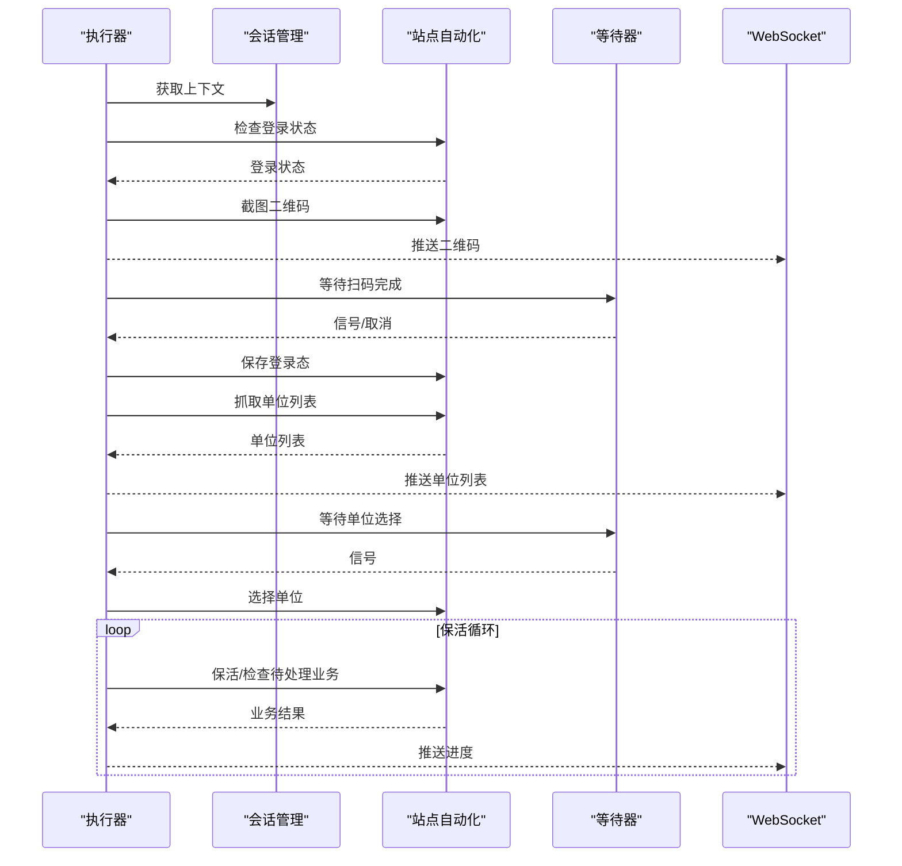
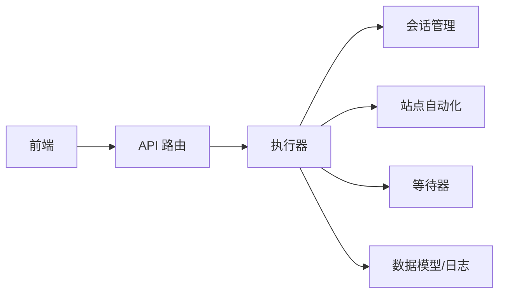

# 结构化数据抽取

<cite>
**本文档引用的文件**
- [main.py](file://CCC_RPA_API/app/main.py)
- [site_automation.py](file://CCC_RPA_API/app/browser/site_automation.py)
- [session_manager.py](file://CCC_RPA_API/app/browser/session_manager.py)
- [executor.py](file://CCC_RPA_API/app/services/executor.py)
- [waiter.py](file://CCC_RPA_API/app/browser/waiter.py)
- [task.py](file://CCC_RPA_API/app/models/task.py)
- [execution_log.py](file://CCC_RPA_API/app/models/execution_log.py)
- [tasks.py](file://CCC_RPA_API/app/api/tasks.py)
- [execution.py](file://CCC_RPA_API/app/schemas/execution.py)
- [task.ts](file://CCC-BrowserV4/frontend/src/stores/task.ts)
- [ExecutionPanel.vue](file://CCC-BrowserV4/frontend/src/components/ExecutionPanel.vue)
</cite>

## 目录
1. [简介](#简介)
2. [项目结构](#项目结构)
3. [核心组件](#核心组件)
4. [架构总览](#架构总览)
5. [详细组件分析](#详细组件分析)
6. [依赖分析](#依赖分析)
7. [性能考虑](#性能考虑)
8. [故障排查指南](#故障排查指南)
9. [结论](#结论)
10. [附录](#附录)

## 简介
本文件面向“结构化数据抽取”主题，聚焦于页面 DOM 解析与元素定位、抽取规则设计、JSON 数据生成、复杂表格与列表处理、性能优化与错误处理等关键技术点。结合仓库中的站点自动化与任务执行链路，系统化梳理从浏览器上下文管理、页面交互、数据抽取到前端展示的完整流程。

## 项目结构
本项目采用前后端分离架构：
- 后端（Python/FastAPI）：负责任务编排、浏览器会话管理、页面自动化、数据抽取与日志记录。
- 前端（Vue/Element Plus）：负责任务状态展示、扫码登录、单位选择、执行进度可视化。

图表来源
- [main.py:12-127](file://CCC_RPA_API/app/main.py#L12-L127)
- [tasks.py:10-76](file://CCC_RPA_API/app/api/tasks.py#L10-L76)
- [executor.py:78-318](file://CCC_RPA_API/app/services/executor.py#L78-L318)
- [site_automation.py:16-586](file://CCC_RPA_API/app/browser/site_automation.py#L16-L586)
- [session_manager.py:7-183](file://CCC_RPA_API/app/browser/session_manager.py#L7-L183)
- [waiter.py:7-84](file://CCC_RPA_API/app/browser/waiter.py#L7-L84)
- [task.py:8-25](file://CCC_RPA_API/app/models/task.py#L8-L25)
- [execution_log.py:7-17](file://CCC_RPA_API/app/models/execution_log.py#L7-L17)

章节来源
- [main.py:12-127](file://CCC_RPA_API/app/main.py#L12-L127)
- [tasks.py:10-76](file://CCC_RPA_API/app/api/tasks.py#L10-L76)

## 核心组件
- 浏览器会话管理：按省份隔离的 Playwright 上下文，持久化 storage_state，保障登录态复用与恢复。
- 执行器：协调登录检查、扫码、单位选择、保活循环与业务触发，统一广播执行状态。
- 站点自动化：封装页面元素定位、点击、滚动、等待与数据抽取策略，支持降级与容错。
- 执行等待器：基于线程事件的阻塞/取消/检查机制，支撑用户交互与任务中断。
- 数据模型与日志：任务表与执行日志表，记录状态、时间戳与结果摘要。
- 前端集成：WebSocket 接收后端广播，驱动 UI 状态切换与用户交互。

章节来源
- [session_manager.py:7-183](file://CCC_RPA_API/app/browser/session_manager.py#L7-L183)
- [executor.py:78-318](file://CCC_RPA_API/app/services/executor.py#L78-L318)
- [site_automation.py:16-586](file://CCC_RPA_API/app/browser/site_automation.py#L16-L586)
- [waiter.py:7-84](file://CCC_RPA_API/app/browser/waiter.py#L7-L84)
- [task.py:8-25](file://CCC_RPA_API/app/models/task.py#L8-L25)
- [execution_log.py:7-17](file://CCC_RPA_API/app/models/execution_log.py#L7-L17)
- [task.ts:8-84](file://CCC-BrowserV4/frontend/src/stores/task.ts#L8-L84)
- [ExecutionPanel.vue:1-322](file://CCC-BrowserV4/frontend/src/components/ExecutionPanel.vue#L1-L322)

## 架构总览
以下序列图展示从任务执行到页面交互与数据抽取的关键流程：

图表来源
- [tasks.py:47-76](file://CCC_RPA_API/app/api/tasks.py#L47-L76)
- [executor.py:78-318](file://CCC_RPA_API/app/services/executor.py#L78-L318)
- [site_automation.py:38-586](file://CCC_RPA_API/app/browser/site_automation.py#L38-L586)
- [session_manager.py:96-123](file://CCC_RPA_API/app/browser/session_manager.py#L96-L123)
- [waiter.py:14-84](file://CCC_RPA_API/app/browser/waiter.py#L14-L84)

## 详细组件分析

### 组件A：DOM解析与元素定位（CSS选择器、XPath与智能匹配）
- CSS选择器策略
  - 列表容器与卡片布局：针对常见容器选择器进行降级尝试，覆盖多种结构形态，提升鲁棒性。
  - 表格行与通用项：同时尝试 tr[data-id]、tr[role="row"]、ul > li、div[class*="list"] > div 等。
- 智能匹配算法
  - 多策略匹配：优先通过公司名称文本匹配；若非合成索引，再尝试 data-id 属性与文本行精确匹配；最后降级为索引匹配。
  - 边界与容错：对 bounding_box 缺失场景进行降级点击；对元素不可见或异常进行日志记录与继续尝试。
- XPath 使用现状
  - 代码中未直接使用 XPath 表达式；主要依赖 Playwright 的 locator 与 CSS 选择器组合。
- 正则表达式与模板
  - 在单位列表与业务检测中使用正则辅助识别统一社会信用代码与关键字模式，作为抽取规则的一部分。

图表来源
- [site_automation.py:294-443](file://CCC_RPA_API/app/browser/site_automation.py#L294-L443)

章节来源
- [site_automation.py:213-291](file://CCC_RPA_API/app/browser/site_automation.py#L213-L291)
- [site_automation.py:294-443](file://CCC_RPA_API/app/browser/site_automation.py#L294-L443)

### 组件B：抽取规则设计（正则、模板与动态生成）
- 正则匹配
  - 单位列表：通过正则提取统一社会信用代码，增强字段完整性。
  - 业务检测：使用关键词与正则模式匹配待处理业务类型与计数。
- 模板引擎
  - 代码中未发现显式的模板引擎使用；抽取逻辑以规则与策略为主。
- 动态规则生成
  - 通过降级选择器列表与多策略匹配实现动态适配不同页面结构，提升稳定性。

章节来源
- [site_automation.py:264-291](file://CCC_RPA_API/app/browser/site_automation.py#L264-L291)
- [site_automation.py:526-578](file://CCC_RPA_API/app/browser/site_automation.py#L526-L578)

### 组件C：JSON数据结构自动生成（字段映射、类型推断与验证）
- 字段映射
  - 单位列表抽取输出包含 id、name、creditCode 字段，映射关系清晰。
- 类型推断
  - 代码中未进行显式的运行时类型推断；字段类型主要由 Pydantic 模型约束与数据库列定义保证。
- 数据验证
  - Pydantic 模型用于请求/响应校验；数据库层约束确保字段长度与空值。
- 日志与结果
  - 执行日志记录任务状态、开始/结束时间与结果摘要，便于回溯与审计。

图表来源
- [task.py:8-25](file://CCC_RPA_API/app/models/task.py#L8-L25)
- [execution_log.py:7-17](file://CCC_RPA_API/app/models/execution_log.py#L7-L17)

章节来源
- [task.py:8-25](file://CCC_RPA_API/app/models/task.py#L8-L25)
- [execution_log.py:7-17](file://CCC_RPA_API/app/models/execution_log.py#L7-L17)
- [execution.py:4-7](file://CCC_RPA_API/app/schemas/execution.py#L4-L7)

### 组件D：复杂表格与列表处理（合并、嵌套与关联）
- 列表处理
  - 通过降级选择器集合覆盖多种布局（列表、表格、卡片），遍历元素并提取文本，再应用规则提取关键字段。
- 表格处理
  - 优先尝试 tr[data-id]、tr[role="row"] 等表格行选择器；对单元格内容按换行拆分，提取首行作为名称，再通过正则识别信用代码。
- 关联关系
  - 通过 data-id 属性与公司名称建立稳定关联，避免跨页面结构变化导致的定位失效。

章节来源
- [site_automation.py:213-291](file://CCC_RPA_API/app/browser/site_automation.py#L213-L291)

### 组件E：执行器与会话管理（并发、广播与恢复）
- 并发模型
  - 使用线程池执行耗时操作，避免阻塞事件循环；专用 Playwright 工作线程执行浏览器操作。
- 广播机制
  - 在工作线程中安全地向 WebSocket 广播执行进度、二维码、错误与状态更新。
- 会话恢复
  - 检测浏览器异常后自动恢复上下文并重新打开页面，保障长时间任务的连续性。
- 用户交互
  - 通过等待器阻塞等待扫码完成与单位选择，支持取消与超时控制。

图表来源
- [executor.py:78-318](file://CCC_RPA_API/app/services/executor.py#L78-L318)
- [session_manager.py:96-123](file://CCC_RPA_API/app/browser/session_manager.py#L96-L123)
- [site_automation.py:38-586](file://CCC_RPA_API/app/browser/site_automation.py#L38-L586)
- [waiter.py:14-84](file://CCC_RPA_API/app/browser/waiter.py#L14-L84)

章节来源
- [executor.py:78-318](file://CCC_RPA_API/app/services/executor.py#L78-L318)
- [session_manager.py:7-183](file://CCC_RPA_API/app/browser/session_manager.py#L7-L183)
- [waiter.py:7-84](file://CCC_RPA_API/app/browser/waiter.py#L7-L84)

### 组件F：前端集成与用户交互
- WebSocket 接收与状态更新
  - 前端订阅后端广播，实时更新任务状态与执行步骤。
- 扫码与单位选择
  - 显示二维码图像，支持“已完成扫码”与“取消执行”；单位列表支持点击选择并确认提交。
- 执行面板
  - 根据执行步骤渲染不同 UI 片段，提供取消与关闭操作。

章节来源
- [task.ts:57-80](file://CCC-BrowserV4/frontend/src/stores/task.ts#L57-L80)
- [ExecutionPanel.vue:11-107](file://CCC-BrowserV4/frontend/src/components/ExecutionPanel.vue#L11-L107)
- [tasks.py:60-76](file://CCC_RPA_API/app/api/tasks.py#L60-L76)

## 依赖分析
- 组件耦合
  - 执行器依赖会话管理与站点自动化；等待器贯穿用户交互与保活循环；API 路由与服务层解耦良好。
- 外部依赖
  - Playwright（浏览器自动化）、SQLAlchemy（ORM）、FastAPI（Web框架）、Pinia/Vue（前端状态管理）。
- 潜在环路
  - 未发现直接循环依赖；执行器通过会话管理间接依赖浏览器生命周期，属于合理的控制流。

图表来源
- [tasks.py:10-76](file://CCC_RPA_API/app/api/tasks.py#L10-L76)
- [executor.py:78-318](file://CCC_RPA_API/app/services/executor.py#L78-L318)
- [session_manager.py:7-183](file://CCC_RPA_API/app/browser/session_manager.py#L7-L183)
- [site_automation.py:16-586](file://CCC_RPA_API/app/browser/site_automation.py#L16-L586)
- [waiter.py:7-84](file://CCC_RPA_API/app/browser/waiter.py#L7-L84)

章节来源
- [tasks.py:10-76](file://CCC_RPA_API/app/api/tasks.py#L10-L76)
- [executor.py:78-318](file://CCC_RPA_API/app/services/executor.py#L78-L318)

## 性能考虑
- 浏览器线程隔离
  - 所有 Playwright 操作在专用工作线程执行，避免与 asyncio 事件循环冲突，降低阻塞风险。
- 降级与容错
  - 多选择器降级与多策略匹配减少页面结构变化带来的失败率，提高整体吞吐。
- 保活策略
  - 随机滚动、点击与等待，降低风控检测概率；分段等待便于快速响应取消信号。
- 存储状态复用
  - 按省份持久化 storage_state，减少重复登录成本，提升任务启动速度。
- 前端渲染优化
  - 列表虚拟化与条件渲染，避免一次性渲染大量节点。

## 故障排查指南
- 浏览器异常
  - 现象：页面元素不可见或报错提示浏览器已关闭。
  - 处理：执行器检测后自动恢复会话并重新打开页面；检查日志与截图定位问题。
- 登录失败
  - 现象：二维码无法加载或扫码后未跳转。
  - 处理：确认网络与页面结构变化；查看截图与日志；必要时手动刷新页面。
- 单位选择失败
  - 现象：选择器匹配不到目标元素。
  - 处理：检查公司名称与 data-id 是否正确；查看降级策略是否生效；确认页面结构变化。
- 任务超时
  - 现象：等待扫码或选择单位超时。
  - 处理：延长等待时间或检查前端交互是否正常；查看等待器状态。
- 数据不完整
  - 现象：抽取字段缺失或格式不符。
  - 处理：检查正则规则与文本拆分行逻辑；补充选择器降级策略。

章节来源
- [executor.py:42-70](file://CCC_RPA_API/app/services/executor.py#L42-L70)
- [site_automation.py:10-14](file://CCC_RPA_API/app/browser/site_automation.py#L10-L14)
- [site_automation.py:294-443](file://CCC_RPA_API/app/browser/site_automation.py#L294-L443)
- [waiter.py:14-33](file://CCC_RPA_API/app/browser/waiter.py#L14-L33)

## 结论
本项目通过“多策略选择器 + 智能匹配 + 降级容错”的组合，实现了对多样化页面结构的稳健抽取；借助会话管理与保活机制，保障了长时间任务的连续性；配合前端 WebSocket 实时反馈，提供了良好的用户体验。建议在后续迭代中引入更丰富的抽取规则与模板能力，并持续优化选择器与正则的覆盖率与准确性。

## 附录
- 实际应用场景
  - 政府服务平台单位登录与业务监控：扫码登录、单位列表抓取、待处理业务检测与保活。
- 配置示例（路径参考）
  - 执行器线程池与等待器：[executor.py:18-20](file://CCC_RPA_API/app/services/executor.py#L18-L20)
  - 会话持久化目录：[session_manager.py:16-20](file://CCC_RPA_API/app/browser/session_manager.py#L16-L20)
  - 任务模型字段：[task.py:11-24](file://CCC_RPA_API/app/models/task.py#L11-L24)
  - 执行日志模型字段：[execution_log.py:10-16](file://CCC_RPA_API/app/models/execution_log.py#L10-L16)
  - 前端 WebSocket 订阅：[task.ts:57-80](file://CCC-BrowserV4/frontend/src/stores/task.ts#L57-L80)
  - 执行面板步骤渲染：[ExecutionPanel.vue:3-107](file://CCC-BrowserV4/frontend/src/components/ExecutionPanel.vue#L3-L107)