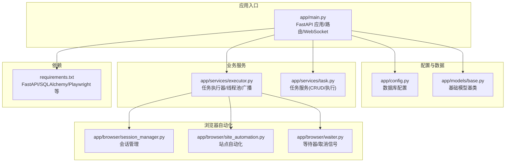
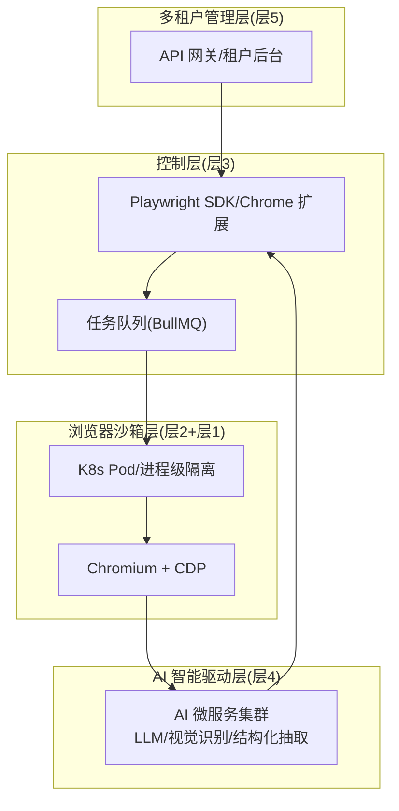
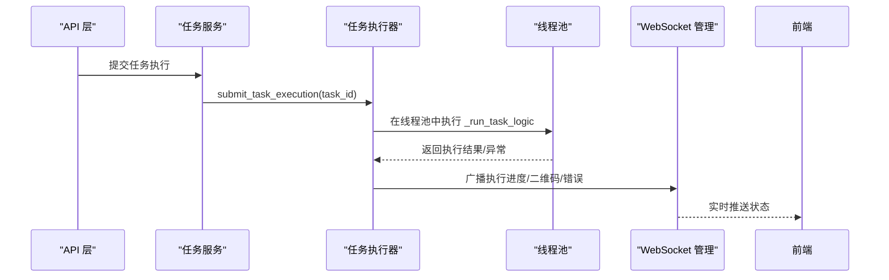
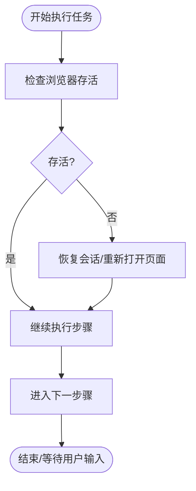
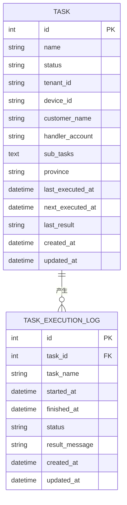
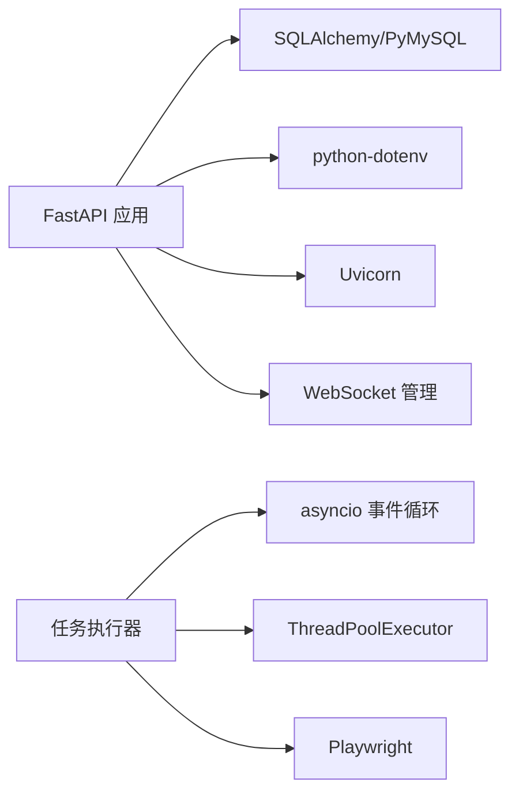

# 视觉识别系统

<cite>
**本文引用的文件**
- [project.md](file://project.md)
- [requirements.txt](file://CCC_RPA_API/requirements.txt)
- [main.py](file://CCC_RPA_API/app/main.py)
- [config.py](file://CCC_RPA_API/app/config.py)
- [base.py](file://CCC_RPA_API/app/models/base.py)
- [executor.py](file://CCC_RPA_API/app/services/executor.py)
- [task.py](file://CCC_RPA_API/app/services/task.py)
</cite>

## 目录
1. [简介](#简介)
2. [项目结构](#项目结构)
3. [核心组件](#核心组件)
4. [架构总览](#架构总览)
5. [详细组件分析](#详细组件分析)
6. [依赖关系分析](#依赖关系分析)
7. [性能考虑](#性能考虑)
8. [故障排查指南](#故障排查指南)
9. [结论](#结论)
10. [附录](#附录)

## 简介
本文件面向“视觉识别系统”的技术文档，聚焦于页面元素识别与文字识别两大能力：YOLOv8 目标检测用于页面元素（按钮、输入框、弹窗、验证码区域等）的边界框定位与类别判别；PaddleOCR 文字识别用于页面文本与验证码字符的提取。系统以“AI 智能驱动微服务层”为核心，结合浏览器自动化与多租户业务层，形成从页面截图到结构化决策的闭环。

根据项目需求文档，AI 层包含：
- YOLOv8 离线元素检测：输出标准化坐标与元素类型
- PaddleOCR 离线文字识别：提取页面全文与验证码字符
- 识别结果标准化输出，供给 LLM 生成操作指令

本仓库当前后端以 FastAPI 为基础，提供任务编排与浏览器会话管理能力，但未包含 YOLOv8 与 PaddleOCR 的具体推理服务实现。本文将据此现状进行架构解读、流程梳理与最佳实践建议，并给出与 AI 微服务对接的集成要点。

章节来源
- [project.md: 395-402:395-402](file://project.md#L395-L402)

## 项目结构
后端采用 FastAPI + SQLAlchemy 架构，主要模块如下：
- 应用入口与路由：FastAPI 应用、CORS、WebSocket 管理
- 配置与数据库：数据库连接配置、基础模型基类
- 业务服务：任务执行器（线程池调度）、任务服务（CRUD 与执行）
- 浏览器自动化：会话管理、站点自动化、等待器（用于用户交互与取消信号）

图表来源
- [main.py: 1-127:1-127](file://CCC_RPA_API/app/main.py#L1-L127)
- [config.py: 1-22:1-22](file://CCC_RPA_API/app/config.py#L1-L22)
- [base.py: 1-11:1-11](file://CCC_RPA_API/app/models/base.py#L1-L11)
- [executor.py: 1-308:1-308](file://CCC_RPA_API/app/services/executor.py#L1-L308)
- [task.py: 1-157:1-157](file://CCC_RPA_API/app/services/task.py#L1-L157)
- [requirements.txt: 1-11:1-11](file://CCC_RPA_API/requirements.txt#L1-L11)

章节来源
- [main.py: 12-28:12-28](file://CCC_RPA_API/app/main.py#L12-L28)
- [requirements.txt: 1-11:1-11](file://CCC_RPA_API/requirements.txt#L1-L11)

## 核心组件
- 应用入口与路由
  - 初始化 FastAPI 应用、CORS、数据库表结构创建、WebSocket 管理
  - 提供健康检查与统一路由注册
- 配置与数据库
  - 使用 Pydantic Settings 管理数据库连接参数
  - 基类模型统一 created_at/updated_at 时间戳
- 任务执行器
  - 线程池调度任务执行，保障与 asyncio 事件循环兼容
  - 通过广播机制向前端推送执行进度、二维码、错误等消息
  - 包含浏览器存活检查与异常恢复逻辑
- 任务服务
  - 提供任务 CRUD、执行提交、执行日志查询
  - 将任务状态与执行日志持久化

章节来源
- [main.py: 30-127:30-127](file://CCC_RPA_API/app/main.py#L30-L127)
- [config.py: 6-22:6-22](file://CCC_RPA_API/app/config.py#L6-L22)
- [base.py: 7-11:7-11](file://CCC_RPA_API/app/models/base.py#L7-L11)
- [executor.py: 17-33:17-33](file://CCC_RPA_API/app/services/executor.py#L17-L33)
- [task.py: 120-134:120-134](file://CCC_RPA_API/app/services/task.py#L120-L134)

## 架构总览
系统整体分层清晰，AI 智能驱动层位于控制层与浏览器沙箱之间，负责视觉识别与结构化抽取，输出标准化结果供 LLM 决策与自动化执行使用。

图表来源
- [project.md: 175-188:175-188](file://project.md#L175-L188)
- [project.md: 445-481:445-481](file://project.md#L445-L481)

## 详细组件分析

### 任务执行器（线程池调度与广播）
任务执行器负责在独立线程中执行浏览器自动化任务，同时通过 WebSocket 广播执行状态，确保与 asyncio 事件循环解耦。

图表来源
- [task.py: 120-134:120-134](file://CCC_RPA_API/app/services/task.py#L120-L134)
- [executor.py: 306-308:306-308](file://CCC_RPA_API/app/services/executor.py#L306-L308)
- [main.py: 119-127:119-127](file://CCC_RPA_API/app/main.py#L119-L127)

章节来源
- [executor.py: 17-33:17-33](file://CCC_RPA_API/app/services/executor.py#L17-L33)
- [executor.py: 68-304:68-304](file://CCC_RPA_API/app/services/executor.py#L68-L304)

### 浏览器会话管理与异常恢复
执行器在关键步骤前后检查浏览器存活状态，若发现异常则恢复会话并重新打开目标页面，保证任务连续性。

图表来源
- [executor.py: 42-59:42-59](file://CCC_RPA_API/app/services/executor.py#L42-L59)

章节来源
- [executor.py: 42-59:42-59](file://CCC_RPA_API/app/services/executor.py#L42-L59)

### 数据模型与持久化
基础模型统一记录创建与更新时间，任务服务负责将任务状态与执行日志持久化，便于审计与回溯。

图表来源
- [base.py: 7-11:7-11](file://CCC_RPA_API/app/models/base.py#L7-L11)
- [task.py: 136-157:136-157](file://CCC_RPA_API/app/services/task.py#L136-L157)

章节来源
- [base.py: 7-11:7-11](file://CCC_RPA_API/app/models/base.py#L7-L11)
- [task.py: 136-157:136-157](file://CCC_RPA_API/app/services/task.py#L136-L157)

## 依赖关系分析
- 应用依赖
  - FastAPI、Uvicorn、SQLAlchemy、PyMySQL、Pydantic Settings、python-dotenv
  - Playwright、playwright-stealth（浏览器自动化与反检测）
- 数据库
  - MySQL 连接配置，支持动态迁移与初始数据插入
- 事件与并发
  - asyncio 事件循环与线程池协调，WebSocket 广播需在主事件循环中执行

图表来源
- [requirements.txt: 1-11:1-11](file://CCC_RPA_API/requirements.txt#L1-L11)
- [main.py: 1-L127:1-127](file://CCC_RPA_API/app/main.py#L1-L127)
- [executor.py: 1-L308:1-308](file://CCC_RPA_API/app/services/executor.py#L1-L308)

章节来源
- [requirements.txt: 1-11:1-11](file://CCC_RPA_API/requirements.txt#L1-L11)
- [main.py: 12-28:12-28](file://CCC_RPA_API/app/main.py#L12-L28)

## 性能考虑
- 会话创建与 AI 推理性能
  - 会话创建耗时：K8s 环境 ≤3s，单机进程模式 ≤1s
  - AI 单条自然语言指令推理响应：7B 本地模型 ≤1.5s
  - API 网关单接口 QPS≥100，WebSocket 在线≥1000 路
- 并发与资源
  - 任务执行采用线程池，避免阻塞 asyncio 事件循环
  - 会话销毁时清理资源，避免内存泄漏
- 实时性
  - WebSocket 广播执行进度，前端延迟 ≤300ms

章节来源
- [project.md: 506-517:506-517](file://project.md#L506-L517)
- [project.md: 670-677:670-677](file://project.md#L670-L677)

## 故障排查指南
- 浏览器异常恢复
  - 当检测到浏览器关闭或崩溃时，执行器会尝试恢复会话并重新打开页面，同时广播进度提示
- 二维码登录与用户等待
  - 扫码登录阶段通过 WebSocket 推送二维码，等待用户扫码；超时或取消将抛出异常并终止任务
- 执行日志与状态
  - 任务执行日志记录开始/结束时间、状态与结果消息，便于审计与问题定位

章节来源
- [executor.py: 42-59:42-59](file://CCC_RPA_API/app/services/executor.py#L42-L59)
- [executor.py: 104-135:104-135](file://CCC_RPA_API/app/services/executor.py#L104-L135)
- [executor.py: 275-301:275-301](file://CCC_RPA_API/app/services/executor.py#L275-L301)
- [task.py: 136-157:136-157](file://CCC_RPA_API/app/services/task.py#L136-L157)

## 结论
本仓库展示了 AI 驱动层与浏览器自动化层的衔接点：任务执行器通过线程池与 WebSocket 广播实现稳定的异步执行与状态反馈。对于视觉识别系统而言，YOLOv8 与 PaddleOCR 的推理服务应以 GRPC 形式接入，遵循统一接口契约，将页面截图与 DOM 信息转化为标准化的边界框与文本结果，再由 LLM 进行决策与自动化执行。当前仓库尚未包含具体的视觉识别实现，建议在现有架构基础上新增 AI 微服务模块，并与现有任务执行器与 WebSocket 通道无缝集成。

章节来源
- [project.md: 395-402:395-402](file://project.md#L395-L402)
- [project.md: 463-481:463-481](file://project.md#L463-L481)

## 附录

### YOLOv8 与 PaddleOCR 集成建议
- 接口契约
  - OCRImage(imageBuffer) → 识别文本结果
  - ParsePageTask(DOM, screenshot, userCommand) → Playwright 操作步骤列表
  - ExtractStructData(DOM, ruleJson) → 结构化 JSON 数据
- 数据流
  - 页面截图与 DOM → 视觉识别服务 → 标准化结果 → LLM 决策 → 自动化执行
- 参数与配置
  - 模型加载与推理参数（如置信度阈值、NMS 阈值、输入尺寸）应在服务启动时集中配置
  - 服务端口与 TLS 配置遵循内部 GRPC 规范
- 性能优化
  - 使用 GPU 推理加速（CUDA），离线模型部署，避免网络依赖
  - 结合多线程/多进程与批处理提升吞吐
- 实时处理
  - 通过 WebSocket 推送中间结果与进度，前端及时展示识别与结构化抽取结果

章节来源
- [project.md: 395-402:395-402](file://project.md#L395-L402)
- [project.md: 463-481:463-481](file://project.md#L463-L481)