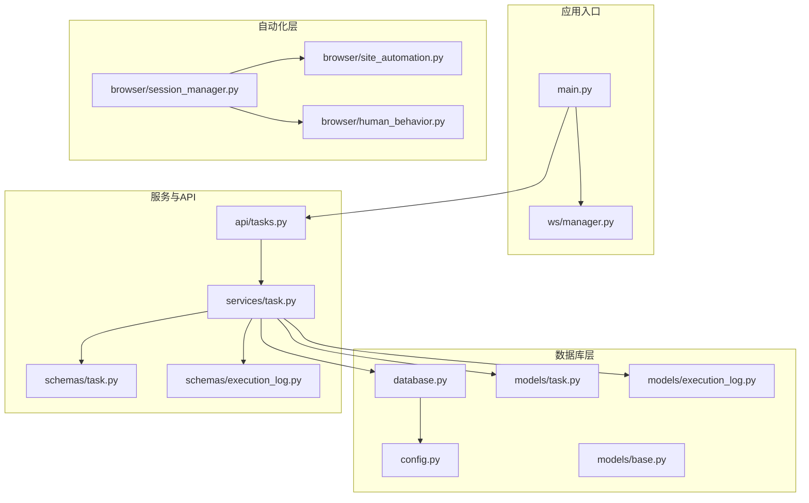
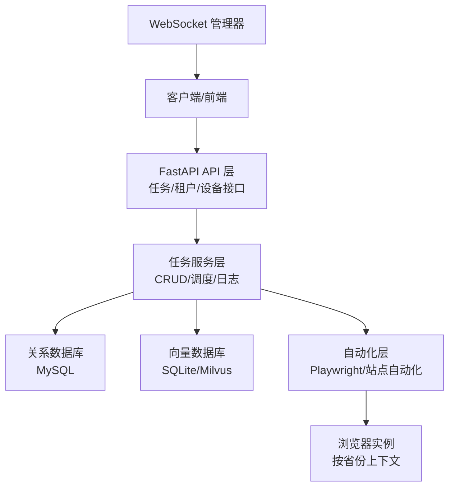
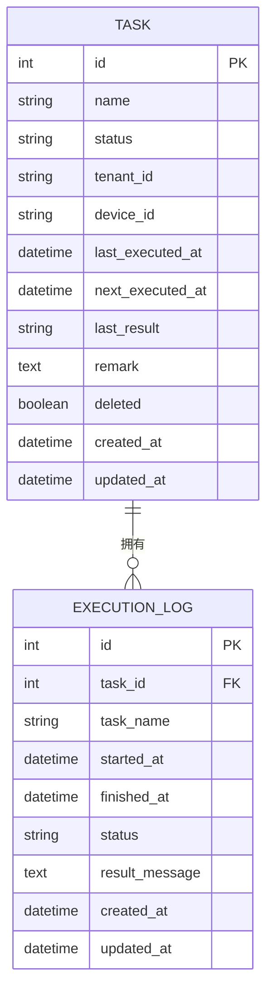
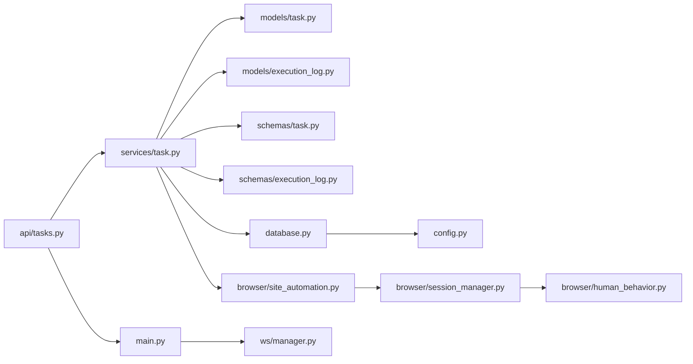

# 记忆向量数据库

<cite>
**本文档引用的文件**
- [main.py](file://CCC_RPA_API/app/main.py)
- [config.py](file://CCC_RPA_API/app/config.py)
- [database.py](file://CCC_RPA_API/app/database.py)
- [base.py](file://CCC_RPA_API/app/models/base.py)
- [task.py](file://CCC_RPA_API/app/models/task.py)
- [execution_log.py](file://CCC_RPA_API/app/models/execution_log.py)
- [task.py](file://CCC_RPA_API/app/schemas/task.py)
- [execution_log.py](file://CCC_RPA_API/app/schemas/execution_log.py)
- [tasks.py](file://CCC_RPA_API/app/api/tasks.py)
- [task_service.py](file://CCC_RPA_API/app/services/task.py)
- [session_manager.py](file://CCC_RPA_API/app/browser/session_manager.py)
- [human_behavior.py](file://CCC_RPA_API/app/browser/human_behavior.py)
- [site_automation.py](file://CCC_RPA_API/app/browser/site_automation.py)
- [manager.py](file://CCC_RPA_API/app/ws/manager.py)
</cite>

## 目录
1. [简介](#简介)
2. [项目结构](#项目结构)
3. [核心组件](#核心组件)
4. [架构总览](#架构总览)
5. [详细组件分析](#详细组件分析)
6. [依赖关系分析](#依赖关系分析)
7. [性能考虑](#性能考虑)
8. [故障排查指南](#故障排查指南)
9. [结论](#结论)
10. [附录](#附录)

## 简介
本技术文档围绕“记忆向量数据库”的设计与实现展开，结合现有代码库中的任务管理、浏览器自动化与数据库层，系统阐述以下主题：
- 租户独立存储架构：以租户维度隔离任务与执行日志，确保数据边界清晰、互不影响
- SQLite 单机版与 Milvus 集群版部署策略：在单机场景下以 SQLite 作为轻量向量存储，在集群场景下以 Milvus 作为高并发向量检索引擎
- 向量嵌入生成与存储：文本编码、向量索引与相似度计算的分层实现思路
- 记忆检索算法：语义搜索、关键词匹配与混合检索策略
- 数据生命周期管理：增量更新、版本控制与空间优化
- 性能调优：索引策略、查询优化与缓存机制
- 部署配置、监控指标与故障恢复策略

说明：当前仓库未包含向量数据库的具体实现代码，本文基于现有任务与日志模型，提出可扩展的记忆向量数据库架构，并给出与现有代码的对接点。

## 项目结构
后端采用 FastAPI + SQLAlchemy 架构，核心模块包括：
- 应用入口与路由注册：FastAPI 应用、CORS 中间件、WebSocket 管理
- 数据库层：MySQL 连接、SQLAlchemy 会话管理、基础模型基类
- 模型层：任务与执行日志模型，具备租户字段与时间戳字段
- 服务层：任务服务封装 CRUD、执行调度与日志查询
- 自动化层：Playwright 会话管理、真人行为模拟、站点自动化流程
- API 层：任务相关的 REST 接口

图表来源
- [main.py:1-127](file://CCC_RPA_API/app/main.py#L1-L127)
- [config.py:1-22](file://CCC_RPA_API/app/config.py#L1-L22)
- [database.py:1-19](file://CCC_RPA_API/app/database.py#L1-L19)
- [base.py:1-11](file://CCC_RPA_API/app/models/base.py#L1-L11)
- [task.py:1-25](file://CCC_RPA_API/app/models/task.py#L1-L25)
- [execution_log.py:1-17](file://CCC_RPA_API/app/models/execution_log.py#L1-L17)
- [task.py:1-58](file://CCC_RPA_API/app/schemas/task.py#L1-L58)
- [execution_log.py:1-19](file://CCC_RPA_API/app/schemas/execution_log.py#L1-L19)
- [tasks.py:1-76](file://CCC_RPA_API/app/api/tasks.py#L1-L76)
- [task_service.py:1-157](file://CCC_RPA_API/app/services/task.py#L1-L157)
- [session_manager.py:1-183](file://CCC_RPA_API/app/browser/session_manager.py#L1-L183)
- [human_behavior.py:1-86](file://CCC_RPA_API/app/browser/human_behavior.py#L1-L86)
- [site_automation.py:1-586](file://CCC_RPA_API/app/browser/site_automation.py#L1-L586)
- [manager.py:1-29](file://CCC_RPA_API/app/ws/manager.py#L1-L29)

章节来源
- [main.py:1-127](file://CCC_RPA_API/app/main.py#L1-L127)
- [tasks.py:1-76](file://CCC_RPA_API/app/api/tasks.py#L1-L76)
- [task_service.py:1-157](file://CCC_RPA_API/app/services/task.py#L1-L157)
- [database.py:1-19](file://CCC_RPA_API/app/database.py#L1-L19)

## 核心组件
- 应用入口与路由
  - 注册 CORS、WebSocket 管理器，挂载认证、任务、租户、设备路由
  - 启动时创建数据库表并进行列迁移兼容
- 数据库连接与会话
  - 通过配置类构造 MySQL 连接，启用连接池预检查与回收
  - 提供 get_db 依赖注入，确保请求生命周期内正确释放连接
- 模型与字段
  - 基础模型包含 created_at/updated_at 时间戳
  - 任务模型包含 tenant_id、device_id、last_executed_at、next_executed_at 等字段，便于租户与设备维度的数据隔离
  - 执行日志模型包含任务标识、开始/结束时间、状态与结果消息
- 服务层
  - 任务服务提供分页查询、关键字过滤、状态过滤、JSON 字段处理、执行调度与日志查询
- 自动化层
  - 会话管理器在专用线程中维护 Playwright 实例，按省份管理上下文，持久化 storage_state
  - 真人行为模拟类提供随机延迟、点击、输入与滚动，降低反爬检测风险
  - 站点自动化类封装登录、扫码、单位列表抓取、单位选择、页面保活与待处理业务检测

章节来源
- [main.py:1-127](file://CCC_RPA_API/app/main.py#L1-L127)
- [config.py:1-22](file://CCC_RPA_API/app/config.py#L1-L22)
- [database.py:1-19](file://CCC_RPA_API/app/database.py#L1-L19)
- [base.py:1-11](file://CCC_RPA_API/app/models/base.py#L1-L11)
- [task.py:1-25](file://CCC_RPA_API/app/models/task.py#L1-L25)
- [execution_log.py:1-17](file://CCC_RPA_API/app/models/execution_log.py#L1-L17)
- [task_service.py:1-157](file://CCC_RPA_API/app/services/task.py#L1-L157)
- [session_manager.py:1-183](file://CCC_RPA_API/app/browser/session_manager.py#L1-L183)
- [human_behavior.py:1-86](file://CCC_RPA_API/app/browser/human_behavior.py#L1-L86)
- [site_automation.py:1-586](file://CCC_RPA_API/app/browser/site_automation.py#L1-L586)

## 架构总览
本节展示“记忆向量数据库”在现有系统中的位置与交互关系。当前系统以任务为中心，后续可在任务执行前后引入向量嵌入与检索能力，形成“记忆增强”的自动化流程。

图表来源
- [main.py:1-127](file://CCC_RPA_API/app/main.py#L1-L127)
- [tasks.py:1-76](file://CCC_RPA_API/app/api/tasks.py#L1-L76)
- [task_service.py:1-157](file://CCC_RPA_API/app/services/task.py#L1-L157)
- [session_manager.py:1-183](file://CCC_RPA_API/app/browser/session_manager.py#L1-L183)

## 详细组件分析

### 租户独立存储架构
- 设计理念
  - 在任务模型中引入 tenant_id 字段，确保不同租户的任务数据相互隔离
  - 执行日志按任务 ID 关联，天然支持租户维度的审计与回溯
  - 通过 API 与服务层在查询与写入时加入租户过滤条件，保证跨租户数据边界
- 数据模型映射
  - 任务模型包含 tenant_id、device_id 等字段，便于进一步扩展设备维度的隔离
  - 基础模型统一记录创建与更新时间，便于审计与版本追踪

图表来源
- [task.py:1-25](file://CCC_RPA_API/app/models/task.py#L1-L25)
- [execution_log.py:1-17](file://CCC_RPA_API/app/models/execution_log.py#L1-L17)
- [base.py:1-11](file://CCC_RPA_API/app/models/base.py#L1-L11)

章节来源
- [task.py:1-25](file://CCC_RPA_API/app/models/task.py#L1-L25)
- [execution_log.py:1-17](file://CCC_RPA_API/app/models/execution_log.py#L1-L17)
- [base.py:1-11](file://CCC_RPA_API/app/models/base.py#L1-L11)

### 部署策略：SQLite 单机版 vs Milvus 集群版
- SQLite 单机版
  - 适用场景：开发测试、低并发、单机部署
  - 存储建议：将向量嵌入与元数据存储在同一数据库中，利用 FTS5 或自定义表结构实现相似度检索
  - 优势：部署简单、运维成本低
- Milvus 集群版
  - 适用场景：生产环境、高并发、强一致与高性能需求
  - 存储建议：向量集合按租户或业务域划分分区；文本元数据存储于 MySQL，向量索引存储于 Milvus
  - 优势：支持大规模向量检索、分布式扩展、灵活索引策略

章节来源
- [main.py:37-87](file://CCC_RPA_API/app/main.py#L37-L87)

### 向量嵌入生成与存储机制
- 文本编码
  - 建议使用标准化的文本清洗与分词策略，输出固定维度的向量表示
  - 可选方案：本地模型（如 Sentence-BERT）或外部服务（OpenAI/智谱等）
- 向量索引
  - SQLite：使用内置向量扩展或自定义哈希/距离函数实现近似最近邻
  - Milvus：采用 HNSW/IVF 等索引类型，结合动态分割与副本策略提升吞吐
- 相似度计算
  - 内积/余弦相似度或 L2 距离，结合阈值与 Top-K 返回候选集

章节来源
- [task_service.py:120-133](file://CCC_RPA_API/app/services/task.py#L120-L133)

### 记忆检索算法
- 语义搜索
  - 输入查询经编码器转换为向量，与 Milvus/SQLite 中的向量集合进行相似度检索
- 关键词匹配
  - 对查询进行关键词抽取，结合 MySQL LIKE 或全文索引快速筛选候选
- 混合检索策略
  - 权重融合：语义分数与关键词匹配得分加权组合
  - 两阶段排序：先关键词召回，再语义精排

章节来源
- [task_service.py:47-64](file://CCC_RPA_API/app/services/task.py#L47-L64)

### 数据生命周期管理
- 增量更新
  - 以任务维度为粒度，仅对变更字段进行更新；执行日志按批次写入
- 版本控制
  - 通过 created_at/updated_at 字段记录版本时间线；必要时引入版本号字段
- 空间优化
  - 定期清理 deleted 任务与历史日志；对低频访问的向量数据进行冷热分离

章节来源
- [base.py:1-11](file://CCC_RPA_API/app/models/base.py#L1-L11)
- [task_service.py:110-117](file://CCC_RPA_API/app/services/task.py#L110-L117)

### 性能调优方案
- 索引策略
  - MySQL：为 tenant_id、device_id、status、name 等高频过滤字段建立索引
  - Milvus：根据数据规模与查询模式选择合适索引参数，定期 rebuild
- 查询优化
  - 分页与缓存：对热门查询结果进行短期缓存；分页大小与排序字段固定
  - 过滤下推：尽量在数据库层完成过滤，减少网络传输
- 缓存机制
  - Redis 缓存：热点任务与日志摘要；向量检索结果缓存短期有效

章节来源
- [task.py:12-14](file://CCC_RPA_API/app/models/task.py#L12-L14)
- [task.py:13](file://CCC_RPA_API/app/models/task.py#L13)
- [task.py:24](file://CCC_RPA_API/app/models/task.py#L24)

### 部署配置、监控指标与故障恢复
- 部署配置
  - FastAPI：CORS、路由注册、WebSocket、健康检查
  - 数据库：连接池参数、字符集、迁移兼容
  - 自动化：Playwright 启动参数、上下文持久化目录
- 监控指标
  - QPS/响应时间、错误率、向量检索命中率、Milvus 集群指标
- 故障恢复
  - 浏览器会话异常：自动重建上下文；会话持久化失败时回退至空状态
  - Milvus 连接异常：重连与退避；索引重建与数据补偿

章节来源
- [main.py:14-21](file://CCC_RPA_API/app/main.py#L14-L21)
- [main.py:114-116](file://CCC_RPA_API/app/main.py#L114-L116)
- [session_manager.py:154-167](file://CCC_RPA_API/app/browser/session_manager.py#L154-L167)

## 依赖关系分析
- 组件耦合
  - API 层依赖服务层；服务层依赖数据库层与自动化层
  - WebSocket 管理器与 API 层解耦，便于异步通知
- 外部依赖
  - FastAPI、SQLAlchemy、PyMySQL、Playwright
  - Milvus（可选）

图表来源
- [tasks.py:1-76](file://CCC_RPA_API/app/api/tasks.py#L1-L76)
- [task_service.py:1-157](file://CCC_RPA_API/app/services/task.py#L1-L157)
- [task.py:1-25](file://CCC_RPA_API/app/models/task.py#L1-L25)
- [execution_log.py:1-17](file://CCC_RPA_API/app/models/execution_log.py#L1-L17)
- [task.py:1-58](file://CCC_RPA_API/app/schemas/task.py#L1-L58)
- [execution_log.py:1-19](file://CCC_RPA_API/app/schemas/execution_log.py#L1-L19)
- [database.py:1-19](file://CCC_RPA_API/app/database.py#L1-L19)
- [config.py:1-22](file://CCC_RPA_API/app/config.py#L1-L22)
- [main.py:1-127](file://CCC_RPA_API/app/main.py#L1-L127)
- [manager.py:1-29](file://CCC_RPA_API/app/ws/manager.py#L1-L29)
- [site_automation.py:1-586](file://CCC_RPA_API/app/browser/site_automation.py#L1-L586)
- [session_manager.py:1-183](file://CCC_RPA_API/app/browser/session_manager.py#L1-L183)
- [human_behavior.py:1-86](file://CCC_RPA_API/app/browser/human_behavior.py#L1-L86)

章节来源
- [tasks.py:1-76](file://CCC_RPA_API/app/api/tasks.py#L1-L76)
- [task_service.py:1-157](file://CCC_RPA_API/app/services/task.py#L1-L157)
- [database.py:1-19](file://CCC_RPA_API/app/database.py#L1-L19)

## 性能考虑
- 数据库层
  - 合理设置连接池大小与回收周期，避免连接泄漏
  - 对高频查询字段建立索引，避免全表扫描
- 自动化层
  - 使用专用线程执行 Playwright 操作，避免与 asyncio 事件循环冲突
  - 上下文持久化与复用，减少重复登录成本
- 向量检索
  - 选择合适的索引类型与参数；对高频查询进行缓存
  - 控制向量维度与批量大小，平衡精度与性能

## 故障排查指南
- 浏览器会话异常
  - 现象：页面不可见、元素定位失败
  - 处理：检查会话是否存活，必要时触发恢复流程重建上下文
- 数据库迁移失败
  - 现象：列新增报错
  - 处理：捕获异常并忽略（列已存在），确保启动兼容性
- WebSocket 广播异常
  - 现象：客户端无推送
  - 处理：清理断开连接，重建连接管理器

章节来源
- [session_manager.py:144-167](file://CCC_RPA_API/app/browser/session_manager.py#L144-L167)
- [main.py:46-86](file://CCC_RPA_API/app/main.py#L46-L86)
- [manager.py:17-26](file://CCC_RPA_API/app/ws/manager.py#L17-L26)

## 结论
本项目以任务为中心，具备良好的租户隔离与自动化能力。通过引入记忆向量数据库，可在任务执行前后实现语义检索与知识增强，显著提升自动化流程的智能化水平。建议优先在开发环境验证 SQLite 方案，再在生产环境引入 Milvus 集群，配合完善的索引与缓存策略，达成高可用与高性能的统一。

## 附录
- API 路由概览
  - GET /api/tasks：分页列出任务（支持关键字与状态过滤）
  - POST /api/tasks：创建任务（含租户/设备/备注等字段）
  - GET /api/tasks/{task_id}：获取任务详情
  - PUT /api/tasks/{task_id}：更新任务
  - DELETE /api/tasks/{task_id}：软删除任务
  - POST /api/tasks/{task_id}/execute：执行任务
  - GET /api/tasks/{task_id}/logs：获取执行日志
  - POST /api/tasks/{task_id}/scan-complete：扫码完成信号
  - POST /api/tasks/{task_id}/select-company：选择公司
  - POST /api/tasks/{task_id}/cancel-execution：取消执行

章节来源
- [tasks.py:13-75](file://CCC_RPA_API/app/api/tasks.py#L13-L75)