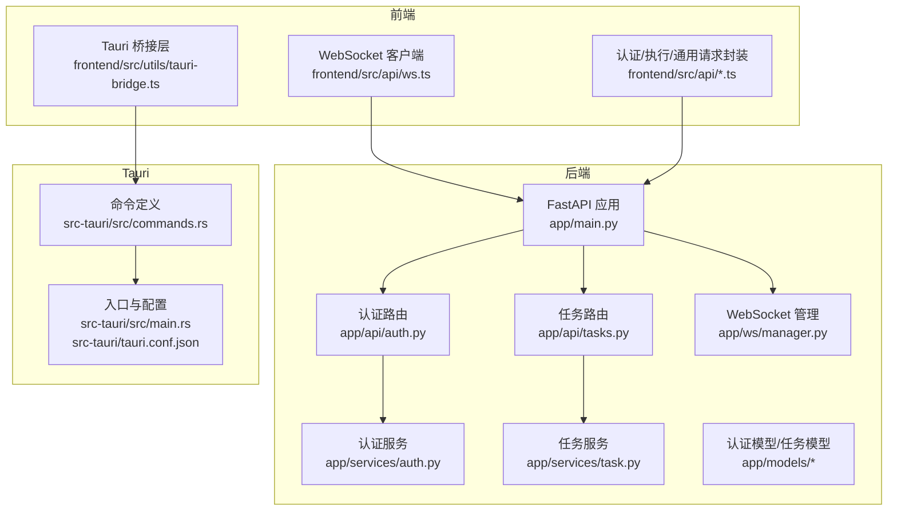
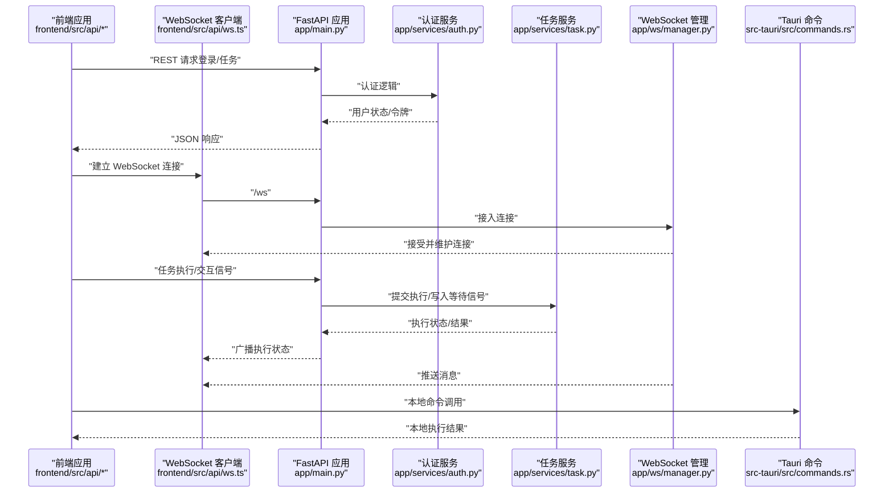
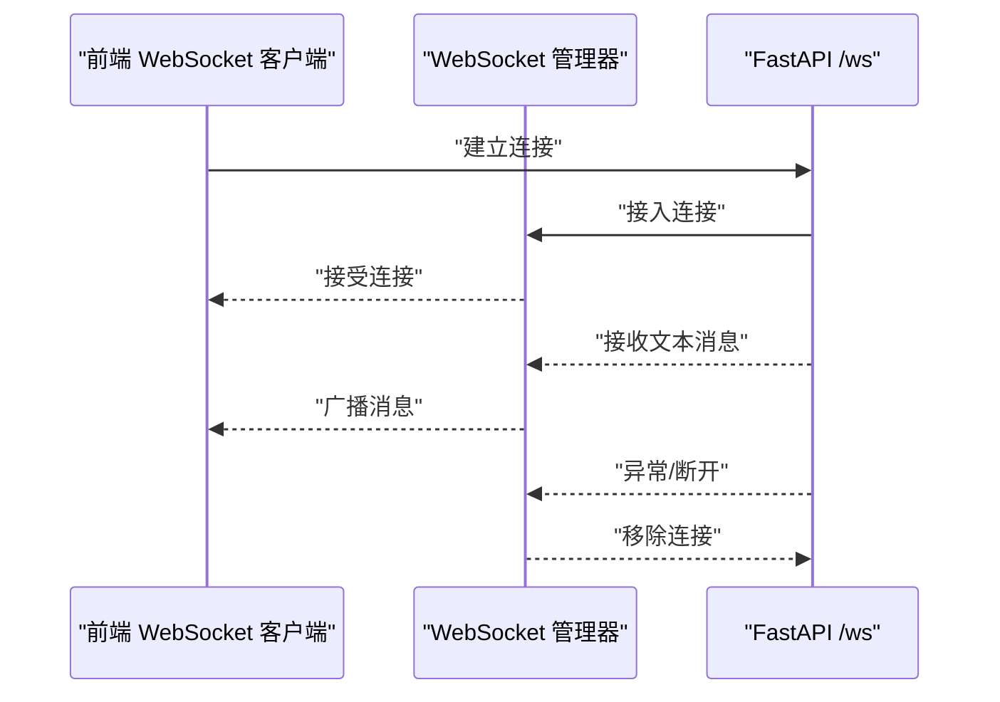
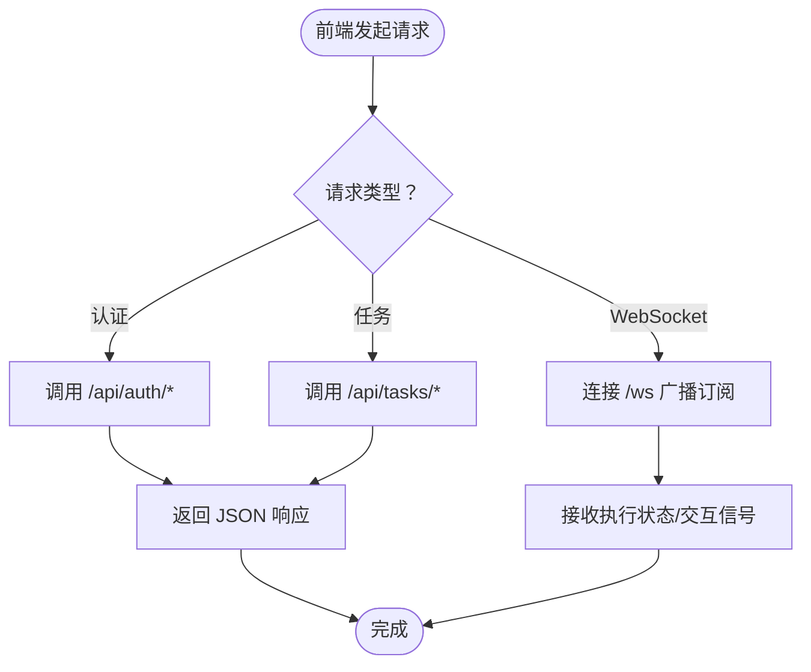
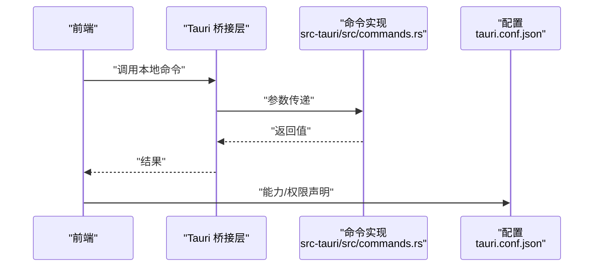
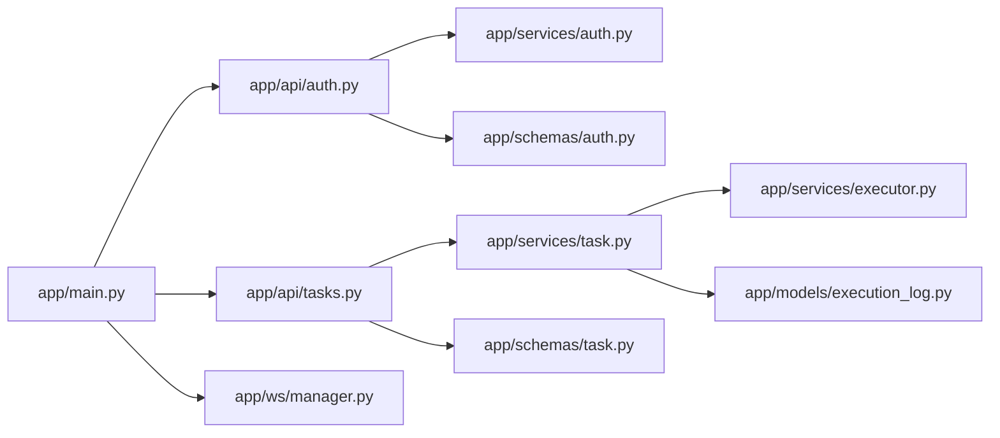

# API 参考文档

<cite>
**本文档引用的文件**
- [main.py](file://CCC_RPA_API/app/main.py)
- [tasks.py](file://CCC_RPA_API/app/api/tasks.py)
- [auth.py](file://CCC_RPA_API/app/api/auth.py)
- [manager.py](file://CCC_RPA_API/app/ws/manager.py)
- [task.py](file://CCC_RPA_API/app/schemas/task.py)
- [auth.py](file://CCC_RPA_API/app/schemas/auth.py)
- [task.py](file://CCC_RPA_API/app/services/task.py)
- [auth.py](file://CCC_RPA_API/app/services/auth.py)
- [ws.ts](file://CCC-BrowserV4/frontend/src/api/ws.ts)
- [auth.ts](file://CCC-BrowserV4/frontend/src/api/auth.ts)
- [execution.ts](file://CCC-BrowserV4/frontend/src/api/execution.ts)
- [request.ts](file://CCC-BrowserV4/frontend/src/api/request.ts)
- [commands.rs](file://CCC-BrowserV4/src-tauri/src/commands.rs)
- [main.rs](file://CCC-BrowserV4/src-tauri/src/main.rs)
- [tauri.conf.json](file://CCC-BrowserV4/src-tauri/tauri.conf.json)
</cite>

## 目录
1. [简介](#简介)
2. [项目结构](#项目结构)
3. [核心组件](#核心组件)
4. [架构总览](#架构总览)
5. [详细组件分析](#详细组件分析)
6. [依赖关系分析](#依赖关系分析)
7. [性能考虑](#性能考虑)
8. [故障排除指南](#故障排除指南)
9. [结论](#结论)
10. [附录](#附录)

## 简介
本文件为 CCC RPA 系统的统一 API 参考文档，覆盖以下能力范围：
- RESTful API：HTTP 方法、URL 路径、请求/响应模型、认证方式
- WebSocket 实时通信：连接建立、消息格式、事件类型与交互流程
- 浏览器前端接口：Chrome 扩展侧的消息协议、事件处理与数据交换
- Tauri 命令接口：命令定义、参数传递与返回值处理
- 统一错误码与响应格式规范
- 完整接口示例与版本管理策略

## 项目结构
系统采用前后端分离架构：
- 后端基于 FastAPI，提供 REST API 与 WebSocket 服务
- 前端为 Vue 应用，通过独立的 Chrome 扩展运行，负责与后端交互与本地命令桥接
- Tauri 提供桌面端命令桥接，用于与浏览器扩展进行本地通信

图表来源
- [main.py:12-27](file://CCC_RPA_API/app/main.py#L12-L27)
- [auth.py:1-24](file://CCC_RPA_API/app/api/auth.py#L1-L24)
- [tasks.py:1-76](file://CCC_RPA_API/app/api/tasks.py#L1-L76)
- [manager.py:1-29](file://CCC_RPA_API/app/ws/manager.py#L1-L29)
- [auth.py:1-58](file://CCC_RPA_API/app/services/auth.py#L1-L58)
- [task.py:1-157](file://CCC_RPA_API/app/services/task.py#L1-L157)
- [ws.ts:1-200](file://CCC-BrowserV4/frontend/src/api/ws.ts)
- [auth.ts:1-200](file://CCC-BrowserV4/frontend/src/api/auth.ts)
- [execution.ts:1-200](file://CCC-BrowserV4/frontend/src/api/execution.ts)
- [request.ts:1-200](file://CCC-BrowserV4/frontend/src/api/request.ts)
- [commands.rs:1-200](file://CCC-BrowserV4/src-tauri/src/commands.rs)
- [main.rs:1-200](file://CCC-BrowserV4/src-tauri/src/main.rs)
- [tauri.conf.json:1-200](file://CCC-BrowserV4/src-tauri/tauri.conf.json)

章节来源
- [main.py:12-127](file://CCC_RPA_API/app/main.py#L12-L127)
- [auth.py:1-24](file://CCC_RPA_API/app/api/auth.py#L1-L24)
- [tasks.py:1-76](file://CCC_RPA_API/app/api/tasks.py#L1-L76)
- [manager.py:1-29](file://CCC_RPA_API/app/ws/manager.py#L1-L29)

## 核心组件
- REST API 路由注册与健康检查
- 认证模块：登录、登出、校验
- 任务模块：列表、创建、查询、更新、删除、执行、日志、交互信号
- WebSocket 管理：连接、断开、广播
- 前端接口：认证、执行、通用请求与 WebSocket 客户端
- Tauri 命令：本地命令桥接与配置

章节来源
- [main.py:23-127](file://CCC_RPA_API/app/main.py#L23-L127)
- [auth.py:1-24](file://CCC_RPA_API/app/api/auth.py#L1-L24)
- [tasks.py:1-76](file://CCC_RPA_API/app/api/tasks.py#L1-L76)
- [manager.py:1-29](file://CCC_RPA_API/app/ws/manager.py#L1-L29)

## 架构总览
下图展示从浏览器扩展到后端 API，再到 Tauri 命令的完整调用链路。

图表来源
- [main.py:114-127](file://CCC_RPA_API/app/main.py#L114-L127)
- [auth.py:1-24](file://CCC_RPA_API/app/api/auth.py#L1-L24)
- [task.py:1-157](file://CCC_RPA_API/app/services/task.py#L1-L157)
- [manager.py:1-29](file://CCC_RPA_API/app/ws/manager.py#L1-L29)
- [ws.ts:1-200](file://CCC-BrowserV4/frontend/src/api/ws.ts)
- [commands.rs:1-200](file://CCC-BrowserV4/src-tauri/src/commands.rs)

## 详细组件分析

### REST API 规范

- 通用约定
  - 基础路径：/api
  - 认证：无内置鉴权中间件，认证由业务服务自行处理
  - 响应：遵循 Pydantic 模型自动序列化；错误通过 HTTP 状态码与标准错误体返回
  - 分页：任务列表支持 keyword、status、page、page_size 查询参数

- 认证接口
  - 登录
    - 方法与路径：POST /api/auth/login
    - 请求体：client_id、token、device_id、username（可选）
    - 成功响应：userId、username、token
  - 登出
    - 方法与路径：POST /api/auth/logout
    - 请求体：userId
    - 成功响应：{"message": "登出成功"}
  - 校验
    - 方法与路径：GET /api/auth/verify?userId=...
    - 成功响应：valid、userId、username

- 任务接口
  - 列表
    - 方法与路径：GET /api/tasks
    - 查询参数：keyword、status、page、page_size
    - 成功响应：items、total、page、page_size
  - 创建
    - 方法与路径：POST /api/tasks
    - 请求体：name、tenant_id、device_id、customer_name、handler_account、sub_tasks、province、remark
    - 成功响应：任务对象（含 id、状态、时间戳等）
  - 获取
    - 方法与路径：GET /api/tasks/{task_id}
    - 成功响应：任务对象
  - 更新
    - 方法与路径：PUT /api/tasks/{task_id}
    - 请求体：同上（可选字段）
    - 成功响应：任务对象
  - 删除
    - 方法与路径：DELETE /api/tasks/{task_id}
    - 成功响应：{"message": "删除成功"}
  - 执行
    - 方法与路径：POST /api/tasks/{task_id}/execute
    - 成功响应：任务对象（状态置为 running）
  - 日志
    - 方法与路径：GET /api/tasks/{task_id}/logs
    - 查询参数：page、page_size
    - 成功响应：日志列表与分页信息
  - 扫描完成信号
    - 方法与路径：POST /api/tasks/{task_id}/scan-complete
    - 成功响应：{"success": true}
  - 公司选择信号
    - 方法与路径：POST /api/tasks/{task_id}/select-company
    - 请求体：company_id、company_name
    - 成功响应：{"success": true}
  - 取消执行
    - 方法与路径：POST /api/tasks/{task_id}/cancel-execution
    - 成功响应：{"success": true}

- 健康检查
  - 方法与路径：GET /health
  - 成功响应：{"status": "ok", "service": "ccc-rpa-api"}

章节来源
- [auth.py:1-24](file://CCC_RPA_API/app/api/auth.py#L1-L24)
- [tasks.py:1-76](file://CCC_RPA_API/app/api/tasks.py#L1-L76)
- [main.py:114-116](file://CCC_RPA_API/app/main.py#L114-L116)

### WebSocket API 规范

- 连接处理
  - 路径：/ws
  - 建立：客户端发起连接，后端接受并登记
  - 断开：异常或客户端断开时清理连接
- 消息格式
  - 文本帧：字符串化的 JSON 对象
  - 广播：后端向所有连接发送消息
- 事件类型与实时交互
  - 任务执行状态变化：后端在执行过程中通过广播推送状态
  - 交互信号：前端可通过特定 POST 接口触发 ExecutionWaiter 信号，后端驱动流程推进
- 连接生命周期
  - 建立 → 接收消息（文本）→ 异常断开清理

图表来源
- [main.py:119-127](file://CCC_RPA_API/app/main.py#L119-L127)
- [manager.py:10-26](file://CCC_RPA_API/app/ws/manager.py#L10-L26)

章节来源
- [main.py:119-127](file://CCC_RPA_API/app/main.py#L119-L127)
- [manager.py:1-29](file://CCC_RPA_API/app/ws/manager.py#L1-L29)

### 前端接口与消息协议

- WebSocket 客户端
  - 功能：连接 /ws，订阅执行状态，处理断线重连
  - 关键点：文本帧解析与错误处理
- 认证/执行/通用请求封装
  - 认证：调用 /api/auth/*，处理登录/登出/校验
  - 执行：调用 /api/tasks/*，提交任务执行与交互信号
  - 通用：封装 HTTP 请求与错误处理
- 数据交换格式
  - JSON：请求体与响应体均以 JSON 表达
  - 时间字段：后端统一格式化为字符串

图表来源
- [ws.ts:1-200](file://CCC-BrowserV4/frontend/src/api/ws.ts)
- [auth.ts:1-200](file://CCC-BrowserV4/frontend/src/api/auth.ts)
- [execution.ts:1-200](file://CCC-BrowserV4/frontend/src/api/execution.ts)
- [request.ts:1-200](file://CCC-BrowserV4/frontend/src/api/request.ts)

章节来源
- [ws.ts:1-200](file://CCC-BrowserV4/frontend/src/api/ws.ts)
- [auth.ts:1-200](file://CCC-BrowserV4/frontend/src/api/auth.ts)
- [execution.ts:1-200](file://CCC-BrowserV4/frontend/src/api/execution.ts)
- [request.ts:1-200](file://CCC-BrowserV4/frontend/src/api/request.ts)

### Tauri 命令接口

- 命令定义与实现
  - 在 src-tauri/src/commands.rs 中定义命令，实现参数解析与返回值处理
- 入口与配置
  - src-tauri/src/main.rs 作为入口，加载命令与窗口
  - tauri.conf.json 控制权限、窗口行为与能力
- 与前端桥接
  - 前端通过 Tauri 桥接层调用本地命令，实现跨平台本地功能

图表来源
- [commands.rs:1-200](file://CCC-BrowserV4/src-tauri/src/commands.rs)
- [main.rs:1-200](file://CCC-BrowserV4/src-tauri/src/main.rs)
- [tauri.conf.json:1-200](file://CCC-BrowserV4/src-tauri/tauri.conf.json)

章节来源
- [commands.rs:1-200](file://CCC-BrowserV4/src-tauri/src/commands.rs)
- [main.rs:1-200](file://CCC-BrowserV4/src-tauri/src/main.rs)
- [tauri.conf.json:1-200](file://CCC-BrowserV4/src-tauri/tauri.conf.json)

## 依赖关系分析

图表来源
- [main.py:23-27](file://CCC_RPA_API/app/main.py#L23-L27)
- [auth.py:1-24](file://CCC_RPA_API/app/api/auth.py#L1-L24)
- [tasks.py:1-76](file://CCC_RPA_API/app/api/tasks.py#L1-L76)
- [manager.py:1-29](file://CCC_RPA_API/app/ws/manager.py#L1-L29)
- [auth.py:1-58](file://CCC_RPA_API/app/services/auth.py#L1-L58)
- [task.py:1-157](file://CCC_RPA_API/app/services/task.py#L1-L157)
- [task.py:1-58](file://CCC_RPA_API/app/schemas/task.py#L1-L58)
- [auth.py:1-26](file://CCC_RPA_API/app/schemas/auth.py#L1-L26)

章节来源
- [main.py:23-27](file://CCC_RPA_API/app/main.py#L23-L27)
- [task.py:1-157](file://CCC_RPA_API/app/services/task.py#L1-L157)
- [auth.py:1-58](file://CCC_RPA_API/app/services/auth.py#L1-L58)

## 性能考虑
- WebSocket 广播：对每个连接发送文本帧，异常连接会自动清理，避免阻塞主循环
- 任务执行：执行状态切换与日志写入在数据库事务内完成，确保一致性
- 前端请求：建议批量操作与分页查询，减少一次性传输量
- 数据库迁移：启动时尝试添加列，失败则忽略，保证向后兼容

## 故障排除指南
- 认证相关
  - 登录失败：检查 client_id、token、device_id 是否正确
  - 校验失败：确认 userId 存在且 is_active 为真
- 任务相关
  - 任务不存在：确认 task_id 正确；检查 deleted 状态
  - 执行失败：查看 last_result 与日志接口返回
- WebSocket 相关
  - 连接失败：检查 /ws 是否可达；确认前端未提前断开
  - 消息未到达：确认后端广播逻辑与异常清理流程
- Tauri 相关
  - 命令调用失败：检查 tauri.conf.json 权限声明与命令实现

章节来源
- [auth.py:40-57](file://CCC_RPA_API/app/services/auth.py#L40-L57)
- [task.py:119-133](file://CCC_RPA_API/app/services/task.py#L119-L133)
- [manager.py:17-26](file://CCC_RPA_API/app/ws/manager.py#L17-L26)

## 结论
本参考文档提供了从 REST API、WebSocket、前端接口到 Tauri 命令的全栈 API 规范。通过明确的请求/响应模型、事件类型与交互流程，以及统一的错误处理策略，便于集成方快速对接并稳定运行。

## 附录

### 统一错误码与响应格式
- HTTP 状态码
  - 200：成功
  - 400：业务错误（如执行失败、参数非法）
  - 404：资源不存在
  - 500：服务器内部错误
- 错误体
  - 通用错误体：{"detail": "..."}（由 FastAPI 默认处理）
  - 业务错误：如执行接口返回 {"detail": "错误描述"}

章节来源
- [tasks.py:47-52](file://CCC_RPA_API/app/api/tasks.py#L47-L52)
- [tasks.py:26-28](file://CCC_RPA_API/app/api/tasks.py#L26-L28)
- [tasks.py:42-44](file://CCC_RPA_API/app/api/tasks.py#L42-L44)

### 请求参数验证与响应数据格式
- 参数验证
  - 使用 Pydantic 模型进行请求体验证
  - 查询参数：字符串、整数、可选字段
- 响应数据
  - 自动序列化为 JSON
  - 时间字段统一格式化为字符串
  - 列表字段（如 sub_tasks）以 JSON 字符串存储，读取时解析

章节来源
- [task.py:5-58](file://CCC_RPA_API/app/schemas/task.py#L5-L58)
- [auth.py:5-26](file://CCC_RPA_API/app/schemas/auth.py#L5-L26)
- [task.py:16-41](file://CCC_RPA_API/app/services/task.py#L16-L41)

### 接口示例（请求/响应/错误）

- 认证
  - 登录
    - 请求：POST /api/auth/login
    - 请求体：client_id、token、device_id、username（可选）
    - 响应：userId、username、token
  - 登出
    - 请求：POST /api/auth/logout
    - 请求体：userId
    - 响应：{"message": "登出成功"}
  - 校验
    - 请求：GET /api/auth/verify?userId=...
    - 响应：valid、userId、username
- 任务
  - 列表
    - 请求：GET /api/tasks?keyword=&status=&page=1&page_size=20
    - 响应：items、total、page、page_size
  - 创建
    - 请求：POST /api/tasks
    - 请求体：name、tenant_id、device_id、customer_name、handler_account、sub_tasks、province、remark
    - 响应：任务对象
  - 执行
    - 请求：POST /api/tasks/{task_id}/execute
    - 响应：任务对象（状态置为 running）
  - 日志
    - 请求：GET /api/tasks/{task_id}/logs?page=1&page_size=20
    - 响应：日志列表与分页信息
  - 交互信号
    - 扫描完成：POST /api/tasks/{task_id}/scan-complete
    - 公司选择：POST /api/tasks/{task_id}/select-company（请求体：company_id、company_name）
    - 取消执行：POST /api/tasks/{task_id}/cancel-execution
- WebSocket
  - 连接：/ws
  - 广播：后端推送执行状态与交互信号

章节来源
- [auth.py:10-23](file://CCC_RPA_API/app/api/auth.py#L10-L23)
- [tasks.py:13-76](file://CCC_RPA_API/app/api/tasks.py#L13-L76)
- [main.py:119-127](file://CCC_RPA_API/app/main.py#L119-L127)

### 版本管理、向后兼容与迁移
- 版本号
  - 应用标题与版本：title="CCC RPA API", version="1.0.0"
- 向后兼容
  - 启动时尝试添加数据库列，若列已存在则忽略，避免迁移失败
  - 初始数据插入仅在空表时执行
- 迁移指南
  - 新增字段：在启动阶段通过 ALTER TABLE 尝试添加列
  - 数据格式：sub_tasks 等列表字段以 JSON 字符串存储，读取时解析

章节来源
- [main.py:12](file://CCC_RPA_API/app/main.py#L12)
- [main.py:45-82](file://CCC_RPA_API/app/main.py#L45-L82)
- [main.py:88-102](file://CCC_RPA_API/app/main.py#L88-L102)