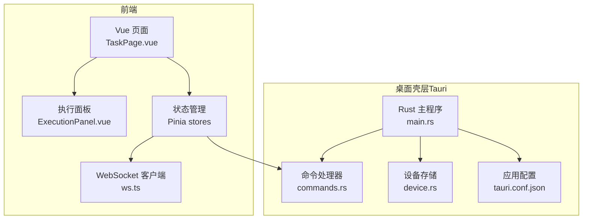
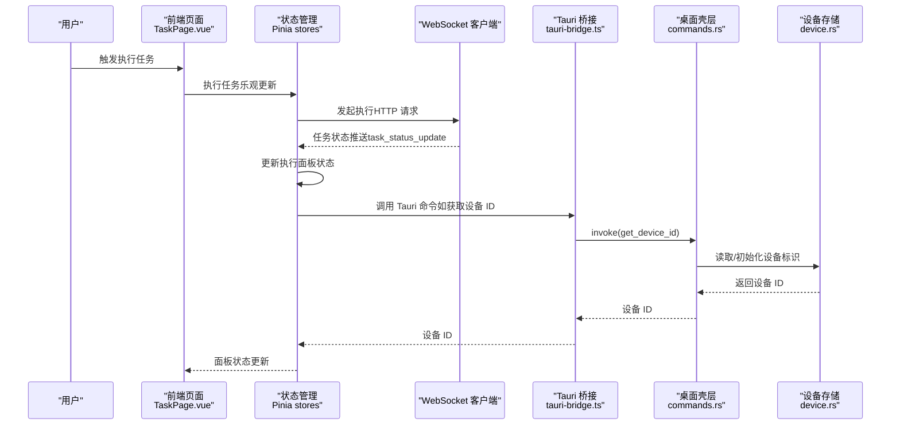
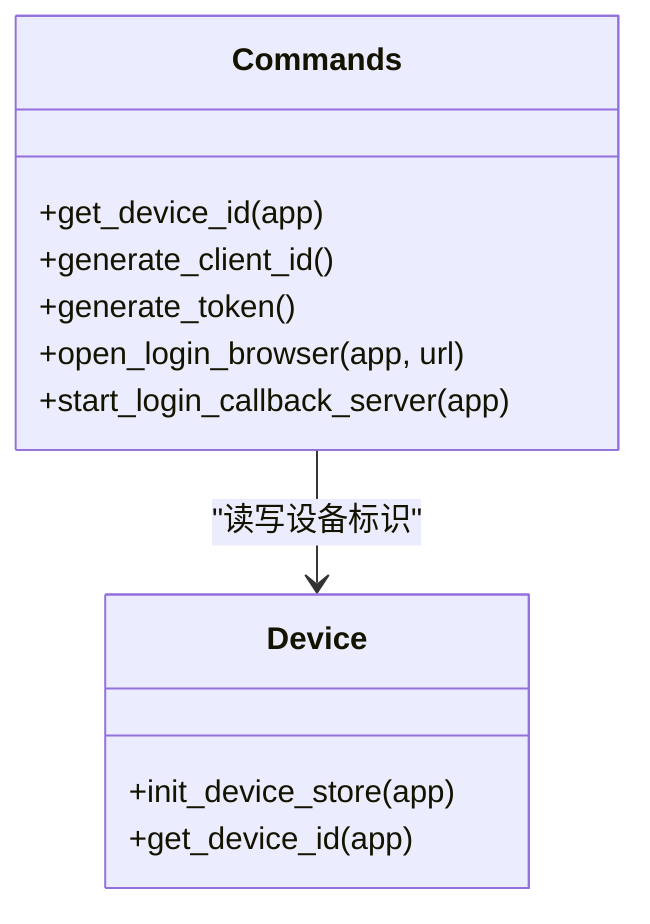
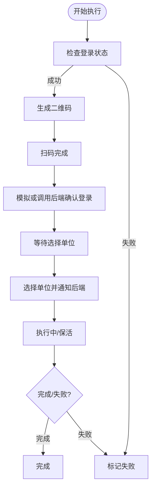
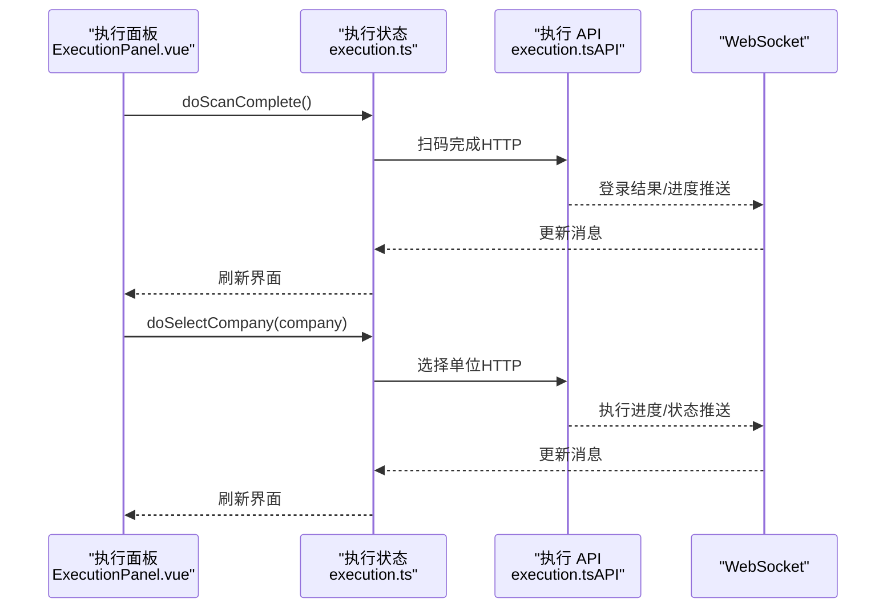
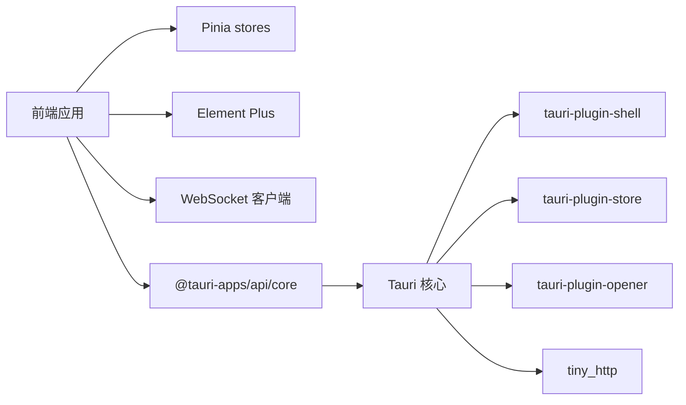

# Chrome 扩展接口

<cite>
**本文引用的文件**
- [main.rs](file://CCC-BrowserV4/src-tauri/src/main.rs)
- [commands.rs](file://CCC-BrowserV4/src-tauri/src/commands.rs)
- [device.rs](file://CCC-BrowserV4/src-tauri/src/device.rs)
- [tauri.conf.json](file://CCC-BrowserV4/src-tauri/tauri.conf.json)
- [tauri-bridge.ts](file://CCC-BrowserV4/frontend/src/utils/tauri-bridge.ts)
- [execution.ts](file://CCC-BrowserV4/frontend/src/stores/execution.ts)
- [execution.ts（API）](file://CCC-BrowserV4/frontend/src/api/execution.ts)
- [ExecutionPanel.vue](file://CCC-BrowserV4/frontend/src/components/ExecutionPanel.vue)
- [TaskPage.vue](file://CCC-BrowserV4/frontend/src/pages/TaskPage.vue)
- [task.ts](file://CCC-BrowserV4/frontend/src/stores/task.ts)
- [execution 类型定义](file://CCC-BrowserV4/frontend/src/types/execution.ts)
</cite>

## 目录
1. [简介](#简介)
2. [项目结构](#项目结构)
3. [核心组件](#核心组件)
4. [架构总览](#架构总览)
5. [详细组件分析](#详细组件分析)
6. [依赖关系分析](#依赖关系分析)
7. [性能考虑](#性能考虑)
8. [故障排查指南](#故障排查指南)
9. [结论](#结论)
10. [附录](#附录)

## 简介
本文件面向 Chrome 扩展与后端服务的接口文档，聚焦以下方面：
- 浏览器扩展与后端服务的通信协议：消息传递机制、事件监听与数据交换格式
- 扩展面板的 UI 组件、功能按钮与交互逻辑
- 与 Playwright 会话的集成方式：页面操作触发、截图捕获与状态同步（基于现有代码的可扩展性说明）
- 扩展安装配置、权限设置与调试方法
- 与桌面应用的协同工作机制：命令调用与数据共享
- 扩展开发指南与测试方法

## 项目结构
本项目采用“前端 Web 应用 + 桌面壳层（Tauri）”的混合架构：
- 前端使用 Vue 3 + TypeScript，负责 UI、状态管理与 WebSocket 通信
- 桌面壳层使用 Rust + Tauri，负责系统级能力（如打开外部浏览器、本地回调服务器、设备标识持久化等）

图表来源
- [main.rs:7-27](file://CCC-BrowserV4/src-tauri/src/main.rs#L7-L27)
- [commands.rs:10-91](file://CCC-BrowserV4/src-tauri/src/commands.rs#L10-L91)
- [device.rs:5-31](file://CCC-BrowserV4/src-tauri/src/device.rs#L5-L31)
- [tauri.conf.json:1-29](file://CCC-BrowserV4/src-tauri/tauri.conf.json#L1-L29)
- [TaskPage.vue:138-165](file://CCC-BrowserV4/frontend/src/pages/TaskPage.vue#L138-L165)
- [ExecutionPanel.vue:1-108](file://CCC-BrowserV4/frontend/src/components/ExecutionPanel.vue#L1-L108)

章节来源
- [main.rs:1-29](file://CCC-BrowserV4/src-tauri/src/main.rs#L1-L29)
- [tauri.conf.json:1-29](file://CCC-BrowserV4/src-tauri/tauri.conf.json#L1-L29)

## 核心组件
- 桌面壳层命令与事件
  - 设备标识获取与持久化
  - 客户端标识生成
  - 随机 Token 生成
  - 打开外部浏览器
  - 登录回调 HTTP 服务器与事件分发
- 前端状态与 UI
  - 执行状态机与消息处理
  - 任务列表与 WebSocket 推送
  - 执行面板的步骤驱动交互
- 通信桥接
  - Tauri 命令封装与调用
  - WebSocket 连接与消息转发

章节来源
- [commands.rs:10-91](file://CCC-BrowserV4/src-tauri/src/commands.rs#L10-L91)
- [device.rs:5-31](file://CCC-BrowserV4/src-tauri/src/device.rs#L5-L31)
- [tauri-bridge.ts:1-33](file://CCC-BrowserV4/frontend/src/utils/tauri-bridge.ts#L1-L33)
- [execution.ts:1-229](file://CCC-BrowserV4/frontend/src/stores/execution.ts#L1-L229)
- [task.ts:57-80](file://CCC-BrowserV4/frontend/src/stores/task.ts#L57-L80)

## 架构总览
下图展示从用户操作到后端服务与桌面壳层的交互路径。

图表来源
- [TaskPage.vue:255-267](file://CCC-BrowserV4/frontend/src/pages/TaskPage.vue#L255-L267)
- [execution.ts:122-132](file://CCC-BrowserV4/frontend/src/stores/execution.ts#L122-L132)
- [tauri-bridge.ts:10-10](file://CCC-BrowserV4/frontend/src/utils/tauri-bridge.ts#L10-L10)
- [commands.rs:10-14](file://CCC-BrowserV4/src-tauri/src/commands.rs#L10-L14)
- [device.rs:22-31](file://CCC-BrowserV4/src-tauri/src/device.rs#L22-L31)

## 详细组件分析

### 桌面壳层命令与事件
- 设备标识管理
  - 初始化持久化存储，生成并缓存设备 ID
  - 提供获取设备 ID 的命令接口
- 客户端标识与 Token
  - 生成每次登录会话唯一的客户端 ID
  - 生成随机 32 位十六进制 Token
- 外部浏览器与登录回调
  - 打开指定 URL 的外部浏览器
  - 启动本地回调 HTTP 服务器，解析回调参数并通过事件通知前端
- 事件分发
  - 将登录回调事件以 JSON 形式发送至前端

图表来源
- [commands.rs:10-91](file://CCC-BrowserV4/src-tauri/src/commands.rs#L10-L91)
- [device.rs:5-31](file://CCC-BrowserV4/src-tauri/src/device.rs#L5-L31)

章节来源
- [commands.rs:10-91](file://CCC-BrowserV4/src-tauri/src/commands.rs#L10-L91)
- [device.rs:5-31](file://CCC-BrowserV4/src-tauri/src/device.rs#L5-L31)

### 前端状态与消息处理
- 执行状态机
  - 状态包括：空闲、检查登录、扫码、等待单位、执行中、保活、完成、失败、取消
  - 通过 WebSocket 消息驱动状态切换
- 任务列表与推送
  - 订阅任务状态变更推送，更新 UI
  - 将相同消息转发给执行状态管理器
- 演示模式
  - 在后端不可用时，模拟扫码、选择单位与执行流程

图表来源
- [execution.ts:22-67](file://CCC-BrowserV4/frontend/src/stores/execution.ts#L22-L67)
- [execution.ts（API）:4-19](file://CCC-BrowserV4/frontend/src/api/execution.ts#L4-L19)

章节来源
- [execution.ts:1-229](file://CCC-BrowserV4/frontend/src/stores/execution.ts#L1-L229)
- [task.ts:57-80](file://CCC-BrowserV4/frontend/src/stores/task.ts#L57-L80)

### 执行面板 UI 与交互
- 步骤驱动界面
  - 检查登录、扫码、选择单位、执行中/保活、完成/失败/取消
- 交互逻辑
  - 扫码完成后主动通知后端
  - 选择单位后通知后端并进入执行阶段
  - 支持取消执行
- 数据绑定
  - 使用本地选中的单位与全局状态联动

图表来源
- [ExecutionPanel.vue:24-67](file://CCC-BrowserV4/frontend/src/components/ExecutionPanel.vue#L24-L67)
- [execution.ts:69-108](file://CCC-BrowserV4/frontend/src/stores/execution.ts#L69-L108)
- [execution.ts（API）:4-19](file://CCC-BrowserV4/frontend/src/api/execution.ts#L4-L19)

章节来源
- [ExecutionPanel.vue:1-322](file://CCC-BrowserV4/frontend/src/components/ExecutionPanel.vue#L1-L322)
- [execution.ts:69-108](file://CCC-BrowserV4/frontend/src/stores/execution.ts#L69-L108)
- [execution.ts（API）:1-20](file://CCC-BrowserV4/frontend/src/api/execution.ts#L1-L20)

### 任务页面与 WebSocket 集成
- 页面职责
  - 展示任务列表、分页与筛选
  - 触发执行任务并乐观更新状态
  - 初始化与销毁 WebSocket 连接
- 消息处理
  - 订阅任务状态推送，更新任务卡片
  - 将消息转发给执行状态管理器

章节来源
- [TaskPage.vue:138-165](file://CCC-BrowserV4/frontend/src/pages/TaskPage.vue#L138-L165)
- [task.ts:57-80](file://CCC-BrowserV4/frontend/src/stores/task.ts#L57-L80)

### Tauri 桥接与调用
- 命令封装
  - 对外暴露设备 ID、客户端 ID、Token、打开浏览器、启动回调服务器等命令
- 调用方式
  - 前端通过 invoke 调用对应命令，返回 Promise

章节来源
- [tauri-bridge.ts:1-33](file://CCC-BrowserV4/frontend/src/utils/tauri-bridge.ts#L1-L33)
- [main.rs:12-18](file://CCC-BrowserV4/src-tauri/src/main.rs#L12-L18)

## 依赖关系分析
- 前端依赖
  - Pinia 状态管理
  - Element Plus UI 组件
  - WebSocket 客户端（ws.ts）
  - Tauri 桥接（@tauri-apps/api/core）
- 桌面壳层依赖
  - tauri-plugin-shell、tauri-plugin-store、tauri-plugin-opener
  - tiny_http（本地回调服务器）
  - uuid、rand（标识与 Token 生成）

图表来源
- [main.rs:8-11](file://CCC-BrowserV4/src-tauri/src/main.rs#L8-L11)
- [tauri.conf.json:24-26](file://CCC-BrowserV4/src-tauri/tauri.conf.json#L24-L26)
- [tauri-bridge.ts:1-1](file://CCC-BrowserV4/frontend/src/utils/tauri-bridge.ts#L1-L1)

章节来源
- [main.rs:8-11](file://CCC-BrowserV4/src-tauri/src/main.rs#L8-L11)
- [tauri.conf.json:24-26](file://CCC-BrowserV4/src-tauri/tauri.conf.json#L24-L26)

## 性能考虑
- WebSocket 消息过滤
  - 执行状态按 taskId 过滤，避免无关消息干扰
- 前端渲染优化
  - 使用计算属性与本地选择状态减少不必要的重渲染
- 网络请求与演示模式
  - 在后端不可用时启用演示模式，降低对真实服务的依赖

## 故障排查指南
- 登录回调未到达前端
  - 检查本地回调服务器是否成功启动并监听端口
  - 确认回调 URL 参数解析正确
  - 核对事件名与前端监听一致
- 设备标识缺失
  - 确认设备存储初始化成功
  - 检查持久化文件是否存在
- 外部浏览器无法打开
  - 检查 URL 格式与系统默认浏览器配置
- WebSocket 推送不生效
  - 确认连接建立与断开时机
  - 检查消息类型与 taskId 匹配

章节来源
- [commands.rs:44-91](file://CCC-BrowserV4/src-tauri/src/commands.rs#L44-L91)
- [device.rs:5-31](file://CCC-BrowserV4/src-tauri/src/device.rs#L5-L31)
- [task.ts:57-80](file://CCC-BrowserV4/frontend/src/stores/task.ts#L57-L80)

## 结论
本接口文档梳理了 Chrome 扩展与后端服务的通信协议、前端 UI 与状态管理、桌面壳层命令与事件机制。通过 WebSocket 实时推送与 Tauri 命令桥接，实现了从任务执行到登录回调的闭环。建议在实际部署中关注 CSP 配置、回调服务器安全与前端状态一致性。

## 附录

### 通信协议与数据交换格式
- WebSocket 消息类型
  - 二维码推送：携带二维码图片数据
  - 单位列表推送：携带可选单位数组
  - 执行进度推送：携带步骤与消息
  - 登录结果推送：携带成功/失败与原因
  - 执行异常推送：携带异常消息
  - 任务状态更新：携带任务状态、结果与时间戳
- HTTP 接口
  - 扫码完成：POST /tasks/{id}/scan-complete
  - 选择单位：POST /tasks/{id}/select-company（携带公司 id 与名称）
  - 取消执行：POST /tasks/{id}/cancel-execution

章节来源
- [execution.ts:22-67](file://CCC-BrowserV4/frontend/src/stores/execution.ts#L22-L67)
- [execution.ts（API）:1-20](file://CCC-BrowserV4/frontend/src/api/execution.ts#L1-L20)

### 与 Playwright 会话的集成（可扩展说明）
- 页面操作触发
  - 通过后端服务触发浏览器自动化（例如打开目标站点、填写表单、点击按钮）
- 截图捕获
  - 在关键节点调用截图接口，将图像数据通过 WebSocket 推送前端展示
- 状态同步
  - 将页面状态（如登录态、业务页面识别）同步到前端，驱动执行面板状态切换

[本节为概念性说明，不直接映射到具体源文件]

### 安装配置与调试
- 应用配置
  - 产品名称、版本、窗口尺寸与最小尺寸、安全策略（CSP）
- 权限与 CSP
  - 允许本地回环地址与登录域名访问
- 调试
  - 前端：启用开发服务器与热更新
  - 桌面壳层：查看日志输出与命令返回值

章节来源
- [tauri.conf.json:1-29](file://CCC-BrowserV4/src-tauri/tauri.conf.json#L1-L29)
- [main.rs:19-25](file://CCC-BrowserV4/src-tauri/src/main.rs#L19-L25)

### 与桌面应用的协同机制
- 命令调用
  - 前端通过 Tauri 桥接调用桌面壳层命令（获取设备 ID、生成客户端 ID、打开浏览器、启动回调服务器）
- 数据共享
  - 设备 ID 通过持久化存储共享
  - 回调事件通过 Tauri 事件系统广播至前端

章节来源
- [tauri-bridge.ts:1-33](file://CCC-BrowserV4/frontend/src/utils/tauri-bridge.ts#L1-L33)
- [commands.rs:10-91](file://CCC-BrowserV4/src-tauri/src/commands.rs#L10-L91)
- [device.rs:5-31](file://CCC-BrowserV4/src-tauri/src/device.rs#L5-L31)

### 开发指南与测试方法
- 开发流程
  - 前端：npm run dev 启动 Vite 开发服务器；构建产物由 Tauri 打包
  - 桌面壳层：cargo run 启动 Tauri 应用
- 测试建议
  - 单元测试：针对状态管理与工具函数
  - 集成测试：WebSocket 推送、Tauri 命令调用、回调服务器行为
  - 端到端测试：模拟用户执行任务、扫码、选择单位与取消流程

[本节为通用指导，不直接映射到具体源文件]