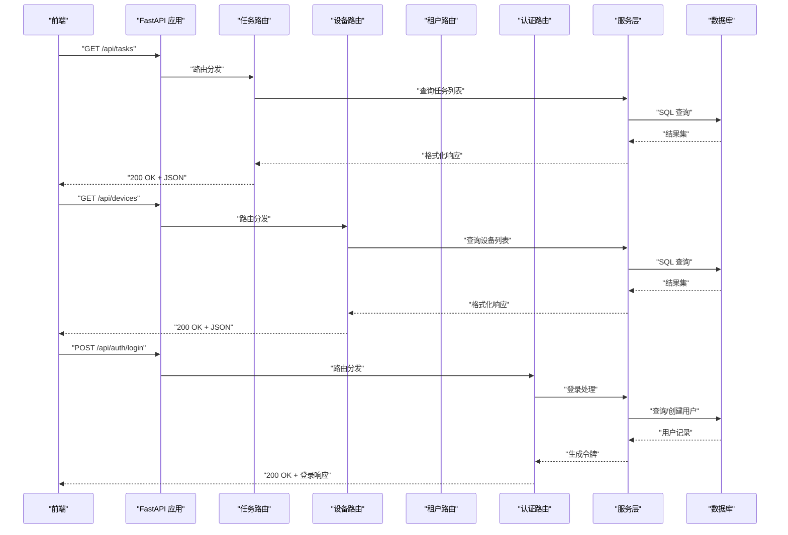
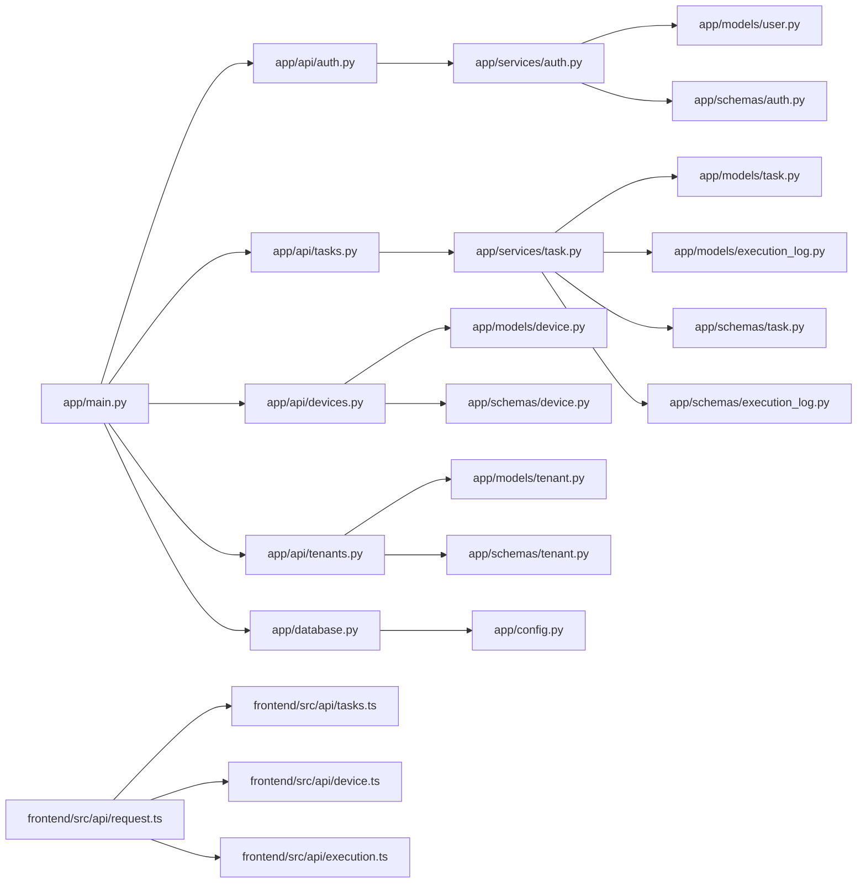
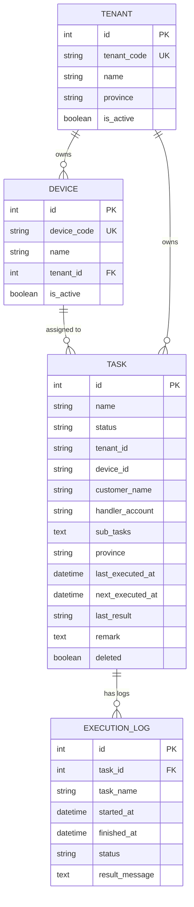

# RESTful API 接口

<cite>
**本文档引用的文件**
- [app/main.py](file://CCC_RPA_API/app/main.py)
- [app/api/tasks.py](file://CCC_RPA_API/app/api/tasks.py)
- [app/api/auth.py](file://CCC_RPA_API/app/api/auth.py)
- [app/api/devices.py](file://CCC_RPA_API/app/api/devices.py)
- [app/api/tenants.py](file://CCC_RPA_API/app/api/tenants.py)
- [app/services/task.py](file://CCC_RPA_API/app/services/task.py)
- [app/services/auth.py](file://CCC_RPA_API/app/services/auth.py)
- [app/models/task.py](file://CCC_RPA_API/app/models/task.py)
- [app/models/execution_log.py](file://CCC_RPA_API/app/models/execution_log.py)
- [app/models/device.py](file://CCC_RPA_API/app/models/device.py)
- [app/models/tenant.py](file://CCC_RPA_API/app/models/tenant.py)
- [app/schemas/task.py](file://CCC_RPA_API/app/schemas/task.py)
- [app/schemas/execution_log.py](file://CCC_RPA_API/app/schemas/execution_log.py)
- [app/schemas/auth.py](file://CCC_RPA_API/app/schemas/auth.py)
- [app/schemas/device.py](file://CCC_RPA_API/app/schemas/device.py)
- [app/schemas/tenant.py](file://CCC_RPA_API/app/schemas/tenant.py)
- [app/database.py](file://CCC_RPA_API/app/database.py)
- [app/config.py](file://CCC_RPA_API/app/config.py)
- [CCC-RPA-API 项目说明](file://project.md)
- [前端请求封装 request.ts](file://CCC-BrowserV4/frontend/src/api/request.ts)
- [前端任务 API tasks.ts](file://CCC-BrowserV4/frontend/src/api/tasks.ts)
- [前端执行控制 API execution.ts](file://CCC-BrowserV4/frontend/src/api/execution.ts)
- [前端设备 API device.ts](file://CCC-BrowserV4/frontend/src/api/device.ts)
</cite>

## 更新摘要
**所做更改**
- 新增完整的设备管理API接口文档，包括设备列表查询、详情获取、创建、更新、删除等完整CRUD操作
- 新增租户管理API接口文档，包括租户列表查询、详情获取、创建、更新、删除等完整CRUD操作
- 更新任务管理接口，增加tenantId和deviceId字段支持
- 更新数据库迁移脚本，添加设备和租户相关表结构
- 更新前端设备和租户API调用方法

## 目录
1. [简介](#简介)
2. [项目结构](#项目结构)
3. [核心组件](#核心组件)
4. [架构总览](#架构总览)
5. [详细组件分析](#详细组件分析)
6. [依赖关系分析](#依赖关系分析)
7. [性能考虑](#性能考虑)
8. [故障排除指南](#故障排除指南)
9. [结论](#结论)
10. [附录](#附录)

## 简介
本文件为 CCC RPA 项目的 RESTful API 接口文档，覆盖任务管理、设备管理、租户管理、任务日志、执行控制与认证相关接口。文档说明每个接口的 HTTP 方法、URL 路径、请求参数、响应数据格式、状态码，并提供请求与响应示例、认证方式、请求头设置、参数验证规则以及分页、过滤与排序的使用说明。

**更新** 本次更新反映了API从mock数据迁移到数据库驱动实现的重大变化，新增了完整的设备管理和租户管理功能。

## 项目结构
- 后端采用 FastAPI，路由集中在 app/api 下，业务逻辑位于 app/services，数据模型位于 app/models，数据校验模型位于 app/schemas。
- 前端使用 axios 封装统一请求，基础路径指向 /api，便于与后端路由匹配。
- 数据库通过 SQLAlchemy 连接，支持 MySQL，包含任务、设备、租户等核心表结构。

```mermaid
graph TB
subgraph "后端"
M["app/main.py<br/>应用入口与路由注册"]
TAPI["app/api/tasks.py<br/>任务接口路由"]
DAPI["app/api/devices.py<br/>设备接口路由"]
TAPI["app/api/tenants.py<br/>租户接口路由"]
AAPI["app/api/auth.py<br/>认证接口路由"]
TSVC["app/services/task.py<br/>任务服务"]
ASVC["app/services/auth.py<br/>认证服务"]
MODELS["app/models/*.py<br/>ORM 模型"]
SCHEMAS["app/schemas/*.py<br/>Pydantic 校验模型"]
DB["app/database.py<br/>数据库连接"]
CFG["app/config.py<br/>配置"]
end
subgraph "前端"
REQ["frontend/src/api/request.ts<br/>axios 封装"]
TASKS["frontend/src/api/tasks.ts<br/>任务 API"]
DEVICE["frontend/src/api/device.ts<br/>设备 API"]
EXEC["frontend/src/api/execution.ts<br/>执行控制 API"]
END
REQ --> TASKS
REQ --> DEVICE
REQ --> EXEC
TASKS --> TAPI
DEVICE --> DAPI
EXEC --> TAPI
AAPI --> ASVC
TAPI --> TSVC
TSVC --> MODELS
TSVC --> SCHEMAS
ASVC --> MODELS
ASVC --> SCHEMAS
M --> TAPI
M --> DAPI
M --> TAPI
M --> AAPI
M --> DB
DB --> CFG
```

**图表来源**
- [app/main.py:24-27](file://CCC_RPA_API/app/main.py#L24-L27)
- [app/api/tasks.py:10](file://CCC_RPA_API/app/api/tasks.py#L10)
- [app/api/devices.py:15](file://CCC_RPA_API/app/api/devices.py#L15)
- [app/api/tenants.py:15](file://CCC_RPA_API/app/api/tenants.py#L15)
- [app/api/auth.py:7](file://CCC_RPA_API/app/api/auth.py#L7)
- [app/services/task.py:44](file://CCC_RPA_API/app/services/task.py#L44)
- [app/services/auth.py:6](file://CCC_RPA_API/app/services/auth.py#L6)
- [app/database.py:1-19](file://CCC_RPA_API/app/database.py#L1-L19)
- [app/config.py:6-22](file://CCC_RPA_API/app/config.py#L6-L22)
- [CCC-BrowserV4/frontend/src/api/request.ts:1-18](file://CCC-BrowserV4/frontend/src/api/request.ts#L1-L18)
- [CCC-BrowserV4/frontend/src/api/tasks.ts:1-41](file://CCC-BrowserV4/frontend/src/api/tasks.ts#L1-L41)
- [CCC-BrowserV4/frontend/src/api/device.ts:1-22](file://CCC-BrowserV4/frontend/src/api/device.ts#L1-L22)
- [CCC-BrowserV4/frontend/src/api/execution.ts:1-20](file://CCC-BrowserV4/frontend/src/api/execution.ts#L1-L20)

**章节来源**
- [app/main.py:24-27](file://CCC_RPA_API/app/main.py#L24-L27)
- [app/database.py:1-19](file://CCC_RPA_API/app/database.py#L1-L19)
- [app/config.py:6-22](file://CCC_RPA_API/app/config.py#L6-L22)
- [CCC-BrowserV4/frontend/src/api/request.ts:1-18](file://CCC-BrowserV4/frontend/src/api/request.ts#L1-L18)

## 核心组件
- 任务接口模块：提供任务的增删改查、执行、日志查询及执行过程中的交互信号。
- 设备管理接口模块：提供设备的增删改查、状态管理等完整CRUD操作。
- 租户管理接口模块：提供租户的增删改查、状态管理等完整CRUD操作。
- 认证接口模块：提供登录、登出、校验接口。
- 服务层：封装数据库操作、数据转换与执行调度。
- 数据模型与 Pydantic 校验模型：定义数据库表结构与请求/响应数据格式。
- 数据库与配置：MySQL 连接、环境变量配置。

**更新** 新增设备管理和租户管理模块，完善了RPA系统的基础设施管理能力。

**章节来源**
- [app/api/tasks.py:10-76](file://CCC_RPA_API/app/api/tasks.py#L10-L76)
- [app/api/devices.py:15-106](file://CCC_RPA_API/app/api/devices.py#L15-L106)
- [app/api/tenants.py:15-100](file://CCC_RPA_API/app/api/tenants.py#L15-L100)
- [app/api/auth.py:7-24](file://CCC_RPA_API/app/api/auth.py#L7-L24)
- [app/services/task.py:44-157](file://CCC_RPA_API/app/services/task.py#L44-L157)
- [app/services/auth.py:6-58](file://CCC_RPA_API/app/services/auth.py#L6-L58)
- [app/models/task.py:8-25](file://CCC_RPA_API/app/models/task.py#L8-L25)
- [app/models/execution_log.py:7-17](file://CCC_RPA_API/app/models/execution_log.py#L7-L17)
- [app/models/device.py:7-14](file://CCC_RPA_API/app/models/device.py#L7-L14)
- [app/models/tenant.py:7-14](file://CCC_RPA_API/app/models/tenant.py#L7-L14)
- [app/schemas/task.py:5-58](file://CCC_RPA_API/app/schemas/task.py#L5-L58)
- [app/schemas/execution_log.py:4-19](file://CCC_RPA_API/app/schemas/execution_log.py#L4-L19)
- [app/schemas/device.py:5-43](file://CCC_RPA_API/app/schemas/device.py#L5-L43)
- [app/schemas/tenant.py:5-43](file://CCC_RPA_API/app/schemas/tenant.py#L5-L43)
- [app/schemas/auth.py:5-26](file://CCC_RPA_API/app/schemas/auth.py#L5-L26)

## 架构总览
- 应用启动时创建数据库表并进行必要的列迁移，随后注册认证、任务、设备、租户路由。
- 前端通过 /api 基础路径调用后端接口，后端使用依赖注入获取数据库会话，服务层负责业务逻辑与数据转换。



**图表来源**
- [app/main.py:24-27](file://CCC_RPA_API/app/main.py#L24-L27)
- [app/api/tasks.py:13-15](file://CCC_RPA_API/app/api/tasks.py#L13-L15)
- [app/api/devices.py:36-47](file://CCC_RPA_API/app/api/devices.py#L36-L47)
- [app/api/tenants.py:36-41](file://CCC_RPA_API/app/api/tenants.py#L36-L41)
- [app/api/auth.py:10-12](file://CCC_RPA_API/app/api/auth.py#L10-L12)
- [app/services/task.py:47-64](file://CCC_RPA_API/app/services/task.py#L47-L64)
- [app/services/auth.py:9-38](file://CCC_RPA_API/app/services/auth.py#L9-L38)

## 详细组件分析

### 认证接口
- 登录
  - 方法与路径：POST /api/auth/login
  - 请求头：Content-Type: application/json
  - 请求体字段：
    - client_id: 字符串，必填
    - token: 字符串，必填
    - device_id: 字符串，必填
    - username: 字符串，可选，默认"开发者"
  - 成功响应字段：
    - userId: 字符串
    - username: 字符串
    - token: 字符串
  - 状态码：200 成功；422 参数校验失败；500 服务器错误
  - 示例请求（JSON）：
    {
      "client_id": "your_client_id",
      "token": "your_token",
      "device_id": "device_001",
      "username": "张三"
    }
  - 示例响应（JSON）：
    {
      "userId": "user_abc",
      "username": "张三",
      "token": "login_token_123"
    }

- 登出
  - 方法与路径：POST /api/auth/logout
  - 请求体字段：
    - userId: 字符串，必填
  - 成功响应：{"message": "登出成功"}
  - 状态码：200 成功；422 参数校验失败；500 服务器错误

- 校验
  - 方法与路径：GET /api/auth/verify?userId={userId}
  - 查询参数：
    - userId: 字符串，必填
  - 成功响应字段：
    - valid: 布尔
    - userId: 字符串，可选
    - username: 字符串，可选
  - 状态码：200 成功；422 参数校验失败；500 服务器错误

**章节来源**
- [app/api/auth.py:10-23](file://CCC_RPA_API/app/api/auth.py#L10-L23)
- [app/schemas/auth.py:5-26](file://CCC_RPA_API/app/schemas/auth.py#L5-L26)
- [app/services/auth.py:9-57](file://CCC_RPA_API/app/services/auth.py#L9-L57)

### 任务管理接口
- 获取任务列表
  - 方法与路径：GET /api/tasks
  - 查询参数：
    - keyword: 字符串，可选，按任务名称模糊搜索
    - status: 字符串，可选，按状态过滤
    - page: 整数，可选，默认 1
    - page_size: 整数，可选，默认 20
  - 成功响应字段：
    - items: 数组，元素为任务对象
    - total: 整数，总数
    - page: 整数，当前页
    - page_size: 整数，页大小
  - 任务对象字段：
    - id: 整数
    - name: 字符串
    - status: 字符串，枚举：pending/running/completed/failed
    - tenantId: 字符串，可选
    - deviceId: 字符串，可选
    - customerName: 字符串，可选
    - handlerAccount: 字符串，可选
    - subTasks: 数组，字符串，可选
    - province: 字符串，可选
    - lastExecutedAt: 字符串，日期时间，可选
    - nextExecutedAt: 字符串，日期时间，可选
    - lastResult: 字符串，枚举：success/failed/None，可选
    - remark: 字符串，可选
    - deleted: 布尔
    - createdAt: 字符串，日期时间
    - updatedAt: 字符串，日期时间
  - 状态码：200 成功；422 参数校验失败；500 服务器错误
  - 示例请求：GET /api/tasks?keyword=采集&status=pending&page=1&page_size=20
  - 示例响应（片段）：
    {
      "items": [
        {
          "id": 1,
          "name": "企业信息采集",
          "status": "pending",
          "tenantId": "t_001",
          "deviceId": "d_001",
          "customerName": "默认客户",
          "handlerAccount": null,
          "subTasks": ["步骤A","步骤B"],
          "province": "北京",
          "lastExecutedAt": "",
          "nextExecutedAt": "",
          "lastResult": null,
          "remark": "定期采集企业工商信息变更",
          "deleted": false,
          "createdAt": "2025-01-01 12:00:00",
          "updatedAt": "2025-01-01 12:00:00"
        }
      ],
      "total": 1,
      "page": 1,
      "page_size": 20
    }

- 创建任务
  - 方法与路径：POST /api/tasks
  - 请求体字段：
    - name: 字符串，必填
    - tenant_id: 字符串，可选
    - device_id: 字符串，可选
    - customer_name: 字符串，可选
    - handler_account: 字符串，可选
    - sub_tasks: 数组，字符串，可选
    - province: 字符串，可选
    - remark: 字符串，可选
  - 成功响应：任务对象
  - 状态码：201 成功；422 参数校验失败；500 服务器错误
  - 示例请求（JSON）：
    {
      "name": "信用数据同步",
      "tenant_id": "t_001",
      "device_id": "d_001",
      "customer_name": "客户A",
      "handler_account": "user_a",
      "sub_tasks": ["步骤1","步骤2"],
      "province": "上海",
      "remark": "同步信用中国最新数据"
    }

- 获取单个任务
  - 方法与路径：GET /api/tasks/{task_id}
  - 路径参数：
    - task_id: 整数，必填
  - 成功响应：任务对象
  - 状态码：200 成功；404 任务不存在；422 参数校验失败；500 服务器错误

- 更新任务
  - 方法与路径：PUT /api/tasks/{task_id}
  - 路径参数：
    - task_id: 整数，必填
  - 请求体字段（可选字段组合）：
    - name: 字符串
    - status: 字符串，枚举：pending/running/completed/failed
    - tenant_id: 字符串
    - device_id: 字符串
    - customer_name: 字符串
    - handler_account: 字符串
    - sub_tasks: 数组，字符串
    - province: 字符串
    - remark: 字符串
    - last_executed_at: 字符串（日期时间）
    - next_executed_at: 字符串（日期时间）
    - last_result: 字符串，枚举：success/failed/None
  - 成功响应：任务对象
  - 状态码：200 成功；404 任务不存在；422 参数校验失败；500 服务器错误

- 删除任务
  - 方法与路径：DELETE /api/tasks/{task_id}
  - 路径参数：
    - task_id: 整数，必填
  - 成功响应：{"message": "删除成功"}
  - 状态码：200 成功；404 任务不存在；500 服务器错误

- 执行任务
  - 方法与路径：POST /api/tasks/{task_id}/execute
  - 路径参数：
    - task_id: 整数，必填
  - 成功响应：任务对象（状态更新为 running）
  - 错误响应：{"detail": "任务不存在"}（400）
  - 状态码：200 成功；400 任务不存在或执行错误；500 服务器错误
  - 注意：执行后会提交到执行器，具体执行状态可通过日志接口查询。

- 获取任务日志
  - 方法与路径：GET /api/tasks/{task_id}/logs
  - 路径参数：
    - task_id: 整数，必填
  - 查询参数：
    - page: 整数，可选，默认 1
    - page_size: 整数，可选，默认 20
  - 成功响应字段：
    - items: 数组，元素为日志对象
    - total: 整数，总数
  - 日志对象字段：
    - id: 整数
    - taskId: 整数
    - taskName: 字符串
    - startedAt: 字符串，日期时间
    - finishedAt: 字符串，日期时间，可选
    - status: 字符串，枚举：running/completed/failed
    - resultMessage: 字符串，可选
  - 状态码：200 成功；422 参数校验失败；500 服务器错误
  - 示例响应（片段）：
    {
      "items": [
        {
          "id": 101,
          "taskId": 1,
          "taskName": "企业信息采集",
          "startedAt": "2025-01-01 13:00:00",
          "finishedAt": "2025-01-01 13:05:00",
          "status": "completed",
          "resultMessage": "执行成功"
        }
      ],
      "total": 1
    }

- 扫码完成信号
  - 方法与路径：POST /api/tasks/{task_id}/scan-complete
  - 路径参数：
    - task_id: 整数，必填
  - 成功响应：{"success": true}
  - 状态码：200 成功；500 服务器错误

- 选择公司
  - 方法与路径：POST /api/tasks/{task_id}/select-company
  - 路径参数：
    - task_id: 整数，必填
  - 请求体字段：
    - company_id: 字符串，必填
    - company_name: 字符串，必填
  - 成功响应：{"success": true}
  - 状态码：200 成功；500 服务器错误

- 取消执行
  - 方法与路径：POST /api/tasks/{task_id}/cancel-execution
  - 路径参数：
    - task_id: 整数，必填
  - 成功响应：{"success": true}
  - 状态码：200 成功；500 服务器错误

**章节来源**
- [app/api/tasks.py:13-76](file://CCC_RPA_API/app/api/tasks.py#L13-L76)
- [app/schemas/task.py:5-58](file://CCC_RPA_API/app/schemas/task.py#L5-L58)
- [app/schemas/execution_log.py:4-19](file://CCC_RPA_API/app/schemas/execution_log.py#L4-L19)
- [app/services/task.py:47-157](file://CCC_RPA_API/app/services/task.py#L47-L157)
- [app/models/task.py:8-25](file://CCC_RPA_API/app/models/task.py#L8-L25)
- [app/models/execution_log.py:7-17](file://CCC_RPA_API/app/models/execution_log.py#L7-L17)

### 设备管理接口
- 获取设备列表
  - 方法与路径：GET /api/devices
  - 查询参数：
    - tenant_id: 整数，可选，按租户ID筛选
  - 成功响应：数组，元素为简化设备对象
  - 简化设备对象字段：
    - id: 字符串，返回设备编码（device_code）
    - name: 字符串
  - 状态码：200 成功；500 服务器错误

- 获取设备详情
  - 方法与路径：GET /api/devices/{device_id}
  - 路径参数：
    - device_id: 整数，必填
  - 成功响应字段：
    - id: 整数
    - deviceCode: 字符串
    - name: 字符串
    - tenantId: 整数，可选
    - isActive: 布尔
    - createdAt: 字符串，ISO 8601格式
    - updatedAt: 字符串，ISO 8601格式
  - 状态码：200 成功；404 设备不存在；500 服务器错误

- 创建设备
  - 方法与路径：POST /api/devices
  - 请求体字段：
    - device_code: 字符串，必填，设备唯一编码
    - name: 字符串，必填，设备名称
    - tenant_id: 整数，可选，所属租户ID
  - 成功响应：完整设备详情对象
  - 状态码：201 成功；400 设备编码已存在；422 参数校验失败；500 服务器错误
  - 示例请求（JSON）：
    {
      "device_code": "device-003",
      "name": "测试设备",
      "tenant_id": 1
    }

- 更新设备
  - 方法与路径：PUT /api/devices/{device_id}
  - 路径参数：
    - device_id: 整数，必填
  - 请求体字段（可选字段组合）：
    - name: 字符串，可选
    - tenant_id: 整数，可选
    - is_active: 布尔，可选
  - 成功响应：完整设备详情对象
  - 状态码：200 成功；404 设备不存在；422 参数校验失败；500 服务器错误

- 删除设备
  - 方法与路径：DELETE /api/devices/{device_id}
  - 路径参数：
    - device_id: 整数，必填
  - 成功响应：{"message": "删除成功"}
  - 状态码：200 成功；404 设备不存在；500 服务器错误

**更新** 新增完整的设备管理API接口，支持设备的全生命周期管理。

**章节来源**
- [app/api/devices.py:36-106](file://CCC_RPA_API/app/api/devices.py#L36-L106)
- [app/schemas/device.py:5-43](file://CCC_RPA_API/app/schemas/device.py#L5-L43)
- [app/models/device.py:7-14](file://CCC_RPA_API/app/models/device.py#L7-L14)

### 租户管理接口
- 获取租户列表
  - 方法与路径：GET /api/tenants
  - 查询参数：无
  - 成功响应：数组，元素为简化租户对象
  - 简化租户对象字段：
    - id: 字符串，返回租户编码（tenant_code）
    - name: 字符串
  - 状态码：200 成功；500 服务器错误

- 获取租户详情
  - 方法与路径：GET /api/tenants/{tenant_id}
  - 路径参数：
    - tenant_id: 整数，必填
  - 成功响应字段：
    - id: 整数
    - tenantCode: 字符串
    - name: 字符串
    - province: 字符串，可选
    - isActive: 布尔
    - createdAt: 字符串，ISO 8601格式
    - updatedAt: 字符串，ISO 8601格式
  - 状态码：200 成功；404 租户不存在；500 服务器错误

- 创建租户
  - 方法与路径：POST /api/tenants
  - 请求体字段：
    - tenant_code: 字符串，必填，租户唯一编码
    - name: 字符串，必填，租户名称
    - province: 字符串，可选，所在省份
  - 成功响应：完整租户详情对象
  - 状态码：201 成功；400 租户编码已存在；422 参数校验失败；500 服务器错误
  - 示例请求（JSON）：
    {
      "tenant_code": "t_004",
      "name": "测试租户",
      "province": "广东"
    }

- 更新租户
  - 方法与路径：PUT /api/tenants/{tenant_id}
  - 路径参数：
    - tenant_id: 整数，必填
  - 请求体字段（可选字段组合）：
    - name: 字符串，可选
    - province: 字符串，可选
    - is_active: 布尔，可选
  - 成功响应：完整租户详情对象
  - 状态码：200 成功；404 租户不存在；422 参数校验失败；500 服务器错误

- 删除租户
  - 方法与路径：DELETE /api/tenants/{tenant_id}
  - 路径参数：
    - tenant_id: 整数，必填
  - 成功响应：{"message": "删除成功"}
  - 状态码：200 成功；404 租户不存在；500 服务器错误

**更新** 新增完整的租户管理API接口，支持多租户架构下的租户全生命周期管理。

**章节来源**
- [app/api/tenants.py:36-100](file://CCC_RPA_API/app/api/tenants.py#L36-L100)
- [app/schemas/tenant.py:5-43](file://CCC_RPA_API/app/schemas/tenant.py#L5-L43)
- [app/models/tenant.py:7-14](file://CCC_RPA_API/app/models/tenant.py#L7-L14)

### 执行状态接口
- WebSocket 实时通道
  - 路径：/ws
  - 用途：用于推送执行状态、页面截图、操作日志、AI 执行结果等实时消息。
  - 说明：该通道用于与浏览器会话相关的实时通信，不在本节的 HTTP 接口范围内。

**章节来源**
- [app/main.py:148-156](file://CCC_RPA_API/app/main.py#L148-L156)

## 依赖关系分析
- 路由依赖：app/main.py 注册了认证、任务、设备、租户路由。
- 服务依赖：任务、认证、设备、租户服务依赖 SQLAlchemy 会话与模型。
- 数据模型：任务、设备、租户、执行日志模型定义字段与索引。
- 前端依赖：前端通过 axios 封装统一请求，基础路径为 /api。



**图表来源**
- [app/main.py:24-27](file://CCC_RPA_API/app/main.py#L24-L27)
- [app/api/tasks.py:10](file://CCC_RPA_API/app/api/tasks.py#L10)
- [app/api/devices.py:15](file://CCC_RPA_API/app/api/devices.py#L15)
- [app/api/tenants.py:15](file://CCC_RPA_API/app/api/tenants.py#L15)
- [app/api/auth.py:7](file://CCC_RPA_API/app/api/auth.py#L7)
- [app/services/task.py:44](file://CCC_RPA_API/app/services/task.py#L44)
- [app/services/auth.py:6](file://CCC_RPA_API/app/services/auth.py#L6)
- [app/models/task.py:8-25](file://CCC_RPA_API/app/models/task.py#L8-L25)
- [app/models/execution_log.py:7-17](file://CCC_RPA_API/app/models/execution_log.py#L7-L17)
- [app/models/device.py:7-14](file://CCC_RPA_API/app/models/device.py#L7-L14)
- [app/models/tenant.py:7-14](file://CCC_RPA_API/app/models/tenant.py#L7-L14)
- [app/schemas/task.py:5-58](file://CCC_RPA_API/app/schemas/task.py#L5-L58)
- [app/schemas/execution_log.py:4-19](file://CCC_RPA_API/app/schemas/execution_log.py#L4-L19)
- [app/schemas/device.py:5-43](file://CCC_RPA_API/app/schemas/device.py#L5-L43)
- [app/schemas/tenant.py:5-43](file://CCC_RPA_API/app/schemas/tenant.py#L5-L43)
- [app/schemas/auth.py:5-26](file://CCC_RPA_API/app/schemas/auth.py#L5-L26)
- [app/database.py:1-19](file://CCC_RPA_API/app/database.py#L1-L19)
- [app/config.py:6-22](file://CCC_RPA_API/app/config.py#L6-L22)
- [CCC-BrowserV4/frontend/src/api/request.ts:1-18](file://CCC-BrowserV4/frontend/src/api/request.ts#L1-L18)
- [CCC-BrowserV4/frontend/src/api/tasks.ts:1-41](file://CCC-BrowserV4/frontend/src/api/tasks.ts#L1-L41)
- [CCC-BrowserV4/frontend/src/api/device.ts:1-22](file://CCC-BrowserV4/frontend/src/api/device.ts#L1-L22)
- [CCC-BrowserV4/frontend/src/api/execution.ts:1-20](file://CCC-BrowserV4/frontend/src/api/execution.ts#L1-L20)

**章节来源**
- [app/main.py:24-27](file://CCC_RPA_API/app/main.py#L24-L27)
- [app/database.py:1-19](file://CCC_RPA_API/app/database.py#L1-L19)
- [app/config.py:6-22](file://CCC_RPA_API/app/config.py#L6-L22)
- [CCC-BrowserV4/frontend/src/api/request.ts:1-18](file://CCC-BrowserV4/frontend/src/api/request.ts#L1-L18)

## 性能考虑
- 分页与排序：接口支持 page/page_size 与默认降序排序（任务按 id 降序），避免一次性返回大量数据。
- 过滤：支持按关键字与状态过滤，减少无关数据传输。
- 数据库索引：任务表对 name、status、deleted 等字段建立索引，设备表对 device_code、tenant_id 建立索引，租户表对 tenant_code 建立索引，提升查询效率。
- 软删除：设备和租户采用软删除策略（is_active 字段），避免数据丢失同时保持查询性能。
- 建议：在高频查询场景下，合理设置 page_size，避免过大页导致响应缓慢。

**更新** 新增设备和租户表的索引优化建议，提升多租户场景下的查询性能。

## 故障排除指南
- 404 任务不存在：当请求的任务 ID 不存在或已被软删除时，返回 404 或错误详情。
- 404 设备不存在：当请求的设备 ID 不存在或已被软删除时，返回 404 或错误详情。
- 404 租户不存在：当请求的租户 ID 不存在或已被软删除时，返回 404 或错误详情。
- 400 执行错误：执行任务时若前置检查失败，返回 400 与错误详情。
- 400 编码已存在：创建设备或租户时，若设备编码或租户编码重复，返回 400 错误。
- 422 参数校验失败：请求体或查询参数不符合 Pydantic 校验规则。
- 500 服务器错误：数据库异常、执行器未就绪等。

**更新** 新增设备和租户相关的错误类型说明。

**章节来源**
- [app/api/tasks.py:26-28](file://CCC_RPA_API/app/api/tasks.py#L26-L28)
- [app/api/tasks.py:42-44](file://CCC_RPA_API/app/api/tasks.py#L42-L44)
- [app/api/tasks.py:50-51](file://CCC_RPA_API/app/api/tasks.py#L50-L51)
- [app/api/devices.py:62-64](file://CCC_RPA_API/app/api/devices.py#L62-L64)
- [app/api/tenants.py:56-58](file://CCC_RPA_API/app/api/tenants.py#L56-L58)
- [app/schemas/task.py:5-58](file://CCC_RPA_API/app/schemas/task.py#L5-L58)

## 结论
本接口文档覆盖了任务管理、设备管理、租户管理、任务日志、执行控制与认证的核心 HTTP 接口，明确了请求参数、响应格式、状态码与分页/过滤/排序的使用方式。新增的设备和租户管理接口完善了RPA系统的基础设施管理能力，支持多租户架构下的设备资源分配和租户隔离。前端通过统一的 axios 封装与后端路由保持一致，便于集成与扩展。

**更新** 本次更新反映了API从mock数据迁移到数据库驱动实现的重要里程碑，新增的设备和租户管理功能为系统提供了完整的基础设施管理能力。

## 附录

### 认证与请求头
- 基础路径：/api
- 请求头：Content-Type: application/json
- 认证方式：后端提供登录/登出/校验接口，前端可参考认证接口进行用户态管理。

**章节来源**
- [app/api/auth.py:10-23](file://CCC_RPA_API/app/api/auth.py#L10-L23)
- [CCC-BrowserV4/frontend/src/api/request.ts:1-18](file://CCC-BrowserV4/frontend/src/api/request.ts#L1-L18)

### 数据模型概览


**图表来源**
- [app/models/task.py:8-25](file://CCC_RPA_API/app/models/task.py#L8-L25)
- [app/models/execution_log.py:7-17](file://CCC_RPA_API/app/models/execution_log.py#L7-L17)
- [app/models/device.py:7-14](file://CCC_RPA_API/app/models/device.py#L7-L14)
- [app/models/tenant.py:7-14](file://CCC_RPA_API/app/models/tenant.py#L7-L14)

### 前端调用示例
- 任务列表：GET /api/tasks?keyword=&status=&page=1&page_size=20
- 创建任务：POST /api/tasks
- 更新任务：PUT /api/tasks/{task_id}
- 删除任务：DELETE /api/tasks/{task_id}
- 执行任务：POST /api/tasks/{task_id}/execute
- 任务日志：GET /api/tasks/{task_id}/logs?page=1&page_size=20
- 扫码完成：POST /api/tasks/{task_id}/scan-complete
- 选择公司：POST /api/tasks/{task_id}/select-company
- 取消执行：POST /api/tasks/{task_id}/cancel-execution

- 设备列表：GET /api/devices?tenant_id=
- 设备详情：GET /api/devices/{device_id}
- 创建设备：POST /api/devices
- 更新设备：PUT /api/devices/{device_id}
- 删除设备：DELETE /api/devices/{device_id}

- 租户列表：GET /api/tenants
- 租户详情：GET /api/tenants/{tenant_id}
- 创建租户：POST /api/tenants
- 更新租户：PUT /api/tenants/{tenant_id}
- 删除租户：DELETE /api/tenants/{tenant_id}

**更新** 新增设备和租户管理的前端调用示例。

**章节来源**
- [CCC-BrowserV4/frontend/src/api/tasks.ts:5-40](file://CCC-BrowserV4/frontend/src/api/tasks.ts#L5-L40)
- [CCC-BrowserV4/frontend/src/api/device.ts:13-21](file://CCC-BrowserV4/frontend/src/api/device.ts#L13-L21)
- [CCC-BrowserV4/frontend/src/api/execution.ts:4-19](file://CCC-BrowserV4/frontend/src/api/execution.ts#L4-L19)
- [CCC-BrowserV4/frontend/src/api/request.ts:1-18](file://CCC-BrowserV4/frontend/src/api/request.ts#L1-L18)

### 与项目说明的对照
- 项目说明中描述了统一 RESTful/WS API 网关规范与对外接口清单，本仓库实现了任务、设备、租户与认证相关接口，符合统一标准。

**章节来源**
- [project.md:447-462](file://project.md#L447-L462)