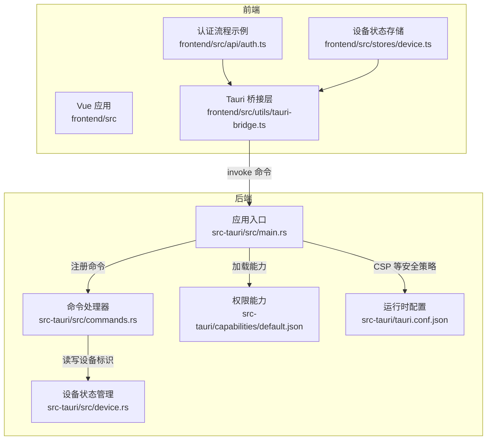
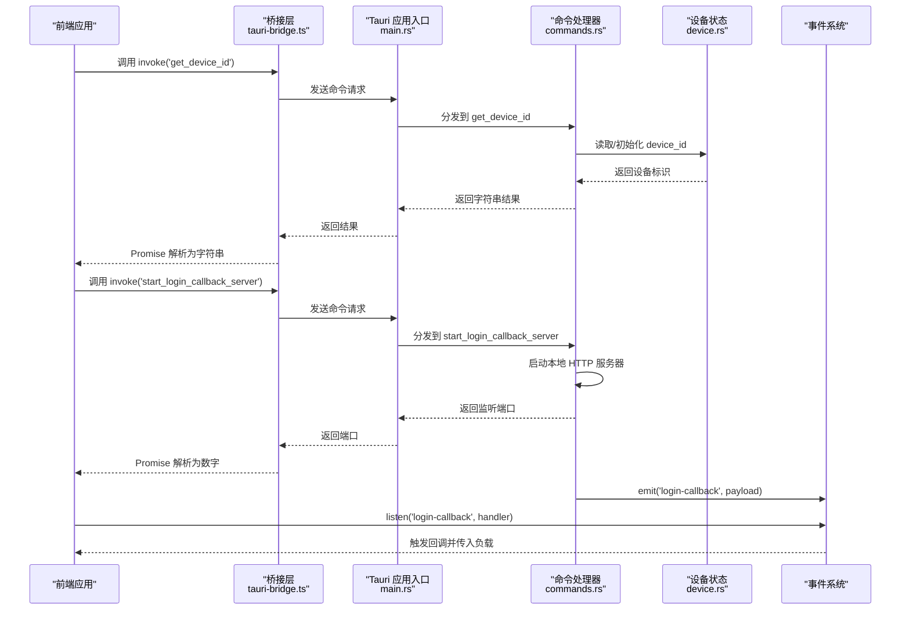
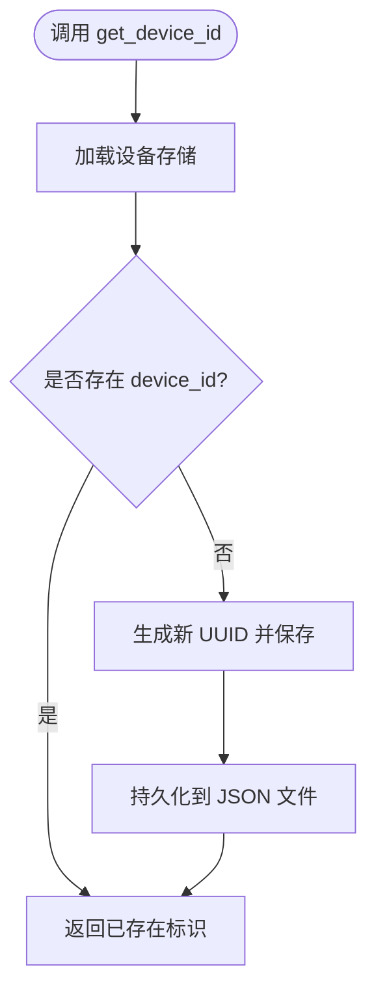
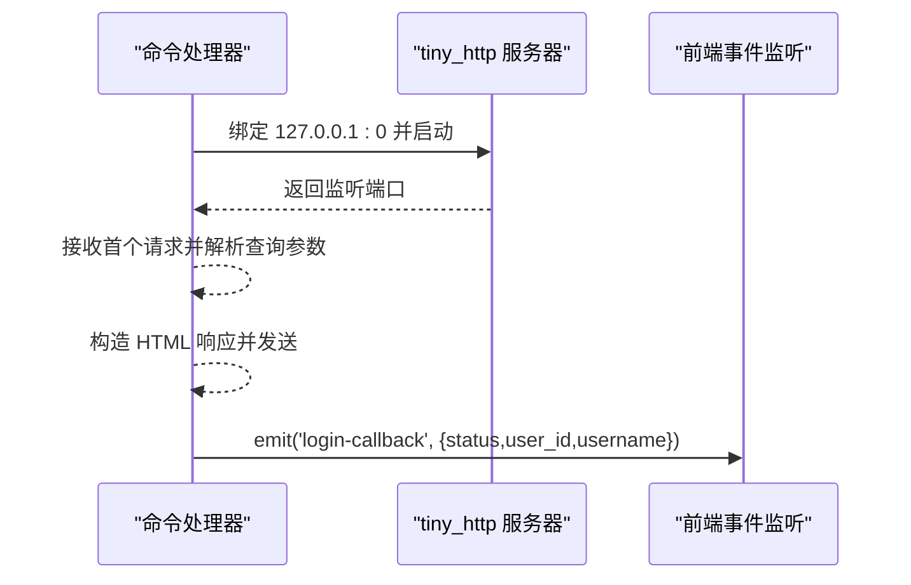
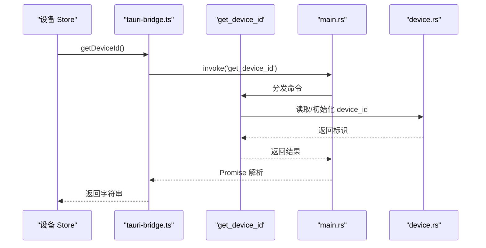
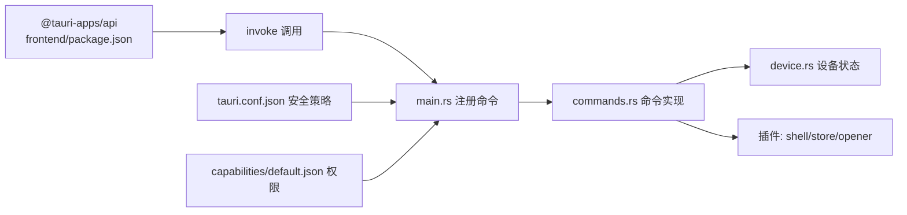

# Tauri 命令接口

<cite>
**本文引用的文件**
- [src/main.rs](file://CCC-BrowserV4/src-tauri/src/main.rs)
- [src/commands.rs](file://CCC-BrowserV4/src-tauri/src/commands.rs)
- [src/device.rs](file://CCC-BrowserV4/src-tauri/src/device.rs)
- [tauri.conf.json](file://CCC-BrowserV4/src-tauri/tauri.conf.json)
- [Cargo.toml](file://CCC-BrowserV4/src-tauri/Cargo.toml)
- [capabilities/default.json](file://CCC-BrowserV4/src-tauri/capabilities/default.json)
- [frontend/src/utils/tauri-bridge.ts](file://CCC-BrowserV4/frontend/src/utils/tauri-bridge.ts)
- [frontend/src/api/auth.ts](file://CCC-BrowserV4/frontend/src/api/auth.ts)
- [frontend/src/stores/device.ts](file://CCC-BrowserV4/frontend/src/stores/device.ts)
- [frontend/package.json](file://CCC-BrowserV4/frontend/package.json)
</cite>

## 目录
1. [简介](#简介)
2. [项目结构](#项目结构)
3. [核心组件](#核心组件)
4. [架构总览](#架构总览)
5. [详细组件分析](#详细组件分析)
6. [依赖关系分析](#依赖关系分析)
7. [性能考量](#性能考量)
8. [故障排查指南](#故障排查指南)
9. [结论](#结论)
10. [附录](#附录)

## 简介
本文件面向 Tauri v2 的命令接口设计与实现，聚焦于 Rust 命令处理器的定义、参数传递与返回值处理，覆盖设备管理、系统操作与本地文件访问相关能力。同时说明前端通过 @tauri-apps/api 进行本地调用的桥接方式，包括命令注册、参数序列化与异步处理，并提供成功调用与异常处理示例、权限配置、安全限制与性能考虑，以及扩展开发与调试建议。

## 项目结构
- 后端（Rust）位于 src-tauri，包含命令定义、设备状态持久化与应用入口。
- 前端（TypeScript/Vue）位于 frontend，通过 @tauri-apps/api 调用后端命令。
- 权限与能力由 capabilities/default.json 控制；运行时安全策略由 tauri.conf.json 的 CSP 等字段约束。

图表来源
- [src/main.rs:1-29](file://CCC-BrowserV4/src-tauri/src/main.rs#L1-L29)
- [src/commands.rs:1-92](file://CCC-BrowserV4/src-tauri/src/commands.rs#L1-L92)
- [src/device.rs:1-32](file://CCC-BrowserV4/src-tauri/src/device.rs#L1-L32)
- [frontend/src/utils/tauri-bridge.ts:1-33](file://CCC-BrowserV4/frontend/src/utils/tauri-bridge.ts#L1-L33)
- [frontend/src/api/auth.ts:1-67](file://CCC-BrowserV4/frontend/src/api/auth.ts#L1-L67)
- [frontend/src/stores/device.ts:1-40](file://CCC-BrowserV4/frontend/src/stores/device.ts#L1-L40)
- [tauri.conf.json:1-29](file://CCC-BrowserV4/src-tauri/tauri.conf.json#L1-L29)
- [capabilities/default.json:1-13](file://CCC-BrowserV4/src-tauri/capabilities/default.json#L1-L13)

章节来源
- [src/main.rs:1-29](file://CCC-BrowserV4/src-tauri/src/main.rs#L1-L29)
- [tauri.conf.json:1-29](file://CCC-BrowserV4/src-tauri/tauri.conf.json#L1-L29)
- [Cargo.toml:1-22](file://CCC-BrowserV4/src-tauri/Cargo.toml#L1-L22)

## 核心组件
- 命令处理器：在 src/commands.rs 中以 #[tauri::command] 定义，支持异步返回 Result<T, String>。
- 设备管理：通过 tauri-plugin-store 在本地持久化设备标识 device_id，并在首次使用时生成。
- 系统操作：通过 tauri-plugin-opener 打开外部浏览器，通过 tiny_http 提供本地回调服务。
- 前端桥接：frontend/src/utils/tauri-bridge.ts 封装 invoke 调用，统一暴露命令方法。
- 权限与安全：capabilities/default.json 声明允许的插件权限；tauri.conf.json 设置 CSP 与窗口属性。

章节来源
- [src/commands.rs:1-92](file://CCC-BrowserV4/src-tauri/src/commands.rs#L1-L92)
- [src/device.rs:1-32](file://CCC-BrowserV4/src-tauri/src/device.rs#L1-L32)
- [frontend/src/utils/tauri-bridge.ts:1-33](file://CCC-BrowserV4/frontend/src/utils/tauri-bridge.ts#L1-L33)
- [capabilities/default.json:1-13](file://CCC-BrowserV4/src-tauri/capabilities/default.json#L1-L13)
- [tauri.conf.json:24-26](file://CCC-BrowserV4/src-tauri/tauri.conf.json#L24-L26)

## 架构总览
下图展示从前端发起命令到后端处理与事件通知的完整链路。

图表来源
- [src/main.rs:12-18](file://CCC-BrowserV4/src-tauri/src/main.rs#L12-L18)
- [src/commands.rs:10-91](file://CCC-BrowserV4/src-tauri/src/commands.rs#L10-L91)
- [src/device.rs:6-31](file://CCC-BrowserV4/src-tauri/src/device.rs#L6-L31)
- [frontend/src/utils/tauri-bridge.ts:10-31](file://CCC-BrowserV4/frontend/src/utils/tauri-bridge.ts#L10-L31)
- [frontend/src/api/auth.ts:47-56](file://CCC-BrowserV4/frontend/src/api/auth.ts#L47-L56)

## 详细组件分析

### 命令注册与生命周期
- 应用入口在 main.rs 中通过 generate_handler! 注册命令列表，包括设备查询、客户端标识生成、令牌生成、打开浏览器与登录回调服务器启动等。
- setup 钩子中初始化设备存储，确保 device_id 存在且持久化。
- 插件层面启用 shell、store、opener 插件，为命令提供系统级能力。

章节来源
- [src/main.rs:7-27](file://CCC-BrowserV4/src-tauri/src/main.rs#L7-L27)
- [Cargo.toml:10-21](file://CCC-BrowserV4/src-tauri/Cargo.toml#L10-L21)

### 设备管理命令
- get_device_id：从持久化存储读取设备标识；若不存在则在初始化阶段生成并保存。
- generate_client_id：生成每次会话唯一的客户端标识。
- generate_token：生成 32 字节十六进制随机 token。
- 设备状态通过 tauri-plugin-store 的 JSON 文件持久化，键名为 device_id。

图表来源
- [src/device.rs:6-31](file://CCC-BrowserV4/src-tauri/src/device.rs#L6-L31)

章节来源
- [src/commands.rs:10-30](file://CCC-BrowserV4/src-tauri/src/commands.rs#L10-L30)
- [src/device.rs:1-32](file://CCC-BrowserV4/src-tauri/src/device.rs#L1-L32)

### 系统操作命令
- open_login_browser：通过 opener 插件打开外部浏览器访问指定 URL。
- start_login_callback_server：启动本地 HTTP 服务器监听随机端口，接收一次回调请求后解析参数并通过事件通知前端。

图表来源
- [src/commands.rs:41-91](file://CCC-BrowserV4/src-tauri/src/commands.rs#L41-L91)

章节来源
- [src/commands.rs:32-39](file://CCC-BrowserV4/src-tauri/src/commands.rs#L32-L39)
- [src/commands.rs:41-91](file://CCC-BrowserV4/src-tauri/src/commands.rs#L41-L91)

### 前端桥接与调用
- tauri-bridge.ts 使用 @tauri-apps/api/core 的 invoke 方法封装命令调用，按需传递参数对象。
- 认证流程示例 performLogin 展示了完整的登录链路：获取设备 ID → 生成客户端 ID 与 Token → 启动本地回调服务器 → 构造登录 URL → 监听 login-callback 事件 → 打开外部浏览器。
- 设备状态 Pinia Store 在初始化时调用 getDeviceId。

图表来源
- [frontend/src/stores/device.ts:12-16](file://CCC-BrowserV4/frontend/src/stores/device.ts#L12-L16)
- [frontend/src/utils/tauri-bridge.ts:10](file://CCC-BrowserV4/frontend/src/utils/tauri-bridge.ts#L10)
- [src/main.rs:12-18](file://CCC-BrowserV4/src-tauri/src/main.rs#L12-L18)
- [src/commands.rs:10-14](file://CCC-BrowserV4/src-tauri/src/commands.rs#L10-L14)
- [src/device.rs:23-31](file://CCC-BrowserV4/src-tauri/src/device.rs#L23-L31)

章节来源
- [frontend/src/utils/tauri-bridge.ts:1-33](file://CCC-BrowserV4/frontend/src/utils/tauri-bridge.ts#L1-L33)
- [frontend/src/api/auth.ts:25-66](file://CCC-BrowserV4/frontend/src/api/auth.ts#L25-L66)
- [frontend/src/stores/device.ts:1-40](file://CCC-BrowserV4/frontend/src/stores/device.ts#L1-L40)

### 命令执行示例与异常处理
- 成功调用示例：前端调用 tauriBridge.getDeviceId()，后端返回字符串；或调用 tauriBridge.startLoginCallbackServer() 返回端口。
- 异常处理示例：命令内部通过 Result 返回错误字符串；前端捕获异常并打印日志，保证流程可恢复。

章节来源
- [src/commands.rs:12-14](file://CCC-BrowserV4/src-tauri/src/commands.rs#L12-L14)
- [src/commands.rs:44-46](file://CCC-BrowserV4/src-tauri/src/commands.rs#L44-L46)
- [frontend/src/api/auth.ts:62-66](file://CCC-BrowserV4/frontend/src/api/auth.ts#L62-L66)

## 依赖关系分析
- Rust 侧依赖：tauri、tauri-plugin-shell、tauri-plugin-store、tauri-plugin-opener、serde、serde_json、uuid、rand、log、tokio、tiny_http。
- 前端依赖：@tauri-apps/api、vue、pinia、element-plus 等。

图表来源
- [frontend/package.json:12-27](file://CCC-BrowserV4/frontend/package.json#L12-L27)
- [src/main.rs:8-18](file://CCC-BrowserV4/src-tauri/src/main.rs#L8-L18)
- [src/commands.rs:1-8](file://CCC-BrowserV4/src-tauri/src/commands.rs#L1-L8)
- [src/device.rs:1-3](file://CCC-BrowserV4/src-tauri/src/device.rs#L1-L3)
- [tauri.conf.json:24-26](file://CCC-BrowserV4/src-tauri/tauri.conf.json#L24-L26)
- [capabilities/default.json:6-11](file://CCC-BrowserV4/src-tauri/capabilities/default.json#L6-L11)

章节来源
- [Cargo.toml:9-22](file://CCC-BrowserV4/src-tauri/Cargo.toml#L9-L22)
- [frontend/package.json:12-27](file://CCC-BrowserV4/frontend/package.json#L12-L27)

## 性能考量
- 命令执行：所有命令均标注为异步，避免阻塞主线程；设备读写使用轻量 JSON 文件存储，建议避免频繁写入。
- 本地回调服务器：仅监听一次请求并关闭，线程内处理，适合一次性登录流程；如需高并发请改用更健壮的 HTTP 框架。
- 事件通知：emit 事件用于前后端解耦，注意避免高频事件导致前端压力过大。
- 网络与安全：CSP 限制连接源至本地回环与指定域名，减少跨域风险；浏览器打开使用 opener 插件，避免直接调用系统 shell。

[本节为通用指导，无需列出具体文件来源]

## 故障排查指南
- 命令未注册：确认 main.rs 的 generate_handler! 是否包含目标命令名称。
- 权限不足：检查 capabilities/default.json 是否包含 shell:allow-open、store:default、opener:default。
- 设备标识缺失：确认 device.rs 初始化逻辑已执行，JSON 文件存在且可读写。
- 浏览器无法打开：验证 opener 插件可用性与系统默认浏览器设置。
- 本地回调无响应：检查 tiny_http 服务器是否绑定成功、端口是否被占用、URL 回调路径是否正确。
- 事件未触发：确认前端已正确监听 login-callback 事件，且命令端 emit 调用成功。

章节来源
- [src/main.rs:12-18](file://CCC-BrowserV4/src-tauri/src/main.rs#L12-L18)
- [capabilities/default.json:6-11](file://CCC-BrowserV4/src-tauri/capabilities/default.json#L6-L11)
- [src/device.rs:6-20](file://CCC-BrowserV4/src-tauri/src/device.rs#L6-L20)
- [src/commands.rs:32-39](file://CCC-BrowserV4/src-tauri/src/commands.rs#L32-L39)
- [src/commands.rs:41-91](file://CCC-BrowserV4/src-tauri/src/commands.rs#L41-L91)
- [frontend/src/api/auth.ts:47-56](file://CCC-BrowserV4/frontend/src/api/auth.ts#L47-L56)

## 结论
该 Tauri v2 项目通过清晰的命令分层与插件化能力，实现了设备标识管理、系统浏览器打开与本地回调服务等核心功能。前端通过 @tauri-apps/api 的 invoke 与事件系统完成本地调用与解耦通信。配合能力与安全策略配置，可在保证安全性的同时提供良好的扩展性与可维护性。

[本节为总结性内容，无需列出具体文件来源]

## 附录

### 命令清单与签名
- get_device_id
  - 参数：无
  - 返回：字符串（设备标识）
  - 权限：store:default
- generate_client_id
  - 参数：无
  - 返回：字符串（客户端标识）
  - 权限：无
- generate_token
  - 参数：无
  - 返回：字符串（32 字节十六进制 token）
  - 权限：无
- open_login_browser(url)
  - 参数：url（字符串）
  - 返回：无（错误时返回字符串）
  - 权限：shell:allow-open
- start_login_callback_server
  - 参数：无
  - 返回：数字（本地监听端口）
  - 事件：login-callback（包含 status、user_id、username）
  - 权限：opener:default

章节来源
- [src/commands.rs:10-91](file://CCC-BrowserV4/src-tauri/src/commands.rs#L10-L91)
- [frontend/src/utils/tauri-bridge.ts:10-31](file://CCC-BrowserV4/frontend/src/utils/tauri-bridge.ts#L10-L31)
- [capabilities/default.json:6-11](file://CCC-BrowserV4/src-tauri/capabilities/default.json#L6-L11)

### 前端调用要点
- 参数序列化：invoke 自动处理 JSON 序列化；复杂对象建议扁平化或拆分为多个简单参数。
- 异步处理：使用 async/await 或 Promise 处理返回值；对错误进行 try/catch 包裹。
- 事件监听：使用 @tauri-apps/api/event 的 listen 订阅后端事件，返回取消函数以便清理。

章节来源
- [frontend/src/api/auth.ts:25-66](file://CCC-BrowserV4/frontend/src/api/auth.ts#L25-L66)
- [frontend/src/utils/tauri-bridge.ts:10-31](file://CCC-BrowserV4/frontend/src/utils/tauri-bridge.ts#L10-L31)

### 权限与安全配置
- 能力声明：default.json 中包含 core、shell、store、opener 权限。
- 运行时安全：tauri.conf.json 设置 CSP，限制连接源至本地与指定域名，降低 XSS 与中间人攻击风险。

章节来源
- [capabilities/default.json:1-13](file://CCC-BrowserV4/src-tauri/capabilities/default.json#L1-L13)
- [tauri.conf.json:24-26](file://CCC-BrowserV4/src-tauri/tauri.conf.json#L24-L26)

### 扩展开发指南
- 新增命令：在 src/commands.rs 添加 #[tauri::command] 函数，返回 Result<T, String>；T 需可序列化为 JSON。
- 注册命令：在 main.rs 的 generate_handler! 列表中加入新命令。
- 权限扩展：在 capabilities/default.json 中添加所需权限标识。
- 事件扩展：使用 Emitter 发送自定义事件，前端通过 listen 订阅。

章节来源
- [src/commands.rs:10-91](file://CCC-BrowserV4/src-tauri/src/commands.rs#L10-L91)
- [src/main.rs:12-18](file://CCC-BrowserV4/src-tauri/src/main.rs#L12-L18)
- [capabilities/default.json:6-11](file://CCC-BrowserV4/src-tauri/capabilities/default.json#L6-L11)

### 调试技巧
- 后端日志：使用 log::info/log::error 输出关键路径与错误信息。
- 前端调试：在浏览器控制台观察 invoke 返回与事件触发；使用浏览器开发者工具检查网络与事件。
- 端口与回调：确认本地回调服务器端口与 URL 回调路径一致；检查 tiny_http 是否正确响应。

章节来源
- [src/commands.rs:34-39](file://CCC-BrowserV4/src-tauri/src/commands.rs#L34-L39)
- [src/commands.rs:44-91](file://CCC-BrowserV4/src-tauri/src/commands.rs#L44-L91)
- [frontend/src/api/auth.ts:47-56](file://CCC-BrowserV4/frontend/src/api/auth.ts#L47-L56)