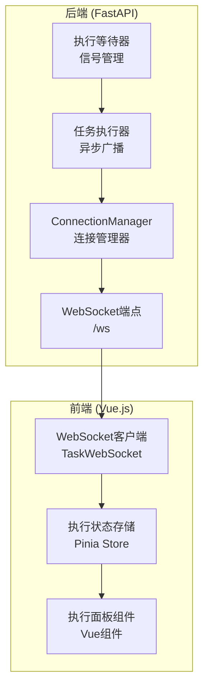
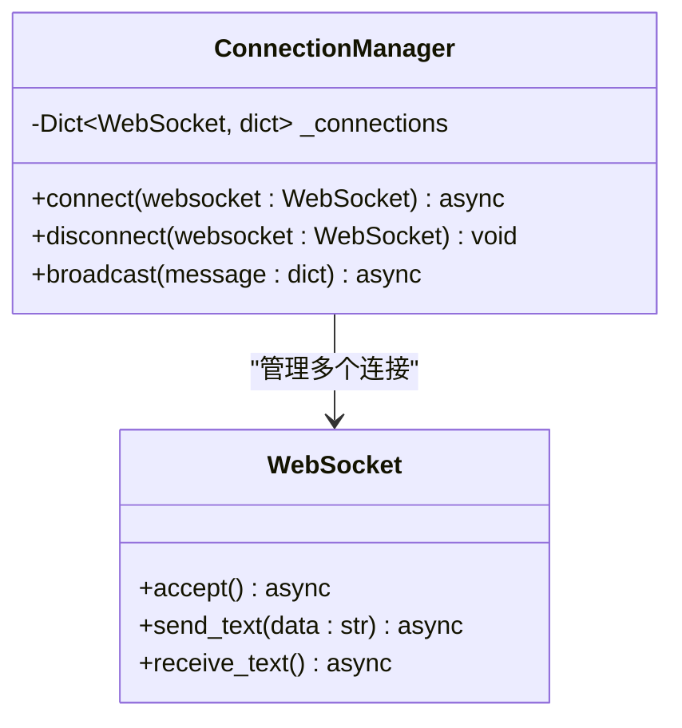
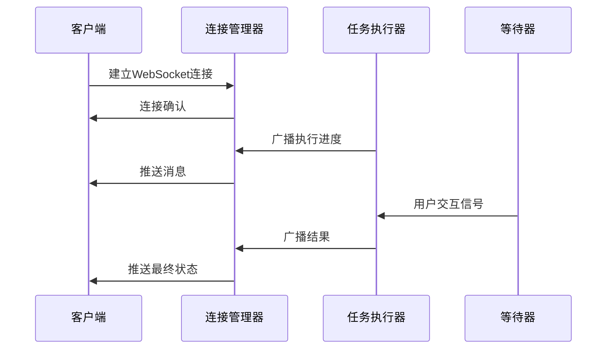
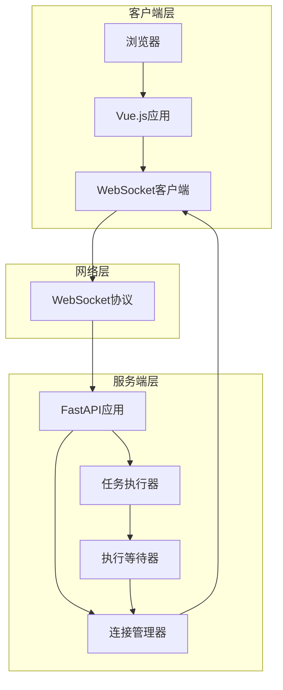
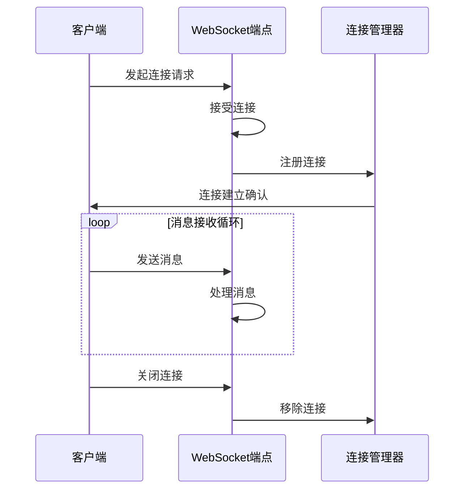
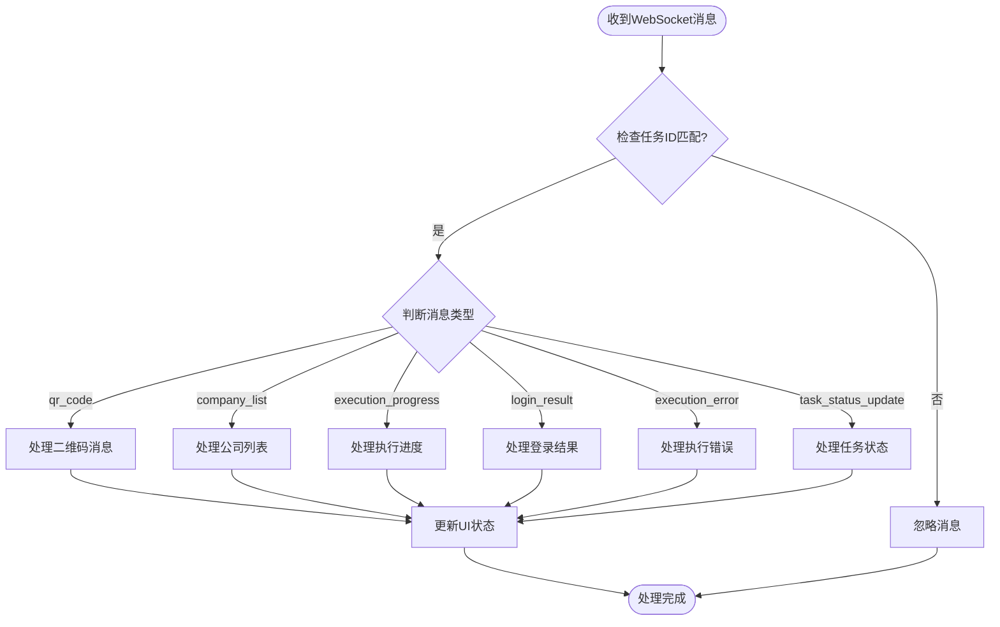
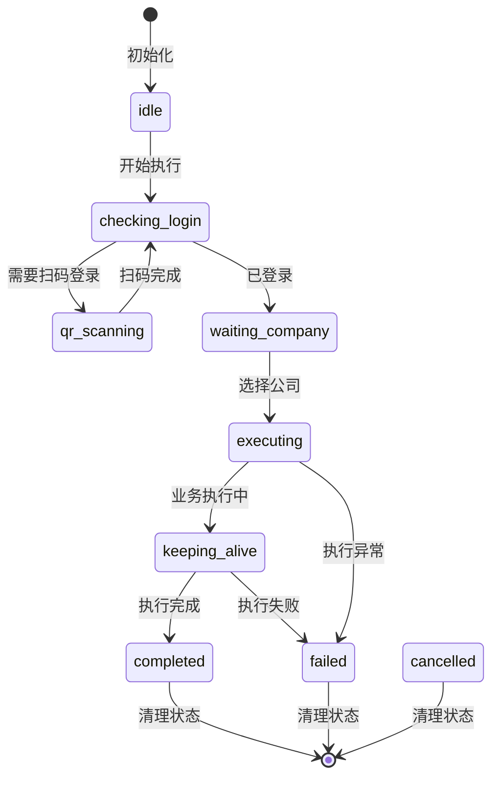
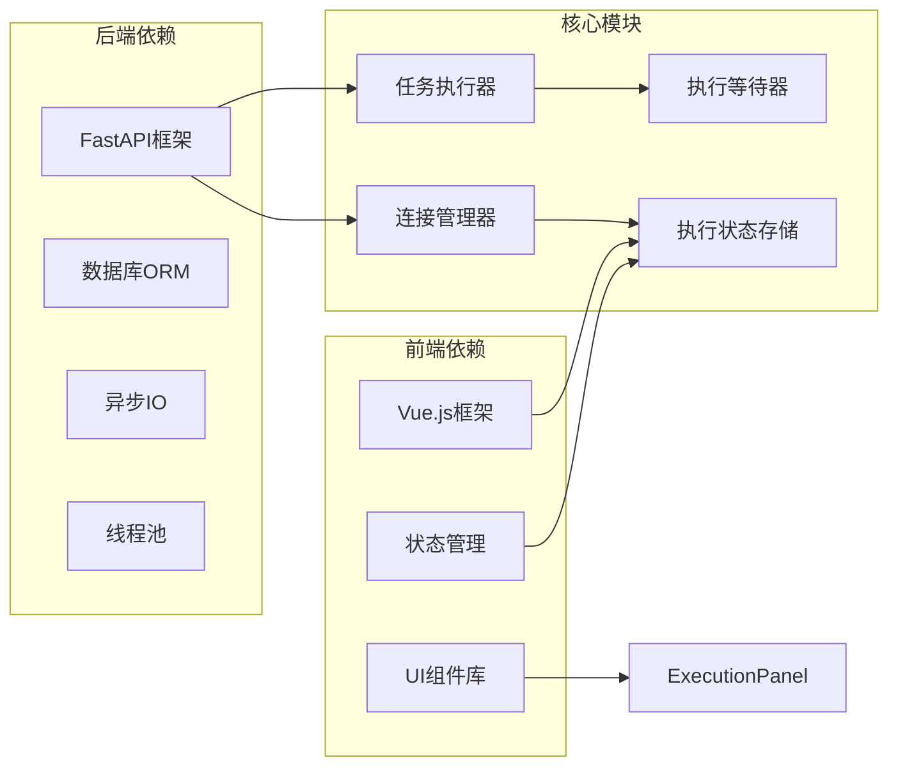
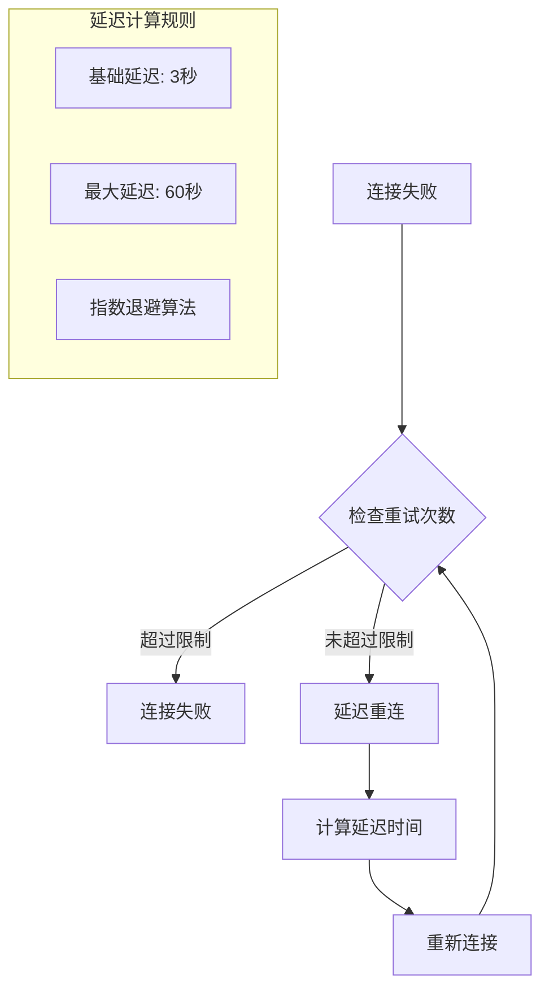

# WebSocket 实时通信

<cite>
**本文档引用的文件**
- [manager.py](file://CCC_RPA_API/app/ws/manager.py)
- [main.py](file://CCC_RPA_API/app/main.py)
- [executor.py](file://CCC_RPA_API/app/services/executor.py)
- [waiter.py](file://CCC_RPA_API/app/browser/waiter.py)
- [ws.ts](file://CCC-BrowserV4/frontend/src/api/ws.ts)
- [execution.ts](file://CCC-BrowserV4/frontend/src/stores/execution.ts)
- [ExecutionPanel.vue](file://CCC-BrowserV4/frontend/src/components/ExecutionPanel.vue)
- [execution.ts](file://CCC-BrowserV4/frontend/src/types/execution.ts)
- [tasks.py](file://CCC_RPA_API/app/api/tasks.py)
- [task.py](file://CCC_RPA_API/app/models/task.py)
- [execution.py](file://CCC_RPA_API/app/schemas/execution.py)
</cite>

## 目录
1. [简介](#简介)
2. [项目结构](#项目结构)
3. [核心组件](#核心组件)
4. [架构概览](#架构概览)
5. [详细组件分析](#详细组件分析)
6. [依赖关系分析](#依赖关系分析)
7. [性能考虑](#性能考虑)
8. [故障排除指南](#故障排除指南)
9. [结论](#结论)

## 简介

本文件详细说明了基于 FastAPI 和 Vue.js 的 WebSocket 实时通信系统。该系统实现了任务执行状态的实时推送、二维码传输、登录结果通知等功能，为用户提供完整的自动化任务执行可视化体验。

## 项目结构

WebSocket 实时通信系统主要分布在以下两个部分：

**图表来源**
- [manager.py:1-29](file://CCC_RPA_API/app/ws/manager.py#L1-L29)
- [main.py:119-127](file://CCC_RPA_API/app/main.py#L119-L127)
- [executor.py:22-33](file://CCC_RPA_API/app/services/executor.py#L22-L33)

**章节来源**
- [manager.py:1-29](file://CCC_RPA_API/app/ws/manager.py#L1-L29)
- [main.py:119-127](file://CCC_RPA_API/app/main.py#L119-L127)

## 核心组件

### WebSocket 连接管理器

ConnectionManager 是系统的核心组件，负责管理所有 WebSocket 连接并支持广播消息：

**图表来源**
- [manager.py:5-28](file://CCC_RPA_API/app/ws/manager.py#L5-L28)

### 任务执行器

任务执行器负责在后台线程中执行任务，并通过 WebSocket 实时推送执行状态：

**图表来源**
- [executor.py:22-33](file://CCC_RPA_API/app/services/executor.py#L22-L33)
- [manager.py:17-26](file://CCC_RPA_API/app/ws/manager.py#L17-L26)

**章节来源**
- [manager.py:5-28](file://CCC_RPA_API/app/ws/manager.py#L5-L28)
- [executor.py:22-33](file://CCC_RPA_API/app/services/executor.py#L22-L33)

## 架构概览

系统采用客户端-服务器架构，通过 WebSocket 实现实时双向通信：

**图表来源**
- [main.py:119-127](file://CCC_RPA_API/app/main.py#L119-L127)
- [executor.py:306-308](file://CCC_RPA_API/app/services/executor.py#L306-L308)

## 详细组件分析

### WebSocket 连接建立流程

**图表来源**
- [main.py:119-127](file://CCC_RPA_API/app/main.py#L119-L127)
- [manager.py:10-15](file://CCC_RPA_API/app/ws/manager.py#L10-L15)

### 消息格式规范

系统使用统一的消息格式进行通信：

| 字段名 | 类型 | 必需 | 描述 |
|--------|------|------|------|
| type | string | 是 | 消息类型标识符 |
| data | object | 是 | 消息数据对象 |

#### 事件类型定义

系统支持以下事件类型：

**执行进度事件**
- `execution_progress`: 推送任务执行进度
- 数据字段: `taskId`, `step`, `message`

**二维码事件**
- `qr_code`: 推送登录二维码
- 数据字段: `taskId`, `qrImage`

**公司列表事件**
- `company_list`: 推送可选公司列表
- 数据字段: `taskId`, `companies`

**登录结果事件**
- `login_result`: 推送登录结果
- 数据字段: `taskId`, `success`, `message`

**执行错误事件**
- `execution_error`: 推送执行错误信息
- 数据字段: `taskId`, `message`

**任务状态更新事件**
- `task_status_update`: 推送任务最终状态
- 数据字段: `taskId`, `status`, `lastResult`, `lastExecutedAt`

**章节来源**
- [executor.py:89-156](file://CCC_RPA_API/app/services/executor.py#L89-L156)
- [executor.py:268-299](file://CCC_RPA_API/app/services/executor.py#L268-L299)

### 前端消息处理流程

**图表来源**
- [execution.ts:22-67](file://CCC-BrowserV4/frontend/src/stores/execution.ts#L22-L67)

**章节来源**
- [execution.ts:22-67](file://CCC-BrowserV4/frontend/src/stores/execution.ts#L22-L67)

### 任务执行状态管理

系统实现了完整的任务执行生命周期管理：

**图表来源**
- [execution.ts:1-17](file://CCC-BrowserV4/frontend/src/types/execution.ts#L1-L17)

**章节来源**
- [execution.ts:1-17](file://CCC-BrowserV4/frontend/src/types/execution.ts#L1-L17)

## 依赖关系分析

系统各组件之间的依赖关系如下：

**图表来源**
- [main.py:1-12](file://CCC_RPA_API/app/main.py#L1-L12)
- [executor.py:1-20](file://CCC_RPA_API/app/services/executor.py#L1-L20)

**章节来源**
- [main.py:1-12](file://CCC_RPA_API/app/main.py#L1-L12)
- [executor.py:1-20](file://CCC_RPA_API/app/services/executor.py#L1-L20)

## 性能考虑

### 连接管理优化

系统采用高效的连接管理策略：
- 使用字典存储连接，支持 O(1) 连接查找
- 自动清理无效连接，防止内存泄漏
- 异步广播机制，避免阻塞主线程

### 消息传输优化

- JSON 序列化缓存，减少重复序列化开销
- 批量消息处理，提高传输效率
- 连接状态监控，及时发现并处理异常连接

### 线程安全保证

- 使用锁机制保护共享状态
- 线程间通信采用安全的数据结构
- 异步事件循环管理，避免竞态条件

## 故障排除指南

### 连接问题诊断

**常见问题及解决方案**：

1. **连接无法建立**
   - 检查 WebSocket 端点路径 `/ws`
   - 验证 CORS 配置允许跨域访问
   - 确认防火墙允许 WebSocket 连接

2. **消息接收异常**
   - 检查消息格式是否符合规范
   - 验证消息类型是否正确
   - 确认任务 ID 匹配逻辑

3. **连接自动断开**
   - 检查客户端重连机制
   - 验证服务器端连接管理
   - 监控网络稳定性

### 重连策略

前端实现了智能重连机制：

**图表来源**
- [ws.ts:58-64](file://CCC-BrowserV4/frontend/src/api/ws.ts#L58-L64)

**章节来源**
- [ws.ts:58-64](file://CCC-BrowserV4/frontend/src/api/ws.ts#L58-L64)

### 错误处理机制

系统提供了多层次的错误处理：

1. **连接级错误处理**
   - 自动重连机制
   - 连接状态监控
   - 异常连接清理

2. **消息级错误处理**
   - JSON 解析异常捕获
   - 消息格式验证
   - 业务逻辑异常处理

3. **业务级错误处理**
   - 任务执行异常捕获
   - 状态回滚机制
   - 错误信息上报

**章节来源**
- [ws.ts:49-55](file://CCC-BrowserV4/frontend/src/api/ws.ts#L49-L55)
- [executor.py:275-300](file://CCC_RPA_API/app/services/executor.py#L275-L300)

## 结论

本 WebSocket 实时通信系统实现了完整的任务执行状态可视化功能，具有以下特点：

1. **可靠性**: 采用连接管理器和重连机制，确保通信稳定
2. **实时性**: 支持双向实时通信，提供即时反馈
3. **扩展性**: 模块化设计，易于添加新的消息类型和处理逻辑
4. **用户体验**: 提供丰富的执行状态展示和交互功能

系统适用于需要实时状态反馈的自动化任务场景，为用户提供了直观、可靠的执行监控体验。