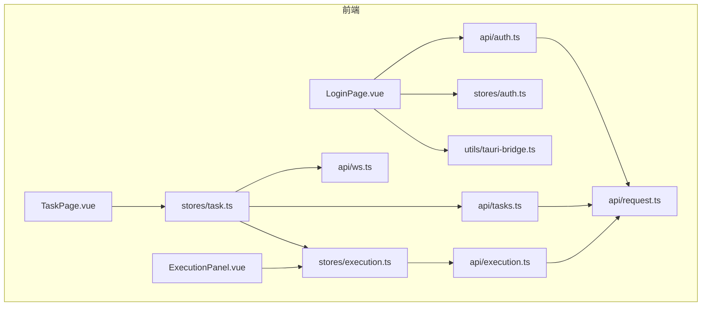
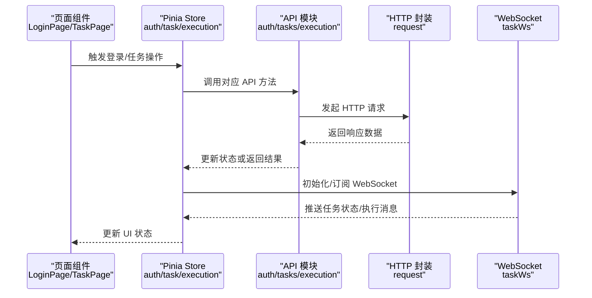
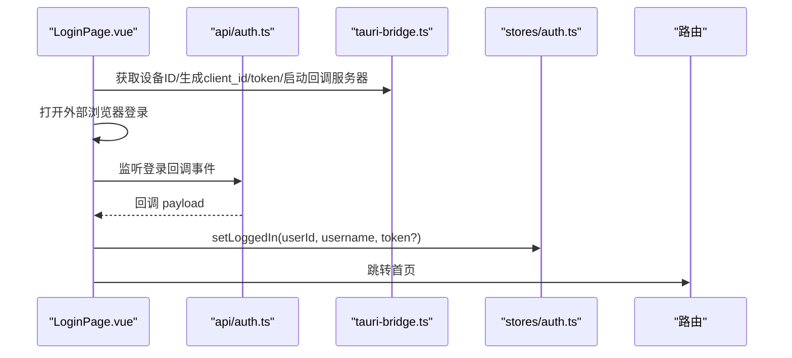
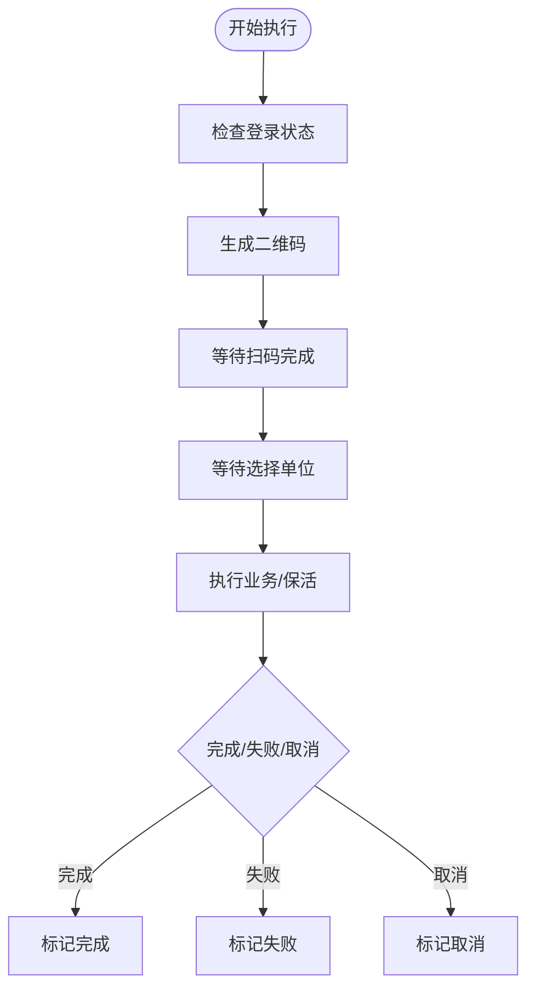
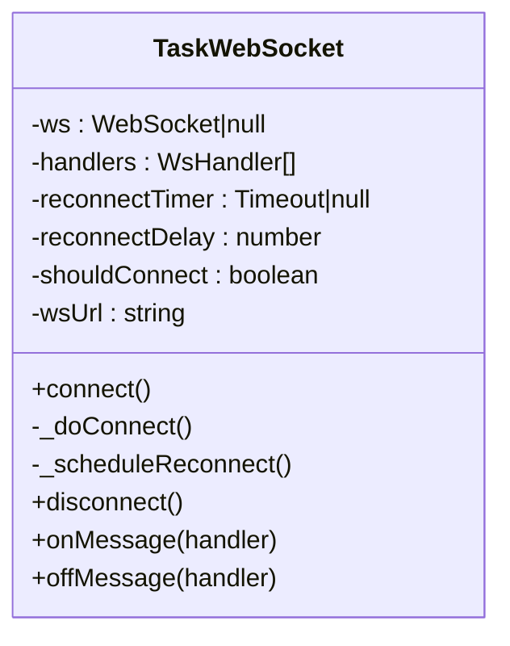
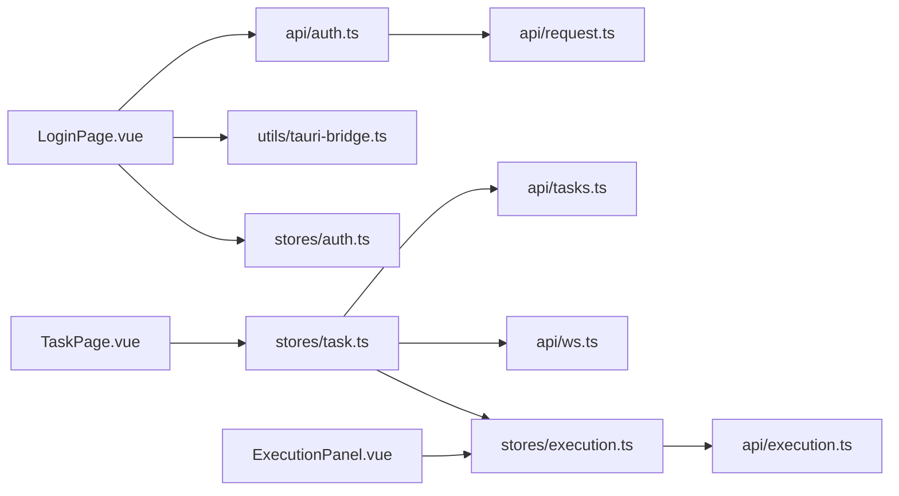

# API 集成

<cite>
**本文引用的文件**
- [request.ts](file://CCC-BrowserV4/frontend/src/api/request.ts)
- [auth.ts](file://CCC-BrowserV4/frontend/src/api/auth.ts)
- [tasks.ts](file://CCC-BrowserV4/frontend/src/api/tasks.ts)
- [execution.ts](file://CCC-BrowserV4/frontend/src/api/execution.ts)
- [ws.ts](file://CCC-BrowserV4/frontend/src/api/ws.ts)
- [index.ts](file://CCC-BrowserV4/frontend/src/types/index.ts)
- [execution.ts](file://CCC-BrowserV4/frontend/src/types/execution.ts)
- [auth.ts](file://CCC-BrowserV4/frontend/src/stores/auth.ts)
- [task.ts](file://CCC-BrowserV4/frontend/src/stores/task.ts)
- [execution.ts](file://CCC-BrowserV4/frontend/src/stores/execution.ts)
- [tauri-bridge.ts](file://CCC-BrowserV4/frontend/src/utils/tauri-bridge.ts)
- [LoginPage.vue](file://CCC-BrowserV4/frontend/src/pages/LoginPage.vue)
- [TaskPage.vue](file://CCC-BrowserV4/frontend/src/pages/TaskPage.vue)
- [ExecutionPanel.vue](file://CCC-BrowserV4/frontend/src/components/ExecutionPanel.vue)
</cite>

## 目录
1. [简介](#简介)
2. [项目结构](#项目结构)
3. [核心组件](#核心组件)
4. [架构总览](#架构总览)
5. [详细组件分析](#详细组件分析)
6. [依赖关系分析](#依赖关系分析)
7. [性能考虑](#性能考虑)
8. [故障排查指南](#故障排查指南)
9. [结论](#结论)
10. [附录](#附录)

## 简介
本文件面向前端 API 集成，系统性说明 HTTP 请求封装与 Axios 配置、各 API 模块（认证、任务、执行）的实现与使用、WebSocket 实时通信机制、请求/响应拦截器、错误处理与重试策略、调试工具与性能优化，以及认证令牌的管理与自动刷新机制。文档以代码为依据，配合图示帮助不同技术背景的读者理解与落地。

## 项目结构
前端位于 CCC-BrowserV4/frontend，采用 Vue 3 + TypeScript + Pinia 架构，API 层通过 axios 封装统一请求，按功能拆分模块；实时通信通过自研 WebSocket 类管理连接与消息分发；状态管理使用 Pinia Store 管理认证、任务与执行状态；登录流程结合 Tauri 原生能力完成设备信息与浏览器回调。

图表来源
- [LoginPage.vue](file://CCC-BrowserV4/frontend/src/pages/LoginPage.vue)
- [TaskPage.vue](file://CCC-BrowserV4/frontend/src/pages/TaskPage.vue)
- [ExecutionPanel.vue](file://CCC-BrowserV4/frontend/src/components/ExecutionPanel.vue)
- [auth.ts](file://CCC-BrowserV4/frontend/src/stores/auth.ts)
- [task.ts](file://CCC-BrowserV4/frontend/src/stores/task.ts)
- [execution.ts](file://CCC-BrowserV4/frontend/src/stores/execution.ts)
- [auth.ts](file://CCC-BrowserV4/frontend/src/api/auth.ts)
- [tasks.ts](file://CCC-BrowserV4/frontend/src/api/tasks.ts)
- [execution.ts](file://CCC-BrowserV4/frontend/src/api/execution.ts)
- [ws.ts](file://CCC-BrowserV4/frontend/src/api/ws.ts)
- [request.ts](file://CCC-BrowserV4/frontend/src/api/request.ts)
- [tauri-bridge.ts](file://CCC-BrowserV4/frontend/src/utils/tauri-bridge.ts)

章节来源
- [request.ts:1-18](file://CCC-BrowserV4/frontend/src/api/request.ts#L1-L18)
- [auth.ts:1-67](file://CCC-BrowserV4/frontend/src/api/auth.ts#L1-L67)
- [tasks.ts:1-41](file://CCC-BrowserV4/frontend/src/api/tasks.ts#L1-L41)
- [execution.ts:1-20](file://CCC-BrowserV4/frontend/src/api/execution.ts#L1-L20)
- [ws.ts:1-88](file://CCC-BrowserV4/frontend/src/api/ws.ts#L1-L88)
- [auth.ts:1-79](file://CCC-BrowserV4/frontend/src/stores/auth.ts#L1-L79)
- [task.ts:1-84](file://CCC-BrowserV4/frontend/src/stores/task.ts#L1-L84)
- [execution.ts:1-229](file://CCC-BrowserV4/frontend/src/stores/execution.ts#L1-L229)
- [tauri-bridge.ts:1-33](file://CCC-BrowserV4/frontend/src/utils/tauri-bridge.ts#L1-L33)
- [LoginPage.vue:1-228](file://CCC-BrowserV4/frontend/src/pages/LoginPage.vue#L1-L228)
- [TaskPage.vue:1-428](file://CCC-BrowserV4/frontend/src/pages/TaskPage.vue#L1-L428)
- [ExecutionPanel.vue:1-322](file://CCC-BrowserV4/frontend/src/components/ExecutionPanel.vue#L1-L322)

## 核心组件
- HTTP 请求封装与拦截器
  - 使用 axios.create 创建实例，设置基础路径与超时时间；响应拦截器统一提取 response.data 并输出错误日志。
  - 参考：[request.ts:1-18](file://CCC-BrowserV4/frontend/src/api/request.ts#L1-L18)
- 认证模块
  - 提供登录、登出、校验接口；登录流程通过 Tauri 生成设备/客户端标识与 token，启动本地回调服务器，打开外部浏览器完成登录，事件回调后写入 Pinia 状态。
  - 参考：[auth.ts:1-67](file://CCC-BrowserV4/frontend/src/api/auth.ts#L1-L67)，[tauri-bridge.ts:1-33](file://CCC-BrowserV4/frontend/src/utils/tauri-bridge.ts#L1-L33)，[LoginPage.vue:1-228](file://CCC-BrowserV4/frontend/src/pages/LoginPage.vue#L1-L228)，[auth.ts:1-79](file://CCC-BrowserV4/frontend/src/stores/auth.ts#L1-L79)
- 任务模块
  - 支持分页查询、详情、创建、更新、删除、执行任务；执行任务后通过 WebSocket 推送状态变更。
  - 参考：[tasks.ts:1-41](file://CCC-BrowserV4/frontend/src/api/tasks.ts#L1-L41)，[task.ts:1-84](file://CCC-BrowserV4/frontend/src/stores/task.ts#L1-L84)，[TaskPage.vue:1-428](file://CCC-BrowserV4/frontend/src/pages/TaskPage.vue#L1-L428)
- 执行模块
  - 提供扫码完成、选择单位、取消执行等接口；与 WebSocket 消息联动驱动执行状态机。
  - 参考：[execution.ts:1-20](file://CCC-BrowserV4/frontend/src/api/execution.ts#L1-L20)，[execution.ts:1-229](file://CCC-BrowserV4/frontend/src/stores/execution.ts#L1-L229)，[ExecutionPanel.vue:1-322](file://CCC-BrowserV4/frontend/src/components/ExecutionPanel.vue#L1-L322)
- WebSocket 实时通信
  - 自研 TaskWebSocket 类，支持连接、断线重连、消息订阅与取消订阅、URL 协议自动识别（http/https -> ws/wss）。
  - 参考：[ws.ts:1-88](file://CCC-BrowserV4/frontend/src/api/ws.ts#L1-L88)，[task.ts:57-80](file://CCC-BrowserV4/frontend/src/stores/task.ts#L57-L80)，[execution.ts:22-67](file://CCC-BrowserV4/frontend/src/stores/execution.ts#L22-L67)

章节来源
- [request.ts:1-18](file://CCC-BrowserV4/frontend/src/api/request.ts#L1-L18)
- [auth.ts:1-67](file://CCC-BrowserV4/frontend/src/api/auth.ts#L1-L67)
- [tasks.ts:1-41](file://CCC-BrowserV4/frontend/src/api/tasks.ts#L1-L41)
- [execution.ts:1-20](file://CCC-BrowserV4/frontend/src/api/execution.ts#L1-L20)
- [ws.ts:1-88](file://CCC-BrowserV4/frontend/src/api/ws.ts#L1-L88)
- [auth.ts:1-79](file://CCC-BrowserV4/frontend/src/stores/auth.ts#L1-L79)
- [task.ts:1-84](file://CCC-BrowserV4/frontend/src/stores/task.ts#L1-L84)
- [execution.ts:1-229](file://CCC-BrowserV4/frontend/src/stores/execution.ts#L1-L229)
- [LoginPage.vue:1-228](file://CCC-BrowserV4/frontend/src/pages/LoginPage.vue#L1-L228)
- [TaskPage.vue:1-428](file://CCC-BrowserV4/frontend/src/pages/TaskPage.vue#L1-L428)
- [ExecutionPanel.vue:1-322](file://CCC-BrowserV4/frontend/src/components/ExecutionPanel.vue#L1-L322)

## 架构总览
下图展示从前端页面到 API、WebSocket、状态管理的整体交互：

图表来源
- [LoginPage.vue:1-228](file://CCC-BrowserV4/frontend/src/pages/LoginPage.vue#L1-L228)
- [TaskPage.vue:1-428](file://CCC-BrowserV4/frontend/src/pages/TaskPage.vue#L1-L428)
- [auth.ts:1-67](file://CCC-BrowserV4/frontend/src/api/auth.ts#L1-L67)
- [tasks.ts:1-41](file://CCC-BrowserV4/frontend/src/api/tasks.ts#L1-L41)
- [execution.ts:1-20](file://CCC-BrowserV4/frontend/src/api/execution.ts#L1-L20)
- [request.ts:1-18](file://CCC-BrowserV4/frontend/src/api/request.ts#L1-L18)
- [ws.ts:1-88](file://CCC-BrowserV4/frontend/src/api/ws.ts#L1-L88)
- [task.ts:1-84](file://CCC-BrowserV4/frontend/src/stores/task.ts#L1-L84)
- [execution.ts:1-229](file://CCC-BrowserV4/frontend/src/stores/execution.ts#L1-L229)

## 详细组件分析

### HTTP 请求封装与 Axios 配置
- 基础配置
  - 基础路径：/api
  - 超时：10 秒
  - 参考：[request.ts:3-6](file://CCC-BrowserV4/frontend/src/api/request.ts#L3-L6)
- 响应拦截器
  - 统一提取 response.data，便于上层直接消费数据体
  - 对错误进行控制台输出并透传错误
  - 参考：[request.ts:8-15](file://CCC-BrowserV4/frontend/src/api/request.ts#L8-L15)

章节来源
- [request.ts:1-18](file://CCC-BrowserV4/frontend/src/api/request.ts#L1-L18)

### 认证接口与登录流程
- 接口方法
  - 登录：POST /auth/login
  - 登出：POST /auth/logout
  - 校验：GET /auth/verify
  - 参考：[auth.ts:5-18](file://CCC-BrowserV4/frontend/src/api/auth.ts#L5-L18)
- 登录流程（生产模式）
  - 通过 Tauri 获取设备 ID、生成客户端 ID 与 Token
  - 启动本地回调服务器，构造登录 URL，监听回调事件，打开外部浏览器
  - 成功回调后写入 Pinia 认证状态，跳转首页
  - 参考：[auth.ts:25-66](file://CCC-BrowserV4/frontend/src/api/auth.ts#L25-L66)，[tauri-bridge.ts:6-32](file://CCC-BrowserV4/frontend/src/utils/tauri-bridge.ts#L6-L32)，[LoginPage.vue:93-169](file://CCC-BrowserV4/frontend/src/pages/LoginPage.vue#L93-L169)
- 开发模式
  - 直接调用后端登录接口，或回退到本地虚拟登录
  - 参考：[LoginPage.vue:94-127](file://CCC-BrowserV4/frontend/src/pages/LoginPage.vue#L94-L127)
- 认证状态持久化
  - 登录成功后写入 localStorage；应用启动时尝试恢复
  - 参考：[auth.ts:15-58](file://CCC-BrowserV4/frontend/src/stores/auth.ts#L15-L58)

图表来源
- [LoginPage.vue:93-169](file://CCC-BrowserV4/frontend/src/pages/LoginPage.vue#L93-L169)
- [auth.ts:25-66](file://CCC-BrowserV4/frontend/src/api/auth.ts#L25-L66)
- [tauri-bridge.ts:6-32](file://CCC-BrowserV4/frontend/src/utils/tauri-bridge.ts#L6-L32)
- [auth.ts:15-39](file://CCC-BrowserV4/frontend/src/stores/auth.ts#L15-L39)

章节来源
- [auth.ts:1-67](file://CCC-BrowserV4/frontend/src/api/auth.ts#L1-L67)
- [tauri-bridge.ts:1-33](file://CCC-BrowserV4/frontend/src/utils/tauri-bridge.ts#L1-L33)
- [auth.ts:1-79](file://CCC-BrowserV4/frontend/src/stores/auth.ts#L1-L79)
- [LoginPage.vue:1-228](file://CCC-BrowserV4/frontend/src/pages/LoginPage.vue#L1-L228)

### 任务接口与执行流程
- 接口方法
  - 查询：GET /tasks
  - 详情：GET /tasks/:id
  - 新增：POST /tasks
  - 更新：PUT /tasks/:id
  - 删除：DELETE /tasks/:id
  - 执行：POST /tasks/:id/execute
  - 日志：GET /tasks/:id/logs
  - 参考：[tasks.ts:5-40](file://CCC-BrowserV4/frontend/src/api/tasks.ts#L5-L40)
- 任务状态与分页
  - 支持关键词、状态、页码与每页数量参数
  - 参考：[tasks.ts:5-7](file://CCC-BrowserV4/frontend/src/api/tasks.ts#L5-L7)
- 执行流程（前端状态机）
  - startExecution -> checking_login -> qr_scanning -> waiting_company -> executing/keeping_alive -> completed/failed/cancelled
  - 参考：[execution.ts:122-132](file://CCC-BrowserV4/frontend/src/stores/execution.ts#L122-L132)，[ExecutionPanel.vue:1-108](file://CCC-BrowserV4/frontend/src/components/ExecutionPanel.vue#L1-L108)
- 执行接口
  - 扫码完成：POST /tasks/:id/scan-complete
  - 选择单位：POST /tasks/:id/select-company
  - 取消执行：POST /tasks/:id/cancel-execution
  - 参考：[execution.ts:4-19](file://CCC-BrowserV4/frontend/src/api/execution.ts#L4-L19)

图表来源
- [execution.ts:122-132](file://CCC-BrowserV4/frontend/src/stores/execution.ts#L122-L132)
- [execution.ts:4-19](file://CCC-BrowserV4/frontend/src/api/execution.ts#L4-L19)
- [ExecutionPanel.vue:1-108](file://CCC-BrowserV4/frontend/src/components/ExecutionPanel.vue#L1-L108)

章节来源
- [tasks.ts:1-41](file://CCC-BrowserV4/frontend/src/api/tasks.ts#L1-L41)
- [execution.ts:1-20](file://CCC-BrowserV4/frontend/src/api/execution.ts#L1-L20)
- [execution.ts:1-229](file://CCC-BrowserV4/frontend/src/stores/execution.ts#L1-L229)
- [ExecutionPanel.vue:1-322](file://CCC-BrowserV4/frontend/src/components/ExecutionPanel.vue#L1-L322)

### WebSocket 实时通信
- 连接管理
  - 自动根据协议选择 ws/wss
  - 断线定时重连，支持 connect/onMessage/offMessage/disconnect
  - 参考：[ws.ts:15-87](file://CCC-BrowserV4/frontend/src/api/ws.ts#L15-L87)
- 消息处理
  - 解析 JSON，分发给订阅者；支持过滤非当前任务的消息
  - 参考：[ws.ts:35-41](file://CCC-BrowserV4/frontend/src/api/ws.ts#L35-L41)，[execution.ts:22-67](file://CCC-BrowserV4/frontend/src/stores/execution.ts#L22-L67)
- 页面集成
  - 页面挂载时初始化连接与订阅，卸载时销毁
  - 参考：[TaskPage.vue:158-165](file://CCC-BrowserV4/frontend/src/pages/TaskPage.vue#L158-L165)，[task.ts:57-80](file://CCC-BrowserV4/frontend/src/stores/task.ts#L57-L80)

图表来源
- [ws.ts:8-87](file://CCC-BrowserV4/frontend/src/api/ws.ts#L8-L87)

章节来源
- [ws.ts:1-88](file://CCC-BrowserV4/frontend/src/api/ws.ts#L1-L88)
- [task.ts:57-80](file://CCC-BrowserV4/frontend/src/stores/task.ts#L57-L80)
- [execution.ts:22-67](file://CCC-BrowserV4/frontend/src/stores/execution.ts#L22-L67)
- [TaskPage.vue:158-165](file://CCC-BrowserV4/frontend/src/pages/TaskPage.vue#L158-L165)

### 请求拦截器与响应拦截器
- 请求拦截器
  - 当前未实现请求拦截器（可扩展：如注入认证头、签名等）
  - 参考：[request.ts:1-18](file://CCC-BrowserV4/frontend/src/api/request.ts#L1-L18)
- 响应拦截器
  - 统一提取 response.data，简化上层调用
  - 输出错误日志并透传错误对象
  - 参考：[request.ts:8-15](file://CCC-BrowserV4/frontend/src/api/request.ts#L8-L15)

章节来源
- [request.ts:1-18](file://CCC-BrowserV4/frontend/src/api/request.ts#L1-L18)

### 错误处理与重试机制
- 错误处理
  - 响应拦截器记录错误并返回 Promise.reject，便于调用方捕获
  - 登录页对超时、失败场景给出明确提示
  - 参考：[request.ts:11-14](file://CCC-BrowserV4/frontend/src/api/request.ts#L11-L14)，[LoginPage.vue:150-168](file://CCC-BrowserV4/frontend/src/pages/LoginPage.vue#L150-L168)
- 重试机制
  - WebSocket 断线自动重连（固定延迟），当前未实现 HTTP 请求自动重试
  - 可在请求拦截器中扩展指数退避或条件重试策略
  - 参考：[ws.ts:58-64](file://CCC-BrowserV4/frontend/src/api/ws.ts#L58-L64)

章节来源
- [request.ts:1-18](file://CCC-BrowserV4/frontend/src/api/request.ts#L1-L18)
- [LoginPage.vue:1-228](file://CCC-BrowserV4/frontend/src/pages/LoginPage.vue#L1-L228)
- [ws.ts:1-88](file://CCC-BrowserV4/frontend/src/api/ws.ts#L1-L88)

### API 调试工具与网络优化
- 调试工具
  - 控制台日志：请求失败、WS 连接状态、消息解析失败
  - 登录超时提示与错误弹窗
  - 参考：[request.ts:12-13](file://CCC-BrowserV4/frontend/src/api/request.ts#L12-L13)，[ws.ts:32-41](file://CCC-BrowserV4/frontend/src/api/ws.ts#L32-L41)，[LoginPage.vue:150-168](file://CCC-BrowserV4/frontend/src/pages/LoginPage.vue#L150-L168)
- 性能优化建议
  - 任务列表分页加载，减少一次性请求量
  - 搜索使用防抖，降低频繁请求
  - WebSocket 仅订阅当前任务相关消息，避免无效渲染
  - 参考：[TaskPage.vue:168-175](file://CCC-BrowserV4/frontend/src/pages/TaskPage.vue#L168-L175)，[execution.ts:24-25](file://CCC-BrowserV4/frontend/src/stores/execution.ts#L24-L25)

章节来源
- [TaskPage.vue:168-175](file://CCC-BrowserV4/frontend/src/pages/TaskPage.vue#L168-L175)
- [execution.ts:22-25](file://CCC-BrowserV4/frontend/src/stores/execution.ts#L22-L25)
- [request.ts:1-18](file://CCC-BrowserV4/frontend/src/api/request.ts#L1-L18)
- [ws.ts:1-88](file://CCC-BrowserV4/frontend/src/api/ws.ts#L1-L88)

### 认证令牌管理与自动刷新
- 令牌字段
  - 服务端返回的 session token 与客户端生成的 clientToken
  - 参考：[index.ts:6-8](file://CCC-BrowserV4/frontend/src/types/index.ts#L6-L8)
- 存储与恢复
  - 登录成功持久化到 localStorage；应用启动时恢复
  - 参考：[auth.ts:21-27](file://CCC-BrowserV4/frontend/src/stores/auth.ts#L21-L27)，[auth.ts:44-58](file://CCC-BrowserV4/frontend/src/stores/auth.ts#L44-L58)
- 自动刷新
  - 当前未实现自动刷新逻辑；可在请求拦截器中实现基于过期时间的刷新策略（如静默刷新、队列等待、失败降级）

章节来源
- [index.ts:1-42](file://CCC-BrowserV4/frontend/src/types/index.ts#L1-L42)
- [auth.ts:1-79](file://CCC-BrowserV4/frontend/src/stores/auth.ts#L1-L79)

## 依赖关系分析
- 模块耦合
  - API 层统一依赖 request 封装；各模块独立导出方法，低耦合
  - Store 作为协调者，订阅 WebSocket 并转发消息至 execution store
- 外部依赖
  - axios：HTTP 请求
  - @tauri-apps/api：原生命令桥接（设备信息、浏览器打开、回调服务器）
  - Element Plus：UI 组件库
- 关键依赖链
  - LoginPage -> api/auth.ts -> utils/tauri-bridge.ts -> stores/auth.ts
  - TaskPage -> stores/task.ts -> api/tasks.ts -> api/ws.ts
  - ExecutionPanel -> stores/execution.ts -> api/execution.ts

图表来源
- [LoginPage.vue:1-228](file://CCC-BrowserV4/frontend/src/pages/LoginPage.vue#L1-L228)
- [TaskPage.vue:1-428](file://CCC-BrowserV4/frontend/src/pages/TaskPage.vue#L1-L428)
- [ExecutionPanel.vue:1-322](file://CCC-BrowserV4/frontend/src/components/ExecutionPanel.vue#L1-L322)
- [auth.ts:1-67](file://CCC-BrowserV4/frontend/src/api/auth.ts#L1-L67)
- [tasks.ts:1-41](file://CCC-BrowserV4/frontend/src/api/tasks.ts#L1-L41)
- [execution.ts:1-20](file://CCC-BrowserV4/frontend/src/api/execution.ts#L1-L20)
- [request.ts:1-18](file://CCC-BrowserV4/frontend/src/api/request.ts#L1-L18)
- [ws.ts:1-88](file://CCC-BrowserV4/frontend/src/api/ws.ts#L1-L88)
- [tauri-bridge.ts:1-33](file://CCC-BrowserV4/frontend/src/utils/tauri-bridge.ts#L1-L33)
- [auth.ts:1-79](file://CCC-BrowserV4/frontend/src/stores/auth.ts#L1-L79)
- [task.ts:1-84](file://CCC-BrowserV4/frontend/src/stores/task.ts#L1-L84)
- [execution.ts:1-229](file://CCC-BrowserV4/frontend/src/stores/execution.ts#L1-L229)

章节来源
- [auth.ts:1-67](file://CCC-BrowserV4/frontend/src/api/auth.ts#L1-L67)
- [tasks.ts:1-41](file://CCC-BrowserV4/frontend/src/api/tasks.ts#L1-L41)
- [execution.ts:1-20](file://CCC-BrowserV4/frontend/src/api/execution.ts#L1-L20)
- [ws.ts:1-88](file://CCC-BrowserV4/frontend/src/api/ws.ts#L1-L88)
- [request.ts:1-18](file://CCC-BrowserV4/frontend/src/api/request.ts#L1-L18)
- [tauri-bridge.ts:1-33](file://CCC-BrowserV4/frontend/src/utils/tauri-bridge.ts#L1-L33)
- [auth.ts:1-79](file://CCC-BrowserV4/frontend/src/stores/auth.ts#L1-L79)
- [task.ts:1-84](file://CCC-BrowserV4/frontend/src/stores/task.ts#L1-L84)
- [execution.ts:1-229](file://CCC-BrowserV4/frontend/src/stores/execution.ts#L1-L229)
- [LoginPage.vue:1-228](file://CCC-BrowserV4/frontend/src/pages/LoginPage.vue#L1-L228)
- [TaskPage.vue:1-428](file://CCC-BrowserV4/frontend/src/pages/TaskPage.vue#L1-L428)
- [ExecutionPanel.vue:1-322](file://CCC-BrowserV4/frontend/src/components/ExecutionPanel.vue#L1-L322)

## 性能考虑
- 分页与缓存
  - 任务列表分页加载，避免一次性传输大量数据
  - Store 缓存当前页数据，减少重复请求
- 搜索防抖
  - 输入搜索词时延时请求，降低高频请求
- WebSocket 优化
  - 仅订阅当前任务相关消息，避免全局广播导致的渲染压力
- 资源优化
  - 二维码图片为内联 SVG，减少额外资源请求

章节来源
- [TaskPage.vue:168-175](file://CCC-BrowserV4/frontend/src/pages/TaskPage.vue#L168-L175)
- [execution.ts:24-25](file://CCC-BrowserV4/frontend/src/stores/execution.ts#L24-L25)
- [task.ts:67-76](file://CCC-BrowserV4/frontend/src/stores/task.ts#L67-L76)

## 故障排查指南
- 登录失败
  - 检查 Tauri 命令是否可用（设备 ID、生成 client_id/token、回调服务器）
  - 查看控制台错误日志与 Element Plus 提示
  - 参考：[LoginPage.vue:134-168](file://CCC-BrowserV4/frontend/src/pages/LoginPage.vue#L134-L168)，[tauri-bridge.ts:6-32](file://CCC-BrowserV4/frontend/src/utils/tauri-bridge.ts#L6-L32)
- WebSocket 不生效
  - 确认页面生命周期内正确初始化与销毁
  - 检查协议（http/https）与 ws/wss 映射
  - 参考：[TaskPage.vue:158-165](file://CCC-BrowserV4/frontend/src/pages/TaskPage.vue#L158-L165)，[ws.ts:15-18](file://CCC-BrowserV4/frontend/src/api/ws.ts#L15-L18)
- 请求报错
  - 查看响应拦截器输出的日志
  - 确认后端接口路径与参数
  - 参考：[request.ts:11-14](file://CCC-BrowserV4/frontend/src/api/request.ts#L11-L14)，[tasks.ts:5-7](file://CCC-BrowserV4/frontend/src/api/tasks.ts#L5-L7)

章节来源
- [LoginPage.vue:1-228](file://CCC-BrowserV4/frontend/src/pages/LoginPage.vue#L1-L228)
- [tauri-bridge.ts:1-33](file://CCC-BrowserV4/frontend/src/utils/tauri-bridge.ts#L1-L33)
- [TaskPage.vue:158-165](file://CCC-BrowserV4/frontend/src/pages/TaskPage.vue#L158-L165)
- [ws.ts:1-88](file://CCC-BrowserV4/frontend/src/api/ws.ts#L1-L88)
- [request.ts:1-18](file://CCC-BrowserV4/frontend/src/api/request.ts#L1-L18)
- [tasks.ts:1-41](file://CCC-BrowserV4/frontend/src/api/tasks.ts#L1-L41)

## 结论
本前端 API 集成方案以 axios 封装为基础，按功能模块清晰划分，配合 Pinia 管理状态与 WebSocket 实现实时推送。登录流程结合 Tauri 原生能力，认证状态持久化，执行流程具备完善的状态机与演示模式。后续可在请求拦截器中补充认证头与自动刷新策略，并扩展 HTTP 请求重试机制，进一步提升稳定性与用户体验。

## 附录
- 类型定义
  - 认证状态、设备信息、任务信息、执行步骤与公司信息
  - 参考：[index.ts:1-42](file://CCC-BrowserV4/frontend/src/types/index.ts#L1-L42)，[execution.ts:1-17](file://CCC-BrowserV4/frontend/src/types/execution.ts#L1-L17)

章节来源
- [index.ts:1-42](file://CCC-BrowserV4/frontend/src/types/index.ts#L1-L42)
- [execution.ts:1-17](file://CCC-BrowserV4/frontend/src/types/execution.ts#L1-L17)