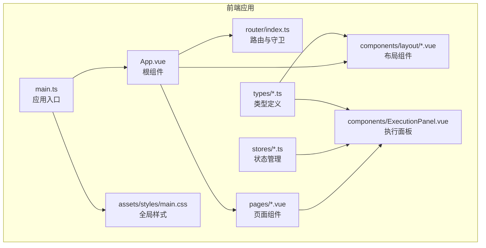
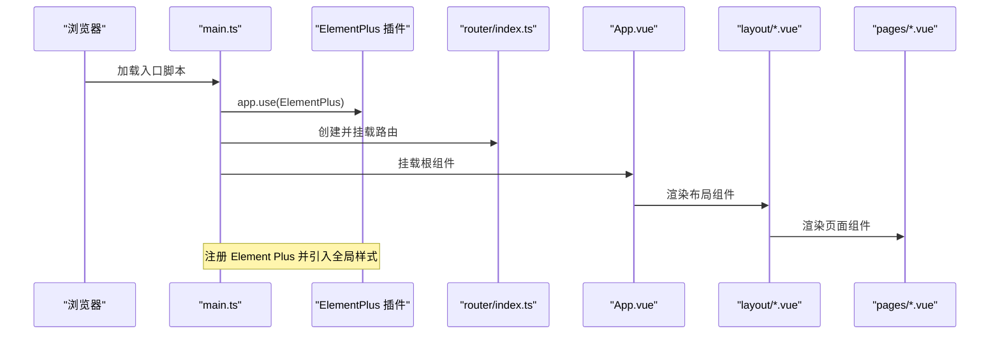
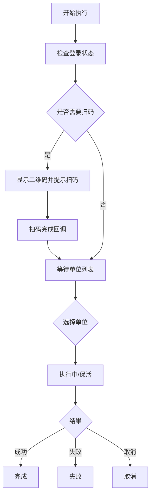
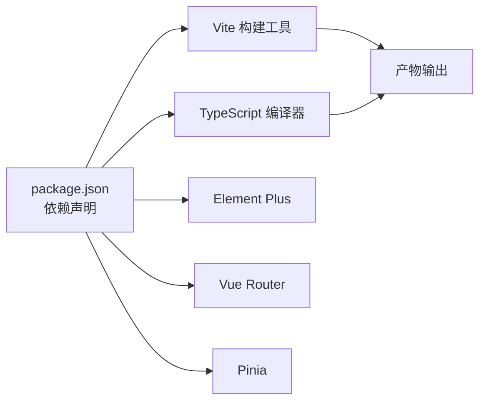

# UI 组件与样式

<cite>
**本文引用的文件**
- [package.json](file://CCC-BrowserV4/frontend/package.json)
- [vite.config.ts](file://CCC-BrowserV4/frontend/vite.config.ts)
- [main.css](file://CCC-BrowserV4/frontend/src/assets/styles/main.css)
- [main.ts](file://CCC-BrowserV4/frontend/src/main.ts)
- [tsconfig.json](file://CCC-BrowserV4/frontend/tsconfig.json)
- [App.vue](file://CCC-BrowserV4/frontend/src/App.vue)
- [index.ts](file://CCC-BrowserV4/frontend/src/types/index.ts)
- [execution.ts](file://CCC-BrowserV4/frontend/src/types/execution.ts)
- [AppLayout.vue](file://CCC-BrowserV4/frontend/src/components/layout/AppLayout.vue)
- [SideMenu.vue](file://CCC-BrowserV4/frontend/src/components/layout/SideMenu.vue)
- [StatusBar.vue](file://CCC-BrowserV4/frontend/src/components/layout/StatusBar.vue)
- [ExecutionPanel.vue](file://CCC-BrowserV4/frontend/src/components/ExecutionPanel.vue)
- [HomePage.vue](file://CCC-BrowserV4/frontend/src/pages/HomePage.vue)
- [router/index.ts](file://CCC-BrowserV4/frontend/src/router/index.ts)
</cite>

## 目录
1. [引言](#引言)
2. [项目结构](#项目结构)
3. [核心组件](#核心组件)
4. [架构总览](#架构总览)
5. [详细组件分析](#详细组件分析)
6. [依赖分析](#依赖分析)
7. [性能考虑](#性能考虑)
8. [故障排查指南](#故障排查指南)
9. [结论](#结论)
10. [附录](#附录)

## 引言
本文件面向前端与全栈开发者，系统梳理前端工程中 UI 组件与样式的组织方式，重点围绕以下目标展开：
- Element Plus 组件库的引入、使用与图标注册
- 全局样式的组织与主题定制思路
- TypeScript 类型定义的编写与使用规范
- 样式模块化与作用域隔离（scoped）的实现
- 组件样式覆盖与自定义主题的方法
- 响应式设计与移动端适配策略
- 样式性能优化与打包配置
- UI 开发最佳实践与设计规范

## 项目结构
前端采用 Vue 3 + Vite + Pinia + Element Plus 技术栈，目录组织遵循“按功能分层”的方式：
- src/assets/styles：存放全局样式入口
- src/components：可复用 UI 组件（布局、状态栏等）
- src/pages：页面级组件
- src/stores：状态管理（Pinia）
- src/types：TypeScript 类型定义
- src/router：路由与导航守卫
- vite.config.ts：构建与开发服务器配置
- package.json：依赖与脚本

图示来源
- [main.ts:1-23](file://CCC-BrowserV4/frontend/src/main.ts#L1-L23)
- [App.vue:1-21](file://CCC-BrowserV4/frontend/src/App.vue#L1-L21)
- [router/index.ts:1-63](file://CCC-BrowserV4/frontend/src/router/index.ts#L1-L63)
- [main.css:1-27](file://CCC-BrowserV4/frontend/src/assets/styles/main.css#L1-L27)
- [AppLayout.vue:1-47](file://CCC-BrowserV4/frontend/src/components/layout/AppLayout.vue#L1-L47)
- [ExecutionPanel.vue:1-322](file://CCC-BrowserV4/frontend/src/components/ExecutionPanel.vue#L1-L322)
- [HomePage.vue:1-62](file://CCC-BrowserV4/frontend/src/pages/HomePage.vue#L1-L62)

章节来源
- [main.ts:1-23](file://CCC-BrowserV4/frontend/src/main.ts#L1-L23)
- [vite.config.ts:1-35](file://CCC-BrowserV4/frontend/vite.config.ts#L1-L35)
- [package.json:1-29](file://CCC-BrowserV4/frontend/package.json#L1-L29)

## 核心组件
- 应用入口与插件注册：在入口文件中注册 Element Plus、图标、路由与 Pinia，并引入全局样式。
- 布局组件：左侧菜单、主内容区、底部状态栏，统一采用 Element Plus 的容器与布局组件。
- 页面组件：首页卡片、描述列表、空状态等，结合 Element Plus 的卡片、描述、空状态等组件。
- 执行面板：根据执行步骤渲染不同 UI，使用按钮、图标、标签等组件展示状态。

章节来源
- [main.ts:1-23](file://CCC-BrowserV4/frontend/src/main.ts#L1-L23)
- [AppLayout.vue:1-47](file://CCC-BrowserV4/frontend/src/components/layout/AppLayout.vue#L1-L47)
- [SideMenu.vue:1-70](file://CCC-BrowserV4/frontend/src/components/layout/SideMenu.vue#L1-L70)
- [StatusBar.vue:1-70](file://CCC-BrowserV4/frontend/src/components/layout/StatusBar.vue#L1-L70)
- [HomePage.vue:1-62](file://CCC-BrowserV4/frontend/src/pages/HomePage.vue#L1-L62)
- [ExecutionPanel.vue:1-322](file://CCC-BrowserV4/frontend/src/components/ExecutionPanel.vue#L1-L322)

## 架构总览
下图展示了从应用启动到页面渲染的关键流程，以及 Element Plus 在其中的角色。

图示来源
- [main.ts:1-23](file://CCC-BrowserV4/frontend/src/main.ts#L1-L23)
- [router/index.ts:1-63](file://CCC-BrowserV4/frontend/src/router/index.ts#L1-L63)
- [App.vue:1-21](file://CCC-BrowserV4/frontend/src/App.vue#L1-L21)
- [AppLayout.vue:1-47](file://CCC-BrowserV4/frontend/src/components/layout/AppLayout.vue#L1-L47)
- [HomePage.vue:1-62](file://CCC-BrowserV4/frontend/src/pages/HomePage.vue#L1-L62)

## 详细组件分析

### Element Plus 集成与图标使用
- 插件注册：在入口文件中安装 Element Plus 插件，自动注入组件与样式。
- 图标注册：批量注册 Element Plus 图标组件，便于在模板中直接使用。
- 全局样式：引入 Element Plus 默认样式以确保组件基础样式一致。

章节来源
- [main.ts:1-23](file://CCC-BrowserV4/frontend/src/main.ts#L1-L23)
- [package.json:12-20](file://CCC-BrowserV4/frontend/package.json#L12-L20)

### 布局组件与样式隔离
- AppLayout：使用 Element Plus 的容器组件组织左右布局，右侧垂直布局包含主内容与底部状态栏；通过 scoped 样式限定作用域，避免全局污染。
- SideMenu：基于 El-Menu 实现侧边导航，使用 scoped 样式控制菜单外观与头部样式。
- StatusBar：底部状态栏展示设备信息、用户信息与连接状态，使用 scoped 样式保证定位与间距。

章节来源
- [AppLayout.vue:1-47](file://CCC-BrowserV4/frontend/src/components/layout/AppLayout.vue#L1-L47)
- [SideMenu.vue:1-70](file://CCC-BrowserV4/frontend/src/components/layout/SideMenu.vue#L1-L70)
- [StatusBar.vue:1-70](file://CCC-BrowserV4/frontend/src/components/layout/StatusBar.vue#L1-L70)

### 执行面板组件与状态驱动
- 状态机：执行面板根据执行步骤渲染不同 UI，包括登录检查、二维码扫描、单位选择、执行中、完成、失败、取消等状态。
- 交互逻辑：通过按钮触发扫码完成、选择单位、取消执行等操作；同时监听 WebSocket 消息更新状态。
- 样式组织：使用 scoped 样式对各状态区域进行样式隔离，包含动画、布局与颜色区分。

图示来源
- [ExecutionPanel.vue:1-322](file://CCC-BrowserV4/frontend/src/components/ExecutionPanel.vue#L1-L322)
- [execution.ts:1-229](file://CCC-BrowserV4/frontend/src/stores/execution.ts#L1-L229)

章节来源
- [ExecutionPanel.vue:1-322](file://CCC-BrowserV4/frontend/src/components/ExecutionPanel.vue#L1-L322)
- [execution.ts:1-229](file://CCC-BrowserV4/frontend/src/stores/execution.ts#L1-L229)

### 页面组件与 Element Plus 组件组合
- 首页：使用卡片、描述列表与空状态组件展示欢迎信息与用户/设备信息。
- 路由与守卫：根据登录状态决定页面访问权限，未登录跳转登录页，已登录访问登录页则跳转首页。

章节来源
- [HomePage.vue:1-62](file://CCC-BrowserV4/frontend/src/pages/HomePage.vue#L1-L62)
- [router/index.ts:1-63](file://CCC-BrowserV4/frontend/src/router/index.ts#L1-L63)

### TypeScript 类型定义与使用规范
- 类型集中：在 types 目录下集中定义应用所需的接口与联合类型，如认证状态、设备状态、菜单项、任务信息、执行步骤与公司信息等。
- 使用场景：在组件 props、store 状态、API 返回数据等处引用类型，提升开发体验与运行时安全性。

章节来源
- [index.ts:1-42](file://CCC-BrowserV4/frontend/src/types/index.ts#L1-L42)
- [execution.ts:1-17](file://CCC-BrowserV4/frontend/src/types/execution.ts#L1-L17)

## 依赖分析
- 运行时依赖：Vue 3、Element Plus、Vue Router、Pinia、Axios、@tauri-apps/api 等。
- 开发依赖：Vite、@vitejs/plugin-vue、TypeScript、vue-tsc 等。
- 构建目标：兼容 ES2021 与 Chrome 105+、Safari 15+，生产环境启用压缩与源码映射开关受调试变量控制。

图示来源
- [package.json:1-29](file://CCC-BrowserV4/frontend/package.json#L1-L29)
- [vite.config.ts:1-35](file://CCC-BrowserV4/frontend/vite.config.ts#L1-L35)

章节来源
- [package.json:1-29](file://CCC-BrowserV4/frontend/package.json#L1-L29)
- [vite.config.ts:1-35](file://CCC-BrowserV4/frontend/vite.config.ts#L1-L35)

## 性能考虑
- 构建目标与压缩：生产环境默认启用 esbuild 压缩，可通过调试变量控制是否生成源码映射，平衡包体大小与调试成本。
- 按需加载：Element Plus 图标通过批量注册使用，建议结合按需导入策略进一步减少首屏体积（可在后续优化中实施）。
- 样式体积：全局样式与组件 scoped 样式分离，避免重复样式；保持组件样式粒度适中，避免过度拆分导致的样式碎片化。
- 资源缓存：静态资源由 Vite 默认策略处理，建议在生产环境配合 CDN 与合适的缓存头策略。

章节来源
- [vite.config.ts:29-33](file://CCC-BrowserV4/frontend/vite.config.ts#L29-L33)

## 故障排查指南
- 登录态与路由守卫：若出现无法访问受保护页面或循环跳转，检查路由守卫中的登录判断逻辑与 authStore 的状态恢复。
- 执行面板状态异常：若执行面板状态不更新，检查 WebSocket 消息处理与 store 中的状态机推进逻辑。
- 样式冲突：若组件样式被意外影响，确认是否误用了全局样式或缺少 scoped 样式；必要时使用深度选择器或更精确的选择器限定范围。
- 图标未显示：若图标组件未生效，确认已在入口文件中完成图标注册。

章节来源
- [router/index.ts:47-60](file://CCC-BrowserV4/frontend/src/router/index.ts#L47-L60)
- [execution.ts:22-67](file://CCC-BrowserV4/frontend/src/stores/execution.ts#L22-L67)
- [main.ts:17-20](file://CCC-BrowserV4/frontend/src/main.ts#L17-L20)

## 结论
本项目以 Element Plus 为核心 UI 基础设施，结合 Vue 3 组合式 API 与 Pinia 状态管理，实现了清晰的布局与页面组件结构。通过全局样式入口与组件 scoped 样式，有效实现了样式隔离与模块化。配合 TypeScript 类型定义，提升了开发效率与可维护性。后续可在按需导入、主题定制与响应式策略上进一步优化，以满足更复杂的业务需求与用户体验要求。

## 附录

### 全局样式组织与主题定制
- 全局样式入口：在入口文件引入全局样式，统一字体、滚动条等基础样式。
- 主题定制思路：Element Plus 支持 CSS 变量与主题包，可在开发环境中通过覆盖变量或引入主题包的方式进行定制；生产环境建议将定制样式打包为独立样式文件并按需加载。

章节来源
- [main.css:1-27](file://CCC-BrowserV4/frontend/src/assets/styles/main.css#L1-L27)
- [main.ts:5-5](file://CCC-BrowserV4/frontend/src/main.ts#L5-L5)

### 样式模块化与作用域隔离
- scoped 样式：组件内使用 scoped 样式限定作用域，避免样式泄漏。
- 深度选择器：在需要穿透作用域时，谨慎使用深度选择器，确保样式边界清晰。
- 全局样式：仅放置通用基础样式，避免在全局样式中写入组件特有样式。

章节来源
- [AppLayout.vue:28-46](file://CCC-BrowserV4/frontend/src/components/layout/AppLayout.vue#L28-L46)
- [SideMenu.vue:52-69](file://CCC-BrowserV4/frontend/src/components/layout/SideMenu.vue#L52-L69)
- [StatusBar.vue:33-69](file://CCC-BrowserV4/frontend/src/components/layout/StatusBar.vue#L33-L69)
- [ExecutionPanel.vue:130-321](file://CCC-BrowserV4/frontend/src/components/ExecutionPanel.vue#L130-L321)

### 响应式设计与移动端适配
- 视口与断点：建议在全局样式中设置合理的视口配置与断点策略，结合 Element Plus 组件的响应式行为进行适配。
- 移动端交互：针对移动端触摸与手势进行优化，确保按钮与菜单在小屏设备上的可用性。

章节来源
- [main.css:7-11](file://CCC-BrowserV4/frontend/src/assets/styles/main.css#L7-L11)

### 样式覆盖与自定义主题方法
- 组件属性覆盖：通过 Element Plus 组件提供的属性（如颜色、尺寸、形状）进行快速覆盖。
- 自定义主题：在开发环境中通过 CSS 变量或主题包进行主题定制，生产环境打包为独立样式文件。

章节来源
- [SideMenu.vue:2-8](file://CCC-BrowserV4/frontend/src/components/layout/SideMenu.vue#L2-L8)
- [AppLayout.vue:33-41](file://CCC-BrowserV4/frontend/src/components/layout/AppLayout.vue#L33-L41)

### UI 开发最佳实践与设计规范
- 组件职责单一：每个组件专注于单一功能，通过 props 与事件进行通信。
- 类型安全：在组件与 store 中广泛使用 TypeScript 类型，确保数据结构一致性。
- 样式命名规范：采用语义化命名，结合 BEM 或类似约定，提升可读性与可维护性。
- 可访问性：为交互元素提供明确的焦点状态与键盘支持，确保可访问性。

章节来源
- [index.ts:1-42](file://CCC-BrowserV4/frontend/src/types/index.ts#L1-L42)
- [execution.ts:1-17](file://CCC-BrowserV4/frontend/src/types/execution.ts#L1-L17)
- [App.vue:13-19](file://CCC-BrowserV4/frontend/src/App.vue#L13-L19)