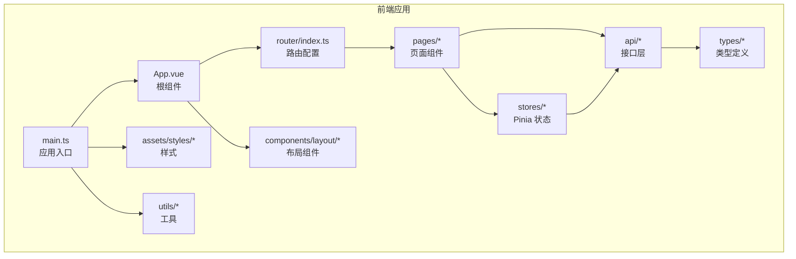
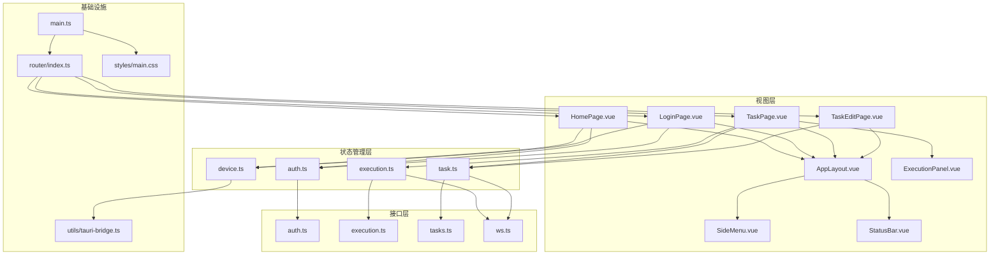
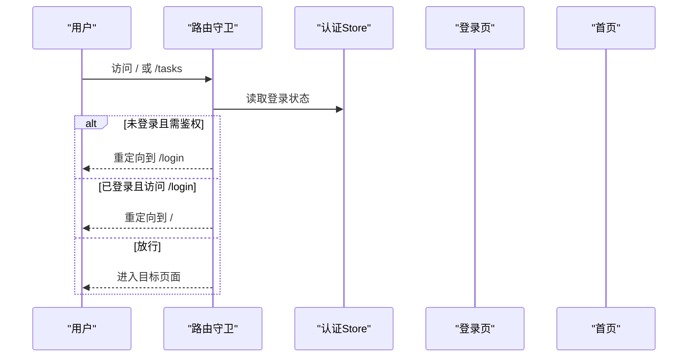
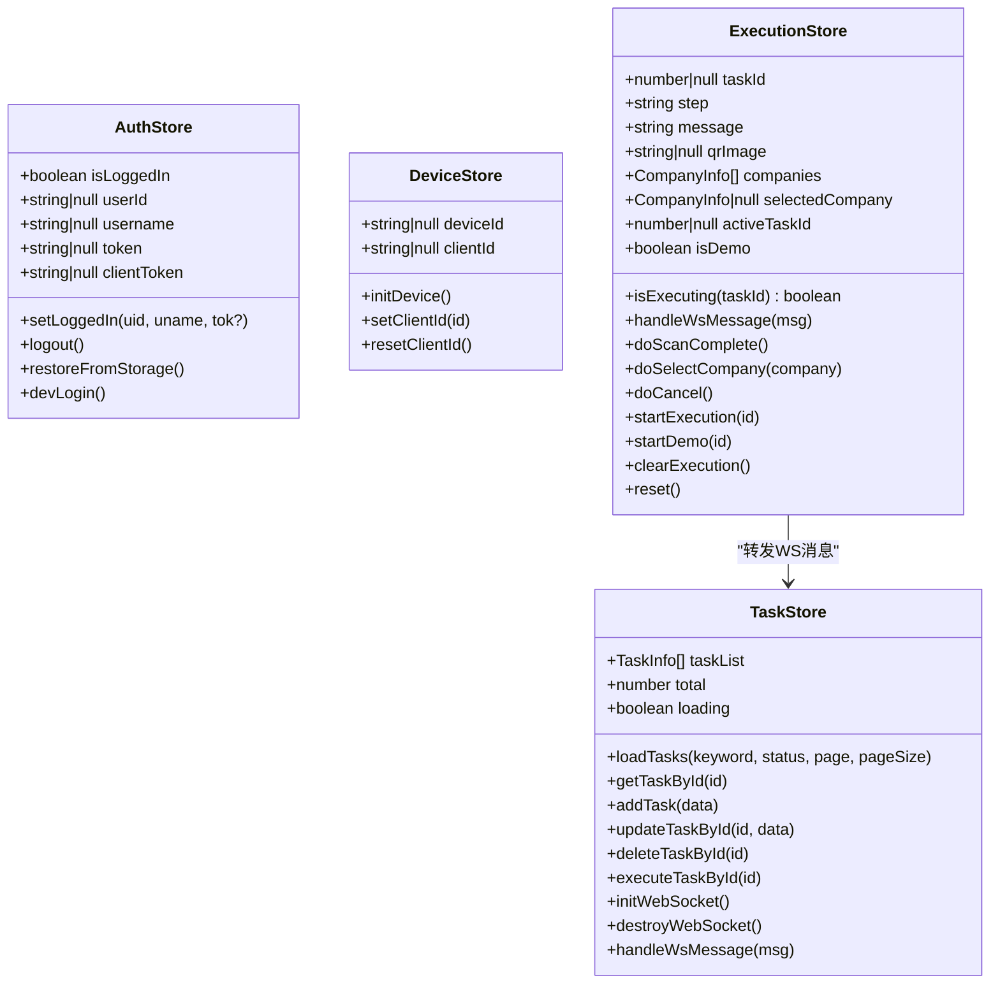
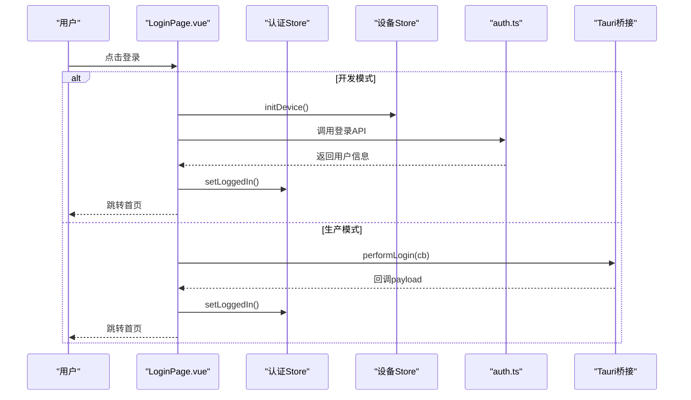
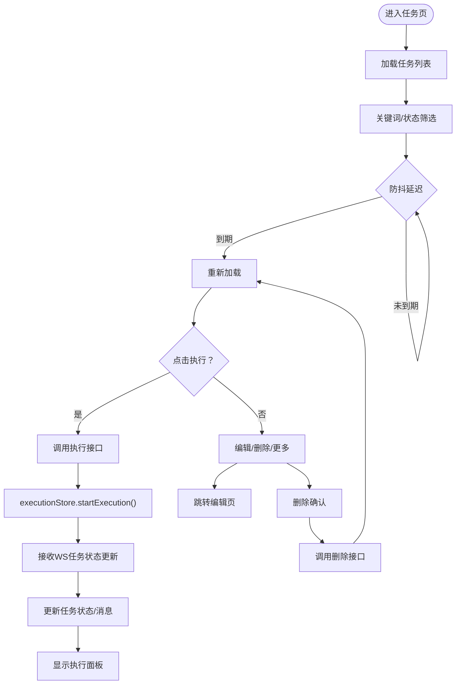
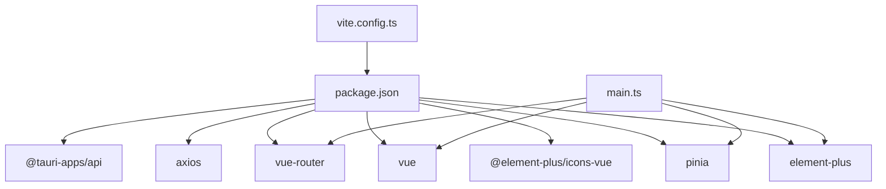

# 前端管理界面

<cite>
**本文引用的文件**
- [package.json](file://CCC-BrowserV4/frontend/package.json)
- [vite.config.ts](file://CCC-BrowserV4/frontend/vite.config.ts)
- [main.ts](file://CCC-BrowserV4/frontend/src/main.ts)
- [router/index.ts](file://CCC-BrowserV4/frontend/src/router/index.ts)
- [App.vue](file://CCC-BrowserV4/frontend/src/App.vue)
- [layout/AppLayout.vue](file://CCC-BrowserV4/frontend/src/components/layout/AppLayout.vue)
- [layout/SideMenu.vue](file://CCC-BrowserV4/frontend/src/components/layout/SideMenu.vue)
- [layout/StatusBar.vue](file://CCC-BrowserV4/frontend/src/components/layout/StatusBar.vue)
- [ExecutionPanel.vue](file://CCC-BrowserV4/frontend/src/components/ExecutionPanel.vue)
- [auth.ts](file://CCC-BrowserV4/frontend/src/stores/auth.ts)
- [device.ts](file://CCC-BrowserV4/frontend/src/stores/device.ts)
- [execution.ts](file://CCC-BrowserV4/frontend/src/stores/execution.ts)
- [task.ts](file://CCC-BrowserV4/frontend/src/stores/task.ts)
- [auth.ts](file://CCC-BrowserV4/frontend/src/api/auth.ts)
- [execution.ts](file://CCC-BrowserV4/frontend/src/api/execution.ts)
- [request.ts](file://CCC-BrowserV4/frontend/src/api/request.ts)
- [tasks.ts](file://CCC-BrowserV4/frontend/src/api/tasks.ts)
- [ws.ts](file://CCC-BrowserV4/frontend/src/api/ws.ts)
- [tauri-bridge.ts](file://CCC-BrowserV4/frontend/src/utils/tauri-bridge.ts)
- [execution-log.ts](file://CCC-BrowserV4/frontend/src/types/execution-log.ts)
- [execution.ts](file://CCC-BrowserV4/frontend/src/types/execution.ts)
- [index.ts](file://CCC-BrowserV4/frontend/src/types/index.ts)
- [HomePage.vue](file://CCC-BrowserV4/frontend/src/pages/HomePage.vue)
- [LoginPage.vue](file://CCC-BrowserV4/frontend/src/pages/LoginPage.vue)
- [TaskPage.vue](file://CCC-BrowserV4/frontend/src/pages/TaskPage.vue)
- [TaskEditPage.vue](file://CCC-BrowserV4/frontend/src/pages/TaskEditPage.vue)
- [main.css](file://CCC-BrowserV4/frontend/src/assets/styles/main.css)
</cite>

## 目录
1. [简介](#简介)
2. [项目结构](#项目结构)
3. [核心组件](#核心组件)
4. [架构总览](#架构总览)
5. [详细组件分析](#详细组件分析)
6. [依赖关系分析](#依赖关系分析)
7. [性能考虑](#性能考虑)
8. [故障排查指南](#故障排查指南)
9. [结论](#结论)
10. [附录](#附录)

## 简介
本项目是一个基于 Vue3 + TypeScript 的前端管理界面，采用 Vite 构建工具，集成了 Element Plus 组件库与 Pinia 状态管理。系统通过 Vue Router 实现页面级导航与权限控制，结合 WebSocket 实时推送任务状态，支持任务的增删改查与执行流程可视化。同时，借助 Tauri Bridge 提供设备信息读取能力，满足跨平台桌面应用集成需求。

## 项目结构
前端代码位于 CCC-BrowserV4/frontend，主要目录组织如下：
- src/api：封装与后端交互的接口模块（认证、任务、执行、WebSocket）
- src/assets/styles：全局样式与主题定制
- src/components：可复用布局与业务组件（布局容器、侧边菜单、状态栏、执行面板）
- src/pages：页面级组件（首页、登录页、任务页、任务编辑页）
- src/router：路由配置与导航守卫
- src/stores：Pinia 状态管理（认证、设备、执行、任务）
- src/types：类型定义（执行日志、执行模型等）
- src/utils：工具模块（Tauri 桥接）
- src/main.ts：应用入口，注册插件、挂载应用
- vite.config.ts：构建与开发服务器配置
- package.json：依赖与脚本命令

图表来源
- [main.ts:1-23](file://CCC-BrowserV4/frontend/src/main.ts#L1-L23)
- [App.vue:1-21](file://CCC-BrowserV4/frontend/src/App.vue#L1-L21)
- [router/index.ts:1-63](file://CCC-BrowserV4/frontend/src/router/index.ts#L1-L63)

章节来源
- [package.json:1-29](file://CCC-BrowserV4/frontend/package.json#L1-L29)
- [vite.config.ts:1-35](file://CCC-BrowserV4/frontend/vite.config.ts#L1-L35)

## 核心组件
- 应用入口与插件注册：在入口文件中初始化 Vue、Pinia、Element Plus、路由与全局样式，注册 Element Plus 图标组件，确保运行时可用。
- 根组件生命周期：在挂载阶段恢复认证状态并初始化设备信息，保证用户体验连贯性。
- 路由与导航守卫：定义登录页与受保护页面，通过守卫判断登录状态并进行跳转；支持嵌套路由与动态导入页面组件。
- 状态管理：四个核心 Store 分别负责认证、设备、执行、任务状态，统一管理数据流与副作用。
- 页面组件：首页用于展示用户与设备信息；登录页负责发起登录流程或开发模式虚拟登录；任务页提供任务列表、分页、筛选、执行与演示；任务编辑页支持新增与编辑任务表单。
- 布局与样式：统一的侧边菜单、主内容区与底部状态栏布局；全局滚动条样式与卡片式设计提升视觉一致性。

章节来源
- [main.ts:1-23](file://CCC-BrowserV4/frontend/src/main.ts#L1-L23)
- [App.vue:1-21](file://CCC-BrowserV4/frontend/src/App.vue#L1-L21)
- [router/index.ts:1-63](file://CCC-BrowserV4/frontend/src/router/index.ts#L1-L63)
- [auth.ts:1-79](file://CCC-BrowserV4/frontend/src/stores/auth.ts#L1-L79)
- [device.ts:1-40](file://CCC-BrowserV4/frontend/src/stores/device.ts#L1-L40)
- [execution.ts:1-229](file://CCC-BrowserV4/frontend/src/stores/execution.ts#L1-L229)
- [task.ts:1-77](file://CCC-BrowserV4/frontend/src/stores/task.ts#L1-L77)
- [HomePage.vue:1-62](file://CCC-BrowserV4/frontend/src/pages/HomePage.vue#L1-L62)
- [LoginPage.vue:1-228](file://CCC-BrowserV4/frontend/src/pages/LoginPage.vue#L1-L228)
- [TaskPage.vue:1-428](file://CCC-BrowserV4/frontend/src/pages/TaskPage.vue#L1-L428)
- [TaskEditPage.vue:1-213](file://CCC-BrowserV4/frontend/src/pages/TaskEditPage.vue#L1-L213)
- [layout/AppLayout.vue:1-47](file://CCC-BrowserV4/frontend/src/components/layout/AppLayout.vue#L1-L47)
- [main.css:1-27](file://CCC-BrowserV4/frontend/src/assets/styles/main.css#L1-L27)

## 架构总览
前端采用“页面组件 + 布局组件 + 状态管理 + 接口层”的分层架构。页面组件通过 Pinia Store 访问状态与副作用，Store 再通过 API 层与后端通信；路由负责页面导航与鉴权；Element Plus 提供 UI 能力；Vite 提供开发与构建支持。

图表来源
- [main.ts:1-23](file://CCC-BrowserV4/frontend/src/main.ts#L1-L23)
- [router/index.ts:1-63](file://CCC-BrowserV4/frontend/src/router/index.ts#L1-L63)
- [auth.ts:1-79](file://CCC-BrowserV4/frontend/src/stores/auth.ts#L1-L79)
- [device.ts:1-40](file://CCC-BrowserV4/frontend/src/stores/device.ts#L1-L40)
- [execution.ts:1-229](file://CCC-BrowserV4/frontend/src/stores/execution.ts#L1-L229)
- [task.ts:1-77](file://CCC-BrowserV4/frontend/src/stores/task.ts#L1-L77)
- [auth.ts:1-79](file://CCC-BrowserV4/frontend/src/api/auth.ts)
- [execution.ts:1-229](file://CCC-BrowserV4/frontend/src/api/execution.ts)
- [tasks.ts:1-77](file://CCC-BrowserV4/frontend/src/api/tasks.ts)
- [ws.ts:1-77](file://CCC-BrowserV4/frontend/src/api/ws.ts)
- [tauri-bridge.ts:1-40](file://CCC-BrowserV4/frontend/src/utils/tauri-bridge.ts)
- [layout/AppLayout.vue:1-47](file://CCC-BrowserV4/frontend/src/components/layout/AppLayout.vue#L1-L47)
- [ExecutionPanel.vue:1-229](file://CCC-BrowserV4/frontend/src/components/ExecutionPanel.vue)

## 详细组件分析

### 路由与导航
- 路由结构：登录页不需登录；根路径下包含首页、任务页、任务新增与编辑页；采用动态导入以优化首屏加载。
- 导航守卫：对需要登录的页面进行鉴权，未登录跳转至登录页；已登录访问登录页则跳转首页。
- 历史模式：使用 createWebHistory，适配现代浏览器与部署场景。

图表来源
- [router/index.ts:47-60](file://CCC-BrowserV4/frontend/src/router/index.ts#L47-L60)
- [auth.ts:67-79](file://CCC-BrowserV4/frontend/src/stores/auth.ts#L67-L79)

章节来源
- [router/index.ts:1-63](file://CCC-BrowserV4/frontend/src/router/index.ts#L1-L63)

### Pinia 状态管理
- 认证状态（auth.ts）：维护登录态、用户信息与令牌，支持持久化到 localStorage 并在应用启动时恢复。
- 设备状态（device.ts）：通过 Tauri Bridge 获取设备 ID，提供客户端 ID 设置与重置。
- 执行状态（execution.ts）：管理任务执行步骤、消息、二维码、公司列表与演示模式；处理 WebSocket 消息并驱动 UI 更新。
- 任务状态（task.ts）：维护任务列表、总数与加载状态；封装 CRUD 与执行 API；订阅 WebSocket 并转发消息至执行 Store。

图表来源
- [auth.ts:1-79](file://CCC-BrowserV4/frontend/src/stores/auth.ts#L1-L79)
- [device.ts:1-40](file://CCC-BrowserV4/frontend/src/stores/device.ts#L1-L40)
- [execution.ts:1-229](file://CCC-BrowserV4/frontend/src/stores/execution.ts#L1-L229)
- [task.ts:1-77](file://CCC-BrowserV4/frontend/src/stores/task.ts#L1-L77)

章节来源
- [auth.ts:1-79](file://CCC-BrowserV4/frontend/src/stores/auth.ts#L1-L79)
- [device.ts:1-40](file://CCC-BrowserV4/frontend/src/stores/device.ts#L1-L40)
- [execution.ts:1-229](file://CCC-BrowserV4/frontend/src/stores/execution.ts#L1-L229)
- [task.ts:1-77](file://CCC-BrowserV4/frontend/src/stores/task.ts#L1-L77)

### 页面组件与交互逻辑

#### 首页（HomePage.vue）
- 功能：展示欢迎语与当前用户信息、设备 ID。
- 交互：读取认证与设备 Store 数据，渲染描述信息。

章节来源
- [HomePage.vue:1-62](file://CCC-BrowserV4/frontend/src/pages/HomePage.vue#L1-L62)
- [auth.ts:1-79](file://CCC-BrowserV4/frontend/src/stores/auth.ts#L1-L79)
- [device.ts:1-40](file://CCC-BrowserV4/frontend/src/stores/device.ts#L1-L40)

#### 登录页（LoginPage.vue）
- 功能：支持开发模式虚拟登录与生产模式真实登录；显示设备 ID；提供登录提示与错误反馈。
- 流程：开发模式优先调用后端登录 API，失败则回退到本地虚拟登录；生产模式通过 Tauri 桥接监听登录回调；带超时处理与资源清理。

图表来源
- [LoginPage.vue:93-169](file://CCC-BrowserV4/frontend/src/pages/LoginPage.vue#L93-L169)
- [auth.ts:15-79](file://CCC-BrowserV4/frontend/src/stores/auth.ts#L15-L79)
- [device.ts:12-16](file://CCC-BrowserV4/frontend/src/stores/device.ts#L12-L16)
- [auth.ts:1-79](file://CCC-BrowserV4/frontend/src/api/auth.ts)

章节来源
- [LoginPage.vue:1-228](file://CCC-BrowserV4/frontend/src/pages/LoginPage.vue#L1-L228)

#### 任务页（TaskPage.vue）
- 功能：任务列表展示、搜索与筛选、分页、执行与演示、编辑与删除、更多操作。
- 交互：使用防抖优化搜索；执行任务时乐观更新状态；订阅 WebSocket 实时更新任务状态；内联执行面板按任务维度显示。

图表来源
- [TaskPage.vue:158-294](file://CCC-BrowserV4/frontend/src/pages/TaskPage.vue#L158-L294)
- [task.ts:50-77](file://CCC-BrowserV4/frontend/src/stores/task.ts#L50-L77)
- [execution.ts:122-132](file://CCC-BrowserV4/frontend/src/stores/execution.ts#L122-L132)

章节来源
- [TaskPage.vue:1-428](file://CCC-BrowserV4/frontend/src/pages/TaskPage.vue#L1-L428)
- [task.ts:1-77](file://CCC-BrowserV4/frontend/src/stores/task.ts#L1-L77)
- [execution.ts:1-229](file://CCC-BrowserV4/frontend/src/stores/execution.ts#L1-L229)

#### 任务编辑页（TaskEditPage.vue）
- 功能：新增与编辑任务表单，包含名称、客户、经手人、省份、子任务、下次执行时间与备注。
- 交互：根据路由参数判断编辑模式；提交前进行表单校验；成功后返回任务列表。

章节来源
- [TaskEditPage.vue:1-213](file://CCC-BrowserV4/frontend/src/pages/TaskEditPage.vue#L1-L213)
- [task.ts:34-48](file://CCC-BrowserV4/frontend/src/stores/task.ts#L34-L48)

### 布局与样式
- 布局：左侧菜单 + 主内容区 + 底部状态栏，整体高度占满视窗，主内容区支持滚动。
- 样式：全局重置与字体设置；统一滚动条样式；页面卡片化设计，增强可读性与层级感。

章节来源
- [layout/AppLayout.vue:1-47](file://CCC-BrowserV4/frontend/src/components/layout/AppLayout.vue#L1-L47)
- [main.css:1-27](file://CCC-BrowserV4/frontend/src/assets/styles/main.css#L1-L27)

## 依赖关系分析
- 构建与开发：Vite 提供开发服务器、代理与构建目标配置；Element Plus 作为 UI 组件库；Pinia 与 Vue Router 作为状态与路由核心。
- 运行时依赖：axios 用于 HTTP 请求；@tauri-apps/api 与 utils/tauri-bridge 协同提供设备信息读取能力。
- 类型安全：通过 TypeScript 与 src/types 定义确保接口与状态的数据结构一致。

图表来源
- [vite.config.ts:1-35](file://CCC-BrowserV4/frontend/vite.config.ts#L1-L35)
- [package.json:12-27](file://CCC-BrowserV4/frontend/package.json#L12-L27)
- [main.ts:1-23](file://CCC-BrowserV4/frontend/src/main.ts#L1-L23)

章节来源
- [package.json:1-29](file://CCC-BrowserV4/frontend/package.json#L1-L29)
- [vite.config.ts:1-35](file://CCC-BrowserV4/frontend/vite.config.ts#L1-L35)

## 性能考虑
- 代码分割：路由采用动态导入，减少首屏体积。
- 防抖优化：任务页搜索输入使用防抖，降低请求频率。
- 乐观更新：执行任务时立即更新 UI，提升响应感。
- 构建目标：针对现代浏览器与 Chrome 105+ 进行编译，启用最小化与源码映射（调试模式）。
- 代理策略：开发环境下对 /api 与 /ws 进行代理，便于前后端联调。

章节来源
- [router/index.ts:8-36](file://CCC-BrowserV4/frontend/src/router/index.ts#L8-L36)
- [TaskPage.vue:167-181](file://CCC-BrowserV4/frontend/src/pages/TaskPage.vue#L167-L181)
- [vite.config.ts:29-33](file://CCC-BrowserV4/frontend/vite.config.ts#L29-L33)

## 故障排查指南
- 登录问题
  - 开发模式：若后端不可用，自动回退到本地虚拟登录；检查设备 ID 初始化与消息提示。
  - 生产模式：确认 Tauri 桥接回调是否正确触发；关注超时与错误提示。
- 任务执行
  - 执行按钮禁用：当前任务可能已在执行；检查 executionStore.activeTaskId 与 step。
  - WebSocket 不更新：确认 taskStore.initWebSocket 已调用且未被销毁；检查消息转发逻辑。
- 路由跳转
  - 未登录跳转：确认守卫逻辑与认证 Store 持久化状态；检查 localStorage 中的 auth_state。
- 构建与代理
  - 代理无效：确认 vite.config.ts 中 /api 与 /ws 代理配置与后端地址一致；检查 changeOrigin 与 ws 参数。

章节来源
- [LoginPage.vue:93-169](file://CCC-BrowserV4/frontend/src/pages/LoginPage.vue#L93-L169)
- [TaskPage.vue:255-267](file://CCC-BrowserV4/frontend/src/pages/TaskPage.vue#L255-L267)
- [task.ts:50-77](file://CCC-BrowserV4/frontend/src/stores/task.ts#L50-L77)
- [router/index.ts:47-60](file://CCC-BrowserV4/frontend/src/router/index.ts#L47-L60)
- [vite.config.ts:16-26](file://CCC-BrowserV4/frontend/vite.config.ts#L16-L26)

## 结论
本前端管理界面以清晰的分层架构、完善的路由与状态管理、丰富的 Element Plus 组件与良好的开发体验为基础，实现了任务管理与执行流程的可视化。通过 Pinia 的组合式 Store 模式与 Vue Router 的守卫机制，系统具备良好的可维护性与扩展性；配合 Vite 的高效构建与代理能力，能够快速迭代并稳定交付。

## 附录
- 开发环境设置
  - 安装依赖：使用包管理器安装项目依赖。
  - 启动开发服务器：运行开发脚本，访问本地端口查看效果。
  - 代理配置：确保后端服务运行于本地指定端口，以便 /api 与 /ws 代理生效。
- 构建与部署
  - 构建产物：使用构建脚本生成静态资源，目标浏览器兼容性已在配置中设定。
  - 部署建议：将构建产物部署至静态服务器或反向代理；确保 /api 与 /ws 路径指向后端服务。
- 自定义样式覆盖
  - 全局样式：在全局样式文件中添加或覆盖 Element Plus 默认样式。
  - 组件样式：页面与组件内部使用 scoped 样式隔离，必要时可通过深度选择器进行局部覆盖。

章节来源
- [package.json:6-11](file://CCC-BrowserV4/frontend/package.json#L6-L11)
- [vite.config.ts:13-33](file://CCC-BrowserV4/frontend/vite.config.ts#L13-L33)
- [main.css:1-27](file://CCC-BrowserV4/frontend/src/assets/styles/main.css#L1-L27)