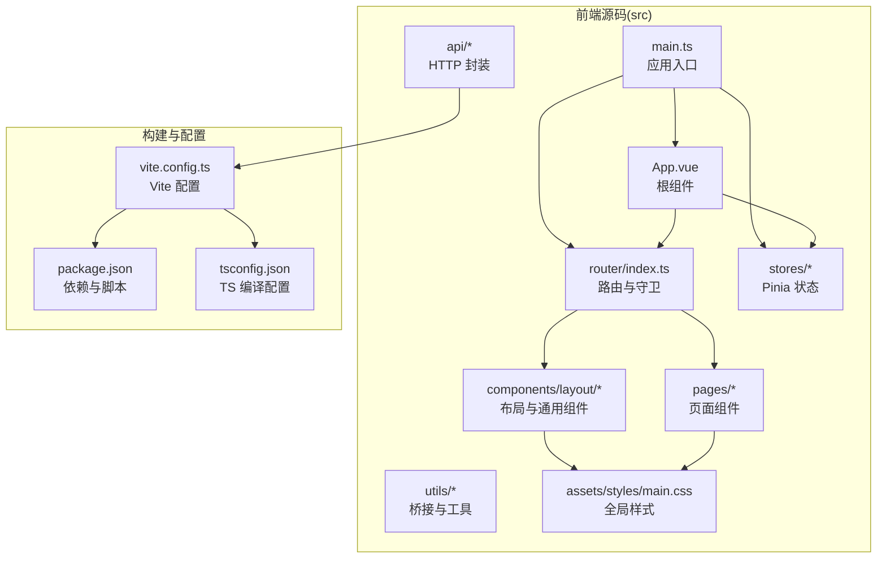
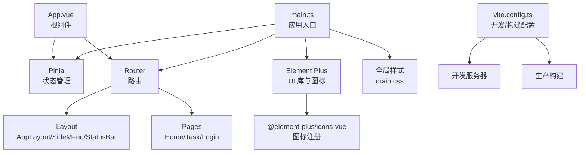
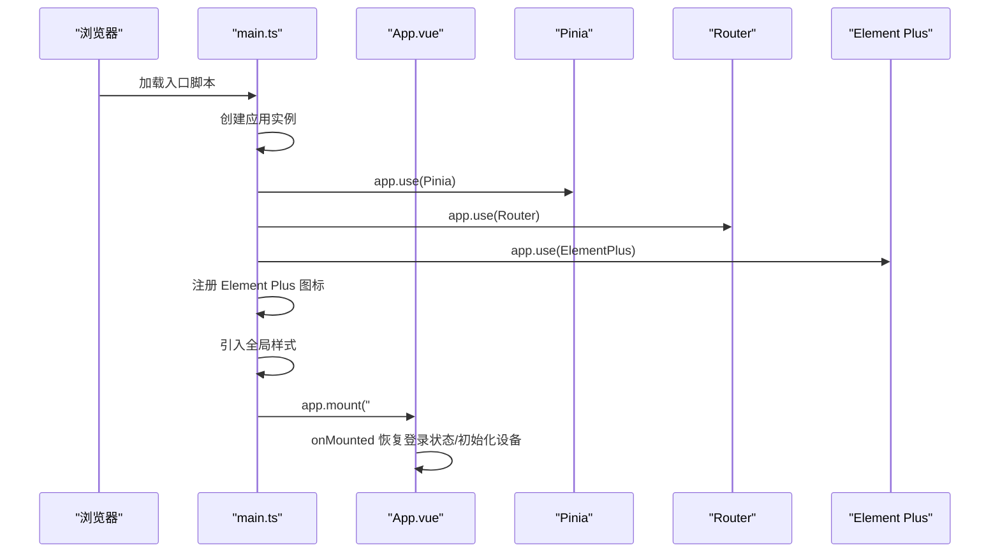
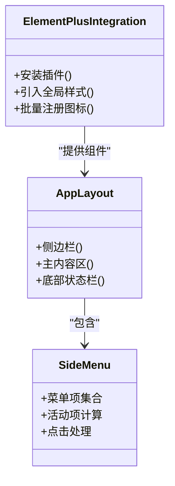
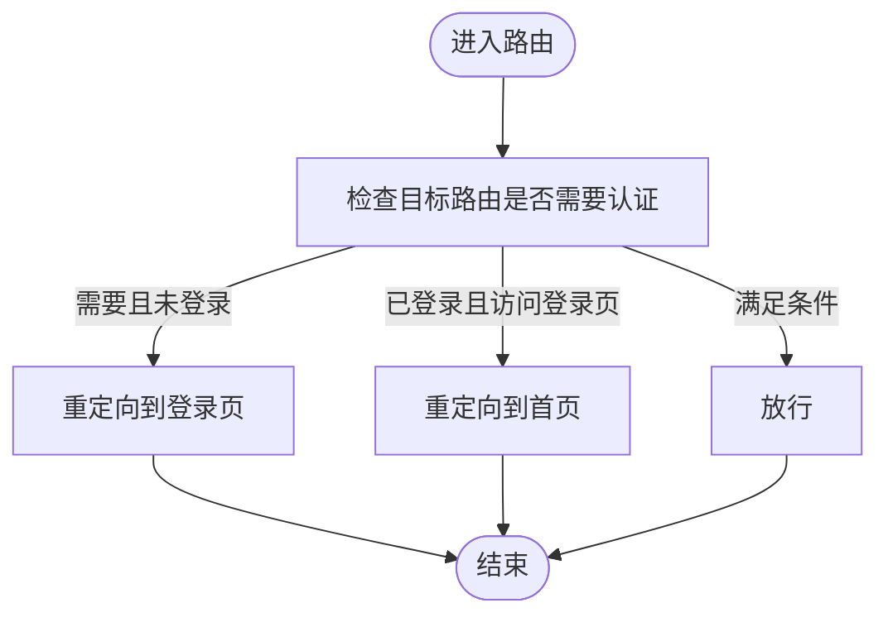
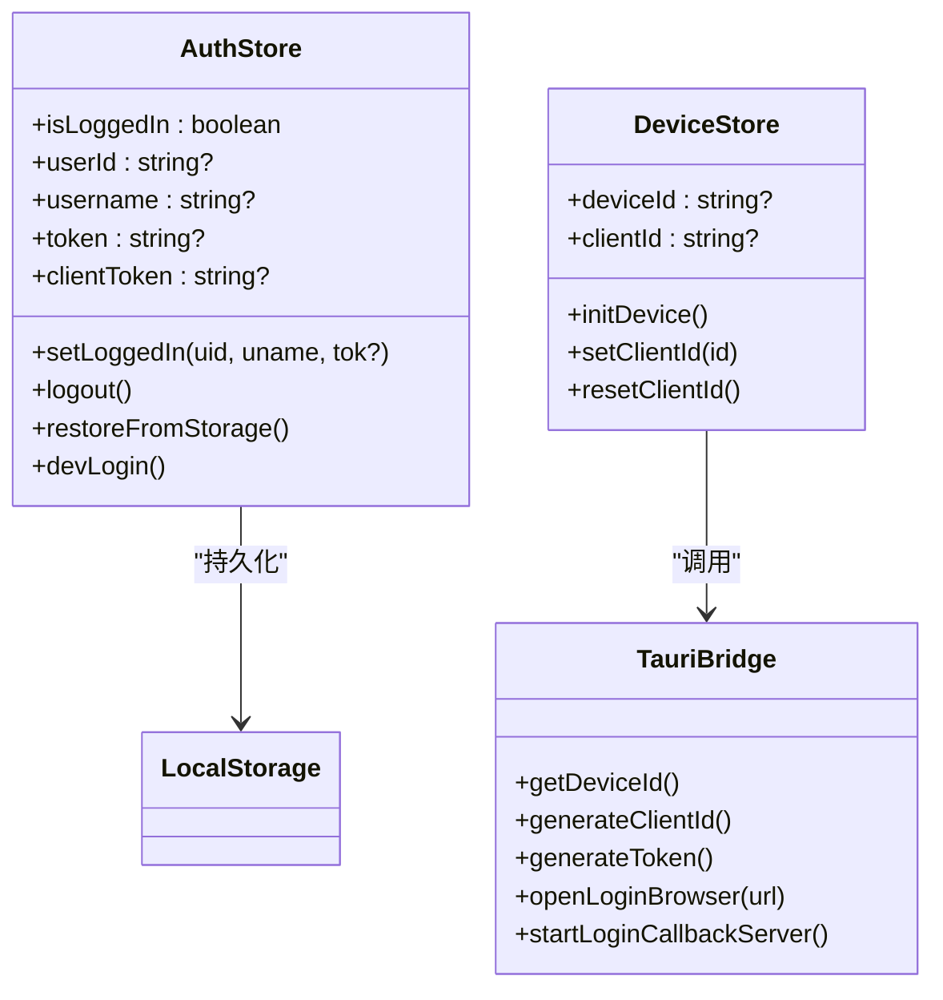
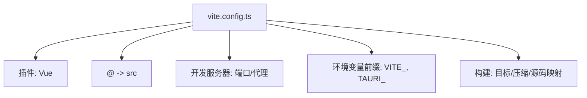
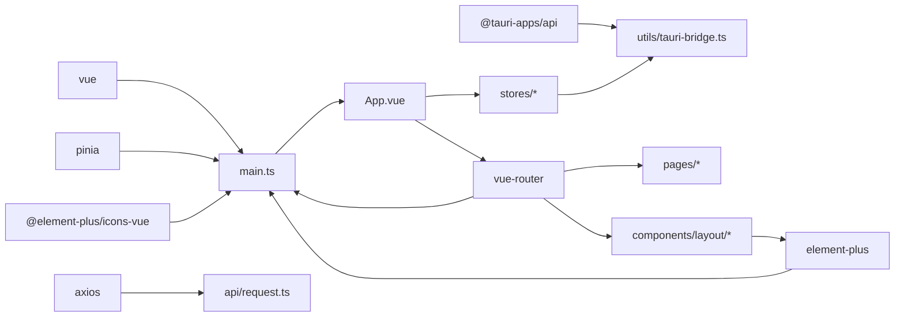

# 应用架构设计

<cite>
**本文档引用的文件**
- [main.ts](file://CCC-BrowserV4/frontend/src/main.ts)
- [App.vue](file://CCC-BrowserV4/frontend/src/App.vue)
- [router/index.ts](file://CCC-BrowserV4/frontend/src/router/index.ts)
- [stores/auth.ts](file://CCC-BrowserV4/frontend/src/stores/auth.ts)
- [stores/device.ts](file://CCC-BrowserV4/frontend/src/stores/device.ts)
- [components/layout/AppLayout.vue](file://CCC-BrowserV4/frontend/src/components/layout/AppLayout.vue)
- [components/layout/SideMenu.vue](file://CCC-BrowserV4/frontend/src/components/layout/SideMenu.vue)
- [components/layout/StatusBar.vue](file://CCC-BrowserV4/frontend/src/components/layout/StatusBar.vue)
- [assets/styles/main.css](file://CCC-BrowserV4/frontend/src/assets/styles/main.css)
- [utils/tauri-bridge.ts](file://CCC-BrowserV4/frontend/src/utils/tauri-bridge.ts)
- [api/request.ts](file://CCC-BrowserV4/frontend/src/api/request.ts)
- [vite.config.ts](file://CCC-BrowserV4/frontend/vite.config.ts)
- [package.json](file://CCC-BrowserV4/frontend/package.json)
- [tsconfig.json](file://CCC-BrowserV4/frontend/tsconfig.json)
</cite>

## 目录
1. [引言](#引言)
2. [项目结构](#项目结构)
3. [核心组件](#核心组件)
4. [架构总览](#架构总览)
5. [详细组件分析](#详细组件分析)
6. [依赖关系分析](#依赖关系分析)
7. [性能考虑](#性能考虑)
8. [故障排查指南](#故障排查指南)
9. [结论](#结论)
10. [附录](#附录)

## 引言
本文件面向前端应用架构设计，围绕基于 Vue3 + TypeScript 的前端工程进行系统性梳理，重点覆盖以下方面：应用初始化与启动流程、依赖注入与全局配置、Element Plus 组件库与图标系统的集成方式、Vite 构建工具的配置与开发服务器设置、CSS 全局样式与主题定制思路、路由与状态管理的协作、以及开发与生产环境的优化策略。文档同时提供多类可视化图示，帮助读者快速把握代码结构与数据流。

## 项目结构
前端工程采用典型的单页应用（SPA）分层组织，主要目录与职责如下：
- src/api：封装 HTTP 客户端与后端接口请求
- src/assets/styles：存放全局样式与主题变量
- src/components/layout：布局与通用 UI 组件
- src/pages：页面级组件
- src/router：路由定义与导航守卫
- src/stores：状态管理（Pinia）
- src/types：TypeScript 类型声明
- src/utils：平台桥接与工具函数
- vite.config.ts：Vite 构建与开发服务器配置
- package.json：依赖与脚本定义
- tsconfig.json：TypeScript 编译配置

图表来源
- [main.ts:1-23](file://CCC-BrowserV4/frontend/src/main.ts#L1-L23)
- [router/index.ts:1-63](file://CCC-BrowserV4/frontend/src/router/index.ts#L1-L63)
- [vite.config.ts:1-35](file://CCC-BrowserV4/frontend/vite.config.ts#L1-L35)
- [package.json:1-29](file://CCC-BrowserV4/frontend/package.json#L1-L29)
- [tsconfig.json:1-27](file://CCC-BrowserV4/frontend/tsconfig.json#L1-L27)

章节来源
- [main.ts:1-23](file://CCC-BrowserV4/frontend/src/main.ts#L1-L23)
- [router/index.ts:1-63](file://CCC-BrowserV4/frontend/src/router/index.ts#L1-L63)
- [vite.config.ts:1-35](file://CCC-BrowserV4/frontend/vite.config.ts#L1-L35)
- [package.json:1-29](file://CCC-BrowserV4/frontend/package.json#L1-L29)
- [tsconfig.json:1-27](file://CCC-BrowserV4/frontend/tsconfig.json#L1-L27)

## 核心组件
- 应用入口与依赖注入
  - 使用应用工厂创建实例，按序安装 Pinia、路由与 Element Plus 插件；随后批量注册 Element Plus 图标组件；最后挂载根节点。
  - 全局引入 Element Plus 样式与自定义全局样式，确保组件样式与基础排版一致。
- 根组件生命周期
  - 在挂载后恢复登录状态并初始化设备信息，为后续业务逻辑提供基础数据。
- 路由与导航守卫
  - 定义登录页与受保护页面的路由规则，通过守卫控制访问权限与重定向。
- 状态管理
  - 认证状态与设备信息分别以独立 Store 管理，支持持久化与会话内状态维护。
- 布局与通用组件
  - 采用 Element Plus 容器组件构建三段式布局，左侧菜单、主内容区与底部状态栏协同工作。
- 平台桥接
  - 通过 Tauri 桥接调用原生能力，如设备 ID 获取、登录回调服务器启动等。

章节来源
- [main.ts:1-23](file://CCC-BrowserV4/frontend/src/main.ts#L1-L23)
- [App.vue:1-21](file://CCC-BrowserV4/frontend/src/App.vue#L1-L21)
- [router/index.ts:1-63](file://CCC-BrowserV4/frontend/src/router/index.ts#L1-L63)
- [stores/auth.ts:1-79](file://CCC-BrowserV4/frontend/src/stores/auth.ts#L1-L79)
- [stores/device.ts:1-40](file://CCC-BrowserV4/frontend/src/stores/device.ts#L1-L40)
- [components/layout/AppLayout.vue:1-47](file://CCC-BrowserV4/frontend/src/components/layout/AppLayout.vue#L1-L47)
- [utils/tauri-bridge.ts:1-33](file://CCC-BrowserV4/frontend/src/utils/tauri-bridge.ts#L1-L33)

## 架构总览
下图展示了应用启动的关键步骤与模块交互：入口文件负责依赖注入与全局样式加载；根组件在挂载时触发状态恢复与设备初始化；路由与守卫保障访问控制；Element Plus 提供 UI 基础设施与图标系统；Vite 提供开发与构建支持。

图表来源
- [main.ts:1-23](file://CCC-BrowserV4/frontend/src/main.ts#L1-L23)
- [App.vue:1-21](file://CCC-BrowserV4/frontend/src/App.vue#L1-L21)
- [router/index.ts:1-63](file://CCC-BrowserV4/frontend/src/router/index.ts#L1-L63)
- [components/layout/AppLayout.vue:1-47](file://CCC-BrowserV4/frontend/src/components/layout/AppLayout.vue#L1-L47)
- [vite.config.ts:1-35](file://CCC-BrowserV4/frontend/vite.config.ts#L1-L35)

## 详细组件分析

### 应用启动流程与依赖注入
- 启动顺序
  - 创建应用实例 → 安装 Pinia → 安装路由 → 安装 Element Plus → 注册全部图标 → 加载全局样式 → 挂载根节点。
- 关键点
  - 插件安装顺序影响全局可用性，Element Plus 必须在图标注册之前安装，以便图标组件可被识别。
  - 全局样式在应用初始化阶段引入，保证首屏渲染一致性。
- 生命周期钩子
  - 根组件挂载后执行状态恢复与设备初始化，避免异步操作阻塞首屏。

图表来源
- [main.ts:1-23](file://CCC-BrowserV4/frontend/src/main.ts#L1-L23)
- [App.vue:13-19](file://CCC-BrowserV4/frontend/src/App.vue#L13-L19)

章节来源
- [main.ts:1-23](file://CCC-BrowserV4/frontend/src/main.ts#L1-L23)
- [App.vue:13-19](file://CCC-BrowserV4/frontend/src/App.vue#L13-L19)

### Element Plus 集成与图标系统
- 组件库集成
  - 通过插件形式安装 Element Plus，并引入其全局样式文件，确保组件默认样式生效。
- 图标系统
  - 批量导入图标库并通过应用实例注册为全局组件，便于在模板中直接使用图标组件。
- 布局组件
  - 使用容器类组件构建页面骨架，结合自定义样式实现深色侧边栏与内容区域滚动。

图表来源
- [main.ts:3-20](file://CCC-BrowserV4/frontend/src/main.ts#L3-L20)
- [components/layout/AppLayout.vue:1-47](file://CCC-BrowserV4/frontend/src/components/layout/AppLayout.vue#L1-L47)
- [components/layout/SideMenu.vue:1-70](file://CCC-BrowserV4/frontend/src/components/layout/SideMenu.vue#L1-L70)

章节来源
- [main.ts:3-20](file://CCC-BrowserV4/frontend/src/main.ts#L3-L20)
- [components/layout/AppLayout.vue:1-47](file://CCC-BrowserV4/frontend/src/components/layout/AppLayout.vue#L1-L47)
- [components/layout/SideMenu.vue:1-70](file://CCC-BrowserV4/frontend/src/components/layout/SideMenu.vue#L1-L70)

### 路由与导航守卫
- 路由定义
  - 登录页与受保护页面分离，受保护页面嵌套在统一布局之下。
- 导航守卫
  - 未登录访问受保护页面跳转至登录页；已登录访问登录页跳转至首页。
- 页面懒加载
  - 页面组件采用动态导入，提升首屏加载性能。

图表来源
- [router/index.ts:48-60](file://CCC-BrowserV4/frontend/src/router/index.ts#L48-L60)

章节来源
- [router/index.ts:1-63](file://CCC-BrowserV4/frontend/src/router/index.ts#L1-L63)

### 状态管理（Pinia）
- 认证状态
  - 支持设置登录态、登出、从存储恢复登录态、开发模式虚拟登录等功能。
- 设备信息
  - 提供设备 ID 初始化、客户端 ID 设置与重置等方法，配合平台桥接能力使用。
- 数据持久化
  - 认证状态写入本地存储，重启后可自动恢复。

图表来源
- [stores/auth.ts:1-79](file://CCC-BrowserV4/frontend/src/stores/auth.ts#L1-L79)
- [stores/device.ts:1-40](file://CCC-BrowserV4/frontend/src/stores/device.ts#L1-L40)
- [utils/tauri-bridge.ts:1-33](file://CCC-BrowserV4/frontend/src/utils/tauri-bridge.ts#L1-L33)

章节来源
- [stores/auth.ts:1-79](file://CCC-BrowserV4/frontend/src/stores/auth.ts#L1-L79)
- [stores/device.ts:1-40](file://CCC-BrowserV4/frontend/src/stores/device.ts#L1-L40)
- [utils/tauri-bridge.ts:1-33](file://CCC-BrowserV4/frontend/src/utils/tauri-bridge.ts#L1-L33)

### Vite 配置与开发服务器
- 插件与别名
  - 启用 Vue 插件，配置路径别名为 @，便于统一导入。
- 开发服务器
  - 固定端口与严格端口策略，代理 /api 到后端服务，/ws 代理到 WebSocket 服务。
- 环境变量前缀
  - 显式声明 VITE_ 与 TAURI_ 前缀，确保运行时可见。
- 构建优化
  - 目标浏览器与 ES 版本，生产构建默认启用压缩与源码映射（可通过环境变量切换）。

图表来源
- [vite.config.ts:5-34](file://CCC-BrowserV4/frontend/vite.config.ts#L5-L34)

章节来源
- [vite.config.ts:1-35](file://CCC-BrowserV4/frontend/vite.config.ts#L1-L35)

### CSS 全局样式与主题定制
- 全局样式
  - 统一重置内外边距、盒模型，设置字体族，提供基础滚动条样式。
- 布局组件样式
  - 侧边栏深色背景、主内容区背景与滚动行为、底部状态栏样式等。
- 主题定制建议
  - 可通过 CSS 变量或 Element Plus 的主题变量覆盖实现主题切换；当前仓库未包含主题变量文件，可在新增样式文件中集中管理。

章节来源
- [assets/styles/main.css:1-27](file://CCC-BrowserV4/frontend/src/assets/styles/main.css#L1-L27)
- [components/layout/AppLayout.vue:28-46](file://CCC-BrowserV4/frontend/src/components/layout/AppLayout.vue#L28-L46)
- [components/layout/StatusBar.vue:33-69](file://CCC-BrowserV4/frontend/src/components/layout/StatusBar.vue#L33-L69)

### API 请求与网络层
- 基础配置
  - 以 axios 创建实例，设置基础路径与超时时间。
- 响应拦截
  - 统一提取响应数据，错误日志输出并透传异常。
- 代理与后端通信
  - 前端通过 /api 前缀代理到后端服务，/ws 用于 WebSocket 连接。

章节来源
- [api/request.ts:1-18](file://CCC-BrowserV4/frontend/src/api/request.ts#L1-L18)
- [vite.config.ts:16-26](file://CCC-BrowserV4/frontend/vite.config.ts#L16-L26)

## 依赖关系分析
- 外部依赖
  - Vue3、Vue Router、Pinia、Element Plus、Axios、@tauri-apps/api 等。
- 内部依赖
  - main.ts 作为入口聚合各模块；App.vue 聚合状态与路由；layout 组件依赖 Element Plus；store 依赖 tauri-bridge。
- 构建与类型
  - Vite 与 TypeScript 配置共同保障开发体验与编译质量。

图表来源
- [package.json:12-27](file://CCC-BrowserV4/frontend/package.json#L12-L27)
- [main.ts:1-8](file://CCC-BrowserV4/frontend/src/main.ts#L1-L8)
- [api/request.ts:1-18](file://CCC-BrowserV4/frontend/src/api/request.ts#L1-L18)
- [utils/tauri-bridge.ts:1-33](file://CCC-BrowserV4/frontend/src/utils/tauri-bridge.ts#L1-L33)

章节来源
- [package.json:1-29](file://CCC-BrowserV4/frontend/package.json#L1-L29)
- [main.ts:1-8](file://CCC-BrowserV4/frontend/src/main.ts#L1-L8)

## 性能考虑
- 代码分割与懒加载
  - 页面组件采用动态导入，减少首屏包体。
- 构建目标与压缩
  - 生产构建默认启用压缩，可按需开启源码映射以平衡调试与体积。
- 资源加载
  - 全局样式与 Element Plus 样式按需引入，避免重复加载。
- 开发体验
  - 固定端口与代理配置降低联调成本，提高迭代效率。

## 故障排查指南
- 登录状态无法恢复
  - 检查本地存储键值是否存在与格式正确；确认恢复逻辑异常捕获与日志输出。
- 设备信息未初始化
  - 确认 Tauri 桥接命令可用，设备 ID 获取调用成功。
- 路由跳转异常
  - 核对导航守卫逻辑与目标路由元信息配置。
- 开发代理失效
  - 检查代理目标地址与协议（HTTP/WS），确保后端服务已启动。

章节来源
- [stores/auth.ts:44-58](file://CCC-BrowserV4/frontend/src/stores/auth.ts#L44-L58)
- [utils/tauri-bridge.ts:10](file://CCC-BrowserV4/frontend/src/utils/tauri-bridge.ts#L10)
- [router/index.ts:48-60](file://CCC-BrowserV4/frontend/src/router/index.ts#L48-L60)
- [vite.config.ts:16-26](file://CCC-BrowserV4/frontend/vite.config.ts#L16-L26)

## 结论
该前端应用以 Vue3 + TypeScript 为基础，结合 Pinia 实现状态管理，Element Plus 提供 UI 基础设施与图标系统，Vite 提供高效的开发与构建支持。通过清晰的入口初始化流程、路由守卫与状态恢复机制，实现了良好的用户体验与可维护性。后续可在主题变量、国际化与测试体系方面进一步完善。

## 附录
- 开发与构建脚本
  - 开发：启动 Vite 开发服务器
  - 构建：先类型检查再打包
  - 预览：本地预览构建产物
  - Tauri：集成原生能力
- TypeScript 配置要点
  - 模块解析策略、路径映射、严格模式与无副作用编译选项

章节来源
- [package.json:6-11](file://CCC-BrowserV4/frontend/package.json#L6-L11)
- [tsconfig.json:2-26](file://CCC-BrowserV4/frontend/tsconfig.json#L2-L26)