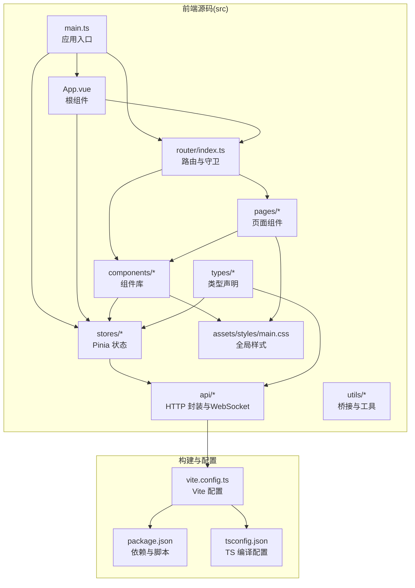
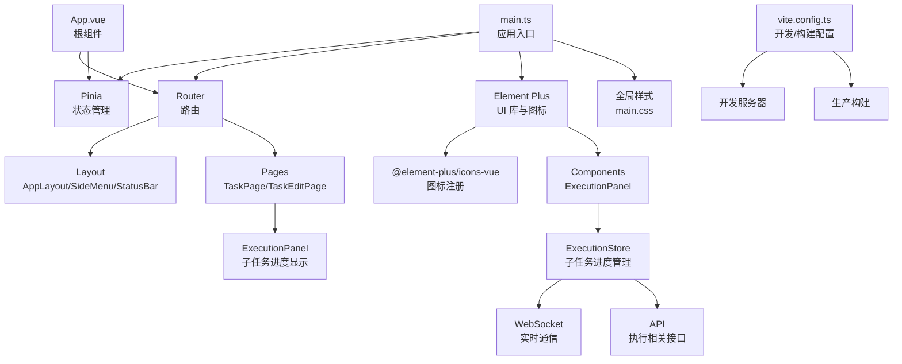
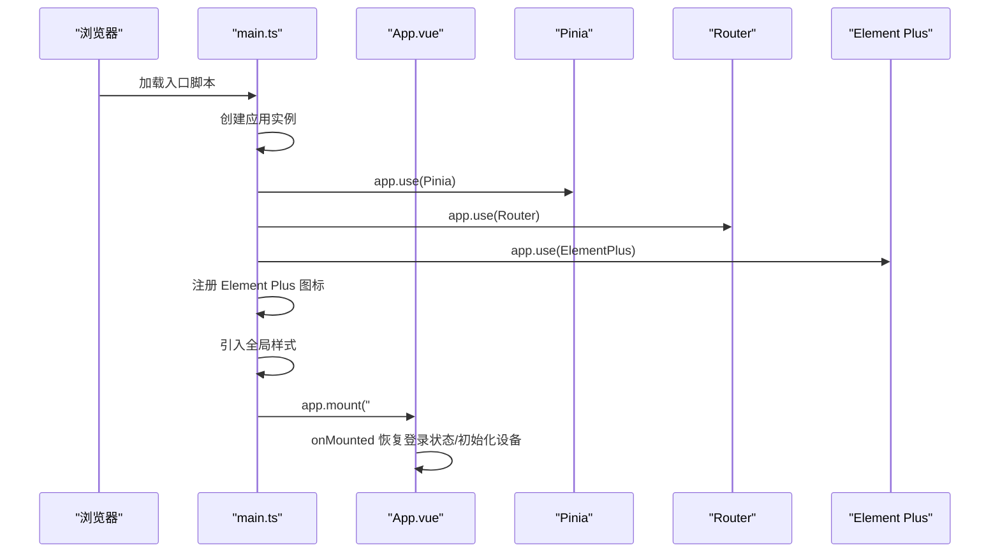
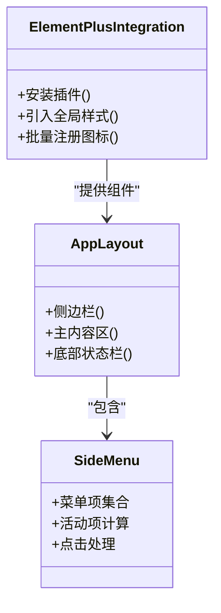
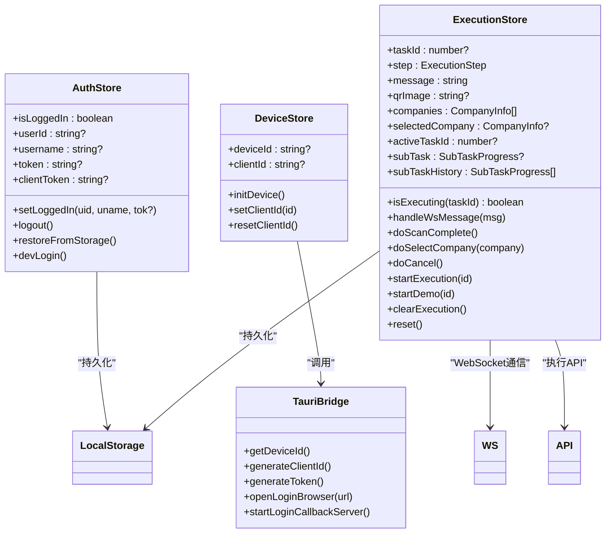
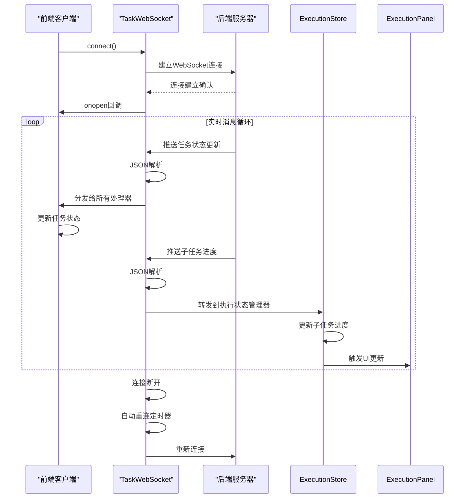
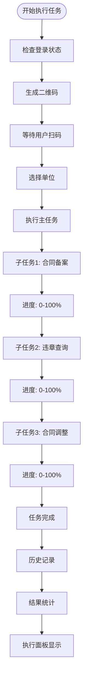
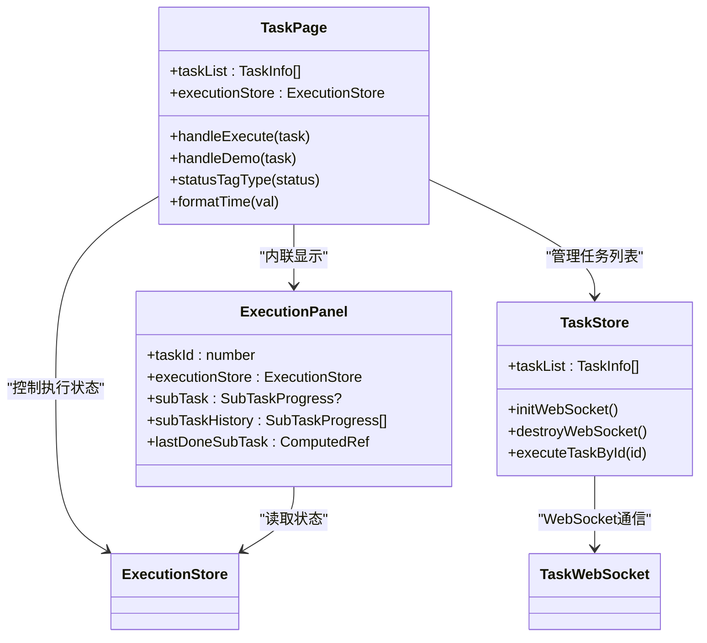
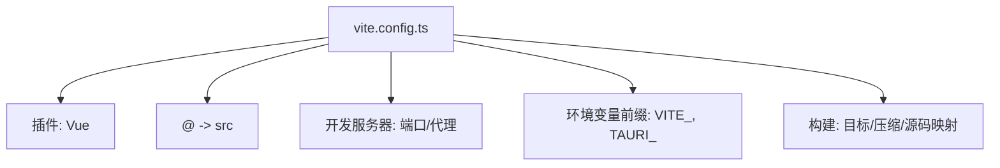
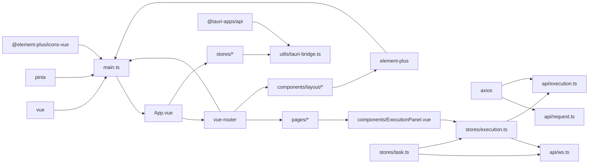

# 应用架构设计

<cite>
**本文档引用的文件**
- [main.ts](file://CCC-BrowserV4/frontend/src/main.ts)
- [App.vue](file://CCC-BrowserV4/frontend/src/App.vue)
- [router/index.ts](file://CCC-BrowserV4/frontend/src/router/index.ts)
- [stores/auth.ts](file://CCC-BrowserV4/frontend/src/stores/auth.ts)
- [stores/device.ts](file://CCC-BrowserV4/frontend/src/stores/device.ts)
- [stores/execution.ts](file://CCC-BrowserV4/frontend/src/stores/execution.ts)
- [stores/task.ts](file://CCC-BrowserV4/frontend/src/stores/task.ts)
- [components/ExecutionPanel.vue](file://CCC-BrowserV4/frontend/src/components/ExecutionPanel.vue)
- [components/layout/AppLayout.vue](file://CCC-BrowserV4/frontend/src/components/layout/AppLayout.vue)
- [components/layout/SideMenu.vue](file://CCC-BrowserV4/frontend/src/components/layout/SideMenu.vue)
- [components/layout/StatusBar.vue](file://CCC-BrowserV4/frontend/src/components/layout/StatusBar.vue)
- [assets/styles/main.css](file://CCC-BrowserV4/frontend/src/assets/styles/main.css)
- [utils/tauri-bridge.ts](file://CCC-BrowserV4/frontend/src/utils/tauri-bridge.ts)
- [api/request.ts](file://CCC-BrowserV4/frontend/src/api/request.ts)
- [api/execution.ts](file://CCC-BrowserV4/frontend/src/api/execution.ts)
- [api/ws.ts](file://CCC-BrowserV4/frontend/src/api/ws.ts)
- [types/execution.ts](file://CCC-BrowserV4/frontend/src/types/execution.ts)
- [pages/TaskPage.vue](file://CCC-BrowserV4/frontend/src/pages/TaskPage.vue)
- [pages/TaskEditPage.vue](file://CCC-BrowserV4/frontend/src/pages/TaskEditPage.vue)
- [vite.config.ts](file://CCC-BrowserV4/frontend/vite.config.ts)
- [package.json](file://CCC-BrowserV4/frontend/package.json)
- [tsconfig.json](file://CCC-BrowserV4/frontend/tsconfig.json)
</cite>

## 目录
1. [引言](#引言)
2. [项目结构](#项目结构)
3. [核心组件](#核心组件)
4. [架构总览](#架构总览)
5. [详细组件分析](#详细组件分析)
6. [依赖关系分析](#依赖关系分析)
7. [性能考虑](#性能考虑)
8. [故障排查指南](#故障排查指南)
9. [结论](#结论)
10. [附录](#附录)

## 引言
本文件面向前端应用架构设计，围绕基于 Vue3 + TypeScript 的前端工程进行系统性梳理，重点覆盖以下方面：应用初始化与启动流程、依赖注入与全局配置、Element Plus 组件库与图标系统的集成方式、Vite 构建工具的配置与开发服务器设置、CSS 全局样式与主题定制思路、路由与状态管理的协作、实时通信架构、子任务进度监控与演示模式支持，以及开发与生产环境的优化策略。文档同时提供多类可视化图示，帮助读者快速把握代码结构与数据流。

## 项目结构
前端工程采用典型的单页应用（SPA）分层组织，主要目录与职责如下：
- src/api：封装 HTTP 客户端与后端接口请求，包括执行相关 API 和 WebSocket 通信
- src/assets/styles：存放全局样式与主题变量
- src/components：组件库，包括布局组件和执行面板组件
- src/pages：页面级组件，包括任务管理和编辑页面
- src/router：路由定义与导航守卫
- src/stores：状态管理（Pinia），包括执行状态和任务状态管理
- src/types：TypeScript 类型声明
- src/utils：平台桥接与工具函数
- vite.config.ts：Vite 构建与开发服务器配置
- package.json：依赖与脚本定义
- tsconfig.json：TypeScript 编译配置

**图表来源**
- [main.ts:1-23](file://CCC-BrowserV4/frontend/src/main.ts#L1-L23)
- [router/index.ts:1-63](file://CCC-BrowserV4/frontend/src/router/index.ts#L1-L63)
- [vite.config.ts:1-35](file://CCC-BrowserV4/frontend/vite.config.ts#L1-L35)
- [package.json:1-29](file://CCC-BrowserV4/frontend/package.json#L1-L29)
- [tsconfig.json:1-27](file://CCC-BrowserV4/frontend/tsconfig.json#L1-L27)

**章节来源**
- [main.ts:1-23](file://CCC-BrowserV4/frontend/src/main.ts#L1-L23)
- [router/index.ts:1-63](file://CCC-BrowserV4/frontend/src/router/index.ts#L1-L63)
- [vite.config.ts:1-35](file://CCC-BrowserV4/frontend/vite.config.ts#L1-L35)
- [package.json:1-29](file://CCC-BrowserV4/frontend/package.json#L1-L29)
- [tsconfig.json:1-27](file://CCC-BrowserV4/frontend/tsconfig.json#L1-L27)

## 核心组件
- 应用入口与依赖注入
  - 使用应用工厂创建实例，按序安装 Pinia、路由与 Element Plus 插件；随后批量注册 Element Plus 图标组件；最后挂载根节点。
  - 全局引入 Element Plus 样式与自定义全局样式，确保组件样式与基础排版一致。
- 根组件生命周期
  - 在挂载后恢复登录状态并初始化设备信息，为后续业务逻辑提供基础数据。
- 路由与导航守卫
  - 定义登录页与受保护页面的路由规则，通过守卫控制访问权限与重定向。
- 状态管理
  - 认证状态与设备信息分别以独立 Store 管理，支持持久化与会话内状态维护。
  - 执行状态 Store 管理任务执行流程、子任务进度和 WebSocket 消息处理。
- 布局与通用组件
  - 采用 Element Plus 容器组件构建三段式布局，左侧菜单、主内容区与底部状态栏协同工作。
- 执行面板组件
  - 新增子任务进度显示面板，实时展示子任务执行状态、进度条和结果统计。
- 实时通信架构
  - 基于 WebSocket 的双向通信，支持任务状态更新、子任务进度推送和错误通知。
- 平台桥接
  - 通过 Tauri 桥接调用原生能力，如设备 ID 获取、登录回调服务器启动等。

**章节来源**
- [main.ts:1-23](file://CCC-BrowserV4/frontend/src/main.ts#L1-L23)
- [App.vue:1-21](file://CCC-BrowserV4/frontend/src/App.vue#L1-L21)
- [router/index.ts:1-63](file://CCC-BrowserV4/frontend/src/router/index.ts#L1-L63)
- [stores/auth.ts:1-79](file://CCC-BrowserV4/frontend/src/stores/auth.ts#L1-L79)
- [stores/device.ts:1-40](file://CCC-BrowserV4/frontend/src/stores/device.ts#L1-L40)
- [stores/execution.ts:1-262](file://CCC-BrowserV4/frontend/src/stores/execution.ts#L1-L262)
- [components/layout/AppLayout.vue:1-47](file://CCC-BrowserV4/frontend/src/components/layout/AppLayout.vue#L1-L47)
- [components/ExecutionPanel.vue:1-405](file://CCC-BrowserV4/frontend/src/components/ExecutionPanel.vue#L1-L405)
- [utils/tauri-bridge.ts:1-33](file://CCC-BrowserV4/frontend/src/utils/tauri-bridge.ts#L1-L33)

## 架构总览
下图展示了应用启动的关键步骤与模块交互：入口文件负责依赖注入与全局样式加载；根组件在挂载时触发状态恢复与设备初始化；路由与守卫保障访问控制；Element Plus 提供 UI 基础设施与图标系统；Vite 提供开发与构建支持；WebSocket 实现实时通信；执行面板组件展示子任务进度。

**图表来源**
- [main.ts:1-23](file://CCC-BrowserV4/frontend/src/main.ts#L1-L23)
- [App.vue:1-21](file://CCC-BrowserV4/frontend/src/App.vue#L1-L21)
- [router/index.ts:1-63](file://CCC-BrowserV4/frontend/src/router/index.ts#L1-L63)
- [components/layout/AppLayout.vue:1-47](file://CCC-BrowserV4/frontend/src/components/layout/AppLayout.vue#L1-L47)
- [components/ExecutionPanel.vue:1-405](file://CCC-BrowserV4/frontend/src/components/ExecutionPanel.vue#L1-L405)
- [stores/execution.ts:1-262](file://CCC-BrowserV4/frontend/src/stores/execution.ts#L1-L262)
- [vite.config.ts:1-35](file://CCC-BrowserV4/frontend/vite.config.ts#L1-L35)

## 详细组件分析

### 应用启动流程与依赖注入
- 启动顺序
  - 创建应用实例 → 安装 Pinia → 安装路由 → 安装 Element Plus → 注册全部图标 → 加载全局样式 → 挂载根节点。
- 关键点
  - 插件安装顺序影响全局可用性，Element Plus 必须在图标注册之前安装，以便图标组件可被识别。
  - 全局样式在应用初始化阶段引入，保证首屏渲染一致性。
- 生命周期钩子
  - 根组件挂载后执行状态恢复与设备初始化，避免异步操作阻塞首屏。

**图表来源**
- [main.ts:1-23](file://CCC-BrowserV4/frontend/src/main.ts#L1-L23)
- [App.vue:13-19](file://CCC-BrowserV4/frontend/src/App.vue#L13-L19)

**章节来源**
- [main.ts:1-23](file://CCC-BrowserV4/frontend/src/main.ts#L1-L23)
- [App.vue:13-19](file://CCC-BrowserV4/frontend/src/App.vue#L13-L19)

### Element Plus 集成与图标系统
- 组件库集成
  - 通过插件形式安装 Element Plus，并引入其全局样式文件，确保组件默认样式生效。
- 图标系统
  - 批量导入图标库并通过应用实例注册为全局组件，便于在模板中直接使用图标组件。
- 布局组件
  - 使用容器类组件构建页面骨架，结合自定义样式实现深色侧边栏与内容区域滚动。

**图表来源**
- [main.ts:3-20](file://CCC-BrowserV4/frontend/src/main.ts#L3-L20)
- [components/layout/AppLayout.vue:1-47](file://CCC-BrowserV4/frontend/src/components/layout/AppLayout.vue#L1-L47)
- [components/layout/SideMenu.vue:1-70](file://CCC-BrowserV4/frontend/src/components/layout/SideMenu.vue#L1-L70)

**章节来源**
- [main.ts:3-20](file://CCC-BrowserV4/frontend/src/main.ts#L3-L20)
- [components/layout/AppLayout.vue:1-47](file://CCC-BrowserV4/frontend/src/components/layout/AppLayout.vue#L1-L47)
- [components/layout/SideMenu.vue:1-70](file://CCC-BrowserV4/frontend/src/components/layout/SideMenu.vue#L1-L70)

### 路由与导航守卫
- 路由定义
  - 登录页与受保护页面分离，受保护页面嵌套在统一布局之下。
- 导航守卫
  - 未登录访问受保护页面跳转至登录页；已登录访问登录页跳转至首页。
- 页面懒加载
  - 页面组件采用动态导入，提升首屏加载性能。

**图表来源**
- [router/index.ts:48-60](file://CCC-BrowserV4/frontend/src/router/index.ts#L48-L60)

**章节来源**
- [router/index.ts:1-63](file://CCC-BrowserV4/frontend/src/router/index.ts#L1-L63)

### 状态管理（Pinia）
- 认证状态
  - 支持设置登录态、登出、从存储恢复登录态、开发模式虚拟登录等功能。
- 设备信息
  - 提供设备 ID 初始化、客户端 ID 设置与重置等方法，配合平台桥接能力使用。
- 执行状态管理
  - **新增**：管理任务执行流程的完整生命周期，包括登录检查、二维码扫描、单位选择、执行中状态等。
  - **新增**：子任务进度管理，包括当前子任务状态、历史记录和进度条显示。
  - **新增**：WebSocket 消息处理，实时接收任务状态更新和子任务进度。
  - **新增**：演示模式支持，模拟完整的执行流程。
- 数据持久化
  - 认证状态写入本地存储，重启后可自动恢复。

**图表来源**
- [stores/auth.ts:1-79](file://CCC-BrowserV4/frontend/src/stores/auth.ts#L1-L79)
- [stores/device.ts:1-40](file://CCC-BrowserV4/frontend/src/stores/device.ts#L1-L40)
- [stores/execution.ts:1-262](file://CCC-BrowserV4/frontend/src/stores/execution.ts#L1-L262)
- [utils/tauri-bridge.ts:1-33](file://CCC-BrowserV4/frontend/src/utils/tauri-bridge.ts#L1-L33)

**章节来源**
- [stores/auth.ts:1-79](file://CCC-BrowserV4/frontend/src/stores/auth.ts#L1-L79)
- [stores/device.ts:1-40](file://CCC-BrowserV4/frontend/src/stores/device.ts#L1-L40)
- [stores/execution.ts:1-262](file://CCC-BrowserV4/frontend/src/stores/execution.ts#L1-L262)
- [utils/tauri-bridge.ts:1-33](file://CCC-BrowserV4/frontend/src/utils/tauri-bridge.ts#L1-L33)

### 实时通信架构
- WebSocket 连接管理
  - **新增**：TaskWebSocket 类封装 WebSocket 连接、消息处理和自动重连机制。
  - **新增**：支持 HTTP/HTTPS 协议自动切换，确保连接稳定性。
  - **新增**：指数退避重连策略，避免频繁重试造成资源浪费。
- 消息处理机制
  - **新增**：统一的消息格式，包含类型和数据字段。
  - **新增**：多处理器支持，消息可同时分发给多个监听器。
  - **新增**：JSON 解析错误处理，确保系统稳定性。
- 任务状态同步
  - **新增**：任务状态更新消息处理，实时更新任务列表中的状态信息。
  - **新增**：执行状态转发，将 WebSocket 消息同时传递给执行状态管理器。

**图表来源**
- [api/ws.ts:1-88](file://CCC-BrowserV4/frontend/src/api/ws.ts#L1-L88)
- [stores/task.ts:57-80](file://CCC-BrowserV4/frontend/src/stores/task.ts#L57-L80)
- [stores/execution.ts:34-97](file://CCC-BrowserV4/frontend/src/stores/execution.ts#L34-L97)

**章节来源**
- [api/ws.ts:1-88](file://CCC-BrowserV4/frontend/src/api/ws.ts#L1-L88)
- [stores/task.ts:57-80](file://CCC-BrowserV4/frontend/src/stores/task.ts#L57-L80)
- [stores/execution.ts:34-97](file://CCC-BrowserV4/frontend/src/stores/execution.ts#L34-L97)

### 子任务进度显示系统
- 子任务状态管理
  - **新增**：SubTaskProgress 接口定义子任务的基本属性，包括类型、步骤、消息、进度和数据。
  - **新增**：当前子任务状态和历史记录分离，支持查看已完成子任务的结果统计。
  - **新增**：子任务进度条组件，使用 Element Plus 的进度条组件展示实时进度。
- 执行面板组件
  - **新增**：子任务进度面板，显示当前执行的子任务类型、步骤标签和进度条。
  - **新增**：子任务结果汇总，展示已完成子任务的成功/失败统计。
  - **新增**：响应式布局，适配不同屏幕尺寸和子任务数量。
- 演示模式支持
  - **新增**：完整的子任务进度模拟，包括多个子任务的执行序列和进度变化。
  - **新增**：子任务历史记录生成，模拟真实执行场景中的结果统计。

**图表来源**
- [components/ExecutionPanel.vue:86-118](file://CCC-BrowserV4/frontend/src/components/ExecutionPanel.vue#L86-L118)
- [stores/execution.ts:6-27](file://CCC-BrowserV4/frontend/src/stores/execution.ts#L6-L27)
- [stores/execution.ts:196-210](file://CCC-BrowserV4/frontend/src/stores/execution.ts#L196-L210)

**章节来源**
- [components/ExecutionPanel.vue:86-118](file://CCC-BrowserV4/frontend/src/components/ExecutionPanel.vue#L86-L118)
- [stores/execution.ts:6-27](file://CCC-BrowserV4/frontend/src/stores/execution.ts#L6-L27)
- [stores/execution.ts:196-210](file://CCC-BrowserV4/frontend/src/stores/execution.ts#L196-L210)

### 页面组件与交互流程
- 任务页面组件
  - **新增**：内联执行面板，当任务正在执行时显示详细的执行状态和子任务进度。
  - **新增**：执行按钮状态管理，根据执行状态禁用或启用按钮。
  - **新增**：任务状态标签，实时显示任务的执行状态和进度。
- 执行面板集成
  - **新增**：ExecutionPanel 组件与 TaskPage 的深度集成，支持实时状态更新。
  - **新增**：任务执行控制，支持启动、取消和演示模式。
  - **新增**：状态同步机制，确保执行面板与任务列表状态一致。

**图表来源**
- [pages/TaskPage.vue:112-117](file://CCC-BrowserV4/frontend/src/pages/TaskPage.vue#L112-L117)
- [pages/TaskPage.vue:255-267](file://CCC-BrowserV4/frontend/src/pages/TaskPage.vue#L255-L267)
- [components/ExecutionPanel.vue:143-171](file://CCC-BrowserV4/frontend/src/components/ExecutionPanel.vue#L143-L171)

**章节来源**
- [pages/TaskPage.vue:112-117](file://CCC-BrowserV4/frontend/src/pages/TaskPage.vue#L112-L117)
- [pages/TaskPage.vue:255-267](file://CCC-BrowserV4/frontend/src/pages/TaskPage.vue#L255-L267)
- [components/ExecutionPanel.vue:143-171](file://CCC-BrowserV4/frontend/src/components/ExecutionPanel.vue#L143-L171)

### Vite 配置与开发服务器
- 插件与别名
  - 启用 Vue 插件，配置路径别名为 @，便于统一导入。
- 开发服务器
  - 固定端口与严格端口策略，代理 /api 到后端服务，/ws 代理到 WebSocket 服务。
- 环境变量前缀
  - 显式声明 VITE_ 与 TAURI_ 前缀，确保运行时可见。
- 构建优化
  - 目标浏览器与 ES 版本，生产构建默认启用压缩与源码映射（可通过环境变量切换）。

**图表来源**
- [vite.config.ts:5-34](file://CCC-BrowserV4/frontend/vite.config.ts#L5-L34)

**章节来源**
- [vite.config.ts:1-35](file://CCC-BrowserV4/frontend/vite.config.ts#L1-L35)

### CSS 全局样式与主题定制
- 全局样式
  - 统一重置内外边距、盒模型，设置字体族，提供基础滚动条样式。
- 布局组件样式
  - 侧边栏深色背景、主内容区背景与滚动行为、底部状态栏样式等。
- 执行面板样式
  - **新增**：子任务进度面板的专用样式，包括进度条、标签和统计信息的视觉设计。
  - **新增**：响应式布局样式，适配不同屏幕尺寸和子任务数量。
  - **新增**：动画效果，包括脉冲动画和进度条的流畅过渡。
- 主题定制建议
  - 可通过 CSS 变量或 Element Plus 的主题变量覆盖实现主题切换；当前仓库未包含主题变量文件，可在新增样式文件中集中管理。

**章节来源**
- [assets/styles/main.css:1-27](file://CCC-BrowserV4/frontend/src/assets/styles/main.css#L1-L27)
- [components/layout/AppLayout.vue:28-46](file://CCC-BrowserV4/frontend/src/components/layout/AppLayout.vue#L28-L46)
- [components/layout/StatusBar.vue:33-69](file://CCC-BrowserV4/frontend/src/components/layout/StatusBar.vue#L33-L69)
- [components/ExecutionPanel.vue:173-404](file://CCC-BrowserV4/frontend/src/components/ExecutionPanel.vue#L173-L404)

### API 请求与网络层
- 基础配置
  - 以 axios 创建实例，设置基础路径与超时时间。
- 响应拦截
  - 统一提取响应数据，错误日志输出并透传异常。
- 执行相关 API
  - **新增**：扫码完成通知接口，用于通知后端用户已完成扫码。
  - **新增**：单位选择接口，用于通知后端用户选择了特定单位。
  - **新增**：取消执行接口，用于中断正在进行的任务执行。
- WebSocket 通信
  - **新增**：WebSocket 连接管理，支持自动重连和消息处理。
  - **新增**：消息格式标准化，确保前后端通信的一致性。

**章节来源**
- [api/request.ts:1-18](file://CCC-BrowserV4/frontend/src/api/request.ts#L1-L18)
- [api/execution.ts:1-20](file://CCC-BrowserV4/frontend/src/api/execution.ts#L1-L20)
- [api/ws.ts:1-88](file://CCC-BrowserV4/frontend/src/api/ws.ts#L1-L88)
- [vite.config.ts:16-26](file://CCC-BrowserV4/frontend/vite.config.ts#L16-L26)

## 依赖关系分析
- 外部依赖
  - Vue3、Vue Router、Pinia、Element Plus、Axios、@tauri-apps/api 等。
- 内部依赖
  - main.ts 作为入口聚合各模块；App.vue 聚合状态与路由；layout 组件依赖 Element Plus；store 依赖 tauri-bridge；执行面板依赖执行状态管理器。
- 实时通信依赖
  - **新增**：WebSocket 通信依赖 axios 进行 HTTP 请求，执行状态管理器依赖 WebSocket 进行实时通信。
  - **新增**：任务存储依赖 WebSocket 进行任务状态同步，执行面板依赖执行状态管理器进行 UI 更新。
- 构建与类型
  - Vite 与 TypeScript 配置共同保障开发体验与编译质量。

**图表来源**
- [package.json:12-27](file://CCC-BrowserV4/frontend/package.json#L12-L27)
- [main.ts:1-8](file://CCC-BrowserV4/frontend/src/main.ts#L1-L8)
- [api/request.ts:1-18](file://CCC-BrowserV4/frontend/src/api/request.ts#L1-L18)
- [api/execution.ts:1-20](file://CCC-BrowserV4/frontend/src/api/execution.ts#L1-L20)
- [api/ws.ts:1-88](file://CCC-BrowserV4/frontend/src/api/ws.ts#L1-L88)
- [utils/tauri-bridge.ts:1-33](file://CCC-BrowserV4/frontend/src/utils/tauri-bridge.ts#L1-L33)

**章节来源**
- [package.json:1-29](file://CCC-BrowserV4/frontend/package.json#L1-L29)
- [main.ts:1-8](file://CCC-BrowserV4/frontend/src/main.ts#L1-L8)

## 性能考虑
- 代码分割与懒加载
  - 页面组件采用动态导入，减少首屏包体。
- 构建目标与压缩
  - 生产构建默认启用压缩，可按需开启源码映射以平衡调试与体积。
- 资源加载
  - 全局样式与 Element Plus 样式按需引入，避免重复加载。
- 实时通信优化
  - **新增**：WebSocket 连接池管理，避免重复创建连接。
  - **新增**：消息去重机制，防止重复消息导致的 UI 闪烁。
  - **新增**：自动重连策略，确保网络波动时的稳定性。
- 开发体验
  - 固定端口与代理配置降低联调成本，提高迭代效率。

## 故障排查指南
- 登录状态无法恢复
  - 检查本地存储键值是否存在与格式正确；确认恢复逻辑异常捕获与日志输出。
- 设备信息未初始化
  - 确认 Tauri 桥接命令可用，设备 ID 获取调用成功。
- 路由跳转异常
  - 核对导航守卫逻辑与目标路由元信息配置。
- WebSocket 连接问题
  - **新增**：检查 WebSocket 服务器是否正常运行，确认协议（ws/wss）与端口配置正确。
  - **新增**：查看浏览器开发者工具的 Network 面板，确认 WebSocket 连接状态和消息传输。
  - **新增**：检查自动重连机制是否正常工作，确认重连延迟和最大重试次数设置。
- 子任务进度显示异常
  - **新增**：检查子任务状态数据格式是否正确，确认进度条组件的百分比值范围。
  - **新增**：验证子任务历史记录是否正确生成，确认已完成子任务的统计信息。
- 开发代理失效
  - 检查代理目标地址与协议（HTTP/WS），确保后端服务已启动。

**章节来源**
- [stores/auth.ts:44-58](file://CCC-BrowserV4/frontend/src/stores/auth.ts#L44-L58)
- [utils/tauri-bridge.ts:10](file://CCC-BrowserV4/frontend/src/utils/tauri-bridge.ts#L10)
- [router/index.ts:48-60](file://CCC-BrowserV4/frontend/src/router/index.ts#L48-L60)
- [api/ws.ts:20-56](file://CCC-BrowserV4/frontend/src/api/ws.ts#L20-L56)
- [stores/execution.ts:66-83](file://CCC-BrowserV4/frontend/src/stores/execution.ts#L66-L83)
- [vite.config.ts:16-26](file://CCC-BrowserV4/frontend/vite.config.ts#L16-L26)

## 结论
该前端应用以 Vue3 + TypeScript 为基础，结合 Pinia 实现状态管理，Element Plus 提供 UI 基础设施与图标系统，Vite 提供高效的开发与构建支持。**最新更新**增加了完整的实时通信架构，包括 WebSocket 连接管理、子任务进度显示和演示模式支持。通过清晰的入口初始化流程、路由守卫与状态恢复机制，以及新增的子任务进度监控系统，实现了良好的用户体验与可维护性。后续可在主题变量、国际化与测试体系方面进一步完善。

## 附录
- 开发与构建脚本
  - 开发：启动 Vite 开发服务器
  - 构建：先类型检查再打包
  - 预览：本地预览构建产物
  - Tauri：集成原生能力
- TypeScript 配置要点
  - 模块解析策略、路径映射、严格模式与无副作用编译选项
- 实时通信配置
  - **新增**：WebSocket 自动重连机制，支持指数退避策略
  - **新增**：消息格式标准化，确保前后端通信一致性
  - **新增**：多处理器支持，消息可同时分发给多个监听器

**章节来源**
- [package.json:6-11](file://CCC-BrowserV4/frontend/package.json#L6-L11)
- [tsconfig.json:2-26](file://CCC-BrowserV4/frontend/tsconfig.json#L2-L26)
- [api/ws.ts:58-64](file://CCC-BrowserV4/frontend/src/api/ws.ts#L58-L64)
- [stores/execution.ts:34-97](file://CCC-BrowserV4/frontend/src/stores/execution.ts#L34-L97)