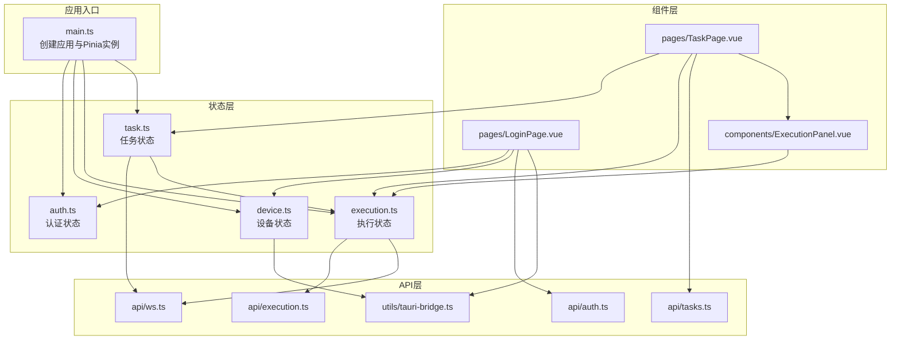
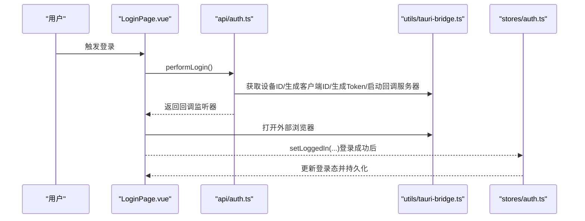
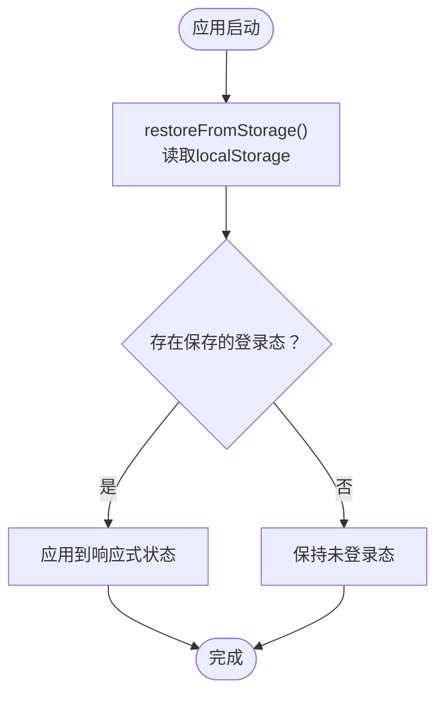
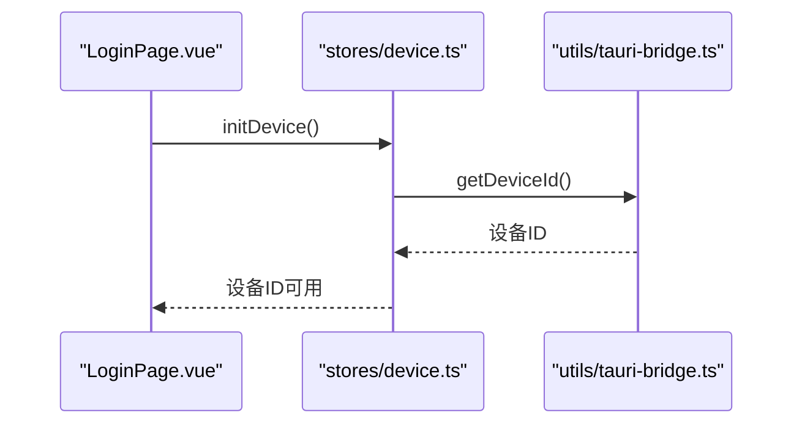
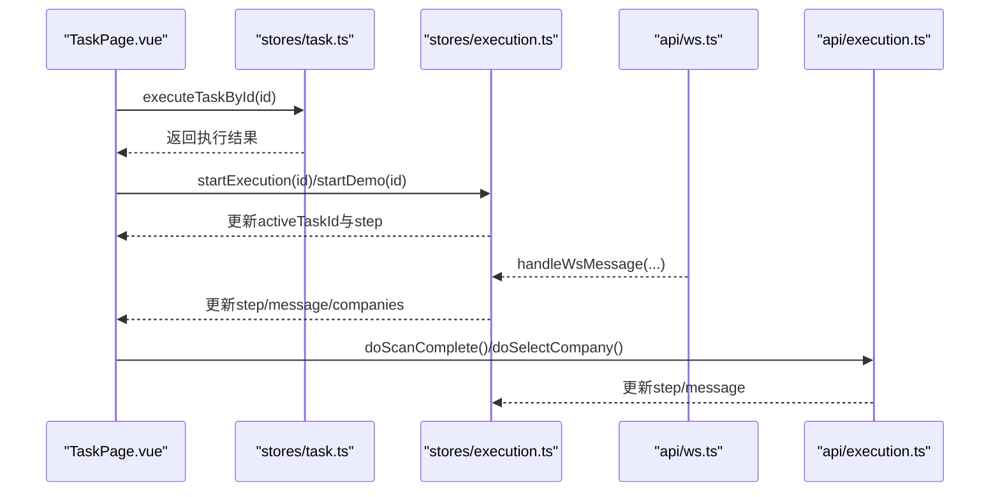
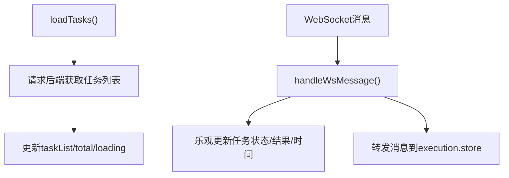
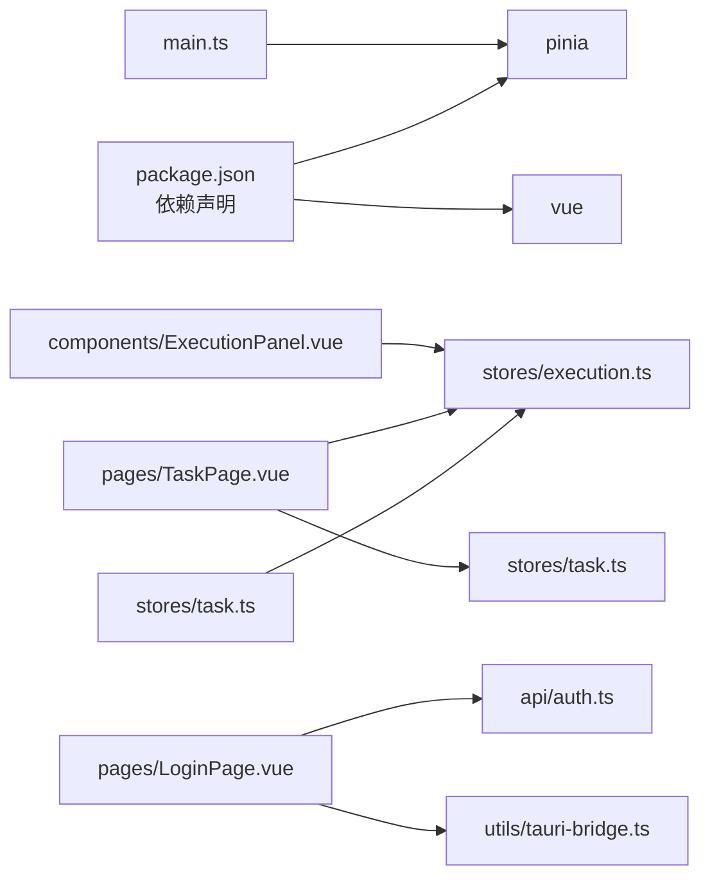

# 状态管理

<cite>
**本文引用的文件**
- [auth.ts](file://CCC-BrowserV4/frontend/src/stores/auth.ts)
- [device.ts](file://CCC-BrowserV4/frontend/src/stores/device.ts)
- [execution.ts](file://CCC-BrowserV4/frontend/src/stores/execution.ts)
- [task.ts](file://CCC-BrowserV4/frontend/src/stores/task.ts)
- [main.ts](file://CCC-BrowserV4/frontend/src/main.ts)
- [index.ts](file://CCC-BrowserV4/frontend/src/types/index.ts)
- [execution.ts](file://CCC-BrowserV4/frontend/src/types/execution.ts)
- [tasks.ts](file://CCC-BrowserV4/frontend/src/api/tasks.ts)
- [execution.ts](file://CCC-BrowserV4/frontend/src/api/execution.ts)
- [LoginPage.vue](file://CCC-BrowserV4/frontend/src/pages/LoginPage.vue)
- [TaskPage.vue](file://CCC-BrowserV4/frontend/src/pages/TaskPage.vue)
- [ExecutionPanel.vue](file://CCC-BrowserV4/frontend/src/components/ExecutionPanel.vue)
- [tauri-bridge.ts](file://CCC-BrowserV4/frontend/src/utils/tauri-bridge.ts)
- [ws.ts](file://CCC-BrowserV4/frontend/src/api/ws.ts)
- [auth.ts](file://CCC-BrowserV4/frontend/src/api/auth.ts)
- [package.json](file://CCC-BrowserV4/frontend/package.json)
</cite>

## 目录
1. [简介](#简介)
2. [项目结构](#项目结构)
3. [核心组件](#核心组件)
4. [架构总览](#架构总览)
5. [详细组件分析](#详细组件分析)
6. [依赖关系分析](#依赖关系分析)
7. [性能考量](#性能考量)
8. [故障排查指南](#故障排查指南)
9. [结论](#结论)
10. [附录](#附录)

## 简介
本文件系统性梳理前端基于 Pinia 的状态管理体系，涵盖认证(auth)、设备(device)、执行(execution)与任务(task)四大 Store 的职责边界、数据流与副作用处理；解释响应式更新机制、持久化策略与本地存储实现；给出最佳实践与调试优化建议，并通过图示展示关键交互流程。

## 项目结构
前端采用 Vue 3 + Pinia 架构，状态集中在 stores 目录下，配合 API 层(ws、请求封装)与组件层进行双向绑定与事件驱动。入口在 main.ts 中初始化 Pinia 并挂载应用。

图表来源
- [main.ts:1-23](file://CCC-BrowserV4/frontend/src/main.ts#L1-L23)
- [auth.ts:1-79](file://CCC-BrowserV4/frontend/src/stores/auth.ts#L1-L79)
- [device.ts:1-40](file://CCC-BrowserV4/frontend/src/stores/device.ts#L1-L40)
- [execution.ts:1-229](file://CCC-BrowserV4/frontend/src/stores/execution.ts#L1-L229)
- [task.ts:1-84](file://CCC-BrowserV4/frontend/src/stores/task.ts#L1-L84)
- [LoginPage.vue:1-228](file://CCC-BrowserV4/frontend/src/pages/LoginPage.vue#L1-L228)
- [TaskPage.vue:1-428](file://CCC-BrowserV4/frontend/src/pages/TaskPage.vue#L1-L428)
- [ExecutionPanel.vue:1-322](file://CCC-BrowserV4/frontend/src/components/ExecutionPanel.vue#L1-L322)
- [tasks.ts:1-41](file://CCC-BrowserV4/frontend/src/api/tasks.ts#L1-L41)
- [execution.ts:1-20](file://CCC-BrowserV4/frontend/src/api/execution.ts#L1-L20)
- [ws.ts:1-88](file://CCC-BrowserV4/frontend/src/api/ws.ts#L1-L88)
- [auth.ts:1-67](file://CCC-BrowserV4/frontend/src/api/auth.ts#L1-L67)
- [tauri-bridge.ts:1-33](file://CCC-BrowserV4/frontend/src/utils/tauri-bridge.ts#L1-L33)

章节来源
- [main.ts:1-23](file://CCC-BrowserV4/frontend/src/main.ts#L1-L23)
- [package.json:1-29](file://CCC-BrowserV4/frontend/package.json#L1-L29)

## 核心组件
- 认证状态(auth)
  - 负责登录态、用户信息、token 等；支持本地持久化与恢复；提供开发模式虚拟登录。
- 设备状态(device)
  - 负责设备唯一标识与客户端会话标识；通过 Tauri 桥接获取设备信息。
- 执行状态(execution)
  - 负责任务执行步骤、消息、二维码、公司列表等；处理 WebSocket 推送并驱动 UI 流程；支持演示模式。
- 任务状态(task)
  - 负责任务列表、分页、加载状态；维护 WebSocket 订阅并将消息转发至执行状态；协调执行控制。

章节来源
- [auth.ts:1-79](file://CCC-BrowserV4/frontend/src/stores/auth.ts#L1-L79)
- [device.ts:1-40](file://CCC-BrowserV4/frontend/src/stores/device.ts#L1-L40)
- [execution.ts:1-229](file://CCC-BrowserV4/frontend/src/stores/execution.ts#L1-L229)
- [task.ts:1-84](file://CCC-BrowserV4/frontend/src/stores/task.ts#L1-L84)

## 架构总览
Pinia 在 main.ts 中全局注册，各页面组件通过组合式 API 使用对应 Store。任务列表页订阅 WebSocket，接收执行状态变更并通过执行 Store 驱动内联执行面板。

图表来源
- [LoginPage.vue:93-169](file://CCC-BrowserV4/frontend/src/pages/LoginPage.vue#L93-L169)
- [auth.ts:25-66](file://CCC-BrowserV4/frontend/src/api/auth.ts#L25-L66)
- [tauri-bridge.ts:6-32](file://CCC-BrowserV4/frontend/src/utils/tauri-bridge.ts#L6-L32)
- [auth.ts:15-39](file://CCC-BrowserV4/frontend/src/stores/auth.ts#L15-L39)

## 详细组件分析

### 认证状态管理（auth）
- 数据模型
  - 登录态标志、用户ID、用户名、服务端session token、客户端生成的登录token。
- 关键行为
  - 设置登录态并持久化到 localStorage。
  - 登出清除状态并移除持久化。
  - 从 localStorage 恢复登录态。
  - 开发模式虚拟登录。
- 响应式与副作用
  - 通过 ref 声明响应式字段；setLoggedIn 同步写入 localStorage；logout 移除条目；restoreFromStorage 在应用启动时读取。
- 最佳实践
  - 将敏感 token 分离存储，避免与非敏感信息混存。
  - 在路由守卫或应用启动处调用 restoreFromStorage。
  - 登出时统一清理，防止状态残留。

图表来源
- [auth.ts:44-58](file://CCC-BrowserV4/frontend/src/stores/auth.ts#L44-L58)

章节来源
- [auth.ts:1-79](file://CCC-BrowserV4/frontend/src/stores/auth.ts#L1-L79)
- [index.ts:1-42](file://CCC-BrowserV4/frontend/src/types/index.ts#L1-L42)

### 设备状态管理（device）
- 数据模型
  - 设备唯一标识（持久化）、客户端会话标识。
- 关键行为
  - 初始化设备信息（首次访问时通过 Tauri 桥接获取）。
  - 设置/重置客户端会话标识。
- 与认证协作
  - 登录页在发起登录前先初始化设备信息，确保携带正确的设备ID。

图表来源
- [LoginPage.vue:79-81](file://CCC-BrowserV4/frontend/src/pages/LoginPage.vue#L79-L81)
- [device.ts:12-16](file://CCC-BrowserV4/frontend/src/stores/device.ts#L12-L16)
- [tauri-bridge.ts:10](file://CCC-BrowserV4/frontend/src/utils/tauri-bridge.ts#L10)

章节来源
- [device.ts:1-40](file://CCC-BrowserV4/frontend/src/stores/device.ts#L1-L40)
- [tauri-bridge.ts:1-33](file://CCC-BrowserV4/frontend/src/utils/tauri-bridge.ts#L1-L33)

### 执行状态管理（execution）
- 数据模型
  - 任务ID、执行步骤、提示消息、二维码图片、可选公司列表、当前选择、活动任务ID、演示模式开关。
- 执行步骤与消息映射
  - 通过 WebSocket 消息驱动步骤流转，如二维码扫描、选择单位、执行中、保活、完成/失败/取消。
- 关键行为
  - 处理 WebSocket 消息并更新状态。
  - 扫码完成/选择单位/取消执行的后端通知。
  - 演示模式下的模拟流程与定时器。
  - 清理与重置状态。
- 与任务状态协作
  - 任务页执行按钮调用后端执行接口后，调用执行 Store 的 startExecution 或 startDemo，开启内联执行面板。

图表来源
- [TaskPage.vue:255-267](file://CCC-BrowserV4/frontend/src/pages/TaskPage.vue#L255-L267)
- [task.ts:57-80](file://CCC-BrowserV4/frontend/src/stores/task.ts#L57-L80)
- [execution.ts:22-67](file://CCC-BrowserV4/frontend/src/stores/execution.ts#L22-L67)
- [execution.ts:69-120](file://CCC-BrowserV4/frontend/src/stores/execution.ts#L69-L120)
- [execution.ts:134-180](file://CCC-BrowserV4/frontend/src/stores/execution.ts#L134-L180)
- [execution.ts:206-222](file://CCC-BrowserV4/frontend/src/stores/execution.ts#L206-L222)
- [ws.ts:15-56](file://CCC-BrowserV4/frontend/src/api/ws.ts#L15-L56)

章节来源
- [execution.ts:1-229](file://CCC-BrowserV4/frontend/src/stores/execution.ts#L1-L229)
- [execution.ts:1-17](file://CCC-BrowserV4/frontend/src/types/execution.ts#L1-L17)
- [ExecutionPanel.vue:1-322](file://CCC-BrowserV4/frontend/src/components/ExecutionPanel.vue#L1-L322)

### 任务状态管理（task）
- 数据模型
  - 任务列表、总数、加载状态。
- 关键行为
  - 加载任务列表（关键词、状态、分页参数）。
  - CRUD 任务与执行任务。
  - 初始化/销毁 WebSocket 订阅。
  - 处理任务状态更新消息并乐观更新列表。
  - 将所有消息转发给执行 Store，保证执行面板同步更新。
- 与执行状态协作
  - 通过转发消息，使执行 Store 能根据 WebSocket 推送更新执行步骤与消息。

图表来源
- [task.ts:13-24](file://CCC-BrowserV4/frontend/src/stores/task.ts#L13-L24)
- [task.ts:67-80](file://CCC-BrowserV4/frontend/src/stores/task.ts#L67-L80)
- [tasks.ts:5-34](file://CCC-BrowserV4/frontend/src/api/tasks.ts#L5-L34)

章节来源
- [task.ts:1-84](file://CCC-BrowserV4/frontend/src/stores/task.ts#L1-L84)
- [tasks.ts:1-41](file://CCC-BrowserV4/frontend/src/api/tasks.ts#L1-L41)
- [ws.ts:1-88](file://CCC-BrowserV4/frontend/src/api/ws.ts#L1-L88)

## 依赖关系分析
- Store 间耦合
  - task.store 在消息处理中主动获取 execution.store 并调用其 handleWsMessage，形成“单向转发”，降低直接耦合风险。
- 外部依赖
  - Pinia 全局注册于 main.ts。
  - Tauri 桥接用于设备与登录回调。
  - WebSocket 用于实时推送任务与执行状态。
- 类型约束
  - types 下定义了认证、设备、任务与执行状态的数据结构，确保 Store 与组件契约清晰。

图表来源
- [package.json:12-19](file://CCC-BrowserV4/frontend/package.json#L12-L19)
- [main.ts:11](file://CCC-BrowserV4/frontend/src/main.ts#L11)
- [task.ts:6-7](file://CCC-BrowserV4/frontend/src/stores/task.ts#L6-L7)
- [LoginPage.vue:63-69](file://CCC-BrowserV4/frontend/src/pages/LoginPage.vue#L63-L69)
- [TaskPage.vue:144-150](file://CCC-BrowserV4/frontend/src/pages/TaskPage.vue#L144-L150)
- [ExecutionPanel.vue:113](file://CCC-BrowserV4/frontend/src/components/ExecutionPanel.vue#L113)

章节来源
- [package.json:1-29](file://CCC-BrowserV4/frontend/package.json#L1-L29)
- [main.ts:1-23](file://CCC-BrowserV4/frontend/src/main.ts#L1-L23)

## 性能考量
- 响应式粒度
  - 将执行面板的状态拆分为 step/message/companies 等细粒度 ref，减少无关渲染。
- 乐观更新
  - 执行按钮点击后立即乐观更新任务状态，提升交互感知；若后端失败再回滚。
- WebSocket 连接稳定性
  - 自带断线重连与消息解析保护，避免主线程阻塞。
- 演示模式
  - 在后端不可用时启用演示模式，避免阻塞用户操作。

章节来源
- [TaskPage.vue:255-267](file://CCC-BrowserV4/frontend/src/pages/TaskPage.vue#L255-L267)
- [ws.ts:58-64](file://CCC-BrowserV4/frontend/src/api/ws.ts#L58-L64)
- [execution.ts:134-180](file://CCC-BrowserV4/frontend/src/stores/execution.ts#L134-L180)

## 故障排查指南
- 登录态不生效
  - 检查 localStorage 中是否存在 auth_state；确认 setLoggedIn 是否被调用；确认 restoreFromStorage 是否在应用启动时执行。
- 设备ID为空
  - 确认 LoginPage 在 mounted 中调用了 initDevice；检查 Tauri 桥接命令是否可用。
- 执行面板无更新
  - 确认 TaskPage 已初始化 WebSocket 并订阅消息；确认 task.store.handleWsMessage 已转发消息到 execution.store。
- WebSocket 断开
  - 查看 ws.ts 的日志与重连逻辑；确认服务端地址与协议匹配（ws/wss）。
- 演示模式异常
  - 确认 startDemo 被调用且 isDemo 为 true；检查模拟流程中的定时器与状态切换。

章节来源
- [auth.ts:44-58](file://CCC-BrowserV4/frontend/src/stores/auth.ts#L44-L58)
- [LoginPage.vue:79-81](file://CCC-BrowserV4/frontend/src/pages/LoginPage.vue#L79-L81)
- [TaskPage.vue:158-165](file://CCC-BrowserV4/frontend/src/pages/TaskPage.vue#L158-L165)
- [task.ts:57-80](file://CCC-BrowserV4/frontend/src/stores/task.ts#L57-L80)
- [ws.ts:20-56](file://CCC-BrowserV4/frontend/src/api/ws.ts#L20-L56)
- [execution.ts:134-180](file://CCC-BrowserV4/frontend/src/stores/execution.ts#L134-L180)

## 结论
本项目以 Pinia 为核心构建了清晰的状态分层：认证与设备负责基础身份与设备信息，任务与执行负责业务闭环与实时交互。通过类型约束、消息转发与演示模式，系统在复杂交互场景下仍保持可维护性与可用性。建议持续完善持久化策略与调试工具链，进一步提升可观测性与可测试性。

## 附录
- 状态持久化与本地存储
  - 认证状态：setLoggedIn 与 logout 对 localStorage 进行写入与清理；应用启动时 restoreFromStorage 读取并恢复。
  - 设备状态：通过 Tauri 桥接获取设备ID，作为登录与任务关联的基础标识。
- 最佳实践清单
  - 状态设计原则：单一职责、细粒度响应式、明确的生命周期（初始化/清理）。
  - Action 编写规范：集中处理副作用（API/WS/Tauri），避免在组件中直接操作 Store。
  - 组件集成模式：在页面级组件中聚合 Store，通过 props/事件传递到子组件（如 ExecutionPanel）。
  - 调试与性能：利用浏览器 DevTools 的 Vue 插件观察 Store 变更；对高频事件使用节流/防抖；对长列表使用虚拟滚动与懒加载。

章节来源
- [auth.ts:21-39](file://CCC-BrowserV4/frontend/src/stores/auth.ts#L21-L39)
- [auth.ts:44-58](file://CCC-BrowserV4/frontend/src/stores/auth.ts#L44-L58)
- [device.ts:12-16](file://CCC-BrowserV4/frontend/src/stores/device.ts#L12-L16)
- [TaskPage.vue:158-165](file://CCC-BrowserV4/frontend/src/pages/TaskPage.vue#L158-L165)
- [ExecutionPanel.vue:113](file://CCC-BrowserV4/frontend/src/components/ExecutionPanel.vue#L113)