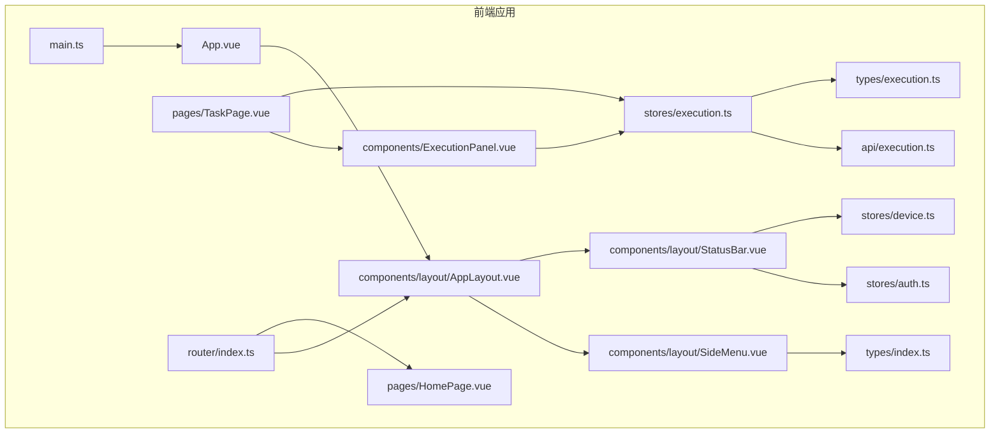
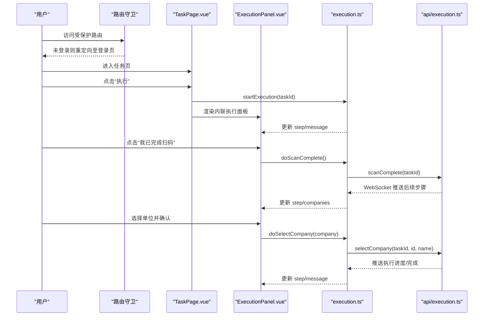
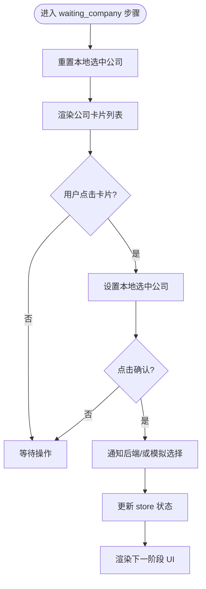
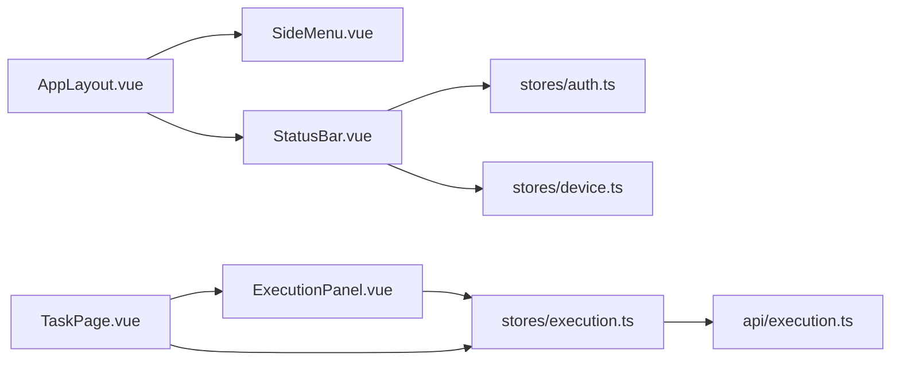

# 组件系统

<cite>
**本文引用的文件列表**
- [AppLayout.vue](file://CCC-BrowserV4/frontend/src/components/layout/AppLayout.vue)
- [SideMenu.vue](file://CCC-BrowserV4/frontend/src/components/layout/SideMenu.vue)
- [StatusBar.vue](file://CCC-BrowserV4/frontend/src/components/layout/StatusBar.vue)
- [ExecutionPanel.vue](file://CCC-BrowserV4/frontend/src/components/ExecutionPanel.vue)
- [execution.ts](file://CCC-BrowserV4/frontend/src/stores/execution.ts)
- [auth.ts](file://CCC-BrowserV4/frontend/src/stores/auth.ts)
- [device.ts](file://CCC-BrowserV4/frontend/src/stores/device.ts)
- [execution.ts](file://CCC-BrowserV4/frontend/src/types/execution.ts)
- [index.ts](file://CCC-BrowserV4/frontend/src/types/index.ts)
- [TaskPage.vue](file://CCC-BrowserV4/frontend/src/pages/TaskPage.vue)
- [HomePage.vue](file://CCC-BrowserV4/frontend/src/pages/HomePage.vue)
- [index.ts](file://CCC-BrowserV4/frontend/src/router/index.ts)
- [execution.ts](file://CCC-BrowserV4/frontend/src/api/execution.ts)
- [main.ts](file://CCC-BrowserV4/frontend/src/main.ts)
</cite>

## 目录
1. [简介](#简介)
2. [项目结构](#项目结构)
3. [核心组件](#核心组件)
4. [架构总览](#架构总览)
5. [组件详解](#组件详解)
6. [依赖关系分析](#依赖关系分析)
7. [性能考量](#性能考量)
8. [故障排查指南](#故障排查指南)
9. [结论](#结论)
10. [附录](#附录)

## 简介
本文件面向前端组件系统，聚焦于布局组件与执行面板的架构设计与实现细节，涵盖：
- 布局组件：AppLayout 主容器、SideMenu 侧边菜单、StatusBar 状态栏
- 执行面板：ExecutionPanel 的组件化设计与状态管理
- 组件间通信：props 传递、事件触发、插槽使用
- 复用性与可扩展性：设计原则与最佳实践
- 样式定制与响应式：实现方法与建议

## 项目结构
前端采用基于 Vue 3 + Pinia + Element Plus 的单页应用架构，路由采用嵌套路由，布局通过 AppLayout 将侧边菜单、主内容区与状态栏组合；执行面板作为内联组件在任务卡片中按需渲染。

图表来源
- [main.ts:1-23](file://CCC-BrowserV4/frontend/src/main.ts#L1-L23)
- [AppLayout.vue:1-47](file://CCC-BrowserV4/frontend/src/components/layout/AppLayout.vue#L1-L47)
- [SideMenu.vue:1-70](file://CCC-BrowserV4/frontend/src/components/layout/SideMenu.vue#L1-L70)
- [StatusBar.vue:1-70](file://CCC-BrowserV4/frontend/src/components/layout/StatusBar.vue#L1-L70)
- [ExecutionPanel.vue:1-322](file://CCC-BrowserV4/frontend/src/components/ExecutionPanel.vue#L1-L322)
- [TaskPage.vue:1-428](file://CCC-BrowserV4/frontend/src/pages/TaskPage.vue#L1-L428)
- [HomePage.vue:1-62](file://CCC-BrowserV4/frontend/src/pages/HomePage.vue#L1-L62)
- [index.ts:1-63](file://CCC-BrowserV4/frontend/src/router/index.ts#L1-L63)
- [execution.ts:1-229](file://CCC-BrowserV4/frontend/src/stores/execution.ts#L1-L229)
- [auth.ts:1-79](file://CCC-BrowserV4/frontend/src/stores/auth.ts#L1-L79)
- [device.ts:1-40](file://CCC-BrowserV4/frontend/src/stores/device.ts#L1-L40)
- [execution.ts:1-17](file://CCC-BrowserV4/frontend/src/types/execution.ts#L1-L17)
- [index.ts:1-42](file://CCC-BrowserV4/frontend/src/types/index.ts#L1-L42)
- [execution.ts:1-20](file://CCC-BrowserV4/frontend/src/api/execution.ts#L1-L20)

章节来源
- [main.ts:1-23](file://CCC-BrowserV4/frontend/src/main.ts#L1-L23)
- [index.ts:1-63](file://CCC-BrowserV4/frontend/src/router/index.ts#L1-L63)

## 核心组件
- AppLayout：整体布局容器，负责左侧菜单、右侧主内容区与底部状态栏的组合与样式控制。
- SideMenu：导航菜单，基于路由自动高亮当前项，支持点击跳转。
- StatusBar：状态栏，展示设备信息、用户信息、版本与连接状态。
- ExecutionPanel：执行面板，根据执行步骤渲染不同 UI，与 Pinia store 协作进行状态流转。

章节来源
- [AppLayout.vue:1-47](file://CCC-BrowserV4/frontend/src/components/layout/AppLayout.vue#L1-L47)
- [SideMenu.vue:1-70](file://CCC-BrowserV4/frontend/src/components/layout/SideMenu.vue#L1-L70)
- [StatusBar.vue:1-70](file://CCC-BrowserV4/frontend/src/components/layout/StatusBar.vue#L1-L70)
- [ExecutionPanel.vue:1-322](file://CCC-BrowserV4/frontend/src/components/ExecutionPanel.vue#L1-L322)

## 架构总览
组件系统围绕“布局 + 业务页面 + 执行面板 + 状态管理”的模式构建，路由守卫保障权限控制，Pinia 提供跨组件共享的状态，Element Plus 提供 UI 组件与图标。

图表来源
- [index.ts:47-60](file://CCC-BrowserV4/frontend/src/router/index.ts#L47-L60)
- [TaskPage.vue:255-267](file://CCC-BrowserV4/frontend/src/pages/TaskPage.vue#L255-L267)
- [ExecutionPanel.vue:110-128](file://CCC-BrowserV4/frontend/src/components/ExecutionPanel.vue#L110-L128)
- [execution.ts:122-132](file://CCC-BrowserV4/frontend/src/stores/execution.ts#L122-L132)
- [execution.ts:69-87](file://CCC-BrowserV4/frontend/src/stores/execution.ts#L69-L87)
- [execution.ts:89-108](file://CCC-BrowserV4/frontend/src/stores/execution.ts#L89-L108)
- [execution.ts:22-67](file://CCC-BrowserV4/frontend/src/stores/execution.ts#L22-L67)
- [execution.ts:1-20](file://CCC-BrowserV4/frontend/src/api/execution.ts#L1-L20)

## 组件详解

### AppLayout 主容器
- 责任边界：承载侧边菜单、主内容区与底部状态栏，统一高度与背景色。
- 关键点：
  - 使用 Element Plus Container 实现布局结构。
  - 通过 router-view 呈现当前路由页面。
  - 侧边菜单与状态栏通过子组件注入，便于替换与扩展。

章节来源
- [AppLayout.vue:1-47](file://CCC-BrowserV4/frontend/src/components/layout/AppLayout.vue#L1-L47)

### SideMenu 侧边菜单
- 功能要点：
  - 菜单项配置来源于类型定义，支持动态图标与标题。
  - 基于路由自动高亮当前菜单项。
  - 点击菜单项触发路由跳转，避免重复导航。
- 交互逻辑：
  - activeIndex 由当前路径计算，确保与路由一致。
  - handleMenuClick 在非当前路径时才触发跳转，减少不必要刷新。

章节来源
- [SideMenu.vue:1-70](file://CCC-BrowserV4/frontend/src/components/layout/SideMenu.vue#L1-L70)
- [index.ts:16-21](file://CCC-BrowserV4/frontend/src/types/index.ts#L16-L21)

### StatusBar 状态栏
- 展示内容：
  - 设备信息：来自设备 store，截断显示设备 ID。
  - 用户信息：来自认证 store，未登录显示提示文案。
  - 版本与连接状态：固定展示与标签状态。
- 数据来源：
  - 设备信息与用户信息分别来自独立 store，降低耦合。

章节来源
- [StatusBar.vue:1-70](file://CCC-BrowserV4/frontend/src/components/layout/StatusBar.vue#L1-L70)
- [auth.ts:1-79](file://CCC-BrowserV4/frontend/src/stores/auth.ts#L1-L79)
- [device.ts:1-40](file://CCC-BrowserV4/frontend/src/stores/device.ts#L1-L40)

### ExecutionPanel 执行面板
- 组件化设计：
  - 以 props 接收 taskId，用于区分不同任务的执行上下文。
  - 内部维护局部状态（如公司选择），并在特定步骤重置，避免跨任务污染。
- 状态管理：
  - 通过 Pinia store 提供的步骤、消息、二维码、公司列表等状态驱动 UI。
  - 支持演示模式：当后端不可用时，模拟扫码、选择单位、执行过程。
- 交互逻辑：
  - “我已完成扫码”：通知后端或模拟流程，进入扫码后阶段。
  - “确认选择”：通知后端或模拟流程，进入执行阶段。
  - “取消执行”：调用后端取消接口或直接标记为取消。

图表来源
- [ExecutionPanel.vue:122-127](file://CCC-BrowserV4/frontend/src/components/ExecutionPanel.vue#L122-L127)
- [ExecutionPanel.vue:56-68](file://CCC-BrowserV4/frontend/src/components/ExecutionPanel.vue#L56-L68)
- [execution.ts:89-108](file://CCC-BrowserV4/frontend/src/stores/execution.ts#L89-L108)

章节来源
- [ExecutionPanel.vue:1-322](file://CCC-BrowserV4/frontend/src/components/ExecutionPanel.vue#L1-L322)
- [execution.ts:1-229](file://CCC-BrowserV4/frontend/src/stores/execution.ts#L1-L229)

### 组件间通信机制
- Props 传递：
  - TaskPage 向 ExecutionPanel 传递 taskId，用于区分执行上下文。
- 事件触发：
  - ExecutionPanel 内部按钮触发 store 方法，store 再通过 API 或 WebSocket 推送状态变更。
- 插槽使用：
  - AppLayout 通过 router-view 插槽渲染当前页面组件，形成布局与页面的解耦。

章节来源
- [TaskPage.vue:113-116](file://CCC-BrowserV4/frontend/src/pages/TaskPage.vue#L113-L116)
- [AppLayout.vue:12](file://CCC-BrowserV4/frontend/src/components/layout/AppLayout.vue#L12)

### 复用性与可扩展性设计
- 复用性：
  - AppLayout 作为通用布局容器，可在不同页面复用。
  - SideMenu 与 StatusBar 通过 store 注入数据，无需硬编码，便于主题与数据源替换。
- 可扩展性：
  - 新增菜单项：在 SideMenu 的菜单配置中添加条目即可。
  - 新增执行步骤：在 store 的步骤枚举与面板渲染分支中扩展。
  - 新增页面：在路由中注册新页面，AppLayout 自动承载。

章节来源
- [SideMenu.vue:35-41](file://CCC-BrowserV4/frontend/src/components/layout/SideMenu.vue#L35-L41)
- [execution.ts:1-17](file://CCC-BrowserV4/frontend/src/types/execution.ts#L1-L17)

### 样式定制与响应式
- 样式组织：
  - 组件内使用 scoped 样式隔离作用域，避免全局污染。
  - 公共样式集中于 main.css（已在入口引入）。
- 响应式：
  - 页面网格布局使用 CSS Grid，随容器宽度自适应列数。
  - 组件内部使用 Flex 布局，保证在不同尺寸下保持良好视觉效果。

章节来源
- [TaskPage.vue:318-323](file://CCC-BrowserV4/frontend/src/pages/TaskPage.vue#L318-L323)
- [ExecutionPanel.vue:130-143](file://CCC-BrowserV4/frontend/src/components/ExecutionPanel.vue#L130-L143)

## 依赖关系分析
- 组件依赖：
  - AppLayout 依赖 SideMenu 与 StatusBar。
  - ExecutionPanel 依赖 execution store 与 API。
  - TaskPage 依赖 execution store 与 ExecutionPanel。
- 状态依赖：
  - execution store 依赖 API 与 WebSocket（通过外部集成）。
  - auth store 与 device store 为 StatusBar 提供数据。
- 路由依赖：
  - 路由守卫控制访问权限，决定是否渲染受保护页面。

图表来源
- [AppLayout.vue:24-25](file://CCC-BrowserV4/frontend/src/components/layout/AppLayout.vue#L24-L25)
- [SideMenu.vue:1-70](file://CCC-BrowserV4/frontend/src/components/layout/SideMenu.vue#L1-L70)
- [StatusBar.vue:26-31](file://CCC-BrowserV4/frontend/src/components/layout/StatusBar.vue#L26-L31)
- [TaskPage.vue:146-150](file://CCC-BrowserV4/frontend/src/pages/TaskPage.vue#L146-L150)
- [ExecutionPanel.vue:110-118](file://CCC-BrowserV4/frontend/src/components/ExecutionPanel.vue#L110-L118)
- [execution.ts:1-20](file://CCC-BrowserV4/frontend/src/api/execution.ts#L1-L20)

章节来源
- [index.ts:47-60](file://CCC-BrowserV4/frontend/src/router/index.ts#L47-L60)

## 性能考量
- 渲染优化：
  - ExecutionPanel 使用条件渲染按步骤切换，避免不必要的 DOM。
  - TaskPage 对搜索关键词变更使用防抖，减少请求频率。
- 状态管理：
  - store 使用 computed 与 ref 精准追踪状态变化，避免全量重渲染。
- 资源加载：
  - Element Plus 图标按需注册，减少初始包体。

章节来源
- [ExecutionPanel.vue:4-107](file://CCC-BrowserV4/frontend/src/components/ExecutionPanel.vue#L4-L107)
- [TaskPage.vue:167-181](file://CCC-BrowserV4/frontend/src/pages/TaskPage.vue#L167-L181)
- [main.ts:17-20](file://CCC-BrowserV4/frontend/src/main.ts#L17-L20)

## 故障排查指南
- 登录态问题：
  - 若 StatusBar 显示未登录，检查 auth store 的登录状态与本地持久化。
- 设备信息缺失：
  - 若设备 ID 为空，检查 device store 的初始化流程与 Tauri Bridge。
- 执行面板无响应：
  - 检查 store 的步骤状态与 WebSocket 消息处理函数。
  - 确认 API 请求是否抛错，必要时启用演示模式验证流程。
- 路由跳转异常：
  - 检查路由守卫逻辑与 meta.requiresAuth 配置。

章节来源
- [auth.ts:44-58](file://CCC-BrowserV4/frontend/src/stores/auth.ts#L44-L58)
- [device.ts:12-16](file://CCC-BrowserV4/frontend/src/stores/device.ts#L12-L16)
- [execution.ts:22-67](file://CCC-BrowserV4/frontend/src/stores/execution.ts#L22-L67)
- [index.ts:47-60](file://CCC-BrowserV4/frontend/src/router/index.ts#L47-L60)

## 结论
该组件系统以布局组件为核心，结合 Pinia 状态管理与 Element Plus UI 组件，实现了清晰的职责分离与良好的可扩展性。执行面板通过 store 驱动状态流转，配合演示模式提升了开发与调试效率。建议在后续迭代中进一步完善测试策略与主题定制能力，持续提升用户体验与可维护性。

## 附录
- 最佳实践清单
  - 命名规范：组件文件使用帕斯卡命名，store 使用 useXxx 前缀，常量使用大写。
  - 代码组织：按功能模块拆分目录，组件、页面、store、api、types 分层清晰。
  - 测试策略：为关键 store 方法与组件交互编写单元测试与端到端测试。
  - 样式定制：统一变量与工具类，遵循 BEM 或类似约定，避免深层作用域污染。
  - 响应式设计：优先使用 CSS Grid/Flex，媒体查询仅在必要时使用。