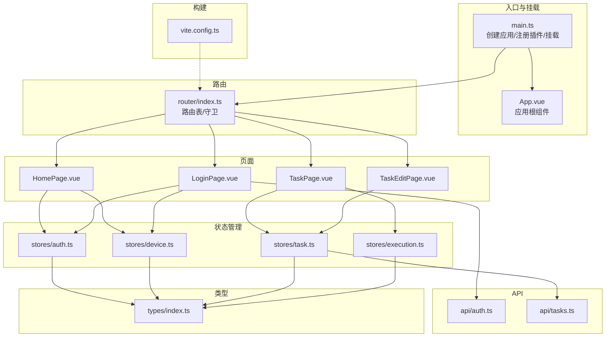
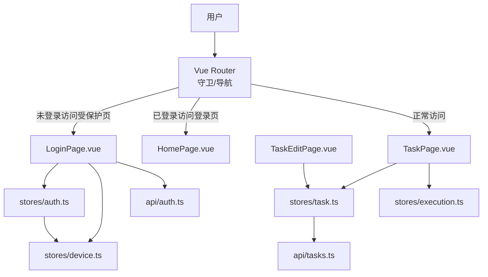
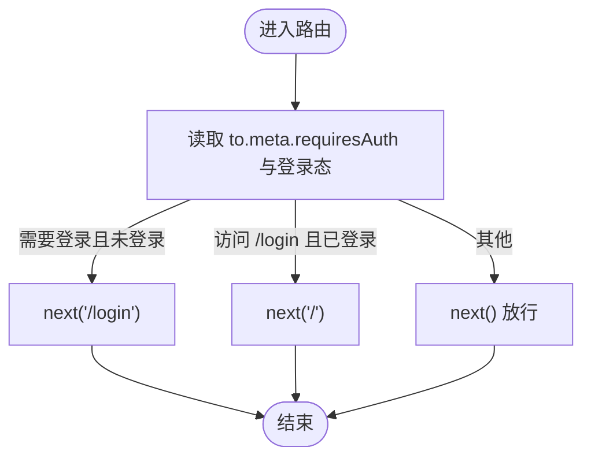
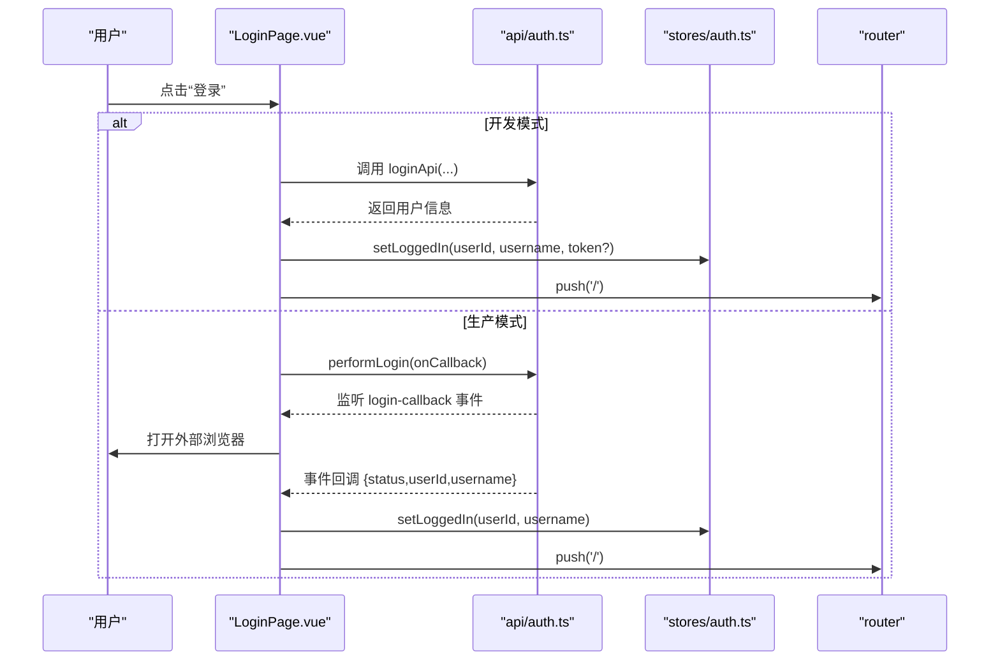
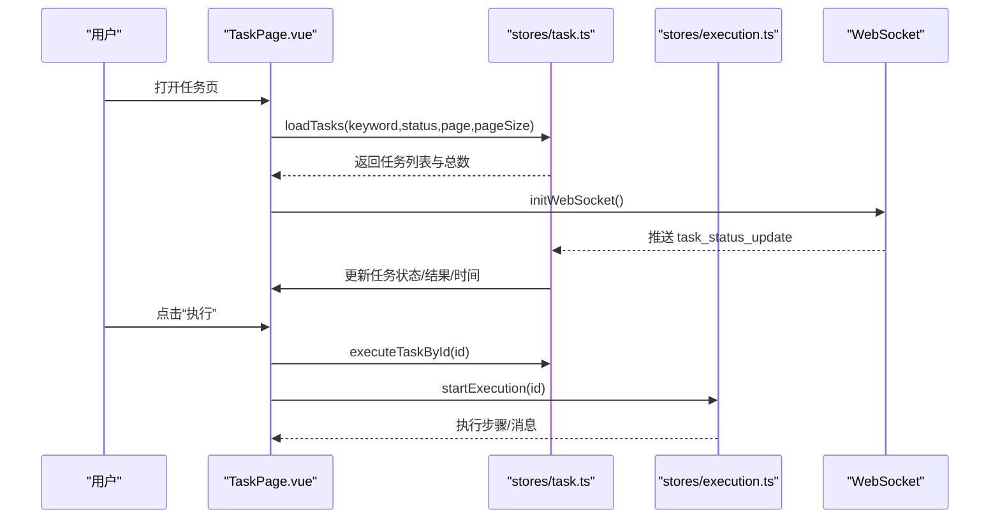
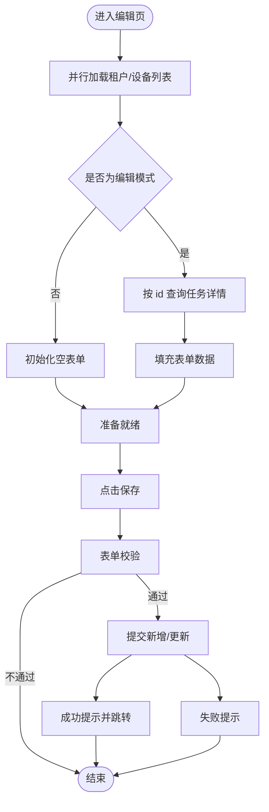
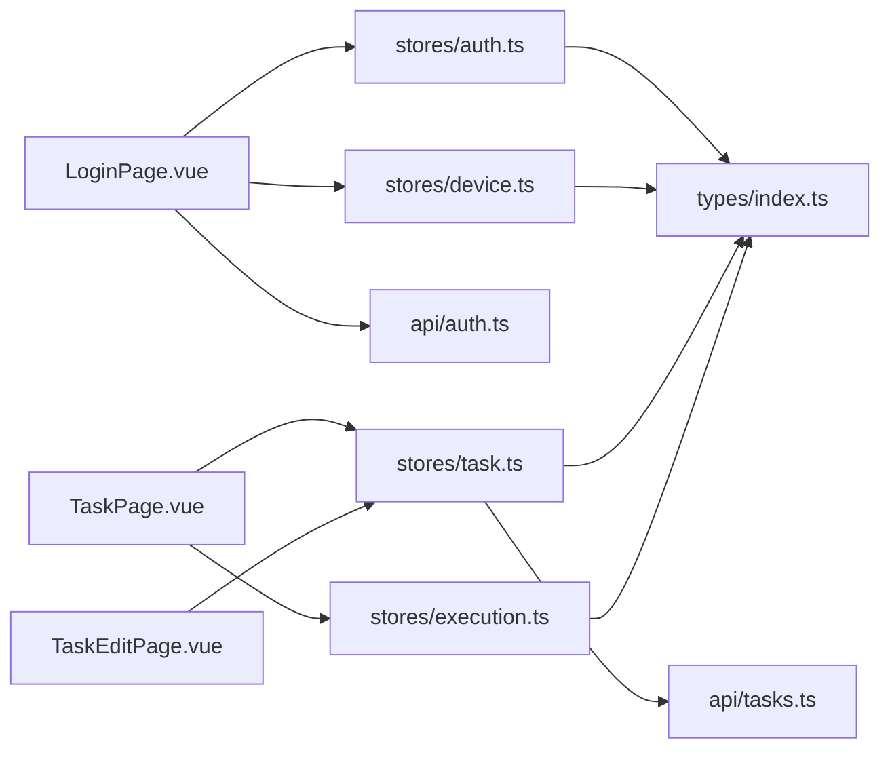

# 页面与路由

<cite>
**本文引用的文件**
- [router/index.ts](file://CCC-BrowserV4/frontend/src/router/index.ts)
- [main.ts](file://CCC-BrowserV4/frontend/src/main.ts)
- [App.vue](file://CCC-BrowserV4/frontend/src/App.vue)
- [HomePage.vue](file://CCC-BrowserV4/frontend/src/pages/HomePage.vue)
- [LoginPage.vue](file://CCC-BrowserV4/frontend/src/pages/LoginPage.vue)
- [TaskEditPage.vue](file://CCC-BrowserV4/frontend/src/pages/TaskEditPage.vue)
- [TaskPage.vue](file://CCC-BrowserV4/frontend/src/pages/TaskPage.vue)
- [auth.ts](file://CCC-BrowserV4/frontend/src/stores/auth.ts)
- [device.ts](file://CCC-BrowserV4/frontend/src/stores/device.ts)
- [task.ts](file://CCC-BrowserV4/frontend/src/stores/task.ts)
- [execution.ts](file://CCC-BrowserV4/frontend/src/stores/execution.ts)
- [auth.ts](file://CCC-BrowserV4/frontend/src/api/auth.ts)
- [tasks.ts](file://CCC-BrowserV4/frontend/src/api/tasks.ts)
- [index.ts](file://CCC-BrowserV4/frontend/src/types/index.ts)
- [vite.config.ts](file://CCC-BrowserV4/frontend/vite.config.ts)
</cite>

## 目录
1. [简介](#简介)
2. [项目结构](#项目结构)
3. [核心组件](#核心组件)
4. [架构总览](#架构总览)
5. [详细组件分析](#详细组件分析)
6. [依赖关系分析](#依赖关系分析)
7. [性能考虑](#性能考虑)
8. [故障排查指南](#故障排查指南)
9. [结论](#结论)
10. [附录](#附录)

## 简介
本文件系统性梳理前端页面与路由体系，涵盖 Vue Router 配置、路由守卫机制、页面组件功能实现（首页、登录页、任务编辑页、任务页）、页面间导航与参数传递、路由懒加载与代码分割、以及页面开发规范与最佳实践。目标是帮助开发者快速理解并高效扩展页面与路由功能。

## 项目结构
前端采用基于目录的特性化组织方式，页面、布局、路由、状态管理与 API 分层清晰：
- 入口与挂载：main.ts 创建应用实例，注册 Pinia、Vue Router、Element Plus，并挂载 App.vue
- 路由定义：router/index.ts 声明路由表与全局前置守卫
- 页面组件：pages 下按功能划分 HomePage、LoginPage、TaskPage、TaskEditPage
- 状态管理：stores 下以 Pinia Store 管理认证、设备、任务、执行状态
- API 层：api 下封装认证、任务、执行、WebSocket 等接口
- 类型定义：types 下集中声明认证、设备、任务等类型
- 构建与代理：vite.config.ts 配置别名、开发代理、构建目标与源码映射

图表来源
- [main.ts:1-23](file://CCC-BrowserV4/frontend/src/main.ts#L1-L23)
- [router/index.ts:1-63](file://CCC-BrowserV4/frontend/src/router/index.ts#L1-L63)
- [App.vue:1-21](file://CCC-BrowserV4/frontend/src/App.vue#L1-L21)
- [HomePage.vue:1-62](file://CCC-BrowserV4/frontend/src/pages/HomePage.vue#L1-L62)
- [LoginPage.vue:1-228](file://CCC-BrowserV4/frontend/src/pages/LoginPage.vue#L1-L228)
- [TaskPage.vue:1-428](file://CCC-BrowserV4/frontend/src/pages/TaskPage.vue#L1-L428)
- [TaskEditPage.vue:1-284](file://CCC-BrowserV4/frontend/src/pages/TaskEditPage.vue#L1-L284)
- [auth.ts:1-79](file://CCC-BrowserV4/frontend/src/stores/auth.ts#L1-L79)
- [device.ts:1-40](file://CCC-BrowserV4/frontend/src/stores/device.ts#L1-L40)
- [task.ts:1-84](file://CCC-BrowserV4/frontend/src/stores/task.ts#L1-L84)
- [execution.ts:1-229](file://CCC-BrowserV4/frontend/src/stores/execution.ts#L1-L229)
- [auth.ts:1-67](file://CCC-BrowserV4/frontend/src/api/auth.ts#L1-L67)
- [tasks.ts:1-41](file://CCC-BrowserV4/frontend/src/api/tasks.ts#L1-L41)
- [index.ts:1-42](file://CCC-BrowserV4/frontend/src/types/index.ts#L1-L42)
- [vite.config.ts:1-35](file://CCC-BrowserV4/frontend/vite.config.ts#L1-L35)

章节来源
- [main.ts:1-23](file://CCC-BrowserV4/frontend/src/main.ts#L1-L23)
- [router/index.ts:1-63](file://CCC-BrowserV4/frontend/src/router/index.ts#L1-L63)
- [vite.config.ts:1-35](file://CCC-BrowserV4/frontend/vite.config.ts#L1-L35)

## 核心组件
- 路由器与守卫：router/index.ts 定义路由表与全局 beforeEach 守卫，控制登录态与页面访问权限
- 应用入口：main.ts 注册 Pinia、Router、Element Plus，统一挂载
- 根组件：App.vue 在挂载时恢复登录态并初始化设备信息
- 页面组件：各页面负责自身视图、交互与数据流
- 状态管理：Pinia Store 将认证、设备、任务、执行状态模块化
- API 层：封装登录、任务 CRUD、执行流程与 WebSocket 通信

章节来源
- [router/index.ts:1-63](file://CCC-BrowserV4/frontend/src/router/index.ts#L1-L63)
- [main.ts:1-23](file://CCC-BrowserV4/frontend/src/main.ts#L1-L23)
- [App.vue:1-21](file://CCC-BrowserV4/frontend/src/App.vue#L1-L21)
- [auth.ts:1-79](file://CCC-BrowserV4/frontend/src/stores/auth.ts#L1-L79)
- [device.ts:1-40](file://CCC-BrowserV4/frontend/src/stores/device.ts#L1-L40)
- [task.ts:1-84](file://CCC-BrowserV4/frontend/src/stores/task.ts#L1-L84)
- [execution.ts:1-229](file://CCC-BrowserV4/frontend/src/stores/execution.ts#L1-L229)
- [auth.ts:1-67](file://CCC-BrowserV4/frontend/src/api/auth.ts#L1-L67)
- [tasks.ts:1-41](file://CCC-BrowserV4/frontend/src/api/tasks.ts#L1-L41)

## 架构总览
下图展示了页面与路由的整体交互：路由守卫根据登录态决定跳转；页面通过 Pinia Store 访问 API；任务页订阅 WebSocket 实时更新任务状态；执行页通过执行 Store 控制执行流程。

图表来源
- [router/index.ts:47-60](file://CCC-BrowserV4/frontend/src/router/index.ts#L47-L60)
- [LoginPage.vue:59-169](file://CCC-BrowserV4/frontend/src/pages/LoginPage.vue#L59-L169)
- [TaskPage.vue:138-294](file://CCC-BrowserV4/frontend/src/pages/TaskPage.vue#L138-L294)
- [TaskEditPage.vue:128-261](file://CCC-BrowserV4/frontend/src/pages/TaskEditPage.vue#L128-L261)
- [auth.ts:1-79](file://CCC-BrowserV4/frontend/src/stores/auth.ts#L1-L79)
- [device.ts:1-40](file://CCC-BrowserV4/frontend/src/stores/device.ts#L1-L40)
- [task.ts:1-84](file://CCC-BrowserV4/frontend/src/stores/task.ts#L1-L84)
- [execution.ts:1-229](file://CCC-BrowserV4/frontend/src/stores/execution.ts#L1-L229)
- [auth.ts:1-67](file://CCC-BrowserV4/frontend/src/api/auth.ts#L1-L67)
- [tasks.ts:1-41](file://CCC-BrowserV4/frontend/src/api/tasks.ts#L1-L41)

## 详细组件分析

### 路由系统与守卫机制
- 路由表
  - 登录页：路径 /login，meta.requiresAuth=false
  - 根布局：路径 /，children 包含 Home、Tasks、TaskAdd、TaskEdit
  - 使用动态导入实现路由级懒加载
- 全局前置守卫
  - 访问受保护路由且未登录：重定向至 /login
  - 已登录访问 /login：重定向至 /
  - 其他情况放行

图表来源
- [router/index.ts:47-60](file://CCC-BrowserV4/frontend/src/router/index.ts#L47-L60)

章节来源
- [router/index.ts:1-63](file://CCC-BrowserV4/frontend/src/router/index.ts#L1-L63)

### 登录页 LoginPage
- 功能要点
  - 开发模式：调用后端登录 API，失败则回退到本地虚拟登录
  - 生产模式：通过 Tauri Bridge 启动本地回调服务器，打开外部浏览器完成登录，事件回调处理登录结果
  - 登录超时：5 分钟定时器自动清理
  - 设备信息：初始化设备 ID，展示设备标识
  - 错误处理：统一弹窗提示与状态清理
- 导航与参数
  - 登录成功后跳转至首页 /
  - 组件卸载时清理事件监听与定时器

图表来源
- [LoginPage.vue:93-169](file://CCC-BrowserV4/frontend/src/pages/LoginPage.vue#L93-L169)
- [auth.ts:25-66](file://CCC-BrowserV4/frontend/src/api/auth.ts#L25-L66)
- [auth.ts:15-27](file://CCC-BrowserV4/frontend/src/stores/auth.ts#L15-L27)

章节来源
- [LoginPage.vue:1-228](file://CCC-BrowserV4/frontend/src/pages/LoginPage.vue#L1-L228)
- [auth.ts:1-79](file://CCC-BrowserV4/frontend/src/stores/auth.ts#L1-L79)
- [auth.ts:1-67](file://CCC-BrowserV4/frontend/src/api/auth.ts#L1-L67)

### 首页 HomePage
- 功能要点
  - 展示欢迎信息与空状态占位
  - 展示当前用户信息与设备 ID
  - 依赖 Pinia Store 提供的认证与设备状态
- 交互逻辑
  - 通过组合式 API 访问 authStore 与 deviceStore
  - 未登录或设备 ID 为空时显示占位文本

章节来源
- [HomePage.vue:1-62](file://CCC-BrowserV4/frontend/src/pages/HomePage.vue#L1-L62)

### 任务页 TaskPage
- 功能要点
  - 任务列表展示：网格布局卡片，包含状态标签、客户/经手人/省份、子任务、时间轴与结果
  - 搜索与筛选：关键词搜索（防抖）、状态筛选
  - 分页：支持页码与页大小变更
  - 操作：新增、编辑、删除、执行、演示、更多（预留）
  - 实时更新：初始化时建立 WebSocket 连接，接收任务状态更新并乐观更新 UI
- 导航与参数
  - 新增：push('/tasks/add')
  - 编辑：push(`/tasks/edit/${id}`)
  - 执行：调用执行 Store 启动执行流程
- 数据绑定与状态管理
  - 使用 taskStore.loadTasks 获取分页数据
  - 使用 executionStore.startExecution 控制执行状态
  - WebSocket 消息转发至 executionStore

图表来源
- [TaskPage.vue:158-190](file://CCC-BrowserV4/frontend/src/pages/TaskPage.vue#L158-L190)
- [TaskPage.vue:255-267](file://CCC-BrowserV4/frontend/src/pages/TaskPage.vue#L255-L267)
- [task.ts:57-80](file://CCC-BrowserV4/frontend/src/stores/task.ts#L57-L80)
- [execution.ts:122-132](file://CCC-BrowserV4/frontend/src/stores/execution.ts#L122-L132)

章节来源
- [TaskPage.vue:1-428](file://CCC-BrowserV4/frontend/src/pages/TaskPage.vue#L1-L428)
- [task.ts:1-84](file://CCC-BrowserV4/frontend/src/stores/task.ts#L1-L84)
- [execution.ts:1-229](file://CCC-BrowserV4/frontend/src/stores/execution.ts#L1-L229)

### 任务编辑页 TaskEditPage
- 功能要点
  - 表单字段：任务名称、所属公司/租户、执行设备、所属客户、经手人账号、省份、子任务、下次执行时间、备注
  - 校验规则：必填校验（任务名称）
  - 数据加载：并行加载租户与设备列表；编辑模式下按 id 查询任务详情并填充表单
  - 保存：新增或更新，成功后跳转回任务列表
  - 取消：返回任务列表
- 参数传递
  - 新增：/tasks/add
  - 编辑：/tasks/edit/:id，通过 route.params.id 判断编辑模式
- 数据绑定
  - 使用 Element Plus 表单组件与校验
  - 通过 taskStore 完成新增/更新

图表来源
- [TaskEditPage.vue:197-221](file://CCC-BrowserV4/frontend/src/pages/TaskEditPage.vue#L197-L221)
- [TaskEditPage.vue:224-255](file://CCC-BrowserV4/frontend/src/pages/TaskEditPage.vue#L224-L255)

章节来源
- [TaskEditPage.vue:1-284](file://CCC-BrowserV4/frontend/src/pages/TaskEditPage.vue#L1-L284)
- [task.ts:26-55](file://CCC-BrowserV4/frontend/src/stores/task.ts#L26-L55)

### 页面间导航与参数传递
- 导航方式
  - 编程式导航：router.push('/tasks/add' | `/tasks/edit/${id}` | '/')
- 参数传递
  - 动态路由参数：/tasks/edit/:id，编辑页通过 route.params.id 判断编辑模式
  - 无参数场景：新增与首页跳转

章节来源
- [TaskPage.vue:247-253](file://CCC-BrowserV4/frontend/src/pages/TaskPage.vue#L247-L253)
- [TaskEditPage.vue:176-178](file://CCC-BrowserV4/frontend/src/pages/TaskEditPage.vue#L176-L178)
- [router/index.ts:23-36](file://CCC-BrowserV4/frontend/src/router/index.ts#L23-L36)

### 路由懒加载与代码分割
- 实现方式
  - 路由 component 使用动态导入，实现按需加载与代码分割
- 影响范围
  - Login、Home、Task、TaskEdit 页面均采用懒加载

章节来源
- [router/index.ts:8](file://CCC-BrowserV4/frontend/src/router/index.ts#L8)
- [router/index.ts:19](file://CCC-BrowserV4/frontend/src/router/index.ts#L19)
- [router/index.ts:25](file://CCC-BrowserV4/frontend/src/router/index.ts#L25)
- [router/index.ts:30](file://CCC-BrowserV4/frontend/src/router/index.ts#L30)
- [router/index.ts:35](file://CCC-BrowserV4/frontend/src/router/index.ts#L35)

## 依赖关系分析
- 组件耦合
  - 页面对 Store 的依赖清晰：TaskPage 依赖 taskStore 与 executionStore；TaskEditPage 依赖 taskStore；LoginPage 依赖 authStore 与 deviceStore
  - Store 对 API 的依赖明确：taskStore 依赖 api/tasks.ts；authStore 依赖 api/auth.ts
- 外部依赖
  - Element Plus UI 组件库
  - Vue Router 路由与守卫
  - Pinia 状态管理
  - Tauri Bridge 用于设备信息与登录回调桥接

图表来源
- [LoginPage.vue:63-69](file://CCC-BrowserV4/frontend/src/pages/LoginPage.vue#L63-L69)
- [TaskPage.vue:144-150](file://CCC-BrowserV4/frontend/src/pages/TaskPage.vue#L144-L150)
- [TaskEditPage.vue:133-139](file://CCC-BrowserV4/frontend/src/pages/TaskEditPage.vue#L133-L139)
- [auth.ts:1-79](file://CCC-BrowserV4/frontend/src/stores/auth.ts#L1-L79)
- [device.ts:1-40](file://CCC-BrowserV4/frontend/src/stores/device.ts#L1-L40)
- [task.ts:1-84](file://CCC-BrowserV4/frontend/src/stores/task.ts#L1-L84)
- [execution.ts:1-229](file://CCC-BrowserV4/frontend/src/stores/execution.ts#L1-L229)
- [auth.ts:1-67](file://CCC-BrowserV4/frontend/src/api/auth.ts#L1-L67)
- [tasks.ts:1-41](file://CCC-BrowserV4/frontend/src/api/tasks.ts#L1-L41)
- [index.ts:1-42](file://CCC-BrowserV4/frontend/src/types/index.ts#L1-L42)

## 性能考虑
- 路由懒加载：按需加载页面组件，减少首屏体积与加载时间
- 并行加载：任务编辑页在 mounted 中并行加载租户与设备列表，缩短初始化等待
- 防抖搜索：任务页对搜索关键词变更使用防抖，降低请求频率
- 分页与虚拟滚动：任务页支持分页，建议在数据量大时启用更细粒度的分页策略
- WebSocket：任务页在挂载时建立连接，在卸载时销毁，避免内存泄漏

章节来源
- [TaskEditPage.vue:199-200](file://CCC-BrowserV4/frontend/src/pages/TaskEditPage.vue#L199-L200)
- [TaskPage.vue:168-175](file://CCC-BrowserV4/frontend/src/pages/TaskPage.vue#L168-L175)
- [TaskPage.vue:158-165](file://CCC-BrowserV4/frontend/src/pages/TaskPage.vue#L158-L165)

## 故障排查指南
- 登录流程问题
  - 开发模式：若后端不可用，回退到本地虚拟登录；检查 setLoggedIn 是否正确持久化
  - 生产模式：确认 Tauri Bridge 的设备 ID、回调服务器端口与事件监听是否生效
- 路由守卫导致的循环跳转
  - 确认 authStore.isLoggedIn 状态与 localStorage 持久化一致
- 任务列表不刷新
  - 检查 WebSocket 连接与消息处理逻辑，确保 task_status_update 能正确更新任务状态
- 执行流程异常
  - 检查 executionStore 的消息分发与状态机转换，确认演示模式与真实 API 的分支逻辑

章节来源
- [LoginPage.vue:95-127](file://CCC-BrowserV4/frontend/src/pages/LoginPage.vue#L95-L127)
- [LoginPage.vue:134-148](file://CCC-BrowserV4/frontend/src/pages/LoginPage.vue#L134-L148)
- [auth.ts:44-58](file://CCC-BrowserV4/frontend/src/stores/auth.ts#L44-L58)
- [task.ts:67-80](file://CCC-BrowserV4/frontend/src/stores/task.ts#L67-L80)
- [execution.ts:22-67](file://CCC-BrowserV4/frontend/src/stores/execution.ts#L22-L67)

## 结论
本项目通过清晰的路由设计、完善的守卫机制、模块化的状态管理与 API 封装，实现了登录、任务管理与执行流程的完整闭环。页面采用懒加载与并行加载优化性能，WebSocket 实现实时更新。遵循本文档的开发规范与最佳实践，可进一步提升可维护性与扩展性。

## 附录
- 开发环境
  - 本地开发代理：/api -> http://localhost:8000，/ws -> ws://localhost:8000
  - 构建目标：es2021、chrome105、safari15
  - 源码映射：可通过环境变量控制
- 类型定义
  - 认证状态、设备状态、任务信息等类型集中于 types/index.ts

章节来源
- [vite.config.ts:16-26](file://CCC-BrowserV4/frontend/vite.config.ts#L16-L26)
- [vite.config.ts:29-33](file://CCC-BrowserV4/frontend/vite.config.ts#L29-L33)
- [index.ts:1-42](file://CCC-BrowserV4/frontend/src/types/index.ts#L1-L42)