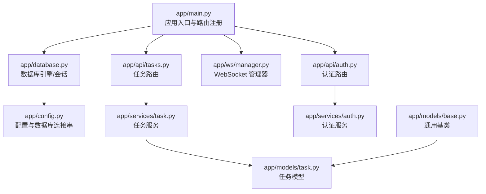
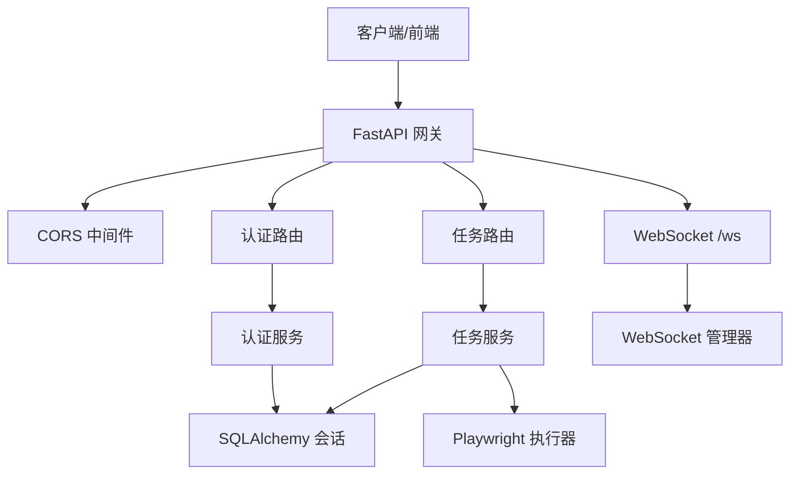
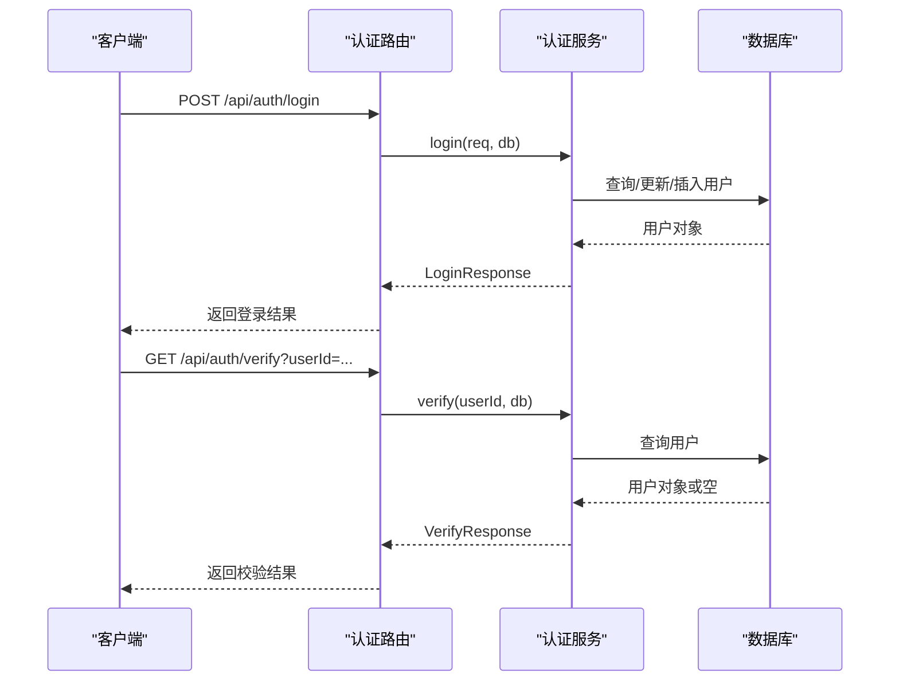
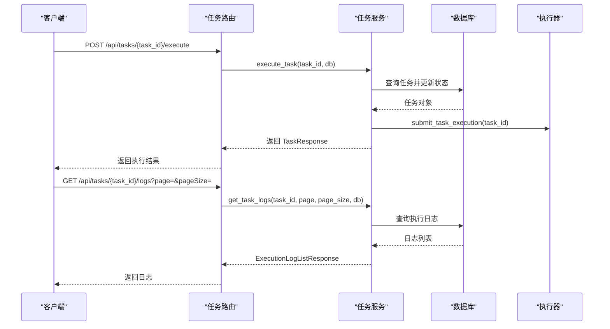
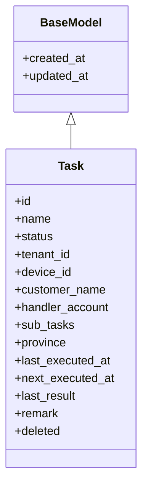
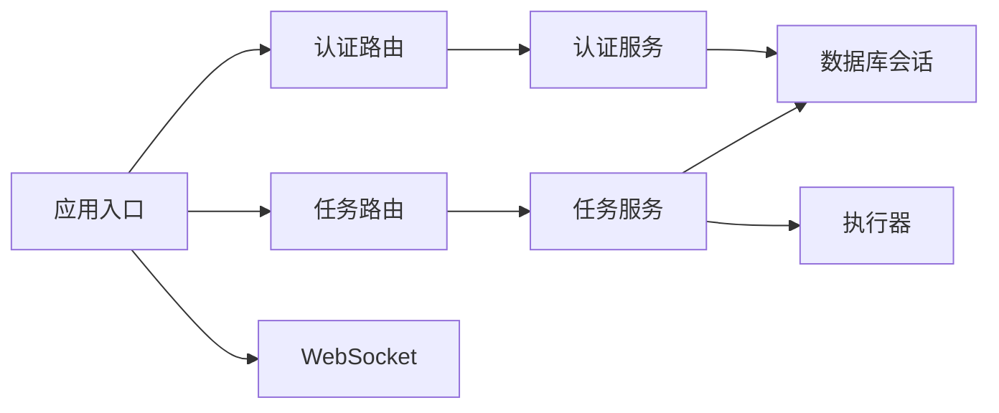

# API 网关设计

<cite>
**本文档引用的文件**
- [main.py](file://CCC_RPA_API/app/main.py)
- [config.py](file://CCC_RPA_API/app/config.py)
- [database.py](file://CCC_RPA_API/app/database.py)
- [auth.py](file://CCC_RPA_API/app/api/auth.py)
- [tasks.py](file://CCC_RPA_API/app/api/tasks.py)
- [auth.py](file://CCC_RPA_API/app/schemas/auth.py)
- [task.py](file://CCC_RPA_API/app/schemas/task.py)
- [auth.py](file://CCC_RPA_API/app/services/auth.py)
- [task.py](file://CCC_RPA_API/app/services/task.py)
- [base.py](file://CCC_RPA_API/app/models/base.py)
- [task.py](file://CCC_RPA_API/app/models/task.py)
- [manager.py](file://CCC_RPA_API/app/ws/manager.py)
</cite>

## 目录
1. [简介](#简介)
2. [项目结构](#项目结构)
3. [核心组件](#核心组件)
4. [架构总览](#架构总览)
5. [详细组件分析](#详细组件分析)
6. [依赖关系分析](#依赖关系分析)
7. [性能考虑](#性能考虑)
8. [故障排查指南](#故障排查指南)
9. [结论](#结论)
10. [附录](#附录)

## 简介
本项目是一个基于 FastAPI 的 API 网关与后端服务，提供认证、任务管理、执行日志、浏览器自动化会话与 WebSocket 实时通信能力。本文档聚焦于 API 网关的设计与实现，涵盖路由配置、中间件设置、CORS、数据库连接、服务层封装、请求/响应模型、版本管理与向后兼容策略、统一错误处理与响应格式、以及 RESTful 接口规范与最佳实践。

## 项目结构
后端采用分层组织：入口应用、配置、数据库引擎与会话、API 路由模块、Pydantic 数据模型与服务层、SQLAlchemy ORM 模型、WebSocket 管理器等。



图表来源
- [main.py:1-127](file://CCC_RPA_API/app/main.py#L1-L127)
- [auth.py:1-24](file://CCC_RPA_API/app/api/auth.py#L1-L24)
- [tasks.py:1-76](file://CCC_RPA_API/app/api/tasks.py#L1-L76)
- [manager.py](file://CCC_RPA_API/app/ws/manager.py)
- [database.py:1-19](file://CCC_RPA_API/app/database.py#L1-L19)
- [config.py:1-22](file://CCC_RPA_API/app/config.py#L1-L22)
- [task.py:1-25](file://CCC_RPA_API/app/models/task.py#L1-L25)
- [base.py:1-11](file://CCC_RPA_API/app/models/base.py#L1-L11)

章节来源
- [main.py:1-127](file://CCC_RPA_API/app/main.py#L1-L127)
- [database.py:1-19](file://CCC_RPA_API/app/database.py#L1-L19)
- [config.py:1-22](file://CCC_RPA_API/app/config.py#L1-L22)

## 核心组件
- 应用入口与生命周期
  - 初始化 FastAPI 应用，启用 CORS 全允许策略，注册认证与任务路由，挂载健康检查与 WebSocket 端点。
  - 启动时创建数据库表并进行列迁移兼容，插入初始任务数据；关闭时清理浏览器会话。
- 中间件与 CORS
  - 使用 FastAPI 内置 CORS 中间件，默认允许所有来源、方法与头，支持凭据。
- 数据库与会话
  - 基于 SQLAlchemy 创建引擎与会话工厂，提供依赖注入的数据库会话生成器。
- 路由与控制器
  - 认证路由：登录、登出、校验。
  - 任务路由：列表、创建、查询、更新、删除、执行、日志、扫描完成信号、公司选择信号、取消执行。
- 服务层
  - 认证服务：用户登录、登出、有效性校验。
  - 任务服务：任务 CRUD、执行调度、日志查询、字段转换与序列化。
- 模型与序列化
  - Pydantic 模型定义请求/响应结构，SQLAlchemy 模型映射到 MySQL 表。
- WebSocket
  - 提供 /ws 端点，通过 ws_manager 进行连接管理与消息广播。

章节来源
- [main.py:1-127](file://CCC_RPA_API/app/main.py#L1-L127)
- [auth.py:1-24](file://CCC_RPA_API/app/api/auth.py#L1-L24)
- [tasks.py:1-76](file://CCC_RPA_API/app/api/tasks.py#L1-L76)
- [auth.py:1-58](file://CCC_RPA_API/app/services/auth.py#L1-L58)
- [task.py:1-157](file://CCC_RPA_API/app/services/task.py#L1-L157)
- [task.py:1-25](file://CCC_RPA_API/app/models/task.py#L1-L25)
- [base.py:1-11](file://CCC_RPA_API/app/models/base.py#L1-L11)

## 架构总览
下图展示从客户端到服务层、数据库与浏览器自动化执行的整体流程。



图表来源
- [main.py:1-127](file://CCC_RPA_API/app/main.py#L1-L127)
- [auth.py:1-24](file://CCC_RPA_API/app/api/auth.py#L1-L24)
- [tasks.py:1-76](file://CCC_RPA_API/app/api/tasks.py#L1-L76)
- [auth.py:1-58](file://CCC_RPA_API/app/services/auth.py#L1-L58)
- [task.py:1-157](file://CCC_RPA_API/app/services/task.py#L1-L157)
- [manager.py](file://CCC_RPA_API/app/ws/manager.py)

## 详细组件分析

### 认证接口与流程
- 接口规范
  - 登录：POST /api/auth/login，请求体包含 client_id、token、device_id、username（可选），返回 userId、username、token。
  - 登出：POST /api/auth/logout，请求体包含 userId，返回登出消息。
  - 校验：GET /api/auth/verify，查询参数 userId，返回 valid、userId、username。
- 处理逻辑
  - 登录：若用户不存在则创建，否则更新 token、设备与活跃状态；返回标准化响应。
  - 登出：将用户标记为非活跃。
  - 校验：根据用户是否存在与活跃状态返回结果。
- 错误处理
  - 未找到用户时返回标准结构；HTTP 异常在路由层抛出，交由 FastAPI 统一处理。



图表来源
- [auth.py:1-24](file://CCC_RPA_API/app/api/auth.py#L1-L24)
- [auth.py:1-58](file://CCC_RPA_API/app/services/auth.py#L1-L58)

章节来源
- [auth.py:1-24](file://CCC_RPA_API/app/api/auth.py#L1-L24)
- [auth.py:1-58](file://CCC_RPA_API/app/services/auth.py#L1-L58)
- [auth.py:1-26](file://CCC_RPA_API/app/schemas/auth.py#L1-L26)

### 任务接口与流程
- 接口规范
  - 列表：GET /api/tasks，查询参数 keyword、status、page、page_size，返回分页列表。
  - 创建：POST /api/tasks，请求体为 TaskCreate，返回 TaskResponse。
  - 查询：GET /api/tasks/{task_id}，返回 TaskResponse。
  - 更新：PUT /api/tasks/{task_id}，请求体为 TaskUpdate，返回 TaskResponse。
  - 删除：DELETE /api/tasks/{task_id}，返回删除消息。
  - 执行：POST /api/tasks/{task_id}/execute，返回 TaskResponse 或错误。
  - 日志：GET /api/tasks/{task_id}/logs，返回 ExecutionLogListResponse。
  - 扫描完成：POST /api/tasks/{task_id}/scan-complete，触发执行等待器信号。
  - 公司选择：POST /api/tasks/{task_id}/select-company，携带 CompanySelectRequest，触发信号。
  - 取消执行：POST /api/tasks/{task_id}/cancel-execution，取消执行。
- 处理逻辑
  - 服务层负责查询、创建、更新、软删除、执行状态切换、日志查询与字段序列化。
  - sub_tasks 等 JSON 字段在入库前序列化为字符串，查询时反序列化为列表。
  - 执行任务时切换状态并提交到执行器。
- 错误处理
  - 未找到资源时抛出 404；执行失败时抛出 400；HTTP 异常由路由层捕获并返回。



图表来源
- [tasks.py:1-76](file://CCC_RPA_API/app/api/tasks.py#L1-L76)
- [task.py:1-157](file://CCC_RPA_API/app/services/task.py#L1-L157)

章节来源
- [tasks.py:1-76](file://CCC_RPA_API/app/api/tasks.py#L1-L76)
- [task.py:1-157](file://CCC_RPA_API/app/services/task.py#L1-L157)
- [task.py:1-58](file://CCC_RPA_API/app/schemas/task.py#L1-L58)

### WebSocket 与实时通信
- 端点：/ws
- 功能：建立连接、接收文本消息、断开连接。
- 管理：通过 ws_manager 维护连接集合，用于后续广播（当前示例中未实现广播逻辑）。

```mermaid
sequenceDiagram
participant C as "客户端"
participant W as "WebSocket 端点"
participant M as "WebSocket 管理器"
C->>W : 建立 /ws 连接
W->>M : connect(websocket)
loop 接收消息
C->>W : 发送文本消息
W->>W : receive_text()
end
C--/x/W : 断开连接
W->>M : disconnect(websocket)
```

图表来源
- [main.py:119-127](file://CCC_RPA_API/app/main.py#L119-L127)
- [manager.py](file://CCC_RPA_API/app/ws/manager.py)

章节来源
- [main.py:119-127](file://CCC_RPA_API/app/main.py#L119-L127)

### 数据模型与序列化
- 通用基类
  - BaseModel 提供 created_at、updated_at 自动维护。
- 任务模型
  - 包含名称、状态、租户/设备标识、客户名、经办账号、子任务（JSON 文本）、省市区、执行时间、结果、备注、软删除标志等字段。
- Pydantic 模型
  - TaskCreate/TaskUpdate/TaskResponse/TaskListResponse 定义请求与响应结构，字段命名遵循驼峰风格并在响应中启用 from_attributes。
  - 认证相关模型 LoginRequest/LoginResponse/LogoutRequest/VerifyResponse 定义登录、登出与校验的请求/响应结构。



图表来源
- [base.py:1-11](file://CCC_RPA_API/app/models/base.py#L1-L11)
- [task.py:1-25](file://CCC_RPA_API/app/models/task.py#L1-L25)

章节来源
- [base.py:1-11](file://CCC_RPA_API/app/models/base.py#L1-L11)
- [task.py:1-25](file://CCC_RPA_API/app/models/task.py#L1-L25)
- [task.py:1-58](file://CCC_RPA_API/app/schemas/task.py#L1-L58)
- [auth.py:1-26](file://CCC_RPA_API/app/schemas/auth.py#L1-L26)

### 请求验证与数据序列化
- 请求验证
  - 使用 Pydantic 模型自动校验请求体字段类型与必填项。
- 数据序列化
  - 服务层在入库前将 sub_tasks 等 JSON 字段序列化为字符串；查询时尝试反序列化为列表，失败则置空。
  - 时间字段统一格式化为字符串，确保响应一致性。

章节来源
- [task.py:1-157](file://CCC_RPA_API/app/services/task.py#L1-L157)
- [task.py:1-58](file://CCC_RPA_API/app/schemas/task.py#L1-L58)

### 统一错误处理与响应格式
- 统一响应
  - 认证与任务接口均返回标准化结构，避免自定义错误体导致的不一致。
- 异常处理
  - 路由层对未找到资源抛出 404，执行失败抛出 400；FastAPI 默认将异常转换为 JSON 错误响应。
- 建议
  - 可引入全局异常处理器以统一错误码与消息格式，便于前端一致处理。

章节来源
- [auth.py:1-24](file://CCC_RPA_API/app/api/auth.py#L1-L24)
- [tasks.py:1-76](file://CCC_RPA_API/app/api/tasks.py#L1-L76)

### API 版本管理与向后兼容
- 当前版本
  - 应用标题与版本号在入口处声明，便于客户端识别。
- 向后兼容策略
  - 数据库迁移脚本在启动时尝试添加列，若列已存在则忽略，保证升级兼容。
  - Pydantic 字段可选化与 from_attributes 支持，降低字段增删对现有客户端的影响。
- 建议
  - 未来可引入 URL 前缀版本化（如 /api/v1/...），并在路由层集中管理版本差异。

章节来源
- [main.py:12-21](file://CCC_RPA_API/app/main.py#L12-L21)
- [main.py:40-87](file://CCC_RPA_API/app/main.py#L40-L87)
- [task.py:1-58](file://CCC_RPA_API/app/schemas/task.py#L1-L58)

### CORS 配置
- 允许所有来源、方法与头，支持凭据。
- 适用于开发环境与跨域前端交互；生产环境建议限制来源与方法。

章节来源
- [main.py:14-21](file://CCC_RPA_API/app/main.py#L14-L21)

### 数据库连接与依赖注入
- 配置
  - 通过 Settings 读取 .env 中的数据库连接参数，生成 DATABASE_URL。
- 连接
  - 创建引擎与会话工厂，提供 get_db 依赖注入，确保每个请求拥有独立会话。
- 生命周期
  - 启动时创建表与迁移列，关闭时清理浏览器会话。

章节来源
- [config.py:1-22](file://CCC_RPA_API/app/config.py#L1-L22)
- [database.py:1-19](file://CCC_RPA_API/app/database.py#L1-L19)
- [main.py:30-112](file://CCC_RPA_API/app/main.py#L30-L112)

## 依赖关系分析
- 组件耦合
  - 路由层仅依赖服务层与数据库依赖注入，职责清晰。
  - 服务层依赖 SQLAlchemy 模型与会话，避免直接操作数据库细节。
- 外部依赖
  - FastAPI、SQLAlchemy、Pydantic、WebSocket、Playwright（延迟初始化）。
- 循环依赖
  - 未见明显循环依赖；路由、服务、模型分层明确。



图表来源
- [main.py:1-127](file://CCC_RPA_API/app/main.py#L1-L127)
- [auth.py:1-24](file://CCC_RPA_API/app/api/auth.py#L1-L24)
- [tasks.py:1-76](file://CCC_RPA_API/app/api/tasks.py#L1-L76)
- [auth.py:1-58](file://CCC_RPA_API/app/services/auth.py#L1-L58)
- [task.py:1-157](file://CCC_RPA_API/app/services/task.py#L1-L157)

章节来源
- [main.py:1-127](file://CCC_RPA_API/app/main.py#L1-L127)
- [auth.py:1-24](file://CCC_RPA_API/app/api/auth.py#L1-L24)
- [tasks.py:1-76](file://CCC_RPA_API/app/api/tasks.py#L1-L76)
- [auth.py:1-58](file://CCC_RPA_API/app/services/auth.py#L1-L58)
- [task.py:1-157](file://CCC_RPA_API/app/services/task.py#L1-L157)

## 性能考虑
- 数据库连接池
  - 启用 pool_pre_ping 与 pool_recycle，提升连接稳定性与回收效率。
- 异步与事件循环
  - WebSocket 广播需在主线程事件循环中进行，避免与同步 API 冲突。
- I/O 密集
  - 任务执行采用异步提交与延迟初始化（Playwright），减少阻塞。
- 建议
  - 对高频查询增加索引；对大列表分页查询优化排序字段；对 JSON 字段考虑使用 JSON 类型（需迁移）。

章节来源
- [database.py:5-6](file://CCC_RPA_API/app/database.py#L5-L6)
- [main.py:30-34](file://CCC_RPA_API/app/main.py#L30-L34)
- [task.py:47-64](file://CCC_RPA_API/app/services/task.py#L47-L64)

## 故障排查指南
- 常见问题
  - CORS 报错：确认前端来源与方法是否在允许范围内。
  - 404 资源不存在：检查 task_id 是否正确，确认未软删除。
  - 400 执行失败：查看任务状态与前置条件，确认执行器可用。
  - 数据库连接失败：检查 .env 中数据库连接参数与网络连通性。
- 排查步骤
  - 查看应用启动日志与迁移输出。
  - 使用 /health 端点确认服务运行状态。
  - 检查任务表与日志表数据是否符合预期。
  - 关注 WebSocket 连接与断开日志。

章节来源
- [main.py:114-116](file://CCC_RPA_API/app/main.py#L114-L116)
- [main.py:40-87](file://CCC_RPA_API/app/main.py#L40-L87)
- [tasks.py:26-51](file://CCC_RPA_API/app/api/tasks.py#L26-L51)

## 结论
该 API 网关以 FastAPI 为核心，结合 SQLAlchemy 与 Pydantic，实现了清晰的分层架构与标准化的请求/响应模型。通过统一的错误处理与响应格式、灵活的 CORS 配置、完善的任务生命周期管理与 WebSocket 支持，满足了 RPA 场景下的认证、任务编排与实时通信需求。建议在未来引入版本化路由、全局异常处理器与更严格的 CORS 策略，以进一步增强可维护性与安全性。

## 附录
- 使用示例（路径参考）
  - 登录：POST /api/auth/login
  - 校验：GET /api/auth/verify?userId=...
  - 获取任务列表：GET /api/tasks?keyword=&status=&page=&page_size=
  - 创建任务：POST /api/tasks
  - 执行任务：POST /api/tasks/{task_id}/execute
  - 获取日志：GET /api/tasks/{task_id}/logs?page=&page_size=
  - 扫描完成：POST /api/tasks/{task_id}/scan-complete
  - 公司选择：POST /api/tasks/{task_id}/select-company
  - 取消执行：POST /api/tasks/{task_id}/cancel-execution
- 最佳实践
  - 在生产环境收紧 CORS 策略。
  - 对敏感字段加密存储，令牌轮换与过期控制。
  - 对外暴露的接口统一走版本化前缀。
  - 增加速率限制与审计日志。
  - 对 JSON 字段进行白名单校验与长度限制。