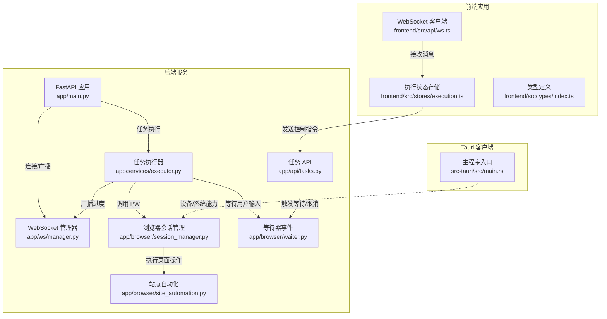
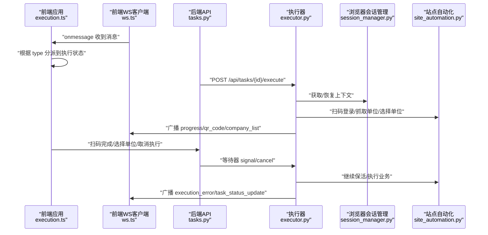
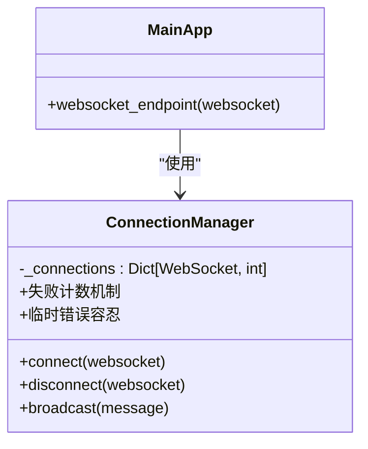
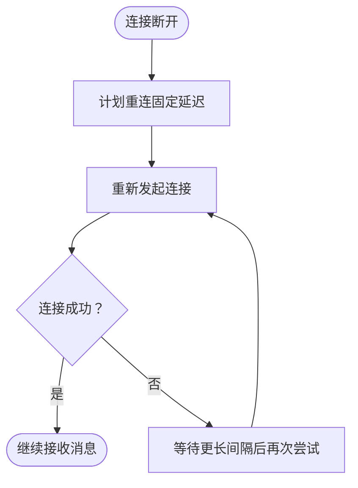
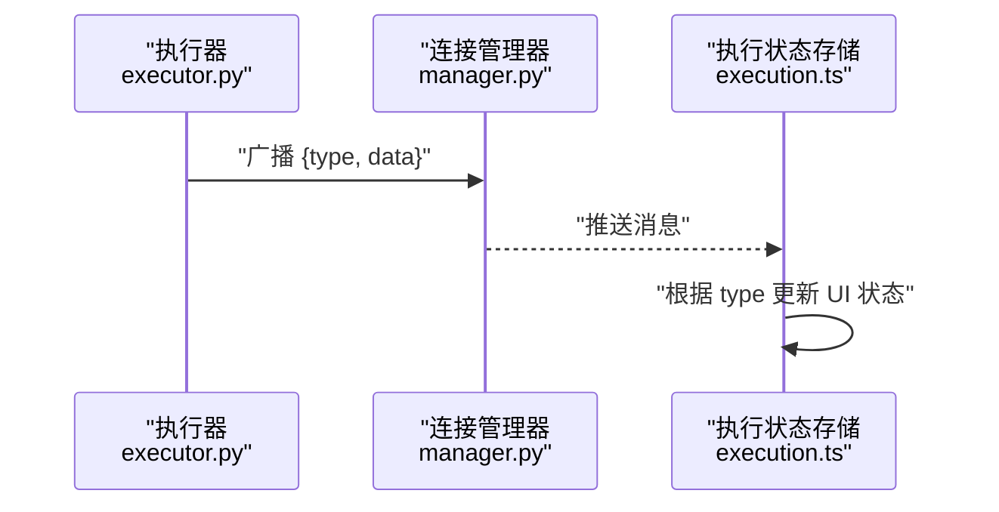
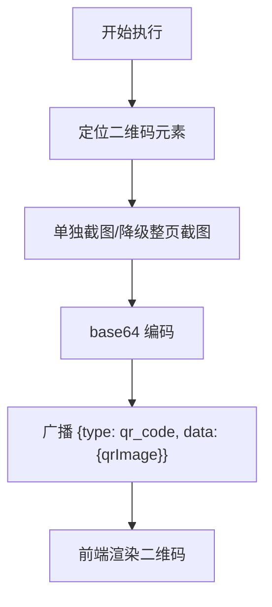
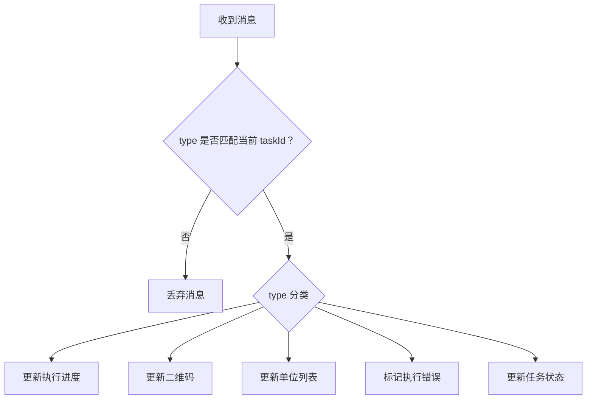
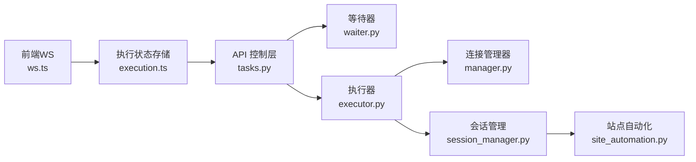

# WebSocket 实时通信

<cite>
**本文档引用的文件**
- [manager.py](file://CCC_RPA_API/app/ws/manager.py)
- [main.py](file://CCC_RPA_API/app/main.py)
- [ws.ts](file://CCC-BrowserV4/frontend/src/api/ws.ts)
- [session_manager.py](file://CCC_RPA_API/app/browser/session_manager.py)
- [executor.py](file://CCC_RPA_API/app/services/executor.py)
- [site_automation.py](file://CCC_RPA_API/app/browser/site_automation.py)
- [waiter.py](file://CCC_RPA_API/app/browser/waiter.py)
- [tasks.py](file://CCC_RPA_API/app/api/tasks.py)
- [execution.ts](file://CCC-BrowserV4/frontend/src/stores/execution.ts)
- [index.ts](file://CCC-BrowserV4/frontend/src/types/index.ts)
- [execution.py](file://CCC_RPA_API/app/schemas/execution.py)
- [main.rs](file://CCC-BrowserV4/src-tauri/src/main.rs)
</cite>

## 更新摘要
**所做更改**
- 增强了 WebSocket 广播可靠性机制，新增失败计数与临时错误容忍策略
- 改进了错误处理和日志记录，增强了调试失败广播的能力
- 优化了网络中断处理机制，提供更优雅的连接恢复策略
- 新增了广播异常回调处理和主事件循环状态检查

## 目录
1. [简介](#简介)
2. [项目结构](#项目结构)
3. [核心组件](#核心组件)
4. [架构总览](#架构总览)
5. [详细组件分析](#详细组件分析)
6. [依赖关系分析](#依赖关系分析)
7. [性能考虑](#性能考虑)
8. [故障排查指南](#故障排查指南)
9. [结论](#结论)
10. [附录](#附录)

## 简介
本文件面向 WebSocket 实时通信系统，围绕连接管理、心跳与断线重连、消息推送与事件分发、页面截图与二进制数据处理、实时状态同步与增量更新、消息队列与异步处理、协议与消息格式、错误处理与性能优化、连接池与资源清理、以及客户端集成与调试工具进行系统化说明。文档同时给出基于仓库现有实现的架构图、序列图与流程图，帮助读者快速理解与落地。

**更新** 本次更新重点增强了 WebSocket 广播的可靠性机制，改进了错误处理和临时错误容忍能力，包括更好的错误传播、增强的日志记录用于调试失败广播，以及更优雅的网络中断处理策略。

## 项目结构
该系统由三部分组成：
- 后端 FastAPI 服务：提供 WebSocket 端点、任务执行与浏览器自动化调度、数据库交互与 API。
- 前端 Vue + Pinia 应用：负责 WebSocket 连接、消息订阅与 UI 状态驱动。
- Tauri 客户端：提供设备标识、本地存储与系统能力桥接（与 WebSocket 通信解耦）。



**图表来源**
- [main.py:119-127](file://CCC_RPA_API/app/main.py#L119-L127)
- [manager.py:5-29](file://CCC_RPA_API/app/ws/manager.py#L5-L29)
- [executor.py:12-33](file://CCC_RPA_API/app/services/executor.py#L12-L33)
- [session_manager.py:7-183](file://CCC_RPA_API/app/browser/session_manager.py#L7-L183)
- [site_automation.py:16-586](file://CCC_RPA_API/app/browser/site_automation.py#L16-L586)
- [waiter.py:7-84](file://CCC_RPA_API/app/browser/waiter.py#L7-L84)
- [tasks.py:47-76](file://CCC_RPA_API/app/api/tasks.py#L47-L76)
- [ws.ts:8-88](file://CCC-BrowserV4/frontend/src/api/ws.ts#L8-L88)
- [execution.ts:22-67](file://CCC-BrowserV4/frontend/src/stores/execution.ts#L22-L67)
- [main.rs:7-28](file://CCC-BrowserV4/src-tauri/src/main.rs#L7-L28)

**章节来源**
- [main.py:119-127](file://CCC_RPA_API/app/main.py#L119-L127)
- [ws.ts:8-88](file://CCC-BrowserV4/frontend/src/api/ws.ts#L8-L88)
- [execution.ts:22-67](file://CCC-BrowserV4/frontend/src/stores/execution.ts#L22-L67)

## 核心组件
- WebSocket 连接管理器：维护连接集合、接受连接、广播消息并清理无效连接。**新增失败计数机制**，支持临时错误容忍和优雅降级。
- WebSocket 端点：FastAPI 路由，接入连接并维持空闲循环以监听客户端消息。
- 前端 WebSocket 客户端：自动重连、消息解析与事件派发。
- 任务执行器：在工作线程中执行自动化流程，通过广播向前端推送实时状态。
- 浏览器会话管理：Playwright 工作线程隔离、上下文复用、状态持久化与恢复。
- 等待器：基于线程事件的阻塞/取消/检查机制，支撑用户交互与取消。
- API 控制层：提供扫码完成、选择单位、取消执行等接口，配合等待器驱动流程。

**更新** 核心组件现已增强错误处理能力，特别是 WebSocket 广播的可靠性机制。

**章节来源**
- [manager.py:5-29](file://CCC_RPA_API/app/ws/manager.py#L5-L29)
- [main.py:119-127](file://CCC_RPA_API/app/main.py#L119-L127)
- [ws.ts:8-88](file://CCC-BrowserV4/frontend/src/api/ws.ts#L8-L88)
- [executor.py:12-33](file://CCC_RPA_API/app/services/executor.py#L12-L33)
- [session_manager.py:7-183](file://CCC_RPA_API/app/browser/session_manager.py#L7-L183)
- [waiter.py:7-84](file://CCC_RPA_API/app/browser/waiter.py#L7-L84)
- [tasks.py:47-76](file://CCC_RPA_API/app/api/tasks.py#L47-L76)

## 架构总览
系统采用"后端事件驱动 + 前端状态订阅"的模式：
- 后端在任务执行过程中周期性广播状态消息（进度、错误、二维码、单位列表、任务状态更新等）。
- 前端订阅消息并更新执行面板的状态与 UI。
- 用户通过 API 触发扫码完成、选择单位、取消执行等动作，后端等待器接收并唤醒执行器。



**图表来源**
- [execution.ts:22-67](file://CCC-BrowserV4/frontend/src/stores/execution.ts#L22-L67)
- [ws.ts:35-42](file://CCC-BrowserV4/frontend/src/api/ws.ts#L35-L42)
- [tasks.py:47-76](file://CCC_RPA_API/app/api/tasks.py#L47-L76)
- [executor.py:78-314](file://CCC_RPA_API/app/services/executor.py#L78-L314)
- [session_manager.py:96-141](file://CCC_RPA_API/app/browser/session_manager.py#L96-L141)
- [site_automation.py:38-586](file://CCC_RPA_API/app/browser/site_automation.py#L38-L586)

## 详细组件分析

### WebSocket 连接管理与广播增强
- 连接建立：后端路由接受连接并将 WebSocket 对象登记到连接表。
- **增强广播机制**：新增失败计数机制，支持临时错误容忍和优雅降级。成功发送后重置失败计数，临时错误增加计数并在达到阈值后清理连接。
- 生命周期：前端断开或异常时，后端清理连接。



**图表来源**
- [manager.py:5-29](file://CCC_RPA_API/app/ws/manager.py#L5-L29)
- [main.py:119-127](file://CCC_RPA_API/app/main.py#L119-L127)

**章节来源**
- [manager.py:5-29](file://CCC_RPA_API/app/ws/manager.py#L5-L29)
- [main.py:119-127](file://CCC_RPA_API/app/main.py#L119-L127)

### 心跳检测与断线重连策略
- 心跳：当前实现未显式发送 PING/PONG，保活依赖浏览器自动化过程中的页面交互与定时等待。
- 断线重连：前端 WebSocket 客户端在 onclose 时调度固定延迟重连，避免频繁重试造成压力。



**图表来源**
- [ws.ts:58-64](file://CCC-BrowserV4/frontend/src/api/ws.ts#L58-L64)
- [ws.ts:26-56](file://CCC-BrowserV4/frontend/src/api/ws.ts#L26-L56)

**章节来源**
- [ws.ts:58-64](file://CCC-BrowserV4/frontend/src/api/ws.ts#L58-L64)
- [ws.ts:26-56](file://CCC-BrowserV4/frontend/src/api/ws.ts#L26-L56)

### 消息推送与事件分发
- 后端广播：执行器在多个关键节点广播不同类型消息（进度、二维码、单位列表、错误、任务状态）。
- **增强广播可靠性**：新增广播异常回调处理，检查并记录广播协程异常，确保错误不会被静默忽略。
- 前端分发：执行状态存储根据消息类型更新步骤、提示语、二维码与单位列表。



**图表来源**
- [executor.py:100-283](file://CCC_RPA_API/app/services/executor.py#L100-L283)
- [manager.py:17-26](file://CCC_RPA_API/app/ws/manager.py#L17-L26)
- [execution.ts:22-67](file://CCC-BrowserV4/frontend/src/stores/execution.ts#L22-L67)

**章节来源**
- [executor.py:100-283](file://CCC_RPA_API/app/services/executor.py#L100-L283)
- [execution.ts:22-67](file://CCC-BrowserV4/frontend/src/stores/execution.ts#L22-L67)

### 页面截图与二进制数据处理
- 截图采集：站点自动化模块在关键步骤对二维码或页面进行截图，并将图片编码为 base64 字符串。
- 数据传输：后端将 base64 字符串作为消息体的一部分通过 WebSocket 发送到前端。
- 前端渲染：前端将 base64 数据绑定到 img 标签展示。



**图表来源**
- [site_automation.py:148-173](file://CCC_RPA_API/app/browser/site_automation.py#L148-L173)
- [executor.py:125-126](file://CCC_RPA_API/app/services/executor.py#L125-L126)
- [execution.ts:28-32](file://CCC-BrowserV4/frontend/src/stores/execution.ts#L28-L32)

**章节来源**
- [site_automation.py:148-173](file://CCC_RPA_API/app/browser/site_automation.py#L148-L173)
- [executor.py:125-126](file://CCC_RPA_API/app/services/executor.py#L125-L126)
- [execution.ts:28-32](file://CCC-BrowserV4/frontend/src/stores/execution.ts#L28-L32)

### 实时状态同步与增量更新策略
- 状态同步：执行器在每个阶段广播进度消息，前端据此更新步骤与提示语。
- 增量更新：前端仅对当前 taskId 关联的消息进行处理，避免跨任务干扰。
- 统一收口：任务状态更新（完成/失败）通过单一消息广播，前端统一收敛。



**图表来源**
- [execution.ts:22-67](file://CCC-BrowserV4/frontend/src/stores/execution.ts#L22-L67)

**章节来源**
- [execution.ts:22-67](file://CCC-BrowserV4/frontend/src/stores/execution.ts#L22-L67)

### 消息队列与异步处理机制
- 工作线程广播：执行器在工作线程中通过主事件循环安全地提交协程任务进行广播，避免事件循环与线程冲突。
- **增强广播异常处理**：新增广播完成回调，检查并记录异常，不阻塞工作线程。
- Playwright 工作线程：浏览器操作在专用线程中执行，避免与 asyncio 冲突。
- 等待器：使用线程事件实现阻塞等待与取消，避免阻塞主线程。

```mermaid
sequenceDiagram
participant Exec as "执行器线程"
participant Loop as "主事件循环"
participant Manager as "连接管理器"
Exec->>Loop : "run_coroutine_threadsafe(broadcast)"
Loop-->>Manager : "在事件循环中执行广播"
Manager-->>Clients : "并发发送消息"
Note over Manager : "失败计数机制<br/>临时错误容忍"
```

**图表来源**
- [executor.py:22-33](file://CCC_RPA_API/app/services/executor.py#L22-L33)
- [main.py:30-34](file://CCC_RPA_API/app/main.py#L30-L34)
- [manager.py:17-26](file://CCC_RPA_API/app/ws/manager.py#L17-L26)

**章节来源**
- [executor.py:22-33](file://CCC_RPA_API/app/services/executor.py#L22-L33)
- [main.py:30-34](file://CCC_RPA_API/app/main.py#L30-L34)
- [manager.py:17-26](file://CCC_RPA_API/app/ws/manager.py#L17-L26)

### WebSocket 协议规范与消息格式
- 协议：使用标准 WebSocket，后端端点为 /ws。
- 消息格式：JSON 对象，包含 type 与 data 字段。
- 常见消息类型：
  - execution_progress：执行进度，包含 taskId、step、message。
  - qr_code：二维码图片（base64），包含 taskId、qrImage。
  - company_list：单位列表，包含 taskId、companies。
  - login_result：登录结果，包含 taskId、success、message。
  - execution_error：执行异常，包含 taskId、message。
  - task_status_update：任务状态更新，包含 taskId、status、lastResult、lastExecutedAt。

**章节来源**
- [executor.py:100-283](file://CCC_RPA_API/app/services/executor.py#L100-L283)
- [ws.ts:1-4](file://CCC-BrowserV4/frontend/src/api/ws.ts#L1-L4)

### 错误处理增强
- **增强连接异常处理**：后端广播时捕获异常并清理无效连接，新增失败计数机制，支持临时错误容忍。
- **改进广播异常处理**：执行器新增广播完成回调，检查并记录广播协程异常，确保错误不会被静默忽略。
- 执行异常：执行器捕获异常，回写任务与日志状态，并广播错误消息。
- 浏览器异常：检测浏览器关闭错误并触发恢复流程。
- 前端异常：消息解析失败与连接错误均有日志输出与重连调度。

**更新** 错误处理机制得到显著增强，特别是 WebSocket 广播的可靠性保障。

**章节来源**
- [manager.py:17-26](file://CCC_RPA_API/app/ws/manager.py#L17-L26)
- [executor.py:285-310](file://CCC_RPA_API/app/services/executor.py#L285-L310)
- [site_automation.py:10-14](file://CCC_RPA_API/app/browser/site_automation.py#L10-L14)
- [ws.ts:35-42](file://CCC-BrowserV4/frontend/src/api/ws.ts#L35-L42)

## 依赖关系分析
- 后端模块间耦合：执行器依赖连接管理器、浏览器会话管理器与等待器；API 层依赖等待器进行用户交互控制。
- 前后端耦合：前端通过 WebSocket 订阅后端广播；通过 API 触发用户交互信号。
- 外部依赖：FastAPI、SQLAlchemy、Playwright、Pinia/Vue。



**图表来源**
- [tasks.py:47-76](file://CCC_RPA_API/app/api/tasks.py#L47-L76)
- [waiter.py:7-84](file://CCC_RPA_API/app/browser/waiter.py#L7-L84)
- [executor.py:12-33](file://CCC_RPA_API/app/services/executor.py#L12-L33)
- [manager.py:5-29](file://CCC_RPA_API/app/ws/manager.py#L5-L29)
- [session_manager.py:7-183](file://CCC_RPA_API/app/browser/session_manager.py#L7-L183)
- [site_automation.py:16-586](file://CCC_RPA_API/app/browser/site_automation.py#L16-L586)
- [ws.ts:8-88](file://CCC-BrowserV4/frontend/src/api/ws.ts#L8-L88)
- [execution.ts:22-67](file://CCC-BrowserV4/frontend/src/stores/execution.ts#L22-L67)

**章节来源**
- [tasks.py:47-76](file://CCC_RPA_API/app/api/tasks.py#L47-L76)
- [executor.py:12-33](file://CCC_RPA_API/app/services/executor.py#L12-L33)
- [execution.ts:22-67](file://CCC-BrowserV4/frontend/src/stores/execution.ts#L22-L67)

## 性能考虑
- 连接池与资源清理：后端在 shutdown 钩子中关闭所有浏览器上下文与浏览器实例，避免资源泄漏。
- **增强广播效率**：广播时并发发送并清理异常连接，新增失败计数机制减少无效重试。
- 线程隔离：浏览器操作在专用线程执行，避免阻塞事件循环与执行器线程。
- 重连退避：前端采用固定延迟重连，建议可扩展为指数退避以降低服务器压力。
- 图片传输：base64 传输体积较大，建议在生产环境考虑二进制帧或 CDN 下载地址。

**更新** 性能优化重点体现在广播可靠性和错误处理效率的提升。

**章节来源**
- [main.py:108-112](file://CCC_RPA_API/app/main.py#L108-L112)
- [session_manager.py:170-182](file://CCC_RPA_API/app/browser/session_manager.py#L170-L182)
- [manager.py:17-26](file://CCC_RPA_API/app/ws/manager.py#L17-L26)
- [ws.ts:58-64](file://CCC-BrowserV4/frontend/src/api/ws.ts#L58-L64)

## 故障排查指南
- 连接无法建立：检查后端 CORS 配置与端点路径；确认前端 ws/wss 协议与 host 地址正确。
- 消息不显示：确认前端是否过滤了非当前 taskId 的消息；检查消息解析与 handlers 注册。
- **广播异常排查**：关注后端日志中的"WebSocket send failed"警告，检查失败计数和临时错误容忍机制。
- 执行无响应：查看执行器日志与数据库任务状态；确认 Playwright 工作线程是否正常。
- 浏览器异常：关注浏览器关闭错误检测与恢复流程；检查上下文保存与恢复逻辑。
- 二维码不显示：确认截图与 base64 编码流程；检查前端 data URI 渲染。

**更新** 新增了广播异常和临时错误容忍相关的故障排查指导。

**章节来源**
- [main.py:14-21](file://CCC_RPA_API/app/main.py#L14-L21)
- [ws.ts:15-18](file://CCC-BrowserV4/frontend/src/api/ws.ts#L15-L18)
- [execution.ts:22-67](file://CCC-BrowserV4/frontend/src/stores/execution.ts#L22-L67)
- [executor.py:285-310](file://CCC_RPA_API/app/services/executor.py#L285-L310)
- [site_automation.py:10-14](file://CCC_RPA_API/app/browser/site_automation.py#L10-L14)

## 结论
该 WebSocket 实时通信系统通过"后端事件驱动 + 前端状态订阅"实现了从扫码登录、单位选择到业务执行的全流程可视化与可控化。系统具备完善的连接管理、消息广播、异步执行与错误处理机制，并在浏览器自动化层面提供了稳健的会话管理与恢复策略。

**更新** 本次更新显著增强了系统的可靠性，特别是 WebSocket 广播的临时错误容忍能力和错误传播机制。建议在生产环境中进一步引入心跳与 Ping/Pong、指数退避重连、二进制帧或 CDN 优化图片传输，并增强可观测性与告警。

## 附录

### 客户端集成示例（前端）
- 初始化 WebSocket 客户端并订阅消息：
  - 使用前端 WebSocket 客户端类，自动连接与重连。
  - 在执行状态存储中注册消息处理器，根据 type 更新 UI。
- 触发用户交互：
  - 扫码完成后调用后端接口通知执行器继续。
  - 选择单位后调用后端接口传递选择结果。
  - 取消执行时调用取消接口。

**章节来源**
- [ws.ts:20-84](file://CCC-BrowserV4/frontend/src/api/ws.ts#L20-L84)
- [execution.ts:69-120](file://CCC-BrowserV4/frontend/src/stores/execution.ts#L69-L120)
- [tasks.py:60-76](file://CCC_RPA_API/app/api/tasks.py#L60-L76)

### 调试工具使用指南
- 后端日志：关注执行器与浏览器会话管理的关键日志点，定位异常与恢复流程。
- **广播调试**：重点关注"WebSocket send failed"警告日志，检查失败计数和临时错误容忍效果。
- 前端控制台：观察 WebSocket 连接状态、消息解析与重连日志。
- Tauri 日志：通过 Tauri 客户端日志查看设备初始化与插件加载情况。

**更新** 新增了广播调试相关的日志监控指导。

**章节来源**
- [executor.py:44-69](file://CCC_RPA_API/app/services/executor.py#L44-L69)
- [session_manager.py:63-66](file://CCC_RPA_API/app/browser/session_manager.py#L63-L66)
- [ws.ts:31-55](file://CCC-BrowserV4/frontend/src/api/ws.ts#L31-L55)
- [main.rs:19-25](file://CCC-BrowserV4/src-tauri/src/main.rs#L19-L25)