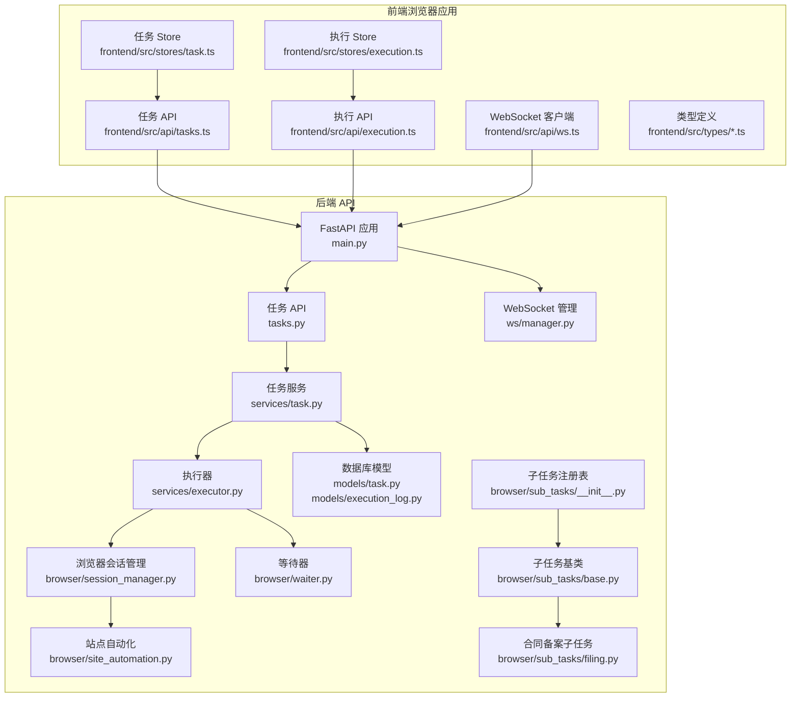
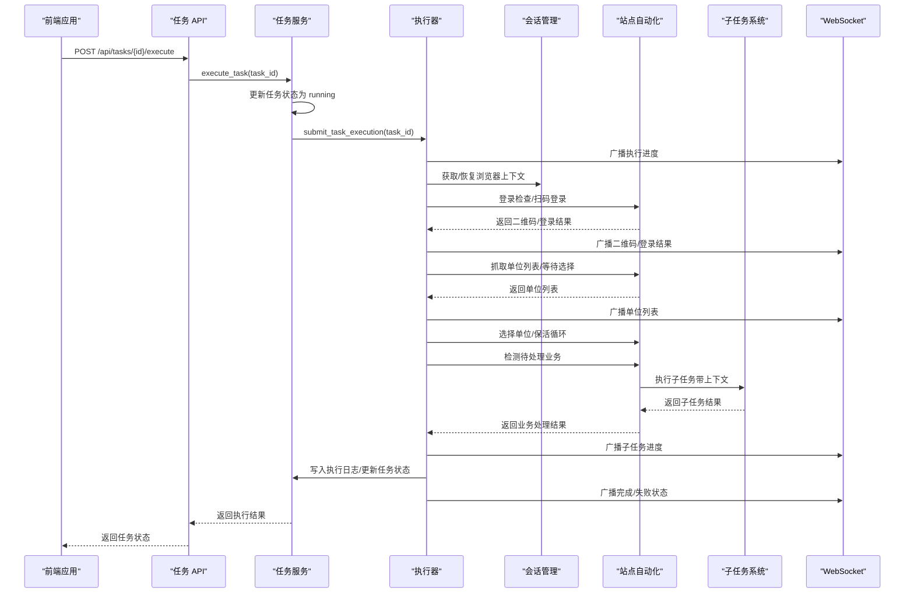
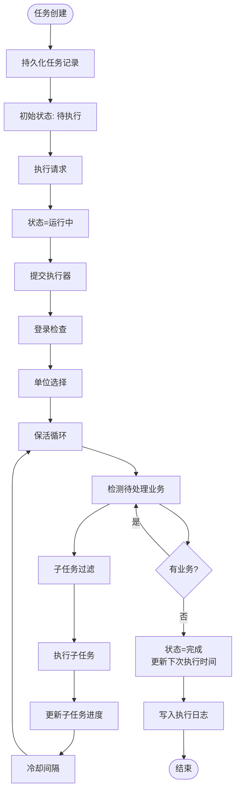
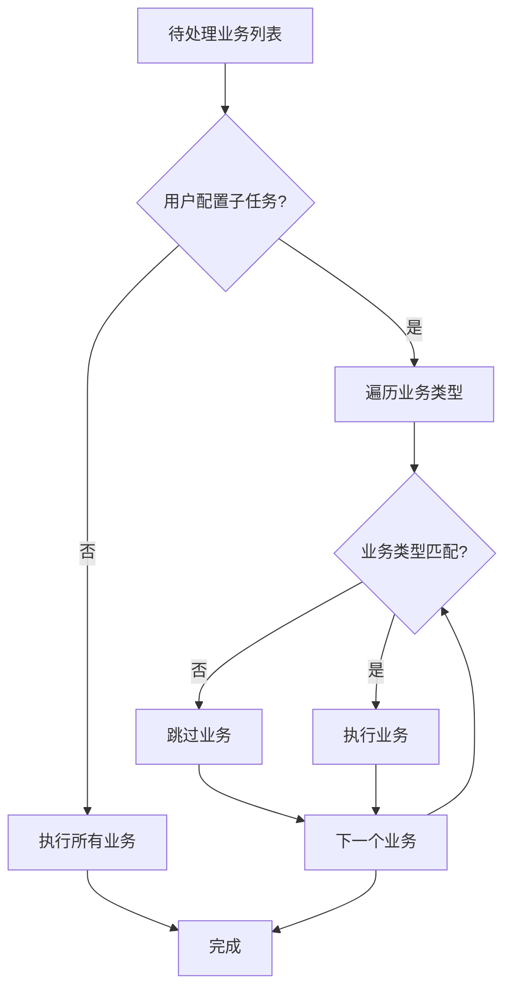
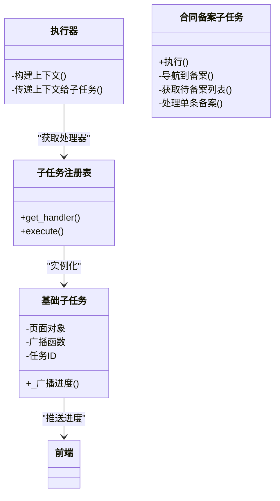
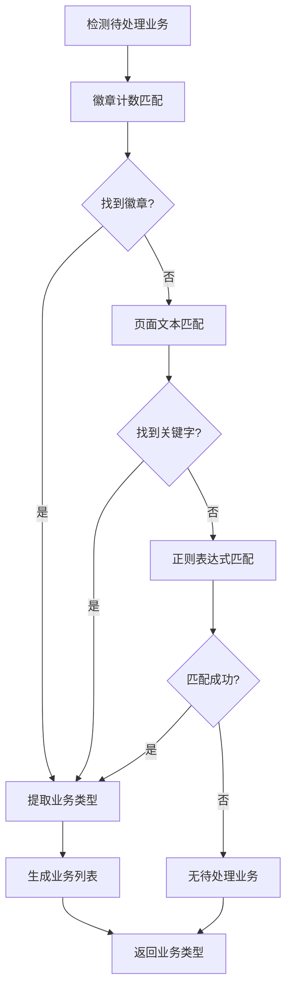
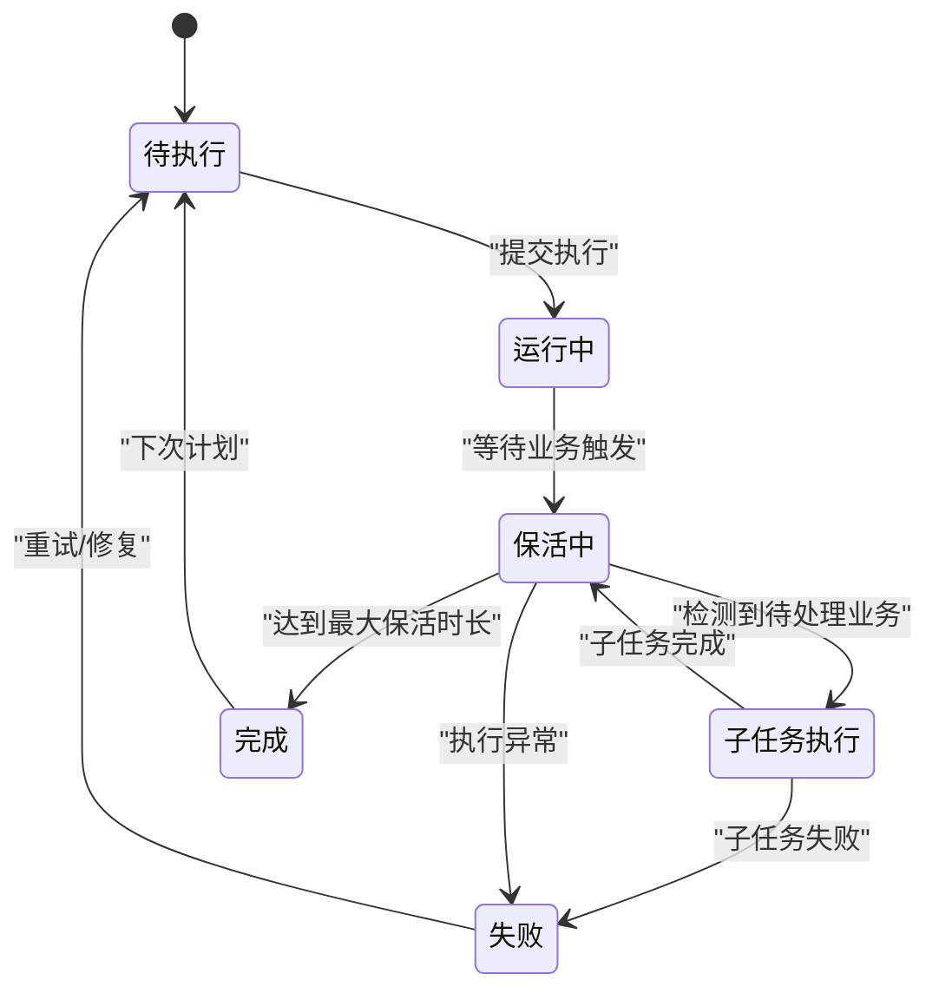
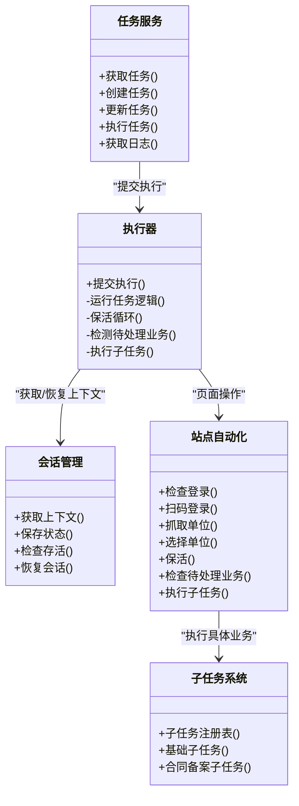
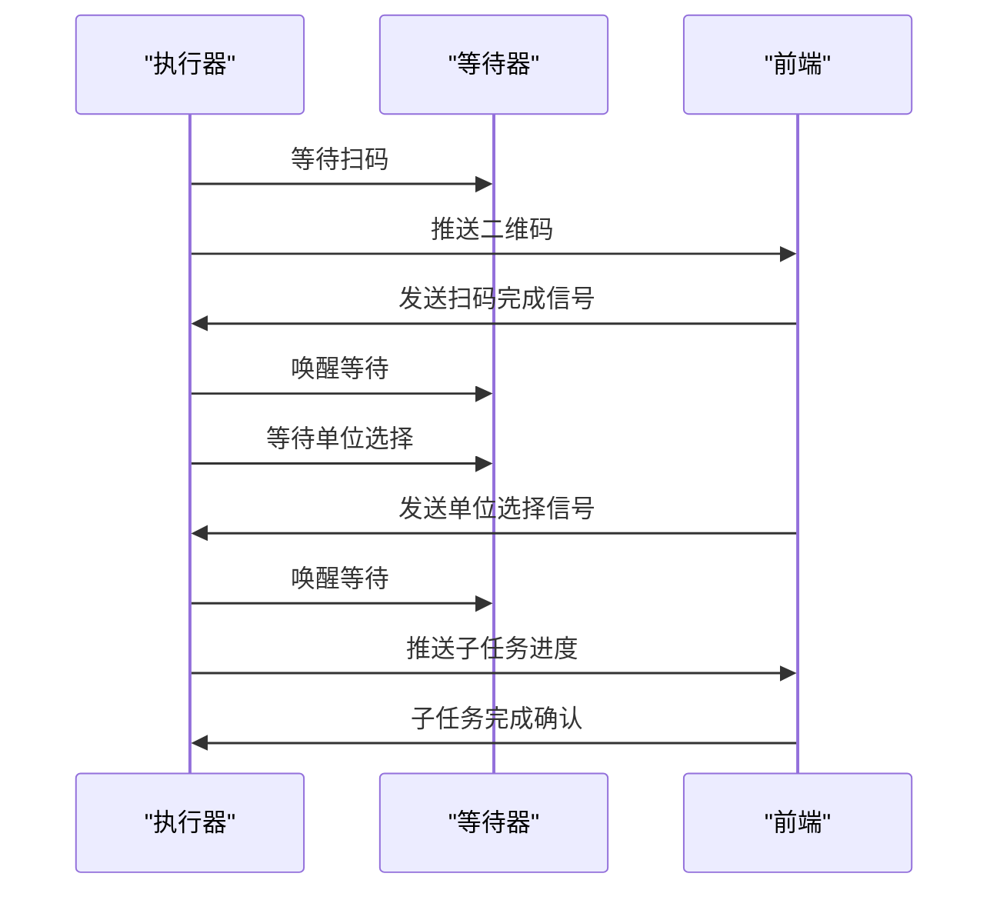
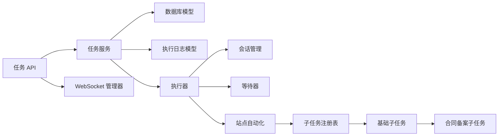

# 任务管理系统

<cite>
**本文档引用的文件**
- [task.py](file://CCC_RPA_API/app/models/task.py)
- [execution_log.py](file://CCC_RPA_API/app/models/execution_log.py)
- [task.py](file://CCC_RPA_API/app/services/task.py)
- [executor.py](file://CCC_RPA_API/app/services/executor.py)
- [tasks.py](file://CCC_RPA_API/app/api/tasks.py)
- [session_manager.py](file://CCC_RPA_API/app/browser/session_manager.py)
- [site_automation.py](file://CCC_RPA_API/app/browser/site_automation.py)
- [waiter.py](file://CCC_RPA_API/app/browser/waiter.py)
- [manager.py](file://CCC_RPA_API/app/ws/manager.py)
- [main.py](file://CCC_RPA_API/app/main.py)
- [task.ts](file://CCC-BrowserV4/frontend/src/stores/task.ts)
- [tasks.ts](file://CCC-BrowserV4/frontend/src/api/tasks.ts)
- [execution.ts](file://CCC-BrowserV4/frontend/src/api/execution.ts)
- [execution.ts](file://CCC-BrowserV4/frontend/src/stores/execution.ts)
- [execution-log.ts](file://CCC-BrowserV4/frontend/src/types/execution-log.ts)
- [ws.ts](file://CCC-BrowserV4/frontend/src/api/ws.ts)
- [base.py](file://CCC_RPA_API/app/browser/sub_tasks/base.py)
- [filing.py](file://CCC_RPA_API/app/browser/sub_tasks/filing.py)
- [__init__.py](file://CCC_RPA_API/app/browser/sub_tasks/__init__.py)
</cite>

## 更新摘要
**所做更改**
- 新增子任务过滤功能章节，详细说明用户配置的子任务过滤机制
- 新增上下文传播机制章节，解释执行器如何向子任务传递上下文信息
- 新增智能业务类型匹配章节，阐述站点自动化对业务类型的智能识别
- 更新任务生命周期管理，增加子任务执行阶段的状态转换
- 更新任务状态跟踪，新增子任务进度状态的持久化机制
- 更新前端执行状态管理，增加子任务进度显示和历史记录功能

## 目录
1. [简介](#简介)
2. [项目结构](#项目结构)
3. [核心组件](#核心组件)
4. [架构总览](#架构总览)
5. [详细组件分析](#详细组件分析)
6. [依赖关系分析](#依赖关系分析)
7. [性能考虑](#性能考虑)
8. [故障排查指南](#故障排查指南)
9. [结论](#结论)
10. [附录](#附录)

## 简介
本系统是一个基于浏览器自动化的任务管理系统，围绕"站点任务"展开，支持任务的创建、查询、更新、删除、执行以及执行日志审计。系统通过 API 提供任务管理能力，使用 Playwright 在专用线程中驱动浏览器，结合 WebSocket 实时推送执行进度与状态；同时具备用户交互等待机制（扫码登录、单位选择）与保活循环，确保长时间任务的稳定执行。

**更新** 新增子任务过滤、上下文传播和智能业务类型匹配等核心功能，实现更精细的任务执行控制和状态跟踪。

## 项目结构
系统分为后端 API 服务与前端浏览器应用两部分：
- 后端 API（FastAPI）：提供任务 CRUD、执行、日志查询与 WebSocket 广播
- 前端浏览器应用（Vue + Tauri）：提供任务编辑、执行面板、实时状态展示与用户交互

**图表来源**
- [main.py:30-87](file://CCC_RPA_API/app/main.py#L30-L87)
- [tasks.py:10-76](file://CCC_RPA_API/app/api/tasks.py#L10-L76)
- [task.py:44-157](file://CCC_RPA_API/app/services/task.py#L44-L157)
- [executor.py:68-308](file://CCC_RPA_API/app/services/executor.py#L68-L308)
- [session_manager.py:7-183](file://CCC_RPA_API/app/browser/session_manager.py#L7-L183)
- [site_automation.py:16-562](file://CCC_RPA_API/app/browser/site_automation.py#L16-L562)
- [waiter.py:7-84](file://CCC_RPA_API/app/browser/waiter.py#L7-L84)
- [manager.py:5-29](file://CCC_RPA_API/app/ws/manager.py#L5-L29)
- [task.py:8-25](file://CCC_RPA_API/app/models/task.py#L8-L25)
- [execution_log.py:7-17](file://CCC_RPA_API/app/models/execution_log.py#L7-L17)
- [__init__.py:8-30](file://CCC_RPA_API/app/browser/sub_tasks/__init__.py#L8-L30)
- [base.py:8-121](file://CCC_RPA_API/app/browser/sub_tasks/base.py#L8-L121)
- [filing.py:8-344](file://CCC_RPA_API/app/browser/sub_tasks/filing.py#L8-L344)

**章节来源**
- [main.py:12-28](file://CCC_RPA_API/app/main.py#L12-L28)
- [tasks.py:10-76](file://CCC_RPA_API/app/api/tasks.py#L10-L76)

## 核心组件
- 数据模型层
  - 任务模型：包含任务基本信息、状态、租户/设备/客户/经办人关联、子任务列表、省市区、时间戳与备注等字段
  - 执行日志模型：记录每次执行的开始/结束时间、状态与结果消息
- 服务层
  - 任务服务：提供任务列表、详情、创建、更新、软删除、执行提交与日志查询
  - 执行器：在独立线程池中执行任务逻辑，协调浏览器会话、用户交互等待与保活循环
- 浏览器自动化层
  - 会话管理：按省区分浏览器上下文，持久化 storage_state，提供专用线程执行 Playwright 操作
  - 站点自动化：封装登录检查、扫码登录、单位列表抓取、单位选择、保活与业务检测等流程
  - 等待器：基于线程事件实现用户交互等待与取消
  - 子任务系统：支持合同备案等具体业务的自动化执行
- 通信与状态
  - WebSocket 管理：向客户端广播执行进度、二维码、错误与状态更新
  - 前端 Store/API：维护任务与执行状态，订阅 WebSocket 消息，调用后端接口

**更新** 新增子任务系统，支持具体的业务自动化执行和智能业务类型匹配。

**章节来源**
- [task.py:8-25](file://CCC_RPA_API/app/models/task.py#L8-L25)
- [execution_log.py:7-17](file://CCC_RPA_API/app/models/execution_log.py#L7-L17)
- [task.py:44-157](file://CCC_RPA_API/app/services/task.py#L44-L157)
- [executor.py:68-308](file://CCC_RPA_API/app/services/executor.py#L68-L308)
- [session_manager.py:7-183](file://CCC_RPA_API/app/browser/session_manager.py#L7-L183)
- [site_automation.py:16-562](file://CCC_RPA_API/app/browser/site_automation.py#L16-L562)
- [waiter.py:7-84](file://CCC_RPA_API/app/browser/waiter.py#L7-L84)
- [manager.py:5-29](file://CCC_RPA_API/app/ws/manager.py#L5-L29)
- [__init__.py:8-30](file://CCC_RPA_API/app/browser/sub_tasks/__init__.py#L8-L30)
- [base.py:8-121](file://CCC_RPA_API/app/browser/sub_tasks/base.py#L8-L121)
- [filing.py:8-344](file://CCC_RPA_API/app/browser/sub_tasks/filing.py#L8-L344)

## 架构总览
系统采用"API 服务 + 专用浏览器线程 + 前端实时交互"的三层架构：
- API 层：接收请求、编排服务与执行器、维护数据库状态
- 执行层：在独立线程池中运行，隔离浏览器操作与主线程
- 通信层：WebSocket 实时推送执行状态，前端订阅并渲染

**图表来源**
- [tasks.py:47-57](file://CCC_RPA_API/app/api/tasks.py#L47-L57)
- [task.py:120-134](file://CCC_RPA_API/app/services/task.py#L120-L134)
- [executor.py:306-308](file://CCC_RPA_API/app/services/executor.py#L306-L308)
- [session_manager.py:96-123](file://CCC_RPA_API/app/browser/session_manager.py#L96-L123)
- [site_automation.py:38-192](file://CCC_RPA_API/app/browser/site_automation.py#L38-L192)
- [site_automation.py:737-751](file://CCC_RPA_API/app/browser/site_automation.py#L737-L751)
- [manager.py:17-26](file://CCC_RPA_API/app/ws/manager.py#L17-L26)

## 详细组件分析

### 任务生命周期管理
- 创建：接收任务创建请求，持久化基础信息与子任务列表（JSON 字符串），初始状态为待执行
- 更新：支持增量更新，特殊处理 JSON 字段序列化，更新时间戳与状态
- 执行：将任务状态置为运行中，提交执行器异步执行；执行器负责浏览器会话、用户交互与保活
- 子任务执行：检测待处理业务，根据用户配置过滤子任务，执行具体业务自动化
- 销毁：软删除（标记 deleted），不影响历史数据与日志

**更新** 新增子任务过滤和执行阶段，完善任务生命周期管理。

**图表来源**
- [task.py:74-88](file://CCC_RPA_API/app/services/task.py#L74-L88)
- [task.py:91-107](file://CCC_RPA_API/app/services/task.py#L91-L107)
- [task.py:120-134](file://CCC_RPA_API/app/services/task.py#L120-L134)
- [executor.py:258-274](file://CCC_RPA_API/app/services/executor.py#L258-L274)
- [executor.py:275-300](file://CCC_RPA_API/app/services/executor.py#L275-L300)
- [executor.py:234-290](file://CCC_RPA_API/app/services/executor.py#L234-L290)

**章节来源**
- [task.py:74-107](file://CCC_RPA_API/app/services/task.py#L74-L107)
- [task.py:120-134](file://CCC_RPA_API/app/services/task.py#L120-L134)
- [executor.py:234-290](file://CCC_RPA_API/app/services/executor.py#L234-L290)

### 子任务过滤机制
系统支持基于用户配置的子任务过滤，实现精细化的任务执行控制：

- **过滤规则**：支持精确匹配和模糊匹配两种模式
  - 精确匹配：`biz_type == sub_task`
  - 模糊匹配：`sub_task in biz_type or biz_type in sub_task`
- **过滤流程**：执行器在检测到待处理业务后，先检查用户配置的子任务列表，再进行匹配过滤
- **日志记录**：未匹配的子任务会被记录并跳过执行

**图表来源**
- [executor.py:244-251](file://CCC_RPA_API/app/services/executor.py#L244-L251)
- [executor.py:253-254](file://CCC_RPA_API/app/services/executor.py#L253-L254)

**章节来源**
- [executor.py:244-251](file://CCC_RPA_API/app/services/executor.py#L244-L251)
- [executor.py:253-254](file://CCC_RPA_API/app/services/executor.py#L253-L254)

### 上下文传播机制
执行器通过上下文对象向子任务传递必要的执行信息：

- **上下文内容**：
  - `broadcast_fn`：广播函数，用于向前端推送执行进度
  - `task_id`：任务ID，用于标识执行上下文
  - `sub_tasks`：用户配置的子任务列表
- **传播方式**：执行器构建上下文字典，在执行子任务时作为参数传递
- **子任务访问**：子任务通过构造函数接收上下文，使用其中的广播函数更新进度

**图表来源**
- [executor.py:235-240](file://CCC_RPA_API/app/services/executor.py#L235-L240)
- [site_automation.py:737-751](file://CCC_RPA_API/app/browser/site_automation.py#L737-L751)
- [base.py:11-28](file://CCC_RPA_API/app/browser/sub_tasks/base.py#L11-L28)

**章节来源**
- [executor.py:235-240](file://CCC_RPA_API/app/services/executor.py#L235-L240)
- [site_automation.py:737-751](file://CCC_RPA_API/app/browser/site_automation.py#L737-L751)
- [base.py:11-28](file://CCC_RPA_API/app/browser/sub_tasks/base.py#L11-L28)

### 智能业务类型匹配
站点自动化实现智能的业务类型识别，支持多种匹配策略：

- **匹配策略**：
  - **徽章计数匹配**：通过页面徽章元素检测待处理数量
  - **关键字匹配**：在页面文本中搜索业务关键字
  - **正则表达式匹配**：使用正则模式匹配业务描述
- **支持的业务类型**：
  - 备案查询：匹配"备案"关键字
  - 违章查询：匹配"违章"或"违法"关键字
  - 合同调整：匹配"合同调整"关键字
  - 违章转移：匹配"转移"关键字
- **匹配流程**：优先使用徽章计数，其次使用页面文本匹配，最后使用正则表达式

**图表来源**
- [site_automation.py:682-735](file://CCC_RPA_API/app/browser/site_automation.py#L682-L735)

**章节来源**
- [site_automation.py:682-735](file://CCC_RPA_API/app/browser/site_automation.py#L682-L735)

### 任务调度与优先级管理
- 调度机制：执行器使用固定大小的线程池（默认 3 个工作线程）异步执行任务逻辑，避免阻塞 API 主线程
- 优先级：当前未实现显式的任务优先级队列；高并发下建议通过外部队列或限流策略控制提交速率
- 并发控制：线程池大小与浏览器上下文数量共同决定并发度；可通过配置调整
- 子任务并发：子任务执行采用冷却间隔控制，避免过度频繁的操作

**更新** 新增子任务冷却间隔机制，控制每分钟操作次数（PPM）。

**章节来源**
- [executor.py:18-19](file://CCC_RPA_API/app/services/executor.py#L18-L19)
- [executor.py:306-308](file://CCC_RPA_API/app/services/executor.py#L306-L308)
- [executor.py:283-286](file://CCC_RPA_API/app/services/executor.py#L283-L286)

### 任务状态跟踪与持久化
- 状态字段：任务表包含状态、最近执行时间、下次执行时间、最近结果等字段
- 日志表：每次执行生成一条执行日志，记录开始/结束时间、状态与结果消息
- 子任务状态：新增子任务进度状态，包括子任务类型、执行步骤、进度百分比和数据
- 状态转换：待执行 → 运行中 → 子任务执行 → 完成/失败；执行器在异常与正常路径分别更新状态与日志

**更新** 新增子任务执行状态，完善状态转换流程。

**图表来源**
- [task.py:13](file://CCC_RPA_API/app/models/task.py#L13)
- [execution_log.py:15](file://CCC_RPA_API/app/models/execution_log.py#L15)
- [executor.py:260-267](file://CCC_RPA_API/app/services/executor.py#L260-L267)
- [executor.py:281-284](file://CCC_RPA_API/app/services/executor.py#L281-L284)
- [executor.py:310-318](file://CCC_RPA_API/app/services/executor.py#L310-L318)

**章节来源**
- [task.py:13](file://CCC_RPA_API/app/models/task.py#L13)
- [execution_log.py:15](file://CCC_RPA_API/app/models/execution_log.py#L15)
- [executor.py:258-318](file://CCC_RPA_API/app/services/executor.py#L258-L318)

### 任务与浏览器会话的关联与依赖
- 会话管理：按省区分浏览器上下文，复用 storage_state 实现登录态持久化
- 依赖链：执行器依赖会话管理器获取上下文，再调用站点自动化进行页面操作
- 恢复机制：检测浏览器异常时自动恢复，重新打开目标页面并继续执行
- 子任务依赖：子任务通过站点自动化提供的执行方法进行页面操作

**更新** 新增子任务系统依赖关系，完善组件交互图。

**图表来源**
- [task.py:44-157](file://CCC_RPA_API/app/services/task.py#L44-L157)
- [executor.py:68-308](file://CCC_RPA_API/app/services/executor.py#L68-L308)
- [session_manager.py:96-123](file://CCC_RPA_API/app/browser/session_manager.py#L96-L123)
- [site_automation.py:38-494](file://CCC_RPA_API/app/browser/site_automation.py#L38-L494)
- [site_automation.py:737-751](file://CCC_RPA_API/app/browser/site_automation.py#L737-L751)
- [__init__.py:8-30](file://CCC_RPA_API/app/browser/sub_tasks/__init__.py#L8-L30)

**章节来源**
- [session_manager.py:96-123](file://CCC_RPA_API/app/browser/session_manager.py#L96-L123)
- [site_automation.py:38-192](file://CCC_RPA_API/app/browser/site_automation.py#L38-L192)
- [executor.py:42-59](file://CCC_RPA_API/app/services/executor.py#L42-L59)
- [site_automation.py:737-751](file://CCC_RPA_API/app/browser/site_automation.py#L737-L751)

### 用户交互与等待机制
- 等待器：基于线程事件实现阻塞等待与唤醒，支持扫码完成、单位选择与取消
- 交互流程：执行器推送二维码与进度，前端展示并发送确认信号，等待器唤醒执行器继续
- 子任务交互：子任务执行过程中通过广播函数向前端推送实时进度

**图表来源**
- [waiter.py:14-32](file://CCC_RPA_API/app/browser/waiter.py#L14-L32)
- [tasks.py:60-69](file://CCC_RPA_API/app/api/tasks.py#L60-L69)
- [executor.py:122-171](file://CCC_RPA_API/app/services/executor.py#L122-L171)
- [execution.ts:66-83](file://CCC-BrowserV4/frontend/src/stores/execution.ts#L66-L83)

**章节来源**
- [waiter.py:14-32](file://CCC_RPA_API/app/browser/waiter.py#L14-L32)
- [tasks.py:60-69](file://CCC_RPA_API/app/api/tasks.py#L60-L69)
- [execution.ts:66-83](file://CCC-BrowserV4/frontend/src/stores/execution.ts#L66-L83)

### 执行日志与审计
- 日志模型：包含任务 ID、任务名、开始/结束时间、状态与结果消息
- 子任务日志：新增子任务进度日志，记录子任务类型、执行步骤、进度百分比和数据
- 写入时机：执行开始写入运行中日志，结束后更新状态与消息
- 查询接口：支持分页查询任务日志，便于审计与问题追踪

**更新** 新增子任务进度日志记录机制。

**章节来源**
- [execution_log.py:7-17](file://CCC_RPA_API/app/models/execution_log.py#L7-L17)
- [task.py:136-156](file://CCC_RPA_API/app/services/task.py#L136-L156)
- [executor.py:76-84](file://CCC_RPA_API/app/services/executor.py#L76-L84)
- [executor.py:256-281](file://CCC_RPA_API/app/services/executor.py#L256-L281)

### 业务规则与数据模型设计
- 任务表字段：名称、状态、租户/设备/客户/经办人、子任务列表(JSON)、省市区、时间戳、备注、软删除
- 执行日志表字段：任务 ID、任务名、开始/结束时间、状态、结果消息
- 子任务配置：支持 JSON 数组格式的子任务列表，用于过滤和控制执行范围
- 关键约束：状态枚举（待执行/运行中/完成/失败），省市区与 JSON 字段的可选性

**更新** 新增子任务配置字段，完善数据模型设计。

**章节来源**
- [task.py:8-25](file://CCC_RPA_API/app/models/task.py#L8-L25)
- [execution_log.py:7-17](file://CCC_RPA_API/app/models/execution_log.py#L7-L17)

### API 接口规范
- 任务管理
  - GET /api/tasks：分页查询任务（关键词、状态过滤）
  - POST /api/tasks：创建任务
  - GET /api/tasks/{task_id}：获取任务详情
  - PUT /api/tasks/{task_id}：更新任务
  - DELETE /api/tasks/{task_id}：软删除任务
  - POST /api/tasks/{task_id}/execute：执行任务
  - GET /api/tasks/{task_id}/logs：查询执行日志
  - POST /api/tasks/{task_id}/scan-complete：扫码完成信号
  - POST /api/tasks/{task_id}/select-company：选择单位信号
  - POST /api/tasks/{task_id}/cancel-execution：取消执行
- WebSocket
  - /ws：连接后接收广播消息（执行进度、二维码、登录结果、错误、状态更新、子任务进度）
- 子任务相关
  - 子任务过滤：通过任务配置的 sub_tasks 字段控制执行范围
  - 子任务进度：通过 sub_task_progress 类型推送实时进度

**更新** 新增子任务进度推送和过滤控制接口。

**章节来源**
- [tasks.py:13-76](file://CCC_RPA_API/app/api/tasks.py#L13-L76)
- [main.py:119-127](file://CCC_RPA_API/app/main.py#L119-L127)
- [execution.ts:34-97](file://CCC-BrowserV4/frontend/src/stores/execution.ts#L34-L97)

## 依赖关系分析
- 组件耦合
  - 任务服务依赖数据库模型与执行日志模型
  - 执行器依赖会话管理、站点自动化与等待器
  - 站点自动化依赖子任务注册表和基础子任务类
  - API 层依赖任务服务与等待器（用于用户交互信号）
  - WebSocket 管理器为前后端通信提供基础设施
- 外部依赖
  - Playwright：浏览器自动化核心
  - SQLAlchemy：ORM 与数据库访问
  - FastAPI/WebSocket：API 与实时通信

**更新** 新增子任务系统依赖关系，完善组件依赖图。

**图表来源**
- [tasks.py:10-76](file://CCC_RPA_API/app/api/tasks.py#L10-L76)
- [task.py:44-157](file://CCC_RPA_API/app/services/task.py#L44-L157)
- [executor.py:68-308](file://CCC_RPA_API/app/services/executor.py#L68-L308)
- [session_manager.py:7-183](file://CCC_RPA_API/app/browser/session_manager.py#L7-L183)
- [site_automation.py:16-562](file://CCC_RPA_API/app/browser/site_automation.py#L16-L562)
- [waiter.py:7-84](file://CCC_RPA_API/app/browser/waiter.py#L7-L84)
- [manager.py:5-29](file://CCC_RPA_API/app/ws/manager.py#L5-L29)
- [__init__.py:8-30](file://CCC_RPA_API/app/browser/sub_tasks/__init__.py#L8-L30)
- [base.py:8-121](file://CCC_RPA_API/app/browser/sub_tasks/base.py#L8-L121)
- [filing.py:8-344](file://CCC_RPA_API/app/browser/sub_tasks/filing.py#L8-L344)

**章节来源**
- [main.py:30-87](file://CCC_RPA_API/app/main.py#L30-L87)

## 性能考虑
- 线程隔离：浏览器操作在专用线程执行，避免阻塞 API 主线程与事件循环
- 线程池：默认 3 个工作线程，可根据硬件与站点稳定性调整
- 保活策略：随机滚动、点击刷新与等待，降低风控风险，同时减少无效轮询
- 存储状态：按省保存 storage_state，减少重复登录成本
- WebSocket 广播：仅在必要节点广播，避免频繁消息风暴
- 子任务冷却：执行后30-90秒冷却间隔，控制每分钟操作次数（PPM）
- 子任务过滤：通过用户配置过滤未使用的业务类型，减少无效执行

**更新** 新增子任务冷却和过滤性能优化措施。

## 故障排查指南
- 浏览器异常
  - 现象：页面报错或浏览器关闭
  - 处理：执行器自动检测并恢复会话，重新打开目标页面
- 扫码超时/取消
  - 现象：扫码等待超时或用户取消
  - 处理：等待器抛出超时异常或取消信号，执行器回滚状态并记录日志
- 登录失败
  - 现象：二维码无法识别或登录页面异常
  - 处理：站点自动化提供降级截图与多策略导航，必要时重新扫码
- 执行中断
  - 现象：任务中途失败
  - 处理：执行器更新任务状态为失败，写入日志并广播错误消息
- 子任务执行失败
  - 现象：特定业务类型执行失败
  - 处理：检查子任务注册表配置，查看子任务日志，确认页面元素定位
- 子任务过滤问题
  - 现象：期望的业务类型未被执行
  - 处理：检查任务配置的 sub_tasks 字段，确认业务类型匹配规则

**更新** 新增子任务相关故障排查指南。

**章节来源**
- [executor.py:42-59](file://CCC_RPA_API/app/services/executor.py#L42-L59)
- [executor.py:122-171](file://CCC_RPA_API/app/services/executor.py#L122-L171)
- [executor.py:275-300](file://CCC_RPA_API/app/services/executor.py#L275-L300)
- [site_automation.py:148-173](file://CCC_RPA_API/app/browser/site_automation.py#L148-L173)

## 结论
该任务管理系统以清晰的分层架构实现了从任务管理到浏览器自动化的完整闭环：API 层负责编排与持久化，执行层隔离浏览器操作，前端通过 WebSocket 实时反馈执行状态。系统具备完善的日志与审计能力，支持用户交互等待与保活机制，满足复杂站点任务的自动化需求。

**更新** 新功能增强了系统的智能化程度和执行精度，通过子任务过滤、上下文传播和智能业务类型匹配，实现了更精细的任务控制和状态跟踪。建议在高并发场景下引入外部队列与限流策略，并根据站点稳定性动态调整线程池与保活参数。

## 附录
- 前端集成要点
  - 订阅 /ws 广播，渲染执行进度与二维码
  - 通过任务 API 与执行 API 控制任务生命周期
  - 使用 Store 管理本地状态，避免与后端状态不一致
  - 处理子任务进度消息，显示详细的执行步骤和进度
- 子任务开发指南
  - 继承基础子任务类，实现 execute 方法
  - 使用 _broadcast_progress 方法推送执行进度
  - 遵循人类行为模拟原则，避免被风控检测
  - 实现适当的等待和冷却机制

**更新** 新增子任务开发和前端集成要点。

**章节来源**
- [task.ts](file://CCC-BrowserV4/frontend/src/stores/task.ts)
- [execution.ts](file://CCC-BrowserV4/frontend/src/stores/execution.ts)
- [tasks.ts](file://CCC-BrowserV4/frontend/src/api/tasks.ts)
- [execution.ts](file://CCC-BrowserV4/frontend/src/api/execution.ts)
- [execution-log.ts](file://CCC-BrowserV4/frontend/src/types/execution-log.ts)
- [ws.ts](file://CCC-BrowserV4/frontend/src/api/ws.ts)
- [base.py:16-35](file://CCC_RPA_API/app/browser/sub_tasks/base.py#L16-L35)
- [execution.ts:66-83](file://CCC-BrowserV4/frontend/src/stores/execution.ts#L66-L83)