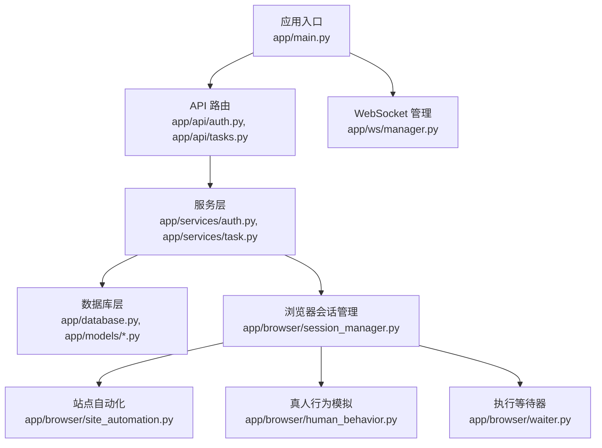
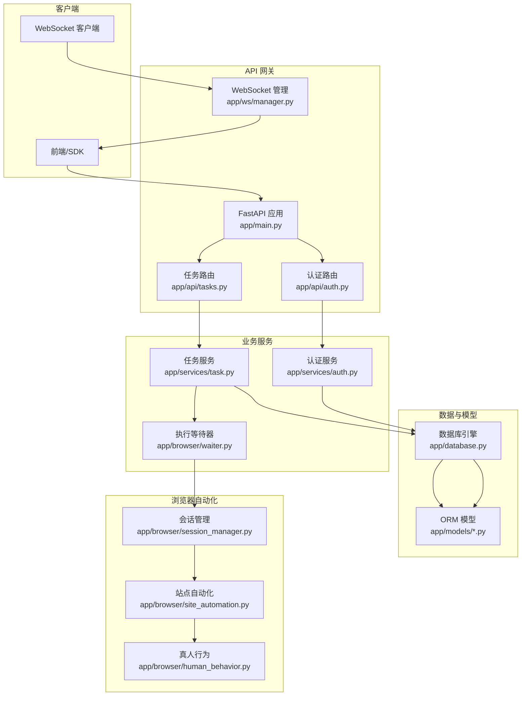
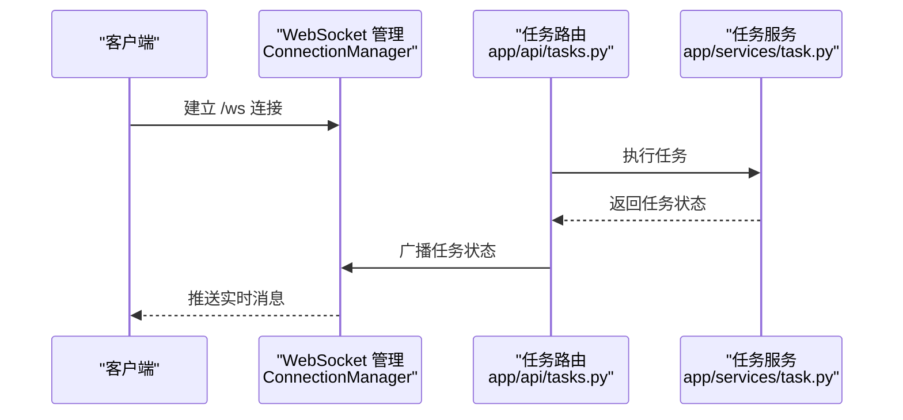
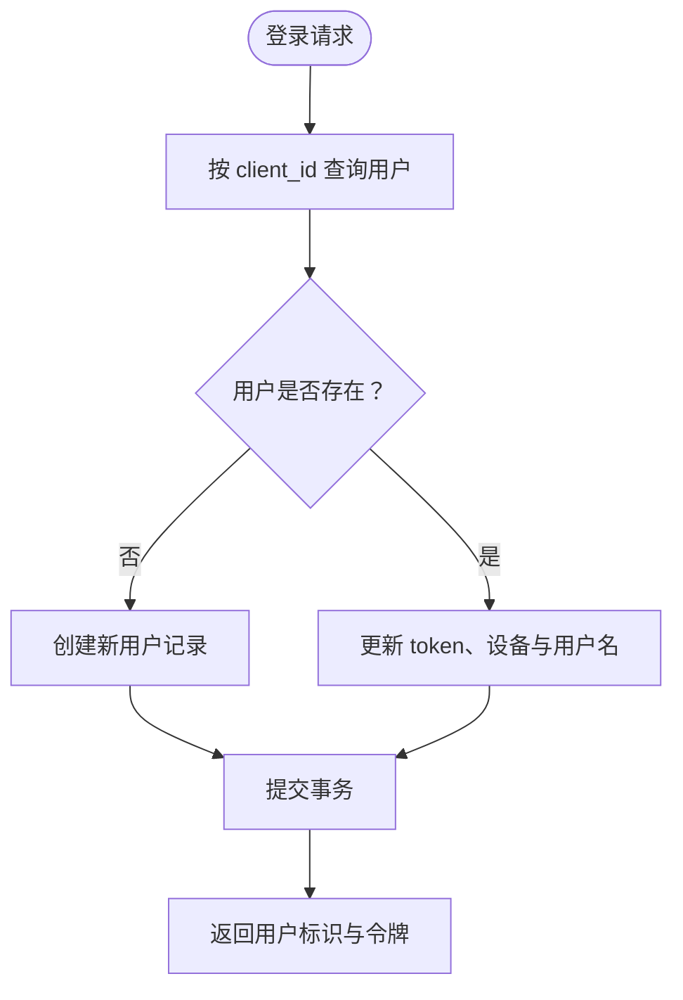
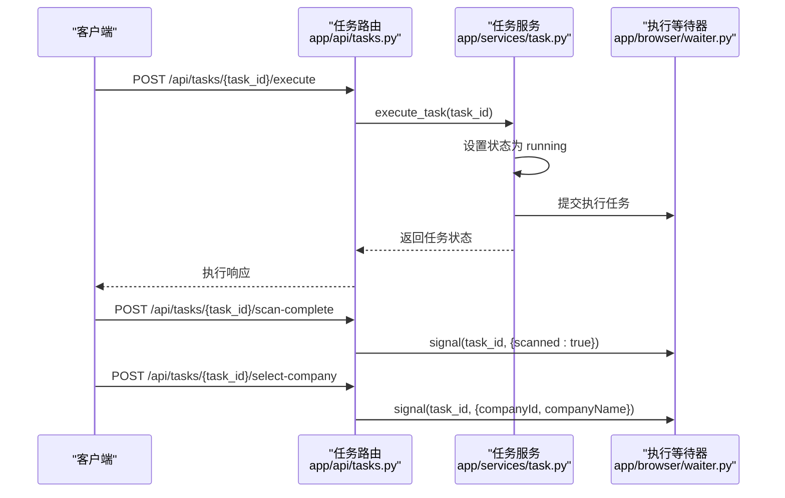
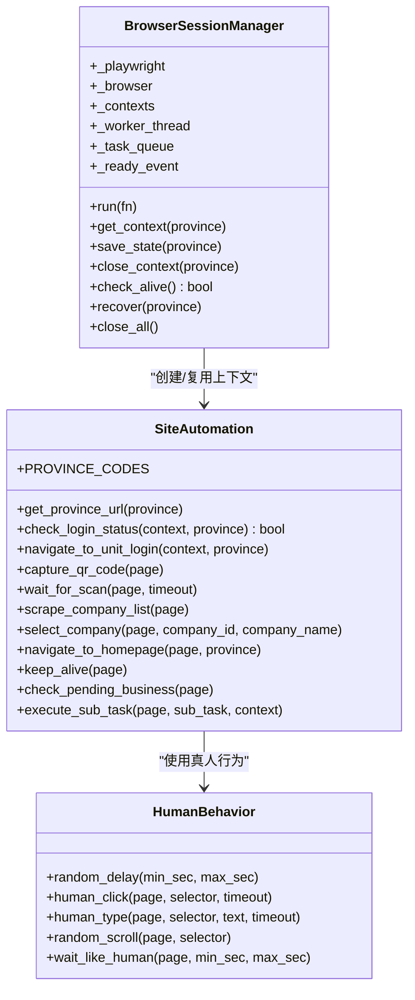
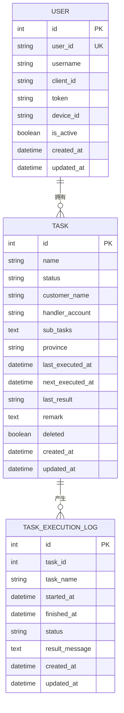
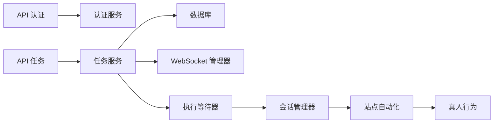

# 后端服务架构

<cite>
**本文引用的文件**
- [main.py](file://CCC_RPA_API/app/main.py)
- [config.py](file://CCC_RPA_API/app/config.py)
- [database.py](file://CCC_RPA_API/app/database.py)
- [base.py](file://CCC_RPA_API/app/models/base.py)
- [task.py](file://CCC_RPA_API/app/models/task.py)
- [user.py](file://CCC_RPA_API/app/models/user.py)
- [execution_log.py](file://CCC_RPA_API/app/models/execution_log.py)
- [auth.py](file://CCC_RPA_API/app/api/auth.py)
- [tasks.py](file://CCC_RPA_API/app/api/tasks.py)
- [manager.py](file://CCC_RPA_API/app/ws/manager.py)
- [auth.py](file://CCC_RPA_API/app/services/auth.py)
- [task.py](file://CCC_RPA_API/app/services/task.py)
- [session_manager.py](file://CCC_RPA_API/app/browser/session_manager.py)
- [site_automation.py](file://CCC_RPA_API/app/browser/site_automation.py)
- [human_behavior.py](file://CCC_RPA_API/app/browser/human_behavior.py)
- [waiter.py](file://CCC_RPA_API/app/browser/waiter.py)
</cite>

## 目录
1. [简介](#简介)
2. [项目结构](#项目结构)
3. [核心组件](#核心组件)
4. [架构总览](#架构总览)
5. [详细组件分析](#详细组件分析)
6. [依赖关系分析](#依赖关系分析)
7. [性能考量](#性能考量)
8. [故障排查指南](#故障排查指南)
9. [结论](#结论)
10. [附录](#附录)

## 简介
本项目是一个基于 FastAPI 的后端服务，提供任务管理与浏览器自动化执行能力。系统包含以下关键能力：
- RESTful API 网关：认证、任务管理、执行日志查询、实时通信。
- WebSocket 实时通信：用于推送执行状态与交互信号。
- 统一认证授权：基于用户令牌与设备绑定的简易认证体系。
- 任务管理系统：任务生命周期管理、调度与状态跟踪。
- 浏览器会话管理：Playwright 会话创建、持久化、状态监控与恢复。
- 数据模型与数据库：基于 SQLAlchemy ORM 的模型定义与迁移策略。

## 项目结构
后端服务位于 CCC_RPA_API 目录，采用分层架构：
- 应用入口与路由：app/main.py 定义 FastAPI 应用、CORS、路由注册、WebSocket 端点与启动/关闭钩子。
- 配置与数据库：app/config.py 提供数据库连接配置；app/database.py 创建引擎与会话工厂。
- 模型层：app/models/* 定义 BaseModel 抽象基类与具体模型（User、Task、TaskExecutionLog）。
- API 层：app/api/* 定义认证与任务相关的路由。
- 服务层：app/services/* 实现业务逻辑（认证服务、任务服务、执行器）。
- 浏览器自动化：app/browser/* 封装 Playwright 会话管理、站点自动化、真人行为模拟与执行等待器。
- WebSocket 管理：app/ws/manager.py 提供连接管理与广播。

图表来源
- [main.py:1-115](file://CCC_RPA_API/app/main.py#L1-L115)
- [auth.py:1-24](file://CCC_RPA_API/app/api/auth.py#L1-L24)
- [tasks.py:1-76](file://CCC_RPA_API/app/api/tasks.py#L1-L76)
- [auth.py:1-58](file://CCC_RPA_API/app/services/auth.py#L1-L58)
- [task.py:1-153](file://CCC_RPA_API/app/services/task.py#L1-L153)
- [database.py:1-19](file://CCC_RPA_API/app/database.py#L1-L19)
- [manager.py:1-29](file://CCC_RPA_API/app/ws/manager.py#L1-L29)
- [session_manager.py:1-183](file://CCC_RPA_API/app/browser/session_manager.py#L1-L183)
- [site_automation.py:1-562](file://CCC_RPA_API/app/browser/site_automation.py#L1-L562)
- [human_behavior.py:1-86](file://CCC_RPA_API/app/browser/human_behavior.py#L1-L86)
- [waiter.py:1-84](file://CCC_RPA_API/app/browser/waiter.py#L1-L84)

章节来源
- [main.py:1-115](file://CCC_RPA_API/app/main.py#L1-L115)
- [config.py:1-22](file://CCC_RPA_API/app/config.py#L1-L22)
- [database.py:1-19](file://CCC_RPA_API/app/database.py#L1-L19)

## 核心组件
- 应用入口与生命周期
  - 启动事件：创建数据库表、动态迁移字段、插入初始任务数据、捕获事件循环以供 WebSocket 广播。
  - 关闭事件：关闭所有浏览器会话，确保资源释放。
  - 健康检查端点：/health 返回服务状态。
- 认证与授权
  - 登录：根据 client_id 创建或更新用户记录，更新 token 与设备信息。
  - 登出：将用户标记为非活跃。
  - 校验：验证用户是否有效。
- 任务管理
  - 查询、创建、更新、删除任务。
  - 执行任务：设置任务状态为运行中，提交执行任务至后台线程。
  - 日志查询：按任务 ID 查询执行日志。
  - 交互信号：扫描完成、选择单位、取消执行，通过 ExecutionWaiter 触发。
- WebSocket 实时通信
  - /ws 端点：接受连接并维持长连接，ConnectionManager 负责广播消息并清理无效连接。
- 数据库与模型
  - 配置：MySQL 连接字符串，池参数优化。
  - 模型：抽象 BaseModel 提供创建/更新时间戳；User、Task、TaskExecutionLog 定义字段与索引。
- 浏览器会话管理
  - 专用工作线程：隔离 Playwright 同步 API，避免与 asyncio 冲突。
  - 按省份上下文：持久化 storage_state，支持恢复与跨会话状态共享。
  - 保活与恢复：自动保活、异常恢复、优雅关闭。

章节来源
- [main.py:1-115](file://CCC_RPA_API/app/main.py#L1-L115)
- [auth.py:1-24](file://CCC_RPA_API/app/api/auth.py#L1-L24)
- [auth.py:1-58](file://CCC_RPA_API/app/services/auth.py#L1-L58)
- [tasks.py:1-76](file://CCC_RPA_API/app/api/tasks.py#L1-L76)
- [task.py:1-153](file://CCC_RPA_API/app/services/task.py#L1-L153)
- [manager.py:1-29](file://CCC_RPA_API/app/ws/manager.py#L1-L29)
- [config.py:1-22](file://CCC_RPA_API/app/config.py#L1-L22)
- [database.py:1-19](file://CCC_RPA_API/app/database.py#L1-L19)
- [base.py:1-11](file://CCC_RPA_API/app/models/base.py#L1-L11)
- [user.py:1-17](file://CCC_RPA_API/app/models/user.py#L1-L17)
- [task.py:1-23](file://CCC_RPA_API/app/models/task.py#L1-L23)
- [execution_log.py:1-17](file://CCC_RPA_API/app/models/execution_log.py#L1-L17)
- [session_manager.py:1-183](file://CCC_RPA_API/app/browser/session_manager.py#L1-L183)
- [site_automation.py:1-562](file://CCC_RPA_API/app/browser/site_automation.py#L1-L562)
- [human_behavior.py:1-86](file://CCC_RPA_API/app/browser/human_behavior.py#L1-L86)
- [waiter.py:1-84](file://CCC_RPA_API/app/browser/waiter.py#L1-L84)

## 架构总览
系统采用“API 网关 + 服务层 + 数据层 + 自动化执行层”的分层设计，核心交互如下：

图表来源
- [main.py:1-115](file://CCC_RPA_API/app/main.py#L1-L115)
- [auth.py:1-24](file://CCC_RPA_API/app/api/auth.py#L1-L24)
- [tasks.py:1-76](file://CCC_RPA_API/app/api/tasks.py#L1-L76)
- [auth.py:1-58](file://CCC_RPA_API/app/services/auth.py#L1-L58)
- [task.py:1-153](file://CCC_RPA_API/app/services/task.py#L1-L153)
- [manager.py:1-29](file://CCC_RPA_API/app/ws/manager.py#L1-L29)
- [database.py:1-19](file://CCC_RPA_API/app/database.py#L1-L19)
- [session_manager.py:1-183](file://CCC_RPA_API/app/browser/session_manager.py#L1-L183)
- [site_automation.py:1-562](file://CCC_RPA_API/app/browser/site_automation.py#L1-L562)
- [human_behavior.py:1-86](file://CCC_RPA_API/app/browser/human_behavior.py#L1-L86)
- [waiter.py:1-84](file://CCC_RPA_API/app/browser/waiter.py#L1-L84)

## 详细组件分析

### RESTful API 接口规范
- 认证接口
  - POST /api/auth/login：登录，返回用户标识、用户名与令牌。
  - POST /api/auth/logout：登出，标记用户非活跃。
  - GET /api/auth/verify：校验用户有效性。
- 任务接口
  - GET /api/tasks：分页查询任务，支持关键词与状态过滤。
  - POST /api/tasks：创建任务。
  - GET /api/tasks/{task_id}：获取任务详情。
  - PUT /api/tasks/{task_id}：更新任务。
  - DELETE /api/tasks/{task_id}：软删除任务。
  - POST /api/tasks/{task_id}/execute：执行任务。
  - GET /api/tasks/{task_id}/logs：查询任务执行日志。
  - POST /api/tasks/{task_id}/scan-complete：扫码完成信号。
  - POST /api/tasks/{task_id}/select-company：选择单位信号。
  - POST /api/tasks/{task_id}/cancel-execution：取消执行信号。

章节来源
- [auth.py:1-24](file://CCC_RPA_API/app/api/auth.py#L1-L24)
- [tasks.py:1-76](file://CCC_RPA_API/app/api/tasks.py#L1-L76)

### WebSocket 实时通信机制
- 端点：/ws
- 连接管理：ConnectionManager 维护连接集合，支持广播消息与清理断开连接。
- 使用场景：向客户端推送任务状态、扫码提示、执行进度等。

图表来源
- [manager.py:1-29](file://CCC_RPA_API/app/ws/manager.py#L1-L29)
- [tasks.py:47-52](file://CCC_RPA_API/app/api/tasks.py#L47-L52)
- [task.py:115-129](file://CCC_RPA_API/app/services/task.py#L115-L129)

章节来源
- [manager.py:1-29](file://CCC_RPA_API/app/ws/manager.py#L1-L29)
- [tasks.py:102-115](file://CCC_RPA_API/app/api/tasks.py#L102-L115)

### 统一认证授权体系
- 用户模型：包含 user_id、client_id、username、token、device_id、is_active 等字段。
- 登录流程：若用户不存在则创建，否则更新 token、设备与用户名；返回用户标识与令牌。
- 校验流程：根据 user_id 查询用户，返回有效性与基本信息。

图表来源
- [auth.py:9-38](file://CCC_RPA_API/app/services/auth.py#L9-L38)
- [user.py:1-17](file://CCC_RPA_API/app/models/user.py#L1-L17)

章节来源
- [auth.py:1-58](file://CCC_RPA_API/app/services/auth.py#L1-L58)
- [user.py:1-17](file://CCC_RPA_API/app/models/user.py#L1-L17)

### 任务管理系统
- 生命周期管理
  - 创建：接收任务数据，JSON 序列化子任务列表，写入数据库。
  - 更新：排除未设置字段，JSON 序列化子任务列表，提交更新。
  - 删除：软删除（标记 deleted）。
  - 执行：设置状态为 running，提交执行任务至后台线程。
  - 日志：按任务 ID 分页查询执行日志。
- 交互信号
  - 扫码完成：触发 scan-complete，唤醒等待。
  - 选择单位：触发 select-company，携带公司 ID 与名称。
  - 取消执行：触发 cancel-execution，取消等待。

图表来源
- [tasks.py:47-75](file://CCC_RPA_API/app/api/tasks.py#L47-L75)
- [task.py:115-129](file://CCC_RPA_API/app/services/task.py#L115-L129)
- [waiter.py:35-43](file://CCC_RPA_API/app/browser/waiter.py#L35-L43)

章节来源
- [tasks.py:1-76](file://CCC_RPA_API/app/api/tasks.py#L1-L76)
- [task.py:1-153](file://CCC_RPA_API/app/services/task.py#L1-L153)
- [waiter.py:1-84](file://CCC_RPA_API/app/browser/waiter.py#L1-L84)

### 浏览器会话管理服务
- 专用工作线程：启动 Playwright 与 Chromium，维护任务队列，避免与 asyncio 事件循环冲突。
- 上下文管理：按省份创建/复用 BrowserContext，持久化 storage_state，支持恢复。
- 保活与恢复：周期性保活、异常恢复、优雅关闭。
- 与任务执行集成：通过 ExecutionWaiter 与前端交互，等待扫码与选择单位。

图表来源
- [session_manager.py:1-183](file://CCC_RPA_API/app/browser/session_manager.py#L1-L183)
- [site_automation.py:1-562](file://CCC_RPA_API/app/browser/site_automation.py#L1-L562)
- [human_behavior.py:1-86](file://CCC_RPA_API/app/browser/human_behavior.py#L1-L86)

章节来源
- [session_manager.py:1-183](file://CCC_RPA_API/app/browser/session_manager.py#L1-L183)
- [site_automation.py:1-562](file://CCC_RPA_API/app/browser/site_automation.py#L1-L562)
- [human_behavior.py:1-86](file://CCC_RPA_API/app/browser/human_behavior.py#L1-L86)

### 数据模型设计
- 抽象基类 BaseModel：统一 created_at、updated_at 时间戳。
- User：用户标识、客户端标识、用户名、令牌、设备标识、活跃状态。
- Task：任务名称、状态、客户名、经办账号、子任务列表（JSON）、省/直辖市、最近/下次执行时间、最近结果、备注、删除标记。
- TaskExecutionLog：任务执行日志，包含任务 ID/名称、开始/结束时间、状态、结果消息。

图表来源
- [base.py:1-11](file://CCC_RPA_API/app/models/base.py#L1-L11)
- [user.py:1-17](file://CCC_RPA_API/app/models/user.py#L1-L17)
- [task.py:1-23](file://CCC_RPA_API/app/models/task.py#L1-L23)
- [execution_log.py:1-17](file://CCC_RPA_API/app/models/execution_log.py#L1-L17)

章节来源
- [base.py:1-11](file://CCC_RPA_API/app/models/base.py#L1-L11)
- [user.py:1-17](file://CCC_RPA_API/app/models/user.py#L1-L17)
- [task.py:1-23](file://CCC_RPA_API/app/models/task.py#L1-L23)
- [execution_log.py:1-17](file://CCC_RPA_API/app/models/execution_log.py#L1-L17)

### 数据库设计与配置
- 连接配置：MySQL 连接字符串，支持环境变量覆盖。
- 引擎与会话：启用 pool_pre_ping、pool_recycle，保证连接健康。
- 启动迁移：动态添加任务表字段（如 predecessor_id、sub_tasks、province、predecessor_tasks、customer_name、handler_account），并插入初始任务数据。
- 模型映射：通过 DeclarativeBase 映射到数据库表。

章节来源
- [config.py:1-22](file://CCC_RPA_API/app/config.py#L1-L22)
- [database.py:1-19](file://CCC_RPA_API/app/database.py#L1-L19)
- [main.py:35-90](file://CCC_RPA_API/app/main.py#L35-L90)

### 服务间通信与微服务架构
- 当前实现：单体 FastAPI 应用，内部通过模块化组织（API、服务、模型、浏览器自动化）。
- 微服务建议：可将浏览器自动化独立为服务，通过消息队列或 gRPC 与主服务解耦；WebSocket 可拆分为独立网关或通过事件总线广播。

## 依赖关系分析
- 组件耦合
  - API 层依赖服务层；服务层依赖数据库层与浏览器会话管理。
  - WebSocket 管理器与 API 层松耦合，通过广播接口交互。
  - 浏览器会话管理器与站点自动化强耦合，但通过专用线程隔离外部事件循环。
- 外部依赖
  - FastAPI、SQLAlchemy、Pydantic、Playwright、pymysql。
- 潜在风险
  - 同步 Playwright 与异步 FastAPI 事件循环的隔离需持续保障。
  - 动态迁移字段在生产环境应改为 Alembic 迁移脚本。

图表来源
- [auth.py:1-24](file://CCC_RPA_API/app/api/auth.py#L1-L24)
- [tasks.py:1-76](file://CCC_RPA_API/app/api/tasks.py#L1-L76)
- [auth.py:1-58](file://CCC_RPA_API/app/services/auth.py#L1-L58)
- [task.py:1-153](file://CCC_RPA_API/app/services/task.py#L1-L153)
- [manager.py:1-29](file://CCC_RPA_API/app/ws/manager.py#L1-L29)
- [session_manager.py:1-183](file://CCC_RPA_API/app/browser/session_manager.py#L1-L183)
- [site_automation.py:1-562](file://CCC_RPA_API/app/browser/site_automation.py#L1-L562)
- [human_behavior.py:1-86](file://CCC_RPA_API/app/browser/human_behavior.py#L1-L86)
- [waiter.py:1-84](file://CCC_RPA_API/app/browser/waiter.py#L1-L84)

章节来源
- [main.py:1-115](file://CCC_RPA_API/app/main.py#L1-L115)
- [database.py:1-19](file://CCC_RPA_API/app/database.py#L1-L19)

## 性能考量
- 数据库连接池：启用 pool_pre_ping 与 pool_recycle，减少连接失效导致的重试。
- 事件循环隔离：Playwright 在专用线程执行，避免阻塞主事件循环。
- WebSocket 广播：批量发送与清理无效连接，降低内存占用。
- 任务执行：将耗时操作放入后台线程，避免阻塞 API 响应。
- 图像与截图：临时文件路径与降级策略，避免磁盘 IO 影响稳定性。

## 故障排查指南
- WebSocket 连接异常
  - 现象：连接断开、消息无法广播。
  - 排查：确认连接管理器是否清理无效连接；检查客户端网络与防火墙。
- Playwright 初始化失败
  - 现象：浏览器不可用、会话恢复频繁。
  - 排查：查看专用线程日志；确认 Chromium 参数与沙箱设置；检查存储目录权限。
- 任务执行卡住
  - 现象：任务状态长时间为 running。
  - 排查：检查 ExecutionWaiter 是否收到信号；查看站点自动化页面截图与日志；确认扫码/选择单位流程。
- 数据库迁移问题
  - 现象：字段缺失或类型不一致。
  - 排查：将动态迁移改为 Alembic 脚本；在测试环境验证迁移后再上线。

章节来源
- [manager.py:17-26](file://CCC_RPA_API/app/ws/manager.py#L17-L26)
- [session_manager.py:39-74](file://CCC_RPA_API/app/browser/session_manager.py#L39-L74)
- [site_automation.py:10-13](file://CCC_RPA_API/app/browser/site_automation.py#L10-L13)
- [waiter.py:29-32](file://CCC_RPA_API/app/browser/waiter.py#L29-L32)
- [main.py:44-74](file://CCC_RPA_API/app/main.py#L44-L74)

## 结论
本项目以 FastAPI 为核心，结合 Playwright 实现浏览器自动化与任务编排，具备清晰的分层架构与可扩展的模块划分。通过 WebSocket 实现实时通信，通过统一认证体系保障安全，通过数据库模型与服务层实现任务全生命周期管理。建议后续引入消息队列与迁移脚本，进一步提升系统的可靠性与可维护性。

## 附录
- 健康检查：GET /health
- 认证接口：POST /api/auth/login、POST /api/auth/logout、GET /api/auth/verify
- 任务接口：GET/POST/PUT/DELETE /api/tasks、POST /api/tasks/{task_id}/execute、GET /api/tasks/{task_id}/logs、POST /api/tasks/{task_id}/scan-complete、POST /api/tasks/{task_id}/select-company、POST /api/tasks/{task_id}/cancel-execution
- WebSocket：/ws