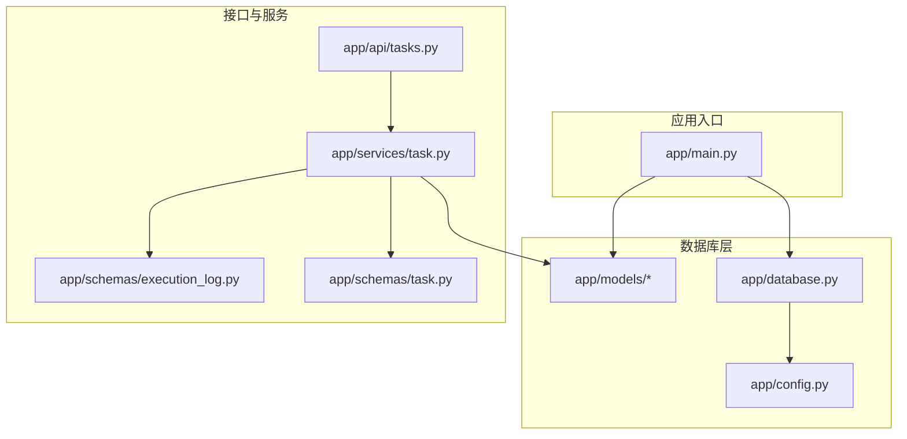
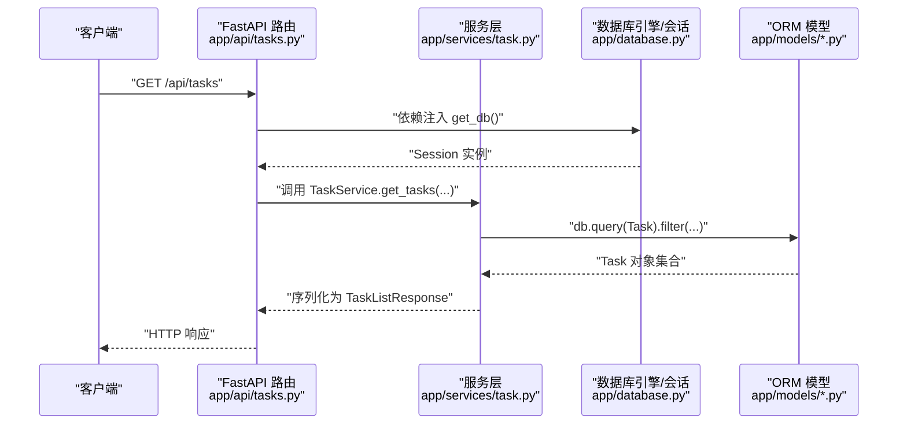
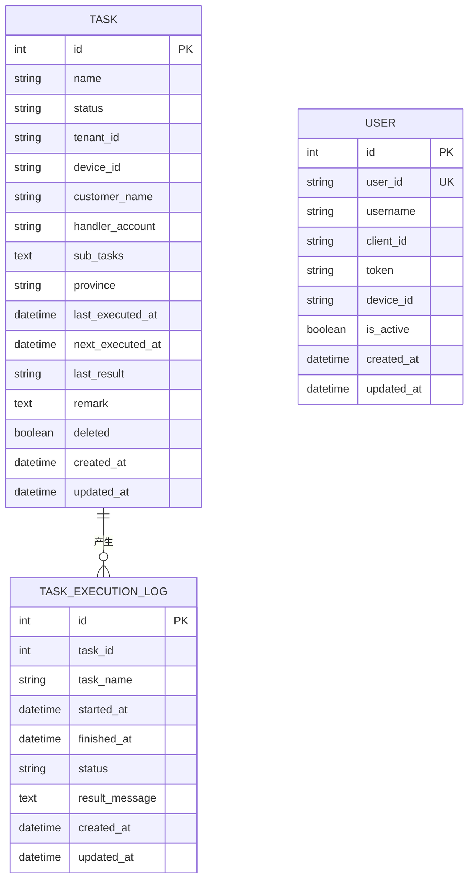
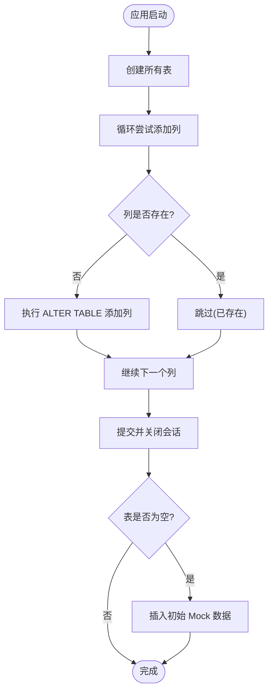
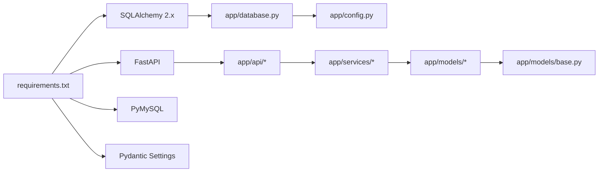

# 数据持久化

<cite>
**本文档引用的文件**
- [database.py](file://CCC_RPA_API/app/database.py)
- [config.py](file://CCC_RPA_API/app/config.py)
- [base.py](file://CCC_RPA_API/app/models/base.py)
- [task.py](file://CCC_RPA_API/app/models/task.py)
- [user.py](file://CCC_RPA_API/app/models/user.py)
- [execution_log.py](file://CCC_RPA_API/app/models/execution_log.py)
- [__init__.py](file://CCC_RPA_API/app/models/__init__.py)
- [main.py](file://CCC_RPA_API/app/main.py)
- [tasks.py](file://CCC_RPA_API/app/api/tasks.py)
- [task.py](file://CCC_RPA_API/app/services/task.py)
- [task.py](file://CCC_RPA_API/app/schemas/task.py)
- [execution_log.py](file://CCC_RPA_API/app/schemas/execution_log.py)
- [requirements.txt](file://CCC_RPA_API/requirements.txt)
</cite>

## 目录
1. [简介](#简介)
2. [项目结构](#项目结构)
3. [核心组件](#核心组件)
4. [架构总览](#架构总览)
5. [详细组件分析](#详细组件分析)
6. [依赖分析](#依赖分析)
7. [性能考虑](#性能考虑)
8. [故障排查指南](#故障排查指南)
9. [结论](#结论)
10. [附录](#附录)

## 简介
本文件系统性梳理后端服务的数据持久化方案，围绕基于 SQLAlchemy 的 ORM 设计、数据库连接管理、核心数据模型（Task、User、TaskExecutionLog）及其关系与约束、数据库配置与连接池策略、数据迁移与版本管理、数据验证与业务约束、索引优化与查询调优、备份恢复与事务管理最佳实践、以及缓存与一致性保障进行深入说明。内容兼顾工程落地与可维护性，适合不同技术背景的读者。

## 项目结构
后端采用 FastAPI + SQLAlchemy 2.x 架构，数据库层位于 app/database.py，ORM 模型位于 app/models 下，应用入口在 app/main.py 中完成元数据创建与迁移脚本注入；API 路由与服务层分别在 app/api 与 app/services 中，数据验证通过 Pydantic 模型在 app/schemas 中定义。

图示来源
- [main.py:1-127](file://CCC_RPA_API/app/main.py#L1-L127)
- [database.py:1-19](file://CCC_RPA_API/app/database.py#L1-L19)
- [config.py:1-22](file://CCC_RPA_API/app/config.py#L1-L22)
- [tasks.py:1-76](file://CCC_RPA_API/app/api/tasks.py#L1-L76)
- [task.py:1-157](file://CCC_RPA_API/app/services/task.py#L1-L157)
- [task.py:1-58](file://CCC_RPA_API/app/schemas/task.py#L1-L58)
- [execution_log.py:1-19](file://CCC_RPA_API/app/schemas/execution_log.py#L1-L19)

章节来源
- [main.py:1-127](file://CCC_RPA_API/app/main.py#L1-L127)
- [database.py:1-19](file://CCC_RPA_API/app/database.py#L1-L19)
- [config.py:1-22](file://CCC_RPA_API/app/config.py#L1-L22)

## 核心组件
- 数据库引擎与会话：通过 create_engine 创建带连接池参数的引擎，并以 sessionmaker 绑定 autocommit/autoflush 行为；提供 get_db 依赖注入生成器，确保请求生命周期内正确关闭会话。
- 基类模型：BaseModel 抽象基类统一提供 created_at/updated_at 时间戳字段，便于审计与排序。
- 实体模型：Task、User、TaskExecutionLog 定义了核心业务实体及字段类型、索引与默认值。
- 应用启动流程：启动时创建所有表元数据，并执行多轮 ALTER TABLE 注入列，最后插入初始 Mock 数据。

章节来源
- [database.py:1-19](file://CCC_RPA_API/app/database.py#L1-L19)
- [base.py:1-11](file://CCC_RPA_API/app/models/base.py#L1-L11)
- [task.py:1-25](file://CCC_RPA_API/app/models/task.py#L1-L25)
- [user.py:1-17](file://CCC_RPA_API/app/models/user.py#L1-L17)
- [execution_log.py:1-17](file://CCC_RPA_API/app/models/execution_log.py#L1-L17)
- [main.py:37-102](file://CCC_RPA_API/app/main.py#L37-L102)

## 架构总览
下图展示从 FastAPI 请求到数据库的典型调用链路，包括依赖注入、服务层处理、ORM 查询与写入、以及响应序列化。

图示来源
- [tasks.py:1-76](file://CCC_RPA_API/app/api/tasks.py#L1-L76)
- [task.py:44-64](file://CCC_RPA_API/app/services/task.py#L44-L64)
- [database.py:13-19](file://CCC_RPA_API/app/database.py#L13-L19)
- [task.py:1-25](file://CCC_RPA_API/app/models/task.py#L1-L25)

## 详细组件分析

### 数据库配置与连接池管理
- 连接字符串：通过 Settings.DATABASE_URL 动态拼接 MySQL 连接串，支持从 .env 加载环境变量。
- 引擎参数：启用 pool_pre_ping 用于连接存活探测，pool_recycle 控制连接回收周期，降低长时间空闲导致的连接失效风险。
- 会话策略：sessionmaker 绑定 engine，关闭自动 flush 与自动 commit，交由业务显式控制事务边界，避免隐式提交带来的副作用。
- 依赖注入：get_db 作为 FastAPI 依赖，每次请求创建新会话并在 finally 中关闭，确保资源释放与异常安全。

章节来源
- [config.py:6-15](file://CCC_RPA_API/app/config.py#L6-L15)
- [database.py:5-19](file://CCC_RPA_API/app/database.py#L5-L19)
- [main.py:37-40](file://CCC_RPA_API/app/main.py#L37-L40)

### ORM 基类与通用字段
- BaseModel 提供 created_at/updated_at 两个时间戳字段，created_at 默认服务器时间，updated_at 在更新时自动刷新。
- 所有实体继承该基类，统一审计能力，便于排序与筛选。

章节来源
- [base.py:7-11](file://CCC_RPA_API/app/models/base.py#L7-L11)

### 核心数据模型与关系
- Task（任务）
  - 关键字段：名称、状态、租户/设备标识、客户与经办人、子任务列表（JSON 文本）、省市区、最近/下次执行时间、结果状态、备注、软删除标记等。
  - 索引：name/status/deleted 建有索引，提升常用过滤与分页效率。
  - 约束：主键自增、字符串长度限制、布尔默认值、JSON 字段存储策略。
- User（用户）
  - 关键字段：user_id 唯一索引、用户名、client_id/token/device_id、激活状态。
  - 约束：user_id 唯一性、可选字段便于扩展。
- TaskExecutionLog（任务执行日志）
  - 关键字段：关联 task_id、任务名、开始/结束时间、状态、结果消息。
  - 索引：task_id 建有索引，便于按任务查询日志。
  - 约束：非空与可空字段明确，状态默认运行中。

图示来源
- [task.py:8-25](file://CCC_RPA_API/app/models/task.py#L8-L25)
- [user.py:7-17](file://CCC_RPA_API/app/models/user.py#L7-L17)
- [execution_log.py:7-17](file://CCC_RPA_API/app/models/execution_log.py#L7-L17)

章节来源
- [task.py:1-25](file://CCC_RPA_API/app/models/task.py#L1-L25)
- [user.py:1-17](file://CCC_RPA_API/app/models/user.py#L1-L17)
- [execution_log.py:1-17](file://CCC_RPA_API/app/models/execution_log.py#L1-L17)
- [__init__.py:1-5](file://CCC_RPA_API/app/models/__init__.py#L1-L5)

### 数据迁移与版本管理
- 启动时自动建表：Base.metadata.create_all(engine) 确保首次运行即具备所需表结构。
- 动态迁移：启动阶段对 tasks 表逐列添加，若列已存在则忽略异常，形成“幂等式”迁移策略，避免重复执行报错。
- 初始数据：当表为空时插入若干 Mock 任务，便于前端演示与快速验证。

图示来源
- [main.py:37-102](file://CCC_RPA_API/app/main.py#L37-L102)

章节来源
- [main.py:37-102](file://CCC_RPA_API/app/main.py#L37-L102)

### 数据验证与业务约束
- Pydantic 模型：TaskCreate/TaskUpdate/TaskResponse 与 ExecutionLogResponse/ExecutionLogListResponse 定义输入输出结构与字段校验。
- 服务层约束：TaskService 在更新时对 JSON 字段（如 sub_tasks）进行序列化处理；执行任务前检查任务存在性与软删除状态；执行状态切换与日志记录由上层触发器或调度器负责。
- 字段默认值与非空：模型层与迁移脚本共同保证关键字段的默认值与可空性，减少空值异常。

章节来源
- [task.py:5-58](file://CCC_RPA_API/app/schemas/task.py#L5-L58)
- [execution_log.py:4-19](file://CCC_RPA_API/app/schemas/execution_log.py#L4-L19)
- [task.py:74-107](file://CCC_RPA_API/app/services/task.py#L74-L107)

### 查询与事务管理
- 查询模式：API 层通过依赖注入获取 Session，服务层使用 db.query(...) 进行条件过滤、排序与分页；列表接口支持关键词与状态过滤。
- 事务边界：服务层在新增/更新/删除时显式 commit，确保原子性；异常时由调用方或框架处理回滚。
- 会话生命周期：get_db 生成器在请求结束时关闭会话，避免连接泄漏。

章节来源
- [tasks.py:13-15](file://CCC_RPA_API/app/api/tasks.py#L13-L15)
- [task.py:47-64](file://CCC_RPA_API/app/services/task.py#L47-L64)
- [database.py:13-19](file://CCC_RPA_API/app/database.py#L13-L19)

### 缓存策略与一致性
- 当前实现未见显式缓存层（Redis/Memcached），ORM 一级缓存由 SQLAlchemy 会话持有；建议对热点查询（如任务列表、用户信息）引入二级缓存与失效策略，结合数据库变更事件进行主动失效。
- 一致性建议：强一致场景使用短事务与必要索引；最终一致场景可采用消息队列异步更新缓存。

## 依赖分析
- 外部依赖：FastAPI、SQLAlchemy 2.x、PyMySQL、Pydantic Settings、python-dotenv 等。
- 内部模块耦合：API 路由依赖服务层；服务层依赖模型与会话；模型依赖基类与数据库引擎；配置通过 Settings 提供 DATABASE_URL。

图示来源
- [requirements.txt:1-11](file://CCC_RPA_API/requirements.txt#L1-L11)
- [tasks.py:1-76](file://CCC_RPA_API/app/api/tasks.py#L1-L76)
- [task.py:1-157](file://CCC_RPA_API/app/services/task.py#L1-L157)
- [database.py:1-19](file://CCC_RPA_API/app/database.py#L1-L19)
- [config.py:1-22](file://CCC_RPA_API/app/config.py#L1-L22)
- [base.py:1-11](file://CCC_RPA_API/app/models/base.py#L1-L11)

章节来源
- [requirements.txt:1-11](file://CCC_RPA_API/requirements.txt#L1-L11)

## 性能考虑
- 索引优化
  - 已建立：Task.name、Task.status、Task.deleted；TaskExecutionLog.task_id。
  - 建议：对常用过滤字段（如 tenant_id、device_id、customer_name）建立复合索引；对时间范围查询（last_executed_at/next_executed_at）建立索引。
- 分页与排序
  - 使用 id 或 created_at 降序分页，避免大 offset 导致的性能退化；必要时引入游标分页。
- 连接池
  - pool_pre_ping 与 pool_recycle 已启用；可根据并发峰值调整最大连接数与超时参数。
- 查询优化
  - 避免 N+1 查询：使用 join 或 selectinload；批量写入使用 add_all/ bulk_* 接口。
- 日志与监控
  - 开启 SQL 日志（开发环境）与慢查询告警，定期审查执行计划。

## 故障排查指南
- 连接失败
  - 检查 DATABASE_URL 是否正确，确认主机、端口、账号、密码与数据库名；核对 .env 文件加载。
- 表结构不一致
  - 启动日志中存在迁移警告时，确认 ALTER TABLE 是否成功；必要时手动执行或回滚。
- 事务异常
  - 确认服务层在异常时未 commit；使用 try/finally 或上下文管理器确保会话关闭。
- 性能问题
  - 使用 EXPLAIN 分析慢查询；补充缺失索引；优化分页策略。

章节来源
- [config.py:13-15](file://CCC_RPA_API/app/config.py#L13-L15)
- [main.py:85-86](file://CCC_RPA_API/app/main.py#L85-L86)
- [database.py:5-6](file://CCC_RPA_API/app/database.py#L5-L6)

## 结论
本项目采用清晰的分层架构与 SQLAlchemy 2.x ORM，结合 FastAPI 的依赖注入与 Pydantic 校验，实现了稳定的数据持久化能力。通过启动时自动建表与幂等迁移、统一的模型基类与索引策略、显式的事务边界与会话管理，满足了任务管理与执行日志的核心业务需求。建议后续引入缓存与监控体系，持续优化查询与索引，完善备份恢复与高可用策略。

## 附录
- 快速对照
  - 数据库引擎与会话：[database.py:5-19](file://CCC_RPA_API/app/database.py#L5-L19)
  - 配置与连接串：[config.py:6-15](file://CCC_RPA_API/app/config.py#L6-L15)
  - 模型基类与实体：[base.py:7-11](file://CCC_RPA_API/app/models/base.py#L7-L11)、[task.py:8-25](file://CCC_RPA_API/app/models/task.py#L8-L25)、[user.py:7-17](file://CCC_RPA_API/app/models/user.py#L7-L17)、[execution_log.py:7-17](file://CCC_RPA_API/app/models/execution_log.py#L7-L17)
  - 启动迁移与初始数据：[main.py:37-102](file://CCC_RPA_API/app/main.py#L37-L102)
  - API 与服务层交互：[tasks.py:13-15](file://CCC_RPA_API/app/api/tasks.py#L13-L15)、[task.py:47-64](file://CCC_RPA_API/app/services/task.py#L47-L64)