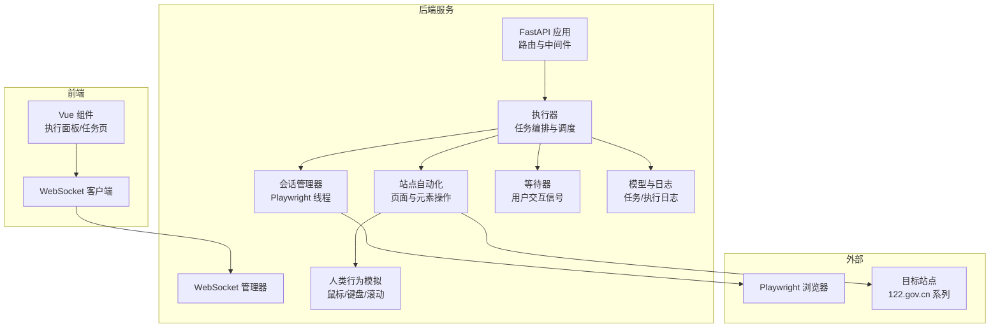
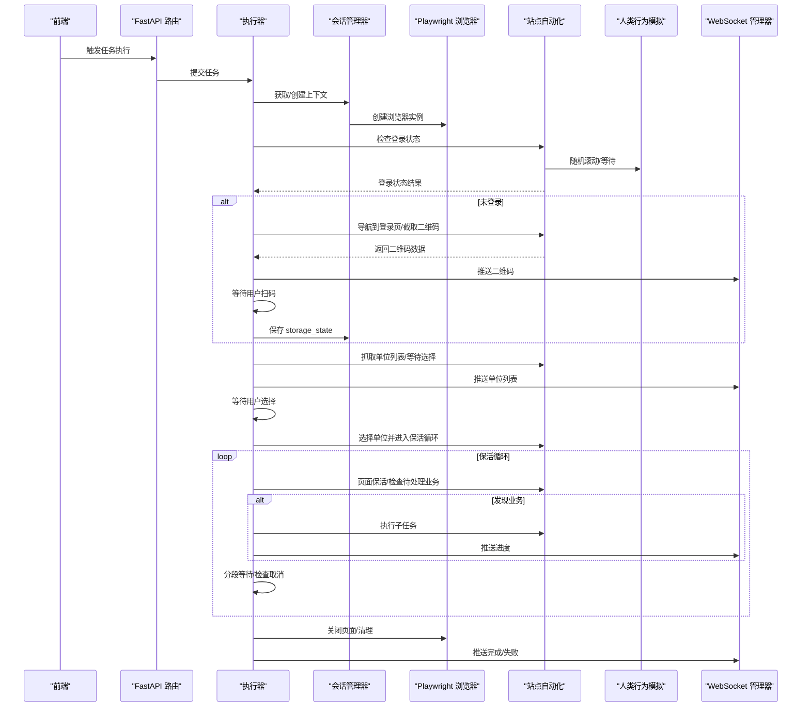
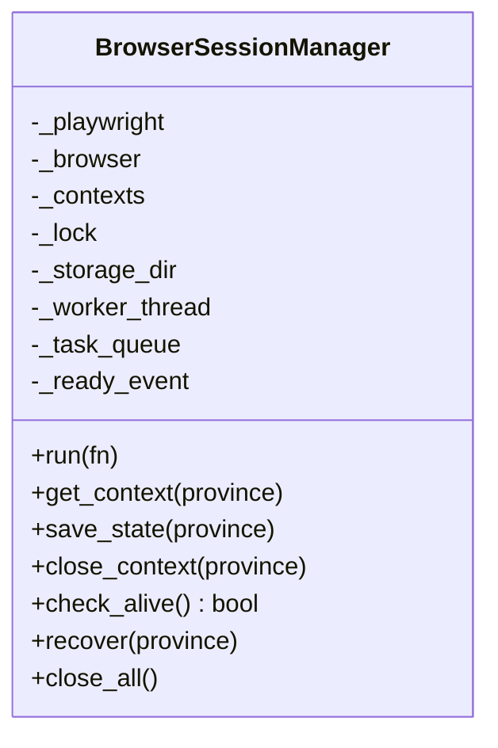
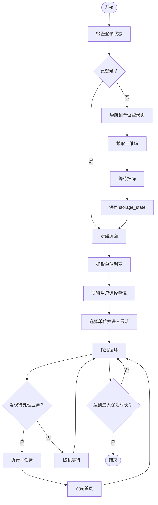
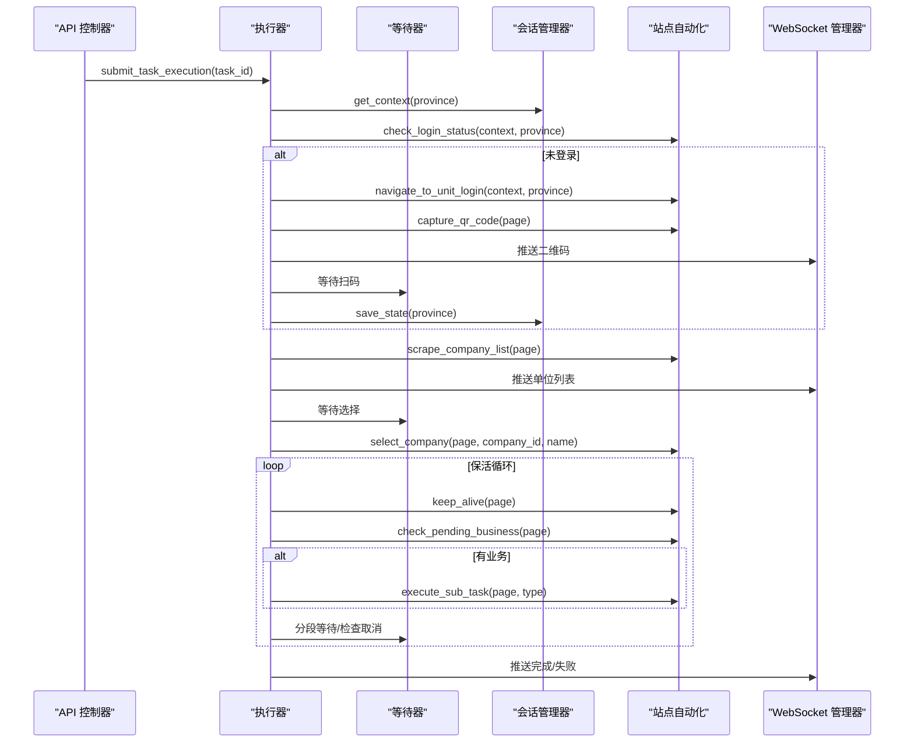
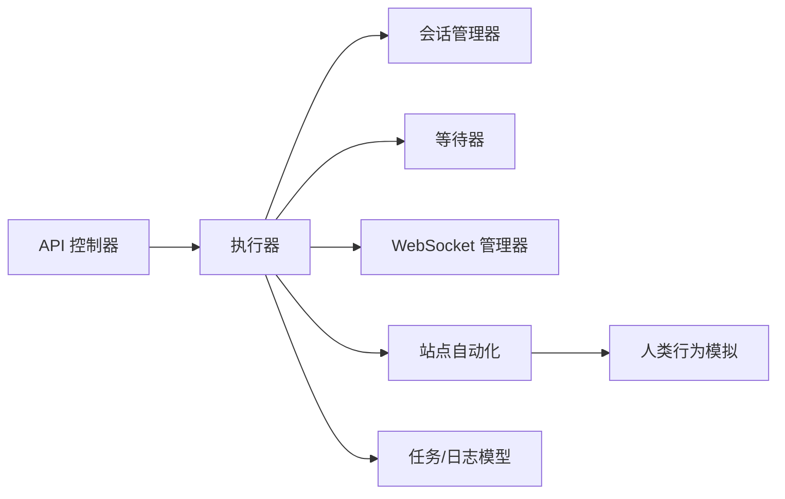

# 浏览器会话管理

<cite>
**本文档引用的文件**
- [session_manager.py](file://CCC_RPA_API/app/browser/session_manager.py)
- [site_automation.py](file://CCC_RPA_API/app/browser/site_automation.py)
- [human_behavior.py](file://CCC_RPA_API/app/browser/human_behavior.py)
- [waiter.py](file://CCC_RPA_API/app/browser/waiter.py)
- [executor.py](file://CCC_RPA_API/app/services/executor.py)
- [task.py](file://CCC_RPA_API/app/models/task.py)
- [execution_log.py](file://CCC_RPA_API/app/models/execution_log.py)
- [tasks.py](file://CCC_RPA_API/app/api/tasks.py)
- [manager.py](file://CCC_RPA_API/app/ws/manager.py)
- [main.py](file://CCC_RPA_API/app/main.py)
</cite>

## 目录
1. [简介](#简介)
2. [项目结构](#项目结构)
3. [核心组件](#核心组件)
4. [架构总览](#架构总览)
5. [详细组件分析](#详细组件分析)
6. [依赖关系分析](#依赖关系分析)
7. [性能考虑](#性能考虑)
8. [故障排查指南](#故障排查指南)
9. [结论](#结论)
10. [附录](#附录)

## 简介
本文件面向“浏览器会话管理”主题，围绕基于 Playwright 的会话生命周期、站点自动化执行流程、人类行为模拟、智能等待与超时处理、资源与并发控制、以及故障恢复与异常处理进行系统化说明。文档以代码为依据，结合可视化图示帮助读者快速理解并落地实施。

## 项目结构
后端采用 Python + FastAPI 构建，核心会话管理与自动化逻辑位于 CCC_RPA_API/app 下；前端位于 CCC-BrowserV4/frontend，通过 WebSocket 与后端通信；Tauri 桥接层位于 src-tauri，负责桌面端能力扩展。

图表来源
- [main.py:30-127](file://CCC_RPA_API/app/main.py#L30-L127)
- [executor.py:68-308](file://CCC_RPA_API/app/services/executor.py#L68-L308)
- [session_manager.py:7-183](file://CCC_RPA_API/app/browser/session_manager.py#L7-L183)
- [site_automation.py:16-562](file://CCC_RPA_API/app/browser/site_automation.py#L16-L562)
- [human_behavior.py:12-86](file://CCC_RPA_API/app/browser/human_behavior.py#L12-L86)
- [waiter.py:7-84](file://CCC_RPA_API/app/browser/waiter.py#L7-L84)
- [manager.py:1-29](file://CCC_RPA_API/app/ws/manager.py#L1-L29)

章节来源
- [main.py:1-127](file://CCC_RPA_API/app/main.py#L1-L127)
- [executor.py:1-308](file://CCC_RPA_API/app/services/executor.py#L1-L308)

## 核心组件
- 会话管理器：负责 Playwright 实例与浏览器上下文的创建、复用、持久化存储、健康检查与恢复。
- 站点自动化：封装目标站点的导航、扫码登录、单位选择、数据提取、保活与业务触发检测。
- 人类行为模拟：提供鼠标移动、键盘输入、随机滚动、随机等待等策略，降低被风控概率。
- 等待器：基于线程事件实现任务执行过程中的用户交互暂停/恢复与取消。
- 执行器：编排任务生命周期，协调会话、等待器、自动化与 WebSocket 广播。
- 模型与日志：记录任务状态与执行日志，支撑前端展示与审计。
- WebSocket 管理器：向前端推送实时进度、二维码、错误与状态更新。

章节来源
- [session_manager.py:7-183](file://CCC_RPA_API/app/browser/session_manager.py#L7-L183)
- [site_automation.py:16-562](file://CCC_RPA_API/app/browser/site_automation.py#L16-L562)
- [human_behavior.py:12-86](file://CCC_RPA_API/app/browser/human_behavior.py#L12-L86)
- [waiter.py:7-84](file://CCC_RPA_API/app/browser/waiter.py#L7-L84)
- [executor.py:1-308](file://CCC_RPA_API/app/services/executor.py#L1-L308)
- [task.py:8-25](file://CCC_RPA_API/app/models/task.py#L8-L25)
- [execution_log.py:7-17](file://CCC_RPA_API/app/models/execution_log.py#L7-L17)
- [manager.py:1-29](file://CCC_RPA_API/app/ws/manager.py#L1-L29)

## 架构总览
系统采用“主线程 + 专用 Playwright 工作线程”的设计，避免同步 API 与异步事件循环冲突；任务执行通过线程池调度，用户交互通过等待器与 WebSocket 实时联动。

图表来源
- [executor.py:68-308](file://CCC_RPA_API/app/services/executor.py#L68-L308)
- [session_manager.py:76-183](file://CCC_RPA_API/app/browser/session_manager.py#L76-L183)
- [site_automation.py:37-562](file://CCC_RPA_API/app/browser/site_automation.py#L37-L562)
- [human_behavior.py:12-86](file://CCC_RPA_API/app/browser/human_behavior.py#L12-L86)
- [manager.py:17-29](file://CCC_RPA_API/app/ws/manager.py#L17-L29)

## 详细组件分析

### 会话管理器（BrowserSessionManager）
职责与特性
- 单例化管理 Playwright 与 Chromium 实例，确保线程安全。
- 专用工作线程执行所有 Playwright 操作，避免与 asyncio 冲突。
- 按“省份”维度维护 BrowserContext，支持 storage_state 持久化与自动恢复。
- 提供运行任务、获取上下文、保存状态、关闭上下文、健康检查、恢复与全部关闭等方法。

关键流程
- 初始化：创建专用工作线程，启动 Playwright 与 Chromium，设置 ready 事件。
- 运行：将可调用对象放入队列，等待事件通知并返回结果或异常。
- 上下文：按省份读取或创建上下文，注入 user_agent、viewport、反检测脚本。
- 存储：将 storage_state 写入 data/browser_states 目录。
- 健康检查：通过 is_connected 判断浏览器连接状态。
- 恢复：关闭现有上下文与浏览器，重建实例并重新获取指定上下文。
- 关闭：关闭所有上下文与浏览器，释放资源。

图表来源
- [session_manager.py:7-183](file://CCC_RPA_API/app/browser/session_manager.py#L7-L183)

章节来源
- [session_manager.py:7-183](file://CCC_RPA_API/app/browser/session_manager.py#L7-L183)

### 站点自动化（SiteAutomation）
职责与特性
- 封装目标站点的登录、导航、元素交互与数据提取。
- 提供二维码截取、扫码等待、单位列表抓取、单位选择、首页跳转、页面保活、待处理业务检测与子任务执行占位。
- 使用人类行为模拟提升稳定性与抗风控能力。

关键流程
- 登录状态检查：新建页面访问省站首页，检测“退出”或用户信息元素。
- 导航到单位登录：优先直连 gab.122.gov.cn/m/login?t=2，否则回退到首页 JS 强制点击。
- 二维码截取：优先元素截图，失败则整页降级截图。
- 扫码等待：基于 URL 变化或成功元素检测。
- 单位列表抓取：多级选择器降级策略，必要时从页面文本提取。
- 单位选择：按 data-id、文本、名称或索引匹配，模拟鼠标移动与点击。
- 页面保活：随机滚动、点击刷新、随机点击链接、随机等待，周期性检测待处理业务。
- 待处理业务：通过徽标计数与关键词匹配检测业务类型。
- 子任务执行：占位实现，后续替换为具体业务。

图表来源
- [site_automation.py:37-562](file://CCC_RPA_API/app/browser/site_automation.py#L37-L562)
- [human_behavior.py:12-86](file://CCC_RPA_API/app/browser/human_behavior.py#L12-L86)

章节来源
- [site_automation.py:16-562](file://CCC_RPA_API/app/browser/site_automation.py#L16-L562)

### 人类行为模拟（HumanBehavior）
职责与特性
- 提供随机延迟、人类点击、人类打字、随机滚动、模拟阅读等待等行为策略。
- 所有操作均在后台线程执行，避免与事件循环冲突。

章节来源
- [human_behavior.py:12-86](file://CCC_RPA_API/app/browser/human_behavior.py#L12-L86)

### 等待器（ExecutionWaiter）
职责与特性
- 基于线程事件实现任务执行过程中的暂停/恢复与取消。
- 支持阻塞等待、非阻塞检查、注册检查、清理资源。
- 与执行器配合，实现扫码登录与单位选择的人机交互。

章节来源
- [waiter.py:7-84](file://CCC_RPA_API/app/browser/waiter.py#L7-L84)

### 执行器（Executor）
职责与特性
- 任务生命周期编排：初始化浏览器、检查登录、扫码登录、保存状态、抓取单位、等待选择、选择单位、保活循环、完成清理。
- 线程池与专用等待线程：避免阻塞 Playwright 工作线程。
- WebSocket 广播：向前端推送进度、二维码、错误与状态更新。
- 故障恢复：检测浏览器存活，异常时恢复会话并重开页面。
- 日志与状态：记录任务执行日志与最终状态。

图表来源
- [executor.py:68-308](file://CCC_RPA_API/app/services/executor.py#L68-L308)
- [waiter.py:14-84](file://CCC_RPA_API/app/browser/waiter.py#L14-L84)
- [session_manager.py:95-183](file://CCC_RPA_API/app/browser/session_manager.py#L95-L183)
- [site_automation.py:37-562](file://CCC_RPA_API/app/browser/site_automation.py#L37-L562)
- [manager.py:17-29](file://CCC_RPA_API/app/ws/manager.py#L17-L29)

章节来源
- [executor.py:1-308](file://CCC_RPA_API/app/services/executor.py#L1-L308)

### 模型与日志
- 任务模型：记录任务基本信息、状态、执行时间与结果。
- 执行日志模型：记录每次任务的执行起止时间、状态与结果消息。

章节来源
- [task.py:8-25](file://CCC_RPA_API/app/models/task.py#L8-L25)
- [execution_log.py:7-17](file://CCC_RPA_API/app/models/execution_log.py#L7-L17)

### WebSocket 管理器
- 管理所有 WebSocket 连接，支持广播消息。
- 在工作线程中安全地通过主事件循环广播消息，避免并发问题。

章节来源
- [manager.py:1-29](file://CCC_RPA_API/app/ws/manager.py#L1-L29)
- [main.py:22-35](file://CCC_RPA_API/app/main.py#L22-L35)

## 依赖关系分析
组件耦合与协作
- 执行器依赖会话管理器、站点自动化、等待器与 WebSocket 管理器。
- 会话管理器依赖 Playwright，负责上下文与存储。
- 站点自动化依赖人类行为模拟，提供页面级操作。
- API 控制器通过路由触发执行器，等待器与 WebSocket 作为交互通道。
- 数据模型支撑任务与执行日志的持久化。

图表来源
- [executor.py:12-33](file://CCC_RPA_API/app/services/executor.py#L12-L33)
- [session_manager.py:12-20](file://CCC_RPA_API/app/browser/session_manager.py#L12-L20)
- [site_automation.py:5](file://CCC_RPA_API/app/browser/site_automation.py#L5)
- [human_behavior.py:12-86](file://CCC_RPA_API/app/browser/human_behavior.py#L12-L86)
- [tasks.py:1-76](file://CCC_RPA_API/app/api/tasks.py#L1-L76)
- [manager.py:1-29](file://CCC_RPA_API/app/ws/manager.py#L1-L29)

章节来源
- [executor.py:1-33](file://CCC_RPA_API/app/services/executor.py#L1-L33)
- [tasks.py:1-76](file://CCC_RPA_API/app/api/tasks.py#L1-L76)

## 性能考虑
- 线程隔离：所有 Playwright 操作在专用工作线程执行，避免阻塞主线程与事件循环。
- 上下文复用：按省份缓存 BrowserContext，减少重复启动成本；storage_state 持久化避免重复登录。
- 等待策略：使用随机延迟与分段等待，平衡稳定性与吞吐量。
- 资源清理：任务完成后关闭页面与上下文，服务关闭时统一回收资源。
- 并发控制：线程池大小与等待线程池大小需根据目标站点负载与本地资源合理配置。

章节来源
- [session_manager.py:76-183](file://CCC_RPA_API/app/browser/session_manager.py#L76-L183)
- [executor.py:18-19](file://CCC_RPA_API/app/services/executor.py#L18-L19)
- [site_automation.py:436-500](file://CCC_RPA_API/app/browser/site_automation.py#L436-L500)

## 故障排查指南
常见问题与处理
- 浏览器异常或断开：执行器在关键步骤前检查存活，若异常则恢复会话并重新打开页面。
- 扫码超时：扫码等待超时或用户取消时抛出异常并终止任务。
- 元素定位失败：站点自动化提供多级选择器降级策略与文本提取兜底。
- 二维码截取失败：降级为整页截图并返回 base64 数据。
- 保活循环中断：支持取消信号与分段等待，及时响应用户取消。

章节来源
- [executor.py:35-59](file://CCC_RPA_API/app/services/executor.py#L35-L59)
- [site_automation.py:10-14](file://CCC_RPA_API/app/browser/site_automation.py#L10-L14)
- [site_automation.py:148-173](file://CCC_RPA_API/app/browser/site_automation.py#L148-L173)
- [site_automation.py:175-192](file://CCC_RPA_API/app/browser/site_automation.py#L175-L192)
- [site_automation.py:293-420](file://CCC_RPA_API/app/browser/site_automation.py#L293-L420)

## 结论
该系统通过专用 Playwright 工作线程、按省份上下文管理、storage_state 持久化与人类行为模拟，构建了稳定可靠的浏览器会话管理体系。执行器将任务生命周期、用户交互与站点自动化有机结合，配合 WebSocket 实时反馈与完善的日志体系，满足复杂站点的自动化需求。建议在生产环境中结合监控与告警，持续优化等待策略与并发参数，确保高可用与高性能。

## 附录
- API 路由与交互
  - 任务执行与状态：通过路由提交任务、推送扫码完成、选择单位与取消执行。
  - WebSocket：接收实时进度与结果。
- 健康检查
  - 后端健康接口与会话存活检查共同保障系统可用性。

章节来源
- [tasks.py:47-76](file://CCC_RPA_API/app/api/tasks.py#L47-L76)
- [main.py:114-117](file://CCC_RPA_API/app/main.py#L114-L117)
- [session_manager.py:144-151](file://CCC_RPA_API/app/browser/session_manager.py#L144-L151)