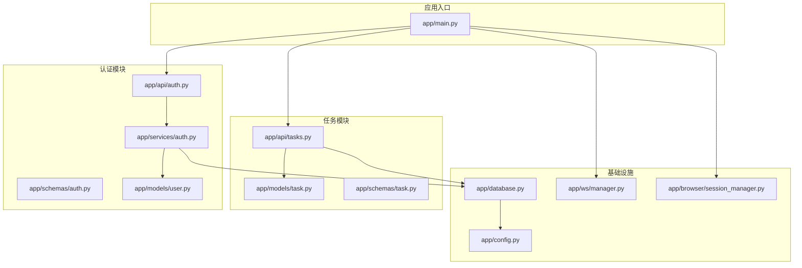
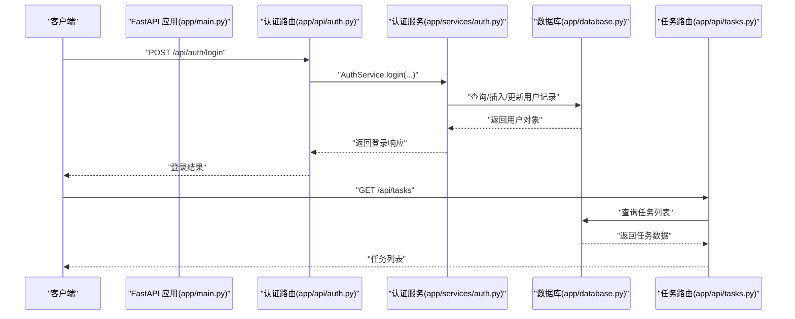
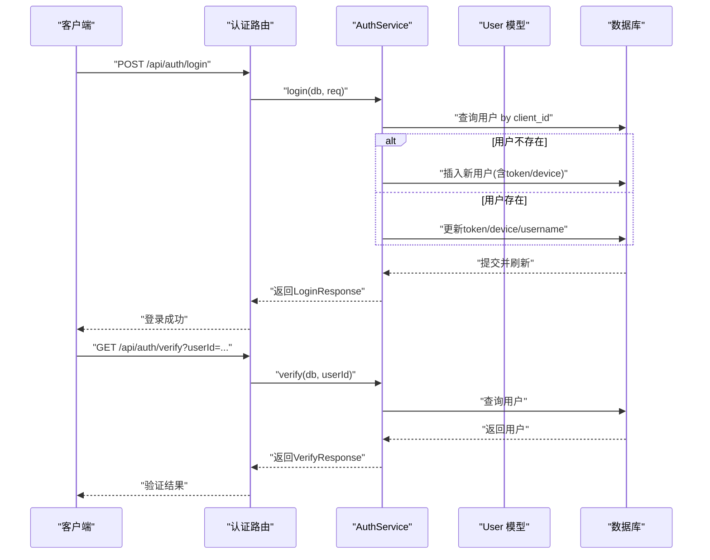
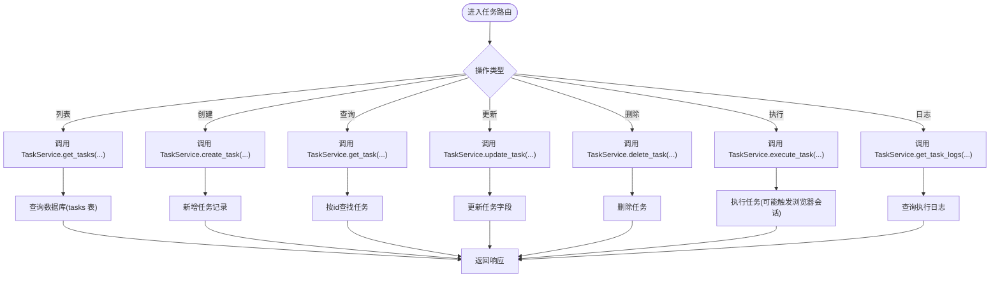
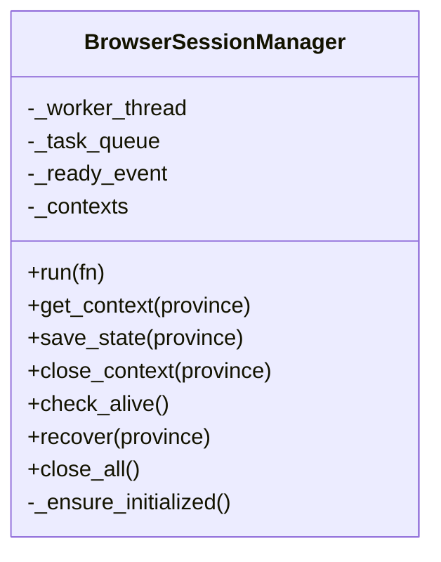
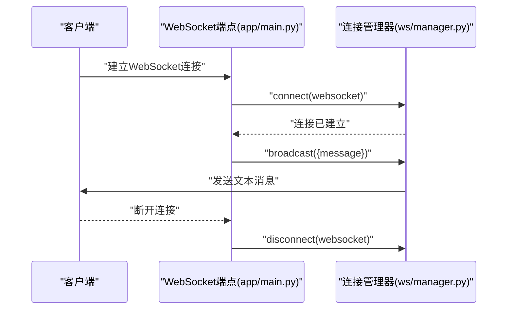
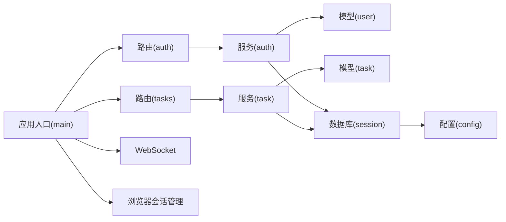

# 认证授权系统

<cite>
**本文档引用的文件**
- [app/main.py](file://CCC_RPA_API/app/main.py)
- [app/api/auth.py](file://CCC_RPA_API/app/api/auth.py)
- [app/services/auth.py](file://CCC_RPA_API/app/services/auth.py)
- [app/schemas/auth.py](file://CCC_RPA_API/app/schemas/auth.py)
- [app/models/user.py](file://CCC_RPA_API/app/models/user.py)
- [app/database.py](file://CCC_RPA_API/app/database.py)
- [app/config.py](file://CCC_RPA_API/app/config.py)
- [app/api/tasks.py](file://CCC_RPA_API/app/api/tasks.py)
- [app/models/task.py](file://CCC_RPA_API/app/models/task.py)
- [app/schemas/task.py](file://CCC_RPA_API/app/schemas/task.py)
- [app/browser/session_manager.py](file://CCC_RPA_API/app/browser/session_manager.py)
- [app/ws/manager.py](file://CCC_RPA_API/app/ws/manager.py)
</cite>

## 目录
1. [简介](#简介)
2. [项目结构](#项目结构)
3. [核心组件](#核心组件)
4. [架构总览](#架构总览)
5. [详细组件分析](#详细组件分析)
6. [依赖分析](#依赖分析)
7. [性能考虑](#性能考虑)
8. [故障排查指南](#故障排查指南)
9. [结论](#结论)
10. [附录](#附录)

## 简介
本项目为一个基于 FastAPI 的 RPA（机器人流程自动化）后端服务，提供认证授权、任务管理、浏览器会话管理与 WebSocket 实时通信能力。认证模块采用轻量级用户令牌机制，结合数据库用户表进行登录、登出与有效性校验；任务模块支持任务的增删改查、执行与日志查询，并通过租户字段实现基础的数据隔离；浏览器会话管理通过 Playwright 在专用工作线程中运行，保障稳定性与隔离性；WebSocket 提供实时消息广播能力。

当前代码库未实现完整的 JWT 令牌签发与解析、RBAC 权限体系、多租户细粒度权限控制与动态权限缓存等功能。本文档在现有代码基础上，给出基于当前实现的安全与扩展建议，帮助读者理解系统现状与演进方向。

## 项目结构
后端采用分层架构：路由层（API 路由）、服务层（业务逻辑）、模型层（SQLAlchemy ORM）、配置与数据库层（连接与设置），以及浏览器与 WebSocket 辅助模块。

图表来源
- [app/main.py:1-127](file://CCC_RPA_API/app/main.py#L1-L127)
- [app/api/auth.py:1-24](file://CCC_RPA_API/app/api/auth.py#L1-L24)
- [app/services/auth.py:1-58](file://CCC_RPA_API/app/services/auth.py#L1-L58)
- [app/schemas/auth.py:1-26](file://CCC_RPA_API/app/schemas/auth.py#L1-L26)
- [app/models/user.py:1-17](file://CCC_RPA_API/app/models/user.py#L1-L17)
- [app/api/tasks.py:1-76](file://CCC_RPA_API/app/api/tasks.py#L1-L76)
- [app/models/task.py:1-25](file://CCC_RPA_API/app/models/task.py#L1-L25)
- [app/schemas/task.py:1-58](file://CCC_RPA_API/app/schemas/task.py#L1-L58)
- [app/database.py:1-19](file://CCC_RPA_API/app/database.py#L1-L19)
- [app/config.py:1-22](file://CCC_RPA_API/app/config.py#L1-L22)
- [app/ws/manager.py:1-29](file://CCC_RPA_API/app/ws/manager.py#L1-L29)
- [app/browser/session_manager.py:1-186](file://CCC_RPA_API/app/browser/session_manager.py#L1-L186)

章节来源
- [app/main.py:1-127](file://CCC_RPA_API/app/main.py#L1-L127)
- [app/database.py:1-19](file://CCC_RPA_API/app/database.py#L1-L19)
- [app/config.py:1-22](file://CCC_RPA_API/app/config.py#L1-L22)

## 核心组件
- 应用入口与路由注册：在应用启动时创建数据库表、迁移任务表字段、注册认证与任务路由，并提供健康检查与 WebSocket 端点。
- 认证模块：提供登录、登出、有效性验证接口，基于用户表维护 token 与设备标识，用于会话状态管理。
- 任务模块：提供任务的列表、创建、查询、更新、删除、执行、日志查询与交互式等待信号。
- 数据库与配置：统一的数据库引擎与会话工厂，配置类提供数据库连接参数。
- 浏览器会话管理：Playwright 在专用线程中运行，按“省份”维度管理浏览器上下文，持久化 storage_state，确保稳定与隔离。
- WebSocket 管理：连接管理器负责接受连接、广播消息与清理断开连接。

章节来源
- [app/main.py:1-127](file://CCC_RPA_API/app/main.py#L1-L127)
- [app/api/auth.py:1-24](file://CCC_RPA_API/app/api/auth.py#L1-L24)
- [app/services/auth.py:1-58](file://CCC_RPA_API/app/services/auth.py#L1-L58)
- [app/api/tasks.py:1-76](file://CCC_RPA_API/app/api/tasks.py#L1-L76)
- [app/browser/session_manager.py:1-186](file://CCC_RPA_API/app/browser/session_manager.py#L1-L186)
- [app/ws/manager.py:1-29](file://CCC_RPA_API/app/ws/manager.py#L1-L29)

## 架构总览
下图展示请求从客户端到服务端的典型路径，以及认证、任务与浏览器会话的关键交互。

图表来源
- [app/main.py:23-27](file://CCC_RPA_API/app/main.py#L23-L27)
- [app/api/auth.py:10-12](file://CCC_RPA_API/app/api/auth.py#L10-L12)
- [app/services/auth.py:9-38](file://CCC_RPA_API/app/services/auth.py#L9-L38)
- [app/api/tasks.py:13-15](file://CCC_RPA_API/app/api/tasks.py#L13-L15)
- [app/database.py:13-18](file://CCC_RPA_API/app/database.py#L13-L18)

## 详细组件分析

### 认证与会话管理
- 登录流程：根据 client_id 查询用户，若不存在则创建新用户并写入 token 与设备信息；若存在则更新 token、设备与用户名等字段；提交事务并返回用户标识、用户名与 token。
- 登出流程：根据 userId 将用户标记为非活跃，用于后续验证阶段判定无效。
- 有效性验证：根据 userId 查询用户，返回 valid 字段及用户信息；未找到用户时视为无效。

图表来源
- [app/api/auth.py:10-23](file://CCC_RPA_API/app/api/auth.py#L10-L23)
- [app/services/auth.py:9-57](file://CCC_RPA_API/app/services/auth.py#L9-L57)
- [app/models/user.py:7-16](file://CCC_RPA_API/app/models/user.py#L7-L16)

章节来源
- [app/api/auth.py:1-24](file://CCC_RPA_API/app/api/auth.py#L1-L24)
- [app/services/auth.py:1-58](file://CCC_RPA_API/app/services/auth.py#L1-L58)
- [app/schemas/auth.py:1-26](file://CCC_RPA_API/app/schemas/auth.py#L1-L26)
- [app/models/user.py:1-17](file://CCC_RPA_API/app/models/user.py#L1-L17)

### 任务管理与数据隔离
- 任务 CRUD：提供列表、创建、查询、更新、删除、执行、日志查询与交互式信号处理。
- 数据隔离：任务模型包含 tenant_id 字段，可在业务层通过该字段过滤与限制可见范围，实现基础的租户隔离。

图表来源
- [app/api/tasks.py:13-75](file://CCC_RPA_API/app/api/tasks.py#L13-L75)
- [app/models/task.py:8-24](file://CCC_RPA_API/app/models/task.py#L8-L24)
- [app/schemas/task.py:5-50](file://CCC_RPA_API/app/schemas/task.py#L5-L50)

章节来源
- [app/api/tasks.py:1-76](file://CCC_RPA_API/app/api/tasks.py#L1-L76)
- [app/models/task.py:1-25](file://CCC_RPA_API/app/models/task.py#L1-L25)
- [app/schemas/task.py:1-58](file://CCC_RPA_API/app/schemas/task.py#L1-L58)

### 浏览器会话管理
- 专用工作线程：启动 Playwright 与 Chromium，避免与 asyncio 事件循环冲突；通过队列串行执行浏览器操作，防止线程竞争。
- 上下文管理：按“省份”维度创建与复用 BrowserContext，持久化 storage_state，提升会话复用效率。
- 生命周期：提供上下文保存、关闭、恢复与全部关闭方法，便于异常恢复与资源回收。

图表来源
- [app/browser/session_manager.py:10-186](file://CCC_RPA_API/app/browser/session_manager.py#L10-L186)

章节来源
- [app/browser/session_manager.py:1-186](file://CCC_RPA_API/app/browser/session_manager.py#L1-L186)

### WebSocket 实时通信
- 连接管理：连接建立后加入连接池，断开时移除；广播消息时自动清理无效连接。
- 应用场景：可用于向客户端推送任务执行状态、扫描完成通知等。

图表来源
- [app/main.py:119-127](file://CCC_RPA_API/app/main.py#L119-L127)
- [app/ws/manager.py:10-26](file://CCC_RPA_API/app/ws/manager.py#L10-L26)

章节来源
- [app/main.py:114-127](file://CCC_RPA_API/app/main.py#L114-L127)
- [app/ws/manager.py:1-29](file://CCC_RPA_API/app/ws/manager.py#L1-L29)

## 依赖分析
- 组件耦合：路由层仅依赖服务层与数据库依赖注入；服务层依赖模型与数据库；模型依赖基础 ORM 基类；配置集中于配置类。
- 外部依赖：FastAPI、SQLAlchemy、Pydantic、Playwright、WebSocket 支持。
- 数据流：请求经路由进入服务层，服务层通过数据库会话访问模型，模型映射到数据库表；部分操作（如任务执行）可能触发浏览器会话管理器。

图表来源
- [app/main.py:23-27](file://CCC_RPA_API/app/main.py#L23-L27)
- [app/api/auth.py:10-23](file://CCC_RPA_API/app/api/auth.py#L10-L23)
- [app/services/auth.py:9-57](file://CCC_RPA_API/app/services/auth.py#L9-L57)
- [app/api/tasks.py:13-75](file://CCC_RPA_API/app/api/tasks.py#L13-L75)
- [app/models/user.py:7-16](file://CCC_RPA_API/app/models/user.py#L7-L16)
- [app/models/task.py:8-24](file://CCC_RPA_API/app/models/task.py#L8-L24)
- [app/database.py:13-18](file://CCC_RPA_API/app/database.py#L13-L18)
- [app/config.py:6-22](file://CCC_RPA_API/app/config.py#L6-L22)

章节来源
- [app/main.py:1-127](file://CCC_RPA_API/app/main.py#L1-L127)
- [app/database.py:1-19](file://CCC_RPA_API/app/database.py#L1-L19)
- [app/config.py:1-22](file://CCC_RPA_API/app/config.py#L1-L22)

## 性能考虑
- 数据库连接池：启用 pre_ping 与 recycle，减少连接失效导致的错误。
- 专用线程与队列：浏览器操作在专用线程执行，避免阻塞主线程；通过队列串行化任务，降低竞态风险。
- WebSocket 广播：广播时清理无效连接，避免向已断开客户端发送消息造成额外开销。
- 启动迁移：在启动时尝试添加任务表字段，避免重复迁移失败带来的性能抖动。

章节来源
- [app/database.py:5-6](file://CCC_RPA_API/app/database.py#L5-L6)
- [app/browser/session_manager.py:39-77](file://CCC_RPA_API/app/browser/session_manager.py#L39-L77)
- [app/ws/manager.py:17-26](file://CCC_RPA_API/app/ws/manager.py#L17-L26)
- [app/main.py:41-86](file://CCC_RPA_API/app/main.py#L41-L86)

## 故障排查指南
- 认证失败或无效：
  - 检查 userId 是否正确传入与数据库是否存在对应用户。
  - 确认用户是否仍处于活跃状态。
- 登录后无法验证：
  - 确认 token 与设备信息是否正确写入与更新。
- 任务操作异常：
  - 查看任务是否存在且未被删除；确认 tenant_id 等字段是否符合预期。
- 浏览器会话问题：
  - 若上下文失效，可调用恢复流程重建；检查 storage_state 文件是否存在与可读。
- WebSocket 断连：
  - 管理器会自动清理断开连接；检查客户端网络与服务器日志。

章节来源
- [app/services/auth.py:40-57](file://CCC_RPA_API/app/services/auth.py#L40-L57)
- [app/models/user.py:7-16](file://CCC_RPA_API/app/models/user.py#L7-L16)
- [app/api/tasks.py:24-43](file://CCC_RPA_API/app/api/tasks.py#L24-L43)
- [app/browser/session_manager.py:100-126](file://CCC_RPA_API/app/browser/session_manager.py#L100-L126)
- [app/ws/manager.py:14-26](file://CCC_RPA_API/app/ws/manager.py#L14-L26)

## 结论
当前系统实现了基础的认证与任务管理能力，具备良好的模块化与可扩展性。认证采用轻量级令牌与用户表配合的方式，任务模块支持基本的 CRUD 与执行流程，浏览器会话管理通过专用线程保证稳定性，WebSocket 提供实时通信能力。若需进一步增强安全性与治理能力，建议引入 JWT 令牌、RBAC 权限体系、多租户细粒度权限控制、动态权限缓存与审计日志等机制。

## 附录

### 安全最佳实践与扩展建议
- 引入 JWT 令牌：
  - 使用强密钥签发与校验令牌；设置合理的过期时间与刷新策略；在请求头中携带 Authorization Bearer。
- 密码与敏感信息：
  - 当前未见密码字段；如需密码登录，应使用强哈希算法（如 bcrypt）存储密码摘要，避免明文存储。
- 权限控制：
  - 设计角色与权限矩阵，基于租户与资源维度进行访问控制；在路由或服务层增加权限中间件或装饰器。
- 多租户隔离：
  - 在查询与写入时强制带入 tenant_id；对跨租户操作进行严格校验与审计。
- 动态权限与缓存：
  - 缓存用户权限集合，结合定时刷新与事件驱动更新，降低权限判断开销。
- 审计日志：
  - 记录关键操作（登录、登出、任务执行、权限变更）的时间、用户、IP、资源与结果，支持回溯与合规。

### 当前实现与建议对照
- 认证机制：当前以 token 与设备标识维持会话，建议升级为 JWT 并引入刷新与撤销机制。
- 权限体系：当前未见 RBAC 实现，建议引入角色、权限与资源模型，并在服务层统一校验。
- 租户隔离：任务模型已有 tenant_id 字段，建议在业务层强制隔离与审计。
- 安全验证：建议在路由层增加鉴权中间件，对敏感接口进行权限校验。
- 审计日志：建议在认证与任务关键操作处埋点，记录操作轨迹。