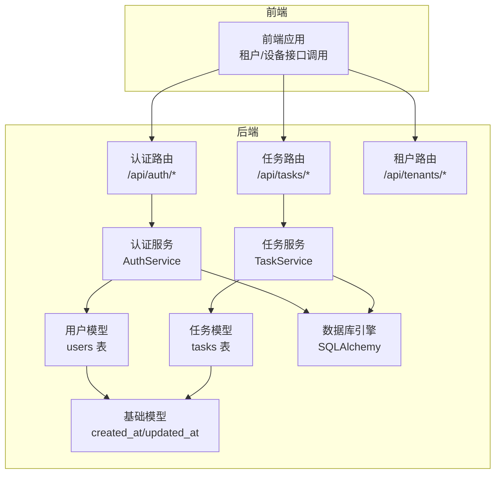
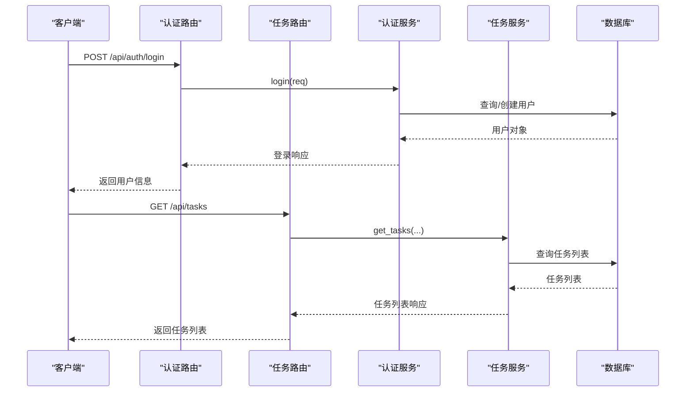
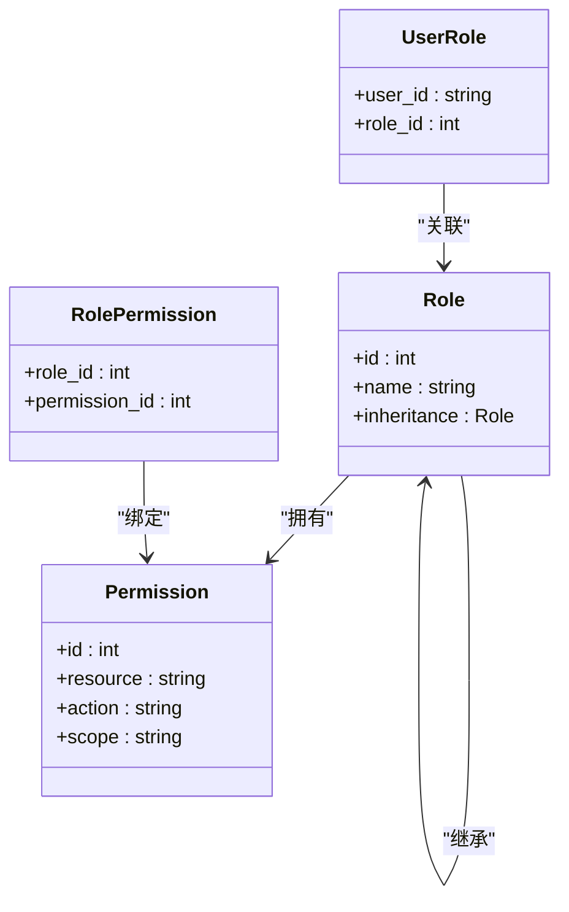
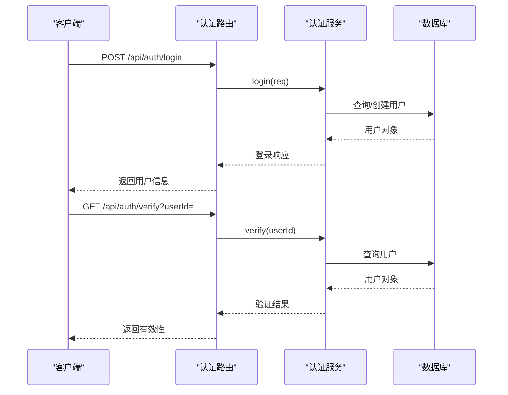
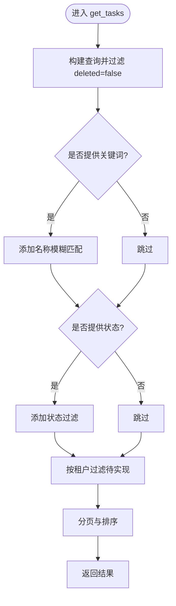
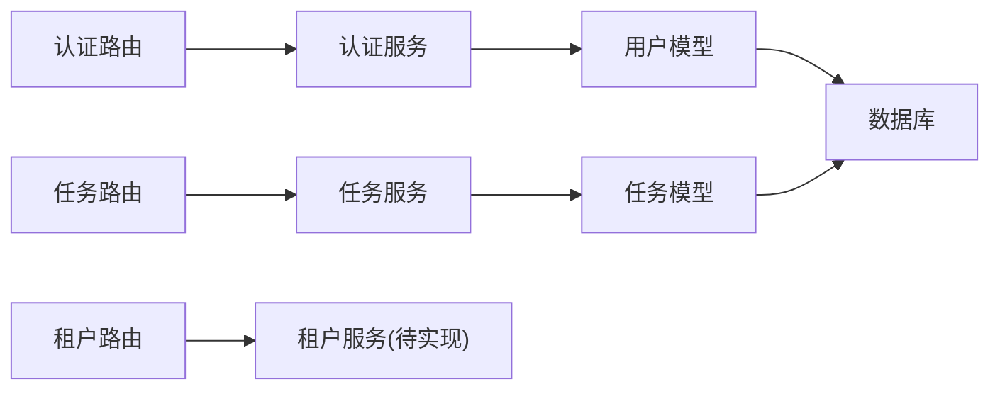

# RBAC 权限体系设计

<cite>
**本文档引用的文件**
- [app/models/user.py](file://CCC_RPA_API/app/models/user.py)
- [app/models/task.py](file://CCC_RPA_API/app/models/task.py)
- [app/models/base.py](file://CCC_RPA_API/app/models/base.py)
- [app/api/auth.py](file://CCC_RPA_API/app/api/auth.py)
- [app/api/tasks.py](file://CCC_RPA_API/app/api/tasks.py)
- [app/api/tenants.py](file://CCC_RPA_API/app/api/tenants.py)
- [app/services/auth.py](file://CCC_RPA_API/app/services/auth.py)
- [app/services/task.py](file://CCC_RPA_API/app/services/task.py)
- [app/schemas/auth.py](file://CCC_RPA_API/app/schemas/auth.py)
- [app/schemas/task.py](file://CCC_RPA_API/app/schemas/task.py)
- [app/config.py](file://CCC_RPA_API/app/config.py)
- [app/database.py](file://CCC_RPA_API/app/database.py)
- [project.md](file://project.md)
</cite>

## 目录
1. [引言](#引言)
2. [项目结构](#项目结构)
3. [核心组件](#核心组件)
4. [架构总览](#架构总览)
5. [详细组件分析](#详细组件分析)
6. [依赖关系分析](#依赖关系分析)
7. [性能考虑](#性能考虑)
8. [故障排除指南](#故障排除指南)
9. [结论](#结论)
10. [附录](#附录)

## 引言
本文件面向“四角色 RBAC 权限体系”的设计与实现，结合现有代码库与项目文档，系统阐述在多租户场景下的权限模型、角色定义、权限继承与验证流程，并给出安全设计原则与最佳实践建议。当前仓库中已具备用户模型、认证服务、任务管理与租户接口等基础能力，为后续扩展“角色-权限”映射与动态校验提供了良好基础。

## 项目结构
后端采用 FastAPI + SQLAlchemy 架构，按功能分层组织：
- API 层：路由定义与请求入口
- 服务层：业务逻辑封装
- 模型层：数据库 ORM 映射
- 配置与数据库：连接参数与会话管理
- 前端：租户与设备接口调用示例

**图表来源**
- [app/api/auth.py:1-24](file://CCC_RPA_API/app/api/auth.py#L1-L24)
- [app/api/tasks.py:1-76](file://CCC_RPA_API/app/api/tasks.py#L1-L76)
- [app/api/tenants.py:1-24](file://CCC_RPA_API/app/api/tenants.py#L1-L24)
- [app/services/auth.py:1-58](file://CCC_RPA_API/app/services/auth.py#L1-L58)
- [app/services/task.py:1-157](file://CCC_RPA_API/app/services/task.py#L1-L157)
- [app/models/user.py:1-17](file://CCC_RPA_API/app/models/user.py#L1-L17)
- [app/models/task.py:1-25](file://CCC_RPA_API/app/models/task.py#L1-L25)
- [app/models/base.py:1-11](file://CCC_RPA_API/app/models/base.py#L1-L11)
- [app/database.py:1-19](file://CCC_RPA_API/app/database.py#L1-L19)

**章节来源**
- [app/api/auth.py:1-24](file://CCC_RPA_API/app/api/auth.py#L1-L24)
- [app/api/tasks.py:1-76](file://CCC_RPA_API/app/api/tasks.py#L1-L76)
- [app/api/tenants.py:1-24](file://CCC_RPA_API/app/api/tenants.py#L1-L24)
- [app/services/auth.py:1-58](file://CCC_RPA_API/app/services/auth.py#L1-L58)
- [app/services/task.py:1-157](file://CCC_RPA_API/app/services/task.py#L1-L157)
- [app/models/user.py:1-17](file://CCC_RPA_API/app/models/user.py#L1-L17)
- [app/models/task.py:1-25](file://CCC_RPA_API/app/models/task.py#L1-L25)
- [app/models/base.py:1-11](file://CCC_RPA_API/app/models/base.py#L1-L11)
- [app/database.py:1-19](file://CCC_RPA_API/app/database.py#L1-L19)

## 核心组件
- 用户模型与认证服务
  - 用户模型包含用户标识、租户标识、令牌、设备标识与激活状态等字段，支持登录、登出与有效性验证。
  - 认证服务负责用户登录、令牌更新、登出与有效性校验。
- 任务模型与任务服务
  - 任务模型包含任务元信息、租户标识、设备标识与状态等字段，支持任务的增删改查与执行。
  - 任务服务封装了任务列表、详情、创建、更新、删除、执行与日志查询等业务逻辑。
- 租户接口
  - 提供租户列表查询接口，当前为模拟数据，后续应替换为真实数据库查询。
- 数据库与配置
  - 配置类提供数据库连接参数；数据库模块提供引擎与会话工厂。

**章节来源**
- [app/models/user.py:7-17](file://CCC_RPA_API/app/models/user.py#L7-L17)
- [app/services/auth.py:6-58](file://CCC_RPA_API/app/services/auth.py#L6-L58)
- [app/models/task.py:8-25](file://CCC_RPA_API/app/models/task.py#L8-L25)
- [app/services/task.py:44-157](file://CCC_RPA_API/app/services/task.py#L44-L157)
- [app/api/tenants.py:8-24](file://CCC_RPA_API/app/api/tenants.py#L8-L24)
- [app/config.py:6-22](file://CCC_RPA_API/app/config.py#L6-L22)
- [app/database.py:1-19](file://CCC_RPA_API/app/database.py#L1-L19)

## 架构总览
下图展示了认证与任务相关的关键交互流程，体现从路由到服务再到模型与数据库的数据流。

**图表来源**
- [app/api/auth.py:10-23](file://CCC_RPA_API/app/api/auth.py#L10-L23)
- [app/services/auth.py:9-38](file://CCC_RPA_API/app/services/auth.py#L9-L38)
- [app/api/tasks.py:13-15](file://CCC_RPA_API/app/api/tasks.py#L13-L15)
- [app/services/task.py:47-64](file://CCC_RPA_API/app/services/task.py#L47-L64)

## 详细组件分析

### 角色与权限模型设计
基于项目文档中的“FR-203 RBAC 四级权限控制系统”，当前代码库尚未实现具体的角色与权限映射。为满足“超级管理员、租户管理员、操作员、只读用户”的分级权限需求，建议在现有模型基础上扩展以下结构：

- 角色定义
  - 超级管理员：全局最高权限，可管理所有租户与系统配置。
  - 租户管理员：可管理本租户内的资源与成员，但不可跨租户操作。
  - 操作员：可在本租户内执行任务、查看任务与日志，不可删除或修改配置。
  - 只读用户：仅能查看任务与日志，无任何写操作权限。
- 权限矩阵
  - 建议以“资源-动作-范围”三元组描述权限，例如：
    - 任务：创建、读取、更新、删除、执行、查看日志
    - 租户：读取、配置（需更高权限）
    - 日志：读取、导出（需更高权限）
  - 权限范围限定为“本租户”，确保多租户隔离。
- 权限继承
  - 可通过角色继承实现：只读用户继承自操作员；操作员继承自租户管理员；租户管理员继承自超级管理员。
- 动态权限检查
  - 在服务层对每个业务方法进行权限校验，校验依据为当前用户所属角色与其目标资源的租户标识。

[此图为概念性设计示意，不直接对应具体源码文件，故不提供图表来源]

### 认证与会话管理
- 登录流程
  - 客户端提交 client_id、token、device_id、username。
  - 服务端根据 client_id 查找或创建用户记录，更新 token、设备信息与用户名，返回 userId、username、token。
- 登出流程
  - 将用户的激活状态置为无效，防止继续使用。
- 有效性验证
  - 根据 userId 查询用户，返回有效标志及用户信息。

**图表来源**
- [app/api/auth.py:10-23](file://CCC_RPA_API/app/api/auth.py#L10-L23)
- [app/services/auth.py:9-57](file://CCC_RPA_API/app/services/auth.py#L9-L57)
- [app/schemas/auth.py:5-26](file://CCC_RPA_API/app/schemas/auth.py#L5-L26)

**章节来源**
- [app/api/auth.py:1-24](file://CCC_RPA_API/app/api/auth.py#L1-L24)
- [app/services/auth.py:1-58](file://CCC_RPA_API/app/services/auth.py#L1-L58)
- [app/schemas/auth.py:1-26](file://CCC_RPA_API/app/schemas/auth.py#L1-L26)

### 任务管理与多租户隔离
- 任务模型
  - 包含租户标识、设备标识、状态、备注等字段，便于按租户隔离与审计。
- 任务服务
  - 支持分页查询、条件过滤、创建、更新、删除、执行与日志查询。
- 多租户约束
  - 当前服务未强制按租户过滤，建议在 get_tasks 等查询中加入租户过滤条件，确保用户只能看到其所属租户的任务。

**图表来源**
- [app/services/task.py:47-64](file://CCC_RPA_API/app/services/task.py#L47-L64)
- [app/models/task.py:14](file://CCC_RPA_API/app/models/task.py#L14)

**章节来源**
- [app/models/task.py:1-25](file://CCC_RPA_API/app/models/task.py#L1-L25)
- [app/services/task.py:1-157](file://CCC_RPA_API/app/services/task.py#L1-L157)

### 租户管理接口
- 当前实现为模拟数据，返回固定租户列表。
- 后续应替换为真实数据库查询，并增加鉴权与分页能力。

**章节来源**
- [app/api/tenants.py:1-24](file://CCC_RPA_API/app/api/tenants.py#L1-L24)

## 依赖关系分析
- 组件耦合
  - API 层仅依赖服务层，服务层依赖模型层与数据库，职责清晰。
- 外部依赖
  - FastAPI、SQLAlchemy、Pydantic、pymysql 等。
- 潜在风险
  - 当前服务层未实现多租户过滤，存在越权风险；需尽快补充权限校验与租户隔离逻辑。

**图表来源**
- [app/api/auth.py:1-24](file://CCC_RPA_API/app/api/auth.py#L1-L24)
- [app/api/tasks.py:1-76](file://CCC_RPA_API/app/api/tasks.py#L1-L76)
- [app/api/tenants.py:1-24](file://CCC_RPA_API/app/api/tenants.py#L1-L24)
- [app/services/auth.py:1-58](file://CCC_RPA_API/app/services/auth.py#L1-L58)
- [app/services/task.py:1-157](file://CCC_RPA_API/app/services/task.py#L1-L157)
- [app/models/user.py:1-17](file://CCC_RPA_API/app/models/user.py#L1-L17)
- [app/models/task.py:1-25](file://CCC_RPA_API/app/models/task.py#L1-L25)

**章节来源**
- [app/api/auth.py:1-24](file://CCC_RPA_API/app/api/auth.py#L1-L24)
- [app/api/tasks.py:1-76](file://CCC_RPA_API/app/api/tasks.py#L1-L76)
- [app/api/tenants.py:1-24](file://CCC_RPA_API/app/api/tenants.py#L1-L24)
- [app/services/auth.py:1-58](file://CCC_RPA_API/app/services/auth.py#L1-L58)
- [app/services/task.py:1-157](file://CCC_RPA_API/app/services/task.py#L1-L157)
- [app/models/user.py:1-17](file://CCC_RPA_API/app/models/user.py#L1-L17)
- [app/models/task.py:1-25](file://CCC_RPA_API/app/models/task.py#L1-L25)

## 性能考虑
- 数据库连接池
  - 已设置预检与回收策略，建议结合实际并发调整连接数与超时时间。
- 查询优化
  - 对高频查询（如任务列表）增加索引与分页，避免全表扫描。
- 缓存策略
  - 对静态配置与只读数据（如租户列表）引入缓存，降低数据库压力。
- 并发控制
  - 在任务执行与日志查询处增加必要的锁或幂等设计，避免重复执行。

[本节为通用指导，不直接分析具体文件，故不提供章节来源]

## 故障排除指南
- 登录失败
  - 检查 client_id 是否正确，确认数据库中是否存在该用户记录。
  - 核对 token 与设备信息是否被正确更新。
- 任务查询为空
  - 确认当前用户所属租户是否正确，服务层是否实现了租户过滤。
  - 检查 deleted 过滤条件与分页参数。
- 验证失败
  - 确认用户是否仍处于激活状态，以及 userId 是否传入正确。

**章节来源**
- [app/services/auth.py:9-57](file://CCC_RPA_API/app/services/auth.py#L9-L57)
- [app/services/task.py:47-64](file://CCC_RPA_API/app/services/task.py#L47-L64)

## 结论
当前代码库已具备用户认证与任务管理的基础能力，为实现“四角色 RBAC 权限体系”提供了良好的起点。建议优先完成角色与权限映射、租户隔离与动态权限校验的落地，随后逐步完善审计与统计模块，最终形成完整的多租户权限闭环。

[本节为总结性内容，不直接分析具体文件，故不提供章节来源]

## 附录

### 安全设计原则与最佳实践
- 最小权限原则
  - 每个角色仅授予完成工作所需的最小权限集合，避免过度授权。
- 权限分离
  - 关键操作（如删除、导出、配置变更）应拆分为多个角色协作完成，降低单点风险。
- 多租户隔离
  - 所有数据访问必须绑定租户上下文，服务层默认按租户过滤，路由层不参与业务过滤。
- 审计追踪
  - 记录关键操作（登录、任务执行、配置变更、日志导出）的时间、用户、租户与结果，保留足够日志以便追溯。
- 输入校验与输出编码
  - 对所有外部输入进行严格校验与白名单过滤；对敏感输出进行脱敏处理。
- 密钥与加密
  - 租户独立密钥用于会话快照解密，密钥轮换与存储遵循安全规范。

**章节来源**
- [project.md:363-366](file://project.md#L363-L366)