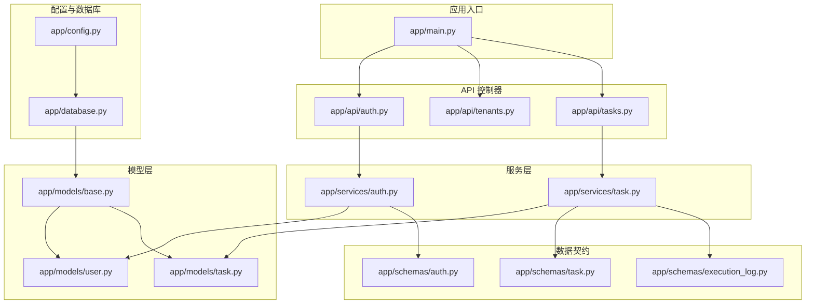
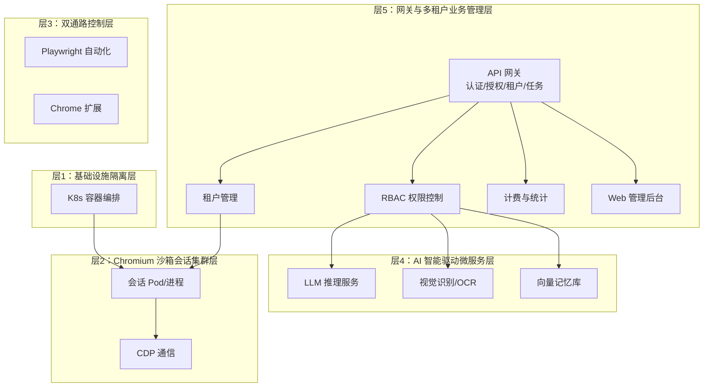
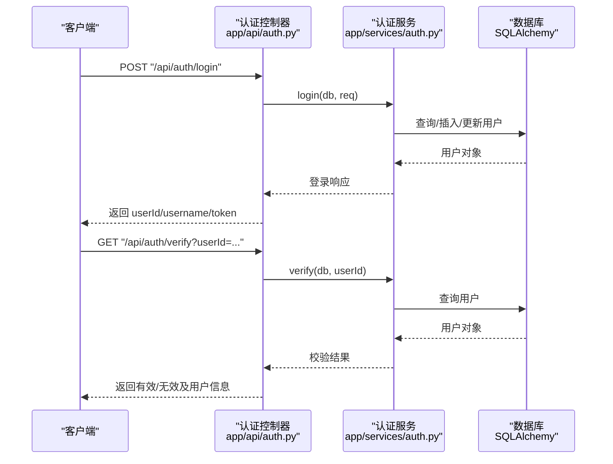
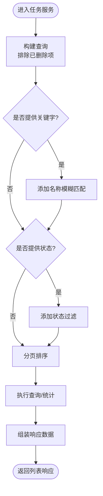
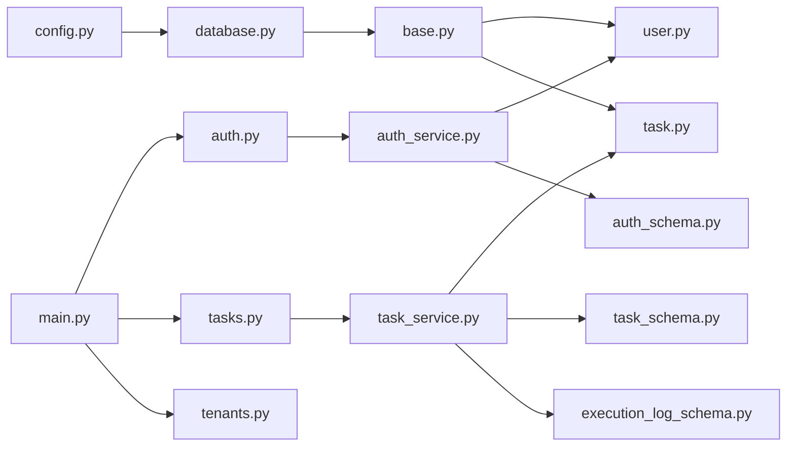
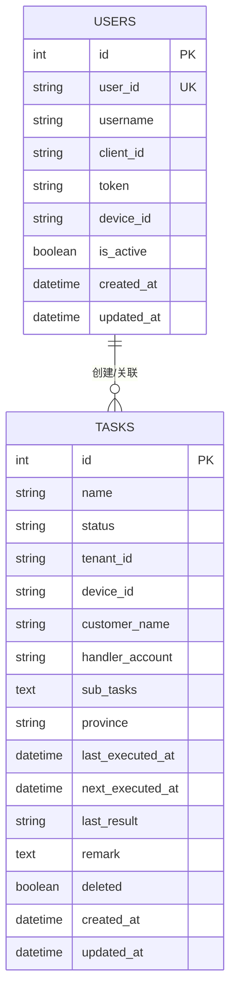

# 多租户权限管理

<cite>
**本文引用的文件**
- [main.py](file://CCC_RPA_API/app/main.py)
- [config.py](file://CCC_RPA_API/app/config.py)
- [database.py](file://CCC_RPA_API/app/database.py)
- [base.py](file://CCC_RPA_API/app/models/base.py)
- [user.py](file://CCC_RPA_API/app/models/user.py)
- [task.py](file://CCC_RPA_API/app/models/task.py)
- [auth.py](file://CCC_RPA_API/app/api/auth.py)
- [tenants.py](file://CCC_RPA_API/app/api/tenants.py)
- [tasks.py](file://CCC_RPA_API/app/api/tasks.py)
- [auth_service.py](file://CCC_RPA_API/app/services/auth.py)
- [task_service.py](file://CCC_RPA_API/app/services/task.py)
- [auth_schema.py](file://CCC_RPA_API/app/schemas/auth.py)
- [task_schema.py](file://CCC_RPA_API/app/schemas/task.py)
- [execution_log_schema.py](file://CCC_RPA_API/app/schemas/execution_log.py)
- [project.md](file://project.md)
</cite>

## 目录
1. [简介](#简介)
2. [项目结构](#项目结构)
3. [核心组件](#核心组件)
4. [架构总览](#架构总览)
5. [详细组件分析](#详细组件分析)
6. [依赖关系分析](#依赖关系分析)
7. [性能考虑](#性能考虑)
8. [故障排查指南](#故障排查指南)
9. [结论](#结论)
10. [附录](#附录)

## 简介
本文件面向“多租户权限管理系统”的设计与实现，围绕四级 RBAC 权限体系（超级管理员、租户管理员、操作员、只读用户）与租户管理模块展开，结合现有代码库与项目文档，系统阐述：
- 权限模型与控制机制
- 租户管理的 CRUD 与并发配额能力
- 用户与角色的权限映射、继承与动态校验
- 数据隔离策略（数据库物理隔离、会话数据加密存储）
- 权限验证中间件与安全防护
- 多租户部署最佳实践与安全配置

## 项目结构
后端采用 FastAPI + SQLAlchemy 架构，按领域模块组织：
- 应用入口与路由注册：app/main.py
- 配置与数据库连接：app/config.py、app/database.py
- ORM 基类与实体模型：app/models/base.py、app/models/user.py、app/models/task.py
- API 控制器：app/api/auth.py、app/api/tenants.py、app/api/tasks.py
- 服务层：app/services/auth.py、app/services/task.py
- 数据契约：app/schemas/auth.py、app/schemas/task.py、app/schemas/execution_log.py

图表来源
- [main.py:1-127](file://CCC_RPA_API/app/main.py#L1-L127)
- [config.py:1-22](file://CCC_RPA_API/app/config.py#L1-L22)
- [database.py:1-19](file://CCC_RPA_API/app/database.py#L1-L19)
- [base.py:1-11](file://CCC_RPA_API/app/models/base.py#L1-L11)
- [user.py:1-17](file://CCC_RPA_API/app/models/user.py#L1-L17)
- [task.py:1-25](file://CCC_RPA_API/app/models/task.py#L1-L25)
- [auth.py:1-24](file://CCC_RPA_API/app/api/auth.py#L1-L24)
- [tenants.py:1-25](file://CCC_RPA_API/app/api/tenants.py#L1-L25)
- [tasks.py:1-76](file://CCC_RPA_API/app/api/tasks.py#L1-L76)
- [auth_service.py:1-58](file://CCC_RPA_API/app/services/auth.py#L1-L58)
- [task_service.py:1-157](file://CCC_RPA_API/app/services/task.py#L1-L157)
- [auth_schema.py:1-26](file://CCC_RPA_API/app/schemas/auth.py#L1-L26)
- [task_schema.py:1-58](file://CCC_RPA_API/app/schemas/task.py#L1-L58)
- [execution_log_schema.py:1-18](file://CCC_RPA_API/app/schemas/execution_log.py#L1-L18)

章节来源
- [main.py:1-127](file://CCC_RPA_API/app/main.py#L1-L127)
- [config.py:1-22](file://CCC_RPA_API/app/config.py#L1-L22)
- [database.py:1-19](file://CCC_RPA_API/app/database.py#L1-L19)

## 核心组件
- 应用入口与路由
  - 注册认证、租户、任务等路由；启动时创建数据库表与迁移补充列；健康检查与 WebSocket 管理。
- 配置与数据库
  - 通过环境变量配置数据库连接；提供 Session 工厂与 Base ORM 基类。
- 模型层
  - BaseModel 提供通用时间戳字段；User 与 Task 模型承载用户与任务数据。
- API 控制器
  - 认证：登录、登出、校验；租户：租户列表（Mock）；任务：CRUD、执行、日志查询。
- 服务层
  - 认证服务：登录/登出/校验逻辑；任务服务：查询、创建、更新、删除、执行、日志查询。
- 数据契约
  - Pydantic 模型定义请求与响应结构。

章节来源
- [main.py:1-127](file://CCC_RPA_API/app/main.py#L1-L127)
- [config.py:1-22](file://CCC_RPA_API/app/config.py#L1-L22)
- [database.py:1-19](file://CCC_RPA_API/app/database.py#L1-L19)
- [base.py:1-11](file://CCC_RPA_API/app/models/base.py#L1-L11)
- [user.py:1-17](file://CCC_RPA_API/app/models/user.py#L1-L17)
- [task.py:1-25](file://CCC_RPA_API/app/models/task.py#L1-L25)
- [auth.py:1-24](file://CCC_RPA_API/app/api/auth.py#L1-L24)
- [tenants.py:1-25](file://CCC_RPA_API/app/api/tenants.py#L1-L25)
- [tasks.py:1-76](file://CCC_RPA_API/app/api/tasks.py#L1-L76)
- [auth_service.py:1-58](file://CCC_RPA_API/app/services/auth.py#L1-L58)
- [task_service.py:1-157](file://CCC_RPA_API/app/services/task.py#L1-L157)
- [auth_schema.py:1-26](file://CCC_RPA_API/app/schemas/auth.py#L1-L26)
- [task_schema.py:1-58](file://CCC_RPA_API/app/schemas/task.py#L1-L58)
- [execution_log_schema.py:1-18](file://CCC_RPA_API/app/schemas/execution_log.py#L1-L18)

## 架构总览
系统采用五层分层架构，多租户网关与业务管理层位于顶层，负责统一 API 入口、租户管理、RBAC 权限、计费统计与 Web 管理后台。本节聚焦权限与租户管理在网关层的落地。

图表来源
- [project.md:173-188](file://project.md#L173-L188)
- [project.md:353-381](file://project.md#L353-L381)
- [project.md:363-366](file://project.md#L363-L366)

## 详细组件分析

### 四级 RBAC 权限体系
- 角色定义
  - 超级管理员：全局配置、租户生命周期、全局配额、监控告警、镜像版本管理。
  - 租户管理员：本租户操作员管理、并发配额、审计日志查看、数据导出。
  - 操作员：创建会话、执行脚本、下发 AI 指令、保存快照。
  - 只读用户：仅查看状态、执行记录、抽取结果。
- 权限控制要点
  - 严格越权拦截：不同角色对“创建会话、执行 AI 任务、导出数据、编辑脚本、查看审计日志、修改租户配置”等操作进行细粒度权限隔离。
  - 数据隔离：租户仅可见自身创建的数据，避免横向越权。

章节来源
- [project.md:209-235](file://project.md#L209-L235)
- [project.md:363-366](file://project.md#L363-L366)

### 租户管理模块
- 当前实现
  - 提供租户列表接口（Mock 数据），后续需替换为真实数据库查询与 CRUD 能力。
- 物理隔离与加密
  - 租户数据物理隔离：租户仅可查询/操作自身创建的会话、任务、快照、脚本。
  - 独立 AES 密钥：每个租户分配独立 AES 加密密钥，仅自身密钥可解密会话快照。
- 并发配额
  - 支持为租户配置独立会话并发配额，用于资源治理与计费统计。

章节来源
- [tenants.py:1-25](file://CCC_RPA_API/app/api/tenants.py#L1-L25)
- [project.md:357-361](file://project.md#L357-L361)
- [project.md:367-373](file://project.md#L367-L373)

### 用户与角色管理
- 登录与会话
  - 用户首次登录创建记录，后续登录更新 token、设备信息与活跃状态；登出将用户标记为非活跃；校验接口返回用户有效性。
- 角色与权限映射
  - 通过用户身份与租户上下文进行权限判定，不同角色对任务、会话、日志等资源的操作范围不同。
- 动态权限检查
  - 在 API 层或服务层根据当前用户角色与目标资源所属租户进行动态校验，拒绝越权请求。

图表来源
- [auth.py:1-24](file://CCC_RPA_API/app/api/auth.py#L1-L24)
- [auth_service.py:1-58](file://CCC_RPA_API/app/services/auth.py#L1-L58)
- [auth_schema.py:1-26](file://CCC_RPA_API/app/schemas/auth.py#L1-L26)

章节来源
- [auth.py:1-24](file://CCC_RPA_API/app/api/auth.py#L1-L24)
- [auth_service.py:1-58](file://CCC_RPA_API/app/services/auth.py#L1-L58)
- [auth_schema.py:1-26](file://CCC_RPA_API/app/schemas/auth.py#L1-L26)
- [user.py:1-17](file://CCC_RPA_API/app/models/user.py#L1-L17)

### 任务与数据隔离
- 任务模型
  - 任务实体包含租户标识、设备标识、客户名称、处理人账户、省/市等字段，便于按租户维度进行数据隔离。
- 任务服务
  - 查询支持关键字与状态过滤；创建/更新/删除均基于软删除策略；执行任务时设置运行中状态并异步提交执行。
- 数据隔离策略
  - 查询与操作均以租户维度过滤，确保用户只能访问自身租户的数据。
  - 会话快照与敏感配置采用 AES-256-CBC 加密存储，密钥按租户独立管理。

图表来源
- [task_service.py:44-64](file://CCC_RPA_API/app/services/task.py#L44-L64)
- [task_schema.py:53-58](file://CCC_RPA_API/app/schemas/task.py#L53-L58)

章节来源
- [task.py:1-25](file://CCC_RPA_API/app/models/task.py#L1-L25)
- [task_service.py:1-157](file://CCC_RPA_API/app/services/task.py#L1-L157)
- [tasks.py:1-76](file://CCC_RPA_API/app/api/tasks.py#L1-L76)
- [task_schema.py:1-58](file://CCC_RPA_API/app/schemas/task.py#L1-L58)
- [execution_log_schema.py:1-18](file://CCC_RPA_API/app/schemas/execution_log.py#L1-L18)

### 权限验证中间件与安全防护
- 中间件与拦截
  - 建议在 API 层引入中间件，基于请求头中的租户 Token 与用户身份进行权限校验，拒绝越权访问。
- 传输与存储安全
  - 全部内外通信强制 TLS 加密；会话快照与敏感配置采用 AES-256-CBC 加密存储；租户独立密钥管理。
- 审计与日志
  - 全链路操作审计日志留存，日志不可删除篡改，支持按全局/租户维度可视化监控。

章节来源
- [project.md:447-462](file://project.md#L447-L462)
- [project.md:518-531](file://project.md#L518-L531)
- [project.md:425-433](file://project.md#L425-L433)

### 多租户部署最佳实践与安全配置
- 部署形态
  - 生产推荐 K8s 容器分布式集群，单 Pod 代表独立会话，HPA 弹性扩缩，闲置销毁回收资源。
  - 内部测试支持单机进程级沙箱，使用命名空间与资源限制保障隔离。
- 安全基线
  - 强制 TLS 加密；会话之间 Cookie/本地存储/网络完全隔离；会话销毁后递归清理 UserData、缓存、下载目录。
  - 禁止共享代理出口，禁用全局共享磁盘缓存与预连接池，防止跨会话指纹与数据泄露。
- 计费与统计
  - 统一指标：会话运行时长、AI 调用次数、脚本执行次数、租户并发峰值；按租户维度持久化统计并生成报表。

章节来源
- [project.md:189-208](file://project.md#L189-L208)
- [project.md:518-531](file://project.md#L518-L531)
- [project.md:367-373](file://project.md#L367-L373)

## 依赖关系分析
- 组件耦合
  - API 控制器依赖服务层；服务层依赖模型层与数据库；数据契约贯穿 API、服务与模型层。
- 外部依赖
  - FastAPI、SQLAlchemy、Pydantic；数据库连接由配置模块提供；WebSocket 广播依赖事件循环。
- 潜在风险
  - 当前租户接口为 Mock，需尽快接入真实数据源；权限拦截尚未在代码中体现，需补充中间件与校验逻辑。

图表来源
- [auth.py:1-24](file://CCC_RPA_API/app/api/auth.py#L1-L24)
- [tasks.py:1-76](file://CCC_RPA_API/app/api/tasks.py#L1-L76)
- [auth_service.py:1-58](file://CCC_RPA_API/app/services/auth.py#L1-L58)
- [task_service.py:1-157](file://CCC_RPA_API/app/services/task.py#L1-L157)
- [user.py:1-17](file://CCC_RPA_API/app/models/user.py#L1-L17)
- [task.py:1-25](file://CCC_RPA_API/app/models/task.py#L1-L25)
- [auth_schema.py:1-26](file://CCC_RPA_API/app/schemas/auth.py#L1-L26)
- [task_schema.py:1-58](file://CCC_RPA_API/app/schemas/task.py#L1-L58)
- [execution_log_schema.py:1-18](file://CCC_RPA_API/app/schemas/execution_log.py#L1-L18)
- [main.py:1-127](file://CCC_RPA_API/app/main.py#L1-L127)
- [config.py:1-22](file://CCC_RPA_API/app/config.py#L1-L22)
- [database.py:1-19](file://CCC_RPA_API/app/database.py#L1-L19)
- [base.py:1-11](file://CCC_RPA_API/app/models/base.py#L1-L11)

章节来源
- [main.py:1-127](file://CCC_RPA_API/app/main.py#L1-L127)
- [config.py:1-22](file://CCC_RPA_API/app/config.py#L1-L22)
- [database.py:1-19](file://CCC_RPA_API/app/database.py#L1-L19)

## 性能考虑
- 数据库连接池与预检
  - 使用连接池与 pre_ping，降低连接抖动；按需开启 recycle。
- 查询优化
  - 任务查询增加索引字段（名称、状态、删除标志），分页与排序避免全表扫描。
- 并发与限流
  - 建议在网关层引入限流与熔断，防止突发流量导致服务雪崩。
- WebSocket 广播
  - 通过捕获主事件循环实现线程安全广播，避免事件循环冲突。

章节来源
- [database.py:1-19](file://CCC_RPA_API/app/database.py#L1-L19)
- [task_service.py:44-64](file://CCC_RPA_API/app/services/task.py#L44-L64)
- [main.py:30-127](file://CCC_RPA_API/app/main.py#L30-L127)

## 故障排查指南
- 认证问题
  - 登录失败：检查 client_id、token、device_id 是否正确；确认用户是否存在且 is_active。
  - 校验失败：确认 userId 是否传入，用户是否仍处于活跃状态。
- 任务操作失败
  - 任务不存在：确认 task_id 是否正确；检查 deleted 标记。
  - 执行异常：查看任务状态是否为 running；检查执行队列与日志。
- 数据隔离问题
  - 越权访问：确认请求是否携带正确的租户上下文；服务层是否按租户过滤。
- 数据库迁移
  - 启动时自动迁移补充列，若失败需检查权限与表结构。

章节来源
- [auth_service.py:1-58](file://CCC_RPA_API/app/services/auth.py#L1-L58)
- [task_service.py:74-133](file://CCC_RPA_API/app/services/task.py#L74-L133)
- [main.py:37-102](file://CCC_RPA_API/app/main.py#L37-L102)

## 结论
本系统在代码层面已具备认证、任务与租户基础能力，配合项目文档中的四级 RBAC 与多租户安全基线，可在以下方面进一步完善：
- 在 API 层引入权限中间件，实现基于角色与租户的动态权限校验。
- 替换租户接口为真实数据库实现，完善租户 CRUD 与并发配额管理。
- 明确数据隔离边界，确保查询与写入均按租户维度过滤。
- 强化安全配置，落实 TLS、加密存储与审计日志。

## 附录
- 关键接口与职责
  - 认证：登录、登出、校验
  - 租户：列表（待完善 CRUD）
  - 任务：CRUD、执行、日志查询
- 数据模型关系

图表来源
- [user.py:7-17](file://CCC_RPA_API/app/models/user.py#L7-L17)
- [task.py:8-25](file://CCC_RPA_API/app/models/task.py#L8-L25)
- [base.py:7-11](file://CCC_RPA_API/app/models/base.py#L7-L11)