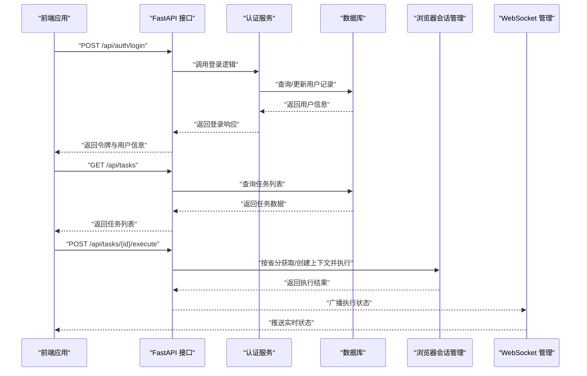
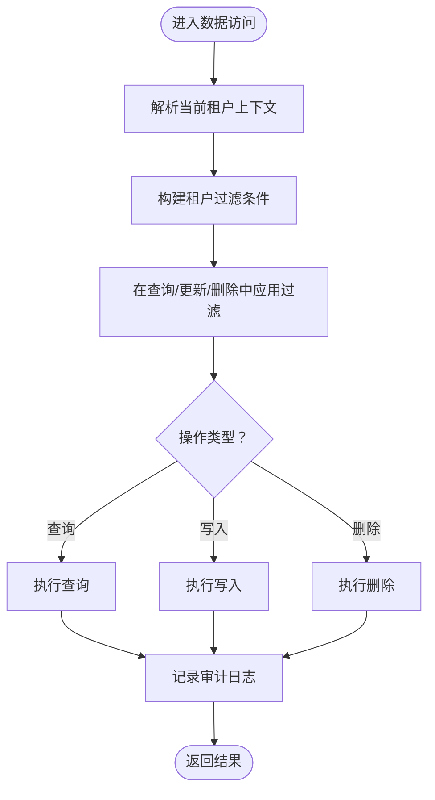
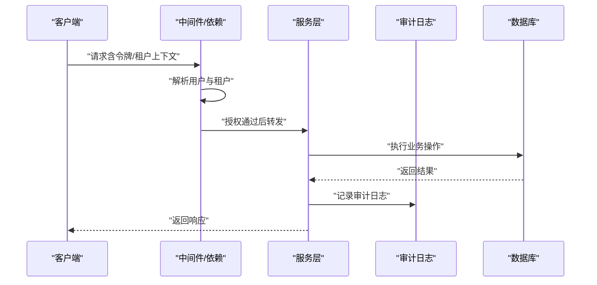
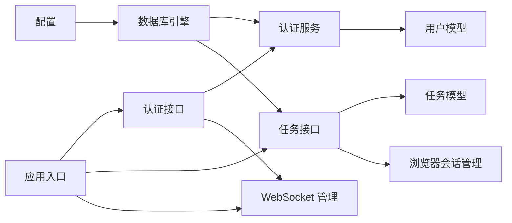

# 数据隔离与安全

<cite>
**本文引用的文件**
- [config.py](file://CCC_RPA_API/app/config.py)
- [database.py](file://CCC_RPA_API/app/database.py)
- [base.py](file://CCC_RPA_API/app/models/base.py)
- [user.py](file://CCC_RPA_API/app/models/user.py)
- [auth.py](file://CCC_RPA_API/app/api/auth.py)
- [auth_service.py](file://CCC_RPA_API/app/services/auth.py)
- [auth_schema.py](file://CCC_RPA_API/app/schemas/auth.py)
- [main.py](file://CCC_RPA_API/app/main.py)
- [session_manager.py](file://CCC_RPA_API/app/browser/session_manager.py)
- [tasks_api.py](file://CCC_RPA_API/app/api/tasks.py)
- [task_model.py](file://CCC_RPA_API/app/models/task.py)
- [task_schema.py](file://CCC_RPA_API/app/schemas/task.py)
- [ws_manager.py](file://CCC_RPA_API/app/ws/manager.py)
</cite>

## 目录
1. [引言](#引言)
2. [项目结构](#项目结构)
3. [核心组件](#核心组件)
4. [架构总览](#架构总览)
5. [详细组件分析](#详细组件分析)
6. [依赖关系分析](#依赖关系分析)
7. [性能考虑](#性能考虑)
8. [故障排查指南](#故障排查指南)
9. [结论](#结论)
10. [附录](#附录)

## 引言
本文件聚焦于多租户环境下的数据隔离与安全机制，结合现有代码库进行系统化梳理，覆盖数据库层面的物理隔离、逻辑隔离与混合隔离的可行性与限制；会话数据与敏感字段的加密存储现状与改进建议；访问控制策略（路由过滤、权限校验、审计日志）的实现现状与增强路径；以及针对 SQL 注入、XSS、CSRF 的安全防护建议与合规性最佳实践。

## 项目结构
后端基于 FastAPI + SQLAlchemy 构建，前端为 Tauri + Vue 应用。安全相关的关键模块分布如下：
- 配置与数据库连接：配置读取、连接池与会话生命周期
- 认证与用户模型：登录、登出、令牌与用户状态
- 业务模型与路由：任务模型、任务路由与执行流程
- 会话管理：浏览器会话持久化与线程隔离
- 实时通信：WebSocket 连接管理
- 前端集成：Tauri 桥接与浏览器自动化

```mermaid
graph TB
subgraph "后端服务"
CFG["配置与数据库<br/>config.py / database.py"]
AUTH_API["认证接口<br/>api/auth.py"]
AUTH_SVC["认证服务<br/>services/auth.py"]
AUTH_MODEL["用户模型<br/>models/user.py"]
TASK_API["任务接口<br/>api/tasks.py"]
TASK_MODEL["任务模型<br/>models/task.py"]
WS["WebSocket 管理<br/>ws/manager.py"]
SM["浏览器会话管理<br/>browser/session_manager.py"]
end
subgraph "前端应用"
TAURI["Tauri 桥接<br/>src-tauri/src/*.rs"]
VUE["Vue 组件与页面<br/>frontend/src/*"]
end
CFG --> AUTH_API
AUTH_API --> AUTH_SVC
AUTH_SVC --> AUTH_MODEL
TASK_API --> TASK_MODEL
AUTH_API --> WS
TASK_API --> SM
TAURI <- --> AUTH_API
TAURI <- --> TASK_API
VUE --> TAURI
```

图表来源
- [config.py:1-22](file://CCC_RPA_API/app/config.py#L1-L22)
- [database.py:1-19](file://CCC_RPA_API/app/database.py#L1-L19)
- [auth.py:1-24](file://CCC_RPA_API/app/api/auth.py#L1-L24)
- [auth_service.py:1-58](file://CCC_RPA_API/app/services/auth.py#L1-L58)
- [user.py:1-17](file://CCC_RPA_API/app/models/user.py#L1-L17)
- [tasks_api.py:1-76](file://CCC_RPA_API/app/api/tasks.py#L1-L76)
- [task_model.py:1-25](file://CCC_RPA_API/app/models/task.py#L1-L25)
- [ws_manager.py:1-29](file://CCC_RPA_API/app/ws/manager.py#L1-L29)
- [session_manager.py:1-183](file://CCC_RPA_API/app/browser/session_manager.py#L1-L183)

章节来源
- [main.py:1-127](file://CCC_RPA_API/app/main.py#L1-L127)
- [config.py:1-22](file://CCC_RPA_API/app/config.py#L1-L22)
- [database.py:1-19](file://CCC_RPA_API/app/database.py#L1-L19)

## 核心组件
- 配置与数据库层
  - 通过设置对象读取数据库连接参数，并生成连接 URL；使用 SQLAlchemy 创建引擎与会话工厂，启用连接池预检与回收。
- 认证与用户模型
  - 提供登录、登出、令牌校验接口；用户模型包含用户标识、设备标识、令牌与激活状态等字段。
- 任务与业务模型
  - 任务模型包含租户标识、设备标识、省分信息等字段，便于后续实现多租户隔离与跨域执行。
- 会话与浏览器自动化
  - 使用专用工作线程承载 Playwright/Chromium，按“省”维度持久化 storage_state，避免线程冲突与状态泄露。
- WebSocket 管理
  - 统一维护客户端连接，支持广播消息，用于执行状态推送与实时通知。

章节来源
- [config.py:6-22](file://CCC_RPA_API/app/config.py#L6-L22)
- [database.py:1-19](file://CCC_RPA_API/app/database.py#L1-L19)
- [user.py:7-17](file://CCC_RPA_API/app/models/user.py#L7-L17)
- [auth.py:10-24](file://CCC_RPA_API/app/api/auth.py#L10-L24)
- [auth_service.py:9-58](file://CCC_RPA_API/app/services/auth.py#L9-L58)
- [task_model.py:8-25](file://CCC_RPA_API/app/models/task.py#L8-L25)
- [session_manager.py:7-183](file://CCC_RPA_API/app/browser/session_manager.py#L7-L183)
- [ws_manager.py:5-29](file://CCC_RPA_API/app/ws/manager.py#L5-L29)

## 架构总览
下图展示认证、任务执行与浏览器会话之间的交互关系，以及数据库与配置层的支撑作用。



图表来源
- [auth.py:10-24](file://CCC_RPA_API/app/api/auth.py#L10-L24)
- [auth_service.py:9-58](file://CCC_RPA_API/app/services/auth.py#L9-L58)
- [tasks_api.py:47-53](file://CCC_RPA_API/app/api/tasks.py#L47-L53)
- [session_manager.py:96-132](file://CCC_RPA_API/app/browser/session_manager.py#L96-L132)
- [ws_manager.py:17-26](file://CCC_RPA_API/app/ws/manager.py#L17-L26)

## 详细组件分析

### 多租户数据隔离策略
- 现状与限制
  - 任务模型包含租户标识字段，但未在查询层强制加入租户过滤条件；当前路由与服务层未对租户边界进行显式约束。
  - 用户模型与任务模型均未实现基于租户的唯一性约束或视图隔离。
- 可行的隔离方案
  - 物理隔离：为每个租户独立部署数据库实例或数据库账号，配合独立连接与备份策略。适用于高敏感度场景。
  - 逻辑隔离：在 ORM 查询层统一注入租户过滤条件，确保所有读写操作默认限定在当前租户范围内；为关键表建立复合唯一索引以避免跨租户误用。
  - 混合隔离：对极高敏感字段采用物理隔离（如密钥、凭证），其余数据采用逻辑隔离；或按租户分库分表（水平拆分）。
- 建议落地步骤
  - 在数据库层为涉及租户的表增加租户维度索引与约束。
  - 在服务层封装通用的租户上下文注入器，确保所有数据访问函数自动携带租户过滤。
  - 对外暴露的 API 在鉴权后解析并绑定租户上下文，拒绝越权访问请求。



章节来源
- [task_model.py:14](file://CCC_RPA_API/app/models/task.py#L14)
- [tasks_api.py:13-15](file://CCC_RPA_API/app/api/tasks.py#L13-L15)
- [main.py:37-87](file://CCC_RPA_API/app/main.py#L37-L87)

### 会话数据与敏感字段加密存储
- 现状
  - 登录接口返回令牌；用户模型包含令牌字段，但未见加密存储或密钥轮换机制。
  - 浏览器会话通过 storage_state 文件持久化到本地目录，未见加密处理。
- 加密与密钥管理建议
  - 敏感字段（如令牌、设备 ID、浏览器状态文件）应采用对称加密（如 AES-GCM）并在传输与落盘时均加密。
  - 密钥管理采用环境变量注入与密钥轮换策略，避免硬编码；建议引入 KMS 或密钥管理服务。
  - 对浏览器状态文件进行加密存储，解密仅在需要时进行，且尽量缩短明文驻留时间。
- 数据脱敏策略
  - 日志输出与错误信息中避免打印完整令牌与敏感字段；对外响应体中仅返回必要字段。
  - 对数据库导出与备份进行脱敏处理，保留业务可用性的同时去除可逆标识。

章节来源
- [auth_service.py:34-38](file://CCC_RPA_API/app/services/auth.py#L34-L38)
- [session_manager.py:16-20](file://CCC_RPA_API/app/browser/session_manager.py#L16-L20)

### 访问控制策略与审计日志
- 路由过滤与权限校验
  - 当前路由未实现租户级权限校验；建议在中间件或依赖注入中解析用户与租户上下文，并在服务层强制校验。
  - 对关键操作（如删除、修改他人任务）增加细粒度权限判断。
- 审计日志
  - 建议在服务层统一记录操作人、租户、资源、动作、时间与结果；可扩展为异步写入与集中上报。
  - 对异常与高风险操作（如越权尝试、批量删除）触发告警。



章节来源
- [auth.py:10-24](file://CCC_RPA_API/app/api/auth.py#L10-L24)
- [auth_service.py:48-58](file://CCC_RPA_API/app/services/auth.py#L48-L58)
- [tasks_api.py:13-44](file://CCC_RPA_API/app/api/tasks.py#L13-L44)

### 安全防护措施实施指南
- SQL 注入防护
  - 使用 ORM（SQLAlchemy）进行数据访问，避免原生 SQL 拼接；对动态表名/列名进行白名单校验。
  - 对外部输入进行严格校验与转义，避免直接拼接到查询语句。
- XSS 攻击防范
  - 前端渲染用户可控内容时进行 HTML 转义；后端响应体避免嵌入未经处理的用户输入。
  - 设置严格的 Content-Security-Policy，限制脚本执行来源。
- CSRF 保护
  - 对有状态修改的接口启用 SameSite Cookie、CSRF Token 校验或一次性令牌机制；前后端协同。
- 其他建议
  - 启用 HTTPS 与 TLS 最低版本限制；对敏感接口增加速率限制与 IP 黑名单。
  - 对数据库凭据与密钥进行最小权限管理与轮换。

章节来源
- [config.py:14-15](file://CCC_RPA_API/app/config.py#L14-L15)
- [database.py:5](file://CCC_RPA_API/app/database.py#L5)

### 数据安全合规性与最佳实践
- 合规要求
  - 明确数据主体权利（访问、更正、删除、可携带）；提供数据处理影响评估与数据泄露通知机制。
  - 对跨境数据传输制定合规流程与安全评估。
- 最佳实践
  - 零信任网络：内部服务间也需鉴权与加密；最小权限原则贯穿 API、数据库与文件系统。
  - 安全开发生命周期：静态扫描、依赖审计、渗透测试与应急响应预案。
  - 可追溯性：完善审计日志与操作回溯能力，满足监管与内审需求。

## 依赖关系分析
- 组件耦合
  - 认证服务依赖用户模型与数据库会话；任务接口依赖任务模型与浏览器会话管理。
  - WebSocket 管理器与任务执行流程耦合，用于状态广播。
- 外部依赖
  - 数据库驱动与 ORM；浏览器自动化框架；WebSocket 协议栈。
- 潜在风险
  - 会话管理与浏览器自动化在多线程环境中需谨慎处理共享状态；数据库连接池需合理配置以避免连接泄漏。



图表来源
- [auth.py:1-24](file://CCC_RPA_API/app/api/auth.py#L1-L24)
- [auth_service.py:1-58](file://CCC_RPA_API/app/services/auth.py#L1-L58)
- [user.py:1-17](file://CCC_RPA_API/app/models/user.py#L1-L17)
- [tasks_api.py:1-76](file://CCC_RPA_API/app/api/tasks.py#L1-L76)
- [task_model.py:1-25](file://CCC_RPA_API/app/models/task.py#L1-L25)
- [session_manager.py:1-183](file://CCC_RPA_API/app/browser/session_manager.py#L1-L183)
- [ws_manager.py:1-29](file://CCC_RPA_API/app/ws/manager.py#L1-L29)
- [main.py:1-127](file://CCC_RPA_API/app/main.py#L1-L127)
- [config.py:1-22](file://CCC_RPA_API/app/config.py#L1-L22)
- [database.py:1-19](file://CCC_RPA_API/app/database.py#L1-L19)

章节来源
- [main.py:1-127](file://CCC_RPA_API/app/main.py#L1-L127)
- [database.py:1-19](file://CCC_RPA_API/app/database.py#L1-L19)

## 性能考虑
- 数据库连接池
  - 启用连接预检与回收，减少无效连接；根据并发量调整池大小与超时阈值。
- 会话与浏览器自动化
  - 专用工作线程避免主线程阻塞；按省分复用上下文降低启动成本；及时清理失效上下文。
- WebSocket 广播
  - 批量发送与去重，避免重复连接导致的消息风暴。

## 故障排查指南
- 认证失败
  - 检查令牌是否正确下发与存储；确认用户状态是否激活；核对客户端 ID 与设备 ID 是否匹配。
- 任务执行异常
  - 查看浏览器会话是否存活；确认 storage_state 文件是否存在且可读；检查专用工作线程是否正常运行。
- 数据访问越权
  - 核对租户上下文是否正确注入；检查服务层过滤条件是否生效；查看审计日志定位异常请求。
- WebSocket 不通
  - 检查连接管理器状态；确认广播线程与事件循环一致性；排查网络与代理配置。

章节来源
- [auth_service.py:40-58](file://CCC_RPA_API/app/services/auth.py#L40-L58)
- [session_manager.py:144-183](file://CCC_RPA_API/app/browser/session_manager.py#L144-L183)
- [ws_manager.py:10-26](file://CCC_RPA_API/app/ws/manager.py#L10-L26)

## 结论
当前代码库在认证与任务执行方面具备基础能力，但在多租户隔离、敏感数据加密与访问控制方面尚有较大提升空间。建议优先实现租户级查询过滤与权限校验，配套完善的审计日志与密钥管理体系，并加强 SQL 注入、XSS、CSRF 等常见攻击面的防护，以满足生产环境下的数据隔离与安全合规要求。

## 附录
- 快速检查清单
  - 是否为所有读写操作强制注入租户过滤？
  - 是否对令牌与浏览器状态文件进行加密存储？
  - 是否实现统一的审计日志与告警机制？
  - 是否启用 HTTPS、CSP、CSRF 保护与速率限制？