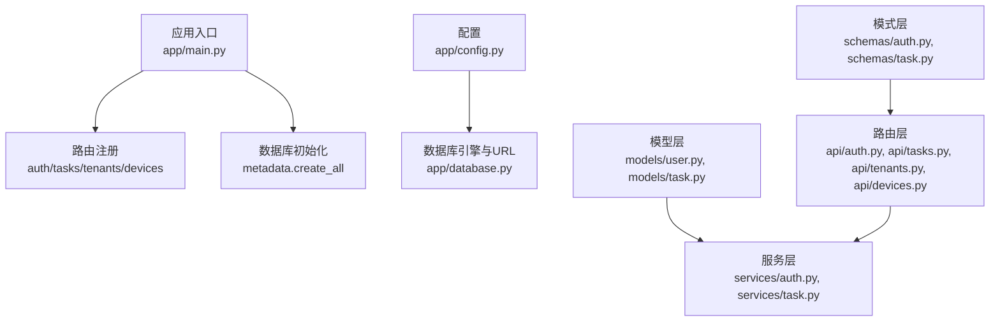
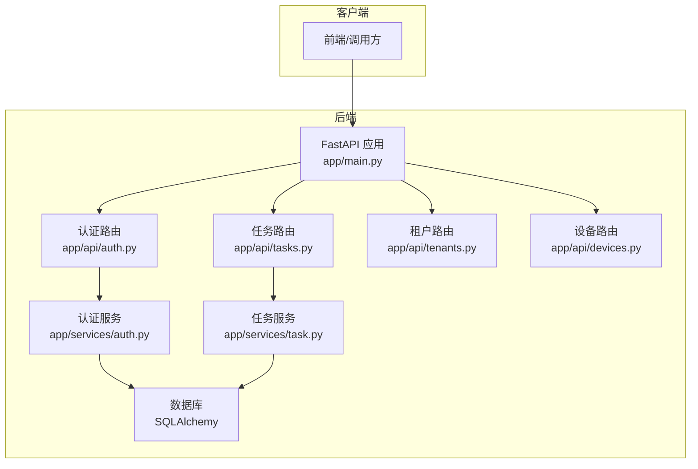
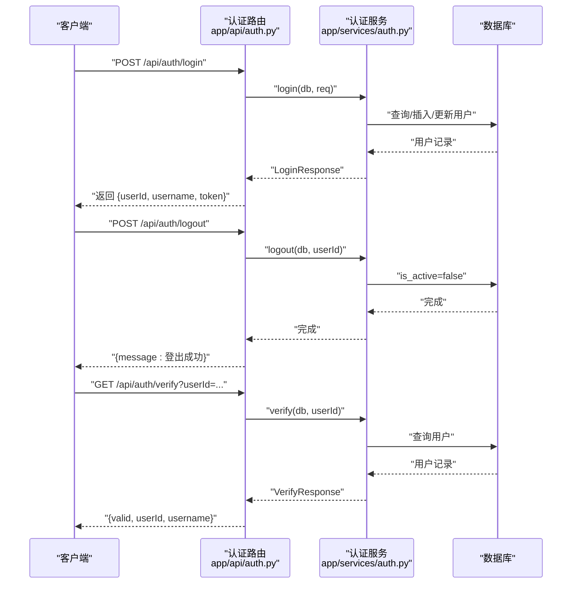
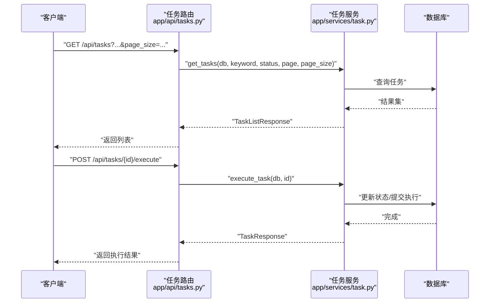
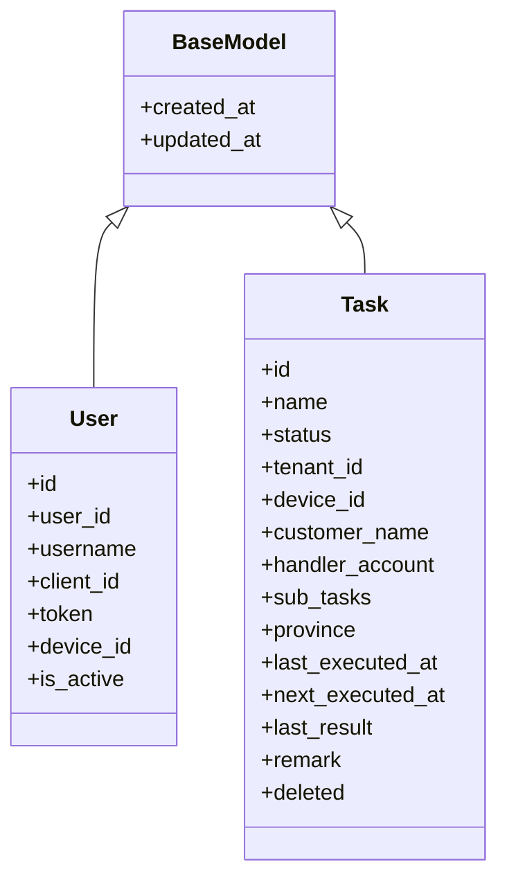
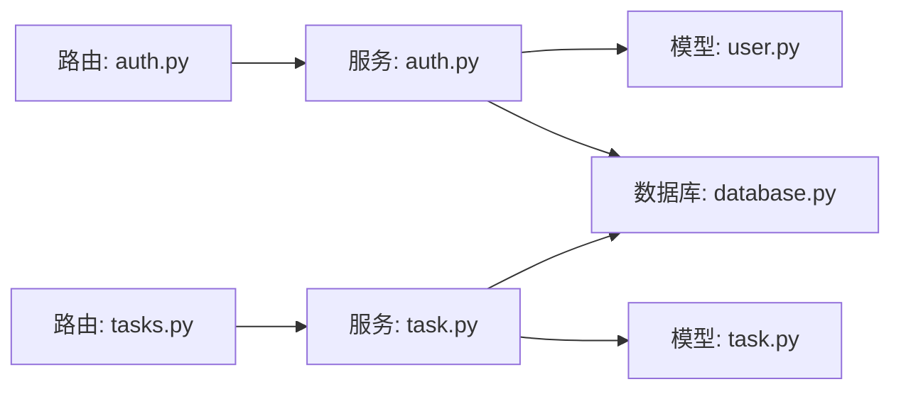

# 用户角色管理

<cite>
**本文档引用的文件**
- [app/main.py](file://CCC_RPA_API/app/main.py)
- [app/config.py](file://CCC_RPA_API/app/config.py)
- [app/database.py](file://CCC_RPA_API/app/database.py)
- [app/models/base.py](file://CCC_RPA_API/app/models/base.py)
- [app/models/user.py](file://CCC_RPA_API/app/models/user.py)
- [app/models/task.py](file://CCC_RPA_API/app/models/task.py)
- [app/api/auth.py](file://CCC_RPA_API/app/api/auth.py)
- [app/api/tasks.py](file://CCC_RPA_API/app/api/tasks.py)
- [app/api/devices.py](file://CCC_RPA_API/app/api/devices.py)
- [app/api/tenants.py](file://CCC_RPA_API/app/api/tenants.py)
- [app/schemas/auth.py](file://CCC_RPA_API/app/schemas/auth.py)
- [app/schemas/task.py](file://CCC_RPA_API/app/schemas/task.py)
- [app/services/auth.py](file://CCC_RPA_API/app/services/auth.py)
- [app/services/task.py](file://CCC_RPA_API/app/services/task.py)
</cite>

## 目录
1. [简介](#简介)
2. [项目结构](#项目结构)
3. [核心组件](#核心组件)
4. [架构总览](#架构总览)
5. [详细组件分析](#详细组件分析)
6. [依赖分析](#依赖分析)
7. [性能考虑](#性能考虑)
8. [故障排查指南](#故障排查指南)
9. [结论](#结论)
10. [附录](#附录)

## 简介
本文件围绕用户角色管理进行系统化技术文档整理，重点覆盖以下方面：
- 用户角色的创建、分配与管理机制：当前仓库中用户模型与认证服务实现了基础的登录、登出与有效性校验；但未发现显式的“角色”实体或“权限”实体定义，亦无基于角色的权限控制中间件或装饰器。
- 权限映射、继承关系与动态权限检查：当前代码库未实现角色到权限的映射、继承与动态权限检查逻辑。
- 认证与授权流程：采用基于用户令牌的登录/登出/有效性校验，但未集成 JWT 签发、权限中间件或会话管理。
- 动态权限更新与缓存同步：当前未实现权限变更传播与缓存同步策略。
- API 接口清单：提供认证与任务相关接口的定义与调用路径，以及用户 CRUD 的缺失现状。

## 项目结构
后端采用 FastAPI + SQLAlchemy 架构，按功能模块组织：
- 应用入口与路由注册：在应用启动时创建数据库表并注册认证、任务、租户、设备等路由。
- 数据层：统一的 Base 类与数据库引擎、会话工厂。
- 模型层：用户、任务等实体模型。
- 路由层：各模块的 API 路由定义。
- 服务层：业务逻辑封装。
- 模式层：请求/响应的 Pydantic 模型。

图表来源
- [app/main.py:30-39](file://CCC_RPA_API/app/main.py#L30-L39)
- [app/config.py:6-22](file://CCC_RPA_API/app/config.py#L6-L22)
- [app/database.py:1-19](file://CCC_RPA_API/app/database.py#L1-L19)
- [app/models/user.py:7-17](file://CCC_RPA_API/app/models/user.py#L7-L17)
- [app/models/task.py:8-25](file://CCC_RPA_API/app/models/task.py#L8-L25)
- [app/api/auth.py:1-24](file://CCC_RPA_API/app/api/auth.py#L1-L24)
- [app/api/tasks.py:1-76](file://CCC_RPA_API/app/api/tasks.py#L1-L76)
- [app/api/tenants.py:1-25](file://CCC_RPA_API/app/api/tenants.py#L1-L25)
- [app/api/devices.py:1-24](file://CCC_RPA_API/app/api/devices.py#L1-L24)
- [app/schemas/auth.py:1-26](file://CCC_RPA_API/app/schemas/auth.py#L1-L26)
- [app/schemas/task.py:1-58](file://CCC_RPA_API/app/schemas/task.py#L1-L58)
- [app/services/auth.py:1-58](file://CCC_RPA_API/app/services/auth.py#L1-L58)
- [app/services/task.py:1-157](file://CCC_RPA_API/app/services/task.py#L1-L157)

章节来源
- [app/main.py:12-27](file://CCC_RPA_API/app/main.py#L12-L27)
- [app/config.py:6-22](file://CCC_RPA_API/app/config.py#L6-L22)
- [app/database.py:1-19](file://CCC_RPA_API/app/database.py#L1-L19)

## 核心组件
- 应用入口与生命周期
  - 启动时创建数据库表并进行列迁移兼容处理，注册认证、任务、租户、设备路由。
  - 提供健康检查与 WebSocket 端点。
- 数据库与配置
  - 统一的 Base 类与会话工厂，支持连接池预检与回收。
  - 通过 Settings 读取环境变量生成数据库 URL。
- 模型层
  - 用户模型包含用户标识、用户名、客户端标识、令牌、设备标识与激活状态。
  - 任务模型包含任务元数据、租户/设备关联、省分信息、执行时间与结果等。
- 路由与服务
  - 认证路由提供登录、登出、有效性校验。
  - 任务路由提供增删改查、执行、日志查询等。
  - 租户与设备为模拟数据接口。
- 模式层
  - 登录/登出/校验的请求与响应模型。
  - 任务的创建、更新、列表与详情模型。

章节来源
- [app/main.py:30-116](file://CCC_RPA_API/app/main.py#L30-L116)
- [app/database.py:1-19](file://CCC_RPA_API/app/database.py#L1-L19)
- [app/config.py:6-22](file://CCC_RPA_API/app/config.py#L6-L22)
- [app/models/user.py:7-17](file://CCC_RPA_API/app/models/user.py#L7-L17)
- [app/models/task.py:8-25](file://CCC_RPA_API/app/models/task.py#L8-L25)
- [app/api/auth.py:1-24](file://CCC_RPA_API/app/api/auth.py#L1-L24)
- [app/api/tasks.py:1-76](file://CCC_RPA_API/app/api/tasks.py#L1-L76)
- [app/api/tenants.py:1-25](file://CCC_RPA_API/app/api/tenants.py#L1-L25)
- [app/api/devices.py:1-24](file://CCC_RPA_API/app/api/devices.py#L1-L24)
- [app/schemas/auth.py:1-26](file://CCC_RPA_API/app/schemas/auth.py#L1-L26)
- [app/schemas/task.py:1-58](file://CCC_RPA_API/app/schemas/task.py#L1-L58)

## 架构总览
下图展示从客户端到服务层的整体交互流程，突出认证与任务两大模块：

图表来源
- [app/main.py:24-27](file://CCC_RPA_API/app/main.py#L24-L27)
- [app/api/auth.py:1-24](file://CCC_RPA_API/app/api/auth.py#L1-L24)
- [app/api/tasks.py:1-76](file://CCC_RPA_API/app/api/tasks.py#L1-L76)
- [app/api/tenants.py:1-25](file://CCC_RPA_API/app/api/tenants.py#L1-L25)
- [app/api/devices.py:1-24](file://CCC_RPA_API/app/api/devices.py#L1-L24)
- [app/services/auth.py:1-58](file://CCC_RPA_API/app/services/auth.py#L1-L58)
- [app/services/task.py:1-157](file://CCC_RPA_API/app/services/task.py#L1-L157)

## 详细组件分析

### 认证与会话管理
- 登录流程
  - 客户端提交 client_id、token、device_id、username。
  - 服务根据 client_id 查询用户，若不存在则创建新用户并写入 token、device_id、username 等字段；若存在则更新 token、device_id、username，并设置 is_active。
  - 返回 userId、username、token。
- 登出流程
  - 根据 userId 将 is_active 设置为 false。
- 有效性校验
  - 根据 userId 查询用户，返回 valid、userId、username。

图表来源
- [app/api/auth.py:10-23](file://CCC_RPA_API/app/api/auth.py#L10-L23)
- [app/services/auth.py:9-57](file://CCC_RPA_API/app/services/auth.py#L9-L57)
- [app/schemas/auth.py:5-26](file://CCC_RPA_API/app/schemas/auth.py#L5-L26)

章节来源
- [app/api/auth.py:1-24](file://CCC_RPA_API/app/api/auth.py#L1-L24)
- [app/services/auth.py:1-58](file://CCC_RPA_API/app/services/auth.py#L1-L58)
- [app/schemas/auth.py:1-26](file://CCC_RPA_API/app/schemas/auth.py#L1-L26)

### 任务管理与执行
- 任务列表、详情、创建、更新、删除、执行、日志查询等接口均已在路由层定义。
- 服务层负责查询、持久化、JSON 字段处理与异步执行提交。

图表来源
- [app/api/tasks.py:13-75](file://CCC_RPA_API/app/api/tasks.py#L13-L75)
- [app/services/task.py:47-133](file://CCC_RPA_API/app/services/task.py#L47-L133)
- [app/schemas/task.py:5-58](file://CCC_RPA_API/app/schemas/task.py#L5-L58)

章节来源
- [app/api/tasks.py:1-76](file://CCC_RPA_API/app/api/tasks.py#L1-L76)
- [app/services/task.py:1-157](file://CCC_RPA_API/app/services/task.py#L1-L157)
- [app/schemas/task.py:1-58](file://CCC_RPA_API/app/schemas/task.py#L1-L58)

### 数据模型与关系
- 用户模型与任务模型均继承自统一的 BaseModel，具备通用的时间戳字段。
- 当前未发现角色与权限的独立模型，也未发现用户与角色/权限之间的关联关系。

图表来源
- [app/models/base.py:7-11](file://CCC_RPA_API/app/models/base.py#L7-L11)
- [app/models/user.py:7-17](file://CCC_RPA_API/app/models/user.py#L7-L17)
- [app/models/task.py:8-25](file://CCC_RPA_API/app/models/task.py#L8-L25)

章节来源
- [app/models/base.py:1-11](file://CCC_RPA_API/app/models/base.py#L1-L11)
- [app/models/user.py:1-17](file://CCC_RPA_API/app/models/user.py#L1-L17)
- [app/models/task.py:1-25](file://CCC_RPA_API/app/models/task.py#L1-L25)

### 角色与权限管理现状
- 当前代码库未实现角色实体、权限实体或用户与角色/权限的关联模型。
- 未发现基于角色的权限中间件、装饰器或动态权限检查逻辑。
- 未发现权限变更传播与缓存同步策略。

章节来源
- [app/models/user.py:7-17](file://CCC_RPA_API/app/models/user.py#L7-L17)
- [app/models/task.py:8-25](file://CCC_RPA_API/app/models/task.py#L8-L25)

## 依赖分析
- 组件耦合
  - 路由层仅依赖服务层，服务层依赖模型层与数据库会话。
  - 认证与任务模块相对独立，分别通过各自的路由与服务实现。
- 外部依赖
  - FastAPI、SQLAlchemy、Pydantic、MySQL 驱动。
- 可能的改进
  - 引入角色/权限模型与中间件以实现 RBAC。
  - 增加 JWT 中间件与权限校验装饰器。
  - 实现权限变更的缓存同步与传播。

图表来源
- [app/api/auth.py:1-24](file://CCC_RPA_API/app/api/auth.py#L1-L24)
- [app/api/tasks.py:1-76](file://CCC_RPA_API/app/api/tasks.py#L1-L76)
- [app/services/auth.py:1-58](file://CCC_RPA_API/app/services/auth.py#L1-L58)
- [app/services/task.py:1-157](file://CCC_RPA_API/app/services/task.py#L1-L157)
- [app/models/user.py:7-17](file://CCC_RPA_API/app/models/user.py#L7-L17)
- [app/models/task.py:8-25](file://CCC_RPA_API/app/models/task.py#L8-L25)
- [app/database.py:1-19](file://CCC_RPA_API/app/database.py#L1-L19)

章节来源
- [app/api/auth.py:1-24](file://CCC_RPA_API/app/api/auth.py#L1-L24)
- [app/api/tasks.py:1-76](file://CCC_RPA_API/app/api/tasks.py#L1-L76)
- [app/services/auth.py:1-58](file://CCC_RPA_API/app/services/auth.py#L1-L58)
- [app/services/task.py:1-157](file://CCC_RPA_API/app/services/task.py#L1-L157)
- [app/database.py:1-19](file://CCC_RPA_API/app/database.py#L1-L19)

## 性能考虑
- 数据库连接池
  - 已启用连接池预检与回收，有助于减少连接开销与异常恢复。
- 查询优化
  - 模型中对常用过滤字段建立索引（如用户唯一索引、任务状态与名称索引），有利于提升查询效率。
- 任务执行
  - 任务执行采用异步提交，避免阻塞主线程。
- 缓存与权限
  - 当前未实现权限缓存与同步策略，建议在引入 RBAC 后增加缓存层与失效机制。

章节来源
- [app/database.py:5-6](file://CCC_RPA_API/app/database.py#L5-L6)
- [app/models/user.py:11](file://CCC_RPA_API/app/models/user.py#L11)
- [app/models/task.py:13](file://CCC_RPA_API/app/models/task.py#L13)
- [app/services/task.py:120-133](file://CCC_RPA_API/app/services/task.py#L120-L133)

## 故障排查指南
- 认证失败
  - 检查 client_id 是否正确，确认数据库中是否存在对应记录。
  - 确认 token 与 device_id 是否在登录时正确更新。
- 登出无效
  - 确认 userId 是否传入且存在，is_active 是否被置为 false。
- 有效性校验
  - 若返回 valid=false，检查用户是否存在且 is_active 是否为 true。
- 任务操作异常
  - 检查任务是否存在且未被标记删除。
  - 执行失败时查看返回的错误信息。

章节来源
- [app/services/auth.py:41-57](file://CCC_RPA_API/app/services/auth.py#L41-L57)
- [app/services/task.py:120-125](file://CCC_RPA_API/app/services/task.py#L120-L125)

## 结论
- 当前代码库实现了基础的用户认证与任务管理能力，但尚未实现角色与权限体系。
- 建议在现有基础上扩展角色/权限模型、RBAC 中间件与 JWT 集成，并配套缓存与权限变更传播策略。
- 在保持现有路由与服务边界清晰的前提下，逐步引入权限控制与安全加固。

## 附录

### API 接口清单（认证与任务）
- 认证
  - POST /api/auth/login
    - 请求体：client_id、token、device_id、username
    - 响应体：userId、username、token
  - POST /api/auth/logout
    - 请求体：userId
    - 响应体：消息
  - GET /api/auth/verify
    - 查询参数：userId
    - 响应体：valid、userId、username
- 任务
  - GET /api/tasks
    - 查询参数：keyword、status、page、page_size
    - 响应体：任务列表与分页信息
  - POST /api/tasks
    - 请求体：任务创建字段
    - 响应体：任务详情
  - GET /api/tasks/{task_id}
    - 响应体：任务详情
  - PUT /api/tasks/{task_id}
    - 请求体：任务更新字段
    - 响应体：任务详情
  - DELETE /api/tasks/{task_id}
    - 响应体：消息
  - POST /api/tasks/{task_id}/execute
    - 响应体：任务详情或错误信息
  - GET /api/tasks/{task_id}/logs
    - 响应体：执行日志列表
  - POST /api/tasks/{task_id}/scan-complete
    - 响应体：成功标志
  - POST /api/tasks/{task_id}/select-company
    - 请求体：公司选择数据
    - 响应体：成功标志
  - POST /api/tasks/{task_id}/cancel-execution
    - 响应体：成功标志
- 租户与设备
  - GET /api/tenants
    - 响应体：租户列表
  - GET /api/devices
    - 响应体：设备列表

章节来源
- [app/api/auth.py:10-23](file://CCC_RPA_API/app/api/auth.py#L10-L23)
- [app/api/tasks.py:13-75](file://CCC_RPA_API/app/api/tasks.py#L13-L75)
- [app/api/tenants.py:21-24](file://CCC_RPA_API/app/api/tenants.py#L21-L24)
- [app/api/devices.py:20-23](file://CCC_RPA_API/app/api/devices.py#L20-L23)
- [app/schemas/auth.py:5-26](file://CCC_RPA_API/app/schemas/auth.py#L5-L26)
- [app/schemas/task.py:5-58](file://CCC_RPA_API/app/schemas/task.py#L5-L58)