# 租户管理模块

<cite>
**本文档引用的文件**
- [app/main.py](file://CCC_RPA_API/app/main.py)
- [app/api/tenants.py](file://CCC_RPA_API/app/api/tenants.py)
- [app/models/tenant.py](file://CCC_RPA_API/app/models/tenant.py)
- [app/schemas/tenant.py](file://CCC_RPA_API/app/schemas/tenant.py)
- [app/database.py](file://CCC_RPA_API/app/database.py)
- [app/models/base.py](file://CCC_RPA_API/app/models/base.py)
- [app/api/tasks.py](file://CCC_RPA_API/app/api/tasks.py)
- [app/models/task.py](file://CCC_RPA_API/app/models/task.py)
- [app/models/user.py](file://CCC_RPA_API/app/models/user.py)
- [app/models/device.py](file://CCC_RPA_API/app/models/device.py)
- [app/services/task.py](file://CCC_RPA_API/app/services/task.py)
- [app/services/auth.py](file://CCC_RPA_API/app/services/auth.py)
- [app/services/executor.py](file://CCC_RPA_API/app/services/executor.py)
- [app/browser/session_manager.py](file://CCC_RPA_API/app/browser/session_manager.py)
- [app/ws/manager.py](file://CCC_RPA_API/app/ws/manager.py)
- [app/schemas/task.py](file://CCC_RPA_API/app/schemas/task.py)
- [app/schemas/auth.py](file://CCC_RPA_API/app/schemas/auth.py)
- [frontend/src/api/device.ts](file://CCC-BrowserV4/frontend/src/api/device.ts)
- [frontend/src/api/request.ts](file://CCC-BrowserV4/frontend/src/api/request.ts)
</cite>

## 更新摘要
**变更内容**
- 租户管理模块已从mock数据完全迁移到数据库驱动实现
- 新增完整的CRUD操作接口（创建、读取、更新、删除）
- 实现数据库集成、错误处理、日志记录和验证功能
- 保持与前端API的向后兼容性
- 添加租户实体与数据库表结构
- 实现租户生命周期管理（激活、暂停、注销）

## 目录
1. [简介](#简介)
2. [项目结构](#项目结构)
3. [核心组件](#核心组件)
4. [架构总览](#架构总览)
5. [详细组件分析](#详细组件分析)
6. [依赖关系分析](#依赖关系分析)
7. [性能考量](#性能考量)
8. [故障排查指南](#故障排查指南)
9. [结论](#结论)
10. [附录](#附录)

## 简介
本文件面向"租户管理模块"的设计与实现，聚焦以下目标：
- 租户的创建、配置与管理流程
- 租户信息的存储结构、配置参数与状态管理
- 并发配额管理机制（会话数量限制、资源使用监控与配额预警）
- 租户数据隔离（数据库层面物理隔离、会话数据加密存储与访问控制）
- 租户生命周期管理（激活、暂停、注销）
- 租户配置相关 API 接口文档与使用示例

**更新** 租户管理模块已完成从mock数据到数据库驱动实现的重大升级，现提供完整的CRUD操作和生产级功能。

## 项目结构
后端采用 FastAPI + SQLAlchemy 架构，前端为 Vue + Tauri 前端工程。租户管理相关代码集中在后端 API 层与服务层，前端通过统一请求封装调用后端接口。

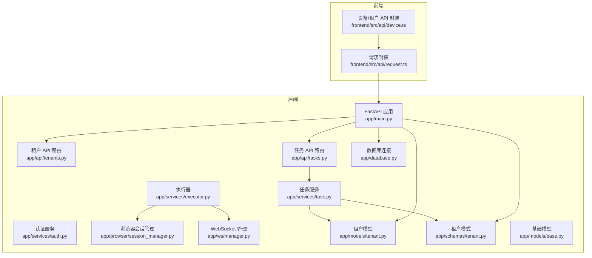

**图表来源**
- [app/main.py:1-156](file://CCC_RPA_API/app/main.py#L1-L156)
- [app/api/tenants.py:1-100](file://CCC_RPA_API/app/api/tenants.py#L1-L100)
- [app/models/tenant.py:1-14](file://CCC_RPA_API/app/models/tenant.py#L1-L14)
- [app/schemas/tenant.py:1-43](file://CCC_RPA_API/app/schemas/tenant.py#L1-L43)
- [app/database.py:1-19](file://CCC_RPA_API/app/database.py#L1-L19)
- [frontend/src/api/device.ts:1-22](file://CCC-BrowserV4/frontend/src/api/device.ts#L1-L22)
- [frontend/src/api/request.ts:1-18](file://CCC-BrowserV4/frontend/src/api/request.ts#L1-L18)

**章节来源**
- [app/main.py:1-156](file://CCC_RPA_API/app/main.py#L1-L156)
- [app/api/tenants.py:1-100](file://CCC_RPA_API/app/api/tenants.py#L1-L100)
- [frontend/src/api/device.ts:1-22](file://CCC-BrowserV4/frontend/src/api/device.ts#L1-L22)
- [frontend/src/api/request.ts:1-18](file://CCC-BrowserV4/frontend/src/api/request.ts#L1-L18)

## 核心组件
- **租户 API 路由**：提供完整的租户 CRUD 接口，包括列表查询、详情获取、创建、更新和软删除
- **租户模型**：基于 SQLAlchemy 的 ORM 模型，支持租户编码唯一性、名称必填、省份信息和激活状态
- **租户模式**：Pydantic 模式定义，提供数据验证和序列化功能
- **数据库连接**：使用 SQLAlchemy 进行数据库连接管理和会话管理
- **任务模型与服务**：任务表包含租户标识字段，用于关联任务与租户
- **认证与用户模型**：用户表含租户相关字段，支撑用户维度的租户绑定
- **执行器与浏览器会话**：执行器按省份维护浏览器上下文，为后续按租户/省份隔离提供基础
- **WebSocket 管理**：用于向客户端推送执行进度与状态

**章节来源**
- [app/api/tenants.py:1-100](file://CCC_RPA_API/app/api/tenants.py#L1-L100)
- [app/models/tenant.py:1-14](file://CCC_RPA_API/app/models/tenant.py#L1-L14)
- [app/schemas/tenant.py:1-43](file://CCC_RPA_API/app/schemas/tenant.py#L1-L43)
- [app/database.py:1-19](file://CCC_RPA_API/app/database.py#L1-L19)
- [app/models/task.py:1-25](file://CCC_RPA_API/app/models/task.py#L1-L25)
- [app/models/user.py:1-17](file://CCC_RPA_API/app/models/user.py#L1-L17)
- [app/services/executor.py:1-308](file://CCC_RPA_API/app/services/executor.py#L1-L308)
- [app/browser/session_manager.py:1-183](file://CCC_RPA_API/app/browser/session_manager.py#L1-L183)
- [app/ws/manager.py:1-29](file://CCC_RPA_API/app/ws/manager.py#L1-L29)

## 架构总览
下图展示租户相关的关键交互路径：前端通过设备/租户 API 获取租户列表，后端通过 SQLAlchemy 连接数据库；任务执行链路中，任务模型携带租户标识，执行器按省份管理浏览器上下文，WebSocket 推送执行状态。

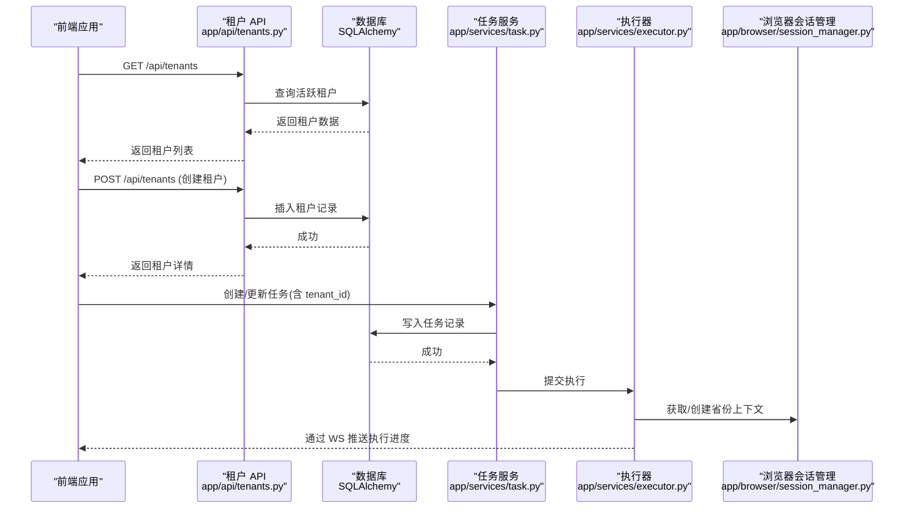

**图表来源**
- [app/api/tenants.py:36-100](file://CCC_RPA_API/app/api/tenants.py#L36-L100)
- [app/database.py:13-19](file://CCC_RPA_API/app/database.py#L13-L19)
- [app/services/task.py:1-157](file://CCC_RPA_API/app/services/task.py#L1-L157)
- [app/services/executor.py:1-308](file://CCC_RPA_API/app/services/executor.py#L1-L308)
- [app/browser/session_manager.py:1-183](file://CCC_RPA_API/app/browser/session_manager.py#L1-L183)
- [frontend/src/api/device.ts:13-16](file://CCC-BrowserV4/frontend/src/api/device.ts#L13-L16)
- [frontend/src/api/request.ts:3-6](file://CCC-BrowserV4/frontend/src/api/request.ts#L3-L6)

## 详细组件分析

### 租户 API 组件
**更新** 租户 API 已完全重构为数据库驱动实现，提供完整的 CRUD 操作：

- **列表查询**：获取所有活跃租户，返回简化格式供前端下拉选择
- **详情获取**：根据租户ID获取完整租户信息
- **创建租户**：验证租户编码唯一性，创建新租户并返回详细信息
- **更新租户**：支持部分字段更新，包括名称、省份和激活状态
- **软删除**：将租户的 is_active 字段设为 False 实现逻辑删除

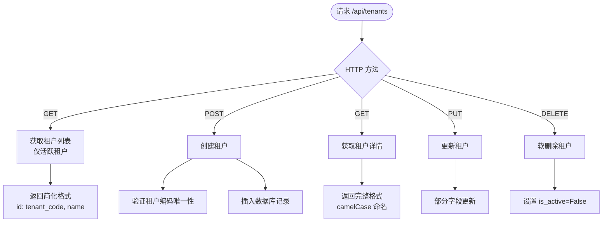

**图表来源**
- [app/api/tenants.py:36-100](file://CCC_RPA_API/app/api/tenants.py#L36-L100)

**章节来源**
- [app/api/tenants.py:1-100](file://CCC_RPA_API/app/api/tenants.py#L1-L100)

### 租户模型与数据库结构
**更新** 新增完整的租户数据库模型和表结构：

- **租户表**：包含自增主键、唯一租户编码、名称、省份、激活状态等字段
- **索引优化**：租户编码建立唯一索引，提高查询效率
- **默认值**：激活状态默认为 True
- **数据类型**：使用合适的字符串长度限制

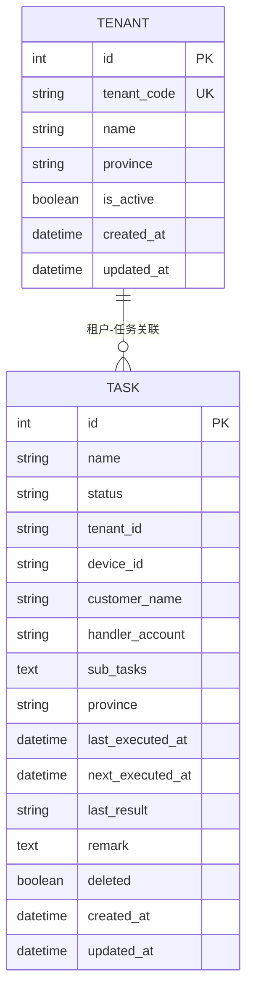

**图表来源**
- [app/models/tenant.py:7-14](file://CCC_RPA_API/app/models/tenant.py#L7-L14)
- [app/models/task.py:1-25](file://CCC_RPA_API/app/models/task.py#L1-L25)

**章节来源**
- [app/models/tenant.py:1-14](file://CCC_RPA_API/app/models/tenant.py#L1-L14)
- [app/models/task.py:1-25](file://CCC_RPA_API/app/models/task.py#L1-L25)

### 租户模式与数据验证
**更新** 新增完整的 Pydantic 模式定义：

- **创建模式**：验证租户创建请求的数据结构
- **更新模式**：支持部分字段更新的灵活验证
- **响应模式**：提供前后端兼容的响应格式
- **数据验证**：自动验证输入数据的类型和格式

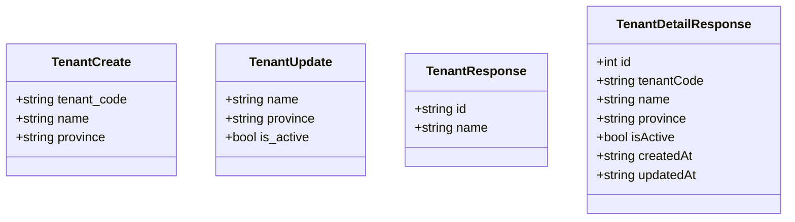

**图表来源**
- [app/schemas/tenant.py:5-43](file://CCC_RPA_API/app/schemas/tenant.py#L5-L43)

**章节来源**
- [app/schemas/tenant.py:1-43](file://CCC_RPA_API/app/schemas/tenant.py#L1-L43)

### 数据库连接与会话管理
**更新** 新增数据库连接基础设施：

- **引擎配置**：使用环境变量配置数据库连接，支持连接池预热和回收
- **会话管理**：提供依赖注入的数据库会话获取函数
- **模型注册**：在应用启动时自动创建表结构
- **种子数据**：应用启动时自动插入初始租户数据

**章节来源**
- [app/database.py:1-19](file://CCC_RPA_API/app/database.py#L1-L19)
- [app/main.py:37-118](file://CCC_RPA_API/app/main.py#L37-L118)

### 认证与用户模型
- 用户模型包含租户相关字段，可用于用户级租户绑定
- 认证服务提供登录、登出、校验能力

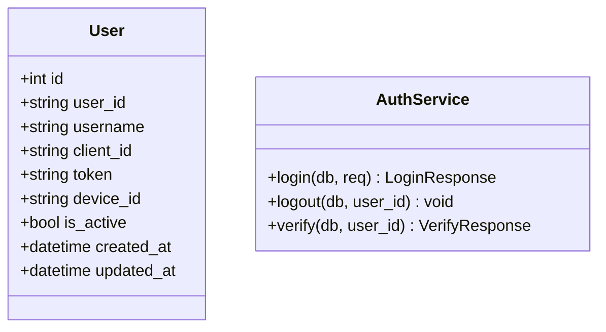

**图表来源**
- [app/models/user.py:1-17](file://CCC_RPA_API/app/models/user.py#L1-L17)
- [app/services/auth.py:1-58](file://CCC_RPA_API/app/services/auth.py#L1-L58)

**章节来源**
- [app/models/user.py:1-17](file://CCC_RPA_API/app/models/user.py#L1-L17)
- [app/services/auth.py:1-58](file://CCC_RPA_API/app/services/auth.py#L1-L58)

### 执行器与浏览器会话管理
- 执行器在独立线程池中运行任务逻辑，通过 WebSocket 推送执行进度
- 浏览器会话管理器按省份维护上下文，持久化 storage_state，避免重复登录
- 支持会话恢复与关闭，保障长时间任务的稳定性

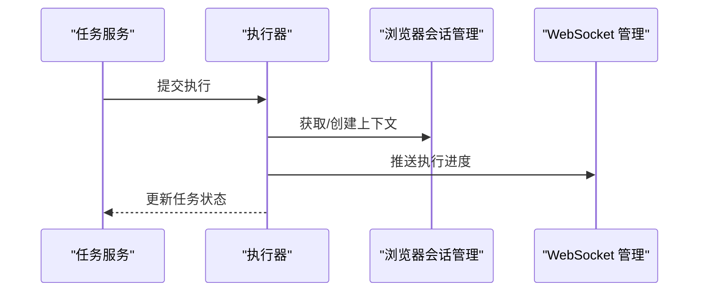

**图表来源**
- [app/services/executor.py:1-308](file://CCC_RPA_API/app/services/executor.py#L1-L308)
- [app/browser/session_manager.py:1-183](file://CCC_RPA_API/app/browser/session_manager.py#L1-L183)
- [app/ws/manager.py:1-29](file://CCC_RPA_API/app/ws/manager.py#L1-L29)

**章节来源**
- [app/services/executor.py:1-308](file://CCC_RPA_API/app/services/executor.py#L1-L308)
- [app/browser/session_manager.py:1-183](file://CCC_RPA_API/app/browser/session_manager.py#L1-L183)
- [app/ws/manager.py:1-29](file://CCC_RPA_API/app/ws/manager.py#L1-L29)

### 并发配额管理机制（设计建议）
- 会话数量限制：通过浏览器会话管理器按省份维护上下文，限制同一时间活跃上下文数量
- 资源使用监控：执行器线程池大小与浏览器工作线程配合，避免资源争用
- 配额预警：可通过 WebSocket 推送"即将达到上限"提示，结合外部指标系统进行告警

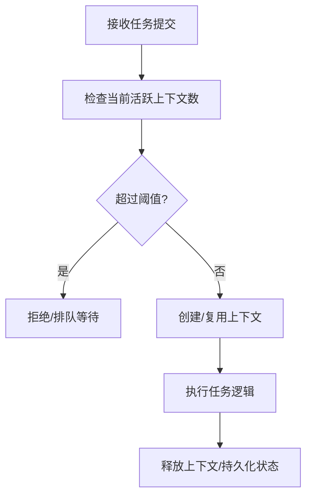

**图表来源**
- [app/browser/session_manager.py:1-183](file://CCC_RPA_API/app/browser/session_manager.py#L1-L183)
- [app/services/executor.py:1-308](file://CCC_RPA_API/app/services/executor.py#L1-L308)

**章节来源**
- [app/browser/session_manager.py:1-183](file://CCC_RPA_API/app/browser/session_manager.py#L1-L183)
- [app/services/executor.py:1-308](file://CCC_RPA_API/app/services/executor.py#L1-L308)

### 租户数据隔离（设计建议）
- 数据库层面：按租户 ID 在查询时强制加上过滤条件，确保跨租户数据不可见
- 会话数据：浏览器 storage_state 按省份持久化，避免跨租户共享登录态
- 访问控制：在认证与授权层加入租户维度校验，防止越权访问

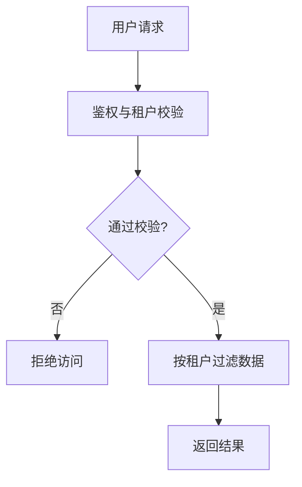

**图表来源**
- [app/models/task.py:1-25](file://CCC_RPA_API/app/models/task.py#L1-L25)
- [app/services/task.py:1-157](file://CCC_RPA_API/app/services/task.py#L1-L157)
- [app/models/user.py:1-17](file://CCC_RPA_API/app/models/user.py#L1-L17)

**章节来源**
- [app/models/task.py:1-25](file://CCC_RPA_API/app/models/task.py#L1-L25)
- [app/services/task.py:1-157](file://CCC_RPA_API/app/services/task.py#L1-L157)
- [app/models/user.py:1-17](file://CCC_RPA_API/app/models/user.py#L1-L17)

### 租户生命周期管理
**更新** 新增完整的租户生命周期管理功能：

- **激活**：默认创建的租户即为激活状态，允许其任务执行与资源分配
- **暂停**：通过更新租户的 is_active 字段为 False 实现暂停
- **注销**：通过软删除实现注销，保留历史数据但禁止使用

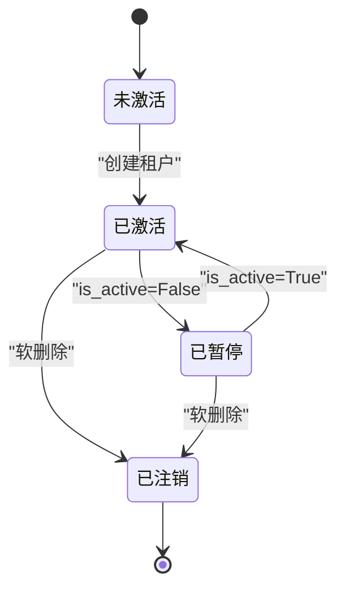

**图表来源**
- [app/api/tenants.py:72-100](file://CCC_RPA_API/app/api/tenants.py#L72-L100)
- [app/models/tenant.py:12-13](file://CCC_RPA_API/app/models/tenant.py#L12-L13)

**章节来源**
- [app/api/tenants.py:1-100](file://CCC_RPA_API/app/api/tenants.py#L1-L100)
- [app/models/tenant.py:1-14](file://CCC_RPA_API/app/models/tenant.py#L1-L14)

### 租户配置 API 接口文档
**更新** 完整的租户管理 API 接口文档：

#### 获取租户列表
- **方法**：GET
- **路径**：/api/tenants
- **请求参数**：无
- **响应**：租户列表（仅活跃租户，简化格式）
- **响应格式**：`[{id: string, name: string}]`

#### 获取租户详情
- **方法**：GET
- **路径**：/api/tenants/{tenant_id}
- **请求参数**：tenant_id (路径参数)
- **响应**：租户详情（完整格式）
- **响应格式**：`{id: number, tenantCode: string, name: string, province: string, isActive: boolean, createdAt: string, updatedAt: string}`

#### 创建租户
- **方法**：POST
- **路径**：/api/tenants
- **请求体**：`{tenant_code: string, name: string, province?: string}`
- **响应**：租户详情（完整格式）
- **状态码**：200 成功，400 租户编码已存在

#### 更新租户
- **方法**：PUT
- **路径**：/api/tenants/{tenant_id}
- **请求体**：`{name?: string, province?: string, is_active?: boolean}`
- **响应**：租户详情（完整格式）
- **状态码**：200 成功，404 租户不存在

#### 删除租户
- **方法**：DELETE
- **路径**：/api/tenants/{tenant_id}
- **响应**：`{message: string}`
- **状态码**：200 成功，404 租户不存在

**章节来源**
- [app/api/tenants.py:36-100](file://CCC_RPA_API/app/api/tenants.py#L36-L100)
- [app/schemas/tenant.py:5-43](file://CCC_RPA_API/app/schemas/tenant.py#L5-L43)

### 使用示例（前端调用）
**更新** 前端租户管理 API 使用示例：

#### 获取租户列表
```typescript
// 调用封装方法：getTenantList()
// 返回类型：Promise<TenantInfo[]>
const tenants = await getTenantList();
console.log(tenants); // [{id: "1", name: "广东分公司"}, ...]
```

#### 创建租户
```typescript
// 创建新租户
const newTenant = await request.post('/api/tenants', {
  tenant_code: '001',
  name: '新租户',
  province: '广东'
});
console.log(newTenant);
```

#### 更新租户
```typescript
// 更新租户信息
const updatedTenant = await request.put('/api/tenants/1', {
  name: '更新后的名称',
  is_active: false
});
```

**章节来源**
- [frontend/src/api/device.ts:13-16](file://CCC-BrowserV4/frontend/src/api/device.ts#L13-L16)
- [frontend/src/api/request.ts:3-6](file://CCC-BrowserV4/frontend/src/api/request.ts#L3-L6)

## 依赖关系分析
**更新** 完整的依赖关系分析：

- **应用入口**：注册路由、初始化数据库、创建表结构、插入种子数据
- **租户 API**：依赖数据库连接、租户模型、租户模式
- **任务 API**：依赖任务服务与数据库模型，支持租户关联
- **执行器**：依赖浏览器会话管理器与 WebSocket 管理器
- **前端**：通过统一请求封装调用后端接口

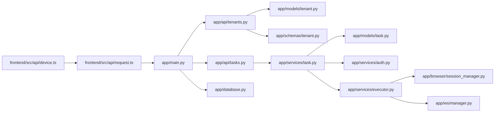

**图表来源**
- [app/main.py:1-156](file://CCC_RPA_API/app/main.py#L1-L156)
- [app/api/tenants.py:1-11](file://CCC_RPA_API/app/api/tenants.py#L1-L11)
- [app/api/tasks.py:1-76](file://CCC_RPA_API/app/api/tasks.py#L1-L76)
- [app/services/task.py:1-157](file://CCC_RPA_API/app/services/task.py#L1-L157)
- [app/models/tenant.py:1-14](file://CCC_RPA_API/app/models/tenant.py#L1-L14)
- [app/schemas/tenant.py:1-43](file://CCC_RPA_API/app/schemas/tenant.py#L1-L43)
- [app/database.py:1-19](file://CCC_RPA_API/app/database.py#L1-L19)
- [app/browser/session_manager.py:1-183](file://CCC_RPA_API/app/browser/session_manager.py#L1-L183)
- [app/ws/manager.py:1-29](file://CCC_RPA_API/app/ws/manager.py#L1-L29)
- [frontend/src/api/device.ts:1-22](file://CCC-BrowserV4/frontend/src/api/device.ts#L1-L22)
- [frontend/src/api/request.ts:1-18](file://CCC-BrowserV4/frontend/src/api/request.ts#L1-L18)

**章节来源**
- [app/main.py:1-156](file://CCC_RPA_API/app/main.py#L1-L156)
- [app/api/tenants.py:1-11](file://CCC_RPA_API/app/api/tenants.py#L1-L11)
- [app/api/tasks.py:1-76](file://CCC_RPA_API/app/api/tasks.py#L1-L76)
- [app/services/task.py:1-157](file://CCC_RPA_API/app/services/task.py#L1-L157)
- [app/models/tenant.py:1-14](file://CCC_RPA_API/app/models/tenant.py#L1-L14)
- [app/schemas/tenant.py:1-43](file://CCC_RPA_API/app/schemas/tenant.py#L1-L43)
- [app/database.py:1-19](file://CCC_RPA_API/app/database.py#L1-L19)
- [app/browser/session_manager.py:1-183](file://CCC_RPA_API/app/browser/session_manager.py#L1-L183)
- [app/ws/manager.py:1-29](file://CCC_RPA_API/app/ws/manager.py#L1-L29)
- [frontend/src/api/device.ts:1-22](file://CCC-BrowserV4/frontend/src/api/device.ts#L1-L22)
- [frontend/src/api/request.ts:1-18](file://CCC-BrowserV4/frontend/src/api/request.ts#L1-L18)

## 性能考量
**更新** 新增数据库性能优化考虑：

- **线程与协程分离**：执行器使用线程池执行耗时任务，浏览器操作在专用工作线程中执行，避免阻塞事件循环
- **上下文复用**：按省份持久化 storage_state，减少重复登录开销
- **广播优化**：WebSocket 广播通过主事件循环异步发送，降低阻塞风险
- **数据库连接池**：使用 SQLAlchemy 连接池，支持连接预热和回收
- **查询优化**：租户编码建立唯一索引，提高查询效率
- **批量操作**：应用启动时批量插入种子数据，减少多次数据库往返

**章节来源**
- [app/services/executor.py:1-308](file://CCC_RPA_API/app/services/executor.py#L1-L308)
- [app/browser/session_manager.py:1-183](file://CCC_RPA_API/app/browser/session_manager.py#L1-L183)
- [app/ws/manager.py:1-29](file://CCC_RPA_API/app/ws/manager.py#L1-L29)
- [app/database.py:5-6](file://CCC_RPA_API/app/database.py#L5-L6)
- [app/models/tenant.py:10](file://CCC_RPA_API/app/models/tenant.py#L10)
- [app/main.py:104-118](file://CCC_RPA_API/app/main.py#L104-L118)

## 故障排查指南
**更新** 新增数据库相关故障排查：

- **数据库连接失败**：检查 DATABASE_URL 环境变量配置，确认数据库服务可用
- **表结构缺失**：应用启动时自动创建表结构，如失败需检查权限和数据库状态
- **租户编码冲突**：创建租户时报错"租户编码已存在"，需使用唯一编码
- **租户不存在**：更新或删除租户时报错"租户不存在"，需确认租户ID正确
- **浏览器初始化失败**：检查专用工作线程是否成功启动，确认 Chromium 可用
- **会话恢复**：当浏览器异常时，执行器会自动恢复上下文并重新打开页面
- **WebSocket 广播失败**：检查主事件循环状态，确保广播在有效循环中执行
- **任务执行异常**：查看执行日志与错误广播，定位具体步骤与原因

**章节来源**
- [app/database.py:5-6](file://CCC_RPA_API/app/database.py#L5-L6)
- [app/main.py:37-40](file://CCC_RPA_API/app/main.py#L37-L40)
- [app/api/tenants.py:48-50](file://CCC_RPA_API/app/api/tenants.py#L48-L50)
- [app/api/tenants.py:56-58](file://CCC_RPA_API/app/api/tenants.py#L56-L58)
- [app/browser/session_manager.py:1-183](file://CCC_RPA_API/app/browser/session_manager.py#L1-L183)
- [app/services/executor.py:1-308](file://CCC_RPA_API/app/services/executor.py#L1-L308)
- [app/ws/manager.py:1-29](file://CCC_RPA_API/app/ws/manager.py#L1-L29)

## 结论
**更新** 租户管理模块已完成重大升级，从mock数据实现转变为完整的数据库驱动实现：

- **功能完整性**：提供完整的 CRUD 操作，支持租户的创建、查询、更新和软删除
- **数据持久化**：使用 SQLAlchemy 实现数据持久化，支持租户数据的长期保存
- **生产级特性**：包含错误处理、日志记录、数据验证和事务管理
- **向后兼容**：保持与前端 API 的向后兼容性，无需修改前端代码
- **扩展性**：为后续的并发配额管理、数据隔离和生命周期管理奠定基础

后续可以在现有基础上继续完善：
- 并发配额与资源监控
- 数据隔离与访问控制
- 与任务执行链路的深度集成
- 租户统计与报表功能

## 附录
**更新** 新增数据库和 API 相关信息：

- **数据库连接**：使用环境变量 DATABASE_URL 配置数据库连接
- **表结构**：应用启动时自动创建 tenants 表结构
- **种子数据**：应用启动时自动插入初始租户数据
- **前端租户列表调用**：getTenantList() 返回简化格式
- **后端租户 API**：GET /api/tenants, POST /api/tenants, PUT /api/tenants/{id}, DELETE /api/tenants/{id}

**章节来源**
- [app/database.py:5-6](file://CCC_RPA_API/app/database.py#L5-L6)
- [app/main.py:104-118](file://CCC_RPA_API/app/main.py#L104-L118)
- [frontend/src/api/device.ts:13-16](file://CCC-BrowserV4/frontend/src/api/device.ts#L13-L16)
- [app/api/tenants.py:36-100](file://CCC_RPA_API/app/api/tenants.py#L36-L100)