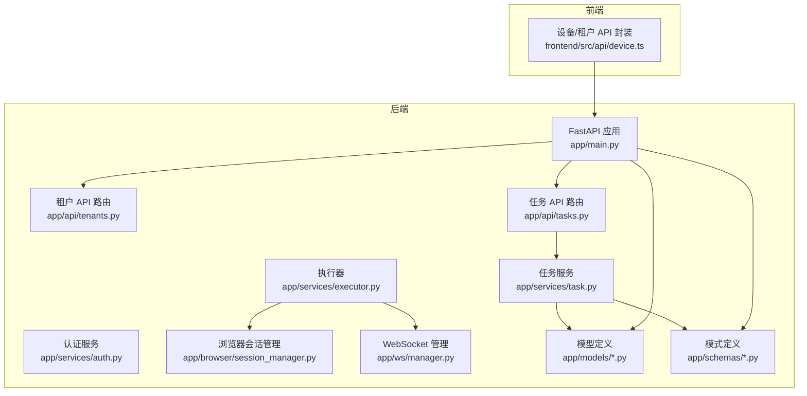
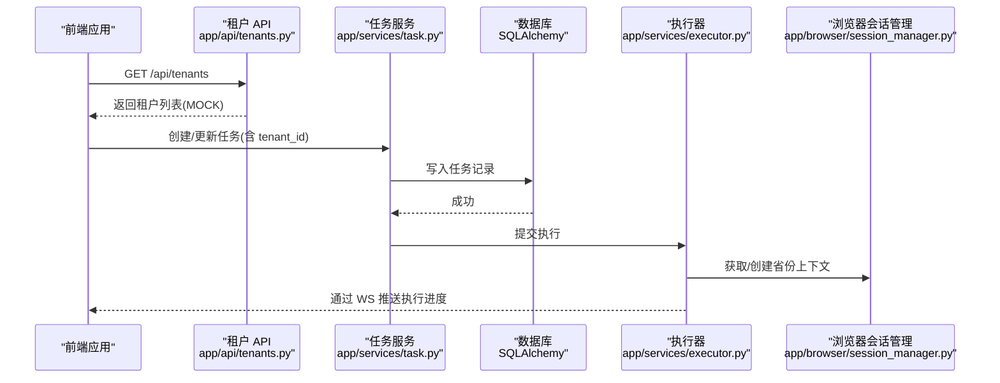
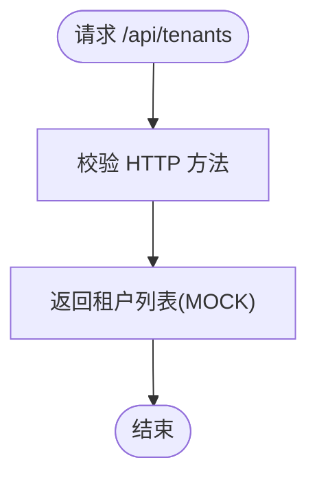
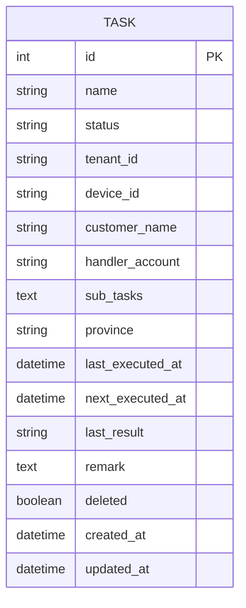
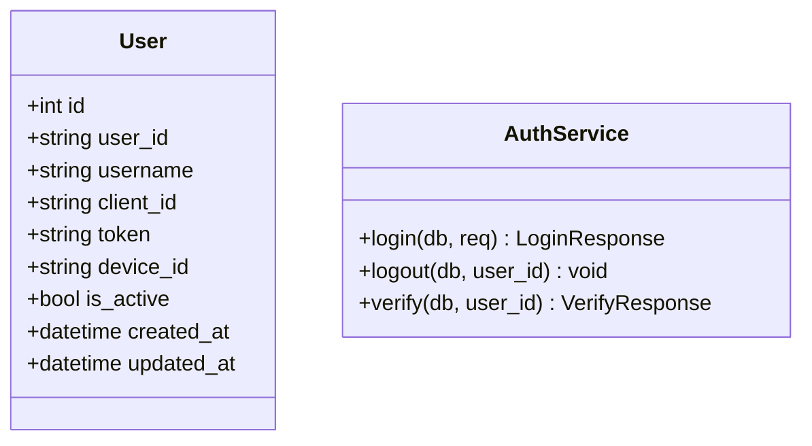
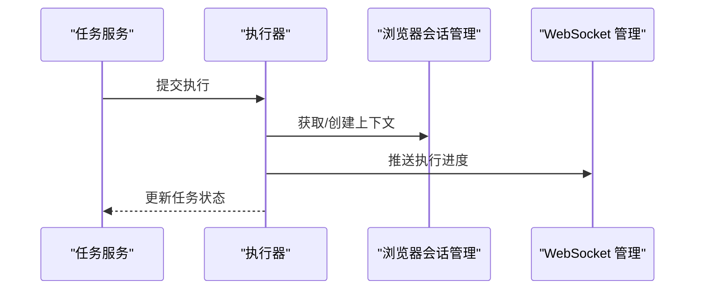
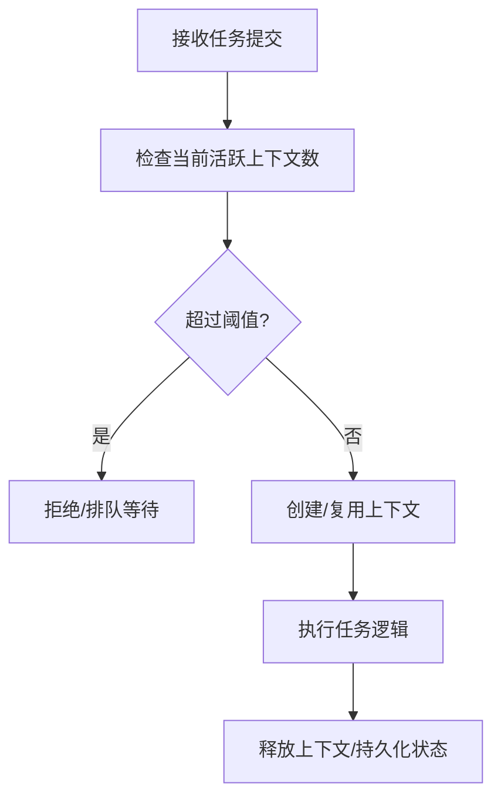
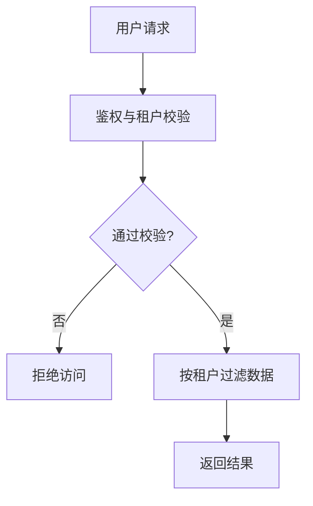
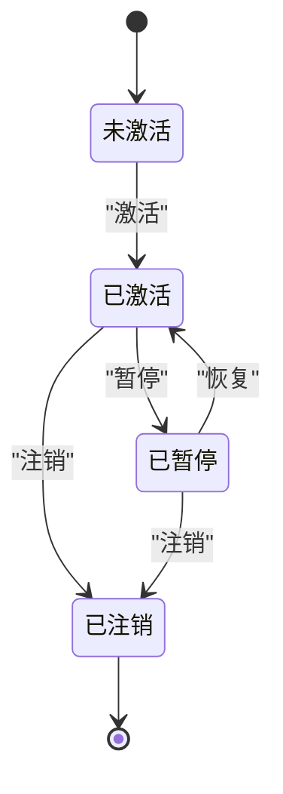
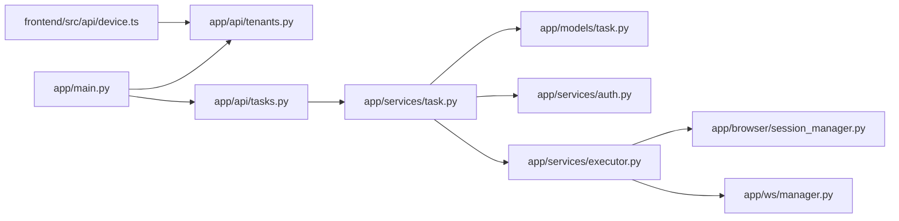

# 租户管理模块

<cite>
**本文档引用的文件**
- [app/main.py](file://CCC_RPA_API/app/main.py)
- [app/api/tenants.py](file://CCC_RPA_API/app/api/tenants.py)
- [app/api/tasks.py](file://CCC_RPA_API/app/api/tasks.py)
- [app/models/task.py](file://CCC_RPA_API/app/models/task.py)
- [app/models/user.py](file://CCC_RPA_API/app/models/user.py)
- [app/models/base.py](file://CCC_RPA_API/app/models/base.py)
- [app/models/execution_log.py](file://CCC_RPA_API/app/models/execution_log.py)
- [app/services/task.py](file://CCC_RPA_API/app/services/task.py)
- [app/services/auth.py](file://CCC_RPA_API/app/services/auth.py)
- [app/services/executor.py](file://CCC_RPA_API/app/services/executor.py)
- [app/browser/session_manager.py](file://CCC_RPA_API/app/browser/session_manager.py)
- [app/ws/manager.py](file://CCC_RPA_API/app/ws/manager.py)
- [app/schemas/task.py](file://CCC_RPA_API/app/schemas/task.py)
- [app/schemas/auth.py](file://CCC_RPA_API/app/schemas/auth.py)
- [frontend/src/api/device.ts](file://CCC-BrowserV4/frontend/src/api/device.ts)
</cite>

## 目录
1. [简介](#简介)
2. [项目结构](#项目结构)
3. [核心组件](#核心组件)
4. [架构总览](#架构总览)
5. [详细组件分析](#详细组件分析)
6. [依赖关系分析](#依赖关系分析)
7. [性能考量](#性能考量)
8. [故障排查指南](#故障排查指南)
9. [结论](#结论)
10. [附录](#附录)

## 简介
本文件面向“租户管理模块”的设计与实现，聚焦以下目标：
- 租户的创建、配置与管理流程
- 租户信息的存储结构、配置参数与状态管理
- 并发配额管理机制（会话数量限制、资源使用监控与配额预警）
- 租户数据隔离（数据库层面物理隔离、会话数据加密存储与访问控制）
- 租户生命周期管理（激活、暂停、注销）
- 租户配置相关 API 接口文档与使用示例

当前仓库中租户管理处于“占位实现”阶段：后端提供租户列表接口但使用内存 Mock 数据；前端具备租户列表调用逻辑。后续可在此基础上扩展为完整的租户实体与业务。

## 项目结构
后端采用 FastAPI + SQLAlchemy 架构，前端为 Vue + Tauri 前端工程。租户管理相关代码集中在后端 API 层与服务层，前端通过统一请求封装调用后端接口。

图表来源
- [app/main.py:1-127](file://CCC_RPA_API/app/main.py#L1-L127)
- [app/api/tenants.py:1-25](file://CCC_RPA_API/app/api/tenants.py#L1-L25)
- [app/api/tasks.py:1-76](file://CCC_RPA_API/app/api/tasks.py#L1-L76)
- [app/services/task.py:1-157](file://CCC_RPA_API/app/services/task.py#L1-L157)
- [app/services/executor.py:1-308](file://CCC_RPA_API/app/services/executor.py#L1-L308)
- [app/browser/session_manager.py:1-183](file://CCC_RPA_API/app/browser/session_manager.py#L1-L183)
- [app/ws/manager.py:1-29](file://CCC_RPA_API/app/ws/manager.py#L1-L29)
- [app/models/task.py:1-25](file://CCC_RPA_API/app/models/task.py#L1-L25)
- [app/models/user.py:1-17](file://CCC_RPA_API/app/models/user.py#L1-L17)
- [app/models/base.py:1-11](file://CCC_RPA_API/app/models/base.py#L1-L11)
- [app/models/execution_log.py:1-17](file://CCC_RPA_API/app/models/execution_log.py#L1-L17)
- [app/schemas/task.py:1-58](file://CCC_RPA_API/app/schemas/task.py#L1-L58)
- [app/schemas/auth.py:1-26](file://CCC_RPA_API/app/schemas/auth.py#L1-L26)
- [frontend/src/api/device.ts:1-21](file://CCC-BrowserV4/frontend/src/api/device.ts#L1-L21)

章节来源
- [app/main.py:1-127](file://CCC_RPA_API/app/main.py#L1-L127)
- [app/api/tenants.py:1-25](file://CCC_RPA_API/app/api/tenants.py#L1-L25)
- [frontend/src/api/device.ts:1-21](file://CCC-BrowserV4/frontend/src/api/device.ts#L1-L21)

## 核心组件
- 租户 API 路由：提供租户列表接口，当前返回内存 Mock 数据
- 任务模型与服务：任务表包含租户标识字段，用于关联任务与租户
- 认证与用户模型：用户表含租户相关字段，支撑用户维度的租户绑定
- 执行器与浏览器会话：执行器按省份维护浏览器上下文，为后续按租户/省份隔离提供基础
- WebSocket 管理：用于向客户端推送执行进度与状态

章节来源
- [app/api/tenants.py:1-25](file://CCC_RPA_API/app/api/tenants.py#L1-L25)
- [app/models/task.py:1-25](file://CCC_RPA_API/app/models/task.py#L1-L25)
- [app/models/user.py:1-17](file://CCC_RPA_API/app/models/user.py#L1-L17)
- [app/services/executor.py:1-308](file://CCC_RPA_API/app/services/executor.py#L1-L308)
- [app/browser/session_manager.py:1-183](file://CCC_RPA_API/app/browser/session_manager.py#L1-L183)
- [app/ws/manager.py:1-29](file://CCC_RPA_API/app/ws/manager.py#L1-L29)

## 架构总览
下图展示租户相关的关键交互路径：前端通过设备/租户 API 获取租户列表，后端返回 Mock 数据；任务执行链路中，任务模型携带租户标识，执行器按省份管理浏览器上下文，WebSocket 推送执行状态。

图表来源
- [app/api/tenants.py:1-25](file://CCC_RPA_API/app/api/tenants.py#L1-L25)
- [app/services/task.py:1-157](file://CCC_RPA_API/app/services/task.py#L1-L157)
- [app/services/executor.py:1-308](file://CCC_RPA_API/app/services/executor.py#L1-L308)
- [app/browser/session_manager.py:1-183](file://CCC_RPA_API/app/browser/session_manager.py#L1-L183)
- [frontend/src/api/device.ts:1-21](file://CCC-BrowserV4/frontend/src/api/device.ts#L1-L21)

## 详细组件分析

### 租户 API 组件
- 当前实现：提供租户列表接口，返回内存 Mock 数据
- 后续演进：替换为数据库查询，增加创建、更新、删除、启用/停用等接口

图表来源
- [app/api/tenants.py:1-25](file://CCC_RPA_API/app/api/tenants.py#L1-L25)

章节来源
- [app/api/tenants.py:1-25](file://CCC_RPA_API/app/api/tenants.py#L1-L25)

### 任务模型与租户关联
- 任务模型包含租户标识字段，便于按租户筛选与统计
- 服务层负责任务的增删改查与执行提交
- 执行器按省份维护浏览器上下文，为后续按租户/省份隔离提供基础

图表来源
- [app/models/task.py:1-25](file://CCC_RPA_API/app/models/task.py#L1-L25)

章节来源
- [app/models/task.py:1-25](file://CCC_RPA_API/app/models/task.py#L1-L25)
- [app/services/task.py:1-157](file://CCC_RPA_API/app/services/task.py#L1-L157)

### 认证与用户模型
- 用户模型包含租户相关字段，可用于用户级租户绑定
- 认证服务提供登录、登出、校验能力

图表来源
- [app/models/user.py:1-17](file://CCC_RPA_API/app/models/user.py#L1-L17)
- [app/services/auth.py:1-58](file://CCC_RPA_API/app/services/auth.py#L1-L58)

章节来源
- [app/models/user.py:1-17](file://CCC_RPA_API/app/models/user.py#L1-L17)
- [app/services/auth.py:1-58](file://CCC_RPA_API/app/services/auth.py#L1-L58)

### 执行器与浏览器会话管理
- 执行器在独立线程池中运行任务逻辑，通过 WebSocket 推送执行进度
- 浏览器会话管理器按省份维护上下文，持久化 storage_state，避免重复登录
- 支持会话恢复与关闭，保障长时间任务的稳定性

图表来源
- [app/services/executor.py:1-308](file://CCC_RPA_API/app/services/executor.py#L1-L308)
- [app/browser/session_manager.py:1-183](file://CCC_RPA_API/app/browser/session_manager.py#L1-L183)
- [app/ws/manager.py:1-29](file://CCC_RPA_API/app/ws/manager.py#L1-L29)

章节来源
- [app/services/executor.py:1-308](file://CCC_RPA_API/app/services/executor.py#L1-L308)
- [app/browser/session_manager.py:1-183](file://CCC_RPA_API/app/browser/session_manager.py#L1-L183)
- [app/ws/manager.py:1-29](file://CCC_RPA_API/app/ws/manager.py#L1-L29)

### 并发配额管理机制（设计建议）
- 会话数量限制：通过浏览器会话管理器按省份维护上下文，限制同一时间活跃上下文数量
- 资源使用监控：执行器线程池大小与浏览器工作线程配合，避免资源争用
- 配额预警：可通过 WebSocket 推送“即将达到上限”提示，结合外部指标系统进行告警

图表来源
- [app/browser/session_manager.py:1-183](file://CCC_RPA_API/app/browser/session_manager.py#L1-L183)
- [app/services/executor.py:1-308](file://CCC_RPA_API/app/services/executor.py#L1-L308)

章节来源
- [app/browser/session_manager.py:1-183](file://CCC_RPA_API/app/browser/session_manager.py#L1-L183)
- [app/services/executor.py:1-308](file://CCC_RPA_API/app/services/executor.py#L1-L308)

### 租户数据隔离（设计建议）
- 数据库层面：按租户 ID 在查询时强制加上过滤条件，确保跨租户数据不可见
- 会话数据：浏览器 storage_state 按省份持久化，避免跨租户共享登录态
- 访问控制：在认证与授权层加入租户维度校验，防止越权访问

图表来源
- [app/models/task.py:1-25](file://CCC_RPA_API/app/models/task.py#L1-L25)
- [app/services/task.py:1-157](file://CCC_RPA_API/app/services/task.py#L1-L157)
- [app/models/user.py:1-17](file://CCC_RPA_API/app/models/user.py#L1-L17)

章节来源
- [app/models/task.py:1-25](file://CCC_RPA_API/app/models/task.py#L1-L25)
- [app/services/task.py:1-157](file://CCC_RPA_API/app/services/task.py#L1-L157)
- [app/models/user.py:1-17](file://CCC_RPA_API/app/models/user.py#L1-L17)

### 租户生命周期管理（设计建议）
- 激活：启用租户后，允许其任务执行与资源分配
- 暂停：冻结租户任务调度，保留配置与历史数据
- 注销：清理租户相关资源与数据，确保不可恢复

图表来源
- [app/api/tenants.py:1-25](file://CCC_RPA_API/app/api/tenants.py#L1-L25)

章节来源
- [app/api/tenants.py:1-25](file://CCC_RPA_API/app/api/tenants.py#L1-L25)

### 租户配置 API 接口文档
- 获取租户列表
  - 方法：GET
  - 路径：/api/tenants
  - 请求参数：无
  - 响应：租户列表（当前为 Mock 数据）

章节来源
- [app/api/tenants.py:1-25](file://CCC_RPA_API/app/api/tenants.py#L1-L25)

### 使用示例（前端调用）
- 获取租户列表
  - 调用封装方法：getTenantList()
  - 返回类型：Promise<TenantInfo[]>

章节来源
- [frontend/src/api/device.ts:1-21](file://CCC-BrowserV4/frontend/src/api/device.ts#L1-L21)

## 依赖关系分析
- 应用入口注册路由与数据库初始化，确保模型与表结构就绪
- 任务 API 依赖任务服务与数据库模型
- 执行器依赖浏览器会话管理器与 WebSocket 管理器
- 前端通过统一请求封装调用后端接口

图表来源
- [app/main.py:1-127](file://CCC_RPA_API/app/main.py#L1-L127)
- [app/api/tenants.py:1-25](file://CCC_RPA_API/app/api/tenants.py#L1-L25)
- [app/api/tasks.py:1-76](file://CCC_RPA_API/app/api/tasks.py#L1-L76)
- [app/services/task.py:1-157](file://CCC_RPA_API/app/services/task.py#L1-L157)
- [app/models/task.py:1-25](file://CCC_RPA_API/app/models/task.py#L1-L25)
- [app/services/executor.py:1-308](file://CCC_RPA_API/app/services/executor.py#L1-L308)
- [app/browser/session_manager.py:1-183](file://CCC_RPA_API/app/browser/session_manager.py#L1-L183)
- [app/ws/manager.py:1-29](file://CCC_RPA_API/app/ws/manager.py#L1-L29)
- [frontend/src/api/device.ts:1-21](file://CCC-BrowserV4/frontend/src/api/device.ts#L1-L21)

章节来源
- [app/main.py:1-127](file://CCC_RPA_API/app/main.py#L1-L127)
- [app/api/tenants.py:1-25](file://CCC_RPA_API/app/api/tenants.py#L1-L25)
- [app/api/tasks.py:1-76](file://CCC_RPA_API/app/api/tasks.py#L1-L76)
- [app/services/task.py:1-157](file://CCC_RPA_API/app/services/task.py#L1-L157)
- [app/models/task.py:1-25](file://CCC_RPA_API/app/models/task.py#L1-L25)
- [app/services/executor.py:1-308](file://CCC_RPA_API/app/services/executor.py#L1-L308)
- [app/browser/session_manager.py:1-183](file://CCC_RPA_API/app/browser/session_manager.py#L1-L183)
- [app/ws/manager.py:1-29](file://CCC_RPA_API/app/ws/manager.py#L1-L29)
- [frontend/src/api/device.ts:1-21](file://CCC-BrowserV4/frontend/src/api/device.ts#L1-L21)

## 性能考量
- 线程与协程分离：执行器使用线程池执行耗时任务，浏览器操作在专用工作线程中执行，避免阻塞事件循环
- 上下文复用：按省份持久化 storage_state，减少重复登录开销
- 广播优化：WebSocket 广播通过主事件循环异步发送，降低阻塞风险

章节来源
- [app/services/executor.py:1-308](file://CCC_RPA_API/app/services/executor.py#L1-L308)
- [app/browser/session_manager.py:1-183](file://CCC_RPA_API/app/browser/session_manager.py#L1-L183)
- [app/ws/manager.py:1-29](file://CCC_RPA_API/app/ws/manager.py#L1-L29)

## 故障排查指南
- 浏览器初始化失败：检查专用工作线程是否成功启动，确认 Chromium 可用
- 会话恢复：当浏览器异常时，执行器会自动恢复上下文并重新打开页面
- WebSocket 广播失败：检查主事件循环状态，确保广播在有效循环中执行
- 任务执行异常：查看执行日志与错误广播，定位具体步骤与原因

章节来源
- [app/browser/session_manager.py:1-183](file://CCC_RPA_API/app/browser/session_manager.py#L1-L183)
- [app/services/executor.py:1-308](file://CCC_RPA_API/app/services/executor.py#L1-L308)
- [app/ws/manager.py:1-29](file://CCC_RPA_API/app/ws/manager.py#L1-L29)

## 结论
当前租户管理模块处于“占位实现”，前端可调用租户列表接口，后端返回 Mock 数据。后续应在现有基础上完善：
- 租户实体与数据库表结构
- 租户生命周期管理接口
- 并发配额与资源监控
- 数据隔离与访问控制
- 与任务执行链路的深度集成

## 附录
- 前端租户列表调用封装：getTenantList()
- 后端租户列表接口：GET /api/tenants

章节来源
- [frontend/src/api/device.ts:1-21](file://CCC-BrowserV4/frontend/src/api/device.ts#L1-L21)
- [app/api/tenants.py:1-25](file://CCC_RPA_API/app/api/tenants.py#L1-L25)