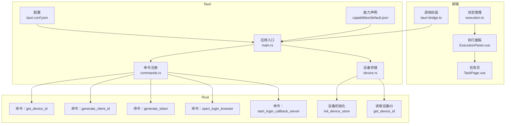
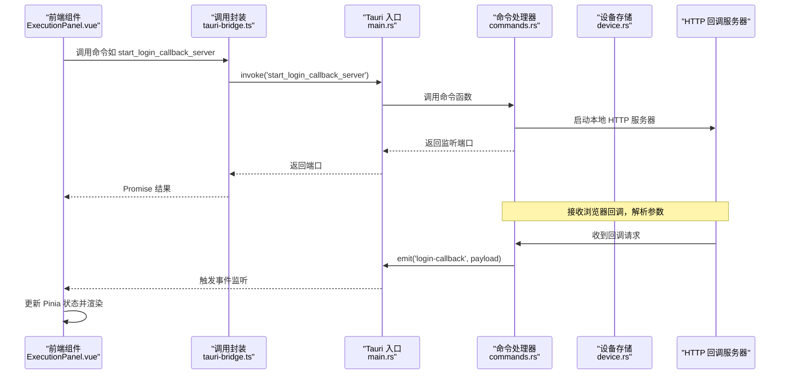
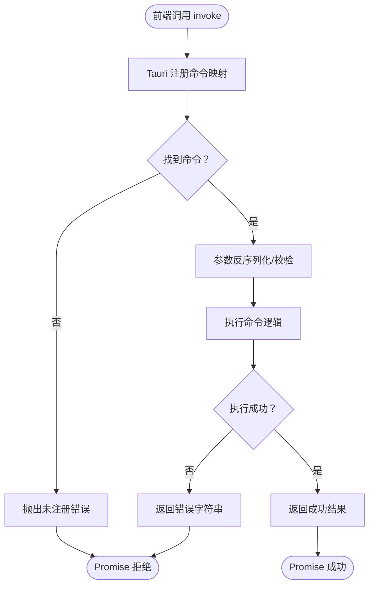
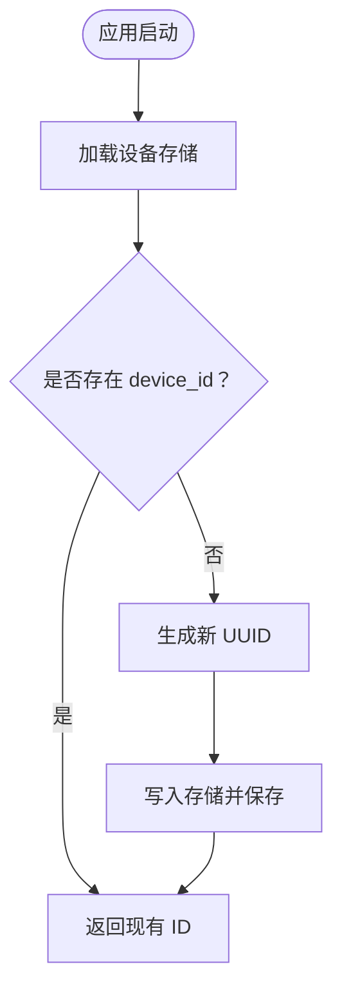
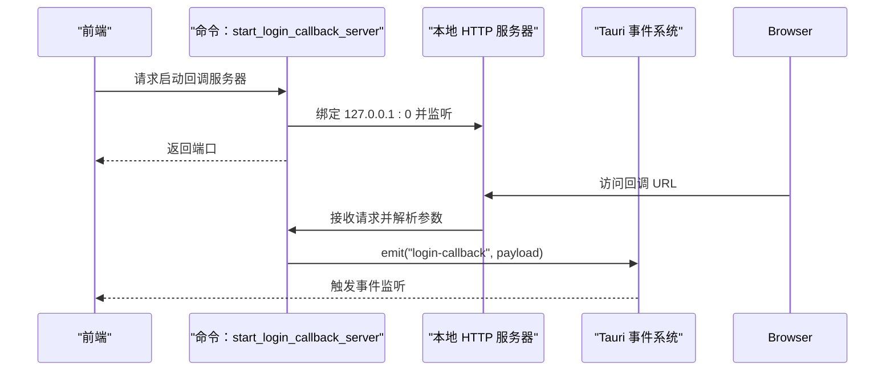
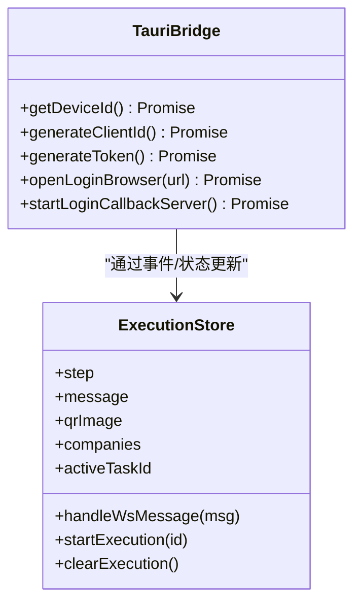
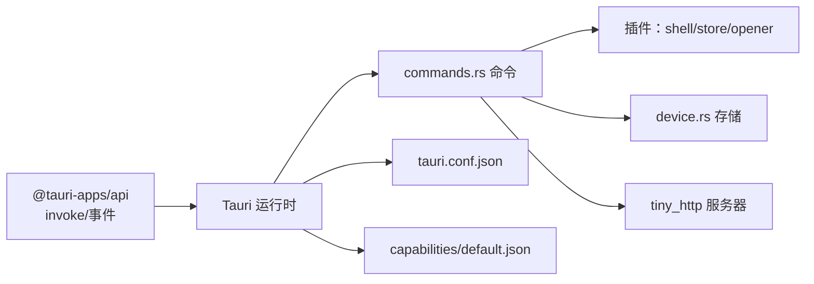

# Tauri Bridge 通信

<cite>
**本文引用的文件**
- [main.rs](file://CCC-BrowserV4/src-tauri/src/main.rs)
- [commands.rs](file://CCC-BrowserV4/src-tauri/src/commands.rs)
- [device.rs](file://CCC-BrowserV4/src-tauri/src/device.rs)
- [tauri.conf.json](file://CCC-BrowserV4/src-tauri/tauri.conf.json)
- [Cargo.toml](file://CCC-BrowserV4/src-tauri/Cargo.toml)
- [default.json](file://CCC-BrowserV4/src-tauri/capabilities/default.json)
- [tauri-bridge.ts](file://CCC-BrowserV4/frontend/src/utils/tauri-bridge.ts)
- [execution.ts](file://CCC-BrowserV4/frontend/src/stores/execution.ts)
- [ExecutionPanel.vue](file://CCC-BrowserV4/frontend/src/components/ExecutionPanel.vue)
- [TaskPage.vue](file://CCC-BrowserV4/frontend/src/pages/TaskPage.vue)
- [execution.ts](file://CCC-BrowserV4/frontend/src/api/execution.ts)
</cite>

## 目录
1. [简介](#简介)
2. [项目结构](#项目结构)
3. [核心组件](#核心组件)
4. [架构总览](#架构总览)
5. [详细组件分析](#详细组件分析)
6. [依赖关系分析](#依赖关系分析)
7. [性能考虑](#性能考虑)
8. [故障排查指南](#故障排查指南)
9. [结论](#结论)
10. [附录](#附录)

## 简介
本文件系统性阐述 Tauri Bridge 在本项目中的通信机制与实现细节，涵盖 Rust 侧命令定义、TypeScript 侧调用封装、参数传递、IPC 协议与消息序列化、异步处理、事件监听与状态同步、安全与权限控制，以及使用示例与最佳实践。目标是帮助开发者快速理解并正确使用 Tauri Bridge 实现桌面应用与前端之间的双向通信。

## 项目结构
本项目采用“前端 Vue + Tauri 客户端 + Rust 后端命令”的三层架构：
- 前端层：Vue + Pinia 状态管理、Element Plus 组件、自定义 Tauri Bridge 封装。
- Tauri 层：配置与能力声明、插件注册、命令注册与事件分发。
- Rust 层：命令函数、设备标识持久化、HTTP 回调服务器与事件通知。

图表来源
- [main.rs:7-28](file://CCC-BrowserV4/src-tauri/src/main.rs#L7-L28)
- [commands.rs:10-91](file://CCC-BrowserV4/src-tauri/src/commands.rs#L10-L91)
- [device.rs:6-31](file://CCC-BrowserV4/src-tauri/src/device.rs#L6-L31)
- [tauri.conf.json:1-29](file://CCC-BrowserV4/src-tauri/tauri.conf.json#L1-L29)
- [default.json:1-13](file://CCC-BrowserV4/src-tauri/capabilities/default.json#L1-L13)

章节来源
- [main.rs:1-29](file://CCC-BrowserV4/src-tauri/src/main.rs#L1-L29)
- [tauri.conf.json:1-29](file://CCC-BrowserV4/src-tauri/tauri.conf.json#L1-L29)
- [Cargo.toml:1-22](file://CCC-BrowserV4/src-tauri/Cargo.toml#L1-L22)
- [default.json:1-13](file://CCC-BrowserV4/src-tauri/capabilities/default.json#L1-L13)

## 核心组件
- 前端调用封装：统一通过 invoke 调用 Rust 命令，返回 Promise 异步结果。
- Rust 命令注册：在应用启动时集中注册命令，暴露给前端调用。
- 设备标识持久化：基于 store 插件持久化设备 ID，首次运行自动生成。
- 登录回调服务器：启动本地 HTTP 服务器监听回调，解析参数并通过事件通知前端。
- 事件监听与状态同步：前端监听事件并更新 Pinia 状态，驱动 UI 更新。

章节来源
- [tauri-bridge.ts:6-32](file://CCC-BrowserV4/frontend/src/utils/tauri-bridge.ts#L6-L32)
- [main.rs:12-18](file://CCC-BrowserV4/src-tauri/src/main.rs#L12-L18)
- [device.rs:6-31](file://CCC-BrowserV4/src-tauri/src/device.rs#L6-L31)
- [commands.rs:44-91](file://CCC-BrowserV4/src-tauri/src/commands.rs#L44-L91)
- [execution.ts:22-67](file://CCC-BrowserV4/frontend/src/stores/execution.ts#L22-L67)

## 架构总览
下图展示从前端发起命令到 Rust 处理再到事件回传的完整链路，包括参数传递、异步处理与错误传播路径。

图表来源
- [tauri-bridge.ts:31](file://CCC-BrowserV4/frontend/src/utils/tauri-bridge.ts#L31)
- [main.rs:12-18](file://CCC-BrowserV4/src-tauri/src/main.rs#L12-L18)
- [commands.rs:44-91](file://CCC-BrowserV4/src-tauri/src/commands.rs#L44-L91)

## 详细组件分析

### Rust 命令系统与 IPC 通信
- 命令注册：在应用入口集中注册命令，前端通过字符串标识调用对应函数。
- 参数传递：命令签名支持简单类型与 AppHandle；复杂参数以 JSON 形式在前端序列化后传递。
- 异步处理：命令均标注为异步，适合 IO 密集型操作（如网络、文件、子线程）。
- 错误传播：命令返回 Result 类型，前端 Promise 捕获错误；日志记录便于定位问题。

图表来源
- [main.rs:12-18](file://CCC-BrowserV4/src-tauri/src/main.rs#L12-L18)
- [commands.rs:10-91](file://CCC-BrowserV4/src-tauri/src/commands.rs#L10-L91)

章节来源
- [main.rs:7-28](file://CCC-BrowserV4/src-tauri/src/main.rs#L7-L28)
- [commands.rs:10-91](file://CCC-BrowserV4/src-tauri/src/commands.rs#L10-L91)

### 设备标识持久化与命令实现
- 初始化：首次运行自动创建设备 ID 并写入持久化存储。
- 查询：从持久化存储读取设备 ID，若不存在则报错。
- 使用场景：用于识别设备、绑定会话或审计追踪。

图表来源
- [device.rs:6-31](file://CCC-BrowserV4/src-tauri/src/device.rs#L6-L31)

章节来源
- [device.rs:6-31](file://CCC-BrowserV4/src-tauri/src/device.rs#L6-L31)

### 登录回调服务器与事件通知
- 启动：命令启动本地 HTTP 服务器，返回监听端口给前端。
- 回调：浏览器访问回调地址，服务器解析查询参数并返回页面。
- 通知：通过事件向前端广播登录结果，前端更新状态并驱动 UI。

图表来源
- [commands.rs:44-91](file://CCC-BrowserV4/src-tauri/src/commands.rs#L44-L91)

章节来源
- [commands.rs:44-91](file://CCC-BrowserV4/src-tauri/src/commands.rs#L44-L91)

### 前端调用封装与状态同步
- 调用封装：统一导出命令方法，隐藏 invoke 细节，便于维护与测试。
- 状态管理：Pinia Store 维护执行步骤、消息、二维码等状态，事件驱动更新。
- 组件联动：执行面板根据状态渲染不同 UI，任务页负责生命周期与 WebSocket。

图表来源
- [tauri-bridge.ts:6-32](file://CCC-BrowserV4/frontend/src/utils/tauri-bridge.ts#L6-L32)
- [execution.ts:6-229](file://CCC-BrowserV4/frontend/src/stores/execution.ts#L6-L229)

章节来源
- [tauri-bridge.ts:6-32](file://CCC-BrowserV4/frontend/src/utils/tauri-bridge.ts#L6-L32)
- [execution.ts:6-229](file://CCC-BrowserV4/frontend/src/stores/execution.ts#L6-L229)
- [ExecutionPanel.vue:110-128](file://CCC-BrowserV4/frontend/src/components/ExecutionPanel.vue#L110-L128)
- [TaskPage.vue:158-165](file://CCC-BrowserV4/frontend/src/pages/TaskPage.vue#L158-L165)

### 双向通信机制与事件监听
- 前端监听：通过事件通道接收来自 Rust 的通知，更新执行状态。
- 后端触发：命令执行过程中产生事件，前端组件订阅并渲染。
- 数据流：命令返回值 + 事件通知共同构成完整的前后台数据交换。

章节来源
- [commands.rs:80-87](file://CCC-BrowserV4/src-tauri/src/commands.rs#L80-L87)
- [execution.ts:22-67](file://CCC-BrowserV4/frontend/src/stores/execution.ts#L22-L67)

### 安全性与权限控制
- 能力声明：通过 capabilities/default.json 显式授予 shell/open、store、opener 权限。
- CSP 策略：限制连接源，仅允许本地回环与指定域名，降低 XSS 与中间人攻击风险。
- 最小权限：仅开放必要命令与插件，避免过度授权。

章节来源
- [default.json:6-11](file://CCC-BrowserV4/src-tauri/capabilities/default.json#L6-L11)
- [tauri.conf.json:24-26](file://CCC-BrowserV4/src-tauri/tauri.conf.json#L24-L26)

## 依赖关系分析
- Rust 依赖：tauri、tauri-plugin-*、uuid、rand、tokio、tiny_http、serde_json。
- 前端依赖：@tauri-apps/api 提供 invoke 与事件接口。
- 配置依赖：tauri.conf.json 控制构建、窗口与安全策略；capabilities 控制权限。

图表来源
- [Cargo.toml:9-22](file://CCC-BrowserV4/src-tauri/Cargo.toml#L9-L22)
- [tauri.conf.json:1-29](file://CCC-BrowserV4/src-tauri/tauri.conf.json#L1-L29)
- [default.json:1-13](file://CCC-BrowserV4/src-tauri/capabilities/default.json#L1-L13)

章节来源
- [Cargo.toml:1-22](file://CCC-BrowserV4/src-tauri/Cargo.toml#L1-L22)
- [tauri.conf.json:1-29](file://CCC-BrowserV4/src-tauri/tauri.conf.json#L1-L29)
- [default.json:1-13](file://CCC-BrowserV4/src-tauri/capabilities/default.json#L1-L13)

## 性能考虑
- 异步命令：IO 密集型操作应保持异步，避免阻塞主线程。
- 事件风暴：避免短时间内高频 emit，必要时合并或去抖。
- 线程模型：本地 HTTP 服务器使用独立线程，确保 UI 流畅。
- 序列化成本：尽量减少大对象传输，优先传递必要字段。
- 缓存与持久化：设备 ID 等静态信息使用持久化存储，减少重复计算。

## 故障排查指南
- 命令未注册：检查 main.rs 中的命令注册列表是否包含目标命令名。
- 参数类型不匹配：确认前端传参类型与命令签名一致，必要时在命令内增加校验与日志。
- 权限不足：核对 capabilities/default.json 是否包含所需权限，CSP 是否放行目标域名。
- 事件未到达：确认前端是否正确监听事件名，且事件负载结构与预期一致。
- 端口冲突：本地回调服务器绑定 0 端口自动分配，若被占用需重启或清理进程。

章节来源
- [main.rs:12-18](file://CCC-BrowserV4/src-tauri/src/main.rs#L12-L18)
- [default.json:6-11](file://CCC-BrowserV4/src-tauri/capabilities/default.json#L6-L11)
- [tauri.conf.json:24-26](file://CCC-BrowserV4/src-tauri/tauri.conf.json#L24-L26)

## 结论
本项目通过清晰的命令注册、完善的事件通知与严格的权限控制，实现了稳定可靠的桌面应用与前端通信。遵循本文的设计模式与最佳实践，可进一步提升系统的安全性、可维护性与性能表现。

## 附录

### 使用示例与最佳实践
- 命令设计原则
  - 命名语义化：命令名与业务语义一致，避免缩写。
  - 参数最小化：仅传递必要参数，复杂结构在前端序列化。
  - 错误显式化：命令返回错误字符串，前端统一处理。
- 异步与并发
  - IO 操作一律异步；避免在命令中进行长耗时 CPU 计算。
  - 对外暴露的本地服务需限制并发与超时。
- 安全与权限
  - 严格最小权限：仅授予命令所需的插件与能力。
  - CSP 限定连接源，避免加载不受信任资源。
- 性能优化
  - 减少事件频率，合并状态更新。
  - 对频繁读取的数据使用缓存或持久化。
  - 前端对 invoke 调用做必要的防抖与去重。