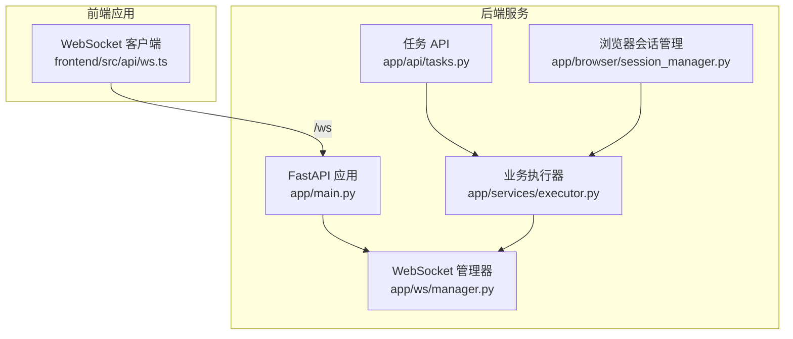
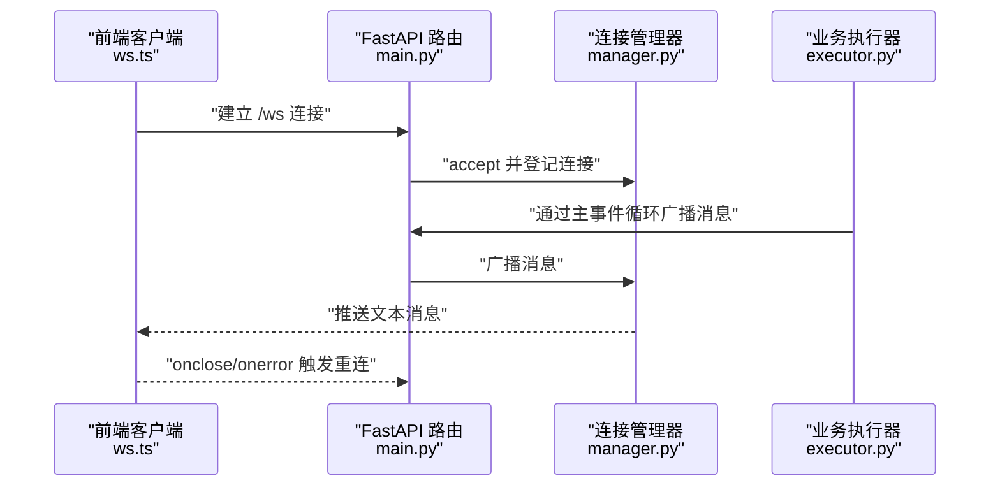
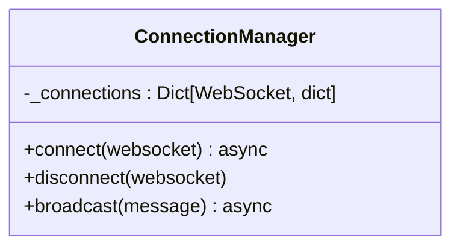
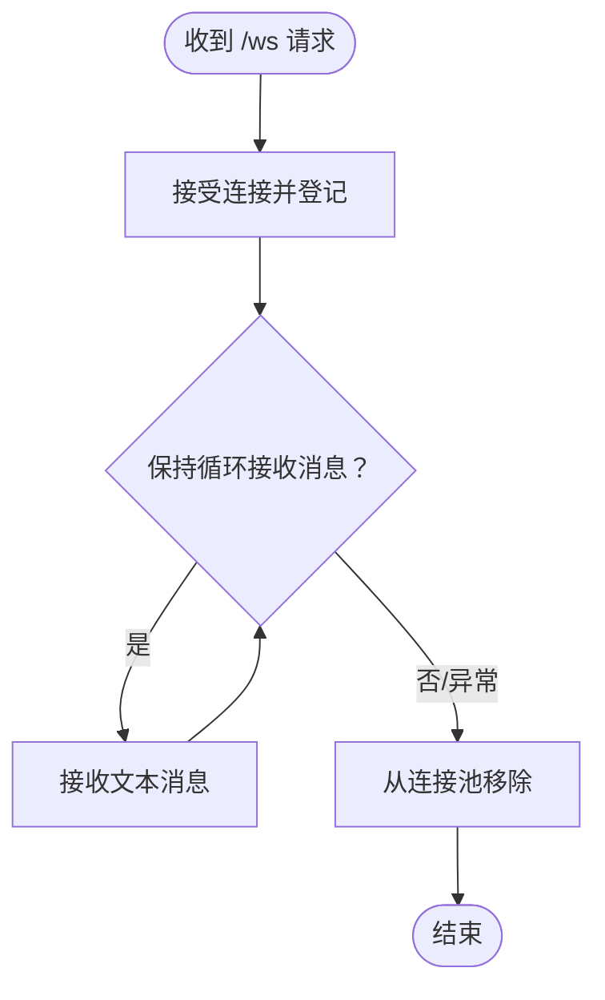
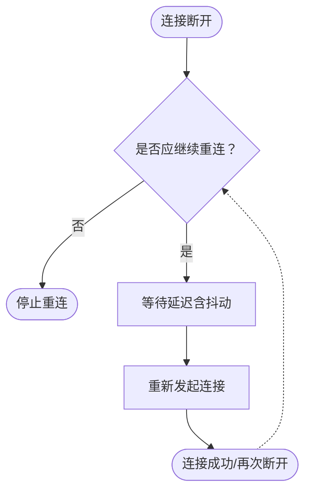
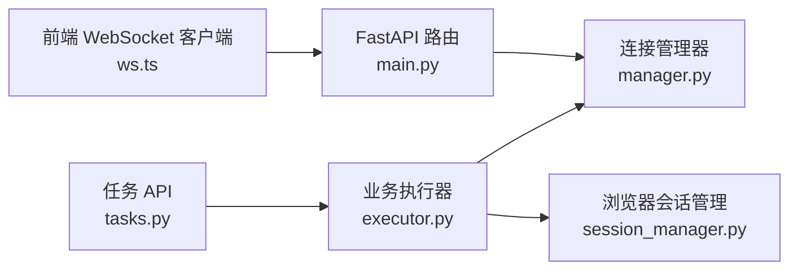

# WebSocket 通信架构

<cite>
**本文档引用的文件**
- [manager.py](file://CCC_RPA_API/app/ws/manager.py)
- [main.py](file://CCC_RPA_API/app/main.py)
- [ws.ts](file://CCC-BrowserV4/frontend/src/api/ws.ts)
- [executor.py](file://CCC_RPA_API/app/services/executor.py)
- [tasks.py](file://CCC_RPA_API/app/api/tasks.py)
- [session_manager.py](file://CCC_RPA_API/app/browser/session_manager.py)
- [task.py](file://CCC_RPA_API/app/models/task.py)
</cite>

## 目录
1. [引言](#引言)
2. [项目结构](#项目结构)
3. [核心组件](#核心组件)
4. [架构总览](#架构总览)
5. [详细组件分析](#详细组件分析)
6. [依赖关系分析](#依赖关系分析)
7. [性能考虑](#性能考虑)
8. [故障排除指南](#故障排除指南)
9. [结论](#结论)

## 引言
本文件系统性梳理并解释 WebSocket 通信架构的设计与实现，重点覆盖以下方面：
- WebSocket 管理器（ConnectionManager）的设计与职责边界
- 连接池管理、连接生命周期控制与并发连接处理
- 连接建立流程、心跳检测机制与断线自动重连策略
- 消息路由机制（广播）、订阅管理与消息分发
- 连接状态管理（在线状态跟踪、连接超时处理、异常恢复）
- 服务器端与客户端实现细节（连接参数配置、错误处理、性能优化）
- 实际代码示例路径与最佳实践建议

## 项目结构
该仓库包含两部分：
- 后端服务（FastAPI）：提供 WebSocket 路由、连接管理与业务执行广播
- 前端应用（Vue + TypeScript）：负责 WebSocket 客户端连接、消息订阅与自动重连



图表来源
- [main.py:119-127](file://CCC_RPA_API/app/main.py#L119-L127)
- [manager.py:5-28](file://CCC_RPA_API/app/ws/manager.py#L5-L28)
- [executor.py:12-33](file://CCC_RPA_API/app/services/executor.py#L12-L33)
- [tasks.py:47-76](file://CCC_RPA_API/app/api/tasks.py#L47-L76)
- [session_manager.py:7-183](file://CCC_RPA_API/app/browser/session_manager.py#L7-L183)
- [ws.ts:8-88](file://CCC-BrowserV4/frontend/src/api/ws.ts#L8-L88)

章节来源
- [main.py:119-127](file://CCC_RPA_API/app/main.py#L119-L127)
- [manager.py:5-28](file://CCC_RPA_API/app/ws/manager.py#L5-L28)
- [ws.ts:8-88](file://CCC-BrowserV4/frontend/src/api/ws.ts#L8-L88)
- [executor.py:12-33](file://CCC_RPA_API/app/services/executor.py#L12-L33)
- [tasks.py:47-76](file://CCC_RPA_API/app/api/tasks.py#L47-L76)
- [session_manager.py:7-183](file://CCC_RPA_API/app/browser/session_manager.py#L7-L183)

## 核心组件
- WebSocket 管理器（ConnectionManager）
  - 维护活跃连接集合，提供连接接入、断开与广播能力
  - 在广播过程中对异常连接进行清理，确保连接池健康
- WebSocket 服务器端路由
  - 提供 "/ws" 路由，接受客户端连接并维持空闲循环以保持连接
- WebSocket 客户端（前端）
  - 自动重连、消息订阅、协议适配（ws/wss）
- 业务执行器
  - 在工作线程中安全地向主事件循环提交广播任务，实现跨线程广播
- 任务 API
  - 提供任务执行、扫码完成、选择单位、取消执行等接口，配合前端交互

章节来源
- [manager.py:5-28](file://CCC_RPA_API/app/ws/manager.py#L5-L28)
- [main.py:119-127](file://CCC_RPA_API/app/main.py#L119-L127)
- [ws.ts:8-88](file://CCC-BrowserV4/frontend/src/api/ws.ts#L8-L88)
- [executor.py:12-33](file://CCC_RPA_API/app/services/executor.py#L12-L33)
- [tasks.py:47-76](file://CCC_RPA_API/app/api/tasks.py#L47-L76)

## 架构总览
WebSocket 通信链路分为三层：
- 客户端层：前端通过 WebSocket 客户端连接后端
- 传输层：FastAPI WebSocket 路由与 ConnectionManager 管理连接
- 业务层：业务执行器在工作线程中产生事件并通过主事件循环广播



图表来源
- [main.py:119-127](file://CCC_RPA_API/app/main.py#L119-L127)
- [manager.py:10-26](file://CCC_RPA_API/app/ws/manager.py#L10-L26)
- [ws.ts:26-55](file://CCC-BrowserV4/frontend/src/api/ws.ts#L26-L55)
- [executor.py:22-32](file://CCC_RPA_API/app/services/executor.py#L22-L32)

## 详细组件分析

### WebSocket 管理器（ConnectionManager）
- 设计要点
  - 使用字典维护 WebSocket 对象与其上下文映射
  - 提供 connect/disconnect 方法管理连接生命周期
  - 广播方法在发送失败时收集“死亡”连接并移除，保证连接池健康
- 数据结构与复杂度
  - 连接存储：字典 O(1) 访问；广播遍历 O(N)
  - 广播时间复杂度：O(N)，其中 N 为活跃连接数
- 错误处理
  - 发送异常时记录并清理无效连接，避免阻塞后续广播
- 性能建议
  - 在高并发场景下，建议限制单机最大连接数并结合限流策略
  - 对广播消息进行序列化缓存，减少重复 JSON 编码开销



图表来源
- [manager.py:5-28](file://CCC_RPA_API/app/ws/manager.py#L5-L28)

章节来源
- [manager.py:5-28](file://CCC_RPA_API/app/ws/manager.py#L5-L28)

### WebSocket 服务器端路由与连接生命周期
- 路由定义
  - "/ws" 路由负责接受连接并将客户端加入连接池
- 生命周期控制
  - 连接建立：accept 成功即登记
  - 连接断开：异常捕获后从连接池移除
  - 主事件循环捕获：用于跨线程广播
- 并发处理
  - 每个连接独立循环接收消息，避免相互阻塞
  - 广播通过主事件循环异步调度，避免事件循环竞争



图表来源
- [main.py:119-127](file://CCC_RPA_API/app/main.py#L119-L127)
- [manager.py:10-15](file://CCC_RPA_API/app/ws/manager.py#L10-L15)

章节来源
- [main.py:119-127](file://CCC_RPA_API/app/main.py#L119-L127)
- [manager.py:10-15](file://CCC_RPA_API/app/ws/manager.py#L10-L15)

### 心跳检测机制
- 当前实现
  - 服务器端未实现显式心跳检测；客户端未实现 ping/pong 逻辑
- 建议方案
  - 服务器端：周期性发送心跳帧，客户端在 onmessage 中校验并回发
  - 客户端：设置心跳定时器，超时未收到心跳则主动断开并触发重连
  - 参考路径：心跳检测可在服务器端添加定时任务，在客户端添加心跳定时器

章节来源
- [main.py:119-127](file://CCC_RPA_API/app/main.py#L119-L127)
- [ws.ts:26-55](file://CCC-BrowserV4/frontend/src/api/ws.ts#L26-L55)

### 断线自动重连策略
- 客户端策略
  - onclose/onerror 触发指数退避重连，固定基础延迟
  - 支持手动断开与取消重连
- 服务器端策略
  - 未实现自动重连；可通过客户端侧策略补偿
- 优化建议
  - 增加重连上限与抖动，避免雪崩效应
  - 区分网络异常与业务异常，避免无意义重连



图表来源
- [ws.ts:44-64](file://CCC-BrowserV4/frontend/src/api/ws.ts#L44-L64)

章节来源
- [ws.ts:44-64](file://CCC-BrowserV4/frontend/src/api/ws.ts#L44-L64)

### 消息路由机制（广播、订阅与分发）
- 广播流程
  - 业务执行器在工作线程中构造消息体，通过主事件循环异步广播
  - 服务器端将消息序列化后推送给所有活跃连接
- 订阅管理
  - 前端通过回调数组管理订阅者，支持动态增删订阅
- 分发策略
  - 广播模式：向所有连接推送
  - 可扩展：基于主题/房间的多播可在 ConnectionManager 中引入分组映射

```mermaid
sequenceDiagram
participant EX as "业务执行器<br/>executor.py"
participant LOOP as "主事件循环<br/>main.py"
participant CM as "连接管理器<br/>manager.py"
participant FE as "前端客户端<br/>ws.ts"
EX->>LOOP : "提交广播任务"
LOOP->>CM : "广播消息"
CM-->>FE : "推送文本消息"
FE->>FE : "解析消息并分发给订阅者"
```

图表来源
- [executor.py:22-32](file://CCC_RPA_API/app/services/executor.py#L22-L32)
- [main.py:9-10](file://CCC_RPA_API/app/main.py#L9-L10)
- [manager.py:17-26](file://CCC_RPA_API/app/ws/manager.py#L17-L26)
- [ws.ts:35-42](file://CCC-BrowserV4/frontend/src/api/ws.ts#L35-L42)

章节来源
- [executor.py:22-32](file://CCC_RPA_API/app/services/executor.py#L22-L32)
- [manager.py:17-26](file://CCC_RPA_API/app/ws/manager.py#L17-L26)
- [ws.ts:35-42](file://CCC-BrowserV4/frontend/src/api/ws.ts#L35-L42)

### 连接状态管理（在线状态跟踪、超时处理、异常恢复）
- 在线状态跟踪
  - 服务器端通过连接池字典跟踪在线连接
  - 前端通过 onopen/onclose/onerror 记录连接状态
- 连接超时处理
  - 当前未实现显式超时检测；建议在服务器端增加空闲超时与心跳超时
- 异常恢复
  - 服务器端广播异常时清理无效连接
  - 前端异常断开触发重连；业务侧可结合浏览器会话恢复策略

章节来源
- [manager.py:17-26](file://CCC_RPA_API/app/ws/manager.py#L17-L26)
- [ws.ts:31-51](file://CCC-BrowserV4/frontend/src/api/ws.ts#L31-L51)

### 服务器端与客户端实现细节

#### 服务器端（FastAPI + ConnectionManager）
- 连接参数配置
  - CORS 允许任意来源，便于前端开发调试
  - WebSocket 路由 "/ws" 接受连接并维持循环
- 错误处理
  - 连接异常捕获并断开连接
  - 广播异常时清理无效连接
- 性能优化
  - 广播通过主事件循环异步调度，避免阻塞
  - 建议限制最大连接数与消息大小，启用压缩与鉴权

章节来源
- [main.py:14-21](file://CCC_RPA_API/app/main.py#L14-L21)
- [main.py:119-127](file://CCC_RPA_API/app/main.py#L119-L127)
- [manager.py:17-26](file://CCC_RPA_API/app/ws/manager.py#L17-L26)

#### 客户端（TypeScript + TaskWebSocket）
- 连接参数配置
  - 自动根据协议选择 ws/wss
  - 支持手动断开与订阅管理
- 错误处理
  - onerror/onclose 触发日志与重连
  - 消息解析异常保护
- 性能优化
  - 固定基础重连延迟，可扩展为指数退避
  - 避免重复订阅，及时清理订阅者

章节来源
- [ws.ts:15-18](file://CCC-BrowserV4/frontend/src/api/ws.ts#L15-L18)
- [ws.ts:44-55](file://CCC-BrowserV4/frontend/src/api/ws.ts#L44-L55)
- [ws.ts:78-84](file://CCC-BrowserV4/frontend/src/api/ws.ts#L78-L84)

### 业务集成与消息类型
- 业务执行器通过广播多种消息类型驱动前端交互
- 任务 API 提供扫码完成、选择单位、取消执行等接口，配合前端交互
- 浏览器会话管理器负责浏览器生命周期与异常恢复，保障业务稳定性

章节来源
- [executor.py:22-33](file://CCC_RPA_API/app/services/executor.py#L22-L33)
- [tasks.py:60-76](file://CCC_RPA_API/app/api/tasks.py#L60-L76)
- [session_manager.py:144-167](file://CCC_RPA_API/app/browser/session_manager.py#L144-L167)

## 依赖关系分析
- 组件耦合
  - 业务执行器依赖 ConnectionManager 进行广播
  - WebSocket 路由依赖 ConnectionManager 管理连接
  - 前端客户端依赖后端 WebSocket 路由
- 外部依赖
  - FastAPI 提供 WebSocket 路由与事件循环
  - asyncio 提供跨线程广播支持
  - Playwright 浏览器会话管理器提供业务执行环境



图表来源
- [ws.ts:8-88](file://CCC-BrowserV4/frontend/src/api/ws.ts#L8-L88)
- [main.py:119-127](file://CCC_RPA_API/app/main.py#L119-L127)
- [manager.py:5-28](file://CCC_RPA_API/app/ws/manager.py#L5-L28)
- [executor.py:12-33](file://CCC_RPA_API/app/services/executor.py#L12-L33)
- [session_manager.py:7-183](file://CCC_RPA_API/app/browser/session_manager.py#L7-L183)
- [tasks.py:47-76](file://CCC_RPA_API/app/api/tasks.py#L47-L76)

章节来源
- [ws.ts:8-88](file://CCC-BrowserV4/frontend/src/api/ws.ts#L8-L88)
- [main.py:119-127](file://CCC_RPA_API/app/main.py#L119-L127)
- [manager.py:5-28](file://CCC_RPA_API/app/ws/manager.py#L5-L28)
- [executor.py:12-33](file://CCC_RPA_API/app/services/executor.py#L12-L33)
- [session_manager.py:7-183](file://CCC_RPA_API/app/browser/session_manager.py#L7-L183)
- [tasks.py:47-76](file://CCC_RPA_API/app/api/tasks.py#L47-L76)

## 性能考虑
- 广播性能
  - 广播遍历所有连接，建议限制并发连接数量
  - 对频繁广播的消息进行去重与合并
- 事件循环
  - 使用主事件循环异步调度广播，避免阻塞
- 客户端重连
  - 增加退避策略与抖动，防止风暴效应
- 心跳与超时
  - 增加心跳检测与空闲超时，提升连接健康度
- 浏览器会话
  - 会话复用与状态持久化，减少初始化成本

## 故障排除指南
- 连接无法建立
  - 检查 CORS 配置与路由 "/ws" 是否可达
  - 查看服务器端异常日志与客户端 onerror 输出
- 广播无响应
  - 确认主事件循环存在且运行正常
  - 检查连接池中是否存在无效连接并被清理
- 客户端不断重连
  - 检查网络状况与服务器负载
  - 调整重连延迟与上限，避免过度重试
- 业务执行异常
  - 关注浏览器会话状态与恢复日志
  - 检查任务 API 的信号传递是否正确

章节来源
- [main.py:9-10](file://CCC_RPA_API/app/main.py#L9-L10)
- [manager.py:17-26](file://CCC_RPA_API/app/ws/manager.py#L17-L26)
- [ws.ts:44-55](file://CCC-BrowserV4/frontend/src/api/ws.ts#L44-L55)
- [session_manager.py:144-167](file://CCC_RPA_API/app/browser/session_manager.py#L144-L167)

## 结论
该 WebSocket 通信架构以 ConnectionManager 为核心，结合 FastAPI 的事件循环与前端 TaskWebSocket，实现了简洁高效的连接管理与消息广播。当前实现具备良好的扩展性，建议后续补充心跳检测、连接超时与更完善的异常恢复机制，并在高并发场景下引入连接数限制与广播优化策略。