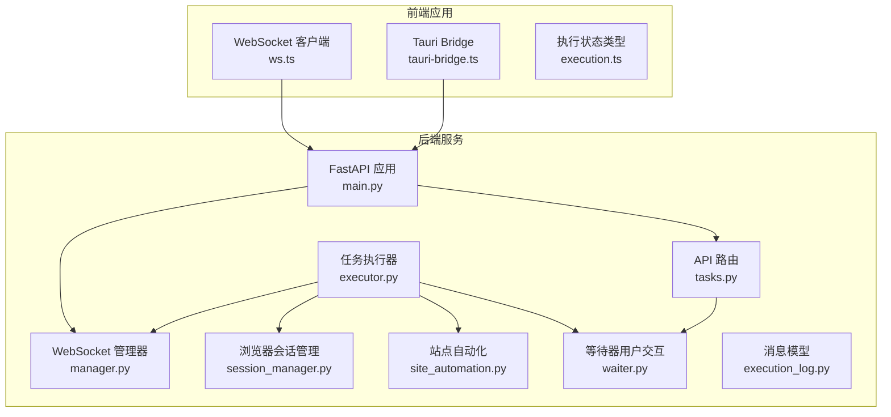
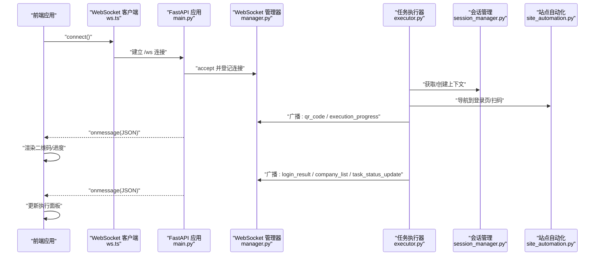
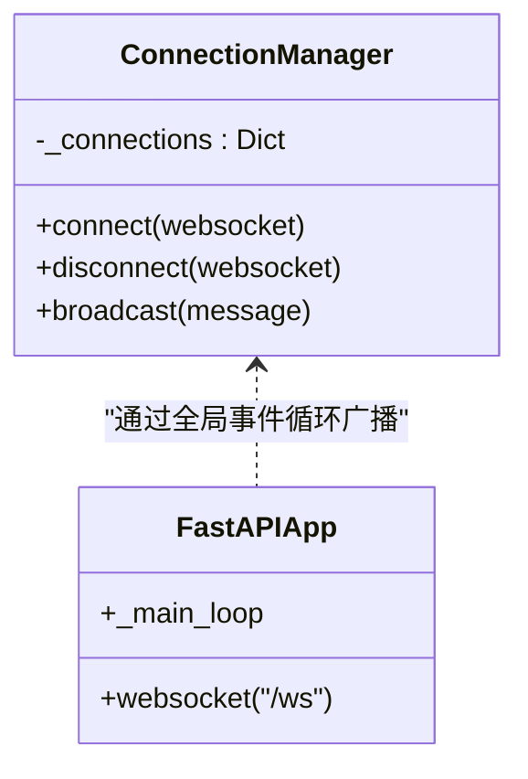
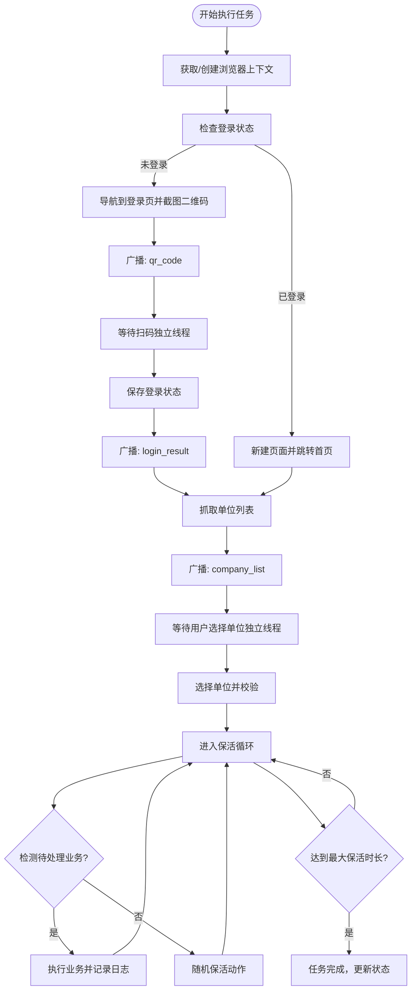
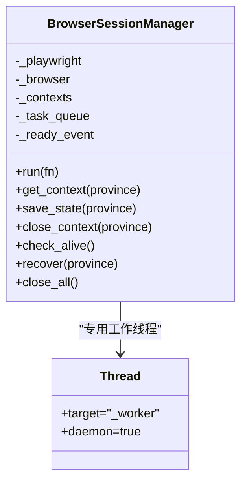
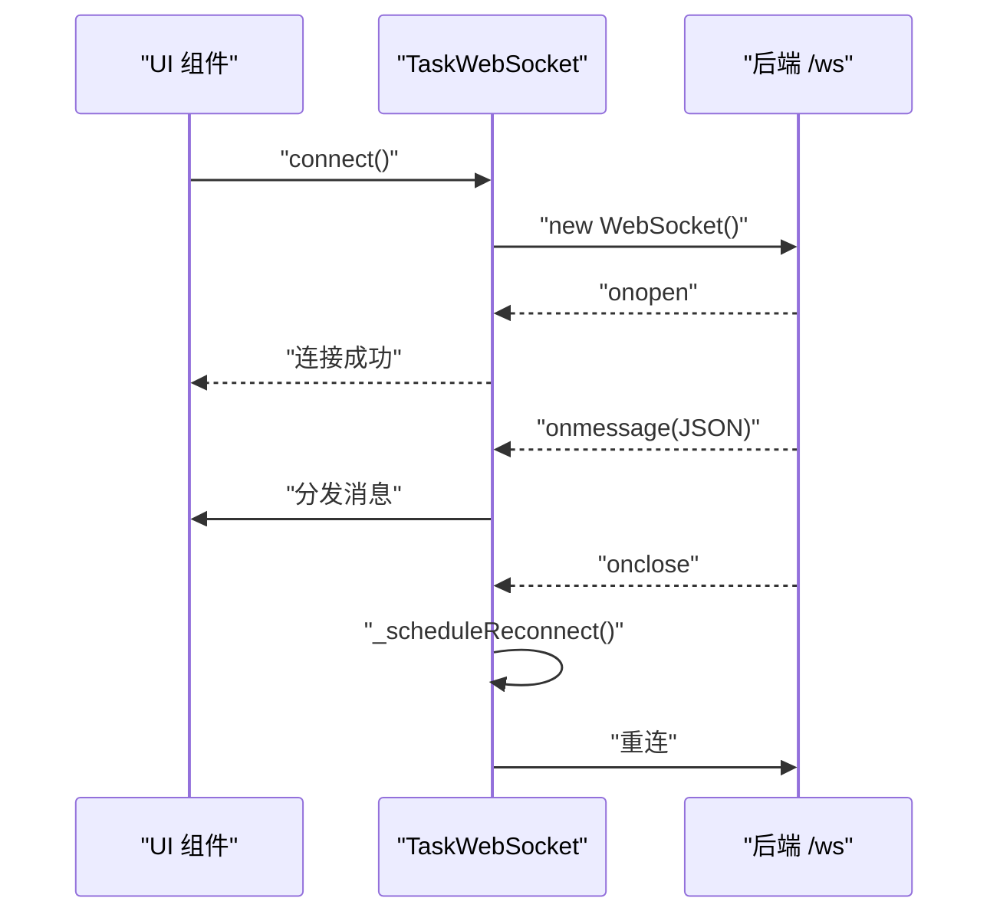
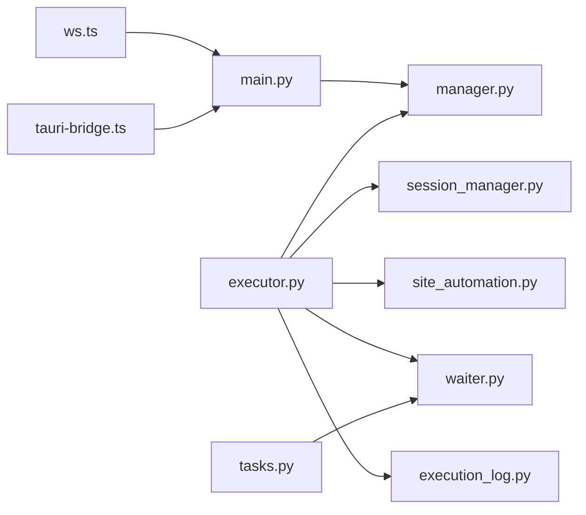

# 实时通信系统

<cite>
**本文档引用的文件**
- [manager.py](file://CCC_RPA_API/app/ws/manager.py)
- [main.py](file://CCC_RPA_API/app/main.py)
- [executor.py](file://CCC_RPA_API/app/services/executor.py)
- [site_automation.py](file://CCC_RPA_API/app/browser/site_automation.py)
- [session_manager.py](file://CCC_RPA_API/app/browser/session_manager.py)
- [waiter.py](file://CCC_RPA_API/app/browser/waiter.py)
- [tasks.py](file://CCC_RPA_API/app/api/tasks.py)
- [execution.ts](file://CCC_RPA_API/app/schemas/execution.py)
- [ws.ts](file://CCC-BrowserV4/frontend/src/api/ws.ts)
- [tauri-bridge.ts](file://CCC-BrowserV4/frontend/src/utils/tauri-bridge.ts)
- [execution.ts](file://CCC-BrowserV4/frontend/src/types/execution.ts)
- [execution_log.py](file://CCC_RPA_API/app/models/execution_log.py)
</cite>

## 目录
1. [简介](#简介)
2. [项目结构](#项目结构)
3. [核心组件](#核心组件)
4. [架构总览](#架构总览)
5. [详细组件分析](#详细组件分析)
6. [依赖关系分析](#依赖关系分析)
7. [性能考虑](#性能考虑)
8. [故障排查指南](#故障排查指南)
9. [结论](#结论)
10. [附录](#附录)

## 简介
本文件面向实时通信系统，围绕基于 WebSocket 的架构进行深入说明，涵盖连接建立、消息推送与断线重连机制；WebSocket Manager 的设计与实现（连接池管理、消息路由与广播）；消息协议规范（统一格式、类型定义与序列化）；页面截图传输（图片编码、传输优化与质量控制）；实时状态同步（会话状态更新、任务进度推送、AI 执行结果通知）；前端 WebSocket 客户端与 Tauri Bridge 的跨平台通信；以及性能优化与故障处理策略。

## 项目结构
该仓库包含两部分：
- 后端服务（FastAPI + Playwright）：提供任务执行、浏览器会话管理、WebSocket 广播与 API 接口。
- 前端应用（Vue + Tauri）：提供 WebSocket 客户端、Tauri Bridge 调用与执行状态展示。

**图表来源**
- [main.py:119-127](file://CCC_RPA_API/app/main.py#L119-L127)
- [manager.py:5-29](file://CCC_RPA_API/app/ws/manager.py#L5-L29)
- [executor.py:12-33](file://CCC_RPA_API/app/services/executor.py#L12-L33)
- [session_manager.py:7-183](file://CCC_RPA_API/app/browser/session_manager.py#L7-L183)
- [site_automation.py:16-562](file://CCC_RPA_API/app/browser/site_automation.py#L16-L562)
- [waiter.py:7-84](file://CCC_RPA_API/app/browser/waiter.py#L7-L84)
- [tasks.py:10-76](file://CCC_RPA_API/app/api/tasks.py#L10-L76)
- [execution_log.py:7-17](file://CCC_RPA_API/app/models/execution_log.py#L7-L17)
- [ws.ts:8-88](file://CCC-BrowserV4/frontend/src/api/ws.ts#L8-L88)
- [tauri-bridge.ts:1-33](file://CCC-BrowserV4/frontend/src/utils/tauri-bridge.ts#L1-L33)
- [execution.ts:1-17](file://CCC-BrowserV4/frontend/src/types/execution.ts#L1-L17)

**章节来源**
- [main.py:119-127](file://CCC_RPA_API/app/main.py#L119-L127)
- [manager.py:5-29](file://CCC_RPA_API/app/ws/manager.py#L5-L29)
- [executor.py:12-33](file://CCC_RPA_API/app/services/executor.py#L12-L33)
- [session_manager.py:7-183](file://CCC_RPA_API/app/browser/session_manager.py#L7-L183)
- [site_automation.py:16-562](file://CCC_RPA_API/app/browser/site_automation.py#L16-L562)
- [waiter.py:7-84](file://CCC_RPA_API/app/browser/waiter.py#L7-L84)
- [tasks.py:10-76](file://CCC_RPA_API/app/api/tasks.py#L10-L76)
- [execution_log.py:7-17](file://CCC_RPA_API/app/models/execution_log.py#L7-L17)
- [ws.ts:8-88](file://CCC-BrowserV4/frontend/src/api/ws.ts#L8-L88)
- [tauri-bridge.ts:1-33](file://CCC-BrowserV4/frontend/src/utils/tauri-bridge.ts#L1-L33)
- [execution.ts:1-17](file://CCC-BrowserV4/frontend/src/types/execution.ts#L1-L17)

## 核心组件
- WebSocket 管理器：维护连接集合、接受连接、断开清理、广播消息并自动剔除失效连接。
- 任务执行器：在工作线程中协调 Playwright 会话、执行自动化步骤、向前端广播状态与截图。
- 浏览器会话管理：按省份管理 Playwright 上下文、持久化存储状态、线程安全执行、异常恢复。
- 站点自动化：封装登录、扫码、单位选择、保活与业务检测等页面操作。
- 等待器：以 Event 机制实现用户交互阻塞等待与取消信号。
- 前端 WebSocket 客户端：连接后端 /ws，接收消息并分发给订阅者，具备指数退避重连。
- Tauri Bridge：封装设备 ID、客户端 ID、Token 生成与登录回调服务器等原生能力调用。

**章节来源**
- [manager.py:5-29](file://CCC_RPA_API/app/ws/manager.py#L5-L29)
- [executor.py:12-33](file://CCC_RPA_API/app/services/executor.py#L12-L33)
- [session_manager.py:7-183](file://CCC_RPA_API/app/browser/session_manager.py#L7-L183)
- [site_automation.py:16-562](file://CCC_RPA_API/app/browser/site_automation.py#L16-L562)
- [waiter.py:7-84](file://CCC_RPA_API/app/browser/waiter.py#L7-L84)
- [ws.ts:8-88](file://CCC-BrowserV4/frontend/src/api/ws.ts#L8-L88)
- [tauri-bridge.ts:1-33](file://CCC-BrowserV4/frontend/src/utils/tauri-bridge.ts#L1-L33)

## 架构总览
后端通过 FastAPI 提供 REST API 与 WebSocket 端点，任务执行器在专用线程中驱动浏览器自动化，期间通过 WebSocket 广播执行进度、二维码、错误与状态更新。前端通过 WebSocket 客户端接收消息并渲染 UI，同时通过 Tauri Bridge 调用原生能力。

**图表来源**
- [main.py:119-127](file://CCC_RPA_API/app/main.py#L119-L127)
- [manager.py:17-26](file://CCC_RPA_API/app/ws/manager.py#L17-L26)
- [executor.py:22-32](file://CCC_RPA_API/app/services/executor.py#L22-L32)
- [session_manager.py:96-123](file://CCC_RPA_API/app/browser/session_manager.py#L96-L123)
- [site_automation.py:148-173](file://CCC_RPA_API/app/browser/site_automation.py#L148-L173)
- [ws.ts:35-42](file://CCC-BrowserV4/frontend/src/api/ws.ts#L35-L42)

## 详细组件分析

### WebSocket 管理器（ConnectionManager）
- 设计要点
  - 维护 WebSocket 到元数据的映射表，支持连接接入与断开清理。
  - 广播消息时对每个连接发送文本消息，捕获异常并剔除失效连接。
  - 使用全局事件循环在工作线程中安全调度广播。
- 关键路径
  - 连接接入：[manager.py:10-12](file://CCC_RPA_API/app/ws/manager.py#L10-L12)
  - 断开清理：[manager.py:14-15](file://CCC_RPA_API/app/ws/manager.py#L14-L15)
  - 广播实现：[manager.py:17-26](file://CCC_RPA_API/app/ws/manager.py#L17-L26)
  - 全局事件循环注入：[main.py:30-34](file://CCC_RPA_API/app/main.py#L30-L34)

**图表来源**
- [manager.py:5-29](file://CCC_RPA_API/app/ws/manager.py#L5-L29)
- [main.py:30-34](file://CCC_RPA_API/app/main.py#L30-L34)

**章节来源**
- [manager.py:5-29](file://CCC_RPA_API/app/ws/manager.py#L5-L29)
- [main.py:30-34](file://CCC_RPA_API/app/main.py#L30-L34)

### 任务执行器（Executor）
- 设计要点
  - 在线程池中执行任务逻辑，避免阻塞主线程。
  - 通过全局事件循环在工作线程中安全广播消息。
  - 与浏览器会话管理器协作，检查/恢复浏览器状态。
  - 与等待器协作，阻塞等待用户扫码与选择单位。
  - 持续保活循环，检测待处理业务并执行。
- 关键路径
  - 广播封装：[executor.py:22-32](file://CCC_RPA_API/app/services/executor.py#L22-L32)
  - PW 线程执行包装：[executor.py:35-39](file://CCC_RPA_API/app/services/executor.py#L35-L39)
  - 会话恢复检查：[executor.py:42-59](file://CCC_RPA_API/app/services/executor.py#L42-L59)
  - 用户等待（独立线程）：[executor.py:62-65](file://CCC_RPA_API/app/services/executor.py#L62-L65)
  - 扫码登录流程：[executor.py:104-134](file://CCC_RPA_API/app/services/executor.py#L104-L134)
  - 单位列表推送：[executor.py:156-160](file://CCC_RPA_API/app/services/executor.py#L156-L160)
  - 保活循环与业务执行：[executor.py:198-256](file://CCC_RPA_API/app/services/executor.py#L198-L256)
  - 任务完成与状态更新：[executor.py:269-273](file://CCC_RPA_API/app/services/executor.py#L269-L273)

**图表来源**
- [executor.py:68-304](file://CCC_RPA_API/app/services/executor.py#L68-L304)
- [session_manager.py:96-123](file://CCC_RPA_API/app/browser/session_manager.py#L96-L123)
- [site_automation.py:148-173](file://CCC_RPA_API/app/browser/site_automation.py#L148-L173)

**章节来源**
- [executor.py:22-32](file://CCC_RPA_API/app/services/executor.py#L22-L32)
- [executor.py:35-39](file://CCC_RPA_API/app/services/executor.py#L35-L39)
- [executor.py:42-59](file://CCC_RPA_API/app/services/executor.py#L42-L59)
- [executor.py:62-65](file://CCC_RPA_API/app/services/executor.py#L62-L65)
- [executor.py:104-134](file://CCC_RPA_API/app/services/executor.py#L104-L134)
- [executor.py:156-160](file://CCC_RPA_API/app/services/executor.py#L156-L160)
- [executor.py:198-256](file://CCC_RPA_API/app/services/executor.py#L198-L256)
- [executor.py:269-273](file://CCC_RPA_API/app/services/executor.py#L269-L273)

### 浏览器会话管理（BrowserSessionManager）
- 设计要点
  - 专用工作线程承载 Playwright，避免与 asyncio 事件循环冲突。
  - 按省份管理 BrowserContext，持久化 storage_state，支持恢复。
  - 线程安全的任务队列与事件同步，支持超时与异常传播。
  - 提供检查存活、恢复会话、关闭上下文与全部资源的能力。
- 关键路径
  - 工作线程初始化：[session_manager.py:39-74](file://CCC_RPA_API/app/browser/session_manager.py#L39-L74)
  - 任务执行与结果回传：[session_manager.py:77-93](file://CCC_RPA_API/app/browser/session_manager.py#L77-L93)
  - 上下文获取与状态持久化：[session_manager.py:96-132](file://CCC_RPA_API/app/browser/session_manager.py#L96-L132)
  - 会话恢复与重建：[session_manager.py:154-167](file://CCC_RPA_API/app/browser/session_manager.py#L154-L167)
  - 关闭与清理：[session_manager.py:170-182](file://CCC_RPA_API/app/browser/session_manager.py#L170-L182)

**图表来源**
- [session_manager.py:7-183](file://CCC_RPA_API/app/browser/session_manager.py#L7-L183)

**章节来源**
- [session_manager.py:39-74](file://CCC_RPA_API/app/browser/session_manager.py#L39-L74)
- [session_manager.py:77-93](file://CCC_RPA_API/app/browser/session_manager.py#L77-L93)
- [session_manager.py:96-132](file://CCC_RPA_API/app/browser/session_manager.py#L96-L132)
- [session_manager.py:154-167](file://CCC_RPA_API/app/browser/session_manager.py#L154-L167)
- [session_manager.py:170-182](file://CCC_RPA_API/app/browser/session_manager.py#L170-L182)

### 站点自动化（SiteAutomation）
- 设计要点
  - 登录状态检查、单位登录页导航、二维码截图（优先元素截图，失败时整页降级）。
  - 单位列表抓取采用多级选择器降级策略，必要时从页面文本提取。
  - 选择单位支持多种匹配策略（data-id、文本、索引），失败时记录日志。
  - 页面保活：随机滚动、点击刷新、随机点击链接、随机等待，间隔 30~120 秒。
  - 待处理业务检测：基于徽标与关键词匹配。
- 关键路径
  - 二维码截图与降级：[site_automation.py:148-173](file://CCC_RPA_API/app/browser/site_automation.py#L148-L173)
  - 单位列表抓取与降级：[site_automation.py:194-291](file://CCC_RPA_API/app/browser/site_automation.py#L194-L291)
  - 选择单位多策略匹配：[site_automation.py:294-419](file://CCC_RPA_API/app/browser/site_automation.py#L294-L419)
  - 保活与业务检测：[site_automation.py:436-554](file://CCC_RPA_API/app/browser/site_automation.py#L436-L554)

**章节来源**
- [site_automation.py:148-173](file://CCC_RPA_API/app/browser/site_automation.py#L148-L173)
- [site_automation.py:194-291](file://CCC_RPA_API/app/browser/site_automation.py#L194-L291)
- [site_automation.py:294-419](file://CCC_RPA_API/app/browser/site_automation.py#L294-L419)
- [site_automation.py:436-554](file://CCC_RPA_API/app/browser/site_automation.py#L436-L554)

### 等待器（ExecutionWaiter）
- 设计要点
  - 使用 threading.Event 实现阻塞等待与唤醒，支持超时与取消。
  - 提供非阻塞检查接口，便于保活循环等场景快速轮询。
  - 线程安全的数据存储与事件注册/清理。
- 关键路径
  - 等待与唤醒：[waiter.py:15-32](file://CCC_RPA_API/app/browser/waiter.py#L15-L32)
  - 取消与检查：[waiter.py:46-69](file://CCC_RPA_API/app/browser/waiter.py#L46-L69)
  - 注册与清理：[waiter.py:72-83](file://CCC_RPA_API/app/browser/waiter.py#L72-L83)

**章节来源**
- [waiter.py:15-32](file://CCC_RPA_API/app/browser/waiter.py#L15-L32)
- [waiter.py:46-69](file://CCC_RPA_API/app/browser/waiter.py#L46-L69)
- [waiter.py:72-83](file://CCC_RPA_API/app/browser/waiter.py#L72-L83)

### 前端 WebSocket 客户端（TaskWebSocket）
- 设计要点
  - 自动根据协议选择 ws/wss，连接后注册 onopen/onmessage/onclose/onerror。
  - 支持多处理器订阅，消息到达时遍历分发。
  - 断线重连采用定时器与指数退避策略，支持手动断开与取消重连。
- 关键路径
  - 连接与消息处理：[ws.ts:26-56](file://CCC-BrowserV4/frontend/src/api/ws.ts#L26-L56)
  - 消息分发：[ws.ts:35-42](file://CCC-BrowserV4/frontend/src/api/ws.ts#L35-L42)
  - 重连调度：[ws.ts:58-64](file://CCC-BrowserV4/frontend/src/api/ws.ts#L58-L64)
  - 断开与清理：[ws.ts:66-76](file://CCC-BrowserV4/frontend/src/api/ws.ts#L66-L76)

**图表来源**
- [ws.ts:20-76](file://CCC-BrowserV4/frontend/src/api/ws.ts#L20-L76)

**章节来源**
- [ws.ts:20-76](file://CCC-BrowserV4/frontend/src/api/ws.ts#L20-L76)

### Tauri Bridge（跨平台通信）
- 设计要点
  - 封装设备 ID、客户端 ID、Token 生成与登录回调服务器启动等命令。
  - 通过 @tauri-apps/api/core 的 invoke 调用后端命令。
- 关键路径
  - 设备 ID 获取：[tauri-bridge.ts:10](file://CCC-BrowserV4/frontend/src/utils/tauri-bridge.ts#L10)
  - Token 生成：[tauri-bridge.ts:20](file://CCC-BrowserV4/frontend/src/utils/tauri-bridge.ts#L20)
  - 登录回调服务器启动：[tauri-bridge.ts:31](file://CCC-BrowserV4/frontend/src/utils/tauri-bridge.ts#L31)

**章节来源**
- [tauri-bridge.ts:1-33](file://CCC-BrowserV4/frontend/src/utils/tauri-bridge.ts#L1-L33)

### 消息协议设计规范
- 统一消息格式
  - 字段：type（字符串）、data（任意对象）。
  - 示例参考：[ws.ts:1-4](file://CCC-BrowserV4/frontend/src/api/ws.ts#L1-L4)
- 消息类型定义（示例）
  - 扫码登录：qr_code（携带 taskId 与 qrImage）。
  - 登录结果：login_result（携带 success 与 message）。
  - 执行进度：execution_progress（携带 taskId、step、message）。
  - 单位列表：company_list（携带 taskId 与 companies）。
  - 任务状态更新：task_status_update（携带 status、lastResult、lastExecutedAt）。
  - 执行错误：execution_error（携带 message）。
- 数据序列化
  - 后端广播前序列化为 JSON 文本；前端收到后反序列化为对象并分发。

**章节来源**
- [ws.ts:1-4](file://CCC-BrowserV4/frontend/src/api/ws.ts#L1-L4)
- [executor.py:116](file://CCC_RPA_API/app/services/executor.py#L116)
- [executor.py:132-134](file://CCC_RPA_API/app/services/executor.py#L132-L134)
- [executor.py:90-100](file://CCC_RPA_API/app/services/executor.py#L90-L100)
- [executor.py:156](file://CCC_RPA_API/app/services/executor.py#L156)
- [executor.py:269-273](file://CCC_RPA_API/app/services/executor.py#L269-L273)
- [executor.py:295](file://CCC_RPA_API/app/services/executor.py#L295)
- [manager.py:18](file://CCC_RPA_API/app/ws/manager.py#L18)

### 页面截图传输实现细节
- 图片编码
  - 后端优先对二维码元素单独截图，再读取为字节并 base64 编码，返回 data URI。
  - 失败时降级为整页截图，同样返回 data URI。
- 传输优化
  - 仅传输最小必要区域（二维码元素），减少体积。
  - 前端直接使用 data URI 渲染，无需额外请求。
- 质量控制
  - 通过等待元素加载、截图后保存临时文件便于调试。
  - 降级策略确保在网络不稳定或页面结构变化时仍能返回图像。

**章节来源**
- [site_automation.py:148-173](file://CCC_RPA_API/app/browser/site_automation.py#L148-L173)

### 实时状态同步机制
- 会话状态更新
  - 登录状态检查、扫码登录、保存状态、登录结果通知。
- 任务进度推送
  - 初始化浏览器、检查登录、获取单位列表、选择单位、保活循环、业务执行。
- AI 执行结果通知
  - 当前实现为占位，未来可扩展为业务执行结果的统一推送。

**章节来源**
- [executor.py:90-100](file://CCC_RPA_API/app/services/executor.py#L90-L100)
- [executor.py:116](file://CCC_RPA_API/app/services/executor.py#L116)
- [executor.py:156](file://CCC_RPA_API/app/services/executor.py#L156)
- [executor.py:227-237](file://CCC_RPA_API/app/services/executor.py#L227-L237)
- [executor.py:269-273](file://CCC_RPA_API/app/services/executor.py#L269-L273)

## 依赖关系分析
- 后端模块耦合
  - main.py 依赖 manager.py 提供的连接管理与广播。
  - executor.py 依赖 session_manager.py、site_automation.py、waiter.py 与 ws_manager。
  - tasks.py 依赖 waiter.py 以响应用户交互信号。
- 前端模块耦合
  - ws.ts 与后端 /ws 端点通信。
  - tauri-bridge.ts 与后端命令交互。
- 数据模型
  - execution_log.py 记录任务执行日志，支撑状态同步与历史查询。

**图表来源**
- [main.py:119-127](file://CCC_RPA_API/app/main.py#L119-L127)
- [manager.py:5-29](file://CCC_RPA_API/app/ws/manager.py#L5-L29)
- [executor.py:12-15](file://CCC_RPA_API/app/services/executor.py#L12-L15)
- [session_manager.py:7-183](file://CCC_RPA_API/app/browser/session_manager.py#L7-L183)
- [site_automation.py:16-562](file://CCC_RPA_API/app/browser/site_automation.py#L16-L562)
- [waiter.py:7-84](file://CCC_RPA_API/app/browser/waiter.py#L7-L84)
- [tasks.py:10-76](file://CCC_RPA_API/app/api/tasks.py#L10-L76)
- [execution_log.py:7-17](file://CCC_RPA_API/app/models/execution_log.py#L7-L17)
- [ws.ts:8-88](file://CCC-BrowserV4/frontend/src/api/ws.ts#L8-L88)
- [tauri-bridge.ts:1-33](file://CCC-BrowserV4/frontend/src/utils/tauri-bridge.ts#L1-L33)

**章节来源**
- [main.py:119-127](file://CCC_RPA_API/app/main.py#L119-L127)
- [manager.py:5-29](file://CCC_RPA_API/app/ws/manager.py#L5-L29)
- [executor.py:12-15](file://CCC_RPA_API/app/services/executor.py#L12-L15)
- [session_manager.py:7-183](file://CCC_RPA_API/app/browser/session_manager.py#L7-L183)
- [site_automation.py:16-562](file://CCC_RPA_API/app/browser/site_automation.py#L16-L562)
- [waiter.py:7-84](file://CCC_RPA_API/app/browser/waiter.py#L7-L84)
- [tasks.py:10-76](file://CCC_RPA_API/app/api/tasks.py#L10-L76)
- [execution_log.py:7-17](file://CCC_RPA_API/app/models/execution_log.py#L7-L17)
- [ws.ts:8-88](file://CCC-BrowserV4/frontend/src/api/ws.ts#L8-L88)
- [tauri-bridge.ts:1-33](file://CCC-BrowserV4/frontend/src/utils/tauri-bridge.ts#L1-L33)

## 性能考虑
- 连接与广播
  - 广播时逐连接发送，异常连接即时剔除，避免广播风暴。
  - 使用全局事件循环在工作线程中调度广播，避免事件循环阻塞。
- 线程与并发
  - 专用工作线程承载 Playwright，避免与 FastAPI 事件循环冲突。
  - 任务执行与用户等待分离至独立线程池，降低阻塞风险。
- 浏览器会话
  - 按省份隔离上下文，复用 storage_state 减少重复登录成本。
  - 会话恢复时重建上下文并重新打开页面，保证稳定性。
- 传输优化
  - 二维码优先元素截图，缩小传输体积；失败时整页降级保障可用性。
- 前端体验
  - 断线重连采用定时器与退避策略，提升网络波动下的可用性。

[本节为通用性能建议，不直接分析具体文件]

## 故障排查指南
- 连接问题
  - 检查 /ws 端点是否正确注册与接入：[main.py:119-127](file://CCC_RPA_API/app/main.py#L119-L127)
  - 确认前端协议选择与主机地址：[ws.ts:15-17](file://CCC-BrowserV4/frontend/src/api/ws.ts#L15-L17)
- 广播失败
  - 核查全局事件循环状态与广播调用路径：[executor.py:22-32](file://CCC_RPA_API/app/services/executor.py#L22-L32)
  - 确认连接有效性与异常剔除逻辑：[manager.py:17-26](file://CCC_RPA_API/app/ws/manager.py#L17-L26)
- 浏览器异常
  - 检查会话存活状态与恢复流程：[executor.py:42-59](file://CCC_RPA_API/app/services/executor.py#L42-L59)
  - 确认专用线程初始化与超时处理：[session_manager.py:39-74](file://CCC_RPA_API/app/browser/session_manager.py#L39-L74)
- 用户交互等待
  - 核查等待器注册、唤醒与取消逻辑：[waiter.py:15-32](file://CCC_RPA_API/app/browser/waiter.py#L15-L32)
- 截图异常
  - 检查二维码元素是否存在与截图路径权限：[site_automation.py:148-173](file://CCC_RPA_API/app/browser/site_automation.py#L148-L173)

**章节来源**
- [main.py:119-127](file://CCC_RPA_API/app/main.py#L119-L127)
- [ws.ts:15-17](file://CCC-BrowserV4/frontend/src/api/ws.ts#L15-L17)
- [executor.py:22-32](file://CCC_RPA_API/app/services/executor.py#L22-L32)
- [manager.py:17-26](file://CCC_RPA_API/app/ws/manager.py#L17-L26)
- [executor.py:42-59](file://CCC_RPA_API/app/services/executor.py#L42-L59)
- [session_manager.py:39-74](file://CCC_RPA_API/app/browser/session_manager.py#L39-L74)
- [waiter.py:15-32](file://CCC_RPA_API/app/browser/waiter.py#L15-L32)
- [site_automation.py:148-173](file://CCC_RPA_API/app/browser/site_automation.py#L148-L173)

## 结论
该实时通信系统通过 WebSocket 实现后端与前端的高效双向通信，结合线程化浏览器自动化与事件驱动的状态推送，形成完整的任务执行闭环。WebSocket 管理器提供简洁可靠的连接与广播能力；任务执行器在多线程环境中协调 Playwright 与用户交互；前端 WebSocket 客户端与 Tauri Bridge 提升了跨平台与原生能力集成。整体架构具备良好的扩展性与可维护性，适合进一步引入更丰富的消息类型与 AI 执行结果通知。

## 附录
- 执行状态类型定义（前端）
  - 步骤枚举与公司信息结构：[execution.ts:1-17](file://CCC-BrowserV4/frontend/src/types/execution.ts#L1-L17)
- 执行请求模型（后端）
  - 选择单位请求体：[execution.ts:4-7](file://CCC_RPA_API/app/schemas/execution.ts#L4-L7)
- 任务日志模型（后端）
  - 执行日志字段定义：[execution_log.py:7-17](file://CCC_RPA_API/app/models/execution_log.py#L7-L17)

**章节来源**
- [execution.ts:1-17](file://CCC-BrowserV4/frontend/src/types/execution.ts#L1-L17)
- [execution.ts:4-7](file://CCC_RPA_API/app/schemas/execution.ts#L4-L7)
- [execution_log.py:7-17](file://CCC_RPA_API/app/models/execution_log.py#L7-L17)