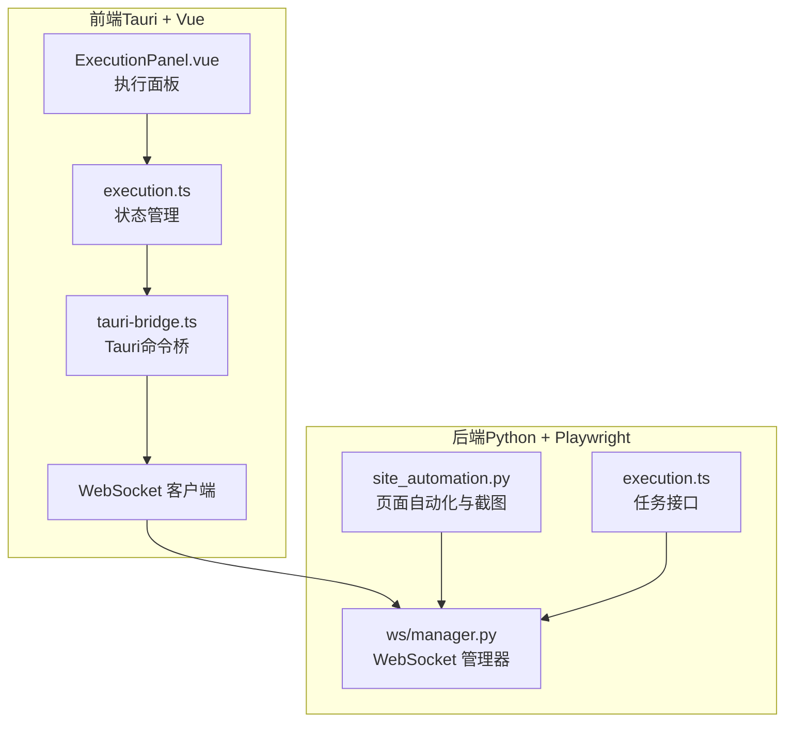
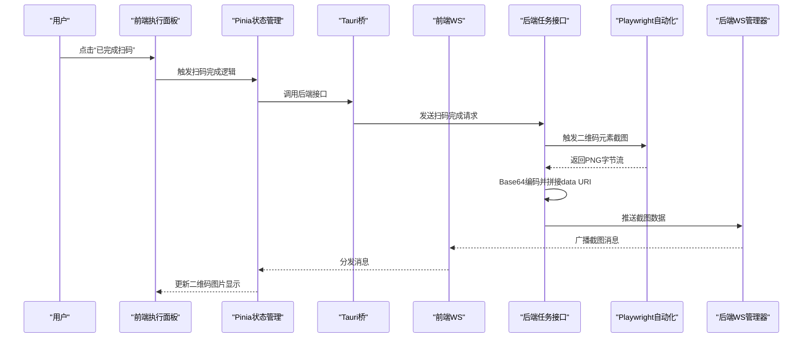
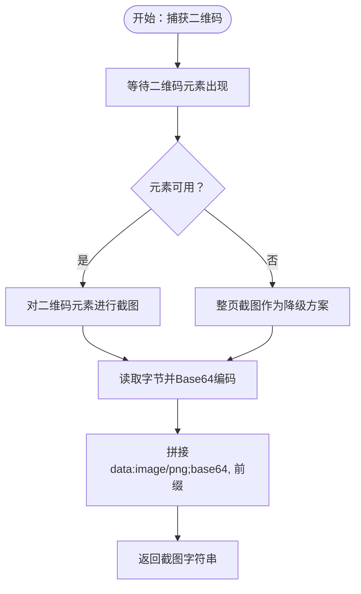
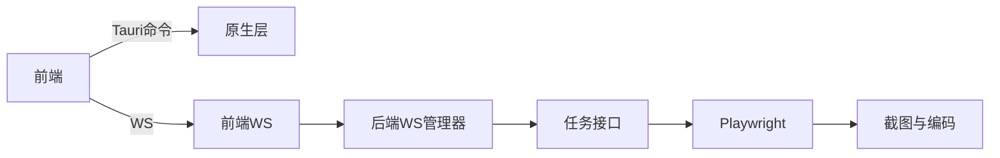

# 截图传输机制

<cite>
**本文档引用的文件**
- [commands.rs](file://CCC-BrowserV4/src-tauri/src/commands.rs)
- [device.rs](file://CCC-BrowserV4/src-tauri/src/device.rs)
- [tauri-bridge.ts](file://CCC-BrowserV4/frontend/src/utils/tauri-bridge.ts)
- [execution.ts](file://CCC-BrowserV4/frontend/src/stores/execution.ts)
- [ExecutionPanel.vue](file://CCC-BrowserV4/frontend/src/components/ExecutionPanel.vue)
- [execution.ts](file://CCC-RPA_API/app/browser/site_automation.py)
- [execution.ts](file://CCC-RPA_API/app/api/execution.ts)
- [ws/manager.py](file://CCC-RPA_API/app/ws/manager.py)
- [Cargo.lock](file://CCC-BrowserV4/src-tauri/Cargo.lock)
</cite>

## 目录
1. [引言](#引言)
2. [项目结构](#项目结构)
3. [核心组件](#核心组件)
4. [架构总览](#架构总览)
5. [详细组件分析](#详细组件分析)
6. [依赖关系分析](#依赖关系分析)
7. [性能考虑](#性能考虑)
8. [故障排查指南](#故障排查指南)
9. [结论](#结论)

## 引言
本文件系统性梳理截图传输机制的设计与实现，涵盖页面截图捕获与编码、图像格式选择与质量控制、尺寸优化策略；二进制数据传输路径（Base64）、分片传输与完整性校验；性能优化（压缩算法、缓存与带宽管理）；存储与清理策略（临时文件、内存与磁盘优化）；跨平台兼容性（操作系统与浏览器差异）；以及监控指标与故障排查方法。本文以实际代码为依据，结合可视化图表帮助读者快速理解端到端流程。

## 项目结构
该系统采用前后端分离架构：
- 前端（Vue + Tauri）负责用户交互与事件驱动，通过 Tauri 桥接调用原生能力（如设备标识、登录回调服务器等），并通过 WebSocket 接收后端推送的状态与截图数据。
- 后端（Python + Playwright）负责自动化操作、页面截图捕获与编码，并通过 WebSocket 将截图数据推送到前端。

**图表来源**
- [ExecutionPanel.vue](file://CCC-BrowserV4/frontend/src/components/ExecutionPanel.vue)
- [execution.ts](file://CCC-BrowserV4/frontend/src/stores/execution.ts)
- [tauri-bridge.ts](file://CCC-BrowserV4/frontend/src/utils/tauri-bridge.ts)
- [site_automation.py](file://CCC-RPA_API/app/browser/site_automation.py)
- [execution.ts](file://CCC-RPA_API/app/api/execution.ts)
- [ws/manager.py](file://CCC-RPA_API/app/ws/manager.py)

**章节来源**
- [ExecutionPanel.vue](file://CCC-BrowserV4/frontend/src/components/ExecutionPanel.vue)
- [execution.ts](file://CCC-BrowserV4/frontend/src/stores/execution.ts)
- [tauri-bridge.ts](file://CCC-BrowserV4/frontend/src/utils/tauri-bridge.ts)
- [site_automation.py](file://CCC-RPA_API/app/browser/site_automation.py)
- [execution.ts](file://CCC-RPA_API/app/api/execution.ts)
- [ws/manager.py](file://CCC-RPA_API/app/ws/manager.py)

## 核心组件
- 设备标识与登录回调（Tauri 原生层）
  - 设备 ID 持久化存储与读取
  - 登录回调 HTTP 服务器（本地端口监听）
- 页面截图与编码（后端 Playwright）
  - 元素级截图优先，失败则整页截图
  - PNG 编码与 Base64 前缀拼接
- 前端状态与展示（Vue/Pinia + 组件）
  - 扫码步骤、单位选择、执行状态
  - WebSocket 消息处理与二维码显示
- WebSocket 传输（后端管理器 + 前端连接）
  - 任务状态与截图数据推送

**章节来源**
- [device.rs](file://CCC-BrowserV4/src-tauri/src/device.rs)
- [commands.rs](file://CCC-BrowserV4/src-tauri/src/commands.rs)
- [site_automation.py](file://CCC-RPA_API/app/browser/site_automation.py)
- [execution.ts](file://CCC-BrowserV4/frontend/src/stores/execution.ts)
- [ExecutionPanel.vue](file://CCC-BrowserV4/frontend/src/components/ExecutionPanel.vue)
- [ws/manager.py](file://CCC-RPA_API/app/ws/manager.py)

## 架构总览
下图展示了从“扫码完成”到“前端接收截图”的完整链路，包括截图捕获、编码与传输路径。

**图表来源**
- [ExecutionPanel.vue](file://CCC-BrowserV4/frontend/src/components/ExecutionPanel.vue)
- [execution.ts](file://CCC-BrowserV4/frontend/src/stores/execution.ts)
- [tauri-bridge.ts](file://CCC-BrowserV4/frontend/src/utils/tauri-bridge.ts)
- [execution.ts](file://CCC-RPA_API/app/api/execution.ts)
- [site_automation.py](file://CCC-RPA_API/app/browser/site_automation.py)
- [ws/manager.py](file://CCC-RPA_API/app/ws/manager.py)

## 详细组件分析

### 截图捕获与编码（后端）
- 截图策略
  - 优先定位二维码元素并单独截图，提升聚焦度与清晰度
  - 若元素未就绪或截图失败，则回退至整页截图
- 图像格式与编码
  - 使用 PNG 编码，确保无损质量
  - 输出为 Base64 字符串，并拼接 data URI 前缀，便于前端直接渲染
- 文件落盘与清理
  - 临时文件写入系统临时目录，用于编码与调试
  - 建议在生产环境增加定时清理策略，防止磁盘膨胀

**图表来源**
- [site_automation.py](file://CCC-RPA_API/app/browser/site_automation.py)

**章节来源**
- [site_automation.py](file://CCC-RPA_API/app/browser/site_automation.py)

### 二进制数据传输机制
- 传输路径
  - 后端将编码后的截图字符串通过 WebSocket 推送给前端
  - 前端通过 Pinia 状态管理更新 UI，直接渲染 data URI
- Base64 编码
  - 采用标准 Base64 编码，便于跨协议传输
- 分片传输与完整性校验
  - 当前实现未见显式分片与校验逻辑
  - 对于大尺寸截图，建议引入分片与校验（如 CRC32/MD5）以增强鲁棒性
- 传输优化
  - 建议在后端启用压缩（如 zlib/gzip）并在前端解压
  - 控制发送速率与并发，避免阻塞主循环

**章节来源**
- [ws/manager.py](file://CCC-RPA_API/app/ws/manager.py)
- [execution.ts](file://CCC-BrowserV4/frontend/src/stores/execution.ts)

### 性能优化策略
- 压缩算法选择
  - 优先选择轻量压缩（zlib/gzip）以平衡 CPU 与带宽
  - 针对 PNG 已有压缩的场景，可评估是否需要二次压缩
- 缓存机制
  - 前端缓存最近 N 张截图，避免重复传输
  - 后端缓存近期任务的截图结果，减少重复计算
- 带宽管理
  - 限制每秒发送次数与单次大小
  - 在弱网环境下降低分辨率或质量
- 尺寸优化
  - 前端按容器尺寸缩放显示，避免超大图片渲染
  - 后端根据目标显示比例裁剪或缩放后再编码

**章节来源**
- [execution.ts](file://CCC-BrowserV4/frontend/src/stores/execution.ts)
- [site_automation.py](file://CCC-RPA_API/app/browser/site_automation.py)

### 存储与清理策略
- 临时文件管理
  - 截图临时文件写入系统临时目录，需定期清理
  - 建议在任务结束或超时后删除
- 内存占用控制
  - Base64 字符串比原始二进制体积约增 33%，注意内存峰值
  - 前端及时释放不再使用的图片引用
- 磁盘空间优化
  - 设置最大保留数量与过期时间
  - 定期扫描并删除超过阈值的旧文件

**章节来源**
- [site_automation.py](file://CCC-RPA_API/app/browser/site_automation.py)
- [execution.ts](file://CCC-BrowserV4/frontend/src/stores/execution.ts)

### 跨平台截图传输的实现差异
- 操作系统差异
  - Windows/Linux/macOS 的 Playwright 驱动行为一致，但系统字体、DPI 可能影响截图细节
  - 建议固定字体与字号，或在后端统一渲染策略
- 浏览器兼容性
  - 不同浏览器内核对 CSS 与 Canvas 的渲染存在细微差异
  - 建议在后端统一截图策略（如固定视口、禁用动画）
- 前端渲染差异
  - 不同浏览器对 data URI 的解析与渲染性能不同
  - 建议在前端做降级处理（如转为 Blob URL）

**章节来源**
- [site_automation.py](file://CCC-RPA_API/app/browser/site_automation.py)
- [ExecutionPanel.vue](file://CCC-BrowserV4/frontend/src/components/ExecutionPanel.vue)

### 监控指标与故障排查
- 监控指标
  - 截图成功率（元素级 vs 整页）
  - 截图耗时（元素级/整页）
  - Base64 编码耗时与体积
  - WebSocket 推送延迟与丢包率
  - 前端渲染卡顿与内存峰值
- 故障排查
  - 元素未出现：检查等待超时与选择器稳定性
  - 编码失败：确认 PNG 编码依赖与权限
  - 传输中断：检查 WS 连接状态与网络波动
  - 渲染异常：检查 data URI 前缀与浏览器支持

**章节来源**
- [site_automation.py](file://CCC-RPA_API/app/browser/site_automation.py)
- [ws/manager.py](file://CCC-RPA_API/app/ws/manager.py)
- [execution.ts](file://CCC-BrowserV4/frontend/src/stores/execution.ts)

## 依赖关系分析
- 前端依赖
  - Tauri 提供原生能力（设备标识、登录回调服务器）
  - Vue/Pinia 管理执行状态与消息分发
  - WebSocket 客户端接收后端推送
- 后端依赖
  - Playwright 负责页面自动化与截图
  - WebSocket 管理器负责消息广播
  - Python 标准库（如 base64）用于编码

**图表来源**
- [tauri-bridge.ts](file://CCC-BrowserV4/frontend/src/utils/tauri-bridge.ts)
- [commands.rs](file://CCC-BrowserV4/src-tauri/src/commands.rs)
- [ws/manager.py](file://CCC-RPA_API/app/ws/manager.py)
- [execution.ts](file://CCC-RPA_API/app/api/execution.ts)
- [site_automation.py](file://CCC-RPA_API/app/browser/site_automation.py)

**章节来源**
- [tauri-bridge.ts](file://CCC-BrowserV4/frontend/src/utils/tauri-bridge.ts)
- [commands.rs](file://CCC-BrowserV4/src-tauri/src/commands.rs)
- [ws/manager.py](file://CCC-RPA_API/app/ws/manager.py)
- [execution.ts](file://CCC-RPA_API/app/api/execution.ts)
- [site_automation.py](file://CCC-RPA_API/app/browser/site_automation.py)

## 性能考虑
- 截图阶段
  - 优先元素级截图，减少像素与带宽
  - 固定视口与禁用动画，提升一致性
- 编码阶段
  - 使用高效编码器，避免重复 I/O
  - 对大图先缩放再编码
- 传输阶段
  - 启用压缩与限速，避免拥塞
  - 分片传输与断点续传（建议）
- 前端渲染
  - data URI 仅用于小图，大图建议 Blob URL
  - 及时释放图片资源，避免内存泄漏

[本节为通用指导，无需列出具体文件来源]

## 故障排查指南
- 截图为空
  - 检查元素选择器与等待超时
  - 确认整页降级路径是否生效
- Base64 编码异常
  - 校验 PNG 编码依赖与权限
  - 检查文件读写路径
- WebSocket 无法接收
  - 检查连接状态与心跳
  - 查看后端日志与异常栈
- 前端渲染卡顿
  - 减少同时渲染的大图数量
  - 使用缩略图占位，异步加载高清图

**章节来源**
- [site_automation.py](file://CCC-RPA_API/app/browser/site_automation.py)
- [ws/manager.py](file://CCC-RPA_API/app/ws/manager.py)
- [execution.ts](file://CCC-BrowserV4/frontend/src/stores/execution.ts)

## 结论
本系统通过“元素级截图优先 + 整页降级”的策略，在保证质量的同时兼顾效率；借助 Base64 data URI 与 WebSocket 推送，实现了端到端的实时传输。为进一步提升稳定性与性能，建议引入分片与校验、压缩与缓存、带宽限速与前端资源回收等机制，并完善监控与告警体系。