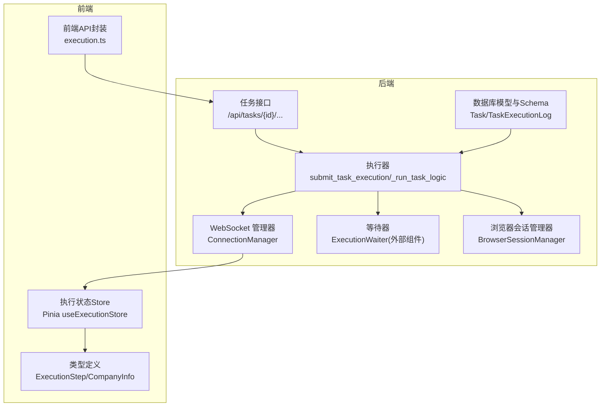
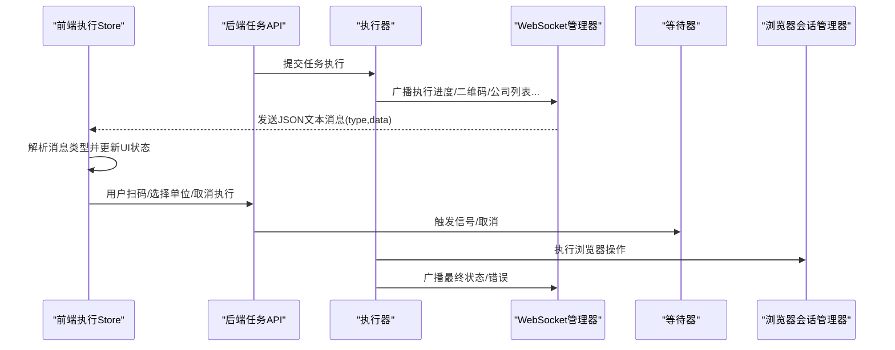
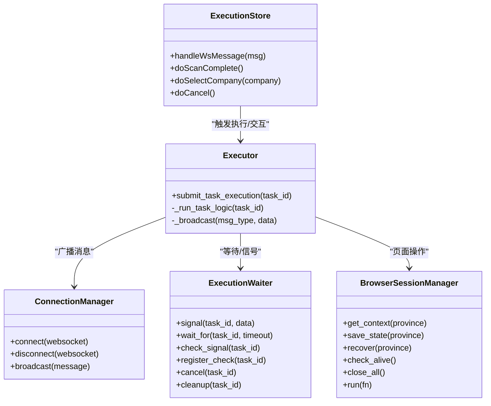

# 消息协议设计

<cite>
**本文引用的文件**
- [manager.py](file://CCC_RPA_API/app/ws/manager.py)
- [executor.py](file://CCC_RPA_API/app/services/executor.py)
- [tasks.py](file://CCC_RPA_API/app/api/tasks.py)
- [execution.ts](file://CCC-BrowserV4/frontend/src/types/execution.ts)
- [execution.ts](file://CCC-BrowserV4/frontend/src/stores/execution.ts)
- [execution.ts](file://CCC-BrowserV4/frontend/src/api/execution.ts)
- [session_manager.py](file://CCC_RPA_API/app/browser/session_manager.py)
- [execution_log.py](file://CCC_RPA_API/app/models/execution_log.py)
- [execution_log.py](file://CCC_RPA_API/app/schemas/execution_log.py)
- [task.py](file://CCC_RPA_API/app/models/task.py)
</cite>

## 目录
1. [引言](#引言)
2. [项目结构](#项目结构)
3. [核心组件](#核心组件)
4. [架构总览](#架构总览)
5. [详细组件分析](#详细组件分析)
6. [依赖关系分析](#依赖关系分析)
7. [性能考量](#性能考量)
8. [故障排查指南](#故障排查指南)
9. [结论](#结论)
10. [附录](#附录)

## 引言
本文件面向消息协议设计，基于实际代码库中的 WebSocket 广播、任务执行状态推送、前端消息消费与交互等实现，系统化梳理统一消息格式规范、消息类型与用途、序列化与传输机制、路由与过滤规则、版本与兼容策略，并提供完整示例与调试方法。文档同时兼顾非技术读者，通过图示与分层讲解帮助快速理解。

## 项目结构
消息协议涉及后端 WebSocket 管理、任务执行服务、前端状态存储与 API 调用等多个模块。后端通过连接管理器进行广播，执行器在任务生命周期内推送多种类型的消息；前端通过 Pinia Store 接收并解析消息，驱动 UI 状态变化；API 层提供与用户交互的触发点（扫码完成、选择单位、取消执行）。

图表来源
- [manager.py:1-29](file://CCC_RPA_API/app/ws/manager.py#L1-L29)
- [executor.py:1-308](file://CCC_RPA_API/app/services/executor.py#L1-L308)
- [tasks.py:1-76](file://CCC_RPA_API/app/api/tasks.py#L1-L76)
- [execution.ts:1-229](file://CCC-BrowserV4/frontend/src/stores/execution.ts#L1-L229)
- [execution.ts:1-17](file://CCC-BrowserV4/frontend/src/types/execution.ts#L1-L17)
- [execution.ts:1-20](file://CCC-BrowserV4/frontend/src/api/execution.ts#L1-L20)
- [session_manager.py:1-183](file://CCC_RPA_API/app/browser/session_manager.py#L1-L183)
- [execution_log.py:1-17](file://CCC_RPA_API/app/models/execution_log.py#L1-L17)
- [execution_log.py:1-19](file://CCC_RPA_API/app/schemas/execution_log.py#L1-L19)
- [task.py:1-25](file://CCC_RPA_API/app/models/task.py#L1-L25)

章节来源
- [manager.py:1-29](file://CCC_RPA_API/app/ws/manager.py#L1-L29)
- [executor.py:1-308](file://CCC_RPA_API/app/services/executor.py#L1-L308)
- [tasks.py:1-76](file://CCC_RPA_API/app/api/tasks.py#L1-L76)
- [execution.ts:1-229](file://CCC-BrowserV4/frontend/src/stores/execution.ts#L1-L229)
- [execution.ts:1-17](file://CCC-BrowserV4/frontend/src/types/execution.ts#L1-L17)
- [execution.ts:1-20](file://CCC-BrowserV4/frontend/src/api/execution.ts#L1-L20)
- [session_manager.py:1-183](file://CCC_RPA_API/app/browser/session_manager.py#L1-L183)
- [execution_log.py:1-17](file://CCC_RPA_API/app/models/execution_log.py#L1-L17)
- [execution_log.py:1-19](file://CCC_RPA_API/app/schemas/execution_log.py#L1-L19)
- [task.py:1-25](file://CCC_RPA_API/app/models/task.py#L1-L25)

## 核心组件
- WebSocket 连接管理器：负责接受连接、维护连接集合、广播消息、清理无效连接。
- 执行器：在任务执行过程中，按阶段推送多种消息类型，包括进度、二维码、公司列表、登录结果、错误与最终状态更新。
- 前端执行状态 Store：接收消息、按类型更新本地状态（步骤、消息、二维码、公司列表等），并与后端 API 协同完成用户交互。
- 任务与执行日志模型与 Schema：用于持久化任务状态与执行日志，支撑消息中的状态与结果展示。
- 浏览器会话管理器：确保 Playwright 操作在专用线程中执行，保障稳定性与一致性。

章节来源
- [manager.py:1-29](file://CCC_RPA_API/app/ws/manager.py#L1-L29)
- [executor.py:1-308](file://CCC_RPA_API/app/services/executor.py#L1-L308)
- [execution.ts:1-229](file://CCC-BrowserV4/frontend/src/stores/execution.ts#L1-L229)
- [execution_log.py:1-17](file://CCC_RPA_API/app/models/execution_log.py#L1-L17)
- [execution_log.py:1-19](file://CCC_RPA_API/app/schemas/execution_log.py#L1-L19)
- [session_manager.py:1-183](file://CCC_RPA_API/app/browser/session_manager.py#L1-L183)

## 架构总览
消息协议采用“后端生成、统一广播、前端订阅”的模式。后端在执行器中根据任务生命周期生成消息，经连接管理器以 JSON 文本形式广播给所有连接的客户端；前端 Store 在收到消息后按类型进行状态更新，并通过 API 触发下一步用户动作。

图表来源
- [executor.py:22-33](file://CCC_RPA_API/app/services/executor.py#L22-L33)
- [manager.py:17-26](file://CCC_RPA_API/app/ws/manager.py#L17-L26)
- [execution.ts:22-67](file://CCC-BrowserV4/frontend/src/stores/execution.ts#L22-L67)
- [execution.ts:1-20](file://CCC-BrowserV4/frontend/src/api/execution.ts#L1-L20)
- [tasks.py:60-75](file://CCC_RPA_API/app/api/tasks.py#L60-L75)
- [session_manager.py:77-93](file://CCC_RPA_API/app/browser/session_manager.py#L77-L93)

## 详细组件分析

### 统一消息格式规范
- 消息头结构
  - type：消息类型字符串，用于前端分支处理（例如“execution_progress”、“qr_code”、“company_list”、“login_result”、“execution_error”、“task_status_update”）。
  - data：消息体对象，承载具体字段（如 taskId、step、message、qrImage、companies、success、status 等）。
- 消息体定义
  - 所有消息体均为 JSON 对象，键名遵循后端 Python 字段命名风格（snake_case），前端 Store 中对应转换为驼峰命名（如 startedAt、finishedAt、taskId）。
- 元数据字段
  - taskId：任务唯一标识，用于前端过滤与关联显示。
  - step：执行步骤枚举，用于前端 UI 显示当前阶段。
  - message：人类可读的提示信息。
  - qrImage：二维码图片数据（Base64 或 URL）。
  - companies：公司列表，包含 id、name、creditCode。
  - success/status：布尔或状态字符串，指示结果或状态变更。
  - 其他：如 finishedAt、lastResult、lastExecutedAt 等，用于记录时间戳与最终结果。

章节来源
- [executor.py:22-33](file://CCC_RPA_API/app/services/executor.py#L22-L33)
- [executor.py:88-120](file://CCC_RPA_API/app/services/executor.py#L88-L120)
- [executor.ts:22-67](file://CCC-BrowserV4/frontend/src/stores/execution.ts#L22-L67)
- [execution_log.py:4-14](file://CCC_RPA_API/app/schemas/execution_log.py#L4-L14)

### 消息类型与用途
- 执行进度（execution_progress）
  - 用途：实时反馈任务各阶段进展，如“检查登录”“扫码中”“等待单位”“执行中”“保活中”等。
  - 关键字段：taskId、step、message。
- 二维码（qr_code）
  - 用途：推送二维码图片，引导用户扫码登录。
  - 关键字段：taskId、qrImage。
- 公司列表（company_list）
  - 用途：推送可选单位列表，供用户选择。
  - 关键字段：taskId、companies。
- 登录结果（login_result）
  - 用途：反馈扫码登录是否成功。
  - 关键字段：taskId、success、message。
- 执行错误（execution_error）
  - 用途：上报执行期异常，前端转为失败状态与错误提示。
  - 关键字段：taskId、message。
- 任务状态更新（task_status_update）
  - 用途：任务完成或失败后的最终状态同步。
  - 关键字段：taskId、status、lastResult、lastExecutedAt。

章节来源
- [executor.py:88-120](file://CCC_RPA_API/app/services/executor.py#L88-L120)
- [executor.py:115-160](file://CCC_RPA_API/app/services/executor.py#L115-L160)
- [executor.py:120-140](file://CCC_RPA_API/app/services/executor.py#L120-L140)
- [executor.py:130-140](file://CCC_RPA_API/app/services/executor.py#L130-L140)
- [executor.py:142-160](file://CCC_RPA_API/app/services/executor.py#L142-L160)
- [executor.py:268-273](file://CCC_RPA_API/app/services/executor.py#L268-L273)
- [executor.py:294-300](file://CCC_RPA_API/app/services/executor.py#L294-L300)

### 序列化与反序列化机制
- 后端序列化
  - 使用 JSON 编码字典为文本，发送至所有连接的 WebSocket 客户端。
- 前端反序列化
  - Store 接收文本消息后解析为对象，按 type 分支处理 data 字段。
- 数据压缩与传输优化
  - 代码中未见显式的压缩实现；建议在传输大量数据（如二维码图片）时考虑 Base64 压缩或分块传输策略，以降低带宽与延迟。

章节来源
- [manager.py:17-26](file://CCC_RPA_API/app/ws/manager.py#L17-L26)
- [execution.ts:22-67](file://CCC-BrowserV4/frontend/src/stores/execution.ts#L22-L67)

### 消息路由规则
- 目标标识符
  - taskId：用于区分不同任务的消息流，前端在处理消息时会校验 taskId 与当前任务是否一致，避免跨任务污染。
- 优先级设置
  - 代码未实现显式优先级；当前采用“先到先处理”的顺序模型。
- 批量处理
  - 后端广播为单条消息逐个发送；未见批量聚合逻辑。

章节来源
- [execution.ts:24-25](file://CCC-BrowserV4/frontend/src/stores/execution.ts#L24-L25)

### 版本管理策略与向后兼容
- 版本字段
  - 代码未定义消息版本字段；建议引入 version 或 protocolVersion 字段，以便未来扩展。
- 兼容性保证
  - 新增字段时保持必填字段不变，新增可选字段；删除字段时保留别名或映射一段时间。
  - 类型枚举（如 step）变更需谨慎，建议新增值并标注废弃值，逐步迁移。

章节来源
- [execution.ts:1-17](file://CCC-BrowserV4/frontend/src/types/execution.ts#L1-L17)

### 消息协议示例
以下为典型消息示例（仅描述字段与含义，不展示具体值）：
- 执行进度
  - type: "execution_progress"
  - data: { taskId: 整数, step: "checking_login"|"qr_scanning"|... , message: "字符串" }
- 二维码
  - type: "qr_code"
  - data: { taskId: 整数, qrImage: "字符串(图片数据)" }
- 公司列表
  - type: "company_list"
  - data: { taskId: 整数, companies: [{ id: "字符串", name: "字符串", creditCode: "字符串" }, ...] }
- 登录结果
  - type: "login_result"
  - data: { taskId: 整数, success: 布尔, message: "字符串" }
- 执行错误
  - type: "execution_error"
  - data: { taskId: 整数, message: "字符串" }
- 任务状态更新
  - type: "task_status_update"
  - data: { taskId: 整数, status: "completed"|"failed", lastResult: "success"|"failed", lastExecutedAt: "YYYY-MM-DD HH:mm:ss" }

章节来源
- [executor.py:88-120](file://CCC_RPA_API/app/services/executor.py#L88-L120)
- [executor.py:115-160](file://CCC_RPA_API/app/services/executor.py#L115-L160)
- [executor.py:120-140](file://CCC_RPA_API/app/services/executor.py#L120-L140)
- [executor.py:130-140](file://CCC_RPA_API/app/services/executor.py#L130-L140)
- [executor.py:142-160](file://CCC_RPA_API/app/services/executor.py#L142-L160)
- [executor.py:268-273](file://CCC_RPA_API/app/services/executor.py#L268-L273)
- [executor.py:294-300](file://CCC_RPA_API/app/services/executor.py#L294-L300)

### 调试工具与使用方法
- 前端调试
  - 在 Store 的 handleWsMessage 中断点，观察 msg.type 与 msg.data 的结构，确认 taskId 匹配与字段完整性。
  - 使用浏览器开发者工具 Network 面板查看 WebSocket 文本帧内容，核对 JSON 结构。
- 后端调试
  - 在执行器中添加日志，打印即将广播的消息结构，核对 type 与 data 字段。
  - 使用连接管理器的广播逻辑，确认消息被正确发送至所有连接。
- API 触发调试
  - 通过前端 API 封装调用“扫码完成”“选择单位”“取消执行”，观察后端等待器信号与执行器后续行为。

章节来源
- [execution.ts:22-67](file://CCC-BrowserV4/frontend/src/stores/execution.ts#L22-L67)
- [execution.ts:1-20](file://CCC-BrowserV4/frontend/src/api/execution.ts#L1-L20)
- [executor.py:22-33](file://CCC_RPA_API/app/services/executor.py#L22-L33)
- [manager.py:17-26](file://CCC_RPA_API/app/ws/manager.py#L17-L26)

## 依赖关系分析
- 后端
  - 执行器依赖连接管理器进行广播，依赖等待器进行用户交互同步，依赖浏览器会话管理器执行页面操作。
  - API 层触发执行器与等待器，提供用户交互入口。
- 前端
  - Store 依赖类型定义与 API 封装，负责消息解析与状态更新。
- 数据层
  - 任务与执行日志模型支撑任务状态与历史记录，Schema 用于对外响应的数据结构。

图表来源
- [manager.py:1-29](file://CCC_RPA_API/app/ws/manager.py#L1-L29)
- [executor.py:1-308](file://CCC_RPA_API/app/services/executor.py#L1-L308)
- [execution.ts:1-229](file://CCC-BrowserV4/frontend/src/stores/execution.ts#L1-L229)
- [session_manager.py:1-183](file://CCC_RPA_API/app/browser/session_manager.py#L1-L183)

章节来源
- [manager.py:1-29](file://CCC_RPA_API/app/ws/manager.py#L1-L29)
- [executor.py:1-308](file://CCC_RPA_API/app/services/executor.py#L1-L308)
- [execution.ts:1-229](file://CCC-BrowserV4/frontend/src/stores/execution.ts#L1-L229)
- [session_manager.py:1-183](file://CCC_RPA_API/app/browser/session_manager.py#L1-L183)

## 性能考量
- 广播开销
  - 广播遍历所有连接，若连接数较多，建议按任务维度分组广播或使用房间/频道隔离。
- 消息体积
  - 二维码等图片建议采用 Base64 压缩或外部存储+URL，减少消息体大小。
- 线程与并发
  - 执行器与浏览器操作分离，避免阻塞主线程；注意控制并发度，防止资源争用。
- 心跳与保活
  - 保活循环应合理设置等待间隔，支持短周期轮询与取消信号快速响应。

[本节为通用性能建议，无需特定文件来源]

## 故障排查指南
- WebSocket 连接异常
  - 现象：消息未送达或连接中断。
  - 排查：检查连接管理器的广播循环与异常捕获，确认无效连接被清理。
- 消息类型缺失或字段不匹配
  - 现象：前端 UI 不更新或报错。
  - 排查：核对后端消息构造与前端 Store 分支逻辑，确保 type 与 data 字段一致。
- 任务状态不一致
  - 现象：任务最终状态与 UI 不一致。
  - 排查：检查执行器在异常路径与正常路径对任务与日志表的更新逻辑。
- 浏览器会话异常
  - 现象：页面操作失败或崩溃。
  - 排查：确认会话管理器的存活检查与恢复流程，必要时重建上下文。

章节来源
- [manager.py:17-26](file://CCC_RPA_API/app/ws/manager.py#L17-L26)
- [executor.py:275-300](file://CCC_RPA_API/app/services/executor.py#L275-L300)
- [session_manager.py:144-167](file://CCC_RPA_API/app/browser/session_manager.py#L144-L167)

## 结论
本消息协议以 WebSocket 为核心，结合后端广播与前端 Store 分支处理，实现了任务执行期间的状态可视化与用户交互闭环。建议在未来版本中引入消息版本字段、优化图片传输体积、细化广播粒度与错误处理，以进一步提升可维护性与性能。

[本节为总结性内容，无需特定文件来源]

## 附录

### 消息类型与字段对照表
- execution_progress
  - taskId: 整数
  - step: 枚举字符串
  - message: 字符串
- qr_code
  - taskId: 整数
  - qrImage: 图片数据字符串
- company_list
  - taskId: 整数
  - companies: 数组，元素含 id、name、creditCode
- login_result
  - taskId: 整数
  - success: 布尔
  - message: 字符串
- execution_error
  - taskId: 整数
  - message: 字符串
- task_status_update
  - taskId: 整数
  - status: "completed"|"failed"
  - lastResult: "success"|"failed"
  - lastExecutedAt: "YYYY-MM-DD HH:mm:ss"

章节来源
- [executor.py:88-120](file://CCC_RPA_API/app/services/executor.py#L88-L120)
- [executor.py:115-160](file://CCC_RPA_API/app/services/executor.py#L115-L160)
- [executor.py:120-140](file://CCC_RPA_API/app/services/executor.py#L120-L140)
- [executor.py:130-140](file://CCC_RPA_API/app/services/executor.py#L130-L140)
- [executor.py:142-160](file://CCC_RPA_API/app/services/executor.py#L142-L160)
- [executor.py:268-273](file://CCC_RPA_API/app/services/executor.py#L268-L273)
- [executor.py:294-300](file://CCC_RPA_API/app/services/executor.py#L294-L300)