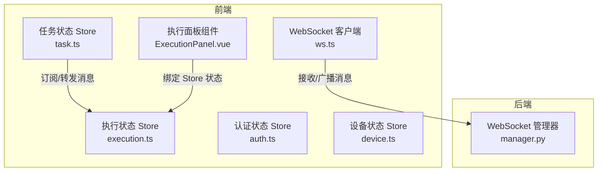
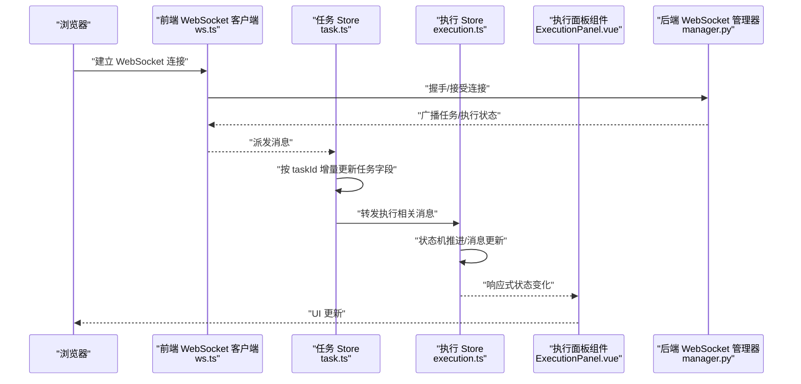
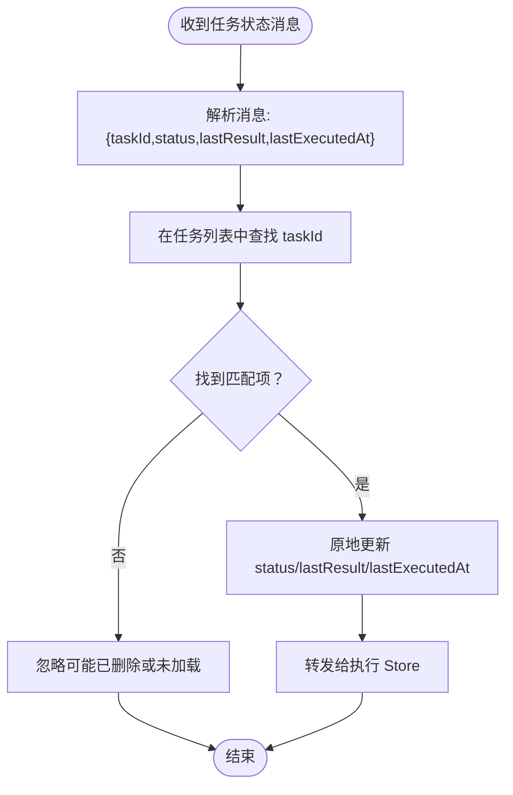
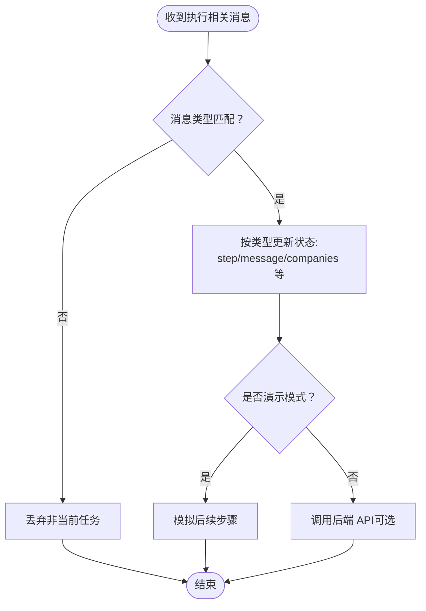
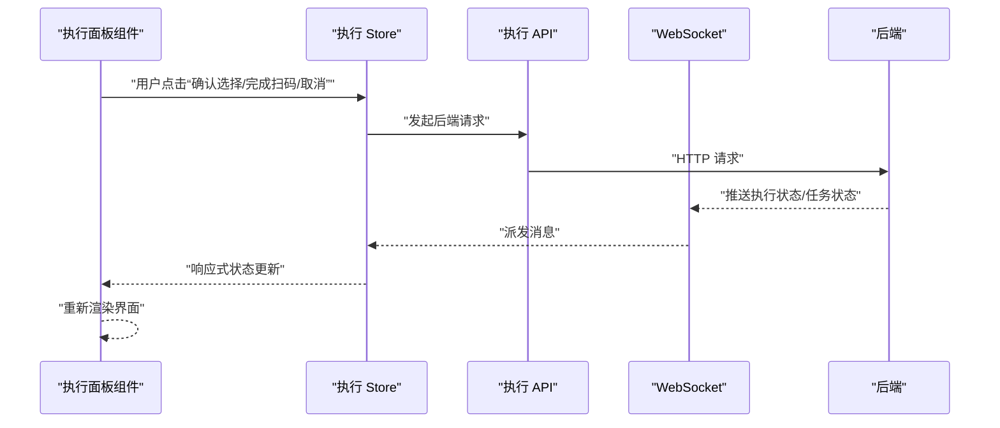
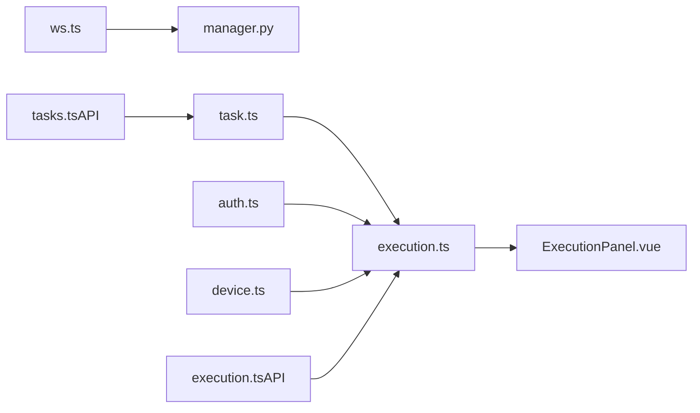

# 状态同步机制

<cite>
**本文引用的文件**
- [execution.ts](file://CCC-BrowserV4/frontend/src/stores/execution.ts)
- [task.ts](file://CCC-BrowserV4/frontend/src/stores/task.ts)
- [device.ts](file://CCC-BrowserV4/frontend/src/stores/device.ts)
- [auth.ts](file://CCC-BrowserV4/frontend/src/stores/auth.ts)
- [ws.ts](file://CCC-BrowserV4/frontend/src/api/ws.ts)
- [execution.ts（类型）](file://CCC-BrowserV4/frontend/src/types/execution.ts)
- [index.ts（类型）](file://CCC-BrowserV4/frontend/src/types/index.ts)
- [execution.ts（API）](file://CCC-BrowserV4/frontend/src/api/execution.ts)
- [tasks.ts（API）](file://CCC-BrowserV4/frontend/src/api/tasks.ts)
- [ExecutionPanel.vue](file://CCC-BrowserV4/frontend/src/components/ExecutionPanel.vue)
- [manager.py](file://CCC_RPA_API/app/ws/manager.py)
</cite>

## 目录
1. [引言](#引言)
2. [项目结构](#项目结构)
3. [核心组件](#核心组件)
4. [架构总览](#架构总览)
5. [详细组件分析](#详细组件分析)
6. [依赖关系分析](#依赖关系分析)
7. [性能考虑](#性能考虑)
8. [故障排查指南](#故障排查指南)
9. [结论](#结论)
10. [附录](#附录)

## 引言
本文件系统性阐述该 RPA 系统的状态同步机制，重点覆盖以下方面：
- 实时状态同步的设计原理：状态变更检测、增量更新与冲突解决策略
- 不同类型状态的同步策略：任务执行状态、会话状态、设备状态与用户权限状态
- 数据结构设计：状态模型、版本控制与一致性保障
- 性能优化：去重、批处理与延迟合并
- 前端状态管理与后端状态的协同：Pinia Store 的状态更新与组件响应式渲染
- 调试与监控：状态变更日志与同步延迟分析

## 项目结构
系统采用前后端分离架构，前端使用 Vue 3 + Pinia 管理状态并通过 WebSocket 接收后端推送；后端基于 FastAPI 提供 WebSocket 广播能力。

图表来源
- [ws.ts:1-88](file://CCC-BrowserV4/frontend/src/api/ws.ts#L1-L88)
- [task.ts:1-84](file://CCC-BrowserV4/frontend/src/stores/task.ts#L1-L84)
- [execution.ts:1-229](file://CCC-BrowserV4/frontend/src/stores/execution.ts#L1-L229)
- [manager.py:1-29](file://CCC_RPA_API/app/ws/manager.py#L1-L29)

章节来源
- [ws.ts:1-88](file://CCC-BrowserV4/frontend/src/api/ws.ts#L1-L88)
- [task.ts:1-84](file://CCC-BrowserV4/frontend/src/stores/task.ts#L1-L84)
- [execution.ts:1-229](file://CCC-BrowserV4/frontend/src/stores/execution.ts#L1-L229)
- [manager.py:1-29](file://CCC_RPA_API/app/ws/manager.py#L1-L29)

## 核心组件
- 任务状态 Store（task.ts）：负责任务列表、分页与状态字段的拉取与更新；通过 WebSocket 订阅任务状态变更并进行增量更新。
- 执行状态 Store（execution.ts）：负责单任务执行全流程的状态机（扫码、选择单位、执行、保活、完成/失败/取消），并处理来自 WebSocket 的执行相关事件。
- 认证状态 Store（auth.ts）：维护登录态、用户信息与 Token，并在刷新或重启时从本地存储恢复。
- 设备状态 Store（device.ts）：维护设备唯一标识与客户端会话标识。
- WebSocket 客户端（ws.ts）：封装连接、消息分发、自动重连与断线恢复。
- 类型定义（types/execution.ts、types/index.ts）：统一状态模型与字段约束。
- 执行面板组件（ExecutionPanel.vue）：根据执行状态 Store 的状态进行响应式渲染。

章节来源
- [task.ts:1-84](file://CCC-BrowserV4/frontend/src/stores/task.ts#L1-L84)
- [execution.ts:1-229](file://CCC-BrowserV4/frontend/src/stores/execution.ts#L1-L229)
- [auth.ts:1-79](file://CCC-BrowserV4/frontend/src/stores/auth.ts#L1-L79)
- [device.ts:1-40](file://CCC-BrowserV4/frontend/src/stores/device.ts#L1-L40)
- [execution.ts（类型）:1-17](file://CCC-BrowserV4/frontend/src/types/execution.ts#L1-L17)
- [index.ts（类型）:1-42](file://CCC-BrowserV4/frontend/src/types/index.ts#L1-L42)
- [ExecutionPanel.vue:1-322](file://CCC-BrowserV4/frontend/src/components/ExecutionPanel.vue#L1-L322)

## 架构总览
系统通过 WebSocket 实现后端向前端的实时状态推送，前端 Store 在收到消息后进行增量更新与状态机推进，UI 组件基于响应式数据自动渲染。

图表来源
- [ws.ts:1-88](file://CCC-BrowserV4/frontend/src/api/ws.ts#L1-L88)
- [task.ts:67-80](file://CCC-BrowserV4/frontend/src/stores/task.ts#L67-L80)
- [execution.ts:22-67](file://CCC-BrowserV4/frontend/src/stores/execution.ts#L22-L67)
- [ExecutionPanel.vue:110-128](file://CCC-BrowserV4/frontend/src/components/ExecutionPanel.vue#L110-L128)
- [manager.py:17-26](file://CCC_RPA_API/app/ws/manager.py#L17-L26)

## 详细组件分析

### 任务状态同步（task.ts）
- 订阅与转发：初始化 WebSocket 后注册消息处理器，收到“任务状态更新”消息后对任务列表进行就地增量更新，并将执行相关消息转发给执行 Store。
- 增量更新策略：通过 taskId 查找匹配项，原子性更新 status、lastResult、lastExecutedAt 字段，避免全量替换导致的 UI 闪烁。
- 冲突解决：若后端推送与前端本地修改同时发生，以后端推送为准（后入为主），确保最终一致性。

图表来源
- [task.ts:67-80](file://CCC-BrowserV4/frontend/src/stores/task.ts#L67-L80)

章节来源
- [task.ts:57-80](file://CCC-BrowserV4/frontend/src/stores/task.ts#L57-L80)

### 执行状态同步（execution.ts）
- 状态机驱动：定义了完整的执行步骤（检查登录、扫码、等待单位、执行、保活、完成/失败/取消），每一步都对应明确的 UI 表现与交互。
- 消息路由：根据消息类型（如二维码、公司列表、进度、登录结果、执行错误、任务状态更新）更新 step、message、companies 等字段；对任务状态更新进行幂等处理，避免覆盖已有错误消息。
- 演示模式：在后端不可用时，提供模拟流程以保证前端体验连续性。
- 任务隔离：仅处理与当前 taskId 对应的消息，避免跨任务状态污染。

图表来源
- [execution.ts:22-67](file://CCC-BrowserV4/frontend/src/stores/execution.ts#L22-L67)

章节来源
- [execution.ts:6-67](file://CCC-BrowserV4/frontend/src/stores/execution.ts#L6-L67)

### 前端组件与 Store 协同（ExecutionPanel.vue）
- 组件直接绑定执行 Store 的响应式状态（step/message/companies 等），在状态变化时自动重新渲染。
- 在进入“等待单位”阶段时，重置本地选择以避免脏数据影响后续交互。
- 通过按钮触发 Store 的动作函数（扫码完成、选择单位、取消执行），形成“视图 -> Store 动作 -> 后端请求/状态更新”的闭环。

图表来源
- [ExecutionPanel.vue:110-128](file://CCC-BrowserV4/frontend/src/components/ExecutionPanel.vue#L110-L128)
- [execution.ts:69-120](file://CCC-BrowserV4/frontend/src/stores/execution.ts#L69-L120)
- [execution.ts（API）:1-20](file://CCC-BrowserV4/frontend/src/api/execution.ts#L1-L20)
- [ws.ts:35-42](file://CCC-BrowserV4/frontend/src/api/ws.ts#L35-L42)

章节来源
- [ExecutionPanel.vue:1-322](file://CCC-BrowserV4/frontend/src/components/ExecutionPanel.vue#L1-L322)
- [execution.ts:69-120](file://CCC-BrowserV4/frontend/src/stores/execution.ts#L69-L120)
- [execution.ts（API）:1-20](file://CCC-BrowserV4/frontend/src/api/execution.ts#L1-L20)

### 认证与设备状态（auth.ts、device.ts）
- 认证状态：登录成功后持久化关键字段至本地存储；应用启动时尝试恢复登录态，保证刷新不丢失。
- 设备状态：首次访问时通过桥接接口获取设备唯一标识；客户端标识在每次登录会话生成，用于区分不同会话实例。
- 与执行状态协作：设备与客户端标识可用于后端侧的会话绑定与审计。

章节来源
- [auth.ts:12-58](file://CCC-BrowserV4/frontend/src/stores/auth.ts#L12-L58)
- [device.ts:9-30](file://CCC-BrowserV4/frontend/src/stores/device.ts#L9-L30)

### 后端 WebSocket 广播（manager.py）
- 连接管理：维护所有活跃连接，统一接受与广播消息。
- 容错与清理：发送失败时收集死亡连接并在下次广播前清理，避免阻塞。
- 与前端配合：前端通过 ws.ts 自动重连，确保在网络波动场景下的可用性。

章节来源
- [manager.py:5-29](file://CCC_RPA_API/app/ws/manager.py#L5-L29)
- [ws.ts:58-64](file://CCC-BrowserV4/frontend/src/api/ws.ts#L58-L64)

## 依赖关系分析
- Store 间耦合：task.ts 将执行相关消息转发给 execution.ts，形成弱耦合的事件传播链。
- 组件与 Store：ExecutionPanel.vue 直接依赖 execution.ts 的响应式状态，降低中间层复杂度。
- 外部依赖：ws.ts 依赖浏览器原生 WebSocket；后端依赖 FastAPI 的 WebSocket 子协议。

图表来源
- [ws.ts:1-88](file://CCC-BrowserV4/frontend/src/api/ws.ts#L1-L88)
- [manager.py:1-29](file://CCC_RPA_API/app/ws/manager.py#L1-L29)
- [task.ts:1-84](file://CCC-BrowserV4/frontend/src/stores/task.ts#L1-L84)
- [execution.ts:1-229](file://CCC-BrowserV4/frontend/src/stores/execution.ts#L1-L229)
- [ExecutionPanel.vue:1-322](file://CCC-BrowserV4/frontend/src/components/ExecutionPanel.vue#L1-L322)
- [tasks.ts（API）:1-41](file://CCC-BrowserV4/frontend/src/api/tasks.ts#L1-L41)
- [execution.ts（API）:1-20](file://CCC-BrowserV4/frontend/src/api/execution.ts#L1-L20)

章节来源
- [task.ts:1-84](file://CCC-BrowserV4/frontend/src/stores/task.ts#L1-L84)
- [execution.ts:1-229](file://CCC-BrowserV4/frontend/src/stores/execution.ts#L1-L229)
- [ws.ts:1-88](file://CCC-BrowserV4/frontend/src/api/ws.ts#L1-L88)
- [manager.py:1-29](file://CCC_RPA_API/app/ws/manager.py#L1-L29)

## 性能考虑
- 增量更新与去重
  - 任务状态：按 taskId 原地更新字段，避免全量替换引发的重渲染风暴。
  - 执行状态：仅处理与当前 taskId 对应的消息，减少无关状态更新。
- 批处理与延迟合并
  - 建议后端聚合高频状态事件（如执行进度），前端按帧节流渲染，避免 UI 抖动。
- 连接稳定性
  - 前端实现指数退避与最大重试间隔的自动重连，降低网络抖动影响。
- 渲染优化
  - 使用细粒度响应式字段与计算属性，避免不必要的组件重绘。
- 版本控制与一致性
  - 建议引入序列号或时间戳字段，后端在推送时携带最新版本，前端在收到旧版本时丢弃，防止乱序覆盖。

## 故障排查指南
- 连接问题
  - 观察 ws.ts 控制台输出的连接/断开/错误日志，确认协议与主机配置正确。
  - 若频繁断线，检查后端 manager.py 的广播逻辑与异常捕获。
- 消息解析失败
  - 前端 onmessage 中包含 JSON 解析异常处理，若持续报错需检查后端消息格式。
- 状态不一致
  - 检查 task.ts 的增量更新是否命中 taskId；确认 execution.ts 的消息过滤逻辑。
- 渲染异常
  - 确认 ExecutionPanel.vue 绑定的响应式字段是否被正确更新；必要时在组件内添加 watch 输出调试。
- 日志与监控建议
  - 前端：记录消息到达时间、消息类型与 taskId，统计平均延迟与丢包率。
  - 后端：记录广播耗时与失败连接数，定位网络与资源瓶颈。

章节来源
- [ws.ts:35-55](file://CCC-BrowserV4/frontend/src/api/ws.ts#L35-L55)
- [task.ts:67-80](file://CCC-BrowserV4/frontend/src/stores/task.ts#L67-L80)
- [execution.ts:22-67](file://CCC-BrowserV4/frontend/src/stores/execution.ts#L22-L67)
- [ExecutionPanel.vue:110-128](file://CCC-BrowserV4/frontend/src/components/ExecutionPanel.vue#L110-L128)

## 结论
该系统通过“Store 增量更新 + 组件响应式渲染 + WebSocket 实时推送”的组合，实现了任务执行状态的高效同步。任务状态与执行状态分别由 task.ts 与 execution.ts 管理，二者通过消息转发形成清晰的职责边界。前端在连接稳定性、消息去重与渲染优化方面具备良好基础，建议进一步引入版本控制与延迟监控以提升可观测性与一致性保障。

## 附录
- 关键类型定义
  - 执行步骤与状态模型：见 [execution.ts（类型）:1-17](file://CCC-BrowserV4/frontend/src/types/execution.ts#L1-L17)
  - 通用类型（任务、认证、设备）：见 [index.ts（类型）:1-42](file://CCC-BrowserV4/frontend/src/types/index.ts#L1-L42)
- API 调用路径
  - 任务 CRUD 与执行：见 [tasks.ts（API）:1-41](file://CCC-BrowserV4/frontend/src/api/tasks.ts#L1-L41)
  - 执行流程操作（扫码完成、选择单位、取消）：见 [execution.ts（API）:1-20](file://CCC-BrowserV4/frontend/src/api/execution.ts#L1-L20)