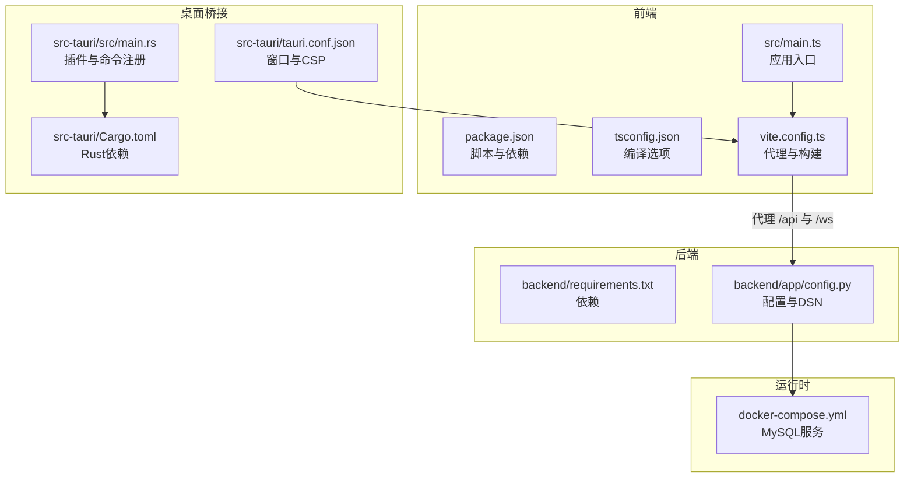
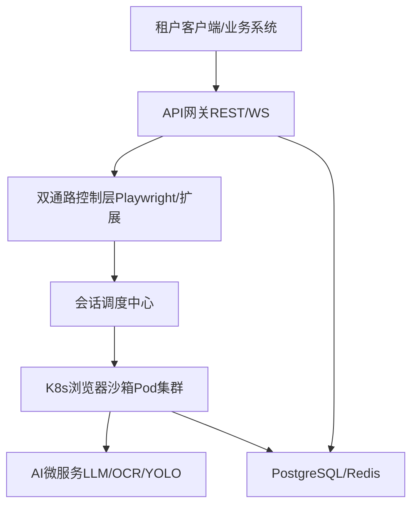
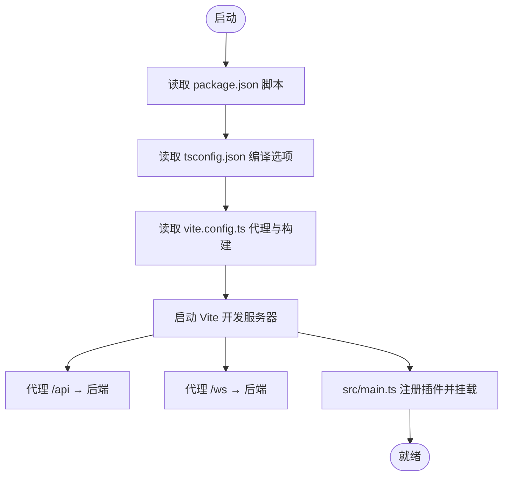
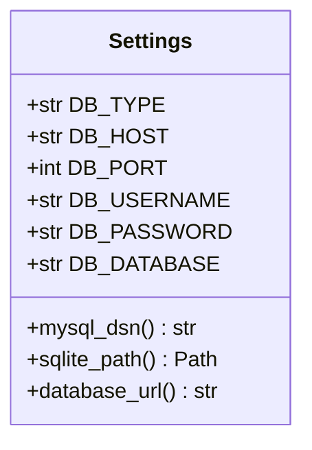
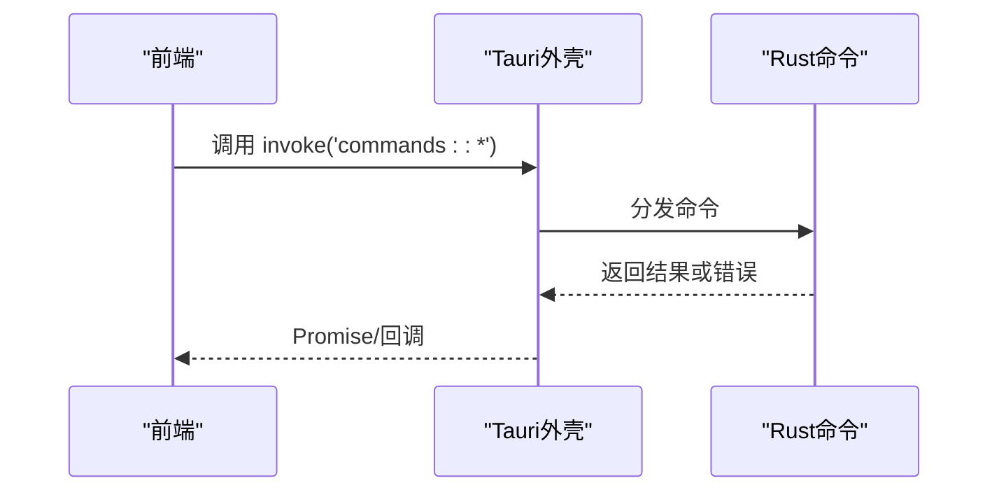
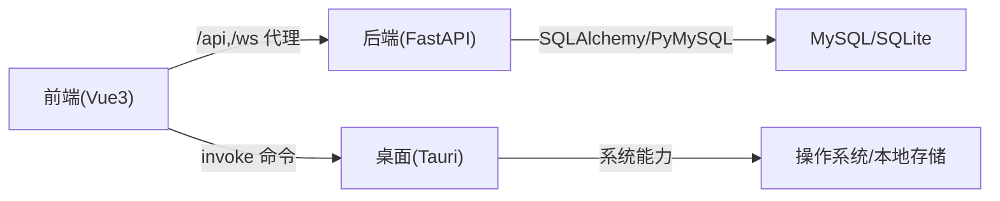

# 开发指南

<cite>
**本文引用的文件**
- [project.md](file://project.md)
- [docker-compose.yml](file://CCC-BrowserV4/docker-compose.yml)
- [backend/requirements.txt](file://CCC-BrowserV4/backend/requirements.txt)
- [backend/app/config.py](file://CCC-BrowserV4/backend/app/config.py)
- [frontend/package.json](file://CCC-BrowserV4/frontend/package.json)
- [frontend/tsconfig.json](file://CCC-BrowserV4/frontend/tsconfig.json)
- [frontend/vite.config.ts](file://CCC-BrowserV4/frontend/vite.config.ts)
- [frontend/src/main.ts](file://CCC-BrowserV4/frontend/src/main.ts)
- [src-tauri/Cargo.toml](file://CCC-BrowserV4/src-tauri/Cargo.toml)
- [src-tauri/tauri.conf.json](file://CCC-BrowserV4/src-tauri/tauri.conf.json)
- [src-tauri/src/main.rs](file://CCC-BrowserV4/src-tauri/src/main.rs)
</cite>

## 目录
1. [简介](#简介)
2. [项目结构](#项目结构)
3. [核心组件](#核心组件)
4. [架构总览](#架构总览)
5. [详细组件分析](#详细组件分析)
6. [依赖关系分析](#依赖关系分析)
7. [性能考虑](#性能考虑)
8. [故障排查指南](#故障排查指南)
9. [结论](#结论)
10. [附录](#附录)

## 简介
本开发指南面向“商用级 AI 浏览器系统”项目，提供从环境搭建、IDE 配置、调试工具、代码规范、测试策略、调试技巧、版本控制与分支管理、到贡献协作的全流程开发指导。项目采用前后端分离与桌面端集成的多模块架构，包含前端 Vue3 + TypeScript、后端 FastAPI + Uvicorn、Rust + Tauri 桌面桥接以及数据库与容器编排等组件。

## 项目结构
项目由三层核心模块构成：
- 前端模块（Vue3 + TypeScript + Vite）：负责管理后台与交互界面，通过代理将 /api 与 /ws 转发至后端服务。
- 后端模块（FastAPI + Uvicorn）：提供 REST/WS API、数据库连接与配置管理。
- 桌面桥接模块（Rust + Tauri）：提供系统级命令与本地存储能力，承载登录回调与设备标识等。

**图表来源**
- [frontend/package.json:1-29](file://CCC-BrowserV4/frontend/package.json#L1-L29)
- [frontend/tsconfig.json:1-27](file://CCC-BrowserV4/frontend/tsconfig.json#L1-L27)
- [frontend/vite.config.ts:1-35](file://CCC-BrowserV4/frontend/vite.config.ts#L1-L35)
- [frontend/src/main.ts:1-23](file://CCC-BrowserV4/frontend/src/main.ts#L1-L23)
- [backend/requirements.txt:1-13](file://CCC-BrowserV4/backend/requirements.txt#L1-L13)
- [backend/app/config.py:1-52](file://CCC-BrowserV4/backend/app/config.py#L1-L52)
- [src-tauri/Cargo.toml:1-22](file://CCC-BrowserV4/src-tauri/Cargo.toml#L1-L22)
- [src-tauri/tauri.conf.json:1-29](file://CCC-BrowserV4/src-tauri/tauri.conf.json#L1-L29)
- [src-tauri/src/main.rs:1-29](file://CCC-BrowserV4/src-tauri/src/main.rs#L1-L29)
- [docker-compose.yml:1-21](file://CCC-BrowserV4/docker-compose.yml#L1-L21)

**章节来源**
- [project.md:173-188](file://project.md#L173-L188)
- [project.md:716-733](file://project.md#L716-L733)

## 核心组件
- 前端工程
  - 使用 Vite + Vue3 + TypeScript，启用严格编译选项与别名路径，开发服务器默认端口 5173，并配置 /api 与 /ws 代理至后端。
  - 依赖管理通过 package.json 管理，包含 Vue、Element Plus、Axios、Pinia、路由等。
- 后端工程
  - 使用 FastAPI + Uvicorn，通过 Pydantic Settings 管理配置，支持 MySQL 与 SQLite 两种数据库类型，提供 DSN 构建与路径计算。
- 桌面桥接工程
  - 使用 Tauri 2 + Rust，注册 shell/store/opener 插件，提供设备 ID、登录回调等命令，CSP 限定连接域以提升安全。
- 数据库与容器
  - 通过 docker-compose 提供 MySQL 服务，默认端口映射与凭证，便于本地开发与测试。

**章节来源**
- [frontend/package.json:1-29](file://CCC-BrowserV4/frontend/package.json#L1-L29)
- [frontend/tsconfig.json:1-27](file://CCC-BrowserV4/frontend/tsconfig.json#L1-L27)
- [frontend/vite.config.ts:1-35](file://CCC-BrowserV4/frontend/vite.config.ts#L1-L35)
- [frontend/src/main.ts:1-23](file://CCC-BrowserV4/frontend/src/main.ts#L1-L23)
- [backend/requirements.txt:1-13](file://CCC-BrowserV4/backend/requirements.txt#L1-L13)
- [backend/app/config.py:1-52](file://CCC-BrowserV4/backend/app/config.py#L1-L52)
- [src-tauri/Cargo.toml:1-22](file://CCC-BrowserV4/src-tauri/Cargo.toml#L1-L22)
- [src-tauri/tauri.conf.json:1-29](file://CCC-BrowserV4/src-tauri/tauri.conf.json#L1-L29)
- [src-tauri/src/main.rs:1-29](file://CCC-BrowserV4/src-tauri/src/main.rs#L1-L29)
- [docker-compose.yml:1-21](file://CCC-BrowserV4/docker-compose.yml#L1-L21)

## 架构总览
系统采用“前端-后端-桌面桥接-数据库/容器”的分层架构，统一接口契约与部署形态，满足商用级隔离、自动化与 AI 驱动能力要求。

**图表来源**
- [project.md:445-503](file://project.md#L445-L503)
- [project.md:173-188](file://project.md#L173-L188)

## 详细组件分析

### 前端工程（Vue3 + TypeScript + Vite）
- 依赖与脚本
  - 包含 Vue3、路由、状态管理、UI 组件库、HTTP 客户端与 Tauri API。
  - 开发脚本通过 Vite 启动，构建产物用于 Tauri 打包。
- 编译与路径
  - 严格编译选项与未使用变量/参数检查，启用 JSX 保留与 DOM/DOM.Iterable 库。
  - 路径别名 @ 指向 src，便于模块导入。
- 开发服务器与代理
  - 默认端口 5173，开启严格端口与代理，将 /api 与 /ws 转发至后端服务地址。
- 应用入口
  - 注册 Pinia、路由、Element Plus 与图标，挂载应用根组件。

**图表来源**
- [frontend/package.json:1-29](file://CCC-BrowserV4/frontend/package.json#L1-L29)
- [frontend/tsconfig.json:1-27](file://CCC-BrowserV4/frontend/tsconfig.json#L1-L27)
- [frontend/vite.config.ts:1-35](file://CCC-BrowserV4/frontend/vite.config.ts#L1-L35)
- [frontend/src/main.ts:1-23](file://CCC-BrowserV4/frontend/src/main.ts#L1-L23)

**章节来源**
- [frontend/package.json:1-29](file://CCC-BrowserV4/frontend/package.json#L1-L29)
- [frontend/tsconfig.json:1-27](file://CCC-BrowserV4/frontend/tsconfig.json#L1-L27)
- [frontend/vite.config.ts:1-35](file://CCC-BrowserV4/frontend/vite.config.ts#L1-L35)
- [frontend/src/main.ts:1-23](file://CCC-BrowserV4/frontend/src/main.ts#L1-L23)

### 后端工程（FastAPI + Uvicorn + SQLAlchemy）
- 依赖
  - FastAPI、Uvicorn、SQLAlchemy、PyMySQL、Cryptography、Pydantic Settings、python-dotenv。
- 配置管理
  - 通过 Settings 读取 .env 与环境变量，支持大小写不敏感与 UTF-8 编码。
  - 支持 MySQL 与 SQLite 两种数据库类型，提供 DSN 构建与 SQLite 路径计算。
- 数据库连接
  - 根据 DB_TYPE 动态选择连接 URL，便于本地与生产环境切换。

**图表来源**
- [backend/app/config.py:1-52](file://CCC-BrowserV4/backend/app/config.py#L1-L52)

**章节来源**
- [backend/requirements.txt:1-13](file://CCC-BrowserV4/backend/requirements.txt#L1-L13)
- [backend/app/config.py:1-52](file://CCC-BrowserV4/backend/app/config.py#L1-L52)

### 桌面桥接工程（Tauri 2 + Rust）
- 依赖与插件
  - Tauri、shell、store、opener 插件，JSON 序列化与日志。
- 命令注册
  - 注册设备 ID、客户端 ID、令牌生成、登录浏览器打开与登录回调服务等命令。
- 安全与窗口
  - CSP 限制 connect-src，窗口尺寸与最小尺寸设定，开发/构建命令与前端目录关联。

**图表来源**
- [src-tauri/src/main.rs:1-29](file://CCC-BrowserV4/src-tauri/src/main.rs#L1-L29)
- [src-tauri/tauri.conf.json:1-29](file://CCC-BrowserV4/src-tauri/tauri.conf.json#L1-L29)

**章节来源**
- [src-tauri/Cargo.toml:1-22](file://CCC-BrowserV4/src-tauri/Cargo.toml#L1-L22)
- [src-tauri/src/main.rs:1-29](file://CCC-BrowserV4/src-tauri/src/main.rs#L1-L29)
- [src-tauri/tauri.conf.json:1-29](file://CCC-BrowserV4/src-tauri/tauri.conf.json#L1-L29)

### 数据库与容器（MySQL）
- docker-compose 提供 MySQL 8.4 服务，设置 root 密码、数据库、用户与卷，字符集与排序规则配置。
- 适用于本地开发与测试，便于快速拉起后端依赖。

**章节来源**
- [docker-compose.yml:1-21](file://CCC-BrowserV4/docker-compose.yml#L1-L21)

## 依赖关系分析
- 前端依赖后端提供的 REST/WS 接口，通过 Vite 代理实现跨域与本地联调。
- 桌面桥接通过 Tauri 与前端通信，提供系统级能力与本地存储。
- 后端依赖数据库服务，支持 MySQL 与 SQLite，便于开发与生产切换。

**图表来源**
- [frontend/vite.config.ts:1-35](file://CCC-BrowserV4/frontend/vite.config.ts#L1-L35)
- [backend/requirements.txt:1-13](file://CCC-BrowserV4/backend/requirements.txt#L1-L13)
- [src-tauri/Cargo.toml:1-22](file://CCC-BrowserV4/src-tauri/Cargo.toml#L1-L22)

**章节来源**
- [frontend/vite.config.ts:1-35](file://CCC-BrowserV4/frontend/vite.config.ts#L1-L35)
- [backend/requirements.txt:1-13](file://CCC-BrowserV4/backend/requirements.txt#L1-L13)
- [src-tauri/Cargo.toml:1-22](file://CCC-BrowserV4/src-tauri/Cargo.toml#L1-L22)

## 性能考虑
- 前端构建与调试
  - 生产构建目标包含 es2021 与 chrome/safari 版本，启用压缩；调试模式可关闭压缩并生成 SourceMap。
- 后端性能
  - 使用 Uvicorn 标准变体，结合 SQLAlchemy 连接池与 PyMySQL，合理设置连接参数与超时。
- 桌面桥接
  - 使用 tokio 全栈运行时，避免阻塞主线程；日志使用 env_logger，便于定位性能瓶颈。

**章节来源**
- [frontend/vite.config.ts:29-33](file://CCC-BrowserV4/frontend/vite.config.ts#L29-L33)
- [backend/requirements.txt:1-13](file://CCC-BrowserV4/backend/requirements.txt#L1-L13)
- [src-tauri/Cargo.toml:20-22](file://CCC-BrowserV4/src-tauri/Cargo.toml#L20-L22)

## 故障排查指南
- 前端联调问题
  - 确认 Vite 代理配置是否正确指向后端地址；检查 /api 与 /ws 代理规则。
  - 若出现跨域或 404，检查后端服务是否启动且端口开放。
- 后端连接问题
  - 检查 .env 或环境变量中的数据库配置；确认 DB_TYPE 与连接 URL 是否匹配。
  - 如使用 MySQL，确保 docker-compose 中的服务已启动且端口映射正确。
- 桌面桥接问题
  - 确认 Tauri 命令注册是否完整；检查 CSP 是否允许连接目标域。
  - 查看日志输出，定位命令执行异常或插件初始化失败。
- 性能与内存
  - 前端构建时启用 SourceMap 便于分析；后端关注连接池与慢查询；桌面端关注 tokio 任务调度与日志级别。

**章节来源**
- [frontend/vite.config.ts:13-27](file://CCC-BrowserV4/frontend/vite.config.ts#L13-L27)
- [backend/app/config.py:18-47](file://CCC-BrowserV4/backend/app/config.py#L18-L47)
- [docker-compose.yml:1-21](file://CCC-BrowserV4/docker-compose.yml#L1-L21)
- [src-tauri/tauri.conf.json:24-26](file://CCC-BrowserV4/src-tauri/tauri.conf.json#L24-L26)
- [src-tauri/src/main.rs:19-26](file://CCC-BrowserV4/src-tauri/src/main.rs#L19-L26)

## 结论
本指南提供了从环境搭建到调试排查的完整开发路径，结合项目统一的接口契约与部署形态，确保三套团队在独立开发的同时保持一致性。建议在开发过程中遵循统一的命名、注释与错误处理规范，配合完善的测试与版本控制流程，保障系统的可维护性与可扩展性。

## 附录

### 开发环境搭建与 IDE 配置
- 前端
  - 使用 VS Code 或 WebStorm，启用 TypeScript 严格模式与 ESLint/Prettier 插件。
  - 在项目根目录安装依赖后启动开发服务器，确保代理端口与后端一致。
- 后端
  - 使用虚拟环境与 pip 安装 requirements.txt 中的依赖。
  - 配置 .env 文件，设置数据库连接参数与密钥。
- 桌面桥接
  - 安装 Rust 工具链与 Tauri CLI，使用 Cargo 运行与构建。
- 数据库
  - 通过 docker-compose 启动 MySQL，确保端口未被占用。

**章节来源**
- [frontend/package.json:1-29](file://CCC-BrowserV4/frontend/package.json#L1-L29)
- [backend/requirements.txt:1-13](file://CCC-BrowserV4/backend/requirements.txt#L1-L13)
- [src-tauri/Cargo.toml:1-22](file://CCC-BrowserV4/src-tauri/Cargo.toml#L1-L22)
- [docker-compose.yml:1-21](file://CCC-BrowserV4/docker-compose.yml#L1-L21)

### 代码规范与最佳实践
- 命名约定
  - 变量与函数使用清晰语义命名，避免缩写；类名使用帕斯卡命名法。
- 注释标准
  - 关键函数与复杂逻辑添加注释说明输入、输出与边界条件。
- 错误处理与异常管理
  - 后端使用统一的异常捕获与错误码返回；前端对网络请求与命令调用进行错误提示与重试策略。
- 日志
  - 后端使用结构化日志，桌面端使用 env_logger，便于集中化收集与分析。

**章节来源**
- [backend/app/config.py:1-52](file://CCC-BrowserV4/backend/app/config.py#L1-L52)
- [src-tauri/src/main.rs:19-26](file://CCC-BrowserV4/src-tauri/src/main.rs#L19-L26)

### 测试策略与实施方法
- 单元测试
  - 前端：针对工具函数与组件逻辑编写单元测试，使用 Vitest 或 Jest。
  - 后端：针对 API 与服务层编写单元测试，覆盖正常与异常路径。
- 集成测试
  - 使用 docker-compose 启动后端与数据库，编写端到端测试脚本验证接口契约。
- 端到端测试
  - 结合浏览器自动化与扩展交互，验证会话创建、脚本执行与 AI 指令流程。

**章节来源**
- [project.md:445-503](file://project.md#L445-L503)

### 调试技巧与问题排查
- 日志分析
  - 后端与桌面端均输出结构化日志，结合 ELK 或本地日志聚合工具进行检索。
- 性能分析
  - 前端构建时启用 SourceMap，后端关注慢查询与连接池；桌面端使用 tokio 调度分析。
- 内存泄漏检测
  - 定期巡检会话生命周期与资源回收逻辑，必要时引入内存分析工具。

**章节来源**
- [frontend/vite.config.ts:30-33](file://CCC-BrowserV4/frontend/vite.config.ts#L30-L33)
- [backend/requirements.txt:1-13](file://CCC-BrowserV4/backend/requirements.txt#L1-L13)
- [src-tauri/Cargo.toml:20-22](file://CCC-BrowserV4/src-tauri/Cargo.toml#L20-L22)

### 版本控制与分支管理
- Git 工作流
  - 主分支保护，功能开发在特性分支进行；通过 Pull Request 进行代码审查。
- 代码审查
  - 要求至少一名审阅者批准，关注安全性、性能与一致性。
- 发布管理
  - 使用语义化版本号，发布前执行全链路测试与安全扫描。

**章节来源**
- [project.md:767-782](file://project.md#L767-L782)

### 贡献指南与协作规范
- 参与开发
  - 遵循统一接口契约与数据层设计，确保三套实现一致。
- 提交代码
  - 提交信息清晰描述变更内容与影响范围；附带必要的测试与文档更新。
- 报告问题
  - 使用统一的问题模板，包含复现步骤、期望行为与实际行为。

**章节来源**
- [project.md:445-503](file://project.md#L445-L503)
- [project.md:560-587](file://project.md#L560-L587)