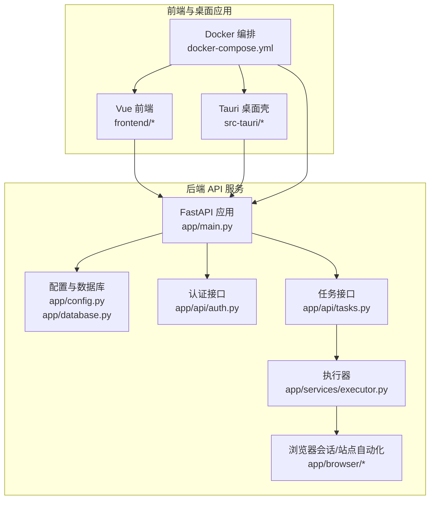
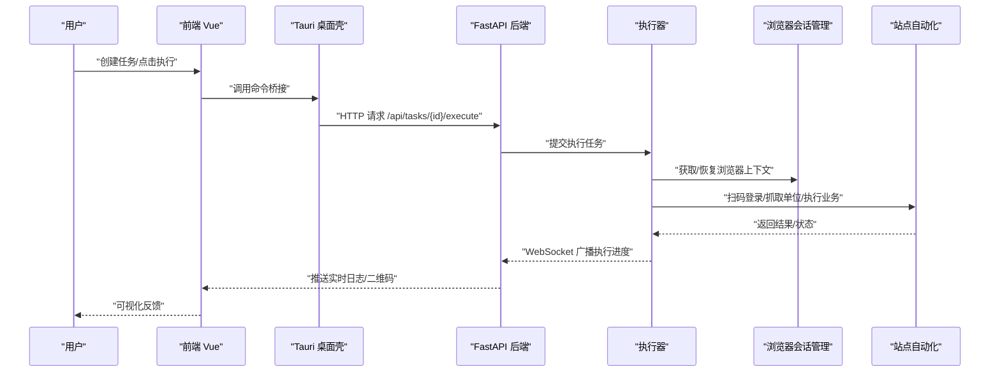
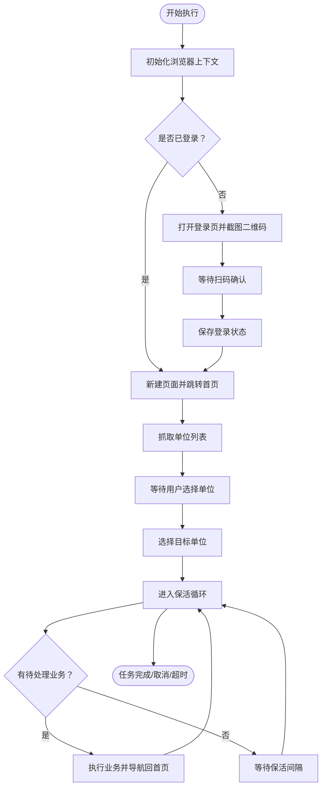
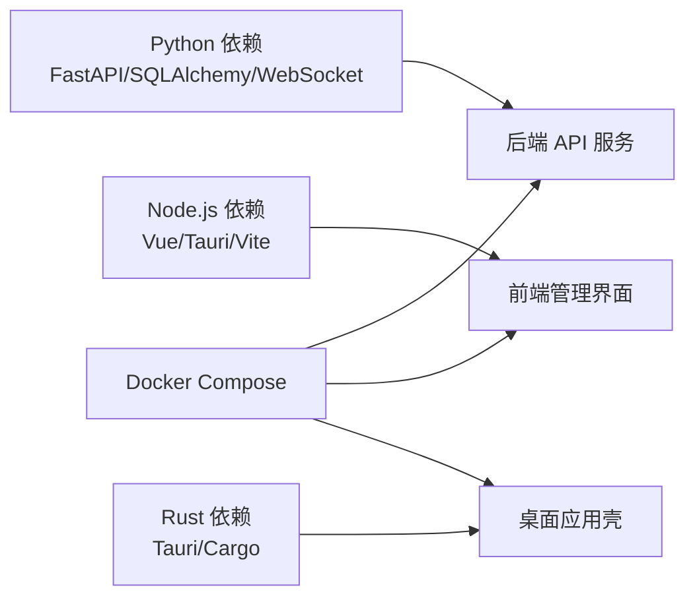

# 快速开始

<cite>
**本文引用的文件**
- [app/main.py](file://CCC_RPA_API/app/main.py)
- [app/config.py](file://CCC_RPA_API/app/config.py)
- [app/database.py](file://CCC_RPA_API/app/database.py)
- [app/api/tasks.py](file://CCC_RPA_API/app/api/tasks.py)
- [app/api/auth.py](file://CCC_RPA_API/app/api/auth.py)
- [app/models/task.py](file://CCC_RPA_API/app/models/task.py)
- [app/services/executor.py](file://CCC_RPA_API/app/services/executor.py)
- [src-tauri/tauri.conf.json](file://CCC-BrowserV4/src-tauri/tauri.conf.json)
- [src-tauri/Cargo.toml](file://CCC-BrowserV4/src-tauri/Cargo.toml)
- [frontend/package.json](file://CCC-BrowserV4/frontend/package.json)
- [frontend/vite.config.ts](file://CCC-BrowserV4/frontend/vite.config.ts)
- [docker-compose.yml](file://CCC-BrowserV4/docker-compose.yml)
</cite>

## 目录
1. [简介](#简介)
2. [项目结构](#项目结构)
3. [核心组件](#核心组件)
4. [架构总览](#架构总览)
5. [详细组件分析](#详细组件分析)
6. [依赖分析](#依赖分析)
7. [性能考虑](#性能考虑)
8. [故障排查指南](#故障排查指南)
9. [结论](#结论)
10. [附录](#附录)

## 简介
本指南面向商用级 AI 浏览器系统（含 RPA 能力）的快速落地，覆盖环境准备、依赖安装、后端 API、前端管理界面与桌面应用的本地部署流程，并提供首次沙箱会话、自动化脚本执行与智能驱动功能的基本使用示例，以及常见安装问题的解决方案与验证步骤。

## 项目结构
该仓库包含两个主要子项目：
- 后端 API 服务：基于 Python/FastAPI 的 RPA 核心服务，负责任务编排、浏览器会话管理、WebSocket 推送与数据库交互。
- 前端与桌面应用：Vue 3 + Tauri 架构的管理界面与桌面客户端，用于任务管理、日志查看与交互式控制。

图表来源
- [app/main.py:1-115](file://CCC_RPA_API/app/main.py#L1-L115)
- [app/config.py:1-22](file://CCC_RPA_API/app/config.py#L1-L22)
- [app/database.py:1-19](file://CCC_RPA_API/app/database.py#L1-L19)
- [app/api/tasks.py:1-76](file://CCC_RPA_API/app/api/tasks.py#L1-L76)
- [app/api/auth.py:1-24](file://CCC_RPA_API/app/api/auth.py#L1-L24)
- [app/services/executor.py:1-308](file://CCC_RPA_API/app/services/executor.py#L1-L308)
- [src-tauri/tauri.conf.json](file://CCC-BrowserV4/src-tauri/tauri.conf.json)
- [frontend/vite.config.ts](file://CCC-BrowserV4/frontend/vite.config.ts)
- [docker-compose.yml](file://CCC-BrowserV4/docker-compose.yml)

章节来源
- [app/main.py:1-115](file://CCC_RPA_API/app/main.py#L1-L115)
- [docker-compose.yml](file://CCC-BrowserV4/docker-compose.yml)

## 核心组件
- 后端服务入口与生命周期：应用启动时创建数据库表、注入迁移字段、插入初始任务数据；关闭时清理浏览器会话；提供健康检查与 WebSocket。
- 认证与任务 API：提供登录、登出、校验与任务的增删改查、执行、日志查询等接口。
- 执行器与浏览器自动化：通过线程池与 Playwright 在隔离线程中执行站点自动化，支持扫码登录、单位选择、业务保活与取消。
- 前端与桌面壳：Vue 前端通过 WebSocket 实时接收执行进度与二维码；Tauri 提供桌面应用外壳，桥接原生能力。

章节来源
- [app/main.py:28-104](file://CCC_RPA_API/app/main.py#L28-L104)
- [app/api/auth.py:10-23](file://CCC_RPA_API/app/api/auth.py#L10-L23)
- [app/api/tasks.py:13-75](file://CCC_RPA_API/app/api/tasks.py#L13-L75)
- [app/services/executor.py:68-307](file://CCC_RPA_API/app/services/executor.py#L68-L307)

## 架构总览
下图展示了从浏览器桌面应用到后端 API 的典型调用链路，以及执行器与浏览器会话管理的协作关系。

图表来源
- [app/api/tasks.py:47-52](file://CCC_RPA_API/app/api/tasks.py#L47-L52)
- [app/services/executor.py:306-307](file://CCC_RPA_API/app/services/executor.py#L306-L307)
- [app/main.py:102-115](file://CCC_RPA_API/app/main.py#L102-L115)

## 详细组件分析

### 后端服务入口与数据库
- 应用启动时：
  - 创建数据库表与迁移字段（如 predecessor_id、sub_tasks、province 等）。
  - 初始化 mock 任务数据，便于首次体验。
  - 捕获主事件循环以支持工作线程中的 WebSocket 广播。
- 关闭时：
  - 清理所有浏览器会话，确保资源释放。
- 健康检查与 WebSocket：
  - 提供 /health 接口与 /ws 端点，用于外部监控与实时推送。

章节来源
- [app/main.py:28-104](file://CCC_RPA_API/app/main.py#L28-L104)

### 数据库配置与连接
- 使用 SQLAlchemy 建立连接池，启用预 ping 与回收策略。
- 通过设置对象读取 .env 中的数据库凭据，拼装连接字符串。

章节来源
- [app/config.py:6-22](file://CCC_RPA_API/app/config.py#L6-L22)
- [app/database.py:1-19](file://CCC_RPA_API/app/database.py#L1-L19)

### 认证与任务 API
- 认证模块：
  - 登录、登出、校验接口，配合后端服务的会话与权限逻辑。
- 任务模块：
  - 支持分页查询、创建、更新、删除、执行、日志查询。
  - 提供扫码完成与单位选择的交互信号，以及取消执行的能力。

章节来源
- [app/api/auth.py:10-23](file://CCC_RPA_API/app/api/auth.py#L10-L23)
- [app/api/tasks.py:13-75](file://CCC_RPA_API/app/api/tasks.py#L13-L75)

### 执行器与浏览器自动化
- 执行器职责：
  - 线程池调度任务逻辑，避免阻塞主线程。
  - 通过浏览器会话管理器获取上下文，执行扫码登录、抓取单位列表、选择单位、保活循环与业务执行。
  - 通过 WebSocket 广播执行进度、错误与二维码等事件。
- 关键流程：
  - 初始化浏览器 → 检查登录 → 扫码登录（若未登录）→ 获取单位列表 → 等待用户选择 → 选择单位 → 保活循环（检测业务并执行）→ 更新任务状态与日志。

图表来源
- [app/services/executor.py:68-307](file://CCC_RPA_API/app/services/executor.py#L68-L307)

章节来源
- [app/services/executor.py:17-33](file://CCC_RPA_API/app/services/executor.py#L17-L33)
- [app/services/executor.py:68-307](file://CCC_RPA_API/app/services/executor.py#L68-L307)

### 前端与桌面应用
- 前端（Vue 3 + Vite）：
  - 通过 API 模块发起认证与任务请求，通过 WebSocket 接收执行事件。
  - 提供布局组件、页面与状态管理，支持任务编辑与执行面板。
- 桌面壳（Tauri）：
  - 提供跨平台桌面应用外壳，承载前端界面与原生能力桥接。
  - 通过配置文件定义窗口、菜单、权限与命令桥接。

章节来源
- [frontend/package.json](file://CCC-BrowserV4/frontend/package.json)
- [frontend/vite.config.ts](file://CCC-BrowserV4/frontend/vite.config.ts)
- [src-tauri/tauri.conf.json](file://CCC-BrowserV4/src-tauri/tauri.conf.json)

## 依赖分析
- 后端依赖（Python）：
  - FastAPI、SQLAlchemy、PyMySQL、WebSockets、线程池与异步事件循环。
- 前端依赖（Node.js）：
  - Vue 3、TypeScript、Vite、UI 组件库与 WebSocket 客户端。
- 桌面壳（Rust）：
  - Tauri、Cargo 生态、命令桥接与权限配置。
- 运行与编排：
  - Docker Compose 可用于统一编排后端、数据库与前端静态资源。

图表来源
- [app/main.py:1-115](file://CCC_RPA_API/app/main.py#L1-L115)
- [frontend/package.json](file://CCC-BrowserV4/frontend/package.json)
- [src-tauri/Cargo.toml](file://CCC-BrowserV4/src-tauri/Cargo.toml)
- [docker-compose.yml](file://CCC-BrowserV4/docker-compose.yml)

章节来源
- [app/main.py:1-115](file://CCC_RPA_API/app/main.py#L1-L115)
- [frontend/package.json](file://CCC-BrowserV4/frontend/package.json)
- [src-tauri/Cargo.toml](file://CCC-BrowserV4/src-tauri/Cargo.toml)
- [docker-compose.yml](file://CCC-BrowserV4/docker-compose.yml)

## 性能考虑
- 线程池与事件循环分离：执行器使用线程池避免阻塞主事件循环，同时通过捕获的事件循环安全广播 WebSocket 消息。
- 数据库连接池：启用 pre_ping 与回收策略，降低连接失效带来的重试成本。
- 保活循环：分段等待与可取消信号，减少长时间阻塞，提升交互响应速度。
- 前端渲染：按需加载与组件拆分，结合 WebSocket 实时推送，降低轮询开销。

章节来源
- [app/services/executor.py:17-33](file://CCC_RPA_API/app/services/executor.py#L17-L33)
- [app/database.py:5-6](file://CCC_RPA_API/app/database.py#L5-L6)

## 故障排查指南
- 后端服务启动失败
  - 检查数据库连接参数与可达性，确认 .env 文件配置正确。
  - 查看启动日志中迁移与表创建是否成功。
- 浏览器会话异常
  - 执行器会在检测到浏览器关闭时尝试恢复会话并重新打开页面；若持续失败，请重启后端服务或检查浏览器依赖。
- 扫码登录超时
  - 确认前端 WebSocket 正常连接，二维码事件是否推送；适当延长等待时间或重新触发执行。
- 前端无法连接后端
  - 检查 CORS 配置与端口映射；确认前端代理或反向代理未拦截 /ws。
- 桌面应用无法运行
  - 确认 Tauri 依赖与构建工具链完整；检查权限配置与命令桥接声明。

章节来源
- [app/main.py:14-21](file://CCC_RPA_API/app/main.py#L14-L21)
- [app/services/executor.py:42-59](file://CCC_RPA_API/app/services/executor.py#L42-L59)
- [src-tauri/tauri.conf.json](file://CCC-BrowserV4/src-tauri/tauri.conf.json)

## 结论
本指南提供了从环境准备到系统启动的全流程实践，涵盖后端 API、前端管理界面与桌面应用的本地部署要点，并给出首次使用的操作建议与常见问题定位方法。建议在生产环境中进一步完善容器化、监控与告警体系，以满足商用级稳定性与可观测性需求。

## 附录

### 环境准备清单
- Python 3.9+
- Node.js（用于前端构建与开发）
- Rust 工具链（用于 Tauri 桌面壳构建）
- MySQL（或兼容的数据库）
- Docker（可选，用于一键编排）

章节来源
- [app/config.py:7-15](file://CCC_RPA_API/app/config.py#L7-L15)
- [src-tauri/Cargo.toml](file://CCC-BrowserV4/src-tauri/Cargo.toml)

### 安装与启动步骤
- 准备后端
  - 安装 Python 依赖：pip install -r requirements.txt
  - 配置数据库连接与 .env
  - 启动后端服务：uvicorn app.main:app --host 0.0.0.0 --port 8000
- 准备前端
  - 安装 Node.js 依赖：npm install
  - 启动开发服务器：npm run dev
- 准备桌面应用
  - 安装 Rust 工具链与 Tauri 依赖
  - 构建桌面应用：cargo tauri build
- 使用 Docker（可选）
  - 通过 docker-compose up 启动后端、数据库与前端静态资源

章节来源
- [app/main.py:12-21](file://CCC_RPA_API/app/main.py#L12-L21)
- [frontend/package.json](file://CCC-BrowserV4/frontend/package.json)
- [docker-compose.yml](file://CCC-BrowserV4/docker-compose.yml)

### 基本使用示例
- 创建第一个沙箱会话
  - 在前端创建任务，填写省份与备注信息，保存后进入待执行状态。
- 执行自动化脚本
  - 触发任务执行，等待后端推送二维码；在前端扫码确认登录。
  - 选择目标单位后，系统自动进入保活循环并执行待处理业务。
- 使用 AI 智能驱动功能
  - 在站点自动化层扩展识别与交互逻辑（例如 OCR/视觉识别），通过执行器回调实现智能决策与动作执行。

章节来源
- [app/api/tasks.py:18-20](file://CCC_RPA_API/app/api/tasks.py#L18-L20)
- [app/services/executor.py:104-141](file://CCC_RPA_API/app/services/executor.py#L104-L141)

### 验证步骤
- 后端健康检查：访问 /health，确认返回状态正常。
- WebSocket 连接：建立 /ws 连接，观察执行进度与二维码事件推送。
- 任务执行：创建任务并执行，核对任务状态与日志记录。

章节来源
- [app/main.py:102-104](file://CCC_RPA_API/app/main.py#L102-L104)
- [app/main.py:107-115](file://CCC_RPA_API/app/main.py#L107-L115)