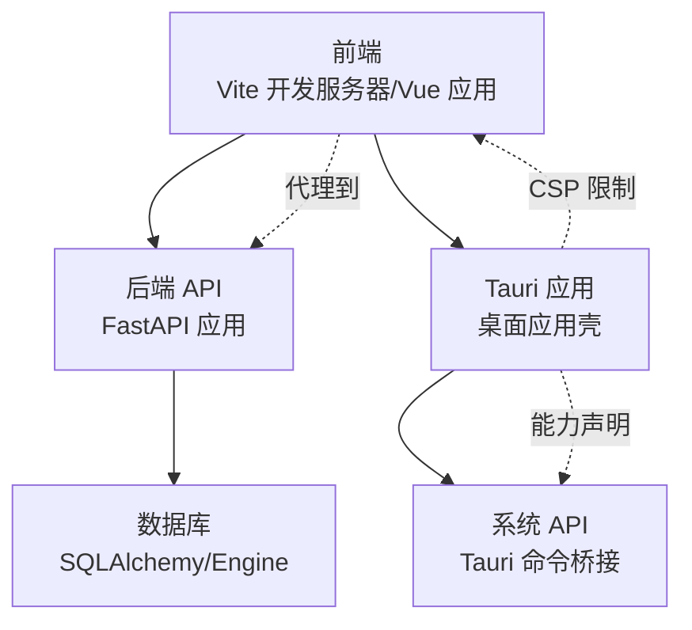
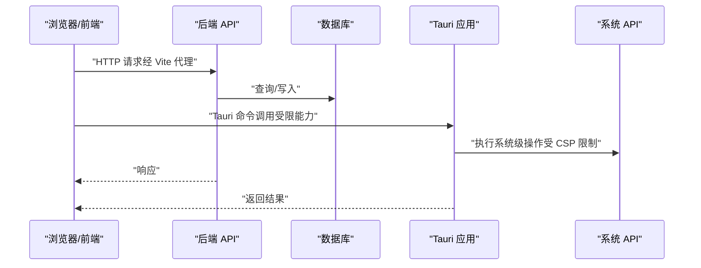
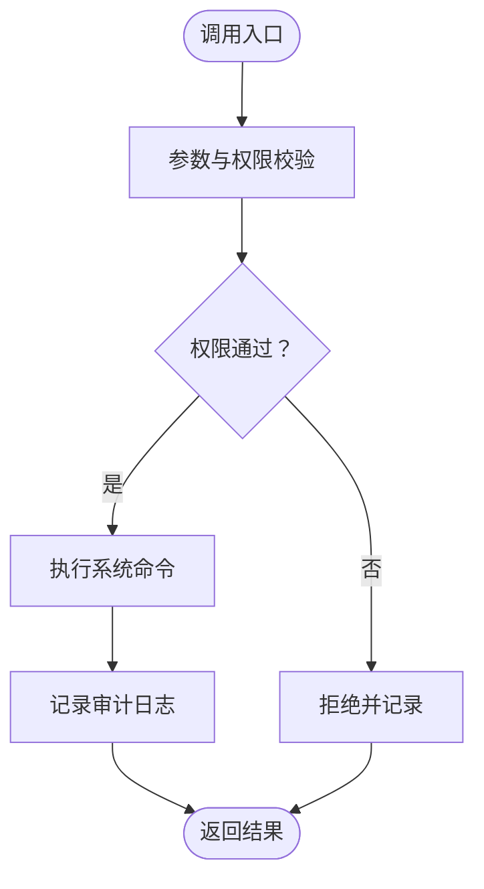
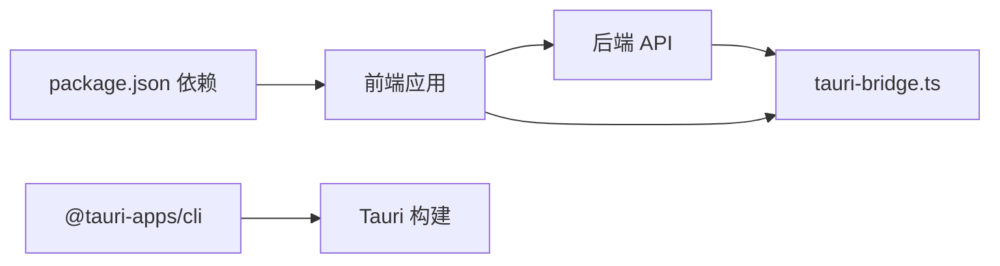

# 安全问题处理

<cite>
**本文档引用的文件**
- [tauri.conf.json](file://CCC-BrowserV4/src-tauri/tauri.conf.json)
- [default.json](file://CCC-BrowserV4/src-tauri/capabilities/default.json)
- [tauri-bridge.ts](file://CCC-BrowserV4/frontend/src/utils/tauri-bridge.ts)
- [package.json](file://CCC-BrowserV4/frontend/package.json)
- [vite.config.ts](file://CCC-BrowserV4/frontend/vite.config.ts)
- [config.py](file://CCC-BrowserV4/backend/app/config.py)
- [main.py](file://CCC_RPA_API/app/main.py)
- [auth.py](file://CCC_RPA_API/app/api/auth.py)
</cite>

## 目录
1. [简介](#简介)
2. [项目结构](#项目结构)
3. [核心组件](#核心组件)
4. [架构总览](#架构总览)
5. [详细组件分析](#详细组件分析)
6. [依赖分析](#依赖分析)
7. [性能考虑](#性能考虑)
8. [故障排除指南](#故障排除指南)
9. [结论](#结论)
10. [附录](#附录)

## 简介
本文件面向安全运维与开发团队，聚焦于以下安全主题：证书与传输安全配置、权限控制与访问控制、数据加密与隐私保护、浏览器沙箱与内容安全策略（CSP）、Tauri 应用安全配置（权限声明与能力），以及安全审计与漏洞扫描实践。文档基于仓库中现有配置与实现进行分析，并提供可操作的诊断与修复建议。

## 项目结构
本项目由前端（Vue + Vite）、后端（FastAPI）与桌面应用层（Tauri）组成。安全相关的关键位置包括：
- 前端开发服务器代理与运行时环境变量前缀
- 后端 CORS 配置与健康检查接口
- Tauri 应用的内容安全策略（CSP）与默认能力声明
- Tauri 桥接命令调用（系统 API 访问）

图表来源
- [vite.config.ts:13-27](file://CCC-BrowserV4/frontend/vite.config.ts#L13-L27)
- [main.py:14-21](file://CCC_RPA_API/app/main.py#L14-L21)
- [tauri.conf.json:24-26](file://CCC-BrowserV4/src-tauri/tauri.conf.json#L24-L26)
- [default.json:6-11](file://CCC-BrowserV4/src-tauri/capabilities/default.json#L6-L11)

章节来源
- [vite.config.ts:1-35](file://CCC-BrowserV4/frontend/vite.config.ts#L1-L35)
- [main.py:12-127](file://CCC_RPA_API/app/main.py#L12-L127)
- [tauri.conf.json:1-29](file://CCC-BrowserV4/src-tauri/tauri.conf.json#L1-L29)
- [default.json:1-13](file://CCC-BrowserV4/src-tauri/capabilities/default.json#L1-L13)

## 核心组件
- 内容安全策略（CSP）：在 Tauri 配置中定义了默认源、脚本源、样式源与连接源，限制了资源加载与跨域连接范围。
- 跨域资源共享（CORS）：后端对所有来源开放，便于开发调试，但生产环境应收紧。
- Tauri 权限与能力：默认能力仅包含有限系统权限，需按需扩展并最小化授权。
- 前端代理与环境变量：开发服务器通过代理转发 API 请求，环境变量前缀用于隔离敏感配置。
- 数据库配置：支持 MySQL 与 SQLite，连接参数来自配置类，需确保凭据安全存放。

章节来源
- [tauri.conf.json:24-26](file://CCC-BrowserV4/src-tauri/tauri.conf.json#L24-L26)
- [main.py:14-21](file://CCC_RPA_API/app/main.py#L14-L21)
- [default.json:6-11](file://CCC-BrowserV4/src-tauri/capabilities/default.json#L6-L11)
- [vite.config.ts:16-26](file://CCC-BrowserV4/frontend/vite.config.ts#L16-L26)
- [config.py:18-47](file://CCC-BrowserV4/backend/app/config.py#L18-L47)

## 架构总览
下图展示前端、后端与 Tauri 的交互关系及安全边界：

图表来源
- [vite.config.ts:16-26](file://CCC-BrowserV4/frontend/vite.config.ts#L16-L26)
- [main.py:23-27](file://CCC_RPA_API/app/main.py#L23-L27)
- [tauri-bridge.ts:6-32](file://CCC-BrowserV4/frontend/src/utils/tauri-bridge.ts#L6-L32)
- [tauri.conf.json:24-26](file://CCC-BrowserV4/src-tauri/tauri.conf.json#L24-L26)

## 详细组件分析

### 证书与传输安全配置
- 当前状态
  - 前端开发服务器使用 HTTP（端口 5173），未启用 HTTPS。
  - 后端 API 使用 HTTP（代理目标为 http://localhost:8000）。
  - Tauri CSP 中允许连接到本地回环地址与特定域名，但未强制 HTTPS。
- 诊断要点
  - 生产部署必须启用 HTTPS，避免中间人攻击与降级攻击。
  - TLS 证书链需完整，根/中间证书与站点证书正确拼接。
  - 强制 HSTS（严格传输安全）与现代密码套件。
- 修复建议
  - 在反向代理或 Web 服务器上安装并配置 SSL 证书。
  - 将前端与后端统一迁移到 HTTPS，更新 CSP 的 connect-src 与 script-src。
  - 对外域名访问需通过可信 CA 签发证书，并验证域名所有权。
  - 证书过期前自动续期，监控证书到期时间。

章节来源
- [vite.config.ts:13-15](file://CCC-BrowserV4/frontend/vite.config.ts#L13-L15)
- [main.py:114-116](file://CCC_RPA_API/app/main.py#L114-L116)
- [tauri.conf.json:24-26](file://CCC-BrowserV4/src-tauri/tauri.conf.json#L24-L26)

### 权限控制与访问控制
- 当前状态
  - 后端 CORS 对所有来源开放，便于前端联调，但生产需收紧。
  - Tauri 默认能力仅包含有限权限（如 shell:allow-open、opener:default 等）。
  - 前端未显式实现细粒度 RBAC；认证路由位于后端 API。
- 诊断要点
  - CORS 白名单应仅包含受信前端域名，禁止通配符。
  - Tauri 能力声明需遵循“最小权限原则”，仅授予必要系统功能。
  - 认证与授权逻辑需完善，结合用户角色与资源权限进行校验。
- 修复建议
  - 后端：将 CORS 配置为明确的受信来源列表，设置合理的允许方法与头。
  - Tauri：按窗口与功能拆分能力集，移除不必要的权限；为敏感命令增加权限校验。
  - 前端：引入鉴权守卫与路由拦截，结合后端认证接口完成会话管理与权限渲染。

章节来源
- [main.py:14-21](file://CCC_RPA_API/app/main.py#L14-L21)
- [default.json:6-11](file://CCC-BrowserV4/src-tauri/capabilities/default.json#L6-L11)
- [auth.py:7-24](file://CCC_RPA_API/app/api/auth.py#L7-L24)

### 数据加密与隐私保护
- 当前状态
  - 数据库连接参数来自配置类，支持 MySQL 与 SQLite。
  - 未发现显式的传输加密（TLS）与存储加密（字段级加密）配置。
- 诊断要点
  - 敏感数据（如数据库凭据、令牌、日志）需加密存储与传输。
  - 传输通道应使用 TLS，存储侧可考虑字段级加密或数据库透明加密。
- 修复建议
  - 传输加密：强制后端与数据库之间启用 TLS；前端与后端间使用 HTTPS。
  - 存储加密：对敏感字段（如密码哈希、令牌）采用强加密算法；数据库连接使用加密通道。
  - 密钥管理：使用密钥管理系统（KMS）或硬件安全模块（HSM）管理密钥轮换。

章节来源
- [config.py:18-47](file://CCC-BrowserV4/backend/app/config.py#L18-L47)

### 浏览器沙箱与内容安全策略（CSP）
- 当前状态
  - Tauri CSP 明确限制了默认源、脚本源、样式源与连接源，仅允许本地与指定域名。
- 诊断要点
  - CSP 应覆盖所有可能的资源加载场景（脚本、样式、图片、字体、WebSocket）。
  - 需要避免使用 unsafe-inline 与 unsafe-eval，除非有充分理由。
- 修复建议
  - 逐步收紧 CSP，移除不必要的内联样式与脚本。
  - 为 WebSocket 与外部登录域名配置白名单，避免通配符。
  - 结合报告模式（report-uri/report-to）收集违规事件，持续优化策略。

章节来源
- [tauri.conf.json:24-26](file://CCC-BrowserV4/src-tauri/tauri.conf.json#L24-L26)

### Tauri 应用安全配置
- 当前状态
  - 默认能力包含 core、shell、store、opener 等权限。
  - 前端通过 tauri-bridge.ts 调用系统命令（如打开浏览器、生成 token 等）。
- 诊断要点
  - 能力声明应与实际功能一一对应，避免过度授权。
  - 命令调用需进行输入校验与权限校验，防止命令注入与越权。
- 修复建议
  - 按功能拆分能力集，仅保留必要的 shell/open 与 store 权限。
  - 为敏感命令（如生成 token、启动回调服务器）增加参数校验与会话绑定。
  - 在 Tauri 命令层实现访问控制与审计日志。

图表来源
- [tauri-bridge.ts:6-32](file://CCC-BrowserV4/frontend/src/utils/tauri-bridge.ts#L6-L32)
- [default.json:6-11](file://CCC-BrowserV4/src-tauri/capabilities/default.json#L6-L11)

章节来源
- [default.json:1-13](file://CCC-BrowserV4/src-tauri/capabilities/default.json#L1-L13)
- [tauri-bridge.ts:1-33](file://CCC-BrowserV4/frontend/src/utils/tauri-bridge.ts#L1-L33)

### 安全审计与漏洞扫描
- 当前状态
  - 未发现专门的安全扫描脚本或 CI 集成。
- 修复建议
  - 依赖安全检查：使用 pip-audit 或类似工具扫描 Python 依赖；使用 npm audit 扫描前端依赖。
  - 配置安全评估：定期审查 CSP、CORS、能力声明与数据库凭据配置。
  - 渗透测试：对登录流程、API 接口与系统命令进行模拟攻击测试。
  - 日志与告警：建立异常登录、越权访问与命令调用失败的告警机制。

## 依赖分析
- 前端依赖
  - Vue 3、Element Plus、Axios、Pinia、Vue Router 与 @tauri-apps/api。
  - Vite 提供开发服务器与代理，支持 TypeScript 与 ES 模块。
- 后端依赖
  - FastAPI、SQLAlchemy、PyMySQL、CORS 中间件等。
- Tauri 依赖
  - @tauri-apps/cli 与 @tauri-apps/api，配合能力配置与命令桥接。

图表来源
- [package.json:12-27](file://CCC-BrowserV4/frontend/package.json#L12-L27)
- [tauri-bridge.ts:1](file://CCC-BrowserV4/frontend/src/utils/tauri-bridge.ts#L1)

章节来源
- [package.json:1-29](file://CCC-BrowserV4/frontend/package.json#L1-L29)
- [tauri-bridge.ts:1-33](file://CCC-BrowserV4/frontend/src/utils/tauri-bridge.ts#L1-L33)

## 性能考虑
- 生产环境建议启用 HTTPS 与 HSTS，减少降级风险与重定向开销。
- CSP 过度宽松会影响页面加载性能与安全性，应逐步收紧。
- Tauri 能力最小化可降低系统调用开销与攻击面。

## 故障排除指南
- 证书相关问题
  - 症状：HTTPS 页面混合内容警告或连接失败。
  - 处理：确认证书链完整、域名匹配、中间证书正确拼接；检查反向代理 TLS 配置。
- CORS 相关问题
  - 症状：跨域请求被阻止或预检失败。
  - 处理：将 CORS 允许来源从通配符改为具体域名，确保允许方法与头一致。
- CSP 相关问题
  - 症状：脚本被阻止、样式无法加载或 WebSocket 连接失败。
  - 处理：检查 CSP 中 connect-src、script-src、style-src 是否包含所需来源。
- Tauri 权限问题
  - 症状：命令调用失败或弹窗提示权限不足。
  - 处理：核对能力声明与命令签名，确保前端调用的命令在能力范围内。

章节来源
- [tauri.conf.json:24-26](file://CCC-BrowserV4/src-tauri/tauri.conf.json#L24-L26)
- [main.py:14-21](file://CCC_RPA_API/app/main.py#L14-L21)
- [default.json:6-11](file://CCC-BrowserV4/src-tauri/capabilities/default.json#L6-L11)

## 结论
本项目在安全方面具备一定基础：Tauri CSP 与最小能力集有助于降低攻击面；后端 CORS 在开发阶段较为宽松。建议在生产环境中优先完成以下改进：启用并强制 HTTPS、收紧 CORS 与 CSP、最小化 Tauri 能力、完善认证授权与审计日志，并建立持续的安全扫描与渗透测试流程。

## 附录
- 快速检查清单
  - 已启用 HTTPS 并强制 HSTS
  - CSP 仅允许必要来源，移除 unsafe-inline
  - CORS 仅允许受信来源
  - Tauri 能力按需最小化
  - 敏感数据传输与存储均加密
  - 定期进行依赖与配置安全扫描
  - 建立访问审计与告警机制