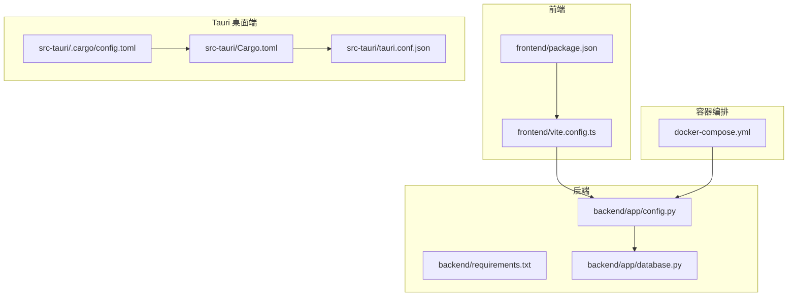
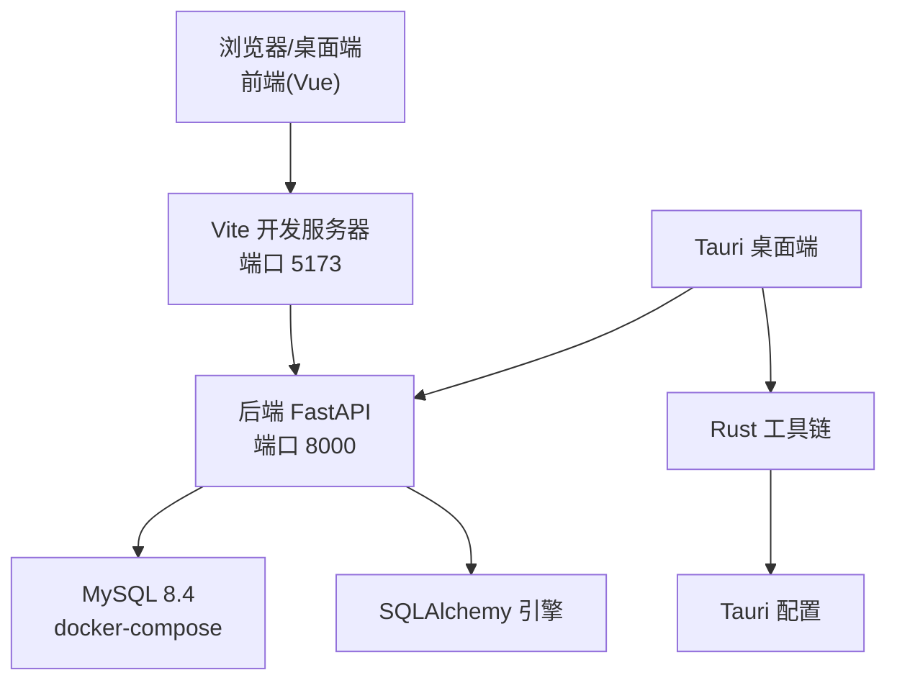
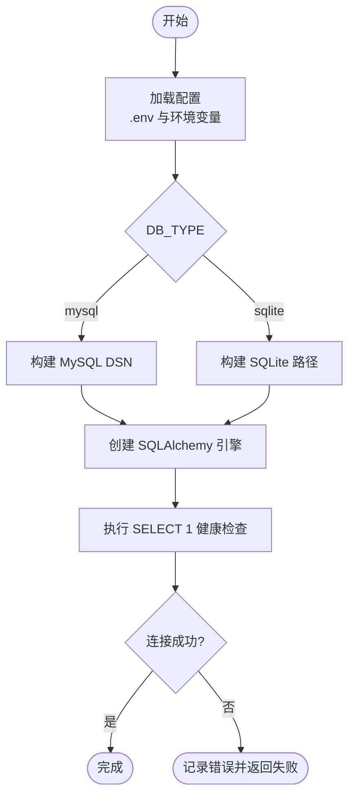
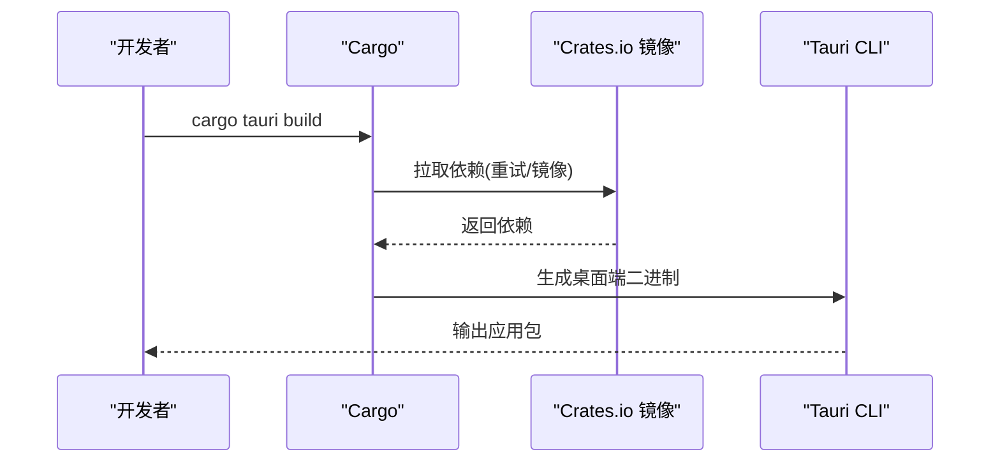
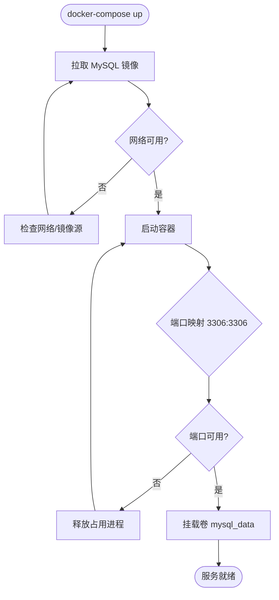
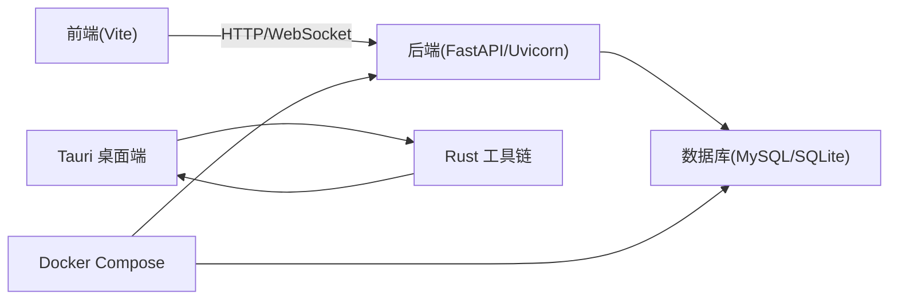

# 安装部署问题排查

<cite>
**本文档引用的文件**
- [docker-compose.yml](file://CCC-BrowserV4/docker-compose.yml)
- [Cargo.toml](file://CCC-BrowserV4/src-tauri/Cargo.toml)
- [tauri.conf.json](file://CCC-BrowserV4/src-tauri/tauri.conf.json)
- [requirements.txt](file://CCC-BrowserV4/backend/requirements.txt)
- [package.json](file://CCC-BrowserV4/frontend/package.json)
- [vite.config.ts](file://CCC-BrowserV4/frontend/vite.config.ts)
- [.cargo/config.toml](file://CCC-BrowserV4/src-tauri/.cargo/config.toml)
- [config.py](file://CCC-BrowserV4/backend/app/config.py)
- [database.py](file://CCC-BrowserV4/backend/app/database.py)
</cite>

## 目录
1. [简介](#简介)
2. [项目结构](#项目结构)
3. [核心组件](#核心组件)
4. [架构总览](#架构总览)
5. [详细组件分析](#详细组件分析)
6. [依赖关系分析](#依赖关系分析)
7. [性能考虑](#性能考虑)
8. [故障排除指南](#故障排除指南)
9. [结论](#结论)
10. [附录](#附录)

## 简介
本文件面向安装与部署阶段的问题排查，聚焦以下方面：
- Node.js 版本与前端依赖安装问题
- Python 环境与后端依赖安装问题
- Rust 工具链与 Tauri 编译问题
- Docker 容器启动与服务连通性问题
- 数据库连接与环境变量配置问题
- 常见网络、权限与版本冲突问题的诊断与修复

## 项目结构
该仓库包含前后端分离的浏览器自动化 RPA 应用，以及 Tauri 桌面端打包能力：
- 前端（Vue 3 + Vite）位于 frontend 目录，使用 TypeScript/Vue 生态与 Tauri CLI
- 后端（FastAPI + Uvicorn）位于 backend 目录，使用 SQLAlchemy 连接 MySQL 或 SQLite
- Tauri 桌面端位于 src-tauri，使用 Rust 生态与 Tauri v2
- 使用 docker-compose 管理 MySQL 数据库服务

**图表来源**
- [package.json:1-29](file://CCC-BrowserV4/frontend/package.json#L1-L29)
- [vite.config.ts:1-35](file://CCC-BrowserV4/frontend/vite.config.ts#L1-L35)
- [requirements.txt:1-13](file://CCC-BrowserV4/backend/requirements.txt#L1-L13)
- [config.py:1-52](file://CCC-BrowserV4/backend/app/config.py#L1-L52)
- [database.py:1-45](file://CCC-BrowserV4/backend/app/database.py#L1-L45)
- [Cargo.toml:1-22](file://CCC-BrowserV4/src-tauri/Cargo.toml#L1-L22)
- [tauri.conf.json:1-29](file://CCC-BrowserV4/src-tauri/tauri.conf.json#L1-L29)
- [.cargo/config.toml:1-16](file://CCC-BrowserV4/src-tauri/.cargo/config.toml#L1-L16)
- [docker-compose.yml:1-21](file://CCC-BrowserV4/docker-compose.yml#L1-L21)

**章节来源**
- [package.json:1-29](file://CCC-BrowserV4/frontend/package.json#L1-L29)
- [vite.config.ts:1-35](file://CCC-BrowserV4/frontend/vite.config.ts#L1-L35)
- [requirements.txt:1-13](file://CCC-BrowserV4/backend/requirements.txt#L1-L13)
- [config.py:1-52](file://CCC-BrowserV4/backend/app/config.py#L1-L52)
- [database.py:1-45](file://CCC-BrowserV4/backend/app/database.py#L1-L45)
- [Cargo.toml:1-22](file://CCC-BrowserV4/src-tauri/Cargo.toml#L1-L22)
- [tauri.conf.json:1-29](file://CCC-BrowserV4/src-tauri/tauri.conf.json#L1-L29)
- [.cargo/config.toml:1-16](file://CCC-BrowserV4/src-tauri/.cargo/config.toml#L1-L16)
- [docker-compose.yml:1-21](file://CCC-BrowserV4/docker-compose.yml#L1-L21)

## 核心组件
- 前端开发与构建：Vite + Vue 3 + TypeScript，代理到后端 8000 端口，构建目标包含现代浏览器
- 后端运行时：FastAPI + Uvicorn，数据库通过 SQLAlchemy 连接 MySQL 或 SQLite
- Tauri 桌面端：Rust 生态，使用 Tauri v2，内置 shell/store/opener 插件
- 容器化：Docker Compose 启动 MySQL 8.4，设置字符集与持久化卷

**章节来源**
- [package.json:1-29](file://CCC-BrowserV4/frontend/package.json#L1-L29)
- [vite.config.ts:1-35](file://CCC-BrowserV4/frontend/vite.config.ts#L1-L35)
- [requirements.txt:1-13](file://CCC-BrowserV4/backend/requirements.txt#L1-L13)
- [config.py:1-52](file://CCC-BrowserV4/backend/app/config.py#L1-L52)
- [database.py:1-45](file://CCC-BrowserV4/backend/app/database.py#L1-L45)
- [Cargo.toml:1-22](file://CCC-BrowserV4/src-tauri/Cargo.toml#L1-L22)
- [tauri.conf.json:1-29](file://CCC-BrowserV4/src-tauri/tauri.conf.json#L1-L29)
- [docker-compose.yml:1-21](file://CCC-BrowserV4/docker-compose.yml#L1-L21)

## 架构总览
下图展示从浏览器到后端再到数据库的整体链路，以及 Tauri 打包与 Docker 编排的关系。

**图表来源**
- [vite.config.ts:13-27](file://CCC-BrowserV4/frontend/vite.config.ts#L13-L27)
- [tauri.conf.json:6-11](file://CCC-BrowserV4/src-tauri/tauri.conf.json#L6-L11)
- [docker-compose.yml:4-17](file://CCC-BrowserV4/docker-compose.yml#L4-L17)
- [database.py:8-22](file://CCC-BrowserV4/backend/app/database.py#L8-L22)

## 详细组件分析

### 前端依赖与构建问题
- Node.js 版本要求：Vite 5.x 与 Vue 3.5 需要较新的 Node.js LTS；若安装失败或构建报错，优先检查 Node 版本与 npm/yarn/pnpm 的缓存清理
- 依赖安装失败常见原因：网络超时、Registry 不可用、权限不足、磁盘空间不足
- 构建目标与浏览器兼容：构建目标包含 es2021 与 chrome105/safari15，过低的 Node 或工具链可能导致构建失败
- 开发代理：前端代理到后端 8000 端口，若后端未启动或端口被占用，会导致请求失败

**章节来源**
- [package.json:1-29](file://CCC-BrowserV4/frontend/package.json#L1-L29)
- [vite.config.ts:1-35](file://CCC-BrowserV4/frontend/vite.config.ts#L1-L35)

### 后端依赖与运行问题
- Python 环境：建议使用虚拟环境隔离依赖；requirements.txt 明确了 FastAPI、Uvicorn、SQLAlchemy、PyMySQL、Cryptography、pydantic-settings、python-dotenv
- 依赖安装失败：网络问题（可切换国内镜像源）、权限不足（避免 sudo）、版本冲突（锁定版本）
- 运行时端口：后端监听 8000 端口，需确保端口未被占用

**章节来源**
- [requirements.txt:1-13](file://CCC-BrowserV4/backend/requirements.txt#L1-L13)

### 数据库连接与配置
- 连接方式：支持 MySQL 与 SQLite；默认使用 MySQL，可通过 DB_TYPE 切换
- 连接参数：主机、端口、用户名、密码、数据库名；MySQL 字符集为 utf8mb4
- 连接检查：提供连接健康检查函数，便于部署后快速验证
- 环境变量：通过 .env 与环境变量加载，注意大小写与编码

**图表来源**
- [config.py:18-47](file://CCC-BrowserV4/backend/app/config.py#L18-L47)
- [database.py:37-44](file://CCC-BrowserV4/backend/app/database.py#L37-L44)

**章节来源**
- [config.py:1-52](file://CCC-BrowserV4/backend/app/config.py#L1-L52)
- [database.py:1-45](file://CCC-BrowserV4/backend/app/database.py#L1-L45)

### Rust 工具链与 Tauri 编译问题
- Rust 工具链：Tauri v2 依赖稳定的 Rust 工具链；若编译失败，优先检查 rustc/cargo 版本与更新通道
- 国内网络优化：配置 crates.io 镜像源与 sparse registry，提升依赖下载稳定性
- 依赖清单：Tauri v2、shell/store/opener 插件、serde、tokio、tiny_http 等
- 打包配置：tauri.conf.json 定义了产品名称、窗口属性、CSP 策略与开发/构建命令

**图表来源**
- [.cargo/config.toml:1-16](file://CCC-BrowserV4/src-tauri/.cargo/config.toml#L1-L16)
- [Cargo.toml:1-22](file://CCC-BrowserV4/src-tauri/Cargo.toml#L1-L22)
- [tauri.conf.json:6-11](file://CCC-BrowserV4/src-tauri/tauri.conf.json#L6-L11)

**章节来源**
- [.cargo/config.toml:1-16](file://CCC-BrowserV4/src-tauri/.cargo/config.toml#L1-L16)
- [Cargo.toml:1-22](file://CCC-BrowserV4/src-tauri/Cargo.toml#L1-L22)
- [tauri.conf.json:1-29](file://CCC-BrowserV4/src-tauri/tauri.conf.json#L1-L29)

### Docker 容器启动问题
- 服务定义：MySQL 8.4，端口映射 3306:3306，设置 root 密码、数据库名、用户与密码
- 卷挂载：持久化数据目录，避免容器删除导致数据丢失
- 常见问题：端口冲突（宿主机 3306 已被占用）、权限不足（Docker daemon 权限）、镜像拉取失败（网络/镜像源）

**图表来源**
- [docker-compose.yml:4-17](file://CCC-BrowserV4/docker-compose.yml#L4-L17)

**章节来源**
- [docker-compose.yml:1-21](file://CCC-BrowserV4/docker-compose.yml#L1-L21)

## 依赖关系分析
- 前端对后端：Vite 代理到后端 8000 端口，开发与生产模式均需保证后端可达
- 后端对数据库：通过 SQLAlchemy 连接 MySQL 或 SQLite，需在启动前完成数据库准备
- Tauri 对 Rust：依赖稳定的 Rust 工具链与镜像源配置
- Docker 对后端：容器内服务与宿主机端口映射需一致

**图表来源**
- [vite.config.ts:16-25](file://CCC-BrowserV4/frontend/vite.config.ts#L16-L25)
- [database.py:8-22](file://CCC-BrowserV4/backend/app/database.py#L8-L22)
- [Cargo.toml:9-21](file://CCC-BrowserV4/src-tauri/Cargo.toml#L9-L21)
- [docker-compose.yml:4-17](file://CCC-BrowserV4/docker-compose.yml#L4-L17)

**章节来源**
- [vite.config.ts:1-35](file://CCC-BrowserV4/frontend/vite.config.ts#L1-L35)
- [database.py:1-45](file://CCC-BrowserV4/backend/app/database.py#L1-L45)
- [Cargo.toml:1-22](file://CCC-BrowserV4/src-tauri/Cargo.toml#L1-L22)
- [docker-compose.yml:1-21](file://CCC-BrowserV4/docker-compose.yml#L1-L21)

## 性能考虑
- 前端构建：启用压缩与最小化仅在生产环境，开发环境关闭压缩以提升构建速度
- 数据库连接池：MySQL 场景配置了连接池大小与回收策略，有助于高并发下的稳定性
- Rust 编译：使用镜像源与重试机制减少网络波动影响

**章节来源**
- [vite.config.ts:29-33](file://CCC-BrowserV4/frontend/vite.config.ts#L29-L33)
- [database.py:10-22](file://CCC-BrowserV4/backend/app/database.py#L10-L22)
- [.cargo/config.toml:13-16](file://CCC-BrowserV4/src-tauri/.cargo/config.toml#L13-L16)

## 故障排除指南

### Node.js 版本与前端依赖问题
- 症状：npm/yarn/pnpm 安装失败、构建时报语法错误或目标平台不兼容
- 排查步骤：
  - 检查 Node.js 版本是否满足 Vite 5.x 与 Vue 3.5 的最低要求
  - 清理 npm/yarn/pnpm 缓存并重试安装
  - 切换到稳定网络或使用国内镜像源
  - 确认 package.json 中脚本与依赖版本匹配
- 修复建议：
  - 使用 nvm/rtx 管理 Node 版本，确保与项目一致
  - 在 CI 环境中固定 Node 版本与缓存策略

**章节来源**
- [package.json:1-29](file://CCC-BrowserV4/frontend/package.json#L1-L29)
- [vite.config.ts:30-31](file://CCC-BrowserV4/frontend/vite.config.ts#L30-L31)

### Python 环境与后端依赖问题
- 症状：pip 安装缓慢或失败、模块导入错误、版本冲突
- 排查步骤：
  - 使用独立虚拟环境，避免系统级污染
  - 锁定 requirements.txt 中的版本，避免自动升级
  - 检查网络与代理设置，必要时切换国内镜像源
- 修复建议：
  - 在 CI 中预构建并缓存依赖，减少重复安装时间

**章节来源**
- [requirements.txt:1-13](file://CCC-BrowserV4/backend/requirements.txt#L1-L13)

### Rust 工具链与 Tauri 编译问题
- 症状：cargo fetch/compile 失败、找不到依赖、构建超时
- 排查步骤：
  - 更新 Rust 工具链至稳定版
  - 检查 .cargo/config.toml 是否正确配置镜像源与重试次数
  - 确认网络连通性与 DNS 解析
- 修复建议：
  - 在 CI 中缓存 Cargo registry 与构建产物
  - 使用离线构建或预下载依赖

**章节来源**
- [.cargo/config.toml:1-16](file://CCC-BrowserV4/src-tauri/.cargo/config.toml#L1-L16)
- [Cargo.toml:1-22](file://CCC-BrowserV4/src-tauri/Cargo.toml#L1-L22)

### Docker 容器启动失败
- 症状：容器启动后立即退出、端口占用、卷挂载失败
- 排查步骤：
  - 查看容器日志，确认 MySQL 初始化与端口监听
  - 检查宿主机 3306 端口占用情况并释放
  - 确认数据卷权限与目录存在
- 修复建议：
  - 使用 docker-compose down -v 删除旧卷并重建
  - 在 CI 中预拉取镜像并缓存

**章节来源**
- [docker-compose.yml:4-17](file://CCC-BrowserV4/docker-compose.yml#L4-L17)

### 环境变量与数据库连接失败
- 症状：应用启动时报数据库连接异常、无法建立会话
- 排查步骤：
  - 检查 .env 文件是否存在且字段完整
  - 确认 DB_TYPE、DB_HOST、DB_PORT、DB_USERNAME、DB_PASSWORD、DB_DATABASE 设置正确
  - 使用健康检查函数验证连接
- 修复建议：
  - 在启动脚本中先等待数据库就绪再启动后端
  - 在 Docker Compose 中使用 depends_on 与 healthcheck

**章节来源**
- [config.py:18-47](file://CCC-BrowserV4/backend/app/config.py#L18-L47)
- [database.py:37-44](file://CCC-BrowserV4/backend/app/database.py#L37-L44)

### Tauri 应用编译错误
- 症状：Rust 编译报错、签名配置缺失、平台兼容性问题
- 排查步骤：
  - 确认 Tauri CLI 版本与 Cargo.toml 依赖一致
  - 检查 tauri.conf.json 中的 CSP、窗口与构建命令
  - 验证各平台依赖（如 Windows SDK、macOS 证书等）
- 修复建议：
  - 在 CI 中按平台分别构建并缓存工件
  - 使用官方 Tauri 平台依赖安装脚本

**章节来源**
- [tauri.conf.json:1-29](file://CCC-BrowserV4/src-tauri/tauri.conf.json#L1-L29)
- [Cargo.toml:1-22](file://CCC-BrowserV4/src-tauri/Cargo.toml#L1-L22)

## 结论
本项目在安装部署层面的关键风险点集中在：Node.js 与前端依赖、Python 与后端依赖、Rust 工具链与 Tauri 编译、Docker 与数据库连通性。通过固定版本、使用镜像源、合理的环境隔离与健康检查，可以显著降低安装与部署失败的概率。建议在 CI 中引入缓存与预构建策略，进一步提升稳定性与效率。

## 附录
- 快速检查清单
  - Node.js 版本满足前端要求
  - pip 安装使用稳定网络与锁定版本
  - Rust 工具链为稳定版，镜像源可用
  - Docker 端口未被占用，卷权限正确
  - .env 配置完整，数据库已初始化
  - Tauri 配置与平台依赖齐备