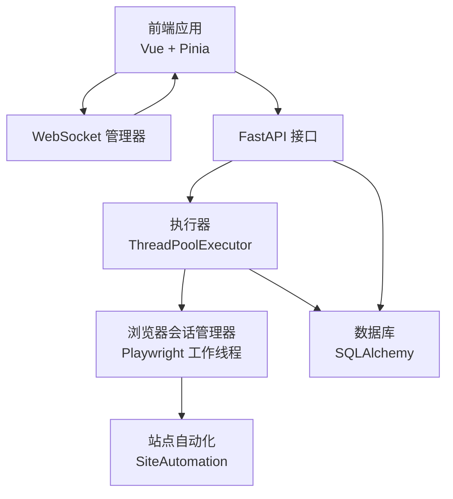
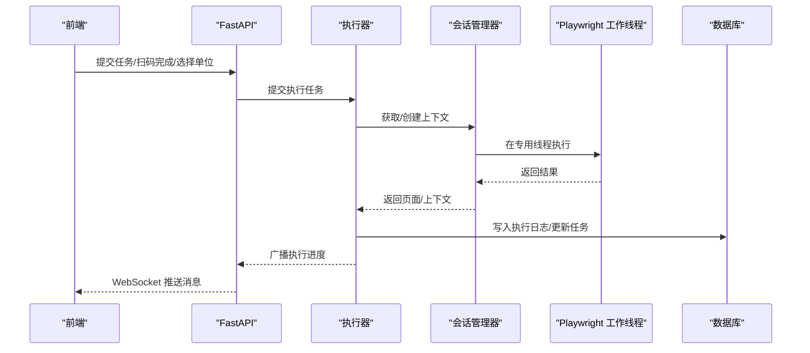
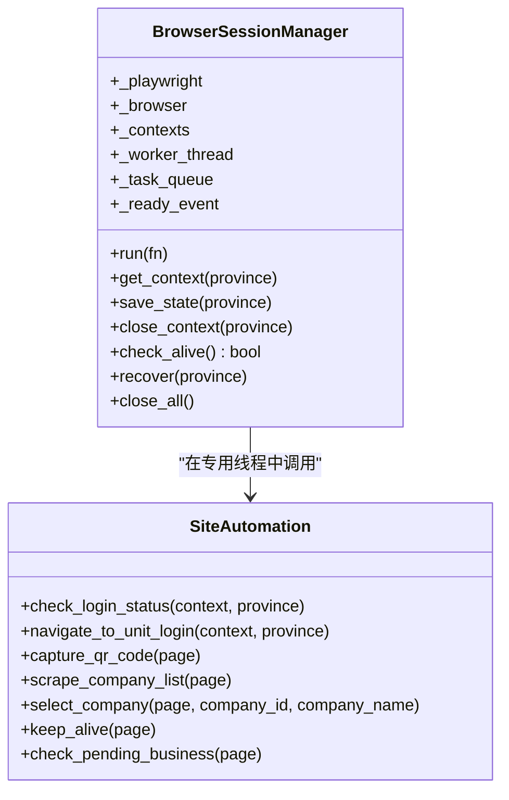
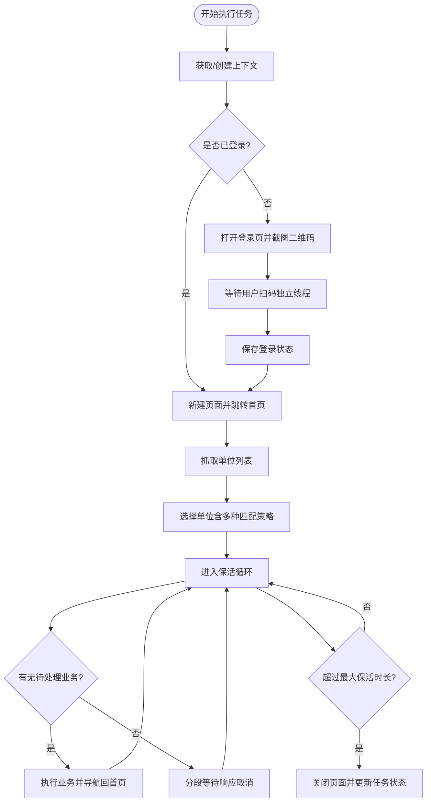
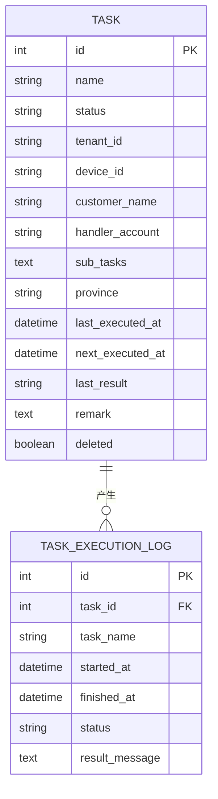
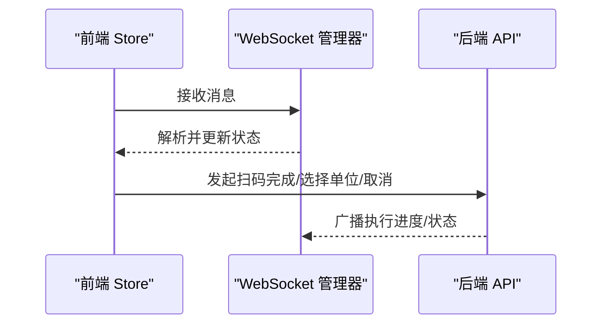

# 性能问题分析与优化

<cite>
**本文引用的文件**
- [main.py](file://CCC_RPA_API/app/main.py)
- [session_manager.py](file://CCC_RPA_API/app/browser/session_manager.py)
- [executor.py](file://CCC_RPA_API/app/services/executor.py)
- [site_automation.py](file://CCC_RPA_API/app/browser/site_automation.py)
- [waiter.py](file://CCC_RPA_API/app/browser/waiter.py)
- [manager.py](file://CCC_RPA_API/app/ws/manager.py)
- [database.py](file://CCC_RPA_API/app/database.py)
- [config.py](file://CCC_RPA_API/app/config.py)
- [task.py](file://CCC_RPA_API/app/models/task.py)
- [execution_log.py](file://CCC_RPA_API/app/models/execution_log.py)
- [execution.ts](file://CCC-BrowserV4/frontend/src/stores/execution.ts)
- [execution_api.ts](file://CCC-BrowserV4/frontend/src/api/execution.ts)
- [requirements.txt](file://CCC_RPA_API/requirements.txt)
- [docker-compose.yml](file://CCC-BrowserV4/docker-compose.yml)
- [Cargo.lock](file://CCC-BrowserV4/src-tauri/Cargo.lock)
- [project.md](file://project.md)
</cite>

## 目录
1. [简介](#简介)
2. [项目结构](#项目结构)
3. [核心组件](#核心组件)
4. [架构总览](#架构总览)
5. [详细组件分析](#详细组件分析)
6. [依赖关系分析](#依赖关系分析)
7. [性能考量](#性能考量)
8. [故障排查指南](#故障排查指南)
9. [结论](#结论)
10. [附录](#附录)

## 简介
本文件聚焦于该AI RPA项目的性能问题分析与优化，围绕内存使用优化（会话资源管理与垃圾回收）、CPU使用率优化（并发控制、线程池配置、计算密集型任务处理）、网络延迟降低（连接池优化、请求合并与缓存策略）、数据库查询优化（索引使用、查询计划分析与连接复用）、浏览器自动化性能调优（页面加载、元素等待策略与操作批处理），以及监控指标与性能瓶颈识别（APM工具与性能测试策略）。文档基于仓库现有实现进行深入剖析，并结合项目整体设计目标给出可落地的优化建议。

## 项目结构
该项目采用前后端分离架构：
- 后端（FastAPI）：提供REST与WebSocket接口，负责任务编排、浏览器会话管理、数据库交互与执行状态广播。
- 前端（Vue + Pinia）：通过WebSocket接收执行进度，驱动UI状态更新；通过HTTP API与后端交互。
- 数据库：MySQL，通过SQLAlchemy ORM访问。
- 浏览器自动化：Playwright（Chromium）在专用工作线程中执行，避免与异步事件循环冲突。



图表来源
- [main.py:12-28](file://CCC_RPA_API/app/main.py#L12-L28)
- [manager.py:1-29](file://CCC_RPA_API/app/ws/manager.py#L1-L29)
- [executor.py:18-33](file://CCC_RPA_API/app/services/executor.py#L18-L33)
- [session_manager.py:39-74](file://CCC_RPA_API/app/browser/session_manager.py#L39-L74)
- [database.py:5-19](file://CCC_RPA_API/app/database.py#L5-L19)

章节来源
- [main.py:12-28](file://CCC_RPA_API/app/main.py#L12-L28)
- [manager.py:1-29](file://CCC_RPA_API/app/ws/manager.py#L1-L29)
- [executor.py:18-33](file://CCC_RPA_API/app/services/executor.py#L18-L33)
- [session_manager.py:39-74](file://CCC_RPA_API/app/browser/session_manager.py#L39-L74)
- [database.py:5-19](file://CCC_RPA_API/app/database.py#L5-L19)

## 核心组件
- FastAPI应用与路由注册、CORS中间件、健康检查、WebSocket端点与事件循环捕获。
- 浏览器会话管理器：按省份维护Playwright上下文，专用工作线程执行浏览器操作，队列化任务，支持状态持久化与恢复。
- 执行器：线程池执行任务逻辑，协调浏览器操作、用户等待、状态广播与数据库事务。
- 站点自动化：封装登录、扫码、单位列表抓取、单位选择、保活与业务检测等流程。
- 等待器：基于线程事件的阻塞/非阻塞等待与取消信号。
- WebSocket管理器：连接管理与广播。
- 数据库与模型：连接池配置、任务与执行日志模型。
- 前端执行状态管理：根据WebSocket消息更新UI状态。

章节来源
- [main.py:12-28](file://CCC_RPA_API/app/main.py#L12-L28)
- [session_manager.py:7-183](file://CCC_RPA_API/app/browser/session_manager.py#L7-L183)
- [executor.py:17-318](file://CCC_RPA_API/app/services/executor.py#L17-L318)
- [site_automation.py:16-586](file://CCC_RPA_API/app/browser/site_automation.py#L16-L586)
- [waiter.py:7-84](file://CCC_RPA_API/app/browser/waiter.py#L7-L84)
- [manager.py:1-29](file://CCC_RPA_API/app/ws/manager.py#L1-L29)
- [database.py:5-19](file://CCC_RPA_API/app/database.py#L5-L19)
- [task.py:8-25](file://CCC_RPA_API/app/models/task.py#L8-L25)
- [execution_log.py:7-17](file://CCC_RPA_API/app/models/execution_log.py#L7-L17)
- [execution.ts:6-229](file://CCC-BrowserV4/frontend/src/stores/execution.ts#L6-L229)

## 架构总览
后端以FastAPI为核心，通过线程池与专用工作线程隔离Playwright操作，避免事件循环阻塞；执行器协调浏览器与数据库，通过WebSocket向前端实时反馈进度。数据库连接池配置开启预检与回收，前端通过Pinia集中管理执行状态。



图表来源
- [main.py:119-127](file://CCC_RPA_API/app/main.py#L119-L127)
- [executor.py:316-318](file://CCC_RPA_API/app/services/executor.py#L316-L318)
- [session_manager.py:77-94](file://CCC_RPA_API/app/browser/session_manager.py#L77-L94)
- [manager.py:17-27](file://CCC_RPA_API/app/ws/manager.py#L17-L27)

## 详细组件分析

### 浏览器会话管理与内存优化
- 专用工作线程：Playwright在守护线程中启动，避免与FastAPI事件循环冲突；任务通过队列提交，避免死锁。
- 上下文复用：按省份缓存BrowserContext，减少重复启动成本；若上下文失效则重建。
- 状态持久化：将storage_state落盘，重启后可快速恢复登录态，降低重复扫码成本。
- 资源回收：显式关闭页面与上下文，必要时整体恢复会话并清空上下文字典，避免句柄泄漏。
- 存活检查：定期检查浏览器连接状态，异常时触发恢复流程。



图表来源
- [session_manager.py:7-183](file://CCC_RPA_API/app/browser/session_manager.py#L7-L183)
- [site_automation.py:38-586](file://CCC_RPA_API/app/browser/site_automation.py#L38-L586)

章节来源
- [session_manager.py:7-183](file://CCC_RPA_API/app/browser/session_manager.py#L7-L183)
- [site_automation.py:38-586](file://CCC_RPA_API/app/browser/site_automation.py#L38-L586)

### 执行器与并发控制
- 线程池：两个线程池分别处理任务执行与阻塞等待，避免阻塞Playwright工作线程。
- 事件循环广播：在工作线程中安全地将消息广播至主事件循环，确保WebSocket发送线程安全。
- 恢复与检查点：在关键步骤检查浏览器存活，异常时恢复并重新打开页面，保证稳定性。
- 保活循环：周期性执行保活动作，检测待处理业务并分批执行，等待阶段分段以快速响应取消。



图表来源
- [executor.py:78-314](file://CCC_RPA_API/app/services/executor.py#L78-L314)
- [site_automation.py:194-444](file://CCC_RPA_API/app/browser/site_automation.py#L194-L444)

章节来源
- [executor.py:18-33](file://CCC_RPA_API/app/services/executor.py#L18-L33)
- [executor.py:78-314](file://CCC_RPA_API/app/services/executor.py#L78-L314)

### 数据库连接池与查询优化
- 连接池配置：启用pool_pre_ping与pool_recycle，提升连接可用性与回收效率。
- 事务边界：每个任务执行在独立数据库会话中，确保资源及时释放。
- 模型索引：任务与日志表对常用查询字段建立索引，加速筛选与排序。
- 建议：针对高频查询添加复合索引；使用EXPLAIN分析慢查询；对大批量写入使用批量插入。



图表来源
- [task.py:8-25](file://CCC_RPA_API/app/models/task.py#L8-L25)
- [execution_log.py:7-17](file://CCC_RPA_API/app/models/execution_log.py#L7-L17)

章节来源
- [database.py:5-19](file://CCC_RPA_API/app/database.py#L5-L19)
- [task.py:8-25](file://CCC_RPA_API/app/models/task.py#L8-L25)
- [execution_log.py:7-17](file://CCC_RPA_API/app/models/execution_log.py#L7-L17)

### WebSocket与前端状态管理
- 连接管理：统一管理WebSocket连接，广播消息时清理断连连接。
- 前端状态：Pinia集中管理执行步骤、消息、二维码与单位列表，按类型消息更新UI。
- 交互流程：扫码完成、选择单位、取消执行均通过HTTP API与WebSocket消息联动。



图表来源
- [manager.py:17-27](file://CCC_RPA_API/app/ws/manager.py#L17-L27)
- [execution.ts:22-67](file://CCC-BrowserV4/frontend/src/stores/execution.ts#L22-L67)
- [execution_api.ts:4-19](file://CCC-BrowserV4/frontend/src/api/execution.ts#L4-L19)

章节来源
- [manager.py:1-29](file://CCC_RPA_API/app/ws/manager.py#L1-L29)
- [execution.ts:6-229](file://CCC-BrowserV4/frontend/src/stores/execution.ts#L6-L229)
- [execution_api.ts:1-20](file://CCC-BrowserV4/frontend/src/api/execution.ts#L1-L20)

## 依赖关系分析
- 后端依赖：FastAPI、Uvicorn、SQLAlchemy、PyMySQL、Playwright、pydantic-settings等。
- Docker环境：MySQL 8.4，提供数据库服务。
- Rust生态：Tauri应用包含大量依赖，涉及跨平台系统接口与图形栈。

```mermaid
graph LR
A["FastAPI 应用"] --> B["SQLAlchemy/PyMySQL"]
A --> C["Playwright"]
A --> D["WebSocket 管理器"]
E["MySQL 服务"] <- --> B
F["Tauri 应用"] --> G["Rust 生态依赖"]
```

图表来源
- [requirements.txt:1-11](file://CCC_RPA_API/requirements.txt#L1-L11)
- [docker-compose.yml:4-17](file://CCC-BrowserV4/docker-compose.yml#L4-L17)
- [Cargo.lock:613-2368](file://CCC-BrowserV4/src-tauri/Cargo.lock#L613-L2368)

章节来源
- [requirements.txt:1-11](file://CCC_RPA_API/requirements.txt#L1-L11)
- [docker-compose.yml:1-21](file://CCC-BrowserV4/docker-compose.yml#L1-L21)
- [Cargo.lock:613-2368](file://CCC-BrowserV4/src-tauri/Cargo.lock#L613-L2368)

## 性能考量

### 内存使用优化（会话资源管理与垃圾回收）
- 会话复用与状态持久化
  - 按省份缓存BrowserContext，避免重复启动Chromium进程与初始化成本。
  - storage_state落盘，重启后快速恢复登录态，减少重复扫码与登录流程。
- 资源回收与异常恢复
  - 显式关闭页面与上下文；在异常时清空上下文字典并重建浏览器实例。
  - 存活检查失败时触发恢复流程，避免悬挂句柄导致内存泄漏。
- 前端状态清理
  - 执行完成后重置Pinia状态，避免DOM与图片资源残留。

章节来源
- [session_manager.py:96-141](file://CCC_RPA_API/app/browser/session_manager.py#L96-L141)
- [session_manager.py:154-167](file://CCC_RPA_API/app/browser/session_manager.py#L154-L167)
- [execution.ts:206-222](file://CCC-BrowserV4/frontend/src/stores/execution.ts#L206-L222)

### CPU使用率优化（并发控制、线程池配置与计算密集型任务）
- 线程池拆分
  - 任务执行线程池与等待线程池分离，避免阻塞Playwright工作线程。
  - 任务执行线程池大小可根据CPU核数与I/O特性调整，避免过度并发导致上下文切换开销。
- 保活与等待分段
  - 保活等待采用分段等待，缩短响应取消的时间，降低无效CPU占用。
- 计算密集型任务
  - 将可并行的页面解析与元素匹配逻辑尽量在专用线程中执行，避免阻塞主线程。
  - 对重复计算（如选择器匹配）引入缓存策略，减少重复遍历。

章节来源
- [executor.py:18-19](file://CCC_RPA_API/app/services/executor.py#L18-L19)
- [executor.py:252-265](file://CCC_RPA_API/app/services/executor.py#L252-L265)
- [site_automation.py:213-291](file://CCC_RPA_API/app/browser/site_automation.py#L213-L291)

### 网络延迟降低（连接池、请求合并与缓存）
- 连接池优化
  - 数据库连接池启用pool_pre_ping与pool_recycle，提升连接可用性与回收效率。
- 请求合并与批处理
  - 前端在执行过程中聚合UI状态更新，减少不必要的渲染与重绘。
  - 执行器在保活循环中合并多次等待为分段等待，提高响应性。
- 缓存策略
  - 浏览器会话状态持久化，减少重复登录与扫码成本。
  - 对页面截图与二维码图片进行本地缓存，避免重复生成。

章节来源
- [database.py:5-6](file://CCC_RPA_API/app/database.py#L5-L6)
- [session_manager.py:126-132](file://CCC_RPA_API/app/browser/session_manager.py#L126-L132)
- [site_automation.py:148-173](file://CCC_RPA_API/app/browser/site_automation.py#L148-L173)

### 数据库查询优化（索引、查询计划与连接复用）
- 索引使用
  - 任务与日志表对常用查询字段建立索引，如name、status、deleted、task_id等。
- 查询计划分析
  - 使用EXPLAIN分析慢查询，定位缺失索引或N+1问题。
- 连接复用
  - 通过连接池复用数据库连接，减少握手与鉴权开销。
  - 事务粒度适中，避免长时间持有连接。

章节来源
- [task.py:12-13](file://CCC_RPA_API/app/models/task.py#L12-L13)
- [task.py:24](file://CCC_RPA_API/app/models/task.py#L24)
- [execution_log.py:11](file://CCC_RPA_API/app/models/execution_log.py#L11)
- [database.py:5-6](file://CCC_RPA_API/app/database.py#L5-L6)

### 浏览器自动化性能调优（页面加载、等待策略与操作批处理）
- 页面加载优化
  - 使用wait_until参数控制等待时机，避免过早或过晚触发后续步骤。
  - 首次登录后保存storage_state，后续直接进入首页，减少加载时间。
- 元素等待策略
  - 使用is_visible与wait_for_selector等策略，避免轮询带来的CPU占用。
  - 对二维码等关键元素增加截图与降级策略，提升鲁棒性。
- 操作批处理
  - 保活循环中合并多次小操作为周期性动作，减少频繁交互。
  - 选择单位时采用多策略匹配，优先使用高命中率策略。

章节来源
- [site_automation.py:44-47](file://CCC_RPA_API/app/browser/site_automation.py#L44-L47)
- [site_automation.py:69-74](file://CCC_RPA_API/app/browser/site_automation.py#L69-L74)
- [site_automation.py:175-192](file://CCC_RPA_API/app/browser/site_automation.py#L175-L192)
- [site_automation.py:460-524](file://CCC_RPA_API/app/browser/site_automation.py#L460-L524)

### 监控指标与性能瓶颈识别（APM与性能测试）
- 指标建议
  - 会话创建耗时、页面操作延迟、WebSocket连接数、数据库QPS与连接池利用率、CPU与内存使用率。
- APM工具
  - 结合Prometheus/Grafana进行可视化监控，ELK收集审计日志。
- 性能测试
  - 基准测试：单机与集群环境下的并发会话数、吞吐量与延迟。
  - 压力测试：逐步提升并发，观察CPU、内存、数据库连接与WebSocket连接的变化。

章节来源
- [project.md:506-516](file://project.md#L506-L516)
- [project.md:425-433](file://project.md#L425-L433)

## 故障排查指南
- 浏览器异常恢复
  - 检查check_alive状态，异常时调用recover并重建上下文与页面。
  - 记录页面URL与截图，辅助定位问题。
- 执行器异常
  - 捕获异常并更新任务状态与日志，确保前端收到错误消息。
  - 清理等待器资源，避免悬挂事件。
- 数据库连接问题
  - 检查连接池配置与回收策略，确认连接可用性。
  - 对长时间事务进行拆分，避免连接被占用。

章节来源
- [executor.py:42-69](file://CCC_RPA_API/app/services/executor.py#L42-L69)
- [executor.py:285-313](file://CCC_RPA_API/app/services/executor.py#L285-L313)
- [database.py:5-6](file://CCC_RPA_API/app/database.py#L5-L6)

## 结论
本项目通过专用工作线程隔离浏览器操作、拆分线程池、连接池优化与状态持久化等手段，在保证稳定性的同时提升了性能。建议进一步完善索引策略、引入APM监控与压力测试，持续优化页面等待策略与操作批处理，以满足更高的并发与更低的延迟目标。

## 附录
- Docker环境：MySQL 8.4，提供数据库服务。
- Rust生态：Tauri应用包含大量系统与图形栈依赖，需关注跨平台兼容性与性能影响。

章节来源
- [docker-compose.yml:4-17](file://CCC-BrowserV4/docker-compose.yml#L4-L17)
- [Cargo.lock:613-2368](file://CCC-BrowserV4/src-tauri/Cargo.lock#L613-L2368)