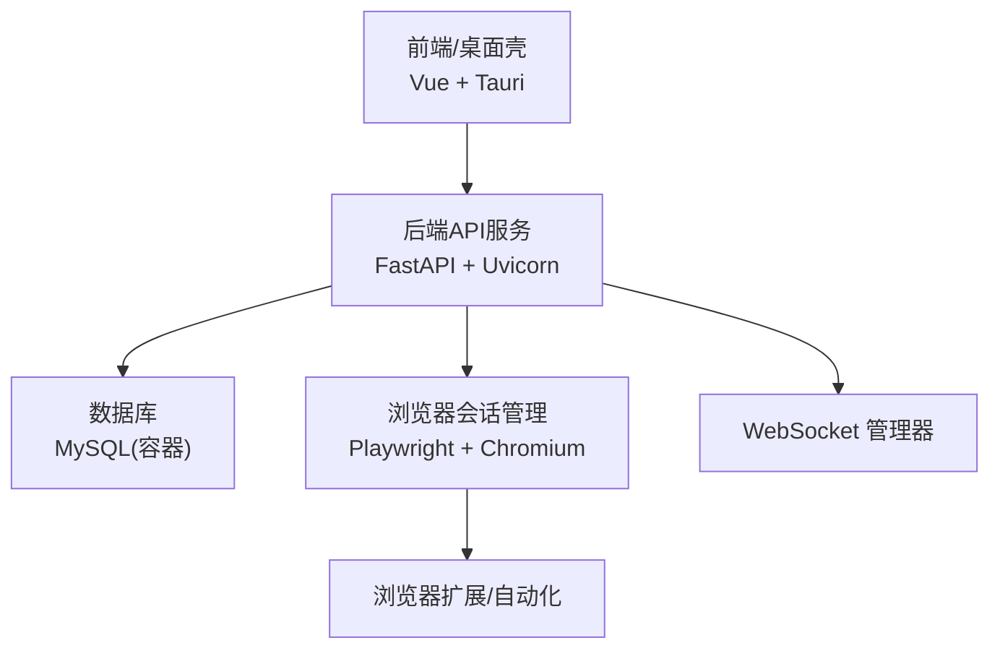
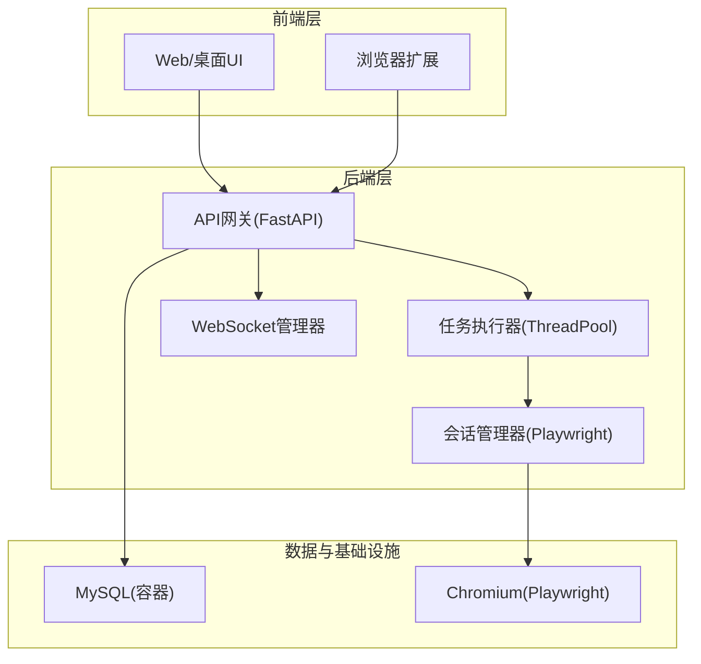
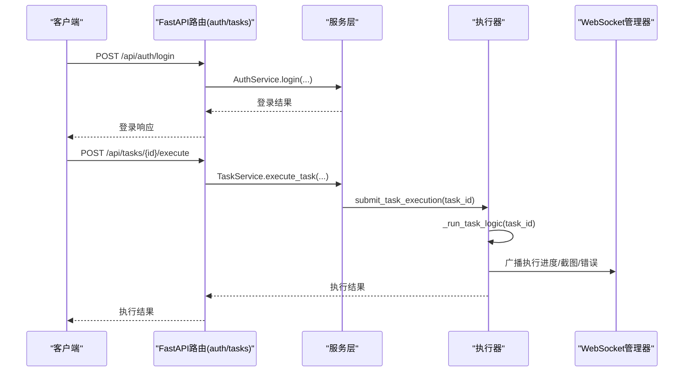
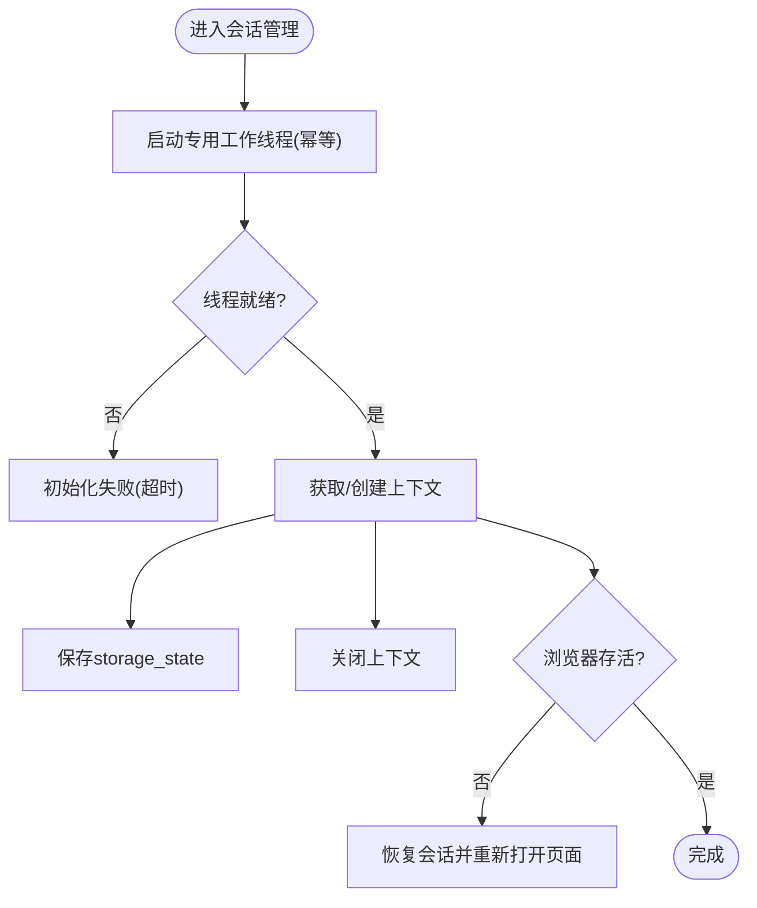
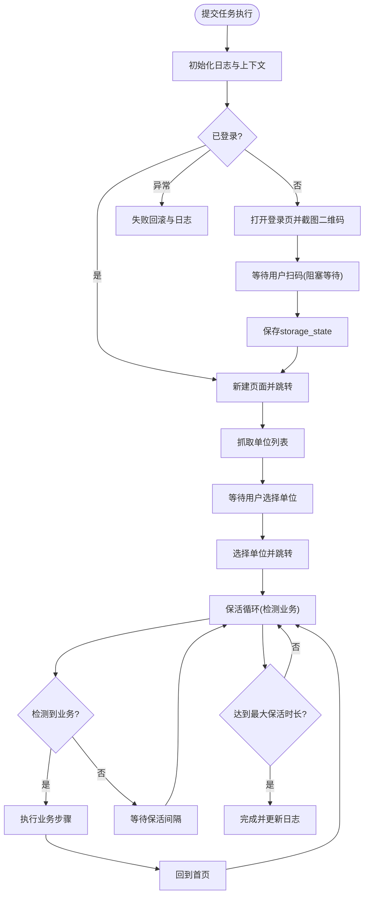
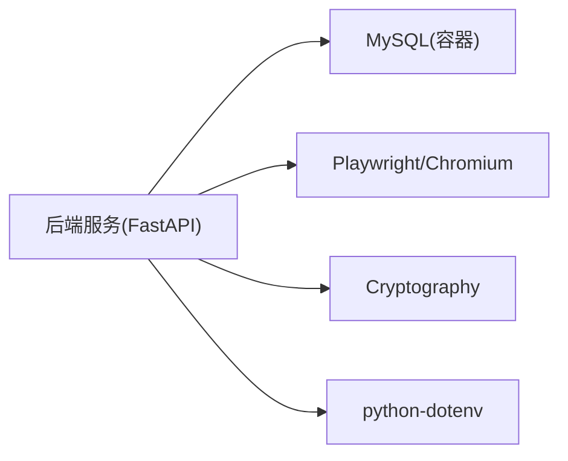

# 故障排除与常见问题

<cite>
**本文引用的文件**
- [project.md](file://project.md)
- [docker-compose.yml](file://CCC-BrowserV4/docker-compose.yml)
- [requirements.txt](file://CCC-BrowserV4/backend/requirements.txt)
- [requirements.txt](file://CCC_RPA_API/requirements.txt)
- [auth.py](file://CCC_RPA_API/app/api/auth.py)
- [tasks.py](file://CCC_RPA_API/app/api/tasks.py)
- [session_manager.py](file://CCC_RPA_API/app/browser/session_manager.py)
- [executor.py](file://CCC_RPA_API/app/services/executor.py)
- [manager.py](file://CCC_RPA_API/app/ws/manager.py)
</cite>

## 目录
1. [简介](#简介)
2. [项目结构](#项目结构)
3. [核心组件](#核心组件)
4. [架构总览](#架构总览)
5. [详细组件分析](#详细组件分析)
6. [依赖关系分析](#依赖关系分析)
7. [性能考虑](#性能考虑)
8. [故障排除指南](#故障排除指南)
9. [结论](#结论)
10. [附录](#附录)

## 简介
本文件面向部署与运维工程师、平台使用者与开发者，提供系统安装部署、运行时问题、性能优化、安全与监控告警的完整故障排除与常见问题解答。内容基于仓库中的需求规范、后端API与浏览器自动化实现，覆盖依赖缺失、端口冲突、权限不足、会话创建失败、浏览器自动化异常、AI推理超时、内存泄漏、CPU与网络延迟优化、证书与权限控制、数据加密、监控告警解读与应急响应、以及调试工具与日志分析方法。

## 项目结构
系统由三层构成：
- 前端与桌面壳：基于 Tauri/Vue 的桌面应用与浏览器扩展（前端目录位于 CCC-BrowserV4/frontend 与 src-tauri）
- 后端服务：FastAPI 提供 REST/WS API，负责认证、任务编排、浏览器会话管理与执行器
- 数据与基础设施：MySQL（容器化）、Playwright Chromium 会话、WebSocket 实时通道

图表来源
- [docker-compose.yml:1-21](file://CCC-BrowserV4/docker-compose.yml#L1-L21)
- [requirements.txt:1-13](file://CCC-BrowserV4/backend/requirements.txt#L1-L13)

章节来源
- [docker-compose.yml:1-21](file://CCC-BrowserV4/docker-compose.yml#L1-L21)
- [requirements.txt:1-13](file://CCC-BrowserV4/backend/requirements.txt#L1-L13)

## 核心组件
- 认证与任务API：提供登录、登出、校验与任务执行、日志查询等接口
- 浏览器会话管理：集中式 Playwright 工作线程、上下文复用、状态持久化、异常恢复
- 任务执行器：线程池驱动的自动化流程，包含扫码登录、单位选择、保活循环与业务触发
- WebSocket 管理器：广播执行进度、截图、错误与状态更新

章节来源
- [auth.py:1-24](file://CCC_RPA_API/app/api/auth.py#L1-L24)
- [tasks.py:1-76](file://CCC_RPA_API/app/api/tasks.py#L1-L76)
- [session_manager.py:1-183](file://CCC_RPA_API/app/browser/session_manager.py#L1-L183)
- [executor.py:1-308](file://CCC_RPA_API/app/services/executor.py#L1-L308)
- [manager.py:1-29](file://CCC_RPA_API/app/ws/manager.py#L1-L29)

## 架构总览
系统采用“多租户 + 双通路控制 + AI 驱动”的分层架构，后端通过 FastAPI 提供 REST/WS 接口，浏览器自动化由 Playwright 管理，WebSocket 实时推送执行状态，数据库使用 MySQL（容器化）。

图表来源
- [requirements.txt:1-13](file://CCC-BrowserV4/backend/requirements.txt#L1-L13)
- [docker-compose.yml:1-21](file://CCC-BrowserV4/docker-compose.yml#L1-L21)
- [session_manager.py:1-183](file://CCC_RPA_API/app/browser/session_manager.py#L1-L183)
- [executor.py:1-308](file://CCC_RPA_API/app/services/executor.py#L1-L308)
- [manager.py:1-29](file://CCC_RPA_API/app/ws/manager.py#L1-L29)

## 详细组件分析

### 组件A：认证与任务API
- 认证路由：登录、登出、校验
- 任务路由：任务列表、创建、查询、更新、删除、执行、日志查询、扫码完成/选择公司/取消执行
- 关键行为：执行任务时通过服务层调用执行器，异常通过 HTTP 400 返回错误信息

图表来源
- [auth.py:1-24](file://CCC_RPA_API/app/api/auth.py#L1-L24)
- [tasks.py:1-76](file://CCC_RPA_API/app/api/tasks.py#L1-L76)
- [executor.py:1-308](file://CCC_RPA_API/app/services/executor.py#L1-L308)
- [manager.py:1-29](file://CCC_RPA_API/app/ws/manager.py#L1-L29)

章节来源
- [auth.py:1-24](file://CCC_RPA_API/app/api/auth.py#L1-L24)
- [tasks.py:1-76](file://CCC_RPA_API/app/api/tasks.py#L1-L76)

### 组件B：浏览器会话管理
- 单例工作线程：确保 Playwright/Chromium 在专用线程中运行，避免线程冲突
- 上下文复用：按“省份”维度复用 BrowserContext，并持久化 storage_state
- 异常恢复：检测浏览器断连，自动恢复并重新打开页面
- 超时与错误：执行超时抛出异常，恢复过程广播进度

图表来源
- [session_manager.py:1-183](file://CCC_RPA_API/app/browser/session_manager.py#L1-L183)

章节来源
- [session_manager.py:1-183](file://CCC_RPA_API/app/browser/session_manager.py#L1-L183)

### 组件C：任务执行器
- 线程池：任务执行与阻塞等待分别使用独立线程池，避免阻塞 Playwright 工作线程
- 执行流程：初始化浏览器 → 检查登录 → 扫码登录（若未登录）→ 保存状态 → 抓取单位列表 → 等待用户选择 → 选择单位 → 保活循环（检测业务触发）→ 完成/失败回滚与日志
- 广播机制：通过 WebSocket 管理器推送执行进度、截图、错误与状态更新

图表来源
- [executor.py:1-308](file://CCC_RPA_API/app/services/executor.py#L1-L308)
- [session_manager.py:1-183](file://CCC_RPA_API/app/browser/session_manager.py#L1-L183)
- [manager.py:1-29](file://CCC_RPA_API/app/ws/manager.py#L1-L29)

章节来源
- [executor.py:1-308](file://CCC_RPA_API/app/services/executor.py#L1-L308)

## 依赖关系分析
- 后端依赖：FastAPI、Uvicorn、SQLAlchemy、PyMySQL、Cryptography、Pydantic Settings、python-dotenv
- 数据库：MySQL（容器化），默认端口映射 3306:3306
- 运行时：Chromium 通过 Playwright 启动，需确保系统具备相应依赖与权限

图表来源
- [requirements.txt:1-13](file://CCC-BrowserV4/backend/requirements.txt#L1-L13)
- [docker-compose.yml:1-21](file://CCC-BrowserV4/docker-compose.yml#L1-L21)

章节来源
- [requirements.txt:1-13](file://CCC-BrowserV4/backend/requirements.txt#L1-L13)
- [docker-compose.yml:1-21](file://CCC-BrowserV4/docker-compose.yml#L1-L21)

## 性能考虑
- 会话创建与操作延迟：根据需求规范，会话创建耗时在集群与单机模式下有明确上限；CDP 操作延迟应控制在合理范围内
- 并发与吞吐：API 网关单接口 QPS 与 WebSocket 在线连接数需满足业务峰值
- 资源限制：单会话内存与 CPU 上限、最大打开标签数、最长存活时长需严格控制
- 内存泄漏：通过硬阈值自动销毁、强制超时回收、定时清理缓存与异常告警机制缓解
- AI 推理：GPU 加速与模板预热可降低推理延迟

章节来源
- [project.md:504-551](file://project.md#L504-L551)

## 故障排除指南

### 一、安装与部署问题
- 依赖缺失
  - 症状：启动后导入模块报错或服务无法启动
  - 排查：确认后端依赖安装完整，特别是 FastAPI、Uvicorn、SQLAlchemy、PyMySQL、Cryptography、Pydantic Settings、python-dotenv
  - 修复：使用 requirements.txt 安装依赖
  - 参考
    - [requirements.txt:1-13](file://CCC-BrowserV4/backend/requirements.txt#L1-L13)
    - [requirements.txt:1-13](file://CCC_RPA_API/requirements.txt#L1-L13)
- 端口冲突
  - 症状：服务启动失败或端口被占用
  - 排查：检查 FastAPI/Uvicorn 默认监听端口与宿主机端口映射
  - 修复：修改端口或释放占用端口
  - 参考
    - [requirements.txt:2-3](file://CCC-BrowserV4/backend/requirements.txt#L2-L3)
- 数据库连接失败
  - 症状：应用启动时报数据库连接错误
  - 排查：确认 MySQL 容器已启动、凭据正确、端口映射 3306 正常
  - 修复：检查 docker-compose 配置与环境变量
  - 参考
    - [docker-compose.yml:1-21](file://CCC-BrowserV4/docker-compose.yml#L1-L21)
- 权限不足
  - 症状：Chromium 启动失败或无法创建会话
  - 排查：确认运行用户具备启动 Chromium 的权限与必要系统能力
  - 修复：以具备权限的用户运行，或调整系统安全策略
  - 参考
    - [session_manager.py:43-49](file://CCC_RPA_API/app/browser/session_manager.py#L43-L49)

### 二、运行时问题定位与修复
- 会话创建失败
  - 症状：浏览器初始化超时或断连
  - 排查：检查 Playwright 工作线程是否就绪、Chromium 启动参数、专用线程日志
  - 修复：延长初始化等待时间、检查启动参数、重启会话管理器
  - 参考
    - [session_manager.py:28-74](file://CCC_RPA_API/app/browser/session_manager.py#L28-L74)
- 浏览器自动化异常
  - 症状：扫码登录无响应、页面跳转失败、元素定位不到
  - 排查：确认 WebSocket 广播正常、等待用户输入的阻塞等待线程池可用、页面加载完成后再执行操作
  - 修复：增加页面等待条件、缩短等待轮询间隔、检查网络与代理
  - 参考
    - [executor.py:62-65](file://CCC_RPA_API/app/services/executor.py#L62-L65)
    - [executor.py:109-140](file://CCC_RPA_API/app/services/executor.py#L109-L140)
- AI 推理超时
  - 症状：任务执行中出现推理超时或响应缓慢
  - 排查：确认推理服务可用性、GPU/CPU 负载、模板预热与缓存命中
  - 修复：启用 GPU 加速、预热常用模板、降低并发或扩容推理服务
  - 参考
    - [project.md:504-551](file://project.md#L504-L551)

### 三、性能问题分析与优化
- 内存泄漏检测
  - 方法：观察会话内存曲线、设置硬阈值自动销毁、定期清理缓存
  - 修复：缩短会话最长存活时长、强制超时回收、检查存储状态文件清理
  - 参考
    - [project.md:643-644](file://project.md#L643-L644)
    - [session_manager.py:126-132](file://CCC_RPA_API/app/browser/session_manager.py#L126-L132)
- CPU 使用率优化
  - 方法：限制单会话 CPU 上限、减少并发、使用线程池隔离阻塞操作
  - 修复：调整线程池大小、降低保活频率、合并页面操作
  - 参考
    - [project.md:504-551](file://project.md#L504-L551)
    - [executor.py:18-19](file://CCC_RPA_API/app/services/executor.py#L18-L19)
- 网络延迟降低
  - 方法：为会话绑定独立代理 IP、避免全局缓存共享、减少不必要的网络请求
  - 修复：启用代理池、禁用全局磁盘缓存、优化页面等待策略
  - 参考
    - [project.md:229-235](file://project.md#L229-L235)

### 四、安全相关问题处理
- 证书与传输安全
  - 要求：全部内外通信强制 TLS 加密
  - 处理：确保证书配置正确、禁用明文 HTTP/WS
  - 参考
    - [project.md:225](file://project.md#L225)
- 权限控制
  - 要求：多租户 RBAC 四级权限、租户数据强隔离
  - 处理：校验 Bearer Token、接口限流、禁止越权访问
  - 参考
    - [project.md:211-219](file://project.md#L211-L219)
- 数据加密
  - 要求：会话快照与敏感字段 AES-256-CBC 加密存储
  - 处理：确保密钥管理与落盘加密策略有效
  - 参考
    - [project.md:227-228](file://project.md#L227-L228)

### 五、监控告警解读与应急响应
- 指标异常
  - CPU/内存/会话崩溃/代理失效等指标异常时，应立即检查会话生命周期与资源回收逻辑
  - 参考
    - [project.md:427-433](file://project.md#L427-L433)
- 服务不可用
  - 处理：检查 API 网关副本与负载均衡、任务队列削峰限流、租户并发配额限制
  - 参考
    - [project.md:652-653](file://project.md#L652-L653)
- 资源耗尽
  - 处理：启用 HPA 弹性扩缩、闲置 Pod 自动销毁、回收代理 IP
  - 参考
    - [project.md:199-201](file://project.md#L199-L201)

### 六、调试工具与日志分析
- 日志位置与级别
  - 会话管理器与执行器中包含关键日志输出，用于定位初始化、恢复、超时与异常
  - 参考
    - [session_manager.py:64-66](file://CCC_RPA_API/app/browser/session_manager.py#L64-L66)
    - [executor.py:275-276](file://CCC_RPA_API/app/services/executor.py#L275-L276)
- WebSocket 实时通道
  - 通过广播消息观察执行进度、截图与错误，便于前端与后端联动排查
  - 参考
    - [manager.py:17-26](file://CCC_RPA_API/app/ws/manager.py#L17-L26)
- 数据库审计
  - 通过任务执行日志与审计表定位异常与回溯操作
  - 参考
    - [tasks.py:55-57](file://CCC_RPA_API/app/api/tasks.py#L55-L57)

## 结论
本指南围绕安装部署、运行时问题、性能优化、安全与监控告警、调试与日志分析六个维度，结合实际代码实现与需求规范，提供了系统化的故障排除方法。建议在生产环境中严格执行 TLS 加密、RBAC 权限与数据加密策略，配合监控告警与弹性扩缩机制，保障系统稳定与安全。

## 附录
- 快速检查清单
  - 依赖安装：后端依赖、数据库连接、Chromium 启动
  - 端口与网络：FastAPI 端口、MySQL 映射、代理可用性
  - 安全配置：证书、权限令牌、加密存储
  - 性能基线：QPS、延迟、内存/CPU 上限
  - 监控告警：指标阈值、异常告警规则、应急响应流程