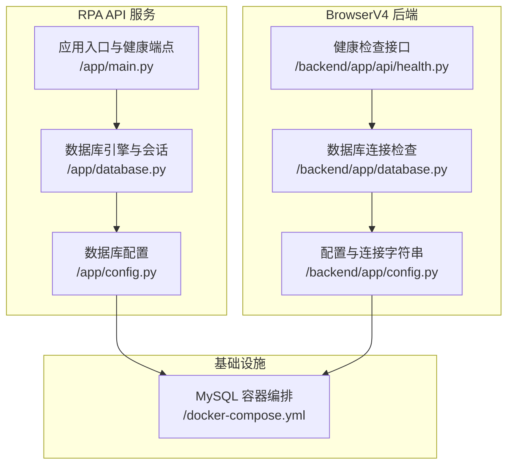
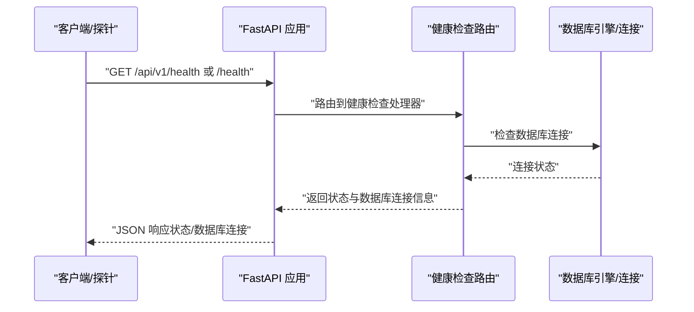
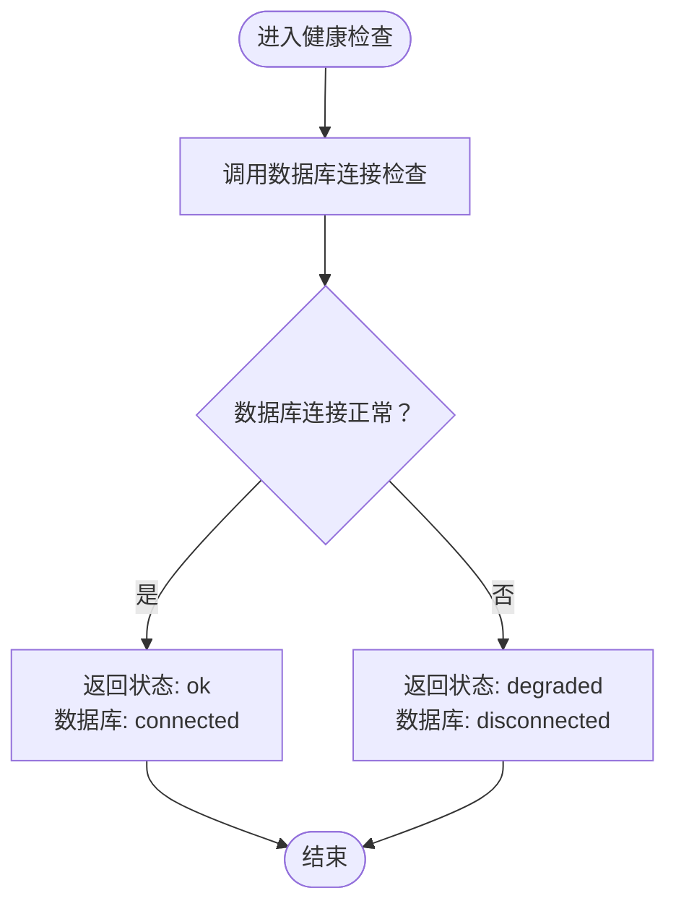
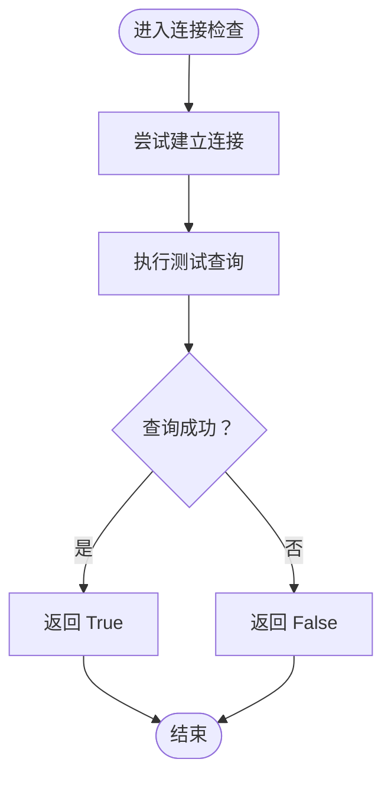
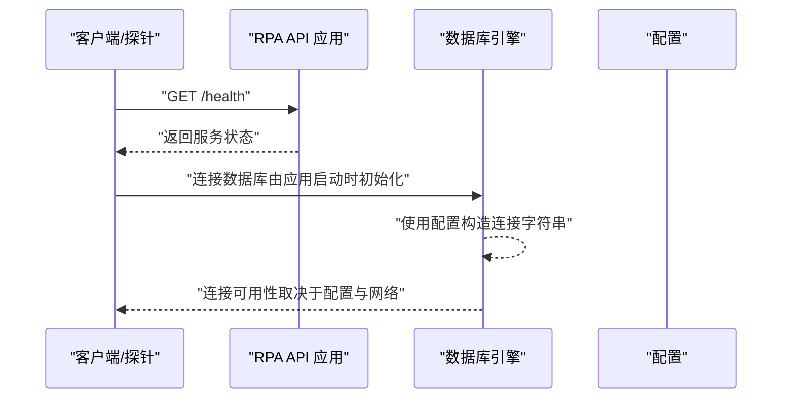
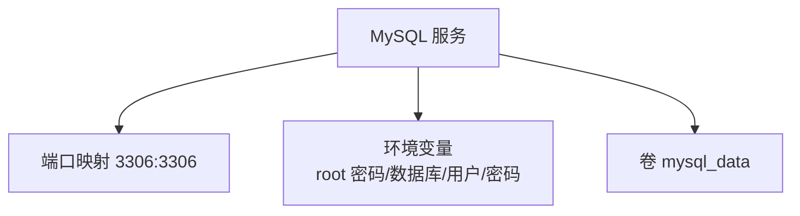
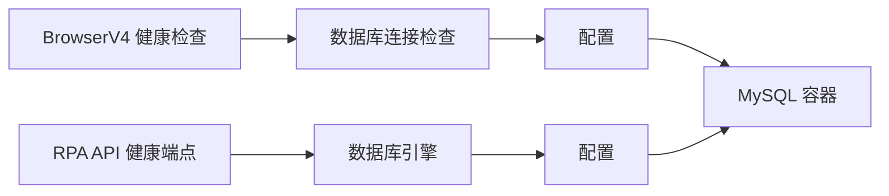
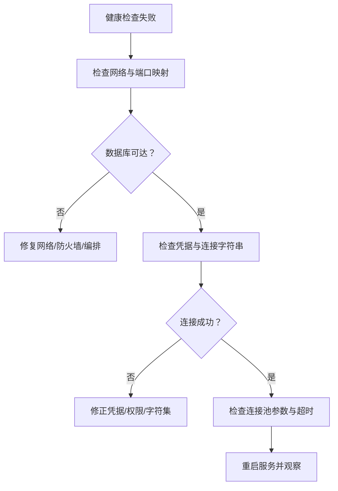

# 监控告警处理

<cite>
**本文引用的文件**
- [health.py](file://CCC-BrowserV4/backend/app/api/health.py)
- [database.py](file://CCC-BrowserV4/backend/app/database.py)
- [config.py](file://CCC-RPA-API/app/config.py)
- [database.py](file://CCC-RPA-API/app/database.py)
- [main.py](file://CCC-RPA-API/app/main.py)
- [docker-compose.yml](file://CCC-BrowserV4/docker-compose.yml)
- [project.md](file://project.md)
- [requirements.txt](file://CCC-RPA-API/requirements.txt)
</cite>

## 目录
1. [简介](#简介)
2. [项目结构](#项目结构)
3. [核心组件](#核心组件)
4. [架构总览](#架构总览)
5. [详细组件分析](#详细组件分析)
6. [依赖分析](#依赖分析)
7. [性能考虑](#性能考虑)
8. [故障排查指南](#故障排查指南)
9. [结论](#结论)
10. [附录](#附录)

## 简介
本文件面向商用级 AI 浏览器系统的监控与告警处理，结合仓库现有健康检查接口、数据库连接检查、API 健康端点以及项目整体 SRS 规范，系统化阐述如下主题：
- 系统健康检查的解读与处理：服务可用性监控、数据库连接状态、健康端点响应
- 资源使用率与性能指标异常的响应流程：基于 SRS 的资源硬限制、会话生命周期与异常处置
- 日志分析与关键错误识别：异常模式与根因分析思路
- 告警规则配置与阈值设置最佳实践：告警级别、重复抑制、通知渠道
- 应急响应流程：服务降级、故障转移、RTO 管理
- 监控数据采集与可视化：Prometheus、Grafana、自定义指标
- 故障演练与应急预案：演练设计与执行要点

## 项目结构
本仓库包含两套子系统：
- 浏览器前端与后端（BrowserV4）：提供健康检查接口与数据库连接检查
- RPA API 服务（RPA_API）：提供健康端点、数据库配置与连接管理

**图表来源**
- [health.py:1-18](file://CCC-BrowserV4/backend/app/api/health.py#L1-L18)
- [database.py:1-45](file://CCC-BrowserV4/backend/app/database.py#L1-L45)
- [config.py:1-22](file://CCC-BrowserV4/backend/app/config.py#L1-L22)
- [main.py:1-127](file://CCC-RPA-API/app/main.py#L1-L127)
- [config.py:1-22](file://CCC-RPA-API/app/config.py#L1-L22)
- [database.py:1-19](file://CCC-RPA-API/app/database.py#L1-L19)
- [docker-compose.yml:1-21](file://CCC-BrowserV4/docker-compose.yml#L1-L21)

**章节来源**
- [health.py:1-18](file://CCC-BrowserV4/backend/app/api/health.py#L1-L18)
- [database.py:1-45](file://CCC-BrowserV4/backend/app/database.py#L1-L45)
- [config.py:1-22](file://CCC-BrowserV4/backend/app/config.py#L1-L22)
- [main.py:1-127](file://CCC-RPA-API/app/main.py#L1-L127)
- [config.py:1-22](file://CCC-RPA-API/app/config.py#L1-L22)
- [database.py:1-19](file://CCC-RPA-API/app/database.py#L1-L19)
- [docker-compose.yml:1-21](file://CCC-BrowserV4/docker-compose.yml#L1-L21)

## 核心组件
- 健康检查接口（BrowserV4）：提供服务与数据库连接状态的健康检查端点，返回服务状态与数据库连接状态
- 数据库连接检查（BrowserV4）：封装数据库连接可用性检测，用于健康检查
- RPA API 健康端点：提供服务可用性检查
- 数据库配置与连接（RPA API）：提供数据库连接字符串与 SQLAlchemy 引擎
- MySQL 容器编排：定义数据库服务、端口映射、环境变量与卷

**章节来源**
- [health.py:10-17](file://CCC-BrowserV4/backend/app/api/health.py#L10-L17)
- [database.py:37-44](file://CCC-BrowserV4/backend/app/database.py#L37-L44)
- [main.py:114-116](file://CCC-RPA-API/app/main.py#L114-L116)
- [config.py:13-15](file://CCC-RPA-API/app/config.py#L13-L15)
- [database.py:5-6](file://CCC-RPA-API/app/database.py#L5-L6)
- [docker-compose.yml:4-17](file://CCC-BrowserV4/docker-compose.yml#L4-L17)

## 架构总览
下图展示了健康检查与数据库连接检查在系统中的位置与交互：

**图表来源**
- [health.py:10-17](file://CCC-BrowserV4/backend/app/api/health.py#L10-L17)
- [database.py:37-44](file://CCC-BrowserV4/backend/app/database.py#L37-L44)

## 详细组件分析

### 健康检查接口（BrowserV4）
- 路由与标签：定义健康检查路由与标签
- 处理逻辑：调用数据库连接检查函数，根据结果返回服务状态与数据库连接状态
- 返回结构：包含服务状态与数据库连接状态键值

**图表来源**
- [health.py:10-17](file://CCC-BrowserV4/backend/app/api/health.py#L10-L17)
- [database.py:37-44](file://CCC-BrowserV4/backend/app/database.py#L37-L44)

**章节来源**
- [health.py:10-17](file://CCC-BrowserV4/backend/app/api/health.py#L10-L17)
- [database.py:37-44](file://CCC-BrowserV4/backend/app/database.py#L37-L44)

### 数据库连接检查（BrowserV4）
- 引擎与会话：基于 SQLAlchemy 创建引擎与会话工厂
- 连接检查：通过执行简单查询验证连接可用性
- 异常处理：捕获异常并返回连接状态

**图表来源**
- [database.py:37-44](file://CCC-BrowserV4/backend/app/database.py#L37-L44)

**章节来源**
- [database.py:37-44](file://CCC-BrowserV4/backend/app/database.py#L37-L44)

### RPA API 健康端点与数据库配置
- 健康端点：提供服务可用性检查
- 数据库配置：构造数据库连接字符串
- 数据库引擎：创建 SQLAlchemy 引擎并启用连接池参数

**图表来源**
- [main.py:114-116](file://CCC-RPA-API/app/main.py#L114-L116)
- [config.py:13-15](file://CCC-RPA-API/app/config.py#L13-L15)
- [database.py:5-6](file://CCC-RPA-API/app/database.py#L5-L6)

**章节来源**
- [main.py:114-116](file://CCC-RPA-API/app/main.py#L114-L116)
- [config.py:13-15](file://CCC-RPA-API/app/config.py#L13-L15)
- [database.py:5-6](file://CCC-RPA-API/app/database.py#L5-L6)

### MySQL 容器编排
- 服务定义：MySQL 8.4 容器
- 端口映射：主机端口到容器端口
- 环境变量：根密码、数据库名、用户名与密码
- 卷：持久化数据目录

**图表来源**
- [docker-compose.yml:4-17](file://CCC-BrowserV4/docker-compose.yml#L4-L17)

**章节来源**
- [docker-compose.yml:4-17](file://CCC-BrowserV4/docker-compose.yml#L4-L17)

## 依赖分析
- BrowserV4 健康检查依赖数据库连接检查
- RPA API 健康端点与数据库引擎相互独立，但共同依赖配置
- MySQL 容器为两套系统提供数据库后端

**图表来源**
- [health.py:10-17](file://CCC-BrowserV4/backend/app/api/health.py#L10-L17)
- [database.py:37-44](file://CCC-BrowserV4/backend/app/database.py#L37-L44)
- [main.py:114-116](file://CCC-RPA-API/app/main.py#L114-L116)
- [config.py:13-15](file://CCC-RPA-API/app/config.py#L13-L15)
- [database.py:5-6](file://CCC-RPA-API/app/database.py#L5-L6)
- [docker-compose.yml:4-17](file://CCC-BrowserV4/docker-compose.yml#L4-L17)

**章节来源**
- [health.py:10-17](file://CCC-BrowserV4/backend/app/api/health.py#L10-L17)
- [database.py:37-44](file://CCC-BrowserV4/backend/app/database.py#L37-L44)
- [main.py:114-116](file://CCC-RPA-API/app/main.py#L114-L116)
- [config.py:13-15](file://CCC-RPA-API/app/config.py#L13-L15)
- [database.py:5-6](file://CCC-RPA-API/app/database.py#L5-L6)
- [docker-compose.yml:4-17](file://CCC-BrowserV4/docker-compose.yml#L4-L17)

## 性能考虑
- 连接池与预热：RPA API 初始化时创建数据库引擎并启用连接池参数，有助于减少连接开销
- 健康检查轻量：BrowserV4 的健康检查仅执行一次轻量查询以验证连接
- 资源硬限制：项目 SRS 规定单会话资源上限与异常处置策略，避免资源耗尽导致雪崩

**章节来源**
- [database.py:5-6](file://CCC-RPA-API/app/database.py#L5-L6)
- [database.py:37-44](file://CCC-BrowserV4/backend/app/database.py#L37-L44)
- [project.md:295-299](file://project.md#L295-L299)

## 故障排查指南

### 健康检查与数据库连接问题
- 现象：健康检查返回降级或连接失败
- 排查步骤：
  - 确认数据库服务可达与端口映射正确
  - 检查数据库凭据与连接字符串
  - 验证连接池参数与连接超时设置
- 处理建议：
  - 若连接失败，返回降级状态并触发告警
  - 在应用启动阶段进行连接测试，失败则记录错误并阻止服务进入就绪态

**图表来源**
- [database.py:37-44](file://CCC-BrowserV4/backend/app/database.py#L37-L44)
- [config.py:13-15](file://CCC-RPA-API/app/config.py#L13-L15)
- [docker-compose.yml:4-17](file://CCC-BrowserV4/docker-compose.yml#L4-L17)

**章节来源**
- [database.py:37-44](file://CCC-BrowserV4/backend/app/database.py#L37-L44)
- [config.py:13-15](file://CCC-RPA-API/app/config.py#L13-L15)
- [docker-compose.yml:4-17](file://CCC-BrowserV4/docker-compose.yml#L4-L17)

### 日志分析与关键错误识别
- 全链路审计日志：项目 SRS 明确要求 ELK 收集全量操作审计日志，日志留存 90 天
- 关键错误识别：
  - 数据库连接异常：连接失败、超时、权限不足
  - 会话崩溃与资源耗尽：结合 SRS 的资源硬限制与异常处置策略
  - API 网关过载：基于任务队列与限流的异常模式
- 根因分析：
  - 使用时间线串联日志与指标，定位首次异常点
  - 结合会话状态机与生命周期事件，回溯异常触发条件

**章节来源**
- [project.md:431-433](file://project.md#L431-L433)
- [project.md:437-443](file://project.md#L437-L443)

### 告警规则配置与阈值设置最佳实践
- 告警级别定义：
  - 服务不可用：健康检查持续失败
  - 降级可用：数据库断连或关键接口延迟超阈
  - 性能异常：会话创建耗时、AI 推理耗时、API QPS 等指标超阈
- 重复告警抑制：
  - 同一指标在周期内仅首次告警，后续静默直至恢复
  - 使用告警分组与静默窗口避免风暴
- 通知渠道配置：
  - 邮件、IM、电话分级通知
  - 与值班与工单系统联动

**章节来源**
- [project.md:427-433](file://project.md#L427-L433)

### 应急响应流程
- 服务降级策略：
  - 限流与熔断：API 网关对过载接口进行限流与快速失败
  - 降级开关：在异常情况下关闭非关键功能
- 故障转移机制：
  - 数据库主从切换：在数据库故障时自动切换备用节点
  - 会话自愈：单会话崩溃自动销毁并重建
- 恢复时间目标（RTO）管理：
  - 会话与服务的 RTO 与 RPO 明确，确保在故障后快速恢复

**章节来源**
- [project.md:441-443](file://project.md#L441-L443)
- [project.md:540](file://project.md#L540)

### 监控数据采集与可视化配置
- Prometheus 集成：
  - 采集指标：Pod/进程 CPU、内存、CDP 长连接数量、AI 推理耗时、会话崩溃次数、代理 IP 失效数量
  - 指标暴露：在浏览器镜像与服务中集成指标导出
- Grafana 仪表板：
  - 全局与租户双维度指标大盘
  - 健康检查成功率、数据库连接可用率、资源使用率
- 自定义指标定义：
  - 会话生命周期事件、任务执行耗时、错误率与重试次数

**章节来源**
- [project.md:427-429](file://project.md#L427-L429)
- [project.md:425-433](file://project.md#L425-L433)

### 故障演练与应急预案
- 演练设计：
  - 数据库断连演练：模拟数据库不可达，验证健康检查降级与告警
  - 资源耗尽演练：逐步提升会话并发，验证资源硬限制与销毁策略
  - API 网关过载演练：通过压测工具制造瞬时高并发，验证限流与熔断
- 应急预案：
  - 明确各组件负责人与升级路径
  - 准备一键回滚与快速修复脚本
  - 定期更新演练计划并评估告警有效性

**章节来源**
- [project.md:435-443](file://project.md#L435-L443)

## 结论
本文件基于仓库现有健康检查与数据库连接能力，结合项目 SRS 的监控、告警与应急响应规范，给出了系统化的监控告警处理框架。建议在现有基础上补充：
- Prometheus 指标导出与 Grafana 仪表板
- 健康检查与数据库连接的自动化探测与告警
- 基于 SRS 的资源硬限制与异常处置的可观测性闭环
- 定期演练与应急预案的制度化与流程化

## 附录

### API 健康检查端点一览
- BrowserV4 健康检查：返回服务状态与数据库连接状态
- RPA API 健康检查：返回服务可用性状态

**章节来源**
- [health.py:10-17](file://CCC-BrowserV4/backend/app/api/health.py#L10-L17)
- [main.py:114-116](file://CCC-RPA-API/app/main.py#L114-L116)

### 数据库配置与连接要点
- 连接字符串构造：基于配置类属性拼接
- 连接池参数：预热与回收策略
- 健康检查：轻量查询验证连接

**章节来源**
- [config.py:13-15](file://CCC-RPA-API/app/config.py#L13-L15)
- [database.py:5-6](file://CCC-RPA-API/app/database.py#L5-L6)
- [database.py:37-44](file://CCC-BrowserV4/backend/app/database.py#L37-L44)