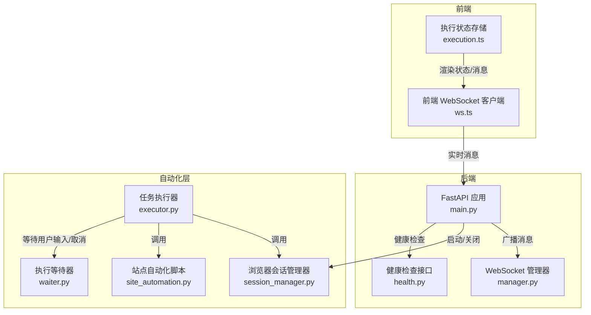
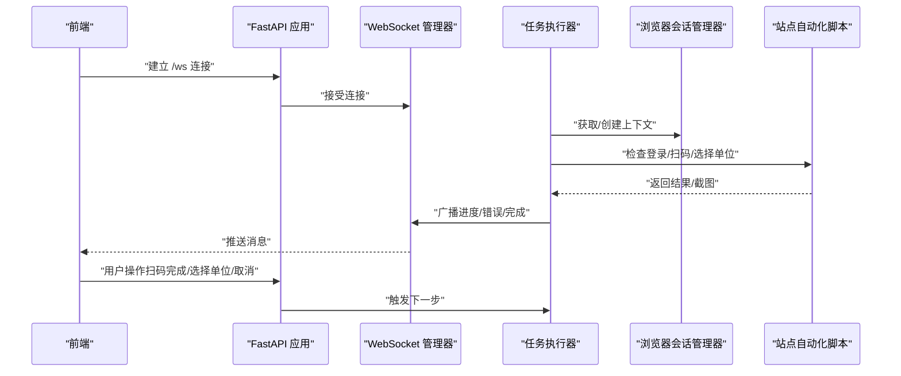
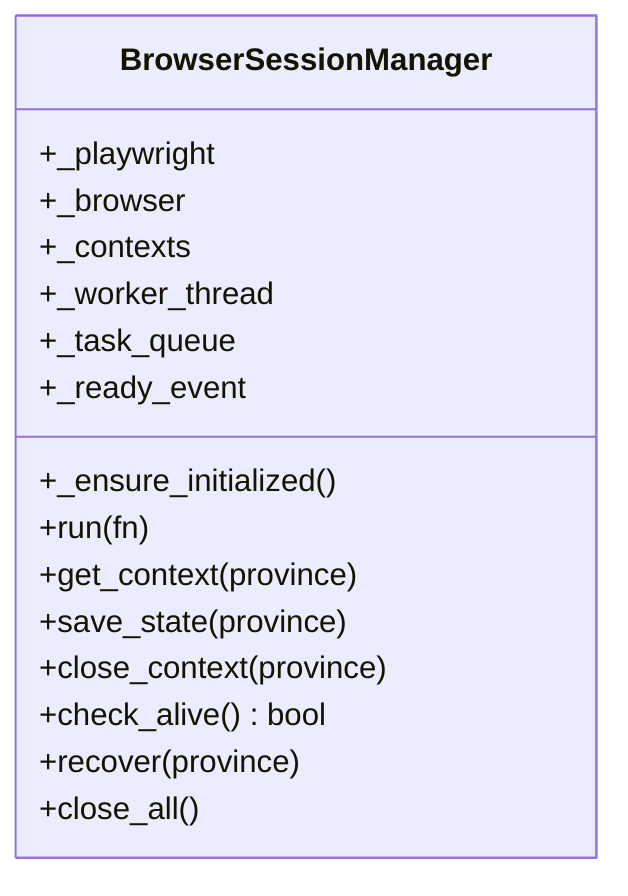
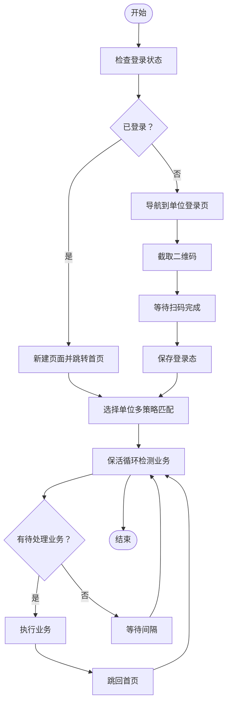
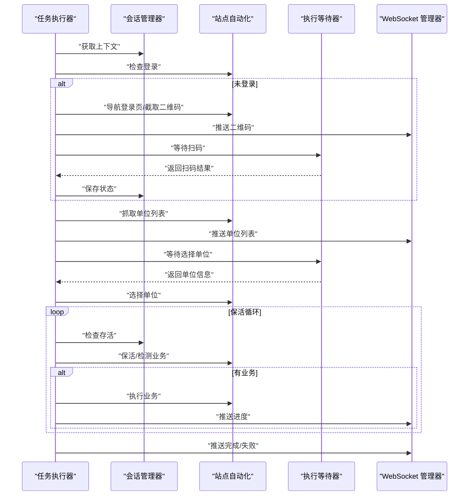
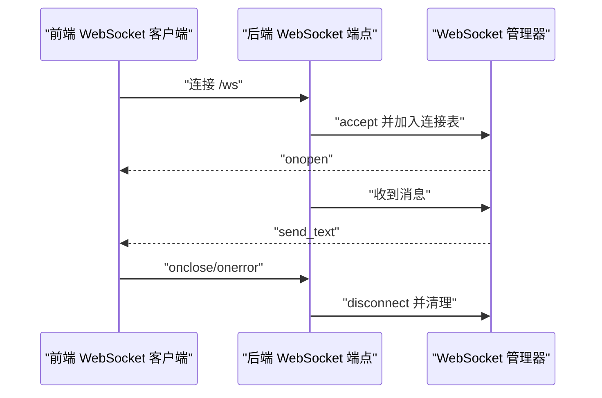
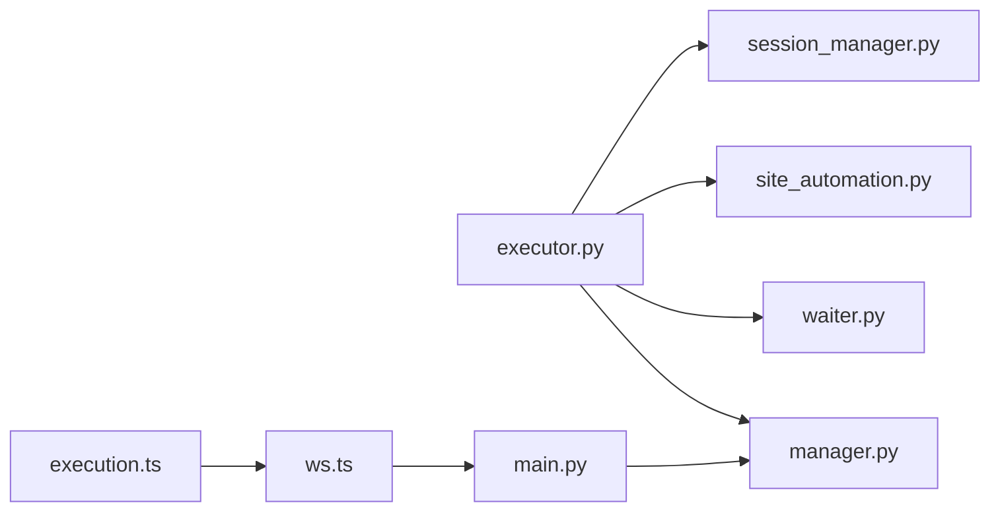

# 运行时问题排查

<cite>
**本文档引用的文件**
- [main.py](file://CCC_RPA_API/app/main.py)
- [session_manager.py](file://CCC_RPA_API/app/browser/session_manager.py)
- [site_automation.py](file://CCC_RPA_API/app/browser/site_automation.py)
- [executor.py](file://CCC_RPA_API/app/services/executor.py)
- [manager.py](file://CCC_RPA_API/app/ws/manager.py)
- [waiter.py](file://CCC_RPA_API/app/browser/waiter.py)
- [task.py](file://CCC_RPA_API/app/models/task.py)
- [execution_log.py](file://CCC_RPA_API/app/models/execution_log.py)
- [ws.ts](file://CCC-BrowserV4/frontend/src/api/ws.ts)
- [execution.ts](file://CCC-BrowserV4/frontend/src/stores/execution.ts)
- [health.py](file://CCC-BrowserV4/backend/app/api/health.py)
</cite>

## 目录
1. [简介](#简介)
2. [项目结构](#项目结构)
3. [核心组件](#核心组件)
4. [架构总览](#架构总览)
5. [详细组件分析](#详细组件分析)
6. [依赖关系分析](#依赖关系分析)
7. [性能考量](#性能考量)
8. [故障排查指南](#故障排查指南)
9. [结论](#结论)
10. [附录](#附录)

## 简介
本文件面向运行时问题排查，聚焦以下场景：
- 浏览器会话创建失败与 Playwright 自动化异常
- AI 推理超时（本项目以自动化为主，此处指页面自动化逻辑超时）
- WebSocket 连接断开、消息推送失败与实时通信异常
- 任务执行中断、状态同步错误与数据不一致
- 页面加载超时、元素查找失败与操作执行异常
- 内存泄漏检测、CPU 使用率异常与网络连接问题
- 日志分析方法与调试工具使用

## 项目结构
系统由三部分组成：
- 后端 API（FastAPI）：提供任务执行、浏览器会话管理、WebSocket 广播与健康检查
- 前端（Vue + Pinia）：负责用户交互、实时消息展示与演示模式
- 浏览器自动化层：基于 Playwright 的会话管理与站点自动化脚本

图表来源
- [main.py:12-127](file://CCC_RPA_API/app/main.py#L12-L127)
- [manager.py:1-29](file://CCC_RPA_API/app/ws/manager.py#L1-L29)
- [session_manager.py:1-183](file://CCC_RPA_API/app/browser/session_manager.py#L1-L183)
- [site_automation.py:1-562](file://CCC_RPA_API/app/browser/site_automation.py#L1-L562)
- [executor.py:1-308](file://CCC_RPA_API/app/services/executor.py#L1-L308)
- [waiter.py:1-84](file://CCC_RPA_API/app/browser/waiter.py#L1-L84)
- [ws.ts:1-88](file://CCC-BrowserV4/frontend/src/api/ws.ts#L1-L88)
- [execution.ts:1-229](file://CCC-BrowserV4/frontend/src/stores/execution.ts#L1-L229)
- [health.py:1-18](file://CCC-BrowserV4/backend/app/api/health.py#L1-L18)

章节来源
- [main.py:12-127](file://CCC_RPA_API/app/main.py#L12-L127)
- [ws.ts:1-88](file://CCC-BrowserV4/frontend/src/api/ws.ts#L1-L88)
- [execution.ts:1-229](file://CCC-BrowserV4/frontend/src/stores/execution.ts#L1-L229)

## 核心组件
- 浏览器会话管理器：负责 Playwright 初始化、上下文生命周期管理、storage_state 持久化与会话恢复
- 站点自动化脚本：封装登录、扫码、单位列表抓取、单位选择、保活与业务检测等动作
- 任务执行器：编排任务生命周期，协调浏览器操作、等待用户输入、广播状态、记录日志
- WebSocket 管理器：维护连接、广播消息、清理无效连接
- 执行等待器：基于 Event 的阻塞/取消/检查机制
- 前端 WebSocket 客户端与执行状态存储：接收后端消息并驱动 UI

章节来源
- [session_manager.py:7-183](file://CCC_RPA_API/app/browser/session_manager.py#L7-L183)
- [site_automation.py:16-562](file://CCC_RPA_API/app/browser/site_automation.py#L16-L562)
- [executor.py:1-308](file://CCC_RPA_API/app/services/executor.py#L1-L308)
- [manager.py:5-29](file://CCC_RPA_API/app/ws/manager.py#L5-L29)
- [waiter.py:7-84](file://CCC_RPA_API/app/browser/waiter.py#L7-L84)
- [ws.ts:8-88](file://CCC-BrowserV4/frontend/src/api/ws.ts#L8-L88)
- [execution.ts:6-229](file://CCC-BrowserV4/frontend/src/stores/execution.ts#L6-L229)

## 架构总览
后端通过 WebSocket 与前端实时通信；任务执行在专用线程池中进行，浏览器操作通过会话管理器在独立工作线程中执行，避免与 asyncio 事件循环冲突。

图表来源
- [main.py:119-127](file://CCC_RPA_API/app/main.py#L119-L127)
- [manager.py:10-27](file://CCC_RPA_API/app/ws/manager.py#L10-L27)
- [executor.py:68-304](file://CCC_RPA_API/app/services/executor.py#L68-L304)
- [session_manager.py:77-94](file://CCC_RPA_API/app/browser/session_manager.py#L77-L94)
- [site_automation.py:38-146](file://CCC_RPA_API/app/browser/site_automation.py#L38-L146)

## 详细组件分析

### 组件一：浏览器会话管理器（BrowserSessionManager）
职责与要点：
- 在专用线程中启动 Playwright 与 Chromium，避免与 asyncio 冲突
- 提供线程安全的上下文获取、状态保存、上下文关闭与全量关闭
- 通过 storage_state 文件持久化登录态，按省份隔离
- 提供存活检查与自动恢复能力
- 通过队列与事件实现跨线程调用与超时控制

图表来源
- [session_manager.py:7-183](file://CCC_RPA_API/app/browser/session_manager.py#L7-L183)

章节来源
- [session_manager.py:27-94](file://CCC_RPA_API/app/browser/session_manager.py#L27-L94)
- [session_manager.py:95-183](file://CCC_RPA_API/app/browser/session_manager.py#L95-L183)

### 组件二：站点自动化脚本（SiteAutomation）
职责与要点：
- 登录状态检查、单位登录页导航、二维码截图
- 单位列表抓取（多级降级选择器）、单位选择（多策略匹配）
- 页面保活（滚动、点击、等待）、待处理业务检测
- 对“浏览器已关闭”类错误进行识别与上抛，确保执行器能感知并恢复

图表来源
- [site_automation.py:38-562](file://CCC_RPA_API/app/browser/site_automation.py#L38-L562)

章节来源
- [site_automation.py:38-146](file://CCC_RPA_API/app/browser/site_automation.py#L38-L146)
- [site_automation.py:194-291](file://CCC_RPA_API/app/browser/site_automation.py#L194-L291)
- [site_automation.py:294-419](file://CCC_RPA_API/app/browser/site_automation.py#L294-L419)
- [site_automation.py:436-500](file://CCC_RPA_API/app/browser/site_automation.py#L436-L500)
- [site_automation.py:502-554](file://CCC_RPA_API/app/browser/site_automation.py#L502-L554)

### 组件三：任务执行器（Executor）
职责与要点：
- 记录执行日志、广播执行进度与错误、处理异常并更新任务状态
- 在专用线程池中调度任务逻辑，避免阻塞 WebSocket 广播
- 通过执行等待器等待用户扫码与选择单位，支持超时与取消
- 在保活循环中周期性检查浏览器存活，必要时恢复会话并重新打开页面

图表来源
- [executor.py:68-304](file://CCC_RPA_API/app/services/executor.py#L68-L304)
- [waiter.py:14-84](file://CCC_RPA_API/app/browser/waiter.py#L14-L84)
- [manager.py:17-27](file://CCC_RPA_API/app/ws/manager.py#L17-L27)

章节来源
- [executor.py:22-33](file://CCC_RPA_API/app/services/executor.py#L22-L33)
- [executor.py:42-59](file://CCC_RPA_API/app/services/executor.py#L42-L59)
- [executor.py:68-304](file://CCC_RPA_API/app/services/executor.py#L68-L304)

### 组件四：WebSocket 管理器与前端连接
职责与要点：
- 后端维护连接集合，广播消息并对异常连接进行清理
- 前端实现自动重连、消息解析与处理器注册
- 前端执行状态存储根据消息类型更新 UI 状态

图表来源
- [main.py:119-127](file://CCC_RPA_API/app/main.py#L119-L127)
- [manager.py:10-27](file://CCC_RPA_API/app/ws/manager.py#L10-L27)
- [ws.ts:20-85](file://CCC-BrowserV4/frontend/src/api/ws.ts#L20-L85)

章节来源
- [manager.py:1-29](file://CCC_RPA_API/app/ws/manager.py#L1-L29)
- [ws.ts:8-88](file://CCC-BrowserV4/frontend/src/api/ws.ts#L8-L88)
- [execution.ts:22-67](file://CCC-BrowserV4/frontend/src/stores/execution.ts#L22-L67)

## 依赖关系分析
- 任务执行器依赖会话管理器与站点自动化脚本，同时通过 WebSocket 管理器与前端通信
- 执行等待器为执行器提供阻塞/取消/检查能力
- 前端通过 WebSocket 客户端与后端交互，并通过状态存储驱动 UI

图表来源
- [executor.py:10-16](file://CCC_RPA_API/app/services/executor.py#L10-L16)
- [session_manager.py:1-10](file://CCC_RPA_API/app/browser/session_manager.py#L1-L10)
- [site_automation.py:1-7](file://CCC_RPA_API/app/browser/site_automation.py#L1-L7)
- [waiter.py:1-4](file://CCC_RPA_API/app/browser/waiter.py#L1-L4)
- [manager.py:1-3](file://CCC_RPA_API/app/ws/manager.py#L1-L3)
- [ws.ts:1-4](file://CCC-BrowserV4/frontend/src/api/ws.ts#L1-L4)
- [execution.ts:1-6](file://CCC-BrowserV4/frontend/src/stores/execution.ts#L1-L6)
- [main.py:2-8](file://CCC_RPA_API/app/main.py#L2-L8)

章节来源
- [executor.py:10-16](file://CCC_RPA_API/app/services/executor.py#L10-L16)
- [main.py:2-8](file://CCC_RPA_API/app/main.py#L2-L8)

## 性能考量
- 线程模型：浏览器操作在专用线程中执行，避免阻塞事件循环；任务与等待在独立线程池中执行
- 超时控制：会话管理器对跨线程调用设置超时，站点自动化脚本对页面操作设置超时
- 资源释放：任务完成后关闭页面与上下文，退出时关闭所有浏览器实例
- 日志与调试：多处生成截图与日志，便于定位页面结构变化与元素定位失败

章节来源
- [session_manager.py:77-94](file://CCC_RPA_API/app/browser/session_manager.py#L77-L94)
- [site_automation.py:44-46](file://CCC_RPA_API/app/browser/site_automation.py#L44-L46)
- [site_automation.py:150-172](file://CCC_RPA_API/app/browser/site_automation.py#L150-L172)
- [executor.py:301-304](file://CCC_RPA_API/app/services/executor.py#L301-L304)

## 故障排查指南

### 1. 浏览器会话创建失败与 Playwright 自动化异常
- 现象
  - 启动后端报错或超时
  - 任务执行时报“浏览器已关闭”或“操作超时”
- 排查步骤
  - 检查后端启动日志中“Playwright + Chromium 初始化完成”的提示
  - 确认会话管理器的专用线程已就绪且超时时间足够
  - 观察是否存在“浏览器异常，正在恢复…”广播
  - 检查 storage_state 文件是否存在与可读
- 解决建议
  - 增加初始化超时时间
  - 检查无头模式参数与沙箱配置
  - 在异常时调用恢复流程并重新打开页面
  - 关注页面加载超时与元素可见性判断

章节来源
- [session_manager.py:27-75](file://CCC_RPA_API/app/browser/session_manager.py#L27-L75)
- [session_manager.py:77-94](file://CCC_RPA_API/app/browser/session_manager.py#L77-L94)
- [session_manager.py:144-167](file://CCC_RPA_API/app/browser/session_manager.py#L144-L167)
- [executor.py:42-59](file://CCC_RPA_API/app/services/executor.py#L42-L59)

### 2. WebSocket 连接断开、消息推送失败与实时通信异常
- 现象
  - 前端控制台打印“连接断开”，随后自动重连
  - 页面无进度消息或消息解析失败
- 排查步骤
  - 检查后端 WebSocket 端点是否正常接入连接
  - 观察广播过程中是否有异常导致连接被移除
  - 确认前端 WebSocket 客户端的协议与主机地址拼装正确
- 解决建议
  - 前端启用指数退避重连
  - 后端在异常时清理无效连接
  - 前端在消息解析失败时记录错误并重连

章节来源
- [main.py:119-127](file://CCC_RPA_API/app/main.py#L119-L127)
- [manager.py:17-27](file://CCC_RPA_API/app/ws/manager.py#L17-L27)
- [ws.ts:20-85](file://CCC-BrowserV4/frontend/src/api/ws.ts#L20-L85)

### 3. 任务执行中断、状态同步错误与数据不一致
- 现象
  - 任务状态未更新或更新延迟
  - 执行日志缺失或状态字段为空
- 排查步骤
  - 检查任务与执行日志模型字段映射
  - 确认任务执行器在异常分支中仍提交数据库变更
  - 核对广播消息类型与前端状态存储的映射
- 解决建议
  - 在 finally 中清理等待器并关闭数据库连接
  - 确保失败时也更新任务状态与日志
  - 前端仅在无更详细错误时设置默认失败消息

章节来源
- [task.py:8-25](file://CCC_RPA_API/app/models/task.py#L8-L25)
- [execution_log.py:7-17](file://CCC_RPA_API/app/models/execution_log.py#L7-L17)
- [executor.py:275-304](file://CCC_RPA_API/app/services/executor.py#L275-L304)
- [execution.ts:54-67](file://CCC-BrowserV4/frontend/src/stores/execution.ts#L54-L67)

### 4. 页面加载超时、元素查找失败与操作执行异常
- 现象
  - 登录页导航失败或二维码未出现
  - 单位列表抓取失败或单位选择点击不到
  - 保活操作异常或业务检测失败
- 排查步骤
  - 检查页面截图与日志输出，确认页面结构变化
  - 使用降级选择器与多策略匹配提升鲁棒性
  - 确认等待条件（URL 变化、元素出现、网络空闲）合理
- 解决建议
  - 为关键步骤增加截图与日志
  - 采用多级选择器与文本匹配策略
  - 适当放宽超时并增加重试与降级

章节来源
- [site_automation.py:44-52](file://CCC_RPA_API/app/browser/site_automation.py#L44-L52)
- [site_automation.py:68-146](file://CCC_RPA_API/app/browser/site_automation.py#L68-L146)
- [site_automation.py:150-172](file://CCC_RPA_API/app/browser/site_automation.py#L150-L172)
- [site_automation.py:194-291](file://CCC_RPA_API/app/browser/site_automation.py#L194-L291)
- [site_automation.py:294-419](file://CCC_RPA_API/app/browser/site_automation.py#L294-L419)
- [site_automation.py:436-500](file://CCC_RPA_API/app/browser/site_automation.py#L436-L500)
- [site_automation.py:502-554](file://CCC_RPA_API/app/browser/site_automation.py#L502-L554)

### 5. 内存泄漏检测、CPU 使用率异常与网络连接问题
- 现象
  - 服务运行一段时间后内存持续增长
  - CPU 使用率异常升高
  - 网络请求频繁超时或连接不稳定
- 排查步骤
  - 检查浏览器上下文与页面是否正确关闭
  - 观察保活循环间隔与等待时间是否过短
  - 使用健康检查接口确认数据库连接状态
- 解决建议
  - 在任务结束与异常分支中确保资源释放
  - 合理设置保活间隔与等待上限
  - 通过健康检查接口与日志定位数据库连接问题

章节来源
- [session_manager.py:172-183](file://CCC_RPA_API/app/browser/session_manager.py#L172-L183)
- [executor.py:198-256](file://CCC_RPA_API/app/services/executor.py#L198-L256)
- [main.py:114-116](file://CCC_RPA_API/app/main.py#L114-L116)
- [health.py:10-17](file://CCC-BrowserV4/backend/app/api/health.py#L10-L17)

### 6. 日志分析方法与调试工具使用
- 日志位置
  - 后端：标准输出与异常栈信息
  - 前端：控制台日志与消息解析错误
  - 自动化：临时截图文件与页面标题/URL 输出
- 调试建议
  - 在关键节点添加截图与日志
  - 使用健康检查接口快速判断服务与数据库状态
  - 前端在消息解析失败时记录错误并尝试重连

章节来源
- [executor.py:275-277](file://CCC_RPA_API/app/services/executor.py#L275-L277)
- [ws.ts:35-41](file://CCC-BrowserV4/frontend/src/api/ws.ts#L35-L41)
- [site_automation.py:204-211](file://CCC_RPA_API/app/browser/site_automation.py#L204-L211)
- [health.py:10-17](file://CCC-BrowserV4/backend/app/api/health.py#L10-L17)

## 结论
本系统通过“专用线程 + 事件循环 + WebSocket 广播”的架构，实现了稳定的浏览器自动化与实时通信。针对常见运行时问题，建议重点关注：
- 会话管理器的初始化与恢复流程
- 自动化脚本的多策略降级与超时控制
- WebSocket 的连接稳定性与消息一致性
- 任务执行器的状态更新与资源释放
- 日志与截图的辅助定位能力

## 附录
- 常用排查清单
  - 后端启动日志是否包含“Playwright 初始化完成”
  - storage_state 文件是否存在且可读
  - 前端是否在 onclose 时触发重连
  - 任务日志是否在异常与成功分支均提交
  - 页面截图与日志是否记录关键步骤
  - 健康检查接口返回是否正常