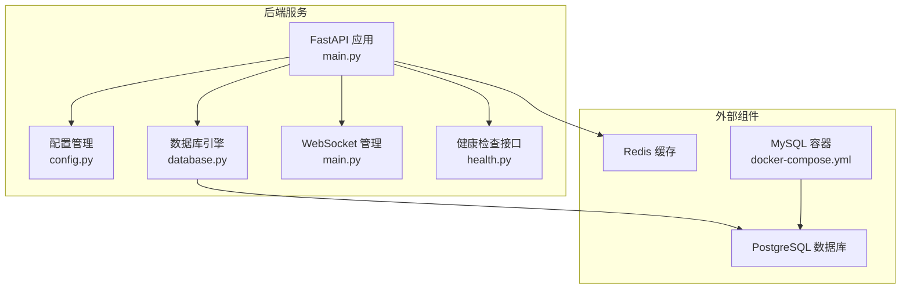
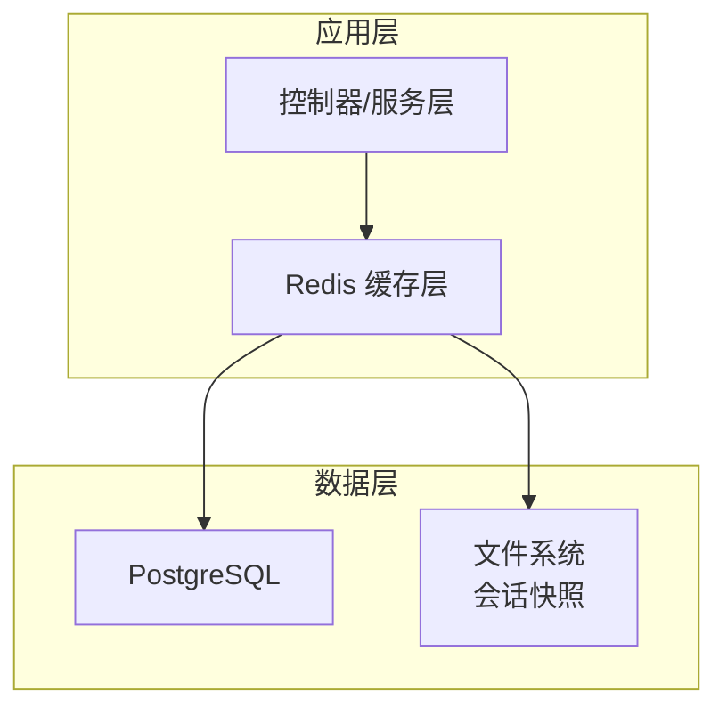
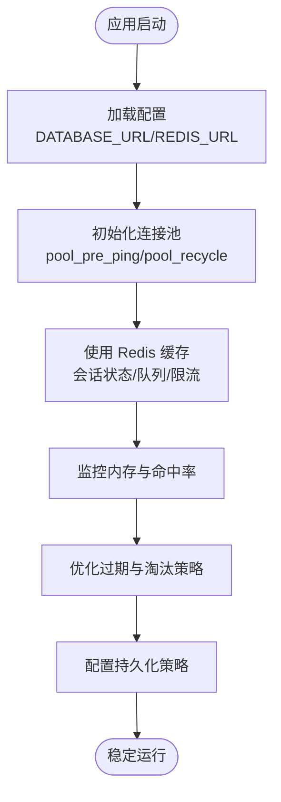
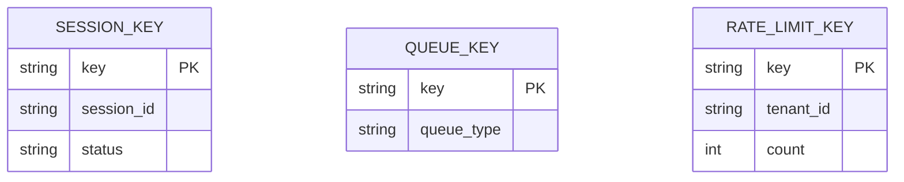
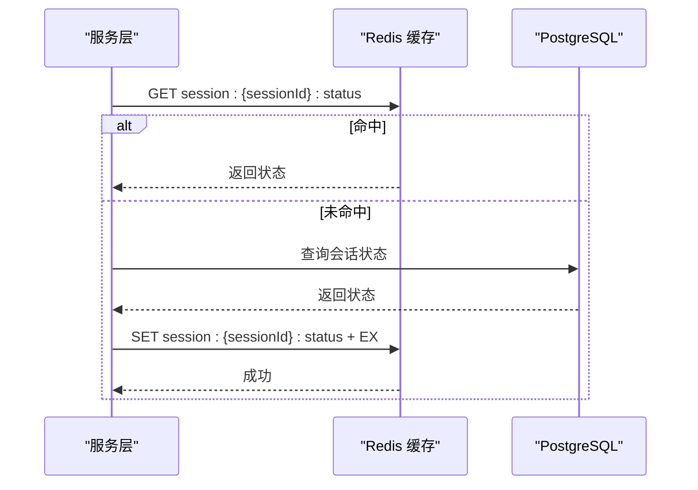
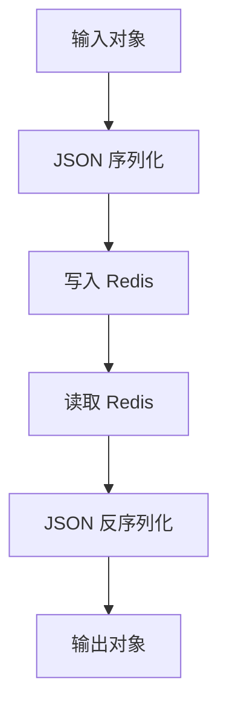
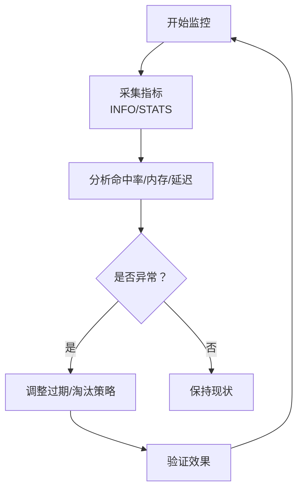
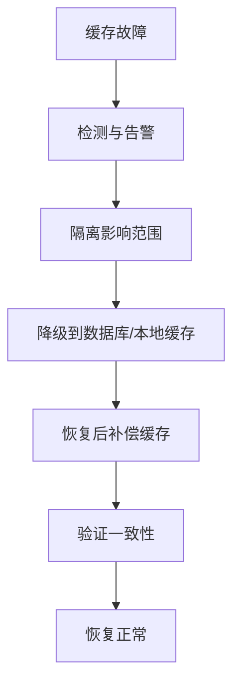
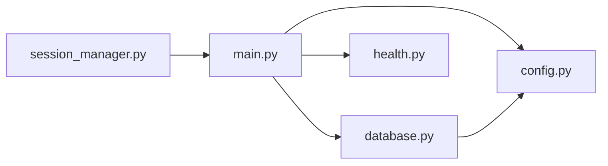

# Redis 缓存系统

<cite>
**本文档引用的文件**
- [project.md](file://project.md)
- [config.py](file://CCC-RPA_API/app/config.py)
- [database.py](file://CCC-RPA_API/app/database.py)
- [main.py](file://CCC_RPA_API/app/main.py)
- [session_manager.py](file://CCC_RPA_API/app/browser/session_manager.py)
- [health.py](file://CCC-BrowserV4/backend/app/api/health.py)
- [docker-compose.yml](file://CCC-BrowserV4/docker-compose.yml)
</cite>

## 目录
1. [简介](#简介)
2. [项目结构](#项目结构)
3. [核心组件](#核心组件)
4. [架构总览](#架构总览)
5. [详细组件分析](#详细组件分析)
6. [依赖关系分析](#依赖关系分析)
7. [性能考虑](#性能考虑)
8. [故障排除指南](#故障排除指南)
9. [结论](#结论)
10. [附录](#附录)

## 简介
本文件面向 Redis 缓存系统的综合文档，结合项目设计规范与现有代码实现，系统阐述缓存架构设计、配置策略、Key 设计规范、缓存策略、序列化处理、性能监控与调优、以及故障处理与恢复策略。项目整体采用 PostgreSQL 作为核心业务数据库，Redis 用于缓存会话临时状态、任务队列与接口限流计数，并配套定时任务进行缓存清理与快照管理。

## 项目结构
- 后端服务采用 Python FastAPI，数据库连接通过 SQLAlchemy 管理，提供统一的配置入口与连接池参数。
- 项目文档明确了 Redis 的统一 Key 设计与缓存职责边界，涵盖会话状态、任务队列、限流计数等场景。
- 前端与后端通过 WebSocket 进行实时通信，后端提供健康检查接口以验证数据库连接状态。

**图表来源**
- [main.py:1-127](file://CCC_RPA_API/app/main.py#L1-L127)
- [config.py:1-22](file://CCC-RPA_API/app/config.py#L1-L22)
- [database.py:1-19](file://CCC-RPA_API/app/database.py#L1-L19)
- [health.py:1-17](file://CCC-BrowserV4/backend/app/api/health.py#L1-L17)
- [docker-compose.yml:1-20](file://CCC-BrowserV4/docker-compose.yml#L1-L20)

**章节来源**
- [main.py:1-127](file://CCC_RPA_API/app/main.py#L1-L127)
- [config.py:1-22](file://CCC-RPA_API/app/config.py#L1-L22)
- [database.py:1-19](file://CCC-RPA_API/app/database.py#L1-L19)
- [health.py:1-17](file://CCC-BrowserV4/backend/app/api/health.py#L1-L17)
- [docker-compose.yml:1-20](file://CCC-BrowserV4/docker-compose.yml#L1-L20)

## 核心组件
- 配置管理：集中管理数据库连接参数与环境变量，确保连接字符串与连接池参数的一致性。
- 数据库引擎：基于 SQLAlchemy 创建带连接池的数据库引擎，支持预检查与回收策略。
- 会话管理：浏览器会话管理器负责 Playwright 实例与上下文的生命周期管理，间接体现缓存对会话状态的依赖。
- 健康检查：提供服务与数据库连接状态的健康检查接口，便于监控与故障定位。

**章节来源**
- [config.py:1-22](file://CCC-RPA_API/app/config.py#L1-L22)
- [database.py:1-19](file://CCC-RPA_API/app/database.py#L1-L19)
- [session_manager.py:1-183](file://CCC_RPA_API/app/browser/session_manager.py#L1-L183)
- [health.py:1-17](file://CCC-BrowserV4/backend/app/api/health.py#L1-L17)

## 架构总览
Redis 在系统中的角色包括：
- 会话临时状态缓存：键前缀为 session:{sessionId}:status，用于存放会话运行时的临时状态。
- 任务队列：使用队列键 queue:browser_task，承载自动化任务的生产与消费。
- 接口限流计数：按租户维度的 rate_limit:tenant:{tenantId}，用于接口限流控制。

**图表来源**
- [project.md:574-581](file://project.md#L574-L581)

**章节来源**
- [project.md:574-581](file://project.md#L574-L581)

## 详细组件分析

### 缓存架构与配置策略
- 连接池设置：数据库连接池通过 SQLAlchemy 引擎参数进行配置，建议在 Redis 客户端同样启用连接池与超时控制，避免连接泄漏与阻塞。
- 内存管理：Redis 内存管理遵循项目规范，需结合淘汰策略与过期时间控制，确保会话状态与任务队列的内存占用可控。
- 持久化选项：根据数据重要性选择合适的持久化策略（RDB/AOF），对会话快照与关键计数进行持久化保障。

**图表来源**
- [database.py:1-19](file://CCC-RPA_API/app/database.py#L1-L19)
- [config.py:1-22](file://CCC-RPA_API/app/config.py#L1-L22)
- [project.md:574-581](file://project.md#L574-L581)

**章节来源**
- [database.py:1-19](file://CCC-RPA_API/app/database.py#L1-L19)
- [config.py:1-22](file://CCC-RPA_API/app/config.py#L1-L22)
- [project.md:574-581](file://project.md#L574-L581)

### 统一 Key 设计规范
- 命名约定：采用冒号分隔的层级命名，清晰表达键的作用域与对象标识。
- Key 结构：
  - 会话状态：session:{sessionId}:status
  - 任务队列：queue:browser_task
  - 接口限流：rate_limit:tenant:{tenantId}
- 作用域划分：按会话、任务、租户三个维度划分，避免键冲突与跨域污染。

**图表来源**
- [project.md:574-581](file://project.md#L574-L581)

**章节来源**
- [project.md:574-581](file://project.md#L574-L581)

### 缓存策略实现
- 读写策略：优先读缓存，未命中则回源数据库；写入时采用“先写数据库，再写缓存”的顺序，保证一致性。
- 缓存更新：在任务状态变更、会话状态更新时触发缓存更新；对队列操作采用原子性命令（如 LPUSH/RPOP）。
- 失效机制：为会话状态设置 TTL，结合任务生命周期管理；对过期数据通过定时任务清理。

**图表来源**
- [project.md:574-581](file://project.md#L574-L581)

**章节来源**
- [project.md:574-581](file://project.md#L574-L581)

### 序列化与反序列化处理
- 对象序列化：将复杂对象（如任务列表、会话状态）转换为 JSON 字符串存储，确保跨语言与跨组件兼容。
- 反序列化校验：读取后进行格式校验与异常处理，避免脏数据影响业务逻辑。
- 二进制优化：对于大对象或频繁读写的键，可考虑压缩或二进制序列化方案以降低内存占用。

**图表来源**
- [services/task.py:1-157](file://CCC_RPA_API/app/services/task.py#L1-L157)

**章节来源**
- [services/task.py:1-157](file://CCC_RPA_API/app/services/task.py#L1-L157)

### 缓存性能监控与调优
- 命中率统计：通过 Redis INFO 命令获取 keyspace hits/misses，计算命中率并设定阈值告警。
- 内存使用分析：关注 maxmemory、used_memory、keyspace 统计，结合 TTL 分布评估内存压力。
- 性能指标：QPS、延迟、过期键比例、内存碎片率等，作为容量规划与优化依据。
- 调优建议：合理设置过期时间、开启 maxmemory 策略、定期清理过期键、优化键空间结构。

**图表来源**
- [project.md:425-433](file://project.md#L425-L433)

**章节来源**
- [project.md:425-433](file://project.md#L425-L433)

### 故障处理与恢复策略
- 连接故障：当 Redis 不可用时，采用降级策略（直连数据库或本地缓存）并记录日志；恢复后自动补偿缓存。
- 数据不一致：通过幂等写入与版本控制修复；对关键键设置短 TTL 以减少不一致窗口。
- 恢复流程：在服务重启或缓存清空后，按任务生命周期重建必要缓存；对会话状态进行重建与校验。

**图表来源**
- [project.md:435-443](file://project.md#L435-L443)

**章节来源**
- [project.md:435-443](file://project.md#L435-L443)

## 依赖关系分析
- 应用依赖数据库引擎与配置管理，数据库引擎依赖配置中的连接字符串。
- 健康检查接口依赖数据库连接状态，用于服务可观测性。
- 会话管理器依赖 Playwright，间接体现缓存对会话状态的依赖。

**图表来源**
- [main.py:1-127](file://CCC_RPA_API/app/main.py#L1-L127)
- [config.py:1-22](file://CCC-RPA_API/app/config.py#L1-L22)
- [database.py:1-19](file://CCC-RPA_API/app/database.py#L1-L19)
- [health.py:1-17](file://CCC-BrowserV4/backend/app/api/health.py#L1-L17)
- [session_manager.py:1-183](file://CCC_RPA_API/app/browser/session_manager.py#L1-L183)

**章节来源**
- [main.py:1-127](file://CCC_RPA_API/app/main.py#L1-L127)
- [config.py:1-22](file://CCC-RPA_API/app/config.py#L1-L22)
- [database.py:1-19](file://CCC-RPA_API/app/database.py#L1-L19)
- [health.py:1-17](file://CCC-BrowserV4/backend/app/api/health.py#L1-L17)
- [session_manager.py:1-183](file://CCC_RPA_API/app/browser/session_manager.py#L1-L183)

## 性能考虑
- 连接池与超时：数据库连接池参数已明确，Redis 客户端应采用相同原则，避免连接风暴。
- 键设计优化：扁平化键结构，避免过深嵌套；对热点键进行拆分与分区。
- 批量操作：对多键操作采用 pipeline，减少 RTT；对队列操作使用阻塞式命令提升吞吐。
- 内存与持久化：结合 maxmemory 策略与持久化方案，平衡性能与可靠性。

## 故障排除指南
- 健康检查失败：检查数据库连接字符串与网络连通性；查看容器日志定位问题。
- 缓存不可用：确认 Redis 服务状态与网络策略；检查连接池耗尽与超时配置。
- 数据不一致：核查写入顺序与幂等性；对关键键设置 TTL 并定期清理。

**章节来源**
- [health.py:1-17](file://CCC-BrowserV4/backend/app/api/health.py#L1-L17)
- [docker-compose.yml:1-20](file://CCC-BrowserV4/docker-compose.yml#L1-L20)

## 结论
本 Redis 缓存系统遵循统一的 Key 设计与职责划分，结合数据库与文件系统的协同，形成完整的数据层架构。通过合理的连接池配置、内存管理与持久化策略，配合监控与故障恢复机制，能够满足高并发与高可用的业务需求。后续可在连接池参数、序列化优化与性能指标体系方面进一步完善。

## 附录
- 项目文档中明确了 Redis 的 Key 设计与缓存职责，建议在实现阶段严格遵循。
- 健康检查接口与数据库连接状态密切相关，建议将其纳入统一监控面板。

**章节来源**
- [project.md:574-581](file://project.md#L574-L581)
- [health.py:1-17](file://CCC-BrowserV4/backend/app/api/health.py#L1-L17)