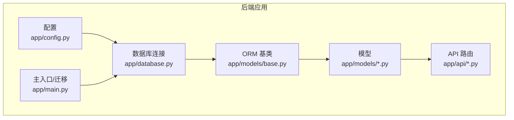
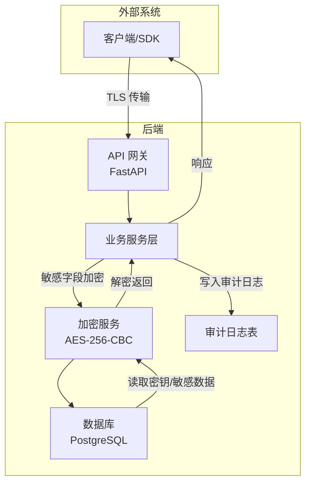
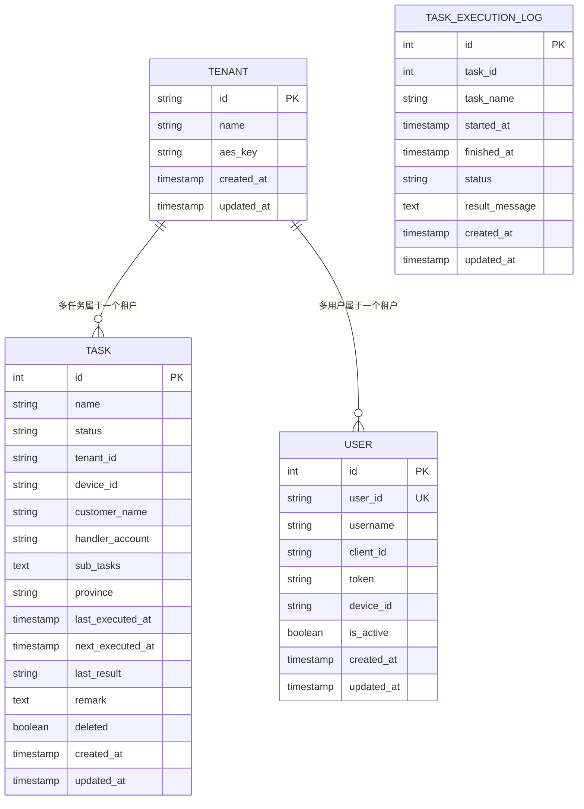
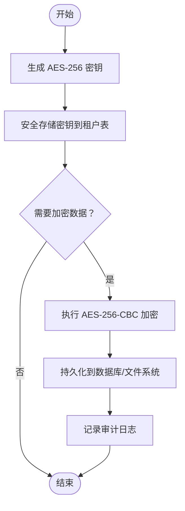
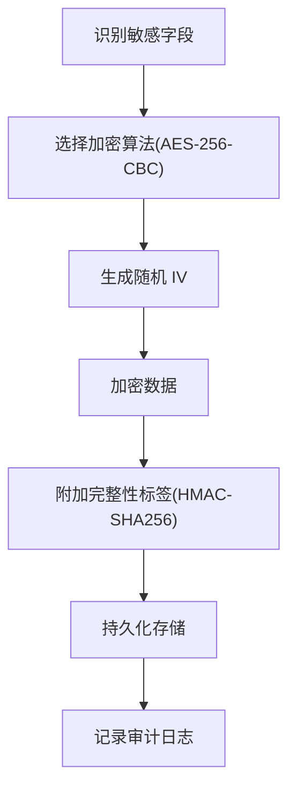
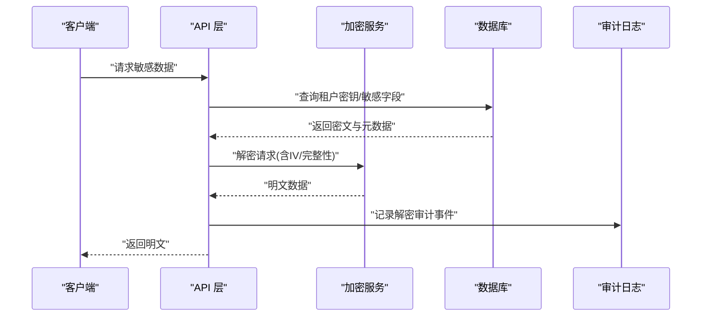
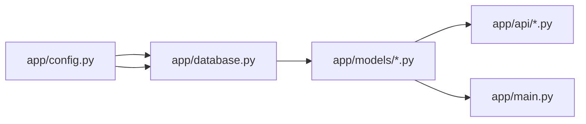

# 加密存储

<cite>
**本文引用的文件**
- [project.md](file://project.md)
- [config.py](file://CCC_RPA_API/app/config.py)
- [database.py](file://CCC_RPA_API/app/database.py)
- [base.py](file://CCC_RPA_API/app/models/base.py)
- [task.py](file://CCC_RPA_API/app/models/task.py)
- [user.py](file://CCC_RPA_API/app/models/user.py)
- [execution_log.py](file://CCC_RPA_API/app/models/execution_log.py)
- [tenants.py](file://CCC_RPA_API/app/api/tenants.py)
- [main.py](file://CCC_RPA_API/app/main.py)
</cite>

## 目录
1. [简介](#简介)
2. [项目结构](#项目结构)
3. [核心组件](#核心组件)
4. [架构总览](#架构总览)
5. [详细组件分析](#详细组件分析)
6. [依赖分析](#依赖分析)
7. [性能考虑](#性能考虑)
8. [故障排查指南](#故障排查指南)
9. [结论](#结论)
10. [附录](#附录)

## 简介
本文件面向“加密存储”主题，结合仓库中的需求文档与现有后端基础架构，系统化梳理 AES 加密在该系统中的设计目标、数据流、安全边界与可落地的实现建议。根据项目文档，系统明确要求：
- 会话快照文件采用 AES-256-CBC 加密，密钥存储于租户表独立字段；
- 数据库敏感字段（如租户密钥、代理地址等）需加密入库，不得存储明文；
- 存储安全、传输安全、隔离安全、访问安全与审计安全构成统一安全基线。

当前仓库后端以 FastAPI + SQLAlchemy 为基础，尚未包含具体加密实现代码；本文将基于现有结构与需求，给出可实施的加密存储方案与最佳实践。

## 项目结构
后端工程位于 CCC_RPA_API，核心由以下部分组成：
- 配置与数据库连接：设置数据库连接串、会话工厂与基础 ORM 类；
- 模型层：抽象基类与若干实体（任务、用户、执行日志等）；
- API 层：租户管理示例接口；
- 主入口：数据库迁移与初始化逻辑。

图表来源
- [config.py:1-22](file://CCC_RPA_API/app/config.py#L1-L22)
- [database.py:1-19](file://CCC_RPA_API/app/database.py#L1-L19)
- [base.py:1-11](file://CCC_RPA_API/app/models/base.py#L1-L11)
- [task.py:1-25](file://CCC_RPA_API/app/models/task.py#L1-L25)
- [user.py:1-17](file://CCC_RPA_API/app/models/user.py#L1-L17)
- [execution_log.py:1-17](file://CCC_RPA_API/app/models/execution_log.py#L1-L17)
- [tenants.py:1-25](file://CCC_RPA_API/app/api/tenants.py#L1-L25)
- [main.py:41-86](file://CCC_RPA_API/app/main.py#L41-L86)

章节来源
- [config.py:1-22](file://CCC_RPA_API/app/config.py#L1-L22)
- [database.py:1-19](file://CCC_RPA_API/app/database.py#L1-L19)
- [base.py:1-11](file://CCC_RPA_API/app/models/base.py#L1-L11)
- [task.py:1-25](file://CCC_RPA_API/app/models/task.py#L1-L25)
- [user.py:1-17](file://CCC_RPA_API/app/models/user.py#L1-L17)
- [execution_log.py:1-17](file://CCC_RPA_API/app/models/execution_log.py#L1-L17)
- [tenants.py:1-25](file://CCC_RPA_API/app/api/tenants.py#L1-L25)
- [main.py:41-86](file://CCC_RPA_API/app/main.py#L41-L86)

## 核心组件
- 配置与环境变量：集中管理数据库连接参数，并通过环境文件加载；
- 数据库连接与会话：通过 SQLAlchemy 创建连接池与会话工厂；
- ORM 基类：统一 created_at/updated_at 字段，便于审计与追踪；
- 模型实体：任务、用户、执行日志等，承载业务数据；
- API 路由：租户管理示例接口，体现多租户场景下的数据隔离；
- 主入口迁移：动态添加表列，确保数据库结构演进。

章节来源
- [config.py:1-22](file://CCC_RPA_API/app/config.py#L1-L22)
- [database.py:1-19](file://CCC_RPA_API/app/database.py#L1-L19)
- [base.py:1-11](file://CCC_RPA_API/app/models/base.py#L1-L11)
- [task.py:1-25](file://CCC_RPA_API/app/models/task.py#L1-L25)
- [user.py:1-17](file://CCC_RPA_API/app/models/user.py#L1-L17)
- [execution_log.py:1-17](file://CCC_RPA_API/app/models/execution_log.py#L1-L17)
- [tenants.py:1-25](file://CCC_RPA_API/app/api/tenants.py#L1-L25)
- [main.py:41-86](file://CCC_RPA_API/app/main.py#L41-L86)

## 架构总览
下图展示了加密存储在系统中的位置与交互关系：前端/SDK 与后端 API 通过 TLS 传输；后端在持久化前对敏感数据进行加密；密钥由租户维度管理，存储于数据库中对应字段；审计日志贯穿关键操作。

图表来源
- [project.md:518-530](file://project.md#L518-L530)
- [project.md:582-586](file://project.md#L582-L586)
- [config.py:1-22](file://CCC_RPA_API/app/config.py#L1-L22)
- [database.py:1-19](file://CCC_RPA_API/app/database.py#L1-L19)

## 详细组件分析

### 数据模型与敏感字段映射
- 任务模型：包含任务元数据与状态，可作为加密存储的载体之一；
- 用户模型：包含认证令牌等敏感字段，适合加密入库；
- 执行日志模型：用于记录任务执行过程，可纳入审计范围；
- 租户模型：根据需求文档，租户表需包含独立的 AES 密钥字段，用于会话快照与敏感字段的加解密。

图表来源
- [project.md:564](file://project.md#L564)
- [task.py:1-25](file://CCC_RPA_API/app/models/task.py#L1-L25)
- [user.py:1-17](file://CCC_RPA_API/app/models/user.py#L1-L17)
- [execution_log.py:1-17](file://CCC_RPA_API/app/models/execution_log.py#L1-L17)

章节来源
- [project.md:564](file://project.md#L564)
- [task.py:1-25](file://CCC_RPA_API/app/models/task.py#L1-L25)
- [user.py:1-17](file://CCC_RPA_API/app/models/user.py#L1-L17)
- [execution_log.py:1-17](file://CCC_RPA_API/app/models/execution_log.py#L1-L17)

### 加密服务与密钥管理
- 密钥生成：建议使用 32 字节随机密钥（AES-256），并以安全方式存储；
- 密钥存储：租户表新增独立字段保存密钥材料，仅在内存中以受控方式使用；
- 密钥轮换：支持密钥版本号或时间戳字段，实现平滑轮换与渐进迁移；
- 密钥安全管理：最小权限原则、密钥与明文分离、密钥生命周期管理。

图表来源
- [project.md:582-586](file://project.md#L582-L586)
- [project.md:564](file://project.md#L564)

章节来源
- [project.md:582-586](file://project.md#L582-L586)
- [project.md:564](file://project.md#L564)

### 敏感数据标识与加密策略
- 会话快照文件：采用 AES-256-CBC 加密，密钥来自租户表；
- 数据库敏感字段：如租户密钥、代理地址等，入库前加密，避免明文存储；
- 策略要点：字段白名单、加密算法一致性、填充与 IV 管理、完整性校验（建议 HMAC-SHA256）。

图表来源
- [project.md:582-586](file://project.md#L582-L586)

章节来源
- [project.md:582-586](file://project.md#L582-L586)

### 解密处理与访问控制
- 解密流程：从租户表加载密钥，结合存储的 IV 与完整性标签进行解密；
- 访问控制：基于租户维度的数据隔离，防止越权访问；
- 审计日志：记录所有加解密与敏感数据访问事件，支持检索与追溯。

图表来源
- [project.md:518-530](file://project.md#L518-L530)
- [project.md:582-586](file://project.md#L582-L586)

章节来源
- [project.md:518-530](file://project.md#L518-L530)
- [project.md:582-586](file://project.md#L582-L586)

### 数据库迁移与结构演进
- 主入口中包含动态迁移逻辑，用于添加新列（如任务表的多字段）；
- 建议在迁移阶段同步增加租户密钥字段与审计日志相关列；
- 迁移策略：幂等、回滚预案、灰度发布。

章节来源
- [main.py:41-86](file://CCC_RPA_API/app/main.py#L41-L86)

## 依赖分析
- 配置依赖：配置模块提供 DATABASE_URL，被数据库模块使用；
- 数据库依赖：数据库模块创建 engine 与会话工厂，供模型与服务层使用；
- 模型依赖：各模型继承 ORM 基类，共享 created_at/updated_at；
- API 依赖：路由层依赖模型与服务层，提供租户管理示例；
- 主入口依赖：迁移逻辑依赖数据库会话。

图表来源
- [config.py:1-22](file://CCC_RPA_API/app/config.py#L1-L22)
- [database.py:1-19](file://CCC_RPA_API/app/database.py#L1-L19)
- [base.py:1-11](file://CCC_RPA_API/app/models/base.py#L1-L11)
- [task.py:1-25](file://CCC_RPA_API/app/models/task.py#L1-L25)
- [user.py:1-17](file://CCC_RPA_API/app/models/user.py#L1-L17)
- [execution_log.py:1-17](file://CCC_RPA_API/app/models/execution_log.py#L1-L17)
- [tenants.py:1-25](file://CCC_RPA_API/app/api/tenants.py#L1-L25)
- [main.py:41-86](file://CCC_RPA_API/app/main.py#L41-L86)

章节来源
- [config.py:1-22](file://CCC_RPA_API/app/config.py#L1-L22)
- [database.py:1-19](file://CCC_RPA_API/app/database.py#L1-L19)
- [base.py:1-11](file://CCC_RPA_API/app/models/base.py#L1-L11)
- [task.py:1-25](file://CCC_RPA_API/app/models/task.py#L1-L25)
- [user.py:1-17](file://CCC_RPA_API/app/models/user.py#L1-L17)
- [execution_log.py:1-17](file://CCC_RPA_API/app/models/execution_log.py#L1-L17)
- [tenants.py:1-25](file://CCC_RPA_API/app/api/tenants.py#L1-L25)
- [main.py:41-86](file://CCC_RPA_API/app/main.py#L41-L86)

## 性能考虑
- 批量加密：合并小块数据，减少加解密次数与上下文切换；
- 缓存机制：对热点租户密钥进行短期缓存，降低数据库访问频率；
- 硬件加速：优先使用支持 AES-NI 的 CPU 或专用加密卡；
- 连接池与会话：复用数据库连接，避免频繁握手与事务开销；
- 审计日志异步化：将审计写入与业务主流程解耦，降低尾延迟。

## 故障排查指南
- 密钥加载失败：检查租户密钥字段是否正确写入与格式是否符合预期；
- 解密报错：确认 IV 长度与格式、完整性校验失败原因；
- 数据库迁移异常：关注幂等性与回滚策略，确保迁移脚本可重复执行；
- 审计日志缺失：核查审计写入逻辑与数据库权限；
- 性能瓶颈：定位加解密热点、缓存命中率与数据库连接池饱和度。

章节来源
- [main.py:41-86](file://CCC_RPA_API/app/main.py#L41-L86)

## 结论
本项目在需求层面已明确 AES-256-CBC 加密与密钥管理的基本要求。当前后端具备良好的 ORM 与 API 基础，下一步应在模型层补充密钥字段与敏感字段加密逻辑，并完善密钥轮换、缓存与审计机制，以满足安全基线与性能目标。

## 附录
- 安全评估与合规检查清单
  - 加密算法与密钥长度符合 AES-256 要求；
  - 密钥与明文分离，密钥存储满足最小权限；
  - 完整性校验（HMAC-SHA256）与随机 IV 使用；
  - 审计日志不可删除篡改，支持检索；
  - 多租户隔离有效，越权访问阻断；
  - 传输层使用 TLS，禁止明文；
  - 定期密钥轮换与密钥生命周期管理；
  - 性能基准达标（QPS、延迟、并发）。

- 兼容性与迁移建议
  - 新增字段采用幂等迁移；
  - 旧版本数据可通过离线迁移工具进行批量加密；
  - 提供密钥版本字段，支持平滑过渡；
  - 对外接口保持兼容，内部实现逐步增强。