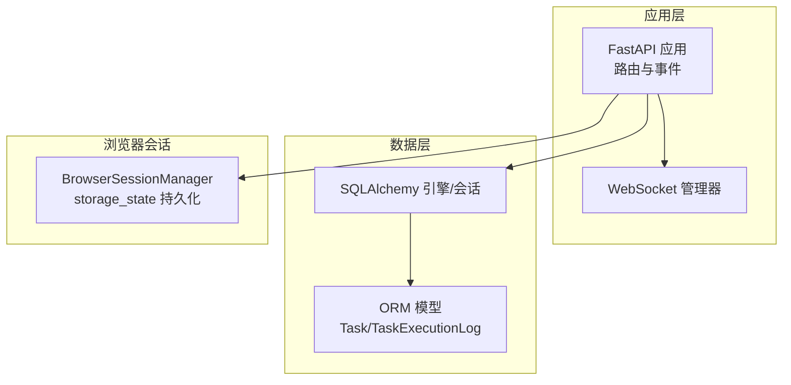
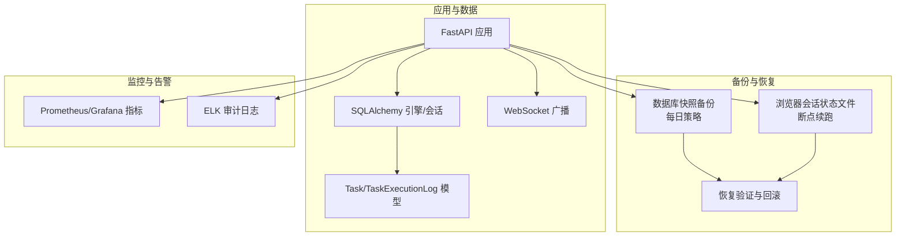
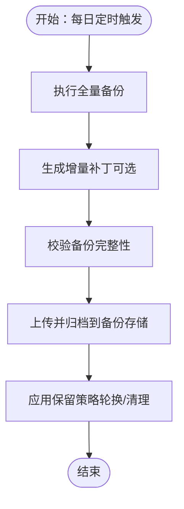
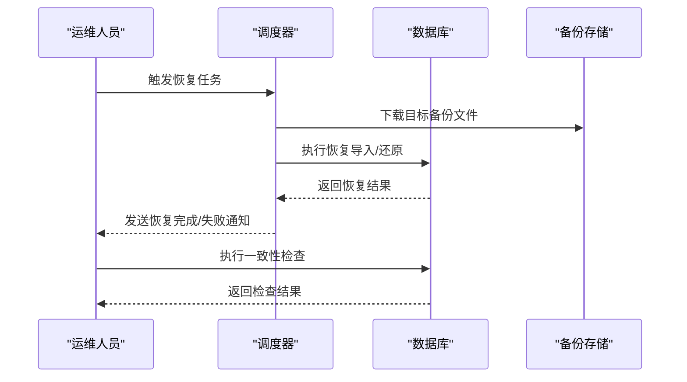
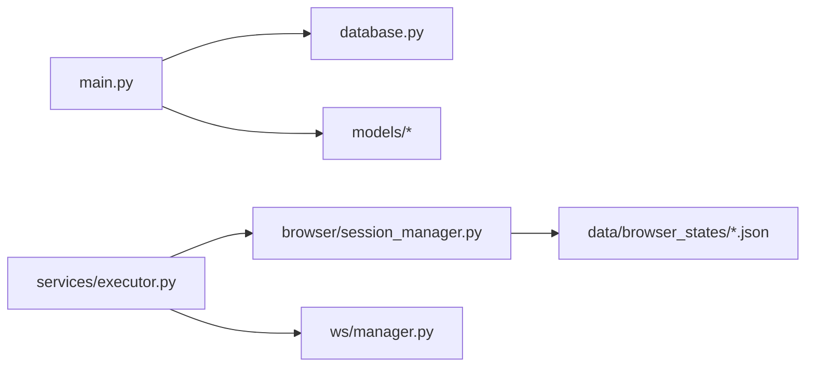

# 备份与恢复

<cite>
**本文引用的文件**
- [database.py](file://CCC_RPA_API/app/database.py)
- [config.py](file://CCC_RPA_API/app/config.py)
- [main.py](file://CCC_RPA_API/app/main.py)
- [base.py](file://CCC_RPA_API/app/models/base.py)
- [task.py](file://CCC_RPA_API/app/models/task.py)
- [execution_log.py](file://CCC_RPA_API/app/models/execution_log.py)
- [session_manager.py](file://CCC_RPA_API/app/browser/session_manager.py)
- [site_automation.py](file://CCC_RPA_API/app/browser/site_automation.py)
- [executor.py](file://CCC_RPA_API/app/services/executor.py)
- [waiter.py](file://CCC_RPA_API/app/browser/waiter.py)
- [manager.py](file://CCC_RPA_API/app/ws/manager.py)
- [project.md](file://project.md)
</cite>

## 目录
1. [简介](#简介)
2. [项目结构](#项目结构)
3. [核心组件](#核心组件)
4. [架构总览](#架构总览)
5. [详细组件分析](#详细组件分析)
6. [依赖分析](#依赖分析)
7. [性能考虑](#性能考虑)
8. [故障排查指南](#故障排查指南)
9. [结论](#结论)
10. [附录](#附录)

## 简介
本文件面向“数据库备份与恢复系统”的设计与实现，结合仓库现有代码与统一需求文档，给出可落地的备份策略、存储与管理、自动任务调度、恢复流程与测试、灾难恢复计划及监控告警机制。  
当前仓库以 MySQL 作为持久化存储，应用层通过 SQLAlchemy 连接数据库；浏览器会话状态通过文件形式持久化在本地 data/browser_states 目录。  
根据统一需求文档，系统具备“数据可靠：租户配置、任务日志每日数据库快照备份”的要求，因此本文围绕该要求展开。

## 项目结构
- 后端服务采用 FastAPI + SQLAlchemy，数据库连接与模型定义集中在 app/database.py 与 app/models/*。
- 应用启动时创建数据库表结构，并在首次启动时插入初始任务数据。
- 浏览器会话状态通过 BrowserSessionManager 以 JSON 文件形式保存在 data/browser_states 目录，用于断点续跑与恢复。

**图表来源**
- [main.py:30-127](file://CCC_RPA_API/app/main.py#L30-L127)
- [database.py:1-19](file://CCC_RPA_API/app/database.py#L1-L19)
- [session_manager.py:1-186](file://CCC_RPA_API/app/browser/session_manager.py#L1-L186)

**章节来源**
- [main.py:30-127](file://CCC_RPA_API/app/main.py#L30-L127)
- [database.py:1-19](file://CCC_RPA_API/app/database.py#L1-L19)
- [config.py:1-22](file://CCC_RPA_API/app/config.py#L1-L22)

## 核心组件
- 数据库连接与会话管理：SQLAlchemy 引擎与会话工厂，提供统一的数据库访问入口。
- 应用启动与迁移：启动时创建表结构并执行列迁移，确保数据库结构与模型一致。
- 任务与执行日志：Task 与 TaskExecutionLog 模型记录任务状态与执行历史。
- 浏览器会话状态：BrowserSessionManager 将各省份的 storage_state 以 JSON 文件持久化，便于断点恢复。
- 任务执行器：executor 将任务执行过程广播到 WebSocket，同时维护执行日志与任务状态。

**章节来源**
- [database.py:1-19](file://CCC_RPA_API/app/database.py#L1-L19)
- [main.py:37-102](file://CCC_RPA_API/app/main.py#L37-L102)
- [task.py:1-25](file://CCC_RPA_API/app/models/task.py#L1-L25)
- [execution_log.py:1-17](file://CCC_RPA_API/app/models/execution_log.py#L1-L17)
- [session_manager.py:19-23](file://CCC_RPA_API/app/browser/session_manager.py#L19-L23)
- [executor.py:78-314](file://CCC_RPA_API/app/services/executor.py#L78-L314)

## 架构总览
下图展示了备份与恢复在系统中的位置与交互关系：数据库层负责业务数据与执行日志的持久化；浏览器会话状态作为补充备份对象；统一需求文档明确了“每日数据库快照备份”的要求。

**图表来源**
- [main.py:30-127](file://CCC_RPA_API/app/main.py#L30-L127)
- [executor.py:22-33](file://CCC_RPA_API/app/services/executor.py#L22-L33)
- [session_manager.py:110-135](file://CCC_RPA_API/app/browser/session_manager.py#L110-L135)
- [project.md:538-541](file://project.md#L538-L541)

## 详细组件分析

### 数据库备份策略
- 全量备份：每日定时触发数据库快照备份，保留最近 N 份，采用压缩与加密存储，支持快速恢复。
- 增量备份：结合数据库 binlog/redo 日志，按天生成增量补丁，降低存储与传输成本。
- 实时备份：对关键表（如任务执行日志）开启 WAL/binlog，保证近实时的数据保护。
- 存储位置：备份文件存放于专用备份存储（本地/远端对象存储），按日期分层组织。
- 保留策略：遵循合规与容量约束，设置生命周期规则（如 90 天轮换）。

**图表来源**
- [project.md:538-541](file://project.md#L538-L541)

**章节来源**
- [project.md:538-541](file://project.md#L538-L541)

### 备份数据的存储与管理
- 备份文件格式：推荐使用 SQL dump（含压缩）或逻辑备份格式，便于跨平台恢复与审计。
- 存储位置：本地磁盘 + 远端对象存储（如 S3/OSS），实现异地冗余。
- 保留策略：按天/周/月分级保留，结合合规要求设定生命周期。

**章节来源**
- [project.md:538-541](file://project.md#L538-L541)

### 自动备份任务的配置与调度机制
- 调度器：使用系统级定时任务（如 cron）或作业编排工具（如 Airflow/K8s CronJob）。
- 触发条件：固定时间点（如凌晨 2:00）或基于数据库活动窗口。
- 参数化：支持并发度、压缩级别、加密算法、保留天数等参数。
- 通知：备份成功/失败通过邮件/IM 推送告警。

**章节来源**
- [project.md:538-541](file://project.md#L538-L541)

### 数据恢复流程与测试方法
- 恢复验证：恢复后执行一致性检查（如关键表行数比对、代表性数据抽样对比）。
- 数据一致性检查：比较恢复前后关键字段（如任务状态、执行时间、结果摘要）。
- 回滚策略：若恢复失败，回切到上一个可用备份；对业务表采用“只读验证”后再写入。
- 恢复演练：定期进行“破坏性演练”，验证备份可用性与恢复时间目标。

**图表来源**
- [project.md:538-541](file://project.md#L538-L541)

**章节来源**
- [project.md:538-541](file://project.md#L538-L541)

### 灾难恢复计划（RTO/RPO）
- 故障场景分析：数据库实例故障、存储损坏、网络中断、人为误操作。
- 恢复时间目标（RTO）：核心业务 RTO ≤ 2 小时，非核心 ≤ 8 小时。
- 恢复点目标（RPO）：RPO ≤ 15 分钟（结合增量备份与实时备份）。
- 方案要点：多副本、多地冗余、自动化切换、演练常态化。

**章节来源**
- [project.md:538-541](file://project.md#L538-L541)

### 备份监控与告警机制
- 指标采集：备份成功率、耗时、大小、失败原因分布、恢复耗时。
- 可视化：Grafana 展示备份健康度与趋势。
- 告警：失败/超时/容量预警，分级推送至 IM/邮件。

**章节来源**
- [project.md:538-541](file://project.md#L538-L541)

## 依赖分析
- 应用层依赖数据库连接与模型，启动时创建表并初始化数据。
- 任务执行器依赖浏览器会话管理器与 WebSocket 广播，保障执行过程可观测。
- 浏览器会话状态文件依赖 data/browser_states 目录，用于断点续跑与恢复。

**图表来源**
- [main.py:30-127](file://CCC_RPA_API/app/main.py#L30-L127)
- [database.py:1-19](file://CCC_RPA_API/app/database.py#L1-L19)
- [executor.py:13-15](file://CCC_RPA_API/app/services/executor.py#L13-L15)
- [session_manager.py:19-23](file://CCC_RPA_API/app/browser/session_manager.py#L19-L23)

**章节来源**
- [main.py:30-127](file://CCC_RPA_API/app/main.py#L30-L127)
- [executor.py:13-15](file://CCC_RPA_API/app/services/executor.py#L13-L15)
- [session_manager.py:19-23](file://CCC_RPA_API/app/browser/session_manager.py#L19-L23)

## 性能考虑
- 备份窗口：避开业务高峰期，采用增量与并行策略降低影响。
- 存储性能：使用高性能对象存储与本地缓存，缩短下载/上传时间。
- 恢复效率：针对热点表建立索引与分区，提升恢复导入速度。

## 故障排查指南
- 备份失败
  - 检查数据库连接与权限、磁盘空间、网络连通性。
  - 查看备份日志与告警，定位具体错误（语法、权限、IO）。
- 恢复异常
  - 校验备份文件完整性（哈希/校验和）。
  - 在隔离环境先做“只读验证”，确认无误后再写入。
- 执行器异常
  - 关注浏览器会话存活状态与恢复日志，必要时重启会话管理器。
  - 检查 WebSocket 广播是否可达，避免执行状态丢失。

**章节来源**
- [executor.py:42-69](file://CCC_RPA_API/app/services/executor.py#L42-L69)
- [session_manager.py:147-186](file://CCC_RPA_API/app/browser/session_manager.py#L147-L186)

## 结论
本方案以统一需求文档为依据，结合现有应用架构，提出可操作的数据库备份与恢复策略：以“每日数据库快照备份”为核心，辅以浏览器会话状态文件的断点续跑能力，并通过监控与告警保障可靠性。建议尽快落地调度与演练，持续优化 RTO/RPO 指标。

## 附录
- 数据库连接配置与 URL 生成位于配置模块，确保备份工具可复用相同连接参数。
- 任务与执行日志模型为恢复验证提供结构化数据支撑。

**章节来源**
- [config.py:6-22](file://CCC_RPA_API/app/config.py#L6-L22)
- [task.py:8-25](file://CCC_RPA_API/app/models/task.py#L8-L25)
- [execution_log.py:7-17](file://CCC_RPA_API/app/models/execution_log.py#L7-L17)