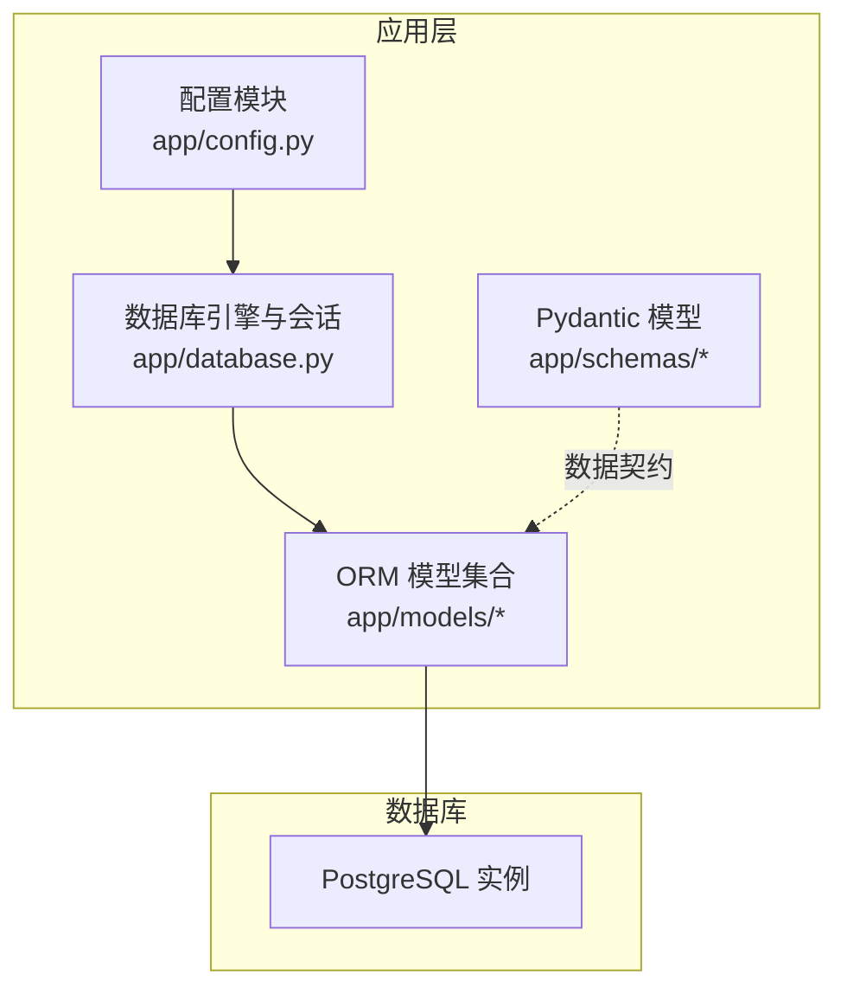
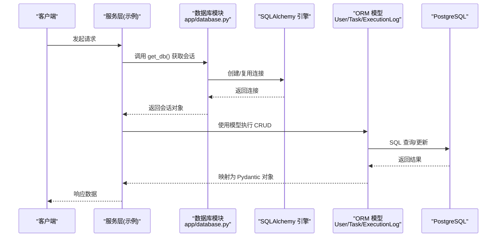
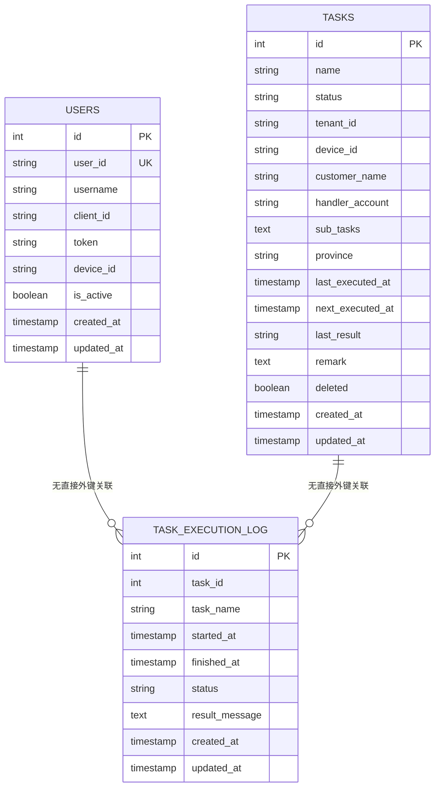
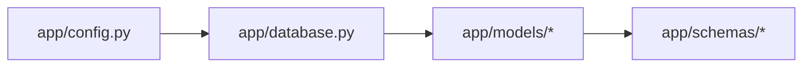

# 数据库设计

<cite>
**本文引用的文件**
- [app/database.py](file://CCC_RPA_API/app/database.py)
- [app/config.py](file://CCC_RPA_API/app/config.py)
- [app/models/base.py](file://CCC_RPA_API/app/models/base.py)
- [app/models/user.py](file://CCC_RPA_API/app/models/user.py)
- [app/models/task.py](file://CCC_RPA_API/app/models/task.py)
- [app/models/execution_log.py](file://CCC_RPA_API/app/models/execution_log.py)
- [app/models/__init__.py](file://CCC_RPA_API/app/models/__init__.py)
- [app/schemas/task.py](file://CCC_RPA_API/app/schemas/task.py)
- [app/schemas/execution_log.py](file://CCC_RPA_API/app/schemas/execution_log.py)
</cite>

## 目录
1. [简介](#简介)
2. [项目结构](#项目结构)
3. [核心组件](#核心组件)
4. [架构总览](#架构总览)
5. [详细组件分析](#详细组件分析)
6. [依赖分析](#依赖分析)
7. [性能考虑](#性能考虑)
8. [故障排查指南](#故障排查指南)
9. [结论](#结论)
10. [附录](#附录)

## 简介
本文件面向数据库设计与实现，基于后端服务中的 SQLAlchemy 模型与配置，系统化梳理 PostgreSQL 数据库的整体架构设计。内容涵盖核心业务表结构（用户表、任务表、执行日志表）、表间关系与外键约束、数据模型设计原则（实体关系映射、字段定义、数据类型选择、索引策略）、数据库连接池与会话管理、事务与并发控制、数据验证与业务约束、性能优化策略以及版本与迁移建议。

注意：当前仓库中数据库配置使用的是 MySQL 连接字符串（mysql+pymysql），但本文在数据库设计层面以 PostgreSQL 的通用实践进行阐述，并标注与实际实现的差异点，以便读者对照调整。

## 项目结构
后端采用 SQLAlchemy ORM 映射，通过统一的 Base 类派生出各业务模型；数据库引擎与会话工厂集中于 database.py；配置项集中在 config.py 中；Pydantic 模型用于请求/响应的数据校验与序列化。

图表来源
- [app/config.py:1-22](file://CCC_RPA_API/app/config.py#L1-L22)
- [app/database.py:1-19](file://CCC_RPA_API/app/database.py#L1-L19)
- [app/models/__init__.py:1-5](file://CCC_RPA_API/app/models/__init__.py#L1-L5)

章节来源
- [app/config.py:1-22](file://CCC_RPA_API/app/config.py#L1-L22)
- [app/database.py:1-19](file://CCC_RPA_API/app/database.py#L1-L19)
- [app/models/__init__.py:1-5](file://CCC_RPA_API/app/models/__init__.py#L1-L5)

## 核心组件
- 统一基类 BaseModel：提供通用的时间戳字段 created_at、updated_at 及其默认值设置。
- 用户模型 User：存储用户标识、认证令牌、设备绑定与激活状态等信息。
- 任务模型 Task：描述自动化任务的基本属性、状态、调度时间、结果标记与软删除标志。
- 执行日志模型 TaskExecutionLog：记录单次任务执行的开始/结束时间、状态与结果消息。
- 数据库引擎与会话：基于 SQLAlchemy 创建 engine 与 sessionmaker，提供 get_db 依赖注入接口。
- 配置中心：集中管理数据库主机、端口、用户名、密码与数据库名，并生成连接串。

章节来源
- [app/models/base.py:1-11](file://CCC_RPA_API/app/models/base.py#L1-L11)
- [app/models/user.py:1-17](file://CCC_RPA_API/app/models/user.py#L1-L17)
- [app/models/task.py:1-25](file://CCC_RPA_API/app/models/task.py#L1-L25)
- [app/models/execution_log.py:1-17](file://CCC_RPA_API/app/models/execution_log.py#L1-L17)
- [app/database.py:1-19](file://CCC_RPA_API/app/database.py#L1-L19)
- [app/config.py:1-22](file://CCC_RPA_API/app/config.py#L1-L22)

## 架构总览
下图展示从配置到模型、再到数据库的调用链路与职责边界：

图表来源
- [app/database.py:13-19](file://CCC_RPA_API/app/database.py#L13-L19)
- [app/models/user.py:7-17](file://CCC_RPA_API/app/models/user.py#L7-L17)
- [app/models/task.py:8-25](file://CCC_RPA_API/app/models/task.py#L8-L25)
- [app/models/execution_log.py:7-17](file://CCC_RPA_API/app/models/execution_log.py#L7-L17)

## 详细组件分析

### 数据模型与表结构
- 用户表 users
  - 主键：id（自增整数）
  - 唯一索引：user_id（字符串，长度 64）
  - 普通索引：user_id（重复声明，可合并为唯一索引）
  - 字段：username、client_id、token、device_id、is_active（布尔）
  - 时间戳：created_at、updated_at（继承自 BaseModel）

- 任务表 tasks
  - 主键：id（自增整数）
  - 普通索引：name、status、deleted（字符串，长度分别为 256、32、布尔）
  - 字段：tenant_id、device_id、customer_name、handler_account、sub_tasks（JSON 数组字符串）、province、last_executed_at、next_executed_at、last_result、remark
  - 时间戳：created_at、updated_at（继承自 BaseModel）

- 任务执行日志表 task_execution_log
  - 主键：id（自增整数）
  - 普通索引：task_id（整数）
  - 字段：task_id、task_name、started_at、finished_at、status、result_message
  - 时间戳：created_at、updated_at（继承自 BaseModel）

图表来源
- [app/models/user.py:7-17](file://CCC_RPA_API/app/models/user.py#L7-L17)
- [app/models/task.py:8-25](file://CCC_RPA_API/app/models/task.py#L8-L25)
- [app/models/execution_log.py:7-17](file://CCC_RPA_API/app/models/execution_log.py#L7-L17)

章节来源
- [app/models/user.py:1-17](file://CCC_RPA_API/app/models/user.py#L1-L17)
- [app/models/task.py:1-25](file://CCC_RPA_API/app/models/task.py#L1-L25)
- [app/models/execution_log.py:1-17](file://CCC_RPA_API/app/models/execution_log.py#L1-L17)
- [app/models/base.py:1-11](file://CCC_RPA_API/app/models/base.py#L1-L11)

### 表间关系与外键约束
- 当前模型未显式声明外键约束，但根据业务语义可推导如下关系：
  - 任务表与执行日志表：按字段 task_id 关联（逻辑外键）；建议在数据库层面添加外键约束，启用级联删除或限制更新，确保数据一致性。
  - 用户表与任务表：未发现直接外键关联；如需用户维度的多租户或权限控制，可在任务表增加 user_id 或 tenant_id 外键。
- 建议补充的外键约束（概念性说明，非现有实现）：
  - task_execution_log.task_id → tasks.id
  - tasks.user_id → users.id（若引入用户外键）

章节来源
- [app/models/task.py:11-24](file://CCC_RPA_API/app/models/task.py#L11-L24)
- [app/models/execution_log.py:10-11](file://CCC_RPA_API/app/models/execution_log.py#L10-L11)

### 数据类型与索引策略
- 数据类型选择
  - 字符串类字段普遍采用 String(n) 或 Text，满足不同长度需求；JSON 结构以 Text 存储，便于扩展。
  - 时间字段使用 DateTime，支持精确到秒的时间记录。
  - 布尔字段用于软删除与激活状态。
- 索引策略
  - 已有索引：users.user_id（唯一索引）、tasks.name/status/deleted（普通索引）、task_execution_log.task_id（普通索引）。
  - 建议优化：
    - 在 tasks.tenant_id、tasks.device_id 上建立索引，提升多租户/设备过滤效率。
    - 在 task_execution_log.started_at/finished_at 上建立索引，优化执行统计与报表查询。
    - 对高频过滤字段（如 tasks.status、users.is_active）建立复合索引，减少全表扫描。

章节来源
- [app/models/user.py:10-16](file://CCC_RPA_API/app/models/user.py#L10-L16)
- [app/models/task.py:11-24](file://CCC_RPA_API/app/models/task.py#L11-L24)
- [app/models/execution_log.py:10-16](file://CCC_RPA_API/app/models/execution_log.py#L10-L16)

### 数据验证与业务约束
- Pydantic 模型用于输入输出校验：
  - 任务创建/更新/响应模型分别定义必填与可选字段，保证 API 层数据完整性。
  - 执行日志响应模型映射 ORM 属性，确保序列化一致。
- 业务约束建议：
  - 在数据库层面增加 CHECK 约束，限定 status 字段枚举值（如 pending/running/completed/failed）。
  - 对 JSON 字段（sub_tasks）增加校验触发器或应用层校验，确保格式正确。
  - 对时间字段（last_executed_at/next_executed_at）增加约束，确保调度时序合理。

章节来源
- [app/schemas/task.py:5-58](file://CCC_RPA_API/app/schemas/task.py#L5-L58)
- [app/schemas/execution_log.py:4-19](file://CCC_RPA_API/app/schemas/execution_log.py#L4-L19)

### 连接池、事务与并发控制
- 连接池配置
  - engine 初始化参数：pool_pre_ping=true（自动探测失效连接并重连）、pool_recycle=3600（连接回收周期，避免长时间占用导致的连接异常）。
- 会话与依赖注入
  - sessionmaker 绑定 engine，get_db 提供依赖注入函数，确保每个请求使用独立会话并在结束后关闭。
- 事务与并发
  - 默认 autocommit=false、autoflush=false，由上层控制事务边界；建议在服务层明确开启/回滚/提交，避免长事务阻塞。
  - 对高并发写入场景，建议结合数据库层面的行级锁与唯一索引，防止竞态条件。

章节来源
- [app/database.py:5-6](file://CCC_RPA_API/app/database.py#L5-L6)
- [app/database.py:13-19](file://CCC_RPA_API/app/database.py#L13-L19)

### 性能优化策略
- 查询优化
  - 为高频过滤字段建立合适索引；对范围查询（时间字段）优先使用索引覆盖。
  - 使用分页查询（page/page_size）避免一次性加载大量数据。
- 索引设计
  - 唯一索引：users.user_id；普通索引：tasks.name/status/deleted、task_execution_log.task_id。
  - 建议新增：tasks.tenant_id、tasks.device_id、task_execution_log.started_at/finished_at。
- 分区策略
  - 对执行日志表按时间分区（如按月/季度），降低大表扫描成本，提升归档与清理效率。
- 其他建议
  - 使用 EXPLAIN/ANALYZE 分析慢查询，定位缺失索引或不合理的连接顺序。
  - 对 JSON 字段的查询尽量避免在 WHERE 子句中进行全文检索，必要时考虑规范化或物化列。

章节来源
- [app/models/task.py:11-24](file://CCC_RPA_API/app/models/task.py#L11-L24)
- [app/models/execution_log.py:10-16](file://CCC_RPA_API/app/models/execution_log.py#L10-L16)
- [app/database.py:5-6](file://CCC_RPA_API/app/database.py#L5-L6)

### 版本管理与迁移策略
- 当前实现现状
  - 未发现显式的数据库迁移脚本或 Alembic 配置；模型变更需手动同步至数据库。
- 推荐方案
  - 引入 Alembic：初始化迁移仓库，将 ORM 模型作为“权威源”，通过版本化迁移脚本管理结构演进。
  - 迁移流程建议：
    - 新增字段：使用 alter table 添加列并设置默认值。
    - 删除字段：先迁移数据，再 drop column。
    - 修改索引：先 drop 后 create，避免长时间锁表。
    - 添加外键：在数据清洗完成后添加约束，确保参照完整性。
  - 回滚策略：保留安全的回滚点，对生产环境执行前进行充分测试与备份。

章节来源
- [app/models/__init__.py:1-5](file://CCC_RPA_API/app/models/__init__.py#L1-L5)

## 依赖分析
- 模块耦合
  - models 依赖 database.Base 与 config.settings；database 依赖 config.settings 与 SQLAlchemy。
  - schemas 与 models 解耦，仅通过 ORM 对象映射（from_attributes）交互。
- 外部依赖
  - SQLAlchemy ORM 与数据库驱动（当前为 mysql+pymysql，实际部署可替换为 PostgreSQL 驱动）。
  - Pydantic 用于数据校验与序列化。

图表来源
- [app/config.py:1-22](file://CCC_RPA_API/app/config.py#L1-L22)
- [app/database.py:1-19](file://CCC_RPA_API/app/database.py#L1-L19)
- [app/models/__init__.py:1-5](file://CCC_RPA_API/app/models/__init__.py#L1-L5)
- [app/schemas/task.py:49-50](file://CCC_RPA_API/app/schemas/task.py#L49-L50)
- [app/schemas/execution_log.py:13-14](file://CCC_RPA_API/app/schemas/execution_log.py#L13-L14)

章节来源
- [app/config.py:1-22](file://CCC_RPA_API/app/config.py#L1-L22)
- [app/database.py:1-19](file://CCC_RPA_API/app/database.py#L1-L19)
- [app/models/__init__.py:1-5](file://CCC_RPA_API/app/models/__init__.py#L1-L5)
- [app/schemas/task.py:49-50](file://CCC_RPA_API/app/schemas/task.py#L49-L50)
- [app/schemas/execution_log.py:13-14](file://CCC_RPA_API/app/schemas/execution_log.py#L13-L14)

## 性能考虑
- 连接池与会话
  - pool_pre_ping 与 pool_recycle 有助于维持连接健康，降低因网络波动导致的失败重试成本。
  - 建议根据并发量调整连接池大小（max_overflow、pool_size），避免连接耗尽。
- 写入性能
  - 批量插入/更新时使用 SQLAlchemy 的 bulk_* 方法，减少往返次数。
  - 控制事务粒度，避免长事务持有行级锁。
- 读取性能
  - 使用 selectinload/joinload 减少 N+1 查询问题。
  - 对热点查询建立复合索引，覆盖常用过滤与排序字段。

章节来源
- [app/database.py:5-6](file://CCC_RPA_API/app/database.py#L5-L6)

## 故障排查指南
- 连接失败
  - 检查 DATABASE_URL 是否正确（当前为 MySQL 字符串，部署 PostgreSQL 时需替换驱动与参数）。
  - 核对主机、端口、用户名、密码与数据库名是否匹配。
- 会话泄漏
  - 确保每次请求结束后调用 db.close()；使用 get_db 的上下文管理确保异常时也能释放资源。
- 索引缺失导致慢查询
  - 使用 EXPLAIN/EXPLAIN ANALYZE 分析执行计划，针对性补充索引。
- 数据不一致
  - 对关键字段（status、deleted）增加约束与触发器，或在应用层加强校验。
  - 对外键关系（如任务与日志）建议在数据库层面强制约束，避免逻辑外键带来的维护成本。

章节来源
- [app/config.py:13-15](file://CCC_RPA_API/app/config.py#L13-L15)
- [app/database.py:13-19](file://CCC_RPA_API/app/database.py#L13-L19)
- [app/models/task.py:11-24](file://CCC_RPA_API/app/models/task.py#L11-L24)
- [app/models/execution_log.py:10-16](file://CCC_RPA_API/app/models/execution_log.py#L10-L16)

## 结论
本设计以 SQLAlchemy ORM 为核心，围绕用户、任务与执行日志三张核心表构建了清晰的数据模型。当前实现具备良好的扩展性与可维护性，但在数据库层面缺少外键约束与迁移机制。建议后续引入外键约束、索引优化与 Alembic 迁移体系，以进一步提升数据一致性、查询性能与版本演进能力。同时，针对 PostgreSQL 的部署适配，需将连接字符串与驱动替换为兼容项。

## 附录
- 字段与索引清单（基于现有模型）
  - users：user_id（唯一索引）、其余字段常规索引视查询需求而定
  - tasks：name/status/deleted（普通索引）、其余字段常规索引视查询需求而定
  - task_execution_log：task_id（普通索引）、其余字段常规索引视查询需求而定
- 建议的外键关系
  - task_execution_log.task_id → tasks.id
  - tasks.user_id → users.id（如引入用户维度）