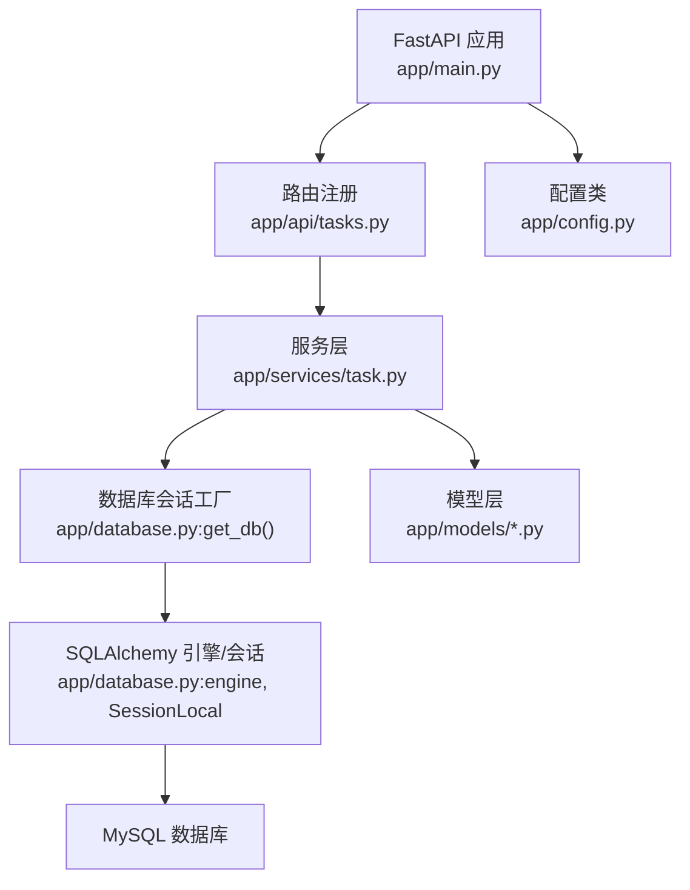
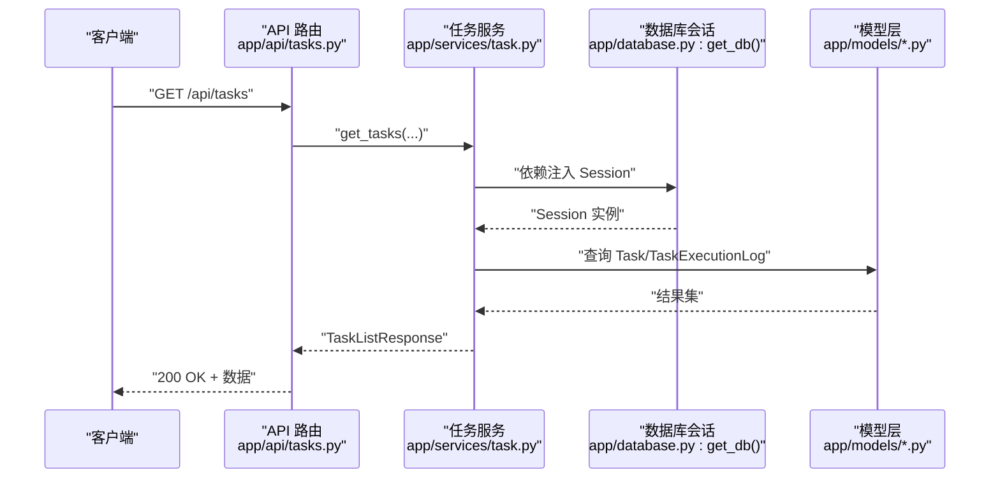
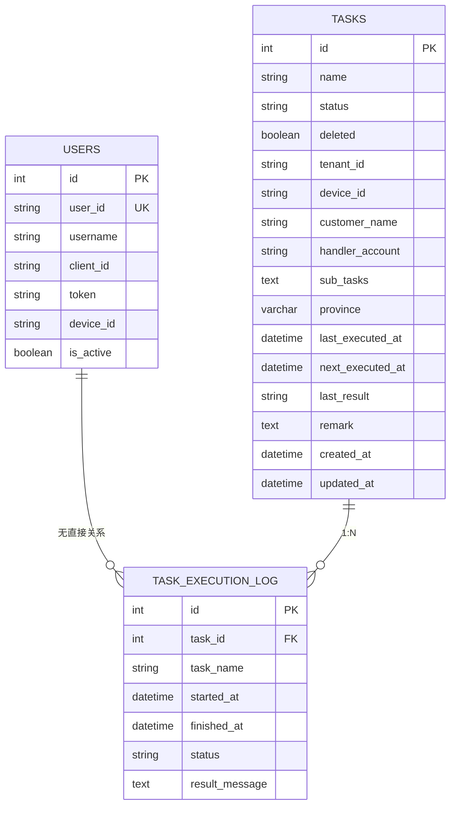
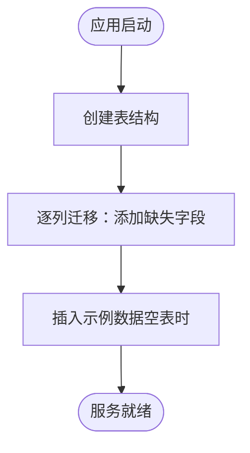
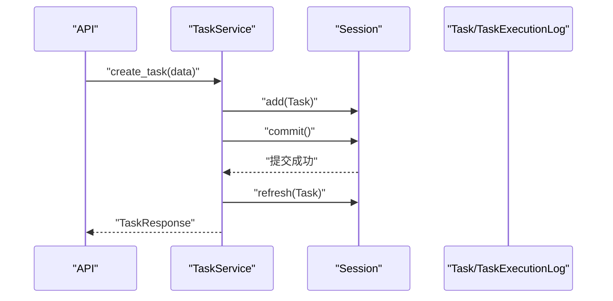
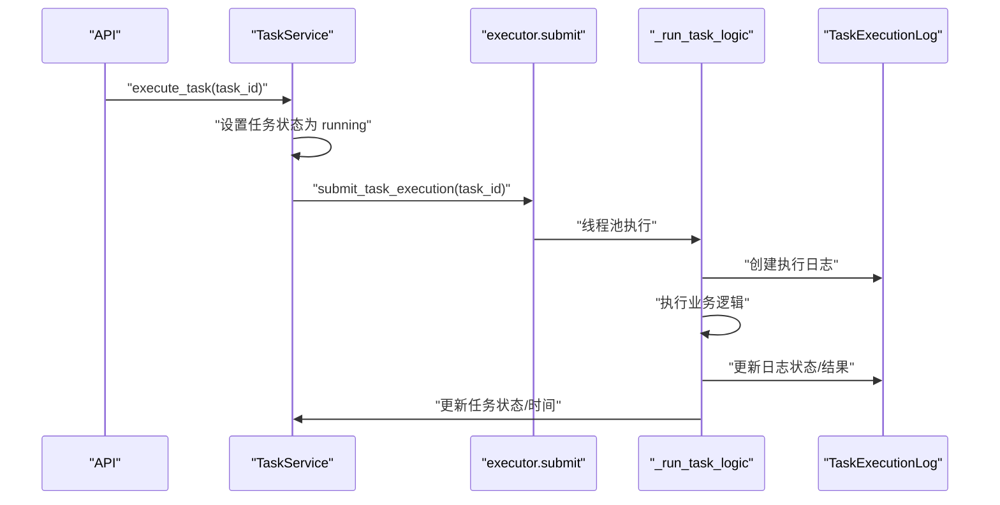
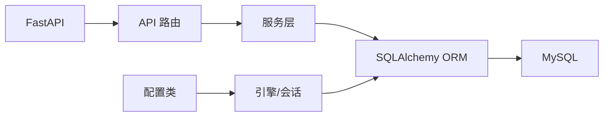

# 数据持久化

<cite>
**本文档引用的文件**
- [app/main.py](file://CCC_RPA_API/app/main.py)
- [app/database.py](file://CCC_RPA_API/app/database.py)
- [app/config.py](file://CCC_RPA_API/app/config.py)
- [app/models/base.py](file://CCC_RPA_API/app/models/base.py)
- [app/models/task.py](file://CCC_RPA_API/app/models/task.py)
- [app/models/user.py](file://CCC_RPA_API/app/models/user.py)
- [app/models/execution_log.py](file://CCC_RPA_API/app/models/execution_log.py)
- [app/api/tasks.py](file://CCC_RPA_API/app/api/tasks.py)
- [app/services/task.py](file://CCC_RPA_API/app/services/task.py)
- [app/services/executor.py](file://CCC_RPA_API/app/services/executor.py)
- [requirements.txt](file://CCC_RPA_API/requirements.txt)
</cite>

## 目录
1. [简介](#简介)
2. [项目结构](#项目结构)
3. [核心组件](#核心组件)
4. [架构总览](#架构总览)
5. [详细组件分析](#详细组件分析)
6. [依赖分析](#依赖分析)
7. [性能考虑](#性能考虑)
8. [故障排查指南](#故障排查指南)
9. [结论](#结论)
10. [附录](#附录)

## 简介
本文件面向“数据持久化”主题，系统梳理后端服务的数据层设计与实现，覆盖以下方面：
- 关系型数据库 MySQL 的设计与实现：核心业务表结构、索引策略与约束关系
- 缓存与会话：当前仓库未发现 Redis 缓存实现，仅记录现状与建议
- 加密存储：当前仓库未发现 AES 加密实现，仅记录现状与建议
- 数据模型设计原则：实体关系映射、数据验证规则与业务约束
- 数据访问模式：ORM 使用、查询优化与事务管理
- 数据迁移与备份：数据库迁移脚本、定期备份与灾难恢复
- 数据安全与隐私保护：当前仓库未发现专门实现，仅记录现状与建议

## 项目结构
后端采用 FastAPI + SQLAlchemy 2.x + MySQL 的典型三层架构：
- 应用入口与生命周期：应用启动时创建表结构、执行列迁移、插入示例数据
- 数据库连接与会话：通过配置类生成连接字符串，使用会话工厂提供请求级会话
- 模型层：基于 DeclarativeBase 的 ORM 映射，抽象基类统一时间戳字段
- 服务层：封装业务逻辑，负责数据转换、事务提交与错误处理
- API 层：定义 REST 接口，依赖注入数据库会话

图表来源
- [app/main.py:30-87](file://CCC_RPA_API/app/main.py#L30-L87)
- [app/api/tasks.py:10-76](file://CCC_RPA_API/app/api/tasks.py#L10-L76)
- [app/services/task.py:44-157](file://CCC_RPA_API/app/services/task.py#L44-L157)
- [app/database.py:1-19](file://CCC_RPA_API/app/database.py#L1-L19)
- [app/config.py:6-22](file://CCC_RPA_API/app/config.py#L6-L22)

章节来源
- [app/main.py:1-127](file://CCC_RPA_API/app/main.py#L1-L127)
- [app/database.py:1-19](file://CCC_RPA_API/app/database.py#L1-L19)
- [app/config.py:1-22](file://CCC_RPA_API/app/config.py#L1-L22)

## 核心组件
- 配置与连接
  - 配置类读取环境变量，生成数据库连接字符串
  - 引擎启用连接池预检查与回收策略
- 基类模型
  - 统一创建与更新时间戳字段，减少重复代码
- 业务模型
  - 用户表：唯一标识、用户名、令牌等
  - 任务表：名称、状态、租户/设备/客户/经办人等维度、JSON 子任务、省/地区、下次执行时间等
  - 执行日志表：任务执行的开始/结束时间、状态、结果消息
- 服务与 API
  - 任务服务封装 CRUD、分页、执行与日志查询
  - API 路由暴露 REST 接口，并进行 404/400 错误处理

章节来源
- [app/config.py:6-22](file://CCC_RPA_API/app/config.py#L6-L22)
- [app/database.py:1-19](file://CCC_RPA_API/app/database.py#L1-L19)
- [app/models/base.py:7-11](file://CCC_RPA_API/app/models/base.py#L7-L11)
- [app/models/user.py:7-17](file://CCC_RPA_API/app/models/user.py#L7-L17)
- [app/models/task.py:8-25](file://CCC_RPA_API/app/models/task.py#L8-L25)
- [app/models/execution_log.py:7-17](file://CCC_RPA_API/app/models/execution_log.py#L7-L17)
- [app/services/task.py:44-157](file://CCC_RPA_API/app/services/task.py#L44-L157)
- [app/api/tasks.py:10-76](file://CCC_RPA_API/app/api/tasks.py#L10-L76)

## 架构总览
下图展示从 API 请求到数据库的调用链路，以及启动阶段的表创建与迁移。

图表来源
- [app/api/tasks.py:13-15](file://CCC_RPA_API/app/api/tasks.py#L13-L15)
- [app/services/task.py:47-64](file://CCC_RPA_API/app/services/task.py#L47-L64)
- [app/database.py:13-19](file://CCC_RPA_API/app/database.py#L13-L19)
- [app/models/task.py:8-25](file://CCC_RPA_API/app/models/task.py#L8-L25)
- [app/models/execution_log.py:7-17](file://CCC_RPA_API/app/models/execution_log.py#L7-L17)

## 详细组件分析

### 数据库设计与实现
- 表结构与字段
  - 用户表：自增主键、唯一 user_id、用户名、client_id、token、device_id、激活状态
  - 任务表：自增主键、名称（带索引）、状态（带索引）、删除标记（带索引）、省/地区、租户/设备/客户/经办人、子任务 JSON、最近/下次执行时间、备注
  - 执行日志表：自增主键、任务 ID（带索引）、任务名、开始/结束时间、状态、结果消息
- 索引策略
  - 名称、状态、删除标记在任务表上建立索引，提升搜索与筛选效率
  - 任务 ID 在执行日志表上建立索引，支持按任务快速检索日志
- 约束关系
  - 执行日志外键关联任务表（通过 task_id），保证日志与任务的一致性
- 时间戳
  - 基类统一提供创建与更新时间戳，默认值与更新触发器由数据库驱动

图表来源
- [app/models/user.py:7-17](file://CCC_RPA_API/app/models/user.py#L7-L17)
- [app/models/task.py:8-25](file://CCC_RPA_API/app/models/task.py#L8-L25)
- [app/models/execution_log.py:7-17](file://CCC_RPA_API/app/models/execution_log.py#L7-L17)
- [app/models/base.py:7-11](file://CCC_RPA_API/app/models/base.py#L7-L11)

章节来源
- [app/models/user.py:7-17](file://CCC_RPA_API/app/models/user.py#L7-L17)
- [app/models/task.py:8-25](file://CCC_RPA_API/app/models/task.py#L8-L25)
- [app/models/execution_log.py:7-17](file://CCC_RPA_API/app/models/execution_log.py#L7-L17)
- [app/models/base.py:7-11](file://CCC_RPA_API/app/models/base.py#L7-L11)

### 启动与迁移
- 启动时创建基础表结构
- 动态迁移：逐列添加缺失字段（如 predecessor_id、sub_tasks、province、customer_name、handler_account、tenant_id、device_id），兼容历史版本
- 初始化示例数据：若表为空则插入若干示例任务

图表来源
- [app/main.py:37-102](file://CCC_RPA_API/app/main.py#L37-L102)

章节来源
- [app/main.py:37-102](file://CCC_RPA_API/app/main.py#L37-L102)

### 数据访问模式与事务管理
- 依赖注入会话：每个请求通过依赖注入获取独立会话，确保线程安全与资源释放
- 事务边界：服务方法内显式 commit，刷新对象状态；异常时保持一致性
- 查询优化：
  - 使用索引字段进行过滤与排序（名称、状态、删除标记、任务 ID）
  - 分页查询使用 offset/limit，避免一次性加载大量数据
- 数据转换：服务层将 JSON 字符串与 Pydantic 模型互转，保证接口稳定性

图表来源
- [app/api/tasks.py:18-20](file://CCC_RPA_API/app/api/tasks.py#L18-L20)
- [app/services/task.py:74-88](file://CCC_RPA_API/app/services/task.py#L74-L88)
- [app/database.py:13-19](file://CCC_RPA_API/app/database.py#L13-L19)

章节来源
- [app/api/tasks.py:13-76](file://CCC_RPA_API/app/api/tasks.py#L13-L76)
- [app/services/task.py:44-157](file://CCC_RPA_API/app/services/task.py#L44-L157)
- [app/database.py:13-19](file://CCC_RPA_API/app/database.py#L13-L19)

### 任务执行与日志
- 执行流程：服务层设置任务状态为运行中并提交；异步线程池执行真实业务逻辑
- 日志记录：执行前创建执行日志记录，完成后更新状态与结果消息
- 异常处理：捕获异常，回写任务与日志状态，广播错误消息

图表来源
- [app/api/tasks.py:47-52](file://CCC_RPA_API/app/api/tasks.py#L47-L52)
- [app/services/task.py:120-133](file://CCC_RPA_API/app/services/task.py#L120-L133)
- [app/services/executor.py:306-308](file://CCC_RPA_API/app/services/executor.py#L306-L308)
- [app/models/execution_log.py:7-17](file://CCC_RPA_API/app/models/execution_log.py#L7-L17)

章节来源
- [app/services/executor.py:68-304](file://CCC_RPA_API/app/services/executor.py#L68-L304)
- [app/services/task.py:120-133](file://CCC_RPA_API/app/services/task.py#L120-L133)

### 缓存系统（现状与建议）
- 现状：当前仓库未发现 Redis 缓存实现
- 建议：
  - 统一 Key 设计：采用命名空间前缀区分业务域，如 “cache:task:{id}:detail”
  - 缓存策略：热点数据使用 LRU，长尾数据使用 LFU；对强一致场景禁用缓存或采用写后失效
  - 过期机制：为不同业务设置差异化 TTL；对重要数据采用“惰性过期 + 主动刷新”结合
  - 一致性：读写路径增加缓存一致性校验，必要时采用分布式锁

### 加密存储（现状与建议）
- 现状：当前仓库未发现 AES 加密实现
- 建议：
  - 密钥管理：使用密钥管理系统（KMS）或环境变量注入，定期轮换；禁止明文存储
  - 数据加密：对敏感字段（如 token、设备信息）进行对称加密；采用随机 IV 与 HMAC 校验
  - 解密流程：在入库前解密并校验完整性，存储时再加密；严格控制解密范围

### 数据安全与隐私保护（现状与建议）
- 现状：当前仓库未发现专门的安全与隐私实现
- 建议：
  - 访问控制：基于角色的权限控制（RBAC），最小权限原则
  - 数据脱敏：导出与日志中对敏感字段进行脱敏显示
  - 传输安全：强制 HTTPS/TLS；WebSocket 使用 WSS
  - 审计日志：记录关键数据变更与访问行为

## 依赖分析
- 外部依赖
  - FastAPI：Web 框架与路由
  - SQLAlchemy 2.x：ORM 与数据库连接
  - PyMySQL：MySQL 驱动
  - cryptography：加密算法支持
  - pydantic-settings/python-dotenv：配置管理
- 内部模块耦合
  - API 层依赖服务层；服务层依赖模型层与数据库会话；配置类贯穿全局

图表来源
- [requirements.txt:1-11](file://CCC_RPA_API/requirements.txt#L1-L11)
- [app/main.py:24-27](file://CCC_RPA_API/app/main.py#L24-L27)
- [app/database.py:1-19](file://CCC_RPA_API/app/database.py#L1-L19)
- [app/config.py:6-22](file://CCC_RPA_API/app/config.py#L6-L22)

章节来源
- [requirements.txt:1-11](file://CCC_RPA_API/requirements.txt#L1-L11)
- [app/main.py:24-27](file://CCC_RPA_API/app/main.py#L24-L27)

## 性能考虑
- 连接池与回收：启用 pool_pre_ping 与合理 pool_recycle，降低连接失效导致的异常
- 查询优化：利用索引字段进行过滤与排序；分页查询限制单页大小
- 事务粒度：尽量缩短事务持续时间，避免在事务中执行耗时操作
- 异步执行：任务执行放入线程池，避免阻塞 Web 服务器事件循环

## 故障排查指南
- 连接问题
  - 检查 DATABASE_URL 是否正确；确认网络可达与账号密码有效
- 表结构不一致
  - 查看启动日志中的迁移提示；确认迁移语句执行成功
- 404/400 错误
  - API 层对不存在资源返回 404，对非法参数返回 400；根据错误信息定位问题
- 任务执行异常
  - 查看执行日志表的状态与结果消息；关注广播的错误事件

章节来源
- [app/main.py:85-86](file://CCC_RPA_API/app/main.py#L85-L86)
- [app/api/tasks.py:26-43](file://CCC_RPA_API/app/api/tasks.py#L26-L43)
- [app/services/executor.py:275-300](file://CCC_RPA_API/app/services/executor.py#L275-L300)

## 结论
本项目采用标准的 FastAPI + SQLAlchemy + MySQL 方案，具备清晰的模型层、服务层与 API 层划分。启动阶段自动建表与列迁移提升了兼容性；服务层承担了数据转换与事务管理职责。当前仓库未实现 Redis 缓存与 AES 加密，亦未发现专门的数据安全与隐私保护实现，后续可在现有架构基础上扩展缓存与加密模块，并完善安全策略与审计能力。

## 附录
- 数据迁移与备份建议
  - 迁移：使用 Alembic 或 Flyway 管理结构与数据迁移；每次变更纳入版本控制
  - 备份：采用逻辑备份（mysqldump）与物理备份相结合；定期验证恢复流程
  - 灾难恢复：制定 RPO/RTO 指标；异地容灾与自动化切换演练
- 数据模型设计原则
  - 实体关系：明确主从关系与外键约束；避免 N+1 查询
  - 数据验证：Pydantic 模型用于输入校验；数据库层面设置非空与长度约束
  - 业务约束：通过状态机与业务规则保证数据一致性